# Claude-Flow Python Port - Advanced Design

## Overview

Claude-Flow is an enterprise-grade AI agent orchestration platform that enables revolutionary AI-powered development workflows through hive-mind swarm intelligence, neural pattern recognition, and comprehensive MCP (Model Context Protocol) tool integration. This design outlines the comprehensive strategy for enhancing and completing the existing Python port while maintaining full feature parity with the TypeScript implementation.

The Python port must preserve Claude-Flow's core value propositions: seamless AI orchestration, intelligent agent coordination, persistent memory systems, and enterprise-grade reliability while leveraging Python's strengths in AI/ML ecosystems.

## Technology Stack & Dependencies

### Core Framework
- **Python 3.8+** (3.11+ recommended for optimal performance)
- **Asyncio** for asynchronous agent coordination and event handling
- **Click** for advanced CLI interface with nested command groups
- **Rich** for beautiful console output and real-time progress visualization
- **Pydantic** for robust data validation and configuration management

### Agent & AI Integration
- **Anthropic SDK** for Claude AI integration and API communication
- **WebSockets** for real-time MCP server communication
- **aiohttp** for asynchronous HTTP operations and web services
- **NumPy/PyTorch** for neural network acceleration and pattern recognition

### Data & Persistence
- **SQLite3** with async support for lightweight memory persistence
- **asyncpg/SQLAlchemy** for PostgreSQL enterprise database integration
- **Redis** for distributed caching and session management
- **YAML/JSON** for configuration and data serialization

### Enterprise Features
- **Docker SDK** for containerized deployment and orchestration
- **Kubernetes Client** for enterprise cluster management
- **Prometheus Client** for metrics collection and monitoring
- **Logging Framework** with structured output and distributed tracing

## Architecture

### System Architecture Overview

```mermaid
graph TB
    subgraph "Python Claude-Flow Architecture"
        CLI[CLI Interface<br/>Click-based Commands]
        Core[Core Framework<br/>Config, Events, Logging]
        
        subgraph "Agent Orchestration Layer"
            Queen[Queen Agent<br/>Master Coordinator]
            Workers[Worker Agents<br/>Specialized Tasks]
            Hive[Hive-Mind<br/>Persistent Sessions]
        end
        
        subgraph "Intelligence Layer"
            Neural[Neural Networks<br/>Pattern Recognition]
            Memory[Memory System<br/>SQLite + Redis]
            MCP[MCP Integration<br/>87 Tools]
        end
        
        subgraph "Enterprise Layer"
            Monitor[Monitoring<br/>Metrics & Health]
            Deploy[Deployment<br/>Docker + K8s]
            Security[Security<br/>Auth & Audit]
        end
        
        subgraph "External Integrations"
            Claude[Claude AI<br/>Anthropic API]
            GitHub[GitHub<br/>Repository Ops]
            Docker[Docker<br/>Containers]
        end
    end
    
    CLI --> Core
    Core --> Queen
    Queen --> Workers
    Workers --> Hive
    Hive --> Neural
    Neural --> Memory
    Memory --> MCP
    MCP --> Monitor
    Monitor --> Deploy
    Deploy --> Security
    Security --> Claude
    Claude --> GitHub
    GitHub --> Docker
```

### Component Architecture

| Component | Purpose | Implementation Strategy |
|-----------|---------|------------------------|
| **CLI Interface** | Command-line entry point with nested commands | Click framework with command groups |
| **Core Framework** | Configuration, events, logging foundation | Async-first design with Pydantic validation |
| **Agent System** | Multi-agent coordination and lifecycle | Actor model with asyncio tasks |
| **Hive-Mind** | Persistent session management | SQLite sessions with state recovery |
| **Neural Networks** | Pattern recognition and learning | PyTorch with CUDA acceleration |
| **Memory System** | Persistent and distributed storage | Multi-tier: SQLite + Redis + PostgreSQL |
| **MCP Integration** | Tool discovery and execution | WebSocket client with async handlers |
| **Monitoring** | Health checks and performance metrics | Prometheus metrics with Rich dashboards |

## Component Architecture

### Core Framework Design

#### Configuration Management System
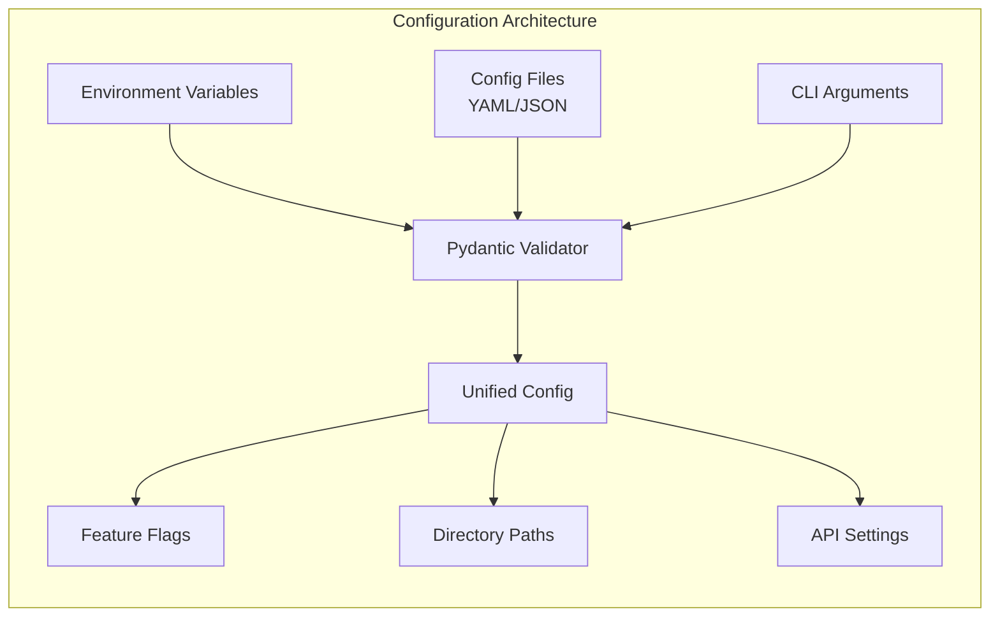

The configuration system provides hierarchical configuration management with environment variable precedence, file-based defaults, and CLI overrides. Pydantic models ensure type safety and validation.

#### Event Bus Architecture
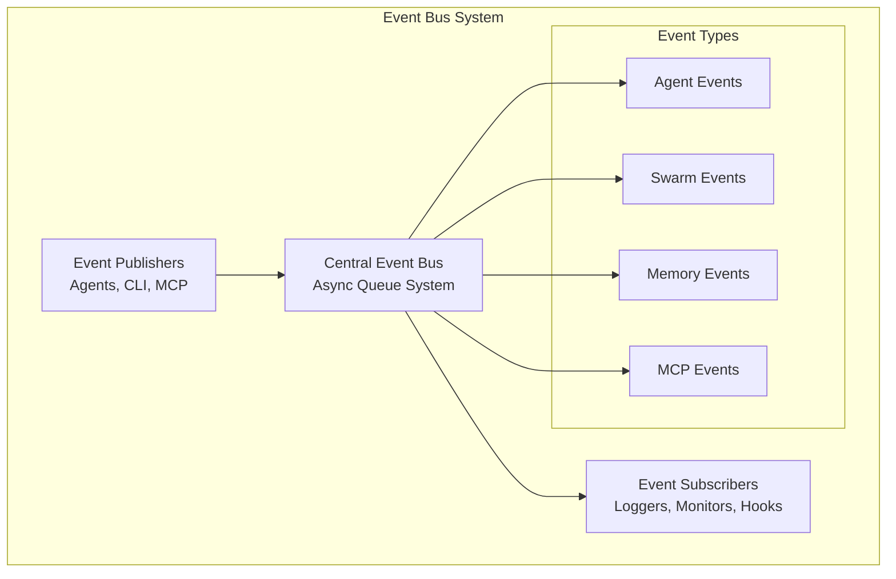

### Agent Orchestration Design

#### Hive-Mind Coordination Model
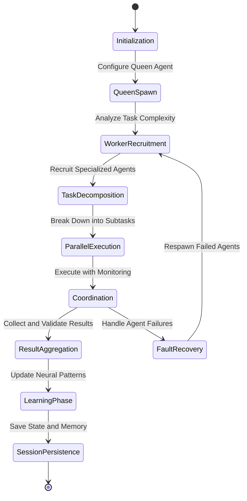

#### Agent Specialization Matrix

| Agent Type | Capabilities | Use Cases | Resource Requirements |
|------------|-------------|-----------|---------------------|
| **Queen Agent** | Task coordination, decision making, resource allocation | Master orchestration, conflict resolution | High CPU, Medium Memory |
| **Architect Agent** | System design, technical planning, architecture review | Design patterns, scalability planning | Medium CPU, High Memory |
| **Coder Agent** | Code generation, refactoring, implementation | Feature development, bug fixes | Medium CPU, Medium Memory |
| **Tester Agent** | Test generation, quality assurance, validation | Unit testing, integration testing | Low CPU, Low Memory |
| **Researcher Agent** | Information gathering, analysis, documentation | Requirements research, technology evaluation | Low CPU, High Memory |
| **Security Agent** | Security scanning, compliance checking, audit | Vulnerability assessment, code security | Medium CPU, Medium Memory |
| **DevOps Agent** | Deployment, infrastructure, monitoring | CI/CD pipelines, container orchestration | High CPU, Low Memory |

### Memory System Design

#### Multi-Tier Memory Architecture
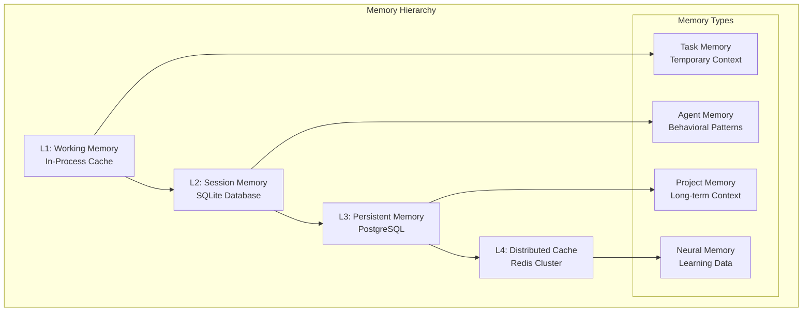

#### Memory Schema Design

| Table | Purpose | Retention | Access Pattern |
|-------|---------|-----------|----------------|
| **sessions** | Active session tracking | Until completion | High frequency read/write |
| **agents** | Agent configurations and state | Persistent | Medium frequency read |
| **tasks** | Task definitions and progress | 30 days | High frequency read/write |
| **memories** | Contextual information storage | 90 days | Medium frequency read |
| **patterns** | Neural learning patterns | Persistent | Low frequency write, medium read |
| **performance** | Execution metrics and timing | 7 days | High frequency write, low read |
| **events** | Event history and audit logs | 30 days | High frequency write, low read |
| **configurations** | Dynamic configuration settings | Persistent | Low frequency read/write |

### Neural Network Integration

#### Pattern Recognition Engine
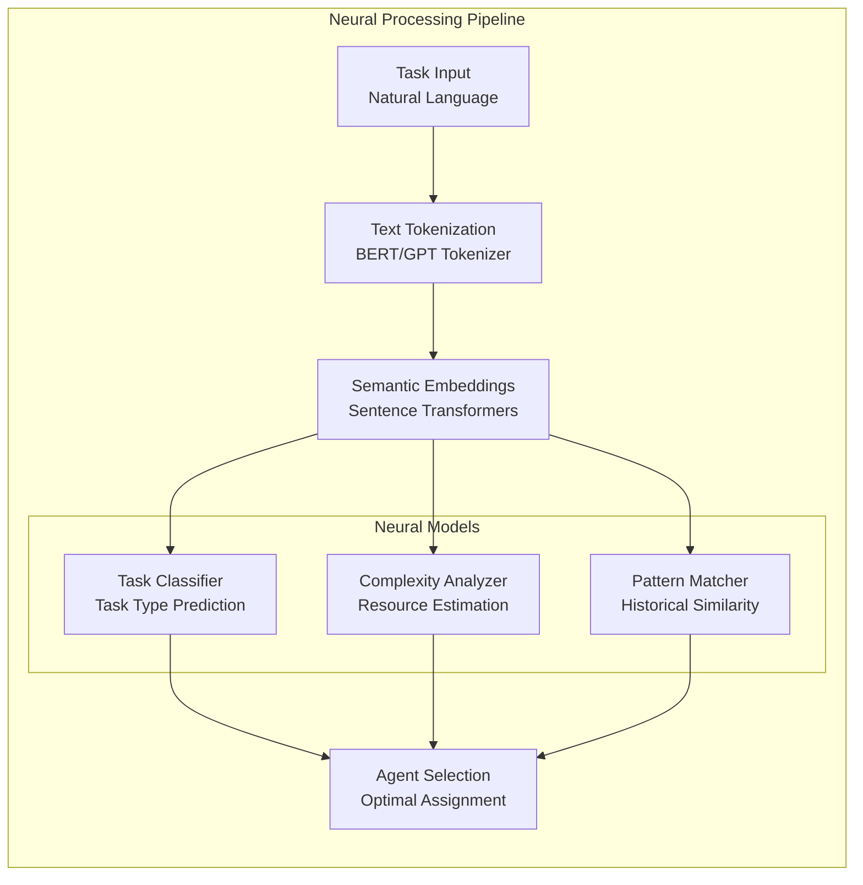

#### Learning and Adaptation System

| Component | Purpose | Algorithm | Update Frequency |
|-----------|---------|-----------|------------------|
| **Task Classifier** | Categorize incoming tasks | Transformer-based classification | After each task completion |
| **Complexity Estimator** | Predict resource requirements | Gradient boosting regression | Daily batch update |
| **Pattern Matcher** | Find similar historical tasks | Cosine similarity with embeddings | Real-time query |
| **Agent Optimizer** | Improve agent assignments | Reinforcement learning | Weekly optimization |
| **Performance Predictor** | Estimate completion time | Time series forecasting | Continuous learning |

### MCP Tool Integration

#### Tool Discovery and Management
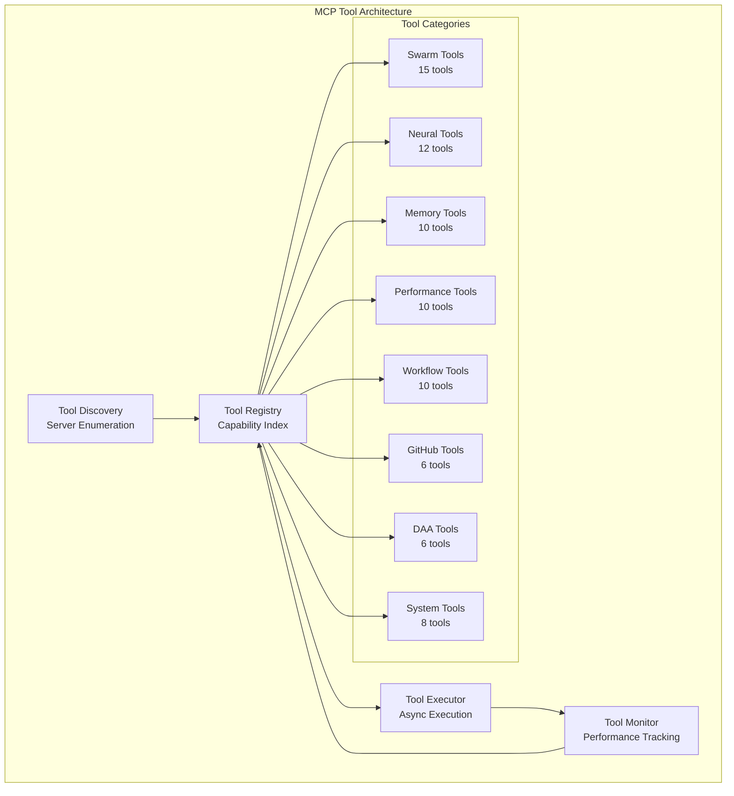

#### Tool Execution Pipeline

| Phase | Purpose | Implementation | Error Handling |
|-------|---------|----------------|----------------|
| **Discovery** | Find available MCP servers | WebSocket scanning | Graceful degradation |
| **Validation** | Verify tool capabilities | Schema validation | Skip invalid tools |
| **Selection** | Choose optimal tools | Capability matching | Fallback alternatives |
| **Execution** | Run tools asynchronously | Async task management | Retry with backoff |
| **Monitoring** | Track performance metrics | Real-time monitoring | Alert on failures |
| **Caching** | Cache results and metadata | Redis-based caching | TTL-based expiration |

## CLI Interface Design

### Command Structure Hierarchy
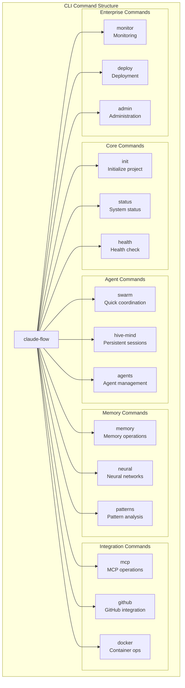

### Command Implementation Strategy

#### Core Commands Implementation
| Command | Purpose | Parameters | Output Format |
|---------|---------|------------|---------------|
| `init` | Project initialization | `--force`, `--template`, `--neural` | Progress bars, success messages |
| `status` | System status overview | `--verbose`, `--json`, `--watch` | Rich tables, status indicators |
| `health` | Health diagnostics | `--deep`, `--fix`, `--report` | Health dashboard, recommendations |

#### Agent Orchestration Commands
| Command | Purpose | Parameters | Output Format |
|---------|---------|------------|---------------|
| `swarm coordinate` | Quick task coordination | `--task`, `--agents`, `--strategy` | Real-time progress, results |
| `hive-mind spawn` | Create persistent session | `--objective`, `--agents`, `--persist` | Session ID, agent assignments |
| `agents list` | Show active agents | `--status`, `--performance`, `--detailed` | Agent table, performance metrics |

#### Memory and Learning Commands
| Command | Purpose | Parameters | Output Format |
|---------|---------|------------|---------------|
| `memory query` | Search memory | `--query`, `--namespace`, `--recent` | Relevant memories, confidence scores |
| `neural train` | Train models | `--pattern`, `--data`, `--epochs` | Training progress, validation metrics |
| `patterns analyze` | Analyze patterns | `--type`, `--timeframe`, `--insights` | Pattern visualizations, insights |

## Data Models & Persistence

### Database Schema Design

#### Core Entity Models
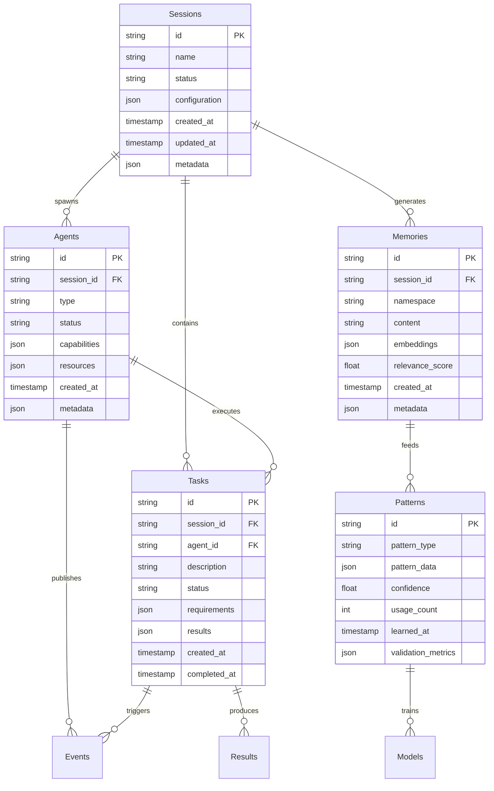

#### Configuration and Performance Models
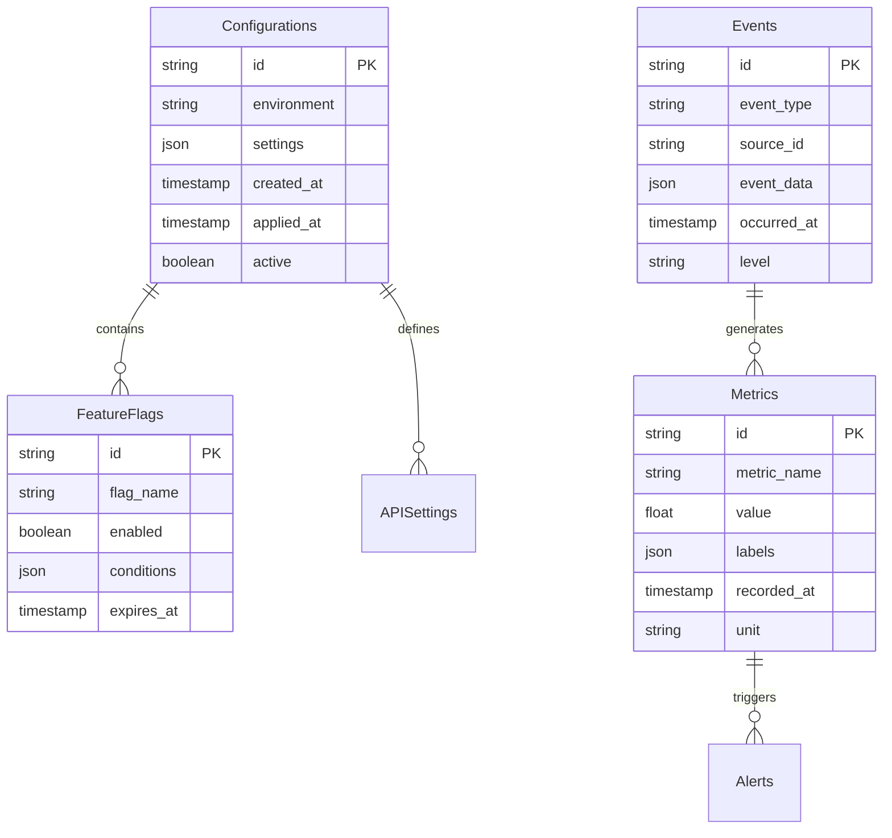

### Data Access Layer Design

#### Repository Pattern Implementation
| Repository | Responsibilities | Caching Strategy | Consistency Level |
|------------|------------------|------------------|-------------------|
| **SessionRepository** | Session CRUD, state management | Redis with 1-hour TTL | Strong consistency |
| **AgentRepository** | Agent lifecycle, capability queries | In-memory with 5-min TTL | Eventual consistency |
| **TaskRepository** | Task tracking, progress updates | No caching (real-time) | Strong consistency |
| **MemoryRepository** | Memory storage, semantic search | Redis with 24-hour TTL | Eventual consistency |
| **PatternRepository** | Pattern storage, learning data | PostgreSQL only | Strong consistency |
| **MetricsRepository** | Performance data, analytics | Time-series DB | Eventual consistency |

#### Data Validation and Serialization
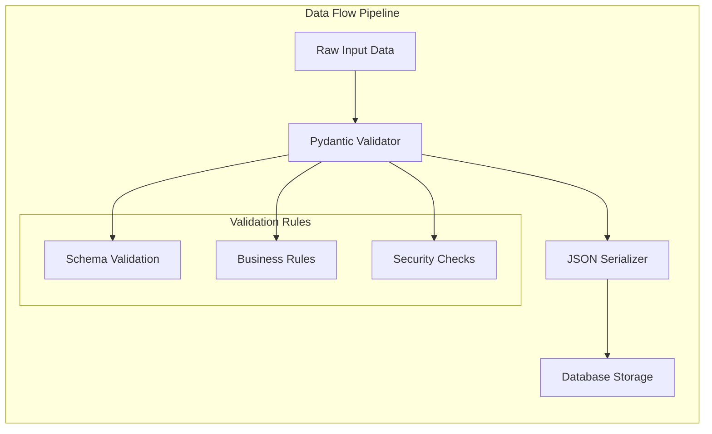

## Business Logic Layer

### Task Orchestration Engine

#### Task Decomposition Strategy
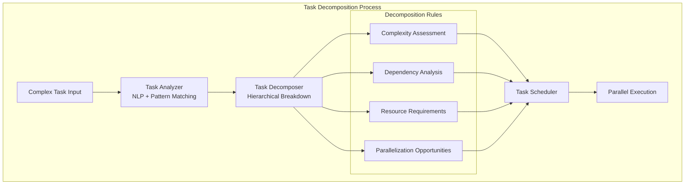

#### Agent Assignment Algorithm
| Factor | Weight | Calculation Method | Update Frequency |
|--------|--------|--------------------|------------------|
| **Agent Capability Match** | 40% | Cosine similarity of capability vectors | Real-time |
| **Historical Performance** | 25% | Exponentially weighted moving average | After each task |
| **Current Workload** | 20% | Active task count and resource usage | Real-time |
| **Specialization Score** | 10% | Domain expertise rating | Weekly recalculation |
| **Learning Potential** | 5% | Novelty of task for agent improvement | Daily analysis |

### Swarm Coordination Logic

#### Consensus and Decision Making
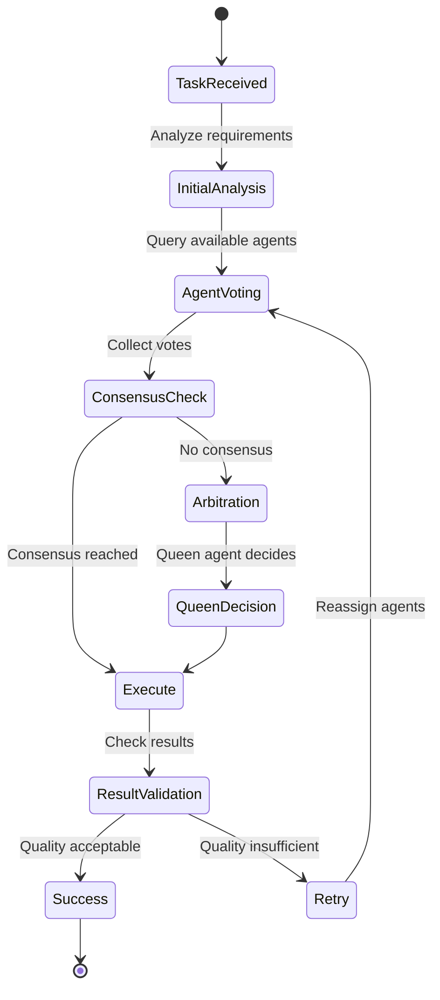

#### Resource Allocation Strategy
| Resource Type | Allocation Strategy | Monitoring Method | Scaling Trigger |
|---------------|-------------------|-------------------|-----------------|
| **CPU Cores** | Fair share with priority weighting | System metrics collection | >80% utilization |
| **Memory** | Dynamic allocation with limits | Memory usage tracking | >85% utilization |
| **Network I/O** | Bandwidth throttling with QoS | Connection monitoring | >500 concurrent connections |
| **Storage** | Tiered storage with compression | Disk usage analytics | >90% capacity |
| **GPU Compute** | Exclusive allocation for neural tasks | CUDA metrics | >95% utilization |

### Error Recovery and Fault Tolerance

#### Self-Healing Mechanisms
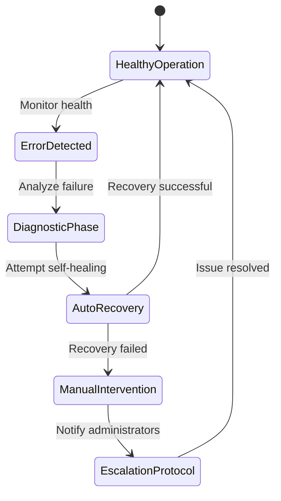

#### Fault Tolerance Strategies
| Failure Type | Detection Method | Recovery Strategy | Prevention Measure |
|--------------|------------------|-------------------|--------------------|
| **Agent Failure** | Heartbeat monitoring | Respawn with state recovery | Resource limits, health checks |
| **Network Partition** | Connection timeout | Graceful degradation | Circuit breaker pattern |
| **Memory Overflow** | Resource monitoring | Garbage collection, restart | Memory usage limits |
| **Database Failure** | Connection pooling | Fallback to cache | Database clustering |

## API Integration Layer

### Claude AI Integration

#### API Client Architecture
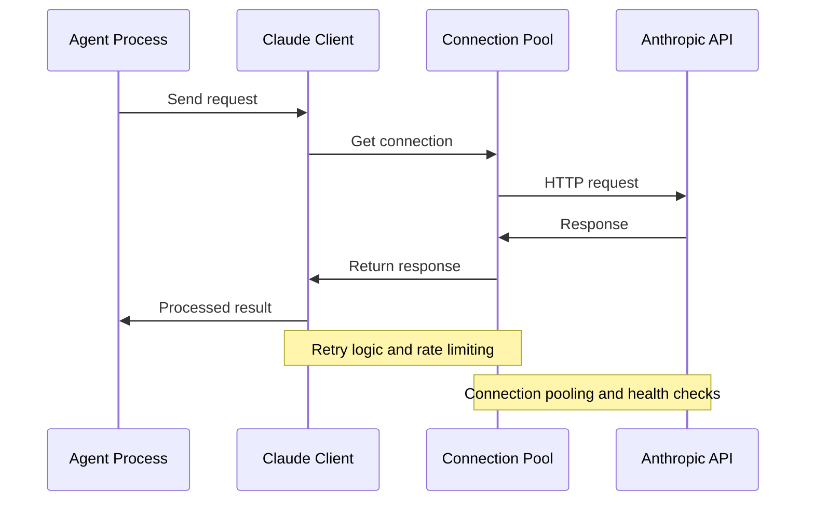

#### Request Management Strategy
| Feature | Implementation | Configuration | Monitoring |
|---------|----------------|---------------|------------|
| **Rate Limiting** | Token bucket algorithm | 50 requests/minute | Request queue depth |
| **Retry Logic** | Exponential backoff | Max 3 retries | Failure rate tracking |
| **Timeout Handling** | Progressive timeouts | 30s/60s/120s | Response time metrics |
| **Error Recovery** | Circuit breaker pattern | 5 failures trigger | Recovery success rate |
| **Response Caching** | LRU cache with TTL | 100MB cache, 1-hour TTL | Cache hit ratio |

### MCP Protocol Implementation

#### Protocol Stack Design
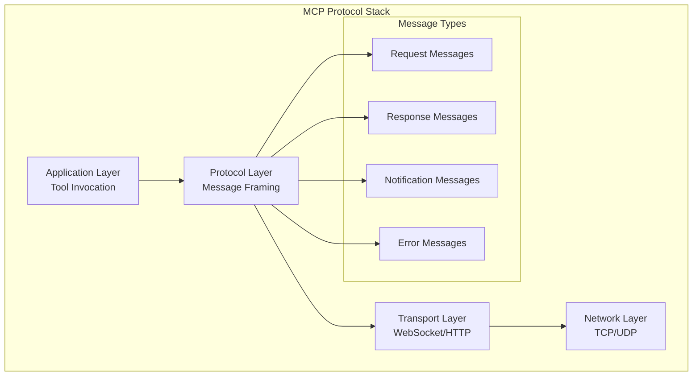

#### Tool Discovery and Execution
| Phase | Purpose | Implementation | Performance Target |
|-------|---------|--------------------|--------------------||
| **Discovery** | Find available tools | Async server scanning | <5 seconds |
| **Registration** | Register tool capabilities | Schema validation | <1 second |
| **Invocation** | Execute tool requests | Async task execution | <30 seconds |
| **Response** | Return execution results | JSON serialization | <1 second |
| **Monitoring** | Track tool performance | Metrics collection | Real-time |

### GitHub Integration

#### Repository Operations
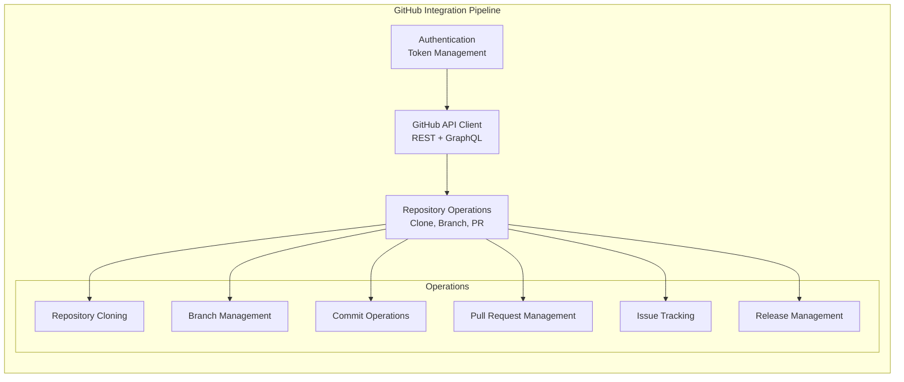

## Testing Strategy

### Test Architecture

#### Testing Pyramid Implementation
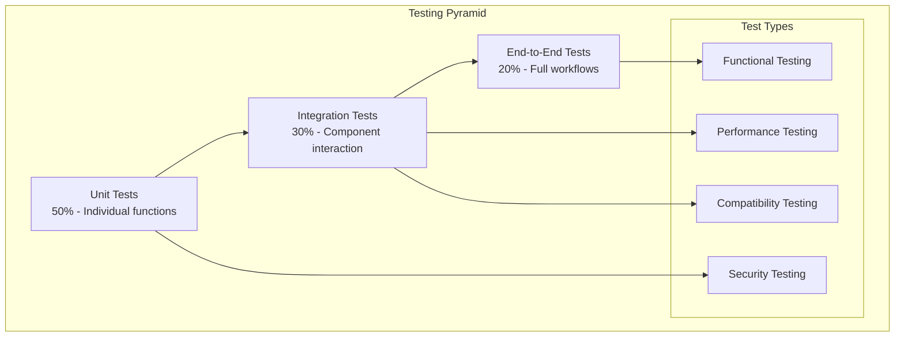

#### Test Categories and Coverage
| Test Category | Coverage Target | Automation Level | Execution Frequency |
|---------------|-----------------|------------------|--------------------||
| **Unit Tests** | >90% line coverage | Fully automated | Every commit |
| **Integration Tests** | >80% API coverage | Fully automated | Every PR |
| **Performance Tests** | Key workflows | Automated | Daily |
| **Security Tests** | Critical paths | Semi-automated | Weekly |
| **E2E Tests** | User journeys | Automated | Before release |

### Test Implementation Strategy

#### Unit Testing Framework
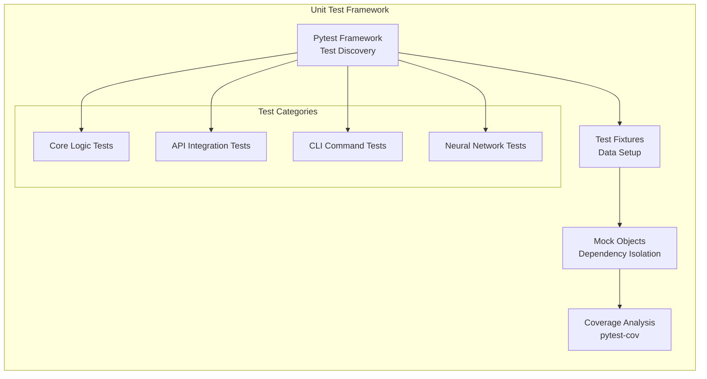

#### Performance Testing Strategy
| Metric | Target | Measurement Method | Alert Threshold |
|--------|---------|--------------------|------------------|
| **Response Time** | <2 seconds | Request timing | >5 seconds |
| **Throughput** | >100 RPS | Load testing | <50 RPS |
| **Memory Usage** | <512MB baseline | Memory profiling | >1GB |
| **CPU Utilization** | <70% average | System monitoring | >90% |
| **Agent Spawn Time** | <10 seconds | Process timing | >30 seconds |