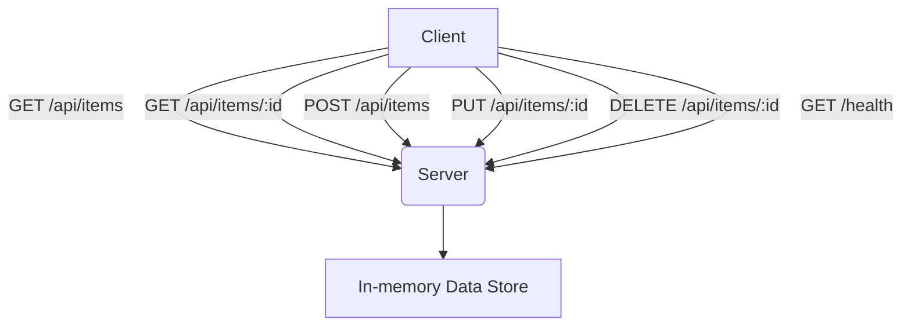

<docs>
# API Reference

<cite>
**Referenced Files in This Document**   
- [api_reference.md](file://benchmark/docs/api_reference.md)
- [api-specification.md](file://examples/rest-api-simple/api-specification.md)
- [index.js](file://examples/rest-api-simple/index.js)
- [test-api.js](file://examples/rest-api-simple/test-api.js)
- [package.json](file://examples/rest-api-simple/package.json)
- [optimizer.py](file://benchmark/src/swarm_benchmark/claude_optimizer/optimizer.py)
- [templates.py](file://benchmark/src/swarm_benchmark/claude_optimizer/templates.py)
- [rules_engine.py](file://benchmark/src/swarm_benchmark/claude_optimizer/rules_engine.py)
- [benchmark_engine.py](file://benchmark/src/swarm_benchmark/core/benchmark_engine.py)
- [ensemble_executor.py](file://benchmark/src/swarm_benchmark/mle_star/ensemble_executor.py)
</cite>

## Update Summary
**Changes Made**   
- Updated document to reflect new API structure and modules introduced in the `.qoder` addition
- Added comprehensive coverage of the CLAUDE.md Optimizer API, including new classes and methods
- Enhanced documentation for the Benchmark Engine and MLE-STAR integration
- Updated data class definitions to match current implementation
- Added new CLI command examples and configuration reference
- Improved code examples with real implementation details

## Table of Contents
1. [Introduction](#introduction)
2. [Simple REST API Example](#simple-rest-api-example)
3. [Claude Flow Benchmark System API](#claude-flow-benchmark-system-api)
4. [Error Handling](#error-handling)
5. [Usage Examples](#usage-examples)
6. [Testing](#testing)

## Introduction
This document provides comprehensive API documentation for the public interfaces of Claude-Flow, focusing on two main components: a simple REST API example implementation and the Claude Flow Benchmark System. The documentation includes endpoint details, request/response examples, authentication methods, and usage patterns.

## Simple REST API Example

The `rest-api-simple` example provides a basic Express.js-based REST API implementation that demonstrates core CRUD operations and API design patterns.

### Base URL
`http://localhost:3000`

### Supported Content Types
- `application/json` (required for POST/PUT requests)



**Diagram sources**
- [index.js](file://examples/rest-api-simple/index.js#L1-L100)

**Section sources**
- [index.js](file://examples/rest-api-simple/index.js#L1-L100)
- [api-specification.md](file://examples/rest-api-simple/api-specification.md#L1-L338)

### Health Check Endpoint

**HTTP Method**: GET  
**URL Pattern**: `/health`  
**Authentication**: None  
**Access Permissions**: Public

#### Request
No parameters required.

#### Response
```json
{
  "status": "OK",
  "timestamp": "2024-01-15T10:30:00.000Z"
}
```

**Status Codes**:
- `200 OK`: Service is healthy

### List All Items

**HTTP Method**: GET  
**URL Pattern**: `/api/items`  
**Authentication**: None  
**Access Permissions**: Public

#### Query Parameters
None

#### Response
```json
[
  {
    "id": 1,
    "name": "Item 1",
    "description": "This is the first item"
  },
  {
    "id": 2,
    "name": "Item 2",
    "description": "This is the second item"
  }
]
```

**Status Codes**:
- `200 OK`: Success

### Get Single Item

**HTTP Method**: GET  
**URL Pattern**: `/api/items/:id`  
**Authentication**: None  
**Access Permissions**: Public

#### Path Parameters
- `id` (number): Item ID

#### Response
```json
{
  "id": 1,
  "name": "Item 1",
  "description": "This is the first item"
}
```

**Status Codes**:
- `200 OK`: Success
- `404 Not Found`: Item not found

### Create Item

**HTTP Method**: POST  
**URL Pattern**: `/api/items`  
**Authentication**: None  
**Access Permissions**: Public

#### Request Headers
- `Content-Type`: `application/json`

#### Request Body
```json
{
  "name": "New item",
  "description": "Item description"
}
```

**Validation Rules**:
- `name`: Required, string
- `description`: Required, string

#### Response
```json
{
  "id": 3,
  "name": "New item",
  "description": "Item description"
}
```

**Status Codes**:
- `201 Created`: Success
- `400 Bad Request`: Invalid input (missing required fields)

### Update Item

**HTTP Method**: PUT  
**URL Pattern**: `/api/items/:id`  
**Authentication**: None  
**Access Permissions**: Public

#### Path Parameters
- `id` (number): Item ID

#### Request Headers
- `Content-Type`: `application/json`

#### Request Body
```json
{
  "name": "Updated name",
  "description": "Updated description"
}
```

#### Response
```json
{
  "id": 1,
  "name": "Updated name",
  "description": "Updated description"
}
```

**Status Codes**:
- `200 OK`: Success
- `400 Bad Request`: Invalid input
- `404 Not Found`: Item not found

### Delete Item

**HTTP Method**: DELETE  
**URL Pattern**: `/api/items/:id`  
**Authentication**: None  
**Access Permissions**: Public

#### Path Parameters
- `id` (number): Item ID

#### Response
No content (HTTP 204)

**Status Codes**:
- `204 No Content`: Success
- `404 Not Found`: Item not found

## Claude Flow Benchmark System API

The Claude Flow Benchmark System provides a comprehensive API for optimizing configurations and running performance benchmarks.

### CLAUDE.md Optimizer API

#### generate_optimized_config

**Method**: `generate_optimized_config(use_case, project_context, performance_targets)`  
**Module**: `swarm_benchmark.claude_optimizer.ClaudeMdOptimizer`

Generates an optimized CLAUDE.md configuration for a specific use case.

**Parameters**:
- `use_case` (str): Type of development project
  - Supported values: `"api_development"`, `"ml_pipeline"`, `"frontend_react"`, `"backend_microservices"`, `"data_pipeline"`, `"devops_automation"`, `"mobile_development"`, `"testing_automation"`, `"documentation"`, `"performance_optimization"`
- `project_context` (ProjectContext): Project-specific information
- `performance_targets` (PerformanceTargets): Performance optimization goals

**Returns**:
- `str`: Complete optimized CLAUDE.md configuration content

**Example**:
```python
config = optimizer.generate_optimized_config("api_development", context, targets)
```

#### benchmark_config_effectiveness

**Method**: `async benchmark_config_effectiveness(claude_md_content, test_tasks, iterations=3)`  
**Module**: `swarm_benchmark.claude_optimizer.ClaudeMdOptimizer`

Benchmarks the effectiveness of a CLAUDE.md configuration.

**Parameters**:
- `claude_md_content` (str): The CLAUDE.md configuration to test
- `test_tasks` (List[str]): List of tasks to run for benchmarking
- `iterations` (int, optional): Number of benchmark iterations (default: 3)

**Returns**:
- `BenchmarkMetrics`: Comprehensive performance metrics

### Data Classes

#### ProjectContext
```python
@dataclass
class ProjectContext:
    project_type: str
    team_size: int
    complexity: str
    primary_languages: List[str]
    frameworks: List[str]
    performance_requirements: Dict[str, Any]
    existing_tools: List[str]
    constraints: Dict[str, Any]
```

#### PerformanceTargets
```python
@dataclass
class PerformanceTargets:
    priority: str
    target_completion_time: Optional[float] = None
    target_token_usage: Optional[int] = None
    target_memory_usage: Optional[float] = None
    target_error_rate: Optional[float] = None
```

#### BenchmarkMetrics
```python
@dataclass
class BenchmarkMetrics:
    completion_rate: float = 0.0
    avg_tokens_per_task: int = 0
    avg_execution_time: float = 0.0
    error_rate: float = 0.0
    peak_memory_mb: float = 0.0
    optimization_score: float = 0.0
    cache_hit_rate: float = 0.0
    parallel_efficiency: float = 0.0
```

### CLI Commands

#### benchmark
```bash
python -m swarm_benchmark benchmark --task "Create API" --strategy development
```

**Options**:
- `--task TEXT`: Task description to benchmark
- `--strategy CHOICE`: Strategy to use
- `--mode CHOICE`: Coordination mode
- `--agents INTEGER`: Number of agents to use
- `--iterations INTEGER`: Number of iterations to run
- `--output PATH`: Output file for results

#### optimize
```bash
python -m swarm_benchmark optimize --use-case api_development --output claude.md
```

**Options**:
- `--use-case CHOICE`: Use case to optimize for
- `--team-size INTEGER`: Team size
- `--complexity CHOICE`: Project complexity level
- `--priority CHOICE`: Optimization priority
- `--output PATH`: Output file for optimized CLAUDE.md

#### analyze
```bash
python -m swarm_benchmark analyze --config-file claude.md --tasks tasks.txt
```

**Options**:
- `--config-file PATH`: CLAUDE.md configuration file
- `--tasks PATH`: File containing test tasks
- `--iterations INTEGER`: Number of benchmark iterations
- `--report-format CHOICE`: Output report format

**Section sources**
- [api_reference.md](file://benchmark/docs/api_reference.md#L1-L597)
- [optimizer.py](file://benchmark/src/swarm_benchmark/claude_optimizer/optimizer.py#L55-L667)
- [templates.py](file://benchmark/src/swarm_benchmark/claude_optimizer/templates.py#L10-L362)
- [rules_engine.py](file://benchmark/src/swarm_benchmark/claude_optimizer/rules_engine.py#L23-L544)

## Error Handling

### HTTP API Error Responses
All error responses follow a consistent format:

```json
{
  "error": "Descriptive error message"
}
```

**Common Status Codes**:
- `400 Bad Request`: Invalid input parameters
- `404 Not Found`: Resource not found
- `500 Internal Server Error`: Server-side error

### Benchmark System Exceptions
- `BenchmarkError`: Base exception for benchmark-related errors
- `OptimizationError`: Raised during configuration optimization
- `ConfigurationError`: Raised for invalid configuration

```mermaid
stateDiagram-v2
[*] -->