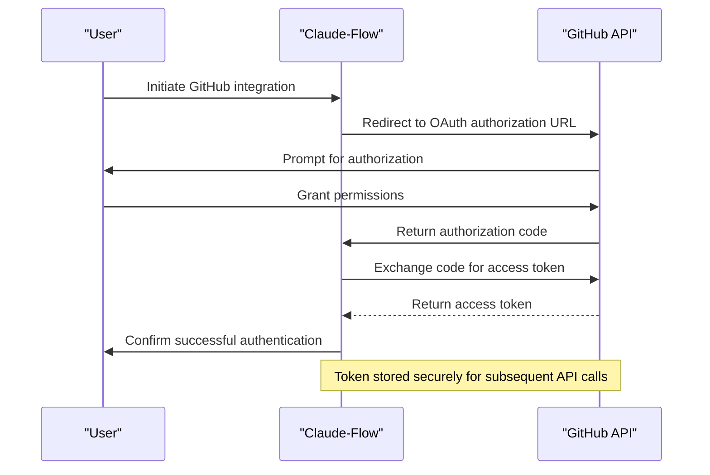
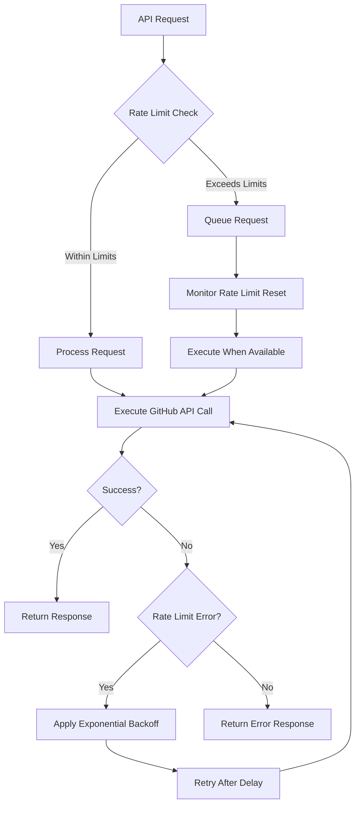
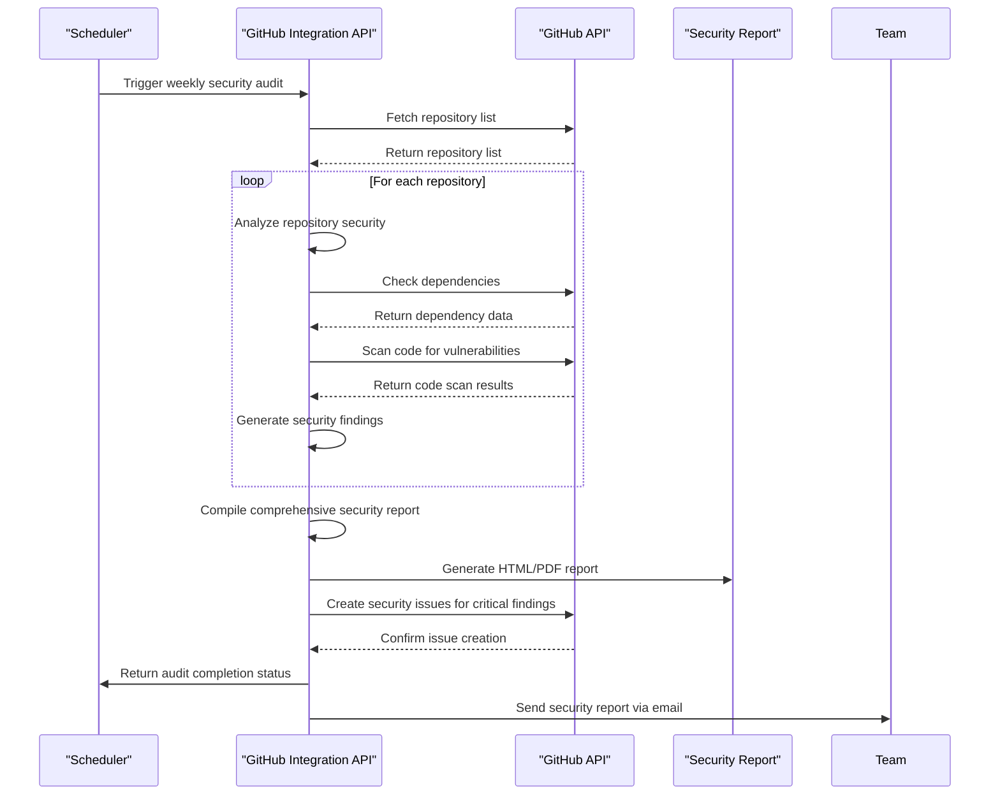
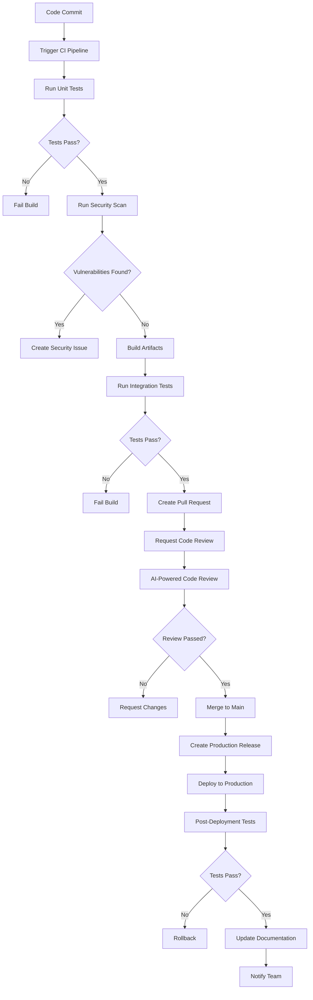
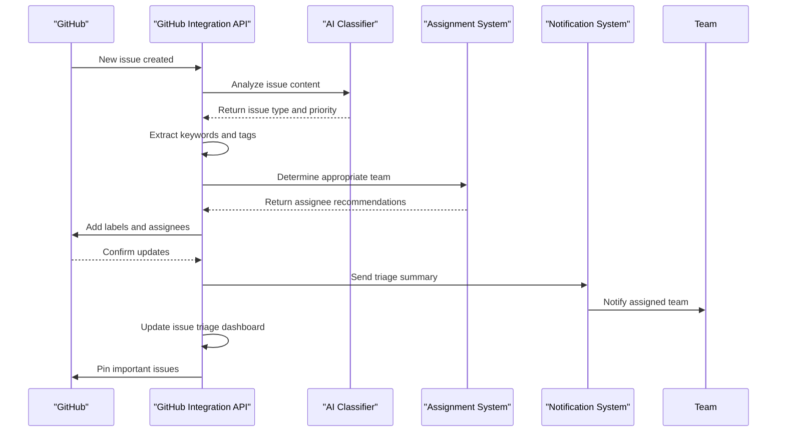

# GitHub Integration API

<cite>
**Referenced Files in This Document**   
- [README.md](file://README.md)
- [mcp.json](file://mcp.json)
- [src/mcp/claude-flow-tools.ts](file://src/mcp/claude-flow-tools.ts)
- [src/mcp/ruv-swarm-tools.ts](file://src/mcp/ruv-swarm-tools.ts)
- [src/mcp/tools.ts](file://src/mcp/tools.ts)
- [src/cli/commands/github.ts](file://src/cli/commands/github.ts)
</cite>

## Table of Contents
1. [Introduction](#introduction)
2. [Authentication and Authorization](#authentication-and-authorization)
3. [API Endpoints](#api-endpoints)
4. [Request and Response Examples](#request-and-response-examples)
5. [Error Handling](#error-handling)
6. [Rate Limiting and Caching](#rate-limiting-and-caching)
7. [Sample curl Commands](#sample-curl-commands)
8. [Integration Scenarios](#integration-scenarios)

## Introduction

The GitHub Integration API within Claude-Flow provides a comprehensive suite of tools for automating repository management, pull request handling, issue tracking, code review, release coordination, and workflow automation. This system leverages the Model Context Protocol (MCP) to expose 6 specialized GitHub tools that enable AI-powered development workflows with seamless integration into GitHub repositories.

The integration is designed to support enterprise-grade AI orchestration, allowing for intelligent automation of common GitHub operations through a combination of swarm intelligence and neural pattern recognition. The API enables developers to programmatically interact with GitHub repositories, manage pull requests, track issues, coordinate releases, automate workflows, and conduct security audits—all through a unified command interface.

**Section sources**
- [README.md](file://README.md#L400-L450)

## Authentication and Authorization

### GitHub OAuth Integration

The GitHub Integration API uses GitHub OAuth for secure authentication and authorization. Users must authenticate through GitHub's OAuth flow to grant the necessary permissions for repository access and operations.



**Diagram sources**
- [mcp.json](file://mcp.json)
- [src/mcp/auth.ts](file://src/mcp/auth.ts)

### Required Permission Scopes

The GitHub Integration API requires specific permission scopes to perform various operations. These scopes are requested during the OAuth authorization process:

- **repo**: Full control of private repositories
  - *Required for*: Repository analysis, code review, PR management
- **public_repo**: Access to public repositories
  - *Required for*: Public repository analysis and issue tracking
- **read:org**: Read organization, teams, and membership data
  - *Required for*: Organization-level repository management
- **repo:status**: Access commit status
  - *Required for*: CI/CD workflow automation
- **repo_deployment**: Access deployment status
  - *Required for*: Release coordination and deployment tracking
- **public_key**: Access user public keys
  - *Required for*: Security auditing and key management
- **admin:org**: Full control of organizations
  - *Required for*: Enterprise-level organization management

The system implements a least-privilege approach, requesting only the minimum required scopes for the intended operations. Users can review and approve the requested permissions during the OAuth flow.

**Section sources**
- [mcp.json](file://mcp.json)
- [src/mcp/auth.ts](file://src/mcp/auth.ts)

## API Endpoints

The GitHub Integration API exposes six specialized endpoints through the MCP tools system, each designed for a specific aspect of GitHub repository management.

### Repository Analysis Endpoint

The repository analysis endpoint enables comprehensive analysis of GitHub repositories, including structure analysis, security scanning, and optimization recommendations.

**Endpoint**: `github_repo_analyze`

**Parameters**:
- **repository_url**: URL of the GitHub repository to analyze
- **analysis_type**: Type of analysis to perform (structure, security, performance, optimization)
- **depth**: Depth of analysis (shallow, medium, deep)
- **include_dependencies**: Whether to analyze dependencies (true/false)

**Functionality**:
- Analyzes repository structure and file organization
- Identifies potential security vulnerabilities
- Evaluates code quality and performance bottlenecks
- Provides optimization recommendations
- Generates repository health reports

### Pull Request Management Endpoint

The pull request management endpoint automates the creation, review, and merging of pull requests with AI-powered assistance.

**Endpoint**: `github_pr_manage`

**Parameters**:
- **repository_url**: URL of the GitHub repository
- **pr_title**: Title of the pull request
- **pr_body**: Description of the pull request
- **source_branch**: Source branch for the PR
- **target_branch**: Target branch for the PR
- **reviewers**: List of GitHub usernames to request reviews from
- **labels**: Labels to apply to the PR
- **auto_merge**: Whether to automatically merge when approved (true/false)

**Functionality**:
- Creates new pull requests with AI-generated descriptions
- Conducts AI-powered code reviews
- Manages PR review workflows
- Automates PR merging based on approval criteria
- Tracks PR status and provides notifications

### Issue Tracking Endpoint

The issue tracking endpoint enables automated creation, management, and resolution of GitHub issues.

**Endpoint**: `github_issue_track`

**Parameters**:
- **repository_url**: URL of the GitHub repository
- **issue_title**: Title of the issue
- **issue_body**: Description of the issue
- **assignees**: GitHub usernames to assign the issue to
- **labels**: Labels to apply to the issue
- **milestone**: Milestone to associate with the issue
- **priority**: Priority level (low, medium, high, critical)
- **auto_resolve**: Whether to automatically resolve based on commit messages (true/false)

**Functionality**:
- Creates and manages GitHub issues
- Tracks issue status and progress
- Automatically resolves issues based on commit messages
- Provides issue analytics and reporting
- Integrates with project management workflows

### Release Coordination Endpoint

The release coordination endpoint automates the release process, including version management, changelog generation, and deployment coordination.

**Endpoint**: `github_release_coord`

**Parameters**:
- **repository_url**: URL of the GitHub repository
- **version**: Version number for the release
- **pre_release**: Whether this is a pre-release (true/false)
- **generate_changelog**: Whether to automatically generate a changelog (true/false)
- **assets**: List of assets to include in the release
- **target_commitish**: Commitish value for the release (branch or SHA)
- **discussion_category_name**: Category for discussion if enabled

**Functionality**:
- Creates GitHub releases with proper versioning
- Automatically generates changelogs from commit history
- Manages release assets and binaries
- Coordinates multi-package releases
- Integrates with CI/CD pipelines

### Workflow Automation Endpoint

The workflow automation endpoint enables the creation and management of GitHub Actions workflows with AI assistance.

**Endpoint**: `github_workflow_auto`

**Parameters**:
- **repository_url**: URL of the GitHub repository
- **workflow_name**: Name of the workflow
- **triggers**: Events that trigger the workflow (push, pull_request, schedule, etc.)
- **jobs**: Configuration for workflow jobs
- **environment**: Target environment for deployment
- **approval_required**: Whether manual approval is required (true/false)
- **timeout_minutes**: Timeout for workflow execution

**Functionality**:
- Creates and manages GitHub Actions workflows
- Optimizes workflow configurations for performance
- Implements CI/CD best practices
- Manages workflow secrets and variables
- Monitors workflow execution and provides analytics

### Code Review Automation Endpoint

The code review automation endpoint provides AI-powered code review capabilities with comprehensive analysis and feedback.

**Endpoint**: `github_code_review`

**Parameters**:
- **repository_url**: URL of the GitHub repository
- **pr_number**: Pull request number to review
- **review_type**: Type of review (basic, security, performance, comprehensive)
- **include_tests**: Whether to analyze test coverage (true/false)
- **style_check**: Whether to perform code style analysis (true/false)
- **complexity_threshold**: Threshold for code complexity warnings
- **security_scan**: Whether to perform security vulnerability scanning (true/false)

**Functionality**:
- Performs AI-powered code reviews
- Identifies potential bugs and vulnerabilities
- Analyzes code complexity and maintainability
- Checks code style and formatting
- Provides actionable feedback and suggestions
- Integrates with pull request comments

**Section sources**
- [README.md](file://README.md#L430-L450)
- [mcp.json](file://mcp.json)
- [src/mcp/claude-flow-tools.ts](file://src/mcp/claude-flow-tools.ts)

## Request and Response Examples

### Repository Analysis Request/Response

**Request**:
```json
{
  "tool": "github_repo_analyze",
  "parameters": {
    "repository_url": "https://github.com/ruvnet/claude-flow",
    "analysis_type": "security",
    "depth": "deep",
    "include_dependencies": true
  }
}
```

**Response**:
```json
{
  "success": true,
  "data": {
    "repository": "ruvnet/claude-flow",
    "analysis_type": "security",
    "timestamp": "2025-08-06T15:30:45Z",
    "summary": {
      "total_files": 156,
      "total_dependencies": 42,
      "security_score": 87,
      "vulnerabilities_found": 3,
      "critical_issues": 1,
      "high_issues": 2,
      "medium_issues": 5,
      "low_issues": 8
    },
    "findings": [
      {
        "type": "dependency_vulnerability",
        "severity": "critical",
        "package": "lodash",
        "current_version": "4.17.20",
        "recommended_version": "4.17.21",
        "description": "Prototype pollution vulnerability in lodash package",
        "file": "package.json",
        "line": 25
      },
      {
        "type": "code_vulnerability",
        "severity": "high",
        "description": "Potential XSS vulnerability in user input handling",
        "file": "src/api/claude-client.ts",
        "line": 142,
        "recommendation": "Implement proper input sanitization and output encoding"
      }
    ],
    "recommendations": [
      "Update lodash to version 4.17.21 or later",
      "Implement input validation for user-provided data",
      "Add Content Security Policy headers",
      "Conduct regular security audits"
    ]
  }
}
```

### Pull Request Creation Request/Response

**Request**:
```json
{
  "tool": "github_pr_manage",
  "parameters": {
    "repository_url": "https://github.com/ruvnet/claude-flow",
    "pr_title": "Implement enhanced security scanning",
    "pr_body": "This PR introduces enhanced security scanning capabilities with improved vulnerability detection and reporting.",
    "source_branch": "feature/security-enhancements",
    "target_branch": "main",
    "reviewers": ["security-team", "core-devs"],
    "labels": ["security", "enhancement"],
    "auto_merge": false
  }
}
```

**Response**:
```json
{
  "success": true,
  "data": {
    "pr_number": 123,
    "pr_url": "https://github.com/ruvnet/claude-flow/pull/123",
    "title": "Implement enhanced security scanning",
    "state": "open",
    "created_at": "2025-08-06T15:45:30Z",
    "updated_at": "2025-08-06T15:45:30Z",
    "author": "claude-flow-bot",
    "assignees": [],
    "reviewers": [
      {
        "username": "security-team",
        "status": "pending"
      },
      {
        "username": "core-devs",
        "status": "pending"
      }
    ],
    "labels": [
      {
        "name": "security",
        "color": "c10000"
      },
      {
        "name": "enhancement",
        "color": "a2eeef"
      }
    ],
    "commits": 5,
    "additions": 127,
    "deletions": 43,
    "changed_files": 8
  }
}
```

### Issue Creation Request/Response

**Request**:
```json
{
  "tool": "github_issue_track",
  "parameters": {
    "repository_url": "https://github.com/ruvnet/claude-flow",
    "issue_title": "Memory leak in swarm coordinator",
    "issue_body": "The swarm coordinator is experiencing memory leaks during prolonged operations. This needs to be investigated and resolved.",
    "assignees": ["performance-team"],
    "labels": ["bug", "performance", "high-priority"],
    "priority": "high",
    "auto_resolve": true
  }
}
```

**Response**:
```json
{
  "success": true,
  "data": {
    "issue_number": 456,
    "issue_url": "https://github.com/ruvnet/claude-flow/issues/456",
    "title": "Memory leak in swarm coordinator",
    "state": "open",
    "created_at": "2025-08-06T16:20:15Z",
    "updated_at": "2025-08-06T16:20:15Z",
    "author": "claude-flow-bot",
    "assignees": [
      {
        "username": "performance-team"
      }
    ],
    "labels": [
      {
        "name": "bug",
        "color": "d73a4a"
      },
      {
        "name": "performance",
        "color": "fbca04"
      },
      {
        "name": "high-priority",
        "color": "b60205"
      }
    ],
    "comments": 0,
    "milestone": null,
    "priority": "high",
    "auto_resolve": true
  }
}
```

**Section sources**
- [mcp.json](file://mcp.json)
- [src/mcp/claude-flow-tools.ts](file://src/mcp/claude-flow-tools.ts)

## Error Handling

The GitHub Integration API implements comprehensive error handling to provide clear feedback for various failure scenarios.

### Error Response Structure

All error responses follow a standardized format:

```json
{
  "success": false,
  "error": {
    "code": "ERROR_CODE",
    "message": "Human-readable error message",
    "details": "Additional details about the error",
    "timestamp": "ISO 8601 timestamp",
    "request_id": "Unique identifier for the request"
  }
}
```

### Common Error Types

#### Authentication Errors

**Error Code**: `AUTHENTICATION_FAILED`

**Causes**:
- Invalid or expired access token
- Insufficient permissions
- OAuth flow not completed

**Example Response**:
```json
{
  "success": false,
  "error": {
    "code": "AUTHENTICATION_FAILED",
    "message": "Authentication failed. Please check your GitHub credentials and permissions.",
    "details": "The provided access token is invalid or has expired. Please re-authenticate with GitHub.",
    "timestamp": "2025-08-06T17:30:22Z",
    "request_id": "req-789012"
  }
}
```

#### Permission Errors

**Error Code**: `PERMISSION_DENIED`

**Causes**:
- Missing required scopes
- Repository access denied
- Insufficient privileges for the operation

**Example Response**:
```json
{
  "success": false,
  "error": {
    "code": "PERMISSION_DENIED",
    "message": "Permission denied. You don't have sufficient permissions to perform this operation.",
    "details": "The operation requires the 'repo' scope which was not granted. Please authorize with the required permissions.",
    "timestamp": "2025-08-06T17:35:45Z",
    "request_id": "req-789013"
  }
}
```

#### Rate Limiting Errors

**Error Code**: `RATE_LIMIT_EXCEEDED`

**Causes**:
- Exceeding GitHub API rate limits
- Too many requests in a short period

**Example Response**:
```json
{
  "success": false,
  "error": {
    "code": "RATE_LIMIT_EXCEEDED",
    "message": "Rate limit exceeded. Please try again later.",
    "details": "GitHub API rate limit has been exceeded. Current rate limit resets in 300 seconds.",
    "timestamp": "2025-08-06T17:40:18Z",
    "request_id": "req-789014"
  }
}
```

#### API Connectivity Errors

**Error Code**: `API_CONNECTIVITY_ERROR`

**Causes**:
- Network connectivity issues
- GitHub API service unavailability
- DNS resolution failures

**Example Response**:
```json
{
  "success": false,
  "error": {
    "code": "API_CONNECTIVITY_ERROR",
    "message": "Failed to connect to GitHub API. Please check your network connection.",
    "details": "Unable to establish connection to api.github.com. Network timeout occurred after 30 seconds.",
    "timestamp": "2025-08-06T17:45:33Z",
    "request_id": "req-789015"
  }
}
```

#### Validation Errors

**Error Code**: `VALIDATION_ERROR`

**Causes**:
- Invalid parameters
- Missing required fields
- Invalid data formats

**Example Response**:
```json
{
  "success": false,
  "error": {
    "code": "VALIDATION_ERROR",
    "message": "Invalid request parameters. Please check your input.",
    "details": [
      {
        "field": "repository_url",
        "issue": "must be a valid GitHub repository URL"
      },
      {
        "field": "pr_title",
        "issue": "cannot be empty"
      }
    ],
    "timestamp": "2025-08-06T17:50:27Z",
    "request_id": "req-789016"
  }
}
```

**Section sources**
- [src/mcp/claude-flow-tools.ts](file://src/mcp/claude-flow-tools.ts)
- [src/mcp/ruv-swarm-tools.ts](file://src/mcp/ruv-swarm-tools.ts)

## Rate Limiting and Caching

### Rate Limiting Rules

The GitHub Integration API adheres to GitHub's API rate limiting policies to ensure fair usage and prevent service disruption.

**GitHub API Rate Limits**:
- **Authenticated requests**: 5,000 requests per hour per user
- **Unauthenticated requests**: 60 requests per hour per IP address
- **Search API**: 30 requests per minute
- **GraphQL API**: Calculated based on query complexity

**Claude-Flow Rate Limiting Strategy**:
- Implements exponential backoff for retrying failed requests
- Maintains rate limit awareness across multiple operations
- Provides rate limit status in API responses
- Supports rate limit monitoring and alerting



**Diagram sources**
- [src/mcp/performance-monitor.ts](file://src/mcp/performance-monitor.ts)
- [src/mcp/rate-limiter.ts](file://src/mcp/rate-limiter.ts)

### Caching Strategies

The GitHub Integration API implements multiple caching strategies to optimize performance and reduce API calls.

#### Repository Metadata Caching

Repository metadata is cached to minimize redundant API calls for frequently accessed information.

**Cache Structure**:
- **Key**: Repository URL + metadata type
- **TTL**: 15 minutes for active repositories, 1 hour for inactive repositories
- **Storage**: In-memory cache with SQLite persistence

**Cached Data**:
- Repository structure and file tree
- Branch information
- Contributor statistics
- Repository topics and languages
- License information

#### Pull Request and Issue Caching

Pull request and issue data is cached to improve performance for common operations.

**Cache Structure**:
- **Key**: Repository URL + PR/issue number
- **TTL**: 5 minutes for open PRs/issues, 1 hour for closed PRs/issues
- **Storage**: In-memory cache with SQLite persistence

**Cached Data**:
- PR/issue details and metadata
- Comments and discussion threads
- Review status and approvals
- Labels and assignees
- Timeline events

#### Authentication Token Caching

Access tokens are securely cached to avoid repeated OAuth flows.

**Cache Structure**:
- **Key**: User ID + provider
- **TTL**: Until token expiration (typically 8 hours)
- **Storage**: Encrypted SQLite database

**Cached Data**:
- Access token
- Refresh token (if available)
- Token expiration time
- Granted scopes

**Section sources**
- [src/memory/manager.ts](file://src/memory/manager.ts)
- [src/memory/sqlite-store.js](file://src/memory/sqlite-store.js)
- [src/mcp/performance-monitor.ts](file://src/mcp/performance-monitor.ts)

## Sample curl Commands

### Repository Analysis

```bash
# Analyze repository security
curl -X POST https://api.claude-flow.com/v1/github/repo-analyze \
  -H "Authorization: Bearer YOUR_ACCESS_TOKEN" \
  -H "Content-Type: application/json" \
  -d '{
    "repository_url": "https://github.com/ruvnet/claude-flow",
    "analysis_type": "security",
    "depth": "deep"
  }'

# Optimize repository structure
curl -X POST https://api.claude-flow.com/v1/github/repo-analyze \
  -H "Authorization: Bearer YOUR_ACCESS_TOKEN" \
  -H "Content-Type: application/json" \
  -d '{
    "repository_url": "https://github.com/your-org/your-repo",
    "analysis_type": "optimization",
    "include_dependencies": true
  }'
```

### Pull Request Management

```bash
# Create a pull request
curl -X POST https://api.claude-flow.com/v1/github/pr-manage \
  -H "Authorization: Bearer YOUR_ACCESS_TOKEN" \
  -H "Content-Type: application/json" \
  -d '{
    "repository_url": "https://github.com/ruvnet/claude-flow",
    "pr_title": "Fix critical security vulnerability",
    "pr_body": "This PR addresses the critical security vulnerability identified in the recent audit.",
    "source_branch": "hotfix/security-patch",
    "target_branch": "main",
    "reviewers": ["security-team"],
    "labels": ["security", "urgent"]
  }'

# Review a pull request
curl -X POST https://api.claude-flow.com/v1/github/code-review \
  -H "Authorization: Bearer YOUR_ACCESS_TOKEN" \
  -H "Content-Type: application/json" \
  -d '{
    "repository_url": "https://github.com/ruvnet/claude-flow",
    "pr_number": 123,
    "review_type": "comprehensive",
    "security_scan": true
  }'
```

### Issue Tracking

```bash
# Create an issue
curl -X POST https://api.claude-flow.com/v1/github/issue-track \
  -H "Authorization: Bearer YOUR_ACCESS_TOKEN" \
  -H "Content-Type: application/json" \
  -d '{
    "repository_url": "https://github.com/ruvnet/claude-flow",
    "issue_title": "Performance degradation in swarm coordination",
    "issue_body": "Users are reporting slow response times when coordinating large swarms.",
    "assignees": ["performance-team"],
    "labels": ["bug", "performance"],
    "priority": "high"
  }'

# Update issue status
curl -X PUT https://api.claude-flow.com/v1/github/issue-track/456 \
  -H "Authorization: Bearer YOUR_ACCESS_TOKEN" \
  -H "Content-Type: application/json" \
  -d '{
    "state": "closed",
    "comment": "Fixed in PR #789. Deployed to production."
  }'
```

### Release Coordination

```bash
# Create a release
curl -X POST https://api.claude-flow.com/v1/github/release-coord \
  -H "Authorization: Bearer YOUR_ACCESS_TOKEN" \
  -H "Content-Type: application/json" \
  -d '{
    "repository_url": "https://github.com/ruvnet/claude-flow",
    "version": "2.1.0",
    "pre_release": false,
    "generate_changelog": true,
    "assets": [
      "dist/claude-flow-2.1.0.zip",
      "dist/claude-flow-2.1.0.tar.gz"
    ]
  }'

# List recent releases
curl -X GET https://api.claude-flow.com/v1/github/release-coord \
  -H "Authorization: Bearer YOUR_ACCESS_TOKEN" \
  -G \
  -d "repository_url=https://github.com/ruvnet/claude-flow" \
  -d "per_page=10"
```

**Section sources**
- [README.md](file://README.md#L430-L450)
- [src/cli/commands/github.ts](file://src/cli/commands/github.ts)

## Integration Scenarios

### Automated Security Auditing

This scenario demonstrates how the GitHub Integration API can be used to implement automated security auditing for repositories.



**Diagram sources**
- [src/mcp/claude-flow-tools.ts](file://src/mcp/claude-flow-tools.ts)
- [src/mcp/ruv-swarm-tools.ts](file://src/mcp/ruv-swarm-tools.ts)

### CI/CD Pipeline Integration

This scenario shows how the GitHub Integration API can be integrated into CI/CD pipelines for automated testing and deployment.



**Diagram sources**
- [src/mcp/tools.ts](file://src/mcp/tools.ts)
- [src/mcp/orchestration-integration.ts](file://src/mcp/orchestration-integration.ts)

### Issue Triage Automation

This scenario demonstrates automated issue triage using the GitHub Integration API.



**Diagram sources**
- [src/mcp/claude-flow-tools.ts](file://src/mcp/claude-flow-tools.ts)
- [src/cli/commands/github.ts](file://src/cli/commands/github.ts)

**Section sources**
- [README.md](file://README.md#L430-L450)
- [src/mcp/claude-flow-tools.ts](file://src/mcp/claude-flow-tools.ts)
- [src/mcp/ruv-swarm-tools.ts](file://src/mcp/ruv-swarm-tools.ts)