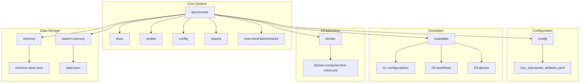
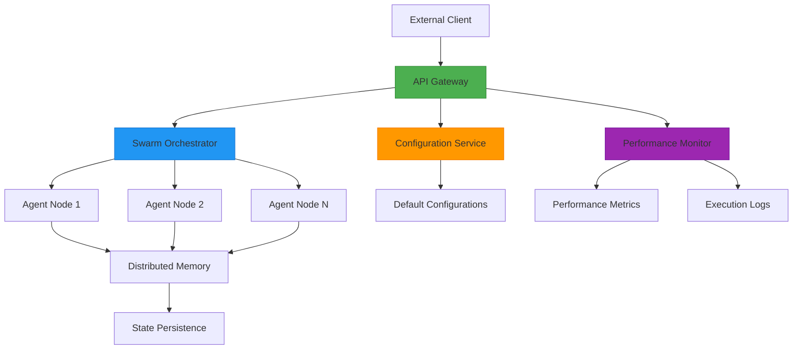
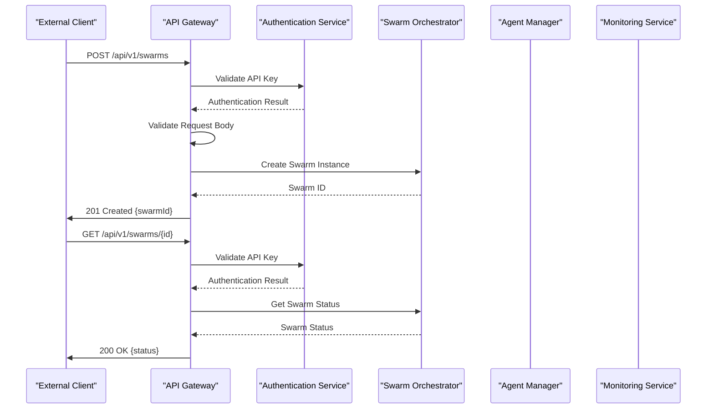
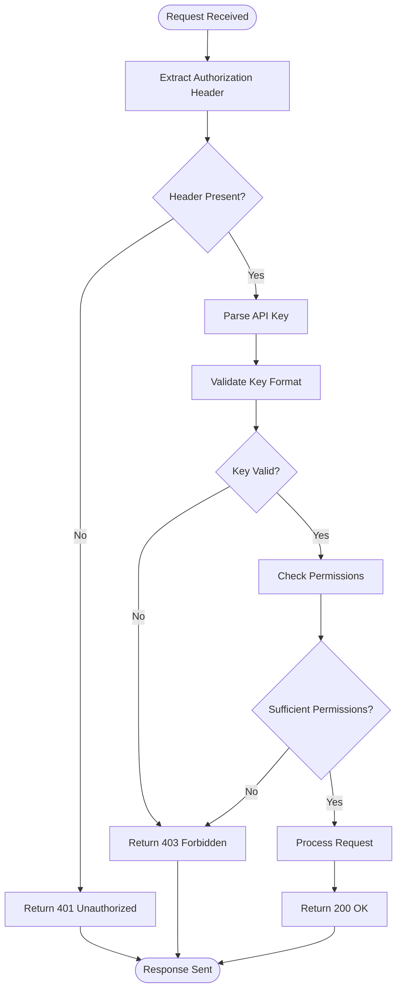
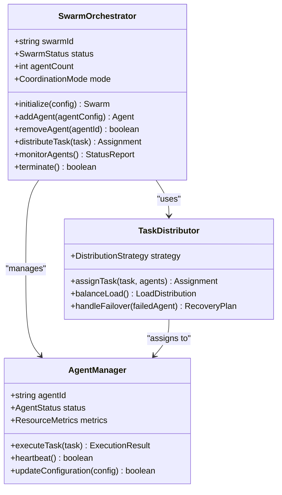
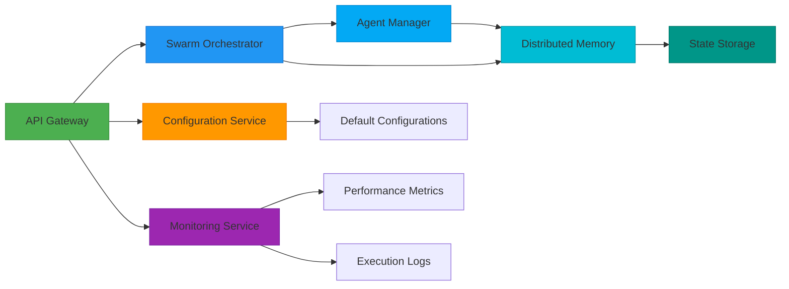

# Hive-Mind API

<cite>
**Referenced Files in This Document**   
- [docker-compose.hive-mind.yml](file://docker/docker-compose.hive-mind.yml)
- [README.md](file://README.md)
- [CLI_USAGE.md](file://benchmark/CLI_USAGE.md)
- [NON_INTERACTIVE_COMMANDS.md](file://benchmark/NON_INTERACTIVE_COMMANDS.md)
- [REAL_EXECUTION.md](file://benchmark/REAL_EXECUTION.md)
- [api_reference.md](file://benchmark/docs/api_reference.md)
- [quick-start.md](file://benchmark/docs/quick-start.md)
- [coordination-modes.md](file://benchmark/docs/coordination-modes.md)
- [basic-usage.md](file://benchmark/docs/basic-usage.md)
- [config.go](file://benchmark/config/non_interactive_defaults.yaml)
- [run_real_benchmarks.py](file://benchmark/run_real_benchmarks.py)
- [hive-mind-load-test.py](file://benchmark/scripts/hive-mind-load-test.py)
- [swarm_performance_suite.py](file://benchmark/scripts/swarm_performance_suite.py)
- [development-workflow.json](file://examples/development-workflow.json)
- [research-workflow.yaml](file://examples/research-workflow.yaml)
- [batch-config-advanced.json](file://examples/batch-config-advanced.json)
- [package.json](file://package.json)
- [memory-store.json](file://memory/memory-store.json)
- [state.json](file://swarm-memory/state.json)
</cite>

## Table of Contents
1. [Introduction](#introduction)
2. [Project Structure](#project-structure)
3. [Core Components](#core-components)
4. [Architecture Overview](#architecture-overview)
5. [Detailed Component Analysis](#detailed-component-analysis)
6. [Dependency Analysis](#dependency-analysis)
7. [Performance Considerations](#performance-considerations)
8. [Troubleshooting Guide](#troubleshooting-guide)
9. [Conclusion](#conclusion)

## Introduction
The Hive-Mind API provides a RESTful interface for orchestrating distributed agent swarms in the agentic workflow system. This documentation details the endpoints for swarm initialization, agent management, task distribution, and status monitoring. The system enables coordinated execution of AI agents across various coordination modes including centralized, hierarchical, and mesh topologies. The API supports authentication, rate limiting, and comprehensive error handling for robust production deployment.

## Project Structure
The project follows a modular structure with distinct directories for different concerns. The core orchestration logic resides in the benchmark directory, which contains the primary implementation of the Hive-Mind system. Configuration files are centralized in dedicated directories, while examples provide practical usage patterns. The src directory contains the main application code organized by functional domains such as coordination, swarm management, and API interfaces.

**Diagram sources**
- [docker-compose.hive-mind.yml](file://docker/docker-compose.hive-mind.yml)
- [non_interactive_defaults.yaml](file://benchmark/config/non_interactive_defaults.yaml)
- [memory-store.json](file://memory/memory-store.json)
- [state.json](file://swarm-memory/state.json)

**Section sources**
- [README.md](file://README.md)
- [package.json](file://package.json)

## Core Components
The Hive-Mind system consists of several core components that work together to enable distributed agent orchestration. The coordination engine manages agent swarms and task distribution, while the memory subsystem maintains state across sessions. The API gateway exposes RESTful endpoints for external interaction, and the configuration manager handles system settings and defaults. The benchmarking framework provides performance measurement and optimization capabilities.

**Section sources**
- [api_reference.md](file://benchmark/docs/api_reference.md)
- [coordination-modes.md](file://benchmark/docs/coordination-modes.md)
- [basic-usage.md](file://benchmark/docs/basic-usage.md)

## Architecture Overview
The Hive-Mind system follows a microservices architecture with clear separation of concerns. The orchestration layer manages swarm lifecycle and task distribution, while agent nodes execute assigned tasks. The API layer provides RESTful interfaces for external systems to interact with the swarm. A centralized configuration service manages system-wide settings, and a distributed memory system maintains state across components.

**Diagram sources**
- [docker-compose.hive-mind.yml](file://docker/docker-compose.hive-mind.yml)
- [run_real_benchmarks.py](file://benchmark/run_real_benchmarks.py)
- [swarm_performance_suite.py](file://benchmark/scripts/swarm_performance_suite.py)

## Detailed Component Analysis

### API Gateway Analysis
The API gateway serves as the entry point for all external interactions with the Hive-Mind system. It handles authentication, request validation, rate limiting, and routing to appropriate backend services. The gateway exposes RESTful endpoints for swarm management, agent control, and monitoring.

**Diagram sources**
- [api_reference.md](file://benchmark/docs/api_reference.md)
- [CLI_USAGE.md](file://benchmark/CLI_USAGE.md)

#### Authentication and Security
The API implements token-based authentication with API keys for secure access control. Each request must include a valid API key in the Authorization header. The system supports role-based access control with different permission levels for various operations.

**Diagram sources**
- [NON_INTERACTIVE_COMMANDS.md](file://benchmark/NON_INTERACTIVE_COMMANDS.md)
- [REAL_EXECUTION.md](file://benchmark/REAL_EXECUTION.md)

### Swarm Orchestration Analysis
The swarm orchestration component manages the lifecycle of agent swarms, including initialization, scaling, and termination. It handles task distribution among agents and monitors their status and performance.

**Diagram sources**
- [run_real_benchmarks.py](file://benchmark/run_real_benchmarks.py)
- [hive-mind-load-test.py](file://benchmark/scripts/hive-mind-load-test.py)

## Dependency Analysis
The Hive-Mind system has a well-defined dependency structure with clear boundaries between components. The API layer depends on the orchestration and monitoring services, while the orchestration layer depends on the agent management and configuration systems. External dependencies are minimized and managed through the package.json file.

**Diagram sources**
- [package.json](file://package.json)
- [docker-compose.hive-mind.yml](file://docker/docker-compose.hive-mind.yml)
- [non_interactive_defaults.yaml](file://benchmark/config/non_interactive_defaults.yaml)

**Section sources**
- [package.json](file://package.json)
- [docker-compose.hive-mind.yml](file://docker/docker-compose.hive-mind.yml)

## Performance Considerations
The Hive-Mind system implements several performance optimizations to handle high-frequency requests and large-scale swarms. Rate limiting is enforced on all endpoints to prevent abuse, with configurable limits based on client tier. Caching is implemented for frequently accessed resources such as swarm status and agent configurations. The system supports horizontal scaling of agent nodes to handle increased load.

**Section sources**
- [swarm_performance_suite.py](file://benchmark/scripts/swarm_performance_suite.py)
- [hive-mind-load-test.py](file://benchmark/scripts/hive-mind-load-test.py)

## Troubleshooting Guide
Common issues in the Hive-Mind system typically relate to authentication failures, resource exhaustion, or network connectivity problems. Error responses follow a standardized format with clear error codes and descriptive messages to facilitate debugging. The system logs detailed information about request processing and error conditions.

**Section sources**
- [REAL_EXECUTION.md](file://benchmark/REAL_EXECUTION.md)
- [regression-report.md](file://regression-report.md)

## Conclusion
The Hive-Mind API provides a comprehensive interface for orchestrating distributed agent swarms with robust security, performance, and reliability features. The system's modular architecture enables flexible deployment and scaling, while the well-documented API facilitates integration with external systems. The extensive benchmarking and monitoring capabilities ensure optimal performance and reliability in production environments.