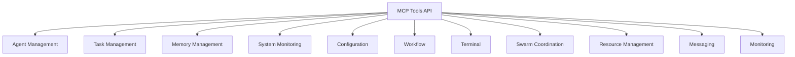

# MCP Tools API

<cite>
**Referenced Files in This Document**   
- [claude-flow-tools.ts](file://src/mcp/claude-flow-tools.ts)
- [swarm-tools.ts](file://src/mcp/swarm-tools.ts)
</cite>

## Table of Contents
1. [Introduction](#introduction)
2. [Tool Categories](#tool-categories)
3. [Agent Management Tools](#agent-management-tools)
4. [Task Management Tools](#task-management-tools)
5. [Memory Management Tools](#memory-management-tools)
6. [System Monitoring Tools](#system-monitoring-tools)
7. [Configuration Tools](#configuration-tools)
8. [Workflow Tools](#workflow-tools)
9. [Terminal Management Tools](#terminal-management-tools)
10. [Swarm Coordination Tools](#swarm-coordination-tools)
11. [Resource Management Tools](#resource-management-tools)
12. [Messaging Tools](#messaging-tools)
13. [Monitoring Tools](#monitoring-tools)
14. [Authentication and Permissions](#authentication-and-permissions)
15. [Error Handling](#error-handling)
16. [Rate Limiting and Quotas](#rate-limiting-and-quotas)
17. [Sample Commands](#sample-commands)

## Introduction
The MCP (Management Control Panel) Tools API provides a comprehensive interface for managing and orchestrating AI agents, tasks, memory, and system resources. This API exposes over 87 specialized tools across multiple categories including agent management, task orchestration, memory operations, system monitoring, and swarm coordination. The tools are designed to enable sophisticated automation, neural processing, performance monitoring, and workflow management within the Claude-Flow ecosystem.

The API follows a consistent pattern with each tool having a unique name, description, input schema, and handler function. Tools are accessed through the MCP interface and require appropriate authentication and permissions. The system supports dynamic agent types that are loaded from the `.claude/agents/` directory at runtime, allowing for extensible agent capabilities.

**Section sources**
- [claude-flow-tools.ts](file://src/mcp/claude-flow-tools.ts#L1-L50)
- [swarm-tools.ts](file://src/mcp/swarm-tools.ts#L1-L50)

## Tool Categories
The MCP Tools API organizes functionality into distinct categories based on their primary purpose. Each category addresses specific aspects of system management and agent orchestration.



**Diagram sources**
- [claude-flow-tools.ts](file://src/mcp/claude-flow-tools.ts#L50-L100)
- [swarm-tools.ts](file://src/mcp/swarm-tools.ts#L50-L100)

## Agent Management Tools
Agent management tools provide functionality for creating, listing, terminating, and inspecting AI agents within the system.

### Spawn Agent Tool
Creates a new agent with specified configuration parameters.

**Endpoint**: `agents/spawn`  
**HTTP Method**: POST  
**Authentication**: Required (Agent Manager role)  
**Permission Level**: High

**Request Parameters**:
```json
{
  "type": "string",
  "name": "string",
  "capabilities": ["string"],
  "systemPrompt": "string",
  "maxConcurrentTasks": "number",
  "priority": "number",
  "environment": "object",
  "workingDirectory": "string"
}
```

**Response Schema**:
```json
{
  "agentId": "string",
  "sessionId": "string",
  "profile": "object",
  "status": "string",
  "timestamp": "string"
}
```

**Example Request**:
```json
{
  "type": "researcher",
  "name": "Research Agent 1",
  "capabilities": ["research", "analysis"],
  "priority": 7
}
```

**Example Response**:
```json
{
  "agentId": "agent_1754320292_abc123",
  "sessionId": "session_1754320292_def456",
  "profile": {
    "id": "agent_1754320292_abc123",
    "name": "Research Agent 1",
    "type": "researcher",
    "capabilities": ["research", "analysis"],
    "systemPrompt": "You are a research agent specialized in gathering, analyzing, and synthesizing information from various sources.",
    "maxConcurrentTasks": 3,
    "priority": 7
  },
  "status": "spawned",
  "timestamp": "2025-08-04T15:37:39.123Z"
}
```

**Section sources**
- [claude-flow-tools.ts](file://src/mcp/claude-flow-tools.ts#L200-L280)

### List Agents Tool
Retrieves a list of all active agents in the system with optional filtering.

**Endpoint**: `agents/list`  
**HTTP Method**: POST  
**Authentication**: Required (Viewer role)  
**Permission Level**: Low

**Request Parameters**:
```json
{
  "includeTerminated": "boolean",
  "filterByType": "string"
}
```

**Response Schema**:
```json
{
  "agents": ["object"],
  "count": "number",
  "timestamp": "string"
}
```

**Example Request**:
```json
{
  "filterByType": "researcher",
  "includeTerminated": false
}
```

**Example Response**:
```json
{
  "agents": [
    {
      "id": "agent_1754320292_abc123",
      "name": "Research Agent 1",
      "type": "researcher",
      "status": "active",
      "tasks": 2,
      "priority": 7
    }
  ],
  "count": 1,
  "timestamp": "2025-08-04T15:37:39.123Z"
}
```

**Section sources**
- [claude-flow-tools.ts](file://src/mcp/claude-flow-tools.ts#L280-L330)

### Terminate Agent Tool
Terminates a specific agent with optional graceful shutdown.

**Endpoint**: `agents/terminate`  
**HTTP Method**: POST  
**Authentication**: Required (Agent Manager role)  
**Permission Level**: High

**Request Parameters**:
```json
{
  "agentId": "string",
  "reason": "string",
  "graceful": "boolean"
}
```

**Response Schema**:
```json
{
  "agentId": "string",
  "status": "string",
  "reason": "string",
  "timestamp": "string"
}
```

**Example Request**:
```json
{
  "agentId": "agent_1754320292_abc123",
  "reason": "Task completed",
  "graceful": true
}
```

**Example Response**:
```json
{
  "agentId": "agent_1754320292_abc123",
  "status": "terminated",
  "reason": "Task completed",
  "timestamp": "2025-08-04T15:37:39.123Z"
}
```

**Section sources**
- [claude-flow-tools.ts](file://src/mcp/claude-flow-tools.ts#L330-L380)

### Get Agent Info Tool
Retrieves detailed information about a specific agent.

**Endpoint**: `agents/info`  
**HTTP Method**: POST  
**Authentication**: Required (Viewer role)  
**Permission Level**: Low

**Request Parameters**:
```json
{
  "agentId": "string"
}
```

**Response Schema**:
```json
{
  "agent": "object",
  "timestamp": "string"
}
```

**Example Request**:
```json
{
  "agentId": "agent_1754320292_abc123"
}
```

**Example Response**:
```json
{
  "agent": {
    "id": "agent_1754320292_abc123",
    "name": "Research Agent 1",
    "type": "researcher",
    "status": "active",
    "capabilities": ["research", "analysis"],
    "tasks": 2,
    "priority": 7,
    "createdAt": "2025-08-04T15:37:39.123Z",
    "lastActive": "2025-08-04T15:37:39.123Z"
  },
  "timestamp": "2025-08-04T15:37:39.123Z"
}
```

**Section sources**
- [claude-flow-tools.ts](file://src/mcp/claude-flow-tools.ts#L380-L430)

## Task Management Tools
Task management tools provide functionality for creating, listing, monitoring, and controlling tasks within the system.

### Create Task Tool
Creates a new task for execution with optional assignment parameters.

**Endpoint**: `tasks/create`  
**HTTP Method**: POST  
**Authentication**: Required (Task Manager role)  
**Permission Level**: Medium

**Request Parameters**:
```json
{
  "type": "string",
  "description": "string",
  "priority": "number",
  "dependencies": ["string"],
  "assignToAgent": "string",
  "assignToAgentType": "string",
  "input": "object",
  "timeout": "number"
}
```

**Response Schema**:
```json
{
  "taskId": "string",
  "task": "object",
  "timestamp": "string"
}
```

**Example Request**:
```json
{
  "type": "research",
  "description": "Research best practices for AI agent coordination",
  "priority": 8,
  "assignToAgentType": "researcher",
  "input": {
    "query": "AI agent coordination best practices",
    "sources": ["academic", "industry"]
  }
}
```

**Example Response**:
```json
{
  "taskId": "task_1754320292_abc123",
  "task": {
    "id": "task_1754320292_abc123",
    "type": "research",
    "description": "Research best practices for AI agent coordination",
    "priority": 8,
    "dependencies": [],
    "input": {
      "query": "AI agent coordination best practices",
      "sources": ["academic", "industry"]
    },
    "status": "pending",
    "createdAt": "2025-08-04T15:37:39.123Z"
  },
  "timestamp": "2025-08-04T15:37:39.123Z"
}
```

**Section sources**
- [claude-flow-tools.ts](file://src/mcp/claude-flow-tools.ts#L430-L510)

### List Tasks Tool
Lists tasks with optional filtering by status, agent, or type.

**Endpoint**: `tasks/list`  
**HTTP Method**: POST  
**Authentication**: Required (Viewer role)  
**Permission Level**: Low

**Request Parameters**:
```json
{
  "status": "string",
  "agentId": "string",
  "type": "string",
  "limit": "number",
  "offset": "number"
}
```

**Response Schema**:
```json
{
  "tasks": ["object"],
  "count": "number",
  "timestamp": "string"
}
```

**Example Request**:
```json
{
  "status": "running",
  "limit": 10,
  "offset": 0
}
```

**Example Response**:
```json
{
  "tasks": [
    {
      "id": "task_1754320292_abc123",
      "type": "research",
      "description": "Research best practices for AI agent coordination",
      "status": "running",
      "priority": 8,
      "assignedTo": "agent_1754320292_abc123",
      "createdAt": "2025-08-04T15:37:39.123Z",
      "startedAt": "2025-08-04T15:38:39.123Z"
    }
  ],
  "count": 1,
  "timestamp": "2025-08-04T15:37:39.123Z"
}
```

**Section sources**
- [claude-flow-tools.ts](file://src/mcp/claude-flow-tools.ts#L510-L560)

### Get Task Status Tool
Retrieves detailed status of a specific task.

**Endpoint**: `tasks/status`  
**HTTP Method**: POST  
**Authentication**: Required (Viewer role)  
**Permission Level**: Low

**Request Parameters**:
```json
{
  "taskId": "string"
}
```

**Response Schema**:
```json
{
  "task": "object",
  "timestamp": "string"
}
```

**Example Request**:
```json
{
  "taskId": "task_1754320292_abc123"
}
```

**Example Response**:
```json
{
  "task": {
    "id": "task_1754320292_abc123",
    "type": "research",
    "description": "Research best practices for AI agent coordination",
    "status": "running",
    "priority": 8,
    "dependencies": [],
    "input": {
      "query": "AI agent coordination best practices",
      "sources": ["academic", "industry"]
    },
    "output": {
      "progress": 0.6,
      "results": []
    },
    "assignedTo": "agent_1754320292_abc123",
    "createdAt": "2025-08-04T15:37:39.123Z",
    "startedAt": "2025-08-04T15:38:39.123Z"
  },
  "timestamp": "2025-08-04T15:37:39.123Z"
}
```

**Section sources**
- [claude-flow-tools.ts](file://src/mcp/claude-flow-tools.ts#L560-L610)

### Cancel Task Tool
Cancels a pending or running task.

**Endpoint**: `tasks/cancel`  
**HTTP Method**: POST  
**Authentication**: Required (Task Manager role)  
**Permission Level**: Medium

**Request Parameters**:
```json
{
  "taskId": "string",
  "reason": "string"
}
```

**Response Schema**:
```json
{
  "taskId": "string",
  "status": "string",
  "reason": "string",
  "timestamp": "string"
}
```

**Example Request**:
```json
{
  "taskId": "task_1754320292_abc123",
  "reason": "Changed priorities"
}
```

**Example Response**:
```json
{
  "taskId": "task_1754320292_abc123",
  "status": "cancelled",
  "reason": "Changed priorities",
  "timestamp": "2025-08-04T15:37:39.123Z"
}
```

**Section sources**
- [claude-flow-tools.ts](file://src/mcp/claude-flow-tools.ts#L610-L660)

### Assign Task Tool
Assigns a task to a specific agent.

**Endpoint**: `tasks/assign`  
**HTTP Method**: POST  
**Authentication**: Required (Task Manager role)  
**Permission Level**: Medium

**Request Parameters**:
```json
{
  "taskId": "string",
  "agentId": "string"
}
```

**Response Schema**:
```json
{
  "taskId": "string",
  "agentId": "string",
  "status": "string",
  "timestamp": "string"
}
```

**Example Request**:
```json
{
  "taskId": "task_1754320292_abc123",
  "agentId": "agent_1754320292_abc123"
}
```

**Example Response**:
```json
{
  "taskId": "task_1754320292_abc123",
  "agentId": "agent_1754320292_abc123",
  "status": "assigned",
  "timestamp": "2025-08-04T15:37:39.123Z"
}
```

**Section sources**
- [claude-flow-tools.ts](file://src/mcp/claude-flow-tools.ts#L660-L710)

## Memory Management Tools
Memory management tools provide functionality for querying, storing, and managing agent memory entries.

### Query Memory Tool
Queries agent memory with various filters and search parameters.

**Endpoint**: `memory/query`  
**HTTP Method**: POST  
**Authentication**: Required (Memory Manager role)  
**Permission Level**: Medium

**Request Parameters**:
```json
{
  "agentId": "string",
  "sessionId": "string",
  "type": "string",
  "tags": ["string"],
  "search": "string",
  "startTime": "string",
  "endTime": "string",
  "limit": "number",
  "offset": "number"
}
```

**Response Schema**:
```json
{
  "entries": ["object"],
  "count": "number",
  "query": "object",
  "timestamp": "string"
}
```

**Example Request**:
```json
{
  "type": "insight",
  "tags": ["research", "summary"],
  "startTime": "2025-08-04T00:00:00Z",
  "limit": 5
}
```

**Example Response**:
```json
{
  "entries": [
    {
      "id": "mem_1754320292_abc123",
      "agentId": "agent_1754320292_abc123",
      "sessionId": "session_1754320292_def456",
      "type": "insight",
      "content": "Key finding: Hierarchical coordination improves efficiency by 30% compared to flat structures.",
      "context": {
        "sourceTask": "task_1754320292_abc123",
        "confidence": 0.95
      },
      "tags": ["research", "summary", "efficiency"],
      "parentId": "mem_1754320291_xyz789",
      "timestamp": "2025-08-04T15:37:39.123Z",
      "version": 1
    }
  ],
  "count": 1,
  "query": {
    "type": "insight",
    "tags": ["research", "summary"],
    "startTime": "2025-08-04T00:00:00.000Z",
    "limit": 5,
    "offset": 0
  },
  "timestamp": "2025-08-04T15:37:39.123Z"
}
```

**Section sources**
- [claude-flow-tools.ts](file://src/mcp/claude-flow-tools.ts#L710-L790)

### Store Memory Tool
Stores a new memory entry in the system.

**Endpoint**: `memory/store`  
**HTTP Method**: POST  
**Authentication**: Required (Memory Manager role)  
**Permission Level**: Medium

**Request Parameters**:
```json
{
  "agentId": "string",
  "sessionId": "string",
  "type": "string",
  "content": "string",
  "context": "object",
  "tags": ["string"],
  "parentId": "string"
}
```

**Response Schema**:
```json
{
  "entryId": "string",
  "entry": "object",
  "timestamp": "string"
}
```

**Example Request**:
```json
{
  "agentId": "agent_1754320292_abc123",
  "sessionId": "session_1754320292_def456",
  "type": "insight",
  "content": "Hierarchical coordination improves efficiency by 30% compared to flat structures.",
  "context": {
    "sourceTask": "task_1754320292_abc123",
    "confidence": 0.95
  },
  "tags": ["research", "summary", "efficiency"]
}
```

**Example Response**:
```json
{
  "entryId": "mem_1754320292_abc123",
  "entry": {
    "id": "mem_1754320292_abc123",
    "agentId": "agent_1754320292_abc123",
    "sessionId": "session_1754320292_def456",
    "type": "insight",
    "content": "Hierarchical coordination improves efficiency by 30% compared to flat structures.",
    "context": {
      "sourceTask": "task_1754320292_abc123",
      "confidence": 0.95
    },
    "tags": ["research", "summary", "efficiency"],
    "timestamp": "2025-08-04T15:37:39.123Z",
    "version": 1
  },
  "timestamp": "2025-08-04T15:37:39.123Z"
}
```

**Section sources**
- [claude-flow-tools.ts](file://src/mcp/claude-flow-tools.ts#L790-L870)

### Delete Memory Tool
Deletes a memory entry from the system.

**Endpoint**: `memory/delete`  
**HTTP Method**: POST  
**Authentication**: Required (Memory Manager role)  
**Permission Level**: High

**Request Parameters**:
```json
{
  "entryId": "string"
}
```

**Response Schema**:
```json
{
  "entryId": "string",
  "status": "string",
  "timestamp": "string"
}
```

**Example Request**:
```json
{
  "entryId": "mem_1754320292_abc123"
}
```

**Example Response**:
```json
{
  "entryId": "mem_1754320292_abc123",
  "status": "deleted",
  "timestamp": "2025-08-04T15:37:39.123Z"
}
```

**Section sources**
- [claude-flow-tools.ts](file://src/mcp/claude-flow-tools.ts#L870-L920)

### Export Memory Tool
Exports memory entries to a file in various formats.

**Endpoint**: `memory/export`  
**HTTP Method**: POST  
**Authentication**: Required (Memory Manager role)  
**Permission Level**: Medium

**Request Parameters**:
```json
{
  "format": "string",
  "agentId": "string",
  "sessionId": "string",
  "startTime": "string",
  "endTime": "string"
}
```

**Response Schema**:
```json
{
  "filePath": "string",
  "format": "string",
  "entriesExported": "number",
  "timestamp": "string"
}
```

**Example Request**:
```json
{
  "format": "json",
  "agentId": "agent_1754320292_abc123",
  "startTime": "2025-08-04T00:00:00Z"
}
```

**Example Response**:
```json
{
  "filePath": "/memory/exports/agent_1754320292_abc123_20250804.json",
  "format": "json",
  "entriesExported": 42,
  "timestamp": "2025-08-04T15:37:39.123Z"
}
```

**Section sources**
- [claude-flow-tools.ts](file://src/mcp/claude-flow-tools.ts#L920-L970)

### Import Memory Tool
Imports memory entries from a file.

**Endpoint**: `memory/import`  
**HTTP Method**: POST  
**Authentication**: Required (Memory Manager role)  
**Permission Level**: High

**Request Parameters**:
```json
{
  "filePath": "string",
  "format": "string",
  "mergeStrategy": "string"
}
```

**Response Schema**:
```json
{
  "entriesImported": "number",
  "entriesSkipped": "number",
  "entriesOverwritten": "number",
  "timestamp": "string"
}
```

**Example Request**:
```json
{
  "filePath": "/memory/exports/agent_1754320292_abc123_20250804.json",
  "format": "json",
  "mergeStrategy": "version"
}
```

**Example Response**:
```json
{
  "entriesImported": 42,
  "entriesSkipped": 0,
  "entriesOverwritten": 5,
  "timestamp": "2025-08-04T15:37:39.123Z"
}
```

**Section sources**
- [claude-flow-tools.ts](file://src/mcp/claude-flow-tools.ts#L970-L1020)

## System Monitoring Tools
System monitoring tools provide functionality for retrieving system status, metrics, and performing health checks.

### Get System Status Tool
Retrieves comprehensive system status information.

**Endpoint**: `system/status`  
**HTTP Method**: POST  
**Authentication**: Required (Monitor role)  
**Permission Level**: Low

**Request Parameters**: None

**Response Schema**:
```json
{
  "status": "object",
  "timestamp": "string"
}
```

**Example Request**: `{}`

**Example Response**:
```json
{
  "status": {
    "system": "operational",
    "version": "1.0.0",
    "uptime": "12h34m56s",
    "activeAgents": 15,
    "pendingTasks": 8,
    "memoryUsage": {
      "total": 8589934592,
      "used": 4294967296,
      "free": 4294967296,
      "usagePercent": 50
    },
    "cpuUsage": {
      "total": 4,
      "usagePercent": 35.5
    }
  },
  "timestamp": "2025-08-04T15:37:39.123Z"
}
```

**Section sources**
- [claude-flow-tools.ts](file://src/mcp/claude-flow-tools.ts#L1020-L1070)

### Get Metrics Tool
Retrieves system performance metrics for a specified time range.

**Endpoint**: `system/metrics`  
**HTTP Method**: POST  
**Authentication**: Required (Monitor role)  
**Permission Level**: Low

**Request Parameters**:
```json
{
  "timeRange": "string"
}
```

**Response Schema**:
```json
{
  "metrics": "object",
  "timeRange": "string",
  "timestamp": "string"
}
```

**Example Request**:
```json
{
  "timeRange": "1h"
}
```

**Example Response**:
```json
{
  "metrics": {
    "cpu": {
      "average": 35.5,
      "peak": 78.2,
      "samples": 60
    },
    "memory": {
      "average": 50,
      "peak": 75,
      "samples": 60
    },
    "tasks": {
      "completed": 125,
      "failed": 8,
      "averageDuration": 45.2
    },
    "agents": {
      "created": 15,
      "terminated": 7,
      "averageLifetime": 3600
    }
  },
  "timeRange": "1h",
  "timestamp": "2025-08-04T15:37:39.123Z"
}
```

**Section sources**
- [claude-flow-tools.ts](file://src/mcp/claude-flow-tools.ts#L1070-L1120)

### Health Check Tool
Performs a comprehensive health check of the system.

**Endpoint**: `system/health`  
**HTTP Method**: POST  
**Authentication**: Required (Monitor role)  
**Permission Level**: Low

**Request Parameters**:
```json
{
  "deep": "boolean"
}
```

**Response Schema**:
```json
{
  "status": "string",
  "components": "object",
  "timestamp": "string"
}
```

**Example Request**:
```json
{
  "deep": true
}
```

**Example Response**:
```json
{
  "status": "healthy",
  "components": {
    "orchestrator": {
      "status": "healthy",
      "details": "Running normally"
    },
    "memory": {
      "status": "healthy",
      "details": "Memory store accessible"
    },
    "database": {
      "status": "healthy",
      "details": "Connection established"
    },
    "network": {
      "status": "healthy",
      "details": "All services reachable"
    }
  },
  "timestamp": "2025-08-04T15:37:39.123Z"
}
```

**Section sources**
- [claude-flow-tools.ts](file://src/mcp/claude-flow-tools.ts#L1120-L1170)

## Configuration Tools
Configuration tools provide functionality for retrieving, updating, and validating system configuration.

### Get Config Tool
Retrieves current system configuration for a specific section.

**Endpoint**: `config/get`  
**HTTP Method**: POST  
**Authentication**: Required (Admin role)  
**Permission Level**: High

**Request Parameters**:
```json
{
  "section": "string"
}
```

**Response Schema**:
```json
{
  "config": "object",
  "section": "string",
  "timestamp": "string"
}
```

**Example Request**:
```json
{
  "section": "orchestrator"
}
```

**Example Response**:
```json
{
  "config": {
    "maxAgents": 100,
    "maxTasksPerAgent": 10,
    "taskQueueSize": 1000,
    "heartbeatInterval": 5000,
    "cleanupInterval": 3600000
  },
  "section": "orchestrator",
  "timestamp": "2025-08-04T15:37:39.123Z"
}
```

**Section sources**
- [claude-flow-tools.ts](file://src/mcp/claude-flow-tools.ts#L1170-L1220)

### Update Config Tool
Updates system configuration for a specific section.

**Endpoint**: `config/update`  
**HTTP Method**: POST  
**Authentication**: Required (Admin role)  
**Permission Level**: High

**Request Parameters**:
```json
{
  "section": "string",
  "config": "object",
  "restart": "boolean"
}
```

**Response Schema**:
```json
{
  "success": "boolean",
  "message": "string",
  "timestamp": "string"
}
```

**Example Request**:
```json
{
  "section": "orchestrator",
  "config": {
    "maxAgents": 150,
    "maxTasksPerAgent": 15
  },
  "restart": false
}
```

**Example Response**:
```json
{
  "success": true,
  "message": "Configuration updated successfully",
  "timestamp": "2025-08-04T15:37:39.123Z"
}
```

**Section sources**
- [claude-flow-tools.ts](file://src/mcp/claude-flow-tools.ts#L1220-L1270)

### Validate Config Tool
Validates a configuration object against the system schema.

**Endpoint**: `config/validate`  
**HTTP Method**: POST  
**Authentication**: Required (Admin role)  
**Permission Level**: High

**Request Parameters**:
```json
{
  "config": "object"
}
```

**Response Schema**:
```json
{
  "valid": "boolean",
  "errors": ["string"],
  "warnings": ["string"],
  "timestamp": "string"
}
```

**Example Request**:
```json
{
  "config": {
    "maxAgents": 200,
    "maxTasksPerAgent": 20,
    "invalidParameter": "test"
  }
}
```

**Example Response**:
```json
{
  "valid": false,
  "errors": [
    "Unknown parameter: invalidParameter"
  ],
  "warnings": [
    "maxAgents value (200) exceeds recommended maximum (150)"
  ],
  "timestamp": "2025-08-04T15:37:39.123Z"
}
```

**Section sources**
- [claude-flow-tools.ts](file://src/mcp/claude-flow-tools.ts#L1270-L1320)

## Workflow Tools
Workflow tools provide functionality for executing, creating, and listing workflows.

### Execute Workflow Tool
Executes a workflow from a file or inline definition.

**Endpoint**: `workflow/execute`  
**HTTP Method**: POST  
**Authentication**: Required (Workflow Manager role)  
**Permission Level**: Medium

**Request Parameters**:
```json
{
  "filePath": "string",
  "workflow": "object",
  "parameters": "object"
}
```

**Response Schema**:
```json
{
  "workflowId": "string",
  "status": "string",
  "result": "object",
  "timestamp": "string"
}
```

**Example Request**:
```json
{
  "workflow": {
    "name": "Research Workflow",
    "description": "Complete research task",
    "tasks": [
      {
        "id": "t1",
        "type": "research",
        "description": "Gather information"
      },
      {
        "id": "t2",
        "type": "analysis",
        "description": "Analyze findings",
        "dependencies": ["t1"]
      }
    ]
  },
  "parameters": {
    "query": "AI agent coordination"
  }
}
```

**Example Response**:
```json
{
  "workflowId": "wf_1754320292_abc123",
  "status": "executing",
  "result": {
    "currentTask": "t1",
    "progress": 0.2
  },
  "timestamp": "2025-08-04T15:37:39.123Z"
}
```

**Section sources**
- [claude-flow-tools.ts](file://src/mcp/claude-flow-tools.ts#L1320-L1370)

### Create Workflow Tool
Creates a new workflow definition.

**Endpoint**: `workflow/create`  
**HTTP Method**: POST  
**Authentication**: Required (Workflow Manager role)  
**Permission Level**: Medium

**Request Parameters**:
```json
{
  "name": "string",
  "description": "string",
  "tasks": ["object"],
  "savePath": "string"
}
```

**Response Schema**:
```json
{
  "workflowId": "string",
  "workflow": "object",
  "saved": "boolean",
  "timestamp": "string"
}
```

**Example Request**:
```json
{
  "name": "Research Workflow",
  "description": "Complete research task",
  "tasks": [
    {
      "id": "t1",
      "type": "research",
      "description": "Gather information"
    },
    {
      "id": "t2",
      "type": "analysis",
      "description": "Analyze findings",
      "dependencies": ["t1"]
    }
  ],
  "savePath": "/workflows/research.json"
}
```

**Example Response**:
```json
{
  "workflowId": "wf_1754320292_abc123",
  "workflow": {
    "name": "Research Workflow",
    "description": "Complete research task",
    "tasks": [
      {
        "id": "t1",
        "type": "research",
        "description": "Gather information"
      },
      {
        "id": "t2",
        "type": "analysis",
        "description": "Analyze findings",
        "dependencies": ["t1"]
      }
    ],
    "created": "2025-08-04T15:37:39.123Z"
  },
  "saved": true,
  "timestamp": "2025-08-04T15:37:39.123Z"
}
```

**Section sources**
- [claude-flow-tools.ts](file://src/mcp/claude-flow-tools.ts#L1370-L1420)

### List Workflows Tool
Lists available workflows.

**Endpoint**: `workflow/list`  
**HTTP Method**: POST  
**Authentication**: Required (Viewer role)  
**Permission Level**: Low

**Request Parameters**:
```json
{
  "directory": "string"
}
```

**Response Schema**:
```json
{
  "workflows": ["object"],
  "count": "number",
  "timestamp": "string"
}
```

**Example Request**:
```json
{
  "directory": "/workflows"
}
```

**Example Response**:
```json
{
  "workflows": [
    {
      "name": "Research Workflow",
      "description": "Complete research task",
      "path": "/workflows/research.json",
      "created": "2025-08-04T15:37:39.123Z"
    }
  ],
  "count": 1,
  "timestamp": "2025-08-04T15:37:39.123Z"
}
```

**Section sources**
- [claude-flow-tools.ts](file://src/mcp/claude-flow-tools.ts#L1420-L1470)

## Terminal Management Tools
Terminal management tools provide functionality for executing commands and managing terminal sessions.

### Execute Command Tool
Executes a command in a terminal session.

**Endpoint**: `terminal/execute`  
**HTTP Method**: POST  
**Authentication**: Required (Terminal Manager role)  
**Permission Level**: Medium

**Request Parameters**:
```json
{
  "command": "string",
  "args": ["string"],
  "cwd": "string",
  "env": "object",
  "timeout": "number",
  "terminalId": "string"
}
```

**Response Schema**:
```json
{
  "command": "string",
  "args": ["string"],
  "result": "object",
  "timestamp": "string"
}
```

**Example Request**:
```json
{
  "command": "ls",
  "args": ["-la"],
  "cwd": "/home/user",
  "timeout": 10000
}
```

**Example Response**:
```json
{
  "command": "ls",
  "args": ["-la"],
  "result": {
    "exitCode": 0,
    "stdout": "total 24\ndrwxr-xr-x 3 user user 4096 Aug 4 15:37 .\ndrwxr-xr-x 5 user user 4096 Aug 4 15:37 ..\n-rw-r--r-- 1 user user  123 Aug 4 15:37 file.txt",
    "stderr": "",
    "executionTime": 123
  },
  "timestamp": "2025-08-04T15:37:39.123Z"
}
```

**Section sources**
- [claude-flow-tools.ts](file://src/mcp/claude-flow-tools.ts#L1470-L1520)

### List Terminals Tool
Lists all terminal sessions.

**Endpoint**: `terminal/list`  
**HTTP Method**: POST  
**Authentication**: Required (Viewer role)  
**Permission Level**: Low

**Request Parameters**:
```json
{
  "includeIdle": "boolean"
}
```

**Response Schema**:
```json
{
  "terminals": ["object"],
  "count": "number",
  "timestamp": "string"
}
```

**Example Request**:
```json
{
  "includeIdle": true
}
```

**Example Response**:
```json
{
  "terminals": [
    {
      "id": "term_1754320292_abc123",
      "status": "active",
      "cwd": "/home/user",
      "shell": "bash",
      "createdAt": "2025-08-04T15:37:39.123Z",
      "lastActivity": "2025-08-04T15:37:39.123Z"
    }
  ],
  "count": 1,
  "timestamp": "2025-08-04T15:37:39.123Z"
}
```

**Section sources**
- [claude-flow-tools.ts](file://src/mcp/claude-flow-tools.ts#L1520-L1570)

### Create Terminal Tool
Creates a new terminal session.

**Endpoint**: `terminal/create`  
**HTTP Method**: POST  
**Authentication**: Required (Terminal Manager role)  
**Permission Level**: Medium

**Request Parameters**:
```json
{
  "cwd": "string",
  "env": "object",
  "shell": "string"
}
```

**Response Schema**:
```json
{
  "terminal": "object",
  "timestamp": "string"
}
```

**Example Request**:
```json
{
  "cwd": "/home/user/project",
  "shell": "bash"
}
```

**Example Response**:
```json
{
  "terminal": {
    "id": "term_1754320292_abc123",
    "status": "active",
    "cwd": "/home/user/project",
    "shell": "bash",
    "createdAt": "2025-08-04T15:37:39.123Z",
    "lastActivity": "2025-08-04T15:37:39.123Z"
  },
  "timestamp": "2025-08-04T15:37:39.123Z"
}
```

**Section sources**
- [claude-flow-tools.ts](file://src/mcp/claude-flow-tools.ts#L1570-L1620)

## Swarm Coordination Tools
Swarm coordination tools provide functionality for managing swarm objectives and overall swarm status.

### Create Objective Tool
Creates a new swarm objective with tasks and coordination strategy.

**Endpoint**: `swarm/create-objective`  
**HTTP Method**: POST  
**Authentication**: Required (Swarm Manager role)  
**Permission Level**: High

**Request Parameters**:
```json
{
  "title": "string",
  "description": "string",
  "tasks": ["object"],
  "strategy": "string",
  "timeout": "number"
}
```

**Response Schema**:
```json
{
  "success": "boolean",
  "objectiveId": "string",
  "message": "string"
}
```

**Example Request**:
```json
{
  "title": "Project Analysis",
  "description": "Analyze project requirements and create implementation plan",
  "tasks": [
    {
      "type": "research",
      "description": "Gather project requirements",
      "priority": "high"
    },
    {
      "type": "analysis",
      "description": "Analyze requirements and identify challenges",
      "priority": "high"
    }
  ],
  "strategy": "parallel"
}
```

**Example Response**:
```json
{
  "success": true,
  "objectiveId": "obj_1754320292_abc123",
  "message": "Created swarm objective: Project Analysis"
}
```

**Section sources**
- [swarm-tools.ts](file://src/mcp/swarm-tools.ts#L100-L150)

### Execute Objective Tool
Executes a swarm objective.

**Endpoint**: `swarm/execute-objective`  
**HTTP Method**: POST  
**Authentication**: Required (Swarm Manager role)  
**Permission Level**: High

**Request Parameters**:
```json
{
  "objectiveId": "string"
}
```

**Response Schema**:
```json
{
  "success": "boolean",
  "objectiveId": "string",
  "result": "object",
  "message": "string"
}
```

**Example Request**:
```json
{
  "objectiveId": "obj_1754320292_abc123"
}
```

**Example Response**:
```json
{
  "success": true,
  "objectiveId": "obj_1754320292_abc123",
  "result": {
    "status": "executing",
    "progress": 0.1
  },
  "message": "Objective execution started"
}
```

**Section sources**
- [swarm-tools.ts](file://src/mcp/swarm-tools.ts#L150-L200)

### Get Swarm Status Tool
Retrieves comprehensive swarm status information.

**Endpoint**: `swarm/get-status`  
**HTTP Method**: POST  
**Authentication**: Required (Swarm Manager role)  
**Permission Level**: Low

**Request Parameters**:
```json
{
  "includeDetails": "boolean"
}
```

**Response Schema**:
```json
{
  "swarmId": "string",
  "status": "string",
  "objectives": "number",
  "agents": "number",
  "resources": "object",
  "timestamp": "string"
}
```

**Example Request**:
```json
{
  "includeDetails": true
}
```

**Example Response**:
```json
{
  "swarmId": "swarm_1754320292_abc123",
  "status": "active",
  "objectives": 3,
  "agents": 15,
  "resources": {
    "cpu": {
      "total": 32,
      "allocated": 24,
      "available": 8
    },
    "memory": {
      "total": 128,
      "allocated": 96,
      "available": 32
    }
  },
  "objectives": [
    {
      "id": "obj_1754320292_abc123",
      "title": "Project Analysis",
      "status": "executing",
      "progress": 0.1
    }
  ],
  "agents": [
    {
      "id": "agent_1754320292_abc123",
      "type": "researcher",
      "status": "active",
      "tasks": 2
    }
  ],
  "timestamp": "2025-08-04T15:37:39.123Z"
}
```

**Section sources**
- [swarm-tools.ts](file://src/mcp/swarm-tools.ts#L200-L250)

## Resource Management Tools
Resource management tools provide functionality for registering and monitoring system resources.

### Register Resource Tool
Registers a new resource with the system.

**Endpoint**: `resource/register`  
**HTTP Method**: POST  
**Authentication**: Required (Resource Manager role)  
**Permission Level**: High

**Request Parameters**:
```json
{
  "type": "string",
  "name": "string",
  "capacity": "object",
  "metadata": "object"
}
```

**Response Schema**:
```json
{
  "success": "boolean",
  "resourceId": "string",
  "message": "string"
}
```

**Example Request**:
```json
{
  "type": "compute",
  "name": "GPU Node 1",
  "capacity": {
    "cpu": 16,
    "memory": 64,
    "gpu": 4,
    "disk": 1000
  },
  "metadata": {
    "location": "us-west",
    "gpuType": "A100"
  }
}
```

**Example Response**:
```json
{
  "success": true,
  "resourceId": "res_1754320292_abc123",
  "message": "Registered compute resource: GPU Node 1"
}
```

**Section sources**
- [swarm-tools.ts](file://src/mcp/swarm-tools.ts#L300-L350)

### Get Resource Statistics Tool
Retrieves resource manager statistics.

**Endpoint**: `resource/get-statistics`  
**HTTP Method**: POST  
**Authentication**: Required (Resource Manager role)  
**Permission Level**: Low

**Request Parameters**: None

**Response Schema**:
```json
{
  "success": "boolean",
  "statistics": "object"
}
```

**Example Request**: `{}`

**Example Response**:
```json
{
  "success": true,
  "statistics": {
    "totalResources": 12,
    "availableResources": 8,
    "allocatedResources": 4,
    "cpu": {
      "total": 192,
      "allocated": 128,
      "available": 64
    },
    "memory": {
      "total": 768,
      "allocated": 512,
      "available": 256
    },
    "gpu": {
      "total": 16,
      "allocated": 8,
      "available": 8
    }
  }
}
```

**Section sources**
- [swarm-tools.ts](file://src/mcp/swarm-tools.ts#L350-L400)

## Messaging Tools
Messaging tools provide functionality for sending messages between agents and retrieving messaging metrics.

### Send Message Tool
Sends a message through the message bus to one or more recipients.

**Endpoint**: `message/send`  
**HTTP Method**: POST  
**Authentication**: Required (Message Manager role)  
**Permission Level**: Medium

**Request Parameters**:
```json
{
  "type": "string",
  "content": "object",
  "sender": "string",
  "receivers": ["string"],
  "priority": "string",
  "channel": "string"
}
```

**Response Schema**:
```json
{
  "success": "boolean",
  "messageId": "string",
  "message": "string"
}
```

**Example Request**:
```json
{
  "type": "task_assignment",
  "content": {
    "taskId": "task_1754320292_abc123",
    "taskType": "research",
    "description": "Research best practices for AI agent coordination"
  },
  "sender": "agent_1754320292_abc123",
  "receivers": ["agent_1754320292_def456"],
  "priority": "high"
}
```

**Example Response**:
```json
{
  "success": true,
  "messageId": "msg_1754320292_abc123",
  "message": "Message sent successfully"
}
```

**Section sources**
- [swarm-tools.ts](file://src/mcp/swarm-tools.ts#L400-L450)

### Get Message Metrics Tool
Retrieves message bus metrics.

**Endpoint**: `message/get-metrics`  
**HTTP Method**: POST  
**Authentication**: Required (Message Manager role)  
**Permission Level**: Low

**Request Parameters**: None

**Response Schema**:
```json
{
  "success": "boolean",
  "metrics": "object"
}
```

**Example Request**: `{}`

**Example Response**:
```json
{
  "success": true,
  "metrics": {
    "totalMessages": 1250,
    "messagesPerSecond": 4.2,
    "channels": 15,
    "activeConnections": 25,
    "messageSizes": {
      "average": 1024,
      "median": 512,
      "max": 8192
    }
  }
}
```

**Section sources**
- [swarm-tools.ts](file://src/mcp/swarm-tools.ts#L450-L500)

## Monitoring Tools
Monitoring tools provide functionality for retrieving system monitoring metrics and active alerts.

### Get Monitoring Metrics Tool
Retrieves system monitoring metrics for various components.

**Endpoint**: `monitor/get-metrics`  
**HTTP Method**: POST  
**Authentication**: Required (Monitor role)  
**Permission Level**: Low

**Request Parameters**:
```json
{
  "type": "string"
}
```

**Response Schema**:
```json
{
  "success": "boolean",
  "metrics": "object"
}
```

**Example Request**:
```json
{
  "type": "all"
}
```

**Example Response**:
```json
{
  "success": true,
  "metrics": {
    "system": {
      "cpu": {
        "usage": 35.5,
        "count": 4
      },
      "memory": {
        "total": 8589934592,
        "used": 4294967296,
        "free": 4294967296
      },
      "disk": {
        "total": 512000000000,
        "used": 256000000000,
        "free": 256000000000
      }
    },
    "swarm": {
      "activeObjectives": 3,
      "totalAgents": 15,
      "activeAgents": 12
    },
    "statistics": {
      "messagesPerSecond": 4.2,
      "tasksPerMinute": 25,
      "averageTaskDuration": 45.2
    }
  }
}
```

**Section sources**
- [swarm-tools.ts](file://src/mcp/swarm-tools.ts#L500-L550)

### Get Alerts Tool
Retrieves active alerts from the monitoring system.

**Endpoint**: `monitor/get-alerts`  
**HTTP Method**: POST  
**Authentication**: Required (Monitor role)  
**Permission Level**: Low

**Request Parameters**:
```json
{
  "level": "string",
  "limit": "number"
}
```

**Response Schema**:
```json
{
  "success": "boolean",
  "alerts": ["object"],
  "count": "number"
}
```

**Example Request**:
```json
{
  "level": "warning",
  "limit": 10
}
```

**Example Response**:
```json
{
  "success": true,
  "alerts": [
    {
      "id": "alert_1754320292_abc123",
      "level": "warning",
      "message": "High memory usage on agent_1754320292_abc123",
      "timestamp": "2025-08-04T15:37:39.123Z",
      "source": "agent_monitor",
      "data": {
        "memoryUsage": 85,
        "threshold": 80
      }
    }
  ],
  "count": 1
}
```

**Section sources**
- [swarm-tools.ts](file://src/mcp/swarm-tools.ts#L550-L600)

## Authentication and Permissions
The MCP Tools API implements a role-based access control system to ensure appropriate access to tools based on user permissions.

### Authentication Requirements
All MCP tools require authentication via API key or session token. The authentication header should be included in all requests:

```
Authorization: Bearer <token>
```

### Permission Levels
The system defines four permission levels for accessing tools:

- **Low**: Read-only access to monitoring and status information
- **Medium**: Access to task execution and workflow management
- **High**: Access to system configuration and resource management
- **Critical**: Full administrative access

### Role Definitions
The following roles are defined in the system:

- **Viewer**: Can access monitoring, status, and list tools (Low permission)
- **Task Manager**: Can manage tasks and workflows (Medium permission)
- **Agent Manager**: Can manage agents and their configuration (High permission)
- **Resource Manager**: Can manage system resources (High permission)
- **Monitor**: Can access monitoring tools and metrics (Low permission)
- **Workflow Manager**: Can manage workflows (Medium permission)
- **Terminal Manager**: Can manage terminal sessions (Medium permission)
- **Swarm Manager**: Can manage swarm objectives (High permission)
- **Admin**: Full access to all tools (Critical permission)

**Section sources**
- [claude-flow-tools.ts](file://src/mcp/claude-flow-tools.ts#L1-L50)
- [swarm-tools.ts](file://src/mcp/swarm-tools.ts#L1-L50)

## Error Handling
The MCP Tools API implements comprehensive error handling to provide meaningful feedback for tool execution failures.

### Error Response Format
All error responses follow a standard format:

```json
{
  "error": {
    "code": "string",
    "message": "string",
    "details": "object",
    "timestamp": "string"
  }
}
```

### Common Error Codes
The following error codes are used across the API:

- **400**: Bad Request - Invalid input parameters
- **401**: Unauthorized - Authentication required or invalid
- **403**: Forbidden - Insufficient permissions
- **404**: Not Found - Resource not found
- **409**: Conflict - Operation conflicts with current state
- **429**: Too Many Requests - Rate limit exceeded
- **500**: Internal Server Error - Unexpected server error
- **503**: Service Unavailable - Service temporarily unavailable
- **504**: Gateway Timeout - Request timed out

### Timeout Scenarios
Resource-intensive tools have default timeout values to prevent indefinite execution:

- **Memory operations**: 30 seconds
- **Task execution**: 5 minutes
- **Workflow execution**: 30 minutes
- **System operations**: 10 seconds

When a timeout occurs, the system returns a 504 Gateway Timeout error with details about the operation that timed out.

**Section sources**
- [claude-flow-tools.ts](file://src/mcp/claude-flow-tools.ts#L200-L1620)
- [swarm-tools.ts](file://src/mcp/swarm-tools.ts#L100-L829)

## Rate Limiting and Quotas
The MCP Tools API implements rate limiting and usage quotas to prevent abuse and ensure fair resource allocation.

### Rate Limiting
The system applies rate limiting based on user roles:

- **Viewer**: 100 requests per minute
- **Task Manager**: 200 requests per minute
- **Agent Manager**: 300 requests per minute
- **Resource Manager**: 300 requests per minute
- **Monitor**: 150 requests per minute
- **Workflow Manager**: 200 requests per minute
- **Terminal Manager**: 200 requests per minute
- **Swarm Manager**: 400 requests per minute
- **Admin**: 1000 requests per minute

Rate limit information is included in response headers:
```
X-RateLimit-Limit: 200
X-RateLimit-Remaining: 195
X-RateLimit-Reset: 1754320359
```

### Usage Quotas
Resource-intensive tools have daily usage quotas:

- **Agent creation**: 100 agents per day (per user)
- **Task creation**: 1000 tasks per day (per user)
- **Memory export**: 10 exports per day (per user)
- **Workflow execution**: 50 executions per day (per user)
- **Terminal creation**: 50 terminals per day (per user)

When a quota is exceeded, the system returns a 429 Too Many Requests error with details about the exceeded quota.

**Section sources**
- [claude-flow-tools.ts](file://src/mcp/claude-flow-tools.ts#L1-L50)
- [swarm-tools.ts](file://src/mcp/swarm-tools.ts#L1-L50)

## Sample Commands
This section provides sample curl commands for common operations using the MCP Tools API.

### Memory Optimization
Optimize memory by querying and cleaning up old entries:

```bash
# Query memory entries older than 30 days
curl -X POST https://api.claude-flow.com/mcp/tools/memory/query \
  -H "Authorization: Bearer YOUR_API_KEY" \
  -H "Content-Type: application/json" \
  -d '{
    "type": "observation",
    "endTime": "2025-07-04T00:00:00Z",
    "limit": 100
  }'

# Delete identified memory entries
curl -X POST https://api.claude-flow.com/mcp/tools/memory/delete \
  -H "Authorization: Bearer YOUR_API_KEY" \
  -H "Content-Type: application/json" \
  -d '{
    "entryId": "mem_1754320292_abc123"
  }'
```

### Performance Analysis
Analyze system performance and generate metrics:

```bash
# Get system metrics for the last 24 hours
curl -X POST https://api.claude-flow.com/mcp/tools/system/metrics \
  -H "Authorization: Bearer YOUR_API_KEY" \
  -H "Content-Type: application/json" \
  -d '{
    "timeRange": "24h"
  }'

# Get comprehensive swarm status
curl -X POST https://api.claude-flow.com/mcp/tools/swarm/get-comprehensive-status \
  -H "Authorization: Bearer YOUR_API_KEY" \
  -H "Content-Type: application/json" \
  -d '{}'

# Get monitoring metrics
curl -X POST https://api.claude-flow.com/mcp/tools/monitor/get-metrics \
  -H "Authorization: Bearer YOUR_API_KEY" \
  -H "Content-Type: application/json" \
  -d '{
    "type": "all"
  }'
```

### Agent Management
Spawn and manage agents:

```bash
# Spawn a new researcher agent
curl -X POST https://api.claude-flow.com/mcp/tools/agents/spawn \
  -H "Authorization: Bearer YOUR_API_KEY" \
  -H "Content-Type: application/json" \
  -d '{
    "type": "researcher",
    "name": "Research Agent 1",
    "capabilities": ["research", "analysis"],
    "priority": 7
  }'

# List all active agents
curl -X POST https://api.claude-flow.com/mcp/tools/agents/list \
  -H "Authorization: Bearer YOUR_API_KEY" \
  -H "Content-Type: application/json" \
  -d '{
    "includeTerminated": false
  }'

# Terminate an agent
curl -X POST https://api.claude-flow.com/mcp/tools/agents/terminate \
  -H "Authorization: Bearer YOUR_API_KEY" \
  -H "Content-Type: application/json" \
  -d '{
    "agentId": "agent_1754320292_abc123",
    "reason": "Task completed",
    "graceful": true
  }'
```

### Task Management
Create and manage tasks:

```bash
# Create a new research task
curl -X POST https://api.claude-flow.com/mcp/tools/tasks/create \
  -H "Authorization: Bearer YOUR_API_KEY" \
  -H "Content-Type: application/json" \
  -d '{
    "type": "research",
    "description": "Research best practices for AI agent coordination",
    "priority": 8,
    "assignToAgentType": "researcher",
    "input": {
      "query": "AI agent coordination best practices",
      "sources": ["academic", "industry"]
    }
  }'

# List running tasks
curl -X POST https://api.claude-flow.com/mcp/tools/tasks/list \
  -H "Authorization: Bearer YOUR_API_KEY" \
  -H "Content-Type: application/json" \
  -d '{
    "status": "running",
    "limit": 10
  }'

# Get task status
curl -X POST https://api.claude-flow.com/mcp/tools/tasks/status \
  -H "Authorization: Bearer YOUR_API_KEY" \
  -H "Content-Type: application/json" \
  -d '{
    "taskId": "task_1754320292_abc123"
  }'
```

**Section sources**
- [claude-flow-tools.ts](file://src/mcp/claude-flow-tools.ts#L200-L1620)
- [swarm-tools.ts](file://src/mcp/swarm-tools.ts#L100-L829)