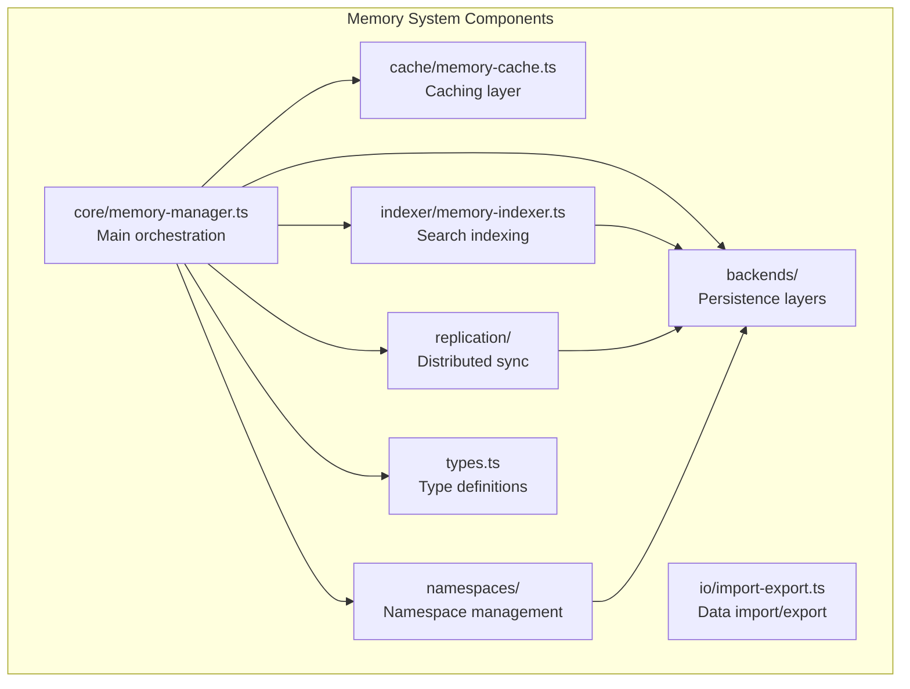
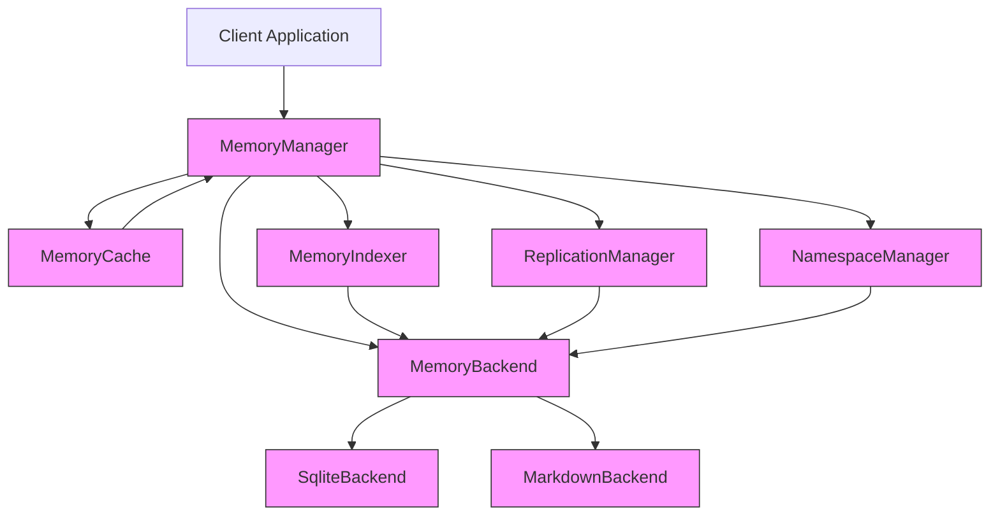
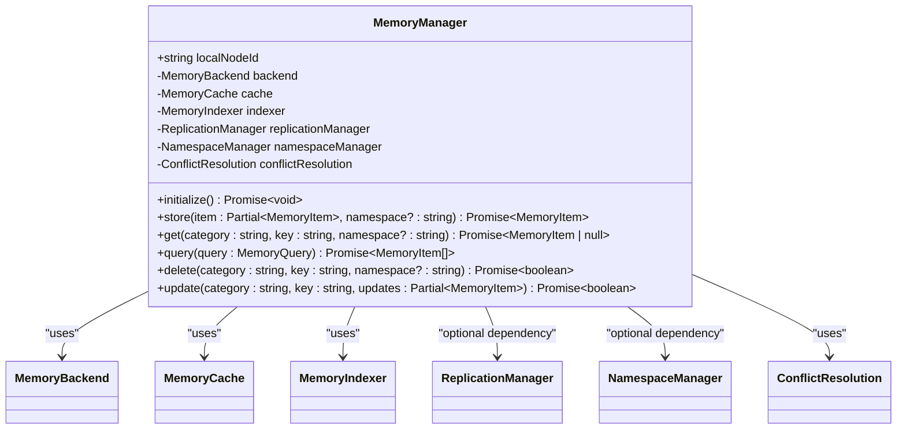
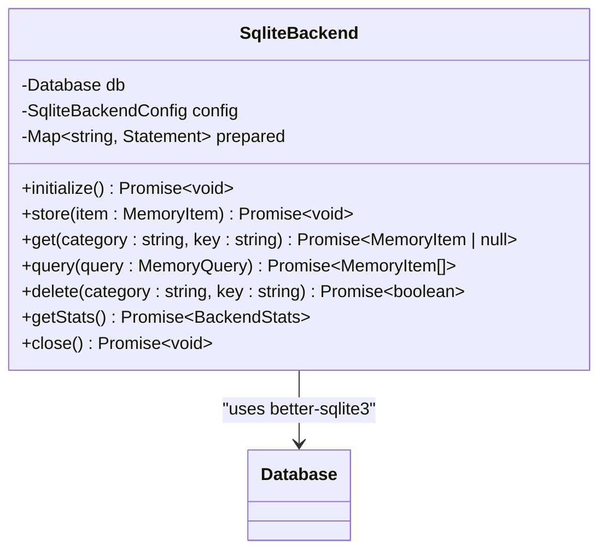
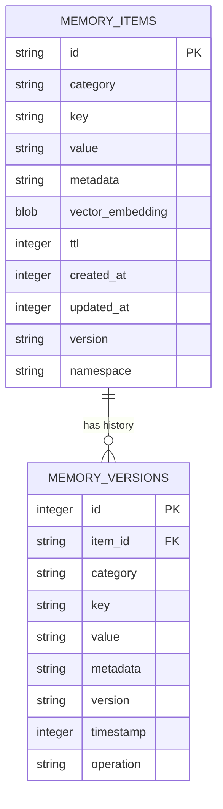
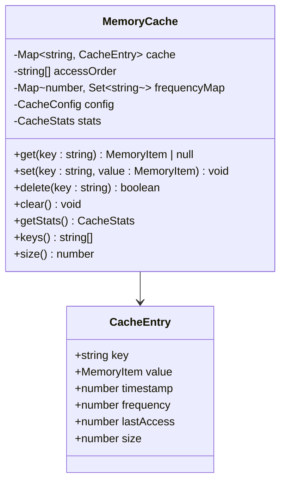
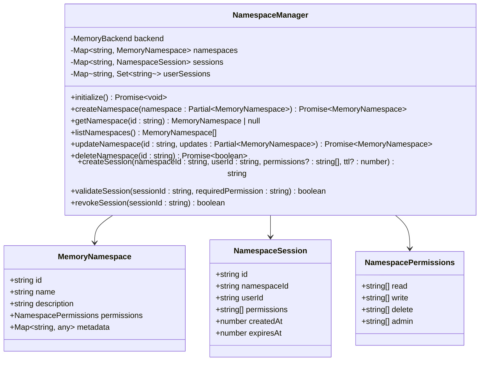
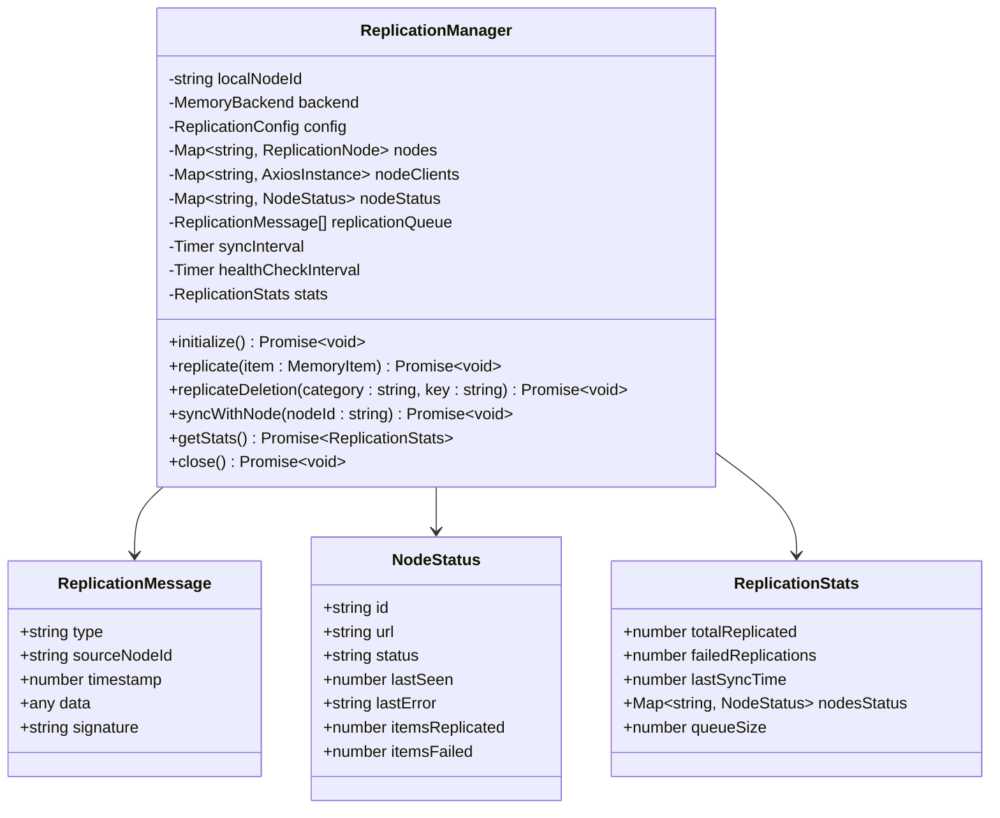
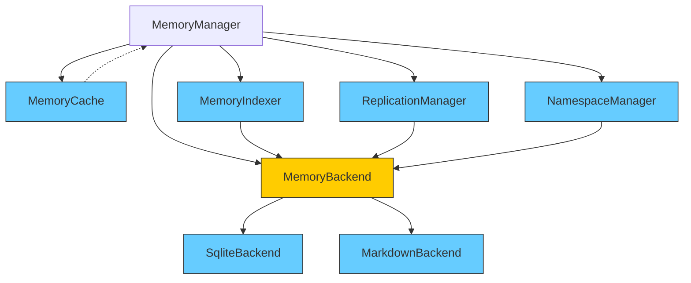

# Memory System API

<cite>
**Referenced Files in This Document**   
- [memory-manager.ts](file://archive/legacy-memory-system/src/core/memory-manager.ts)
- [sqlite-backend.ts](file://archive/legacy-memory-system/src/backends/sqlite-backend.ts)
- [types.ts](file://archive/legacy-memory-system/src/types.ts)
- [memory-cache.ts](file://archive/legacy-memory-system/src/cache/memory-cache.ts)
- [namespace-manager.ts](file://archive/legacy-memory-system/src/namespaces/namespace-manager.ts)
- [memory-indexer.ts](file://archive/legacy-memory-system/src/indexer/memory-indexer.ts)
- [replication-manager.ts](file://archive/legacy-memory-system/src/replication/replication-manager.ts)
- [index.ts](file://archive/legacy-memory-system/src/index.ts)
</cite>

## Table of Contents
1. [Introduction](#introduction)
2. [Project Structure](#project-structure)
3. [Core Components](#core-components)
4. [Architecture Overview](#architecture-overview)
5. [Detailed Component Analysis](#detailed-component-analysis)
6. [Dependency Analysis](#dependency-analysis)
7. [Performance Considerations](#performance-considerations)
8. [Troubleshooting Guide](#troubleshooting-guide)
9. [Conclusion](#conclusion)

## Introduction
The Memory System API provides a comprehensive solution for managing persistent memory storage in the Claude-Flow ecosystem. Built with SQLite persistence as its primary backend, this system enables reliable storage, retrieval, and querying of memory entries with support for advanced features like namespaces, time-to-live (TTL) expiration, and cross-session persistence. The API is designed to support collective intelligence applications where multiple agents need to share and access contextual information reliably.

This documentation details the API endpoints and functionality for storing, retrieving, and querying memory entries, with emphasis on the system's support for namespaces, TTL-based expiration, memory compression, bulk operations, and replication capabilities. The system implements a layered architecture with caching, indexing, and conflict resolution mechanisms to ensure high performance and data consistency across distributed environments.

## Project Structure
The memory system is organized in a modular structure within the legacy-memory-system directory, with components separated by functional responsibility. The core implementation resides in the src directory, which contains specialized subdirectories for different aspects of the memory system.



**Diagram sources**
- [memory-manager.ts](file://archive/legacy-memory-system/src/core/memory-manager.ts#L1-L50)
- [sqlite-backend.ts](file://archive/legacy-memory-system/src/backends/sqlite-backend.ts#L1-L30)

**Section sources**
- [memory-manager.ts](file://archive/legacy-memory-system/src/core/memory-manager.ts#L1-L50)
- [index.ts](file://archive/legacy-memory-system/src/index.ts#L1-L10)

## Core Components
The memory system consists of several core components that work together to provide a robust persistence solution. The MemoryManager class serves as the primary interface, coordinating interactions between the backend storage, caching layer, indexer, namespace manager, and replication manager. Each component has a specific responsibility, enabling separation of concerns and extensibility.

The system supports multiple backend storage options, with SQLite being the primary persistence mechanism. The SQLite backend provides ACID-compliant storage with full-text search capabilities through FTS5 virtual tables and version history tracking for time-travel queries. The caching layer implements LRU, LFU, and FIFO eviction strategies to optimize performance for frequently accessed data.

**Section sources**
- [memory-manager.ts](file://archive/legacy-memory-system/src/core/memory-manager.ts#L25-L100)
- [types.ts](file://archive/legacy-memory-system/src/types.ts#L1-L20)

## Architecture Overview
The memory system follows a layered architecture with clear separation between the API interface, business logic, and data persistence layers. The MemoryManager acts as the central orchestrator, handling requests from clients and coordinating with specialized components to fulfill operations.



**Diagram sources**
- [memory-manager.ts](file://archive/legacy-memory-system/src/core/memory-manager.ts#L1-L20)
- [sqlite-backend.ts](file://archive/legacy-memory-system/src/backends/sqlite-backend.ts#L1-L15)

## Detailed Component Analysis

### Memory Manager Analysis
The MemoryManager class is the primary entry point for all memory operations. It implements an event-driven architecture using EventEmitter to notify subscribers of state changes. The manager handles the complete lifecycle of memory items, from storage and retrieval to querying and deletion.



**Diagram sources**
- [memory-manager.ts](file://archive/legacy-memory-system/src/core/memory-manager.ts#L32-L200)

**Section sources**
- [memory-manager.ts](file://archive/legacy-memory-system/src/core/memory-manager.ts#L1-L500)

### SQLite Backend Analysis
The SqliteBackend provides persistent storage using SQLite with several performance optimizations and advanced features. It implements the MemoryBackend interface and provides reliable data persistence with transactional integrity.



**Diagram sources**
- [sqlite-backend.ts](file://archive/legacy-memory-system/src/backends/sqlite-backend.ts#L1-L50)

#### Database Schema
The SQLite backend uses a comprehensive schema with multiple tables and indexes to optimize query performance and support advanced features.



**Diagram sources**
- [sqlite-backend.ts](file://archive/legacy-memory-system/src/backends/sqlite-backend.ts#L50-L150)

### Memory Cache Analysis
The MemoryCache component provides an in-memory caching layer to improve performance for frequently accessed data. It supports multiple eviction strategies and automatic expiration based on TTL settings.



**Diagram sources**
- [memory-cache.ts](file://archive/legacy-memory-system/src/cache/memory-cache.ts#L1-L50)

### Namespace Manager Analysis
The NamespaceManager provides isolation and access control for memory items, allowing different sessions or users to have separate memory spaces while sharing the same underlying storage.



**Diagram sources**
- [namespace-manager.ts](file://archive/legacy-memory-system/src/namespaces/namespace-manager.ts#L1-L50)

### Memory Indexer Analysis
The MemoryIndexer provides fast search capabilities over memory items, including full-text search and vector similarity search for AI applications.

```mermaid
classDiagram
class MemoryIndexer {
-MemoryBackend backend
-Index index
-IndexConfig config
-Set~string~ updateQueue
-Timer updateInterval
+initialize() Promise~void~
+index(item : MemoryItem) Promise~void~
+remove(category : string, key : string) Promise~void~
+query(query : MemoryQuery) Promise~MemoryItem[]~
+vectorSearch(query : MemoryQuery) Promise~MemoryItem[]~
+rebuildIndex() Promise~void~
+supportsVectorSearch() boolean
}
class Index {
+Map~string, Set~string~~ byCategory
+Map~string, Set~string~~ byTag
+Map~string, Set~string~~ byNamespace
+{id : string, timestamp : number}[] byTimestamp
+VectorIndex vectors
}
class VectorIndex {
+number dimensions
+Map~string, Float32Array~ vectors
+Map~string, {category : string, key : string}~ metadata
}
MemoryIndexer --> Index
MemoryIndexer --> VectorIndex
```

**Diagram sources**
- [memory-indexer.ts](file://archive/legacy-memory-system/src/indexer/memory-indexer.ts#L1-L50)

### Replication Manager Analysis
The ReplicationManager handles distributed synchronization of memory items across multiple nodes, supporting both master-slave and peer-to-peer replication modes.



**Diagram sources**
- [replication-manager.ts](file://archive/legacy-memory-system/src/replication/replication-manager.ts#L1-L50)

## Dependency Analysis
The memory system components have well-defined dependencies that follow the dependency inversion principle. The MemoryManager depends on abstractions (interfaces) rather than concrete implementations, allowing for flexibility in configuration.



**Diagram sources**
- [memory-manager.ts](file://archive/legacy-memory-system/src/core/memory-manager.ts#L1-L50)
- [types.ts](file://archive/legacy-memory-system/src/types.ts#L45-L55)

**Section sources**
- [memory-manager.ts](file://archive/legacy-memory-system/src/core/memory-manager.ts#L1-L100)
- [types.ts](file://archive/legacy-memory-system/src/types.ts#L1-L150)

## Performance Considerations
The memory system incorporates several performance optimizations to ensure efficient operation:

1. **Caching**: The MemoryCache component reduces database load by serving frequently accessed items from memory with configurable eviction strategies (LRU, LFU, FIFO).

2. **Indexing**: The MemoryIndexer creates multiple indexes on the SQLite database, including FTS5 virtual tables for full-text search, significantly improving query performance.

3. **Connection Pooling**: The SQLite backend maintains a single database connection with prepared statements for common operations, reducing overhead.

4. **Batch Operations**: The replication manager queues operations for batch processing at configured intervals, minimizing network overhead in distributed scenarios.

5. **WAL Mode**: The SQLite backend enables Write-Ahead Logging mode for improved concurrency and reduced locking.

6. **Prepared Statements**: All database operations use prepared statements to avoid SQL parsing overhead on repeated executions.

The system also implements automatic cleanup of expired items and sessions, preventing unbounded growth of the cache and session stores.

## Troubleshooting Guide
When encountering issues with the memory system, consider the following common problems and solutions:

**Database Connectivity Issues**
- Ensure the SQLite database file path is writable
- Check file permissions on the database file and directory
- Verify that no other process has an exclusive lock on the database
- For network paths, ensure stable connectivity

**Storage Limits**
- Monitor database file size and implement rotation if needed
- Configure appropriate cache maxSize and TTL values
- Use the getStats() methods to monitor storage usage
- Consider partitioning data across multiple database files for very large datasets

**Performance Problems**
- Verify that indexes are properly created (check SQLite schema)
- Adjust cache configuration based on access patterns
- Monitor query performance and optimize frequently used queries
- Consider increasing SQLite cache_size pragma for better performance

**Replication Failures**
- Check network connectivity between nodes
- Verify that replication endpoints are accessible
- Review replication configuration for correct node URLs and roles
- Monitor replication queue size to detect backlogs

**Namespace Access Issues**
- Verify that sessions have appropriate permissions for operations
- Check namespace existence before attempting operations
- Validate session expiration times for long-running processes

**Section sources**
- [sqlite-backend.ts](file://archive/legacy-memory-system/src/backends/sqlite-backend.ts#L100-L200)
- [memory-cache.ts](file://archive/legacy-memory-system/src/cache/memory-cache.ts#L200-L300)
- [namespace-manager.ts](file://archive/legacy-memory-system/src/namespaces/namespace-manager.ts#L200-L300)

## Conclusion
The Memory System API provides a robust, feature-rich solution for persistent memory storage in AI and agent-based systems. With its SQLite persistence layer, the system offers reliable data storage with ACID compliance, while additional features like caching, indexing, and replication ensure high performance and availability in distributed environments.

Key strengths of the system include:
- Support for namespaces to isolate memory contexts
- Time-to-live (TTL) expiration for automatic cleanup
- Comprehensive indexing for fast querying
- Vector search capabilities for AI applications
- Distributed replication with conflict resolution
- Event-driven architecture for extensibility

The modular design allows for easy customization and extension, making it suitable for a wide range of applications from simple local storage to complex distributed systems. By following the patterns and best practices documented here, developers can effectively leverage the memory system to build intelligent applications with persistent context and shared knowledge.