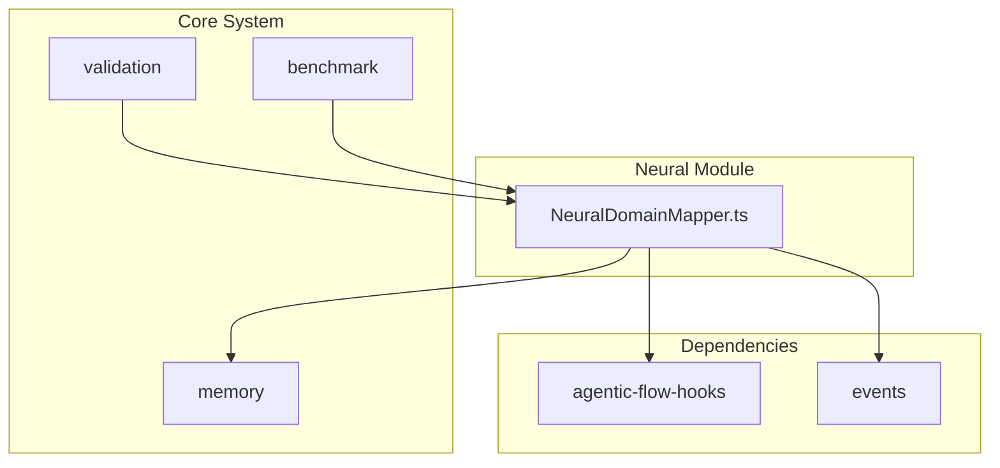
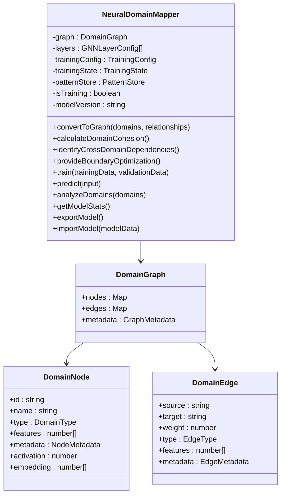
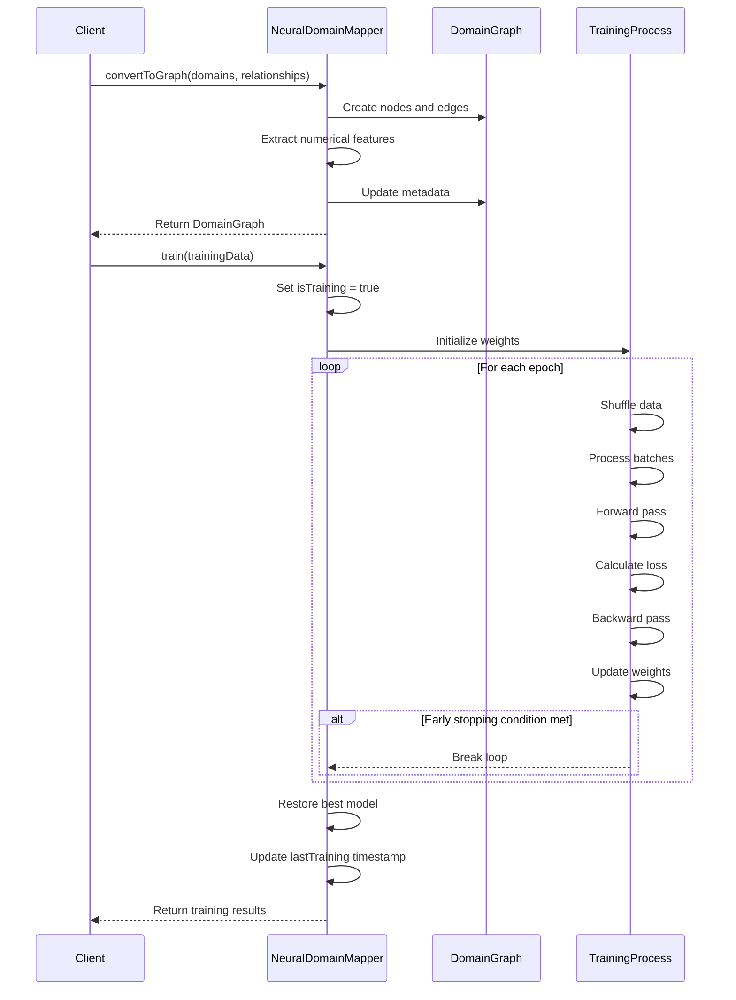
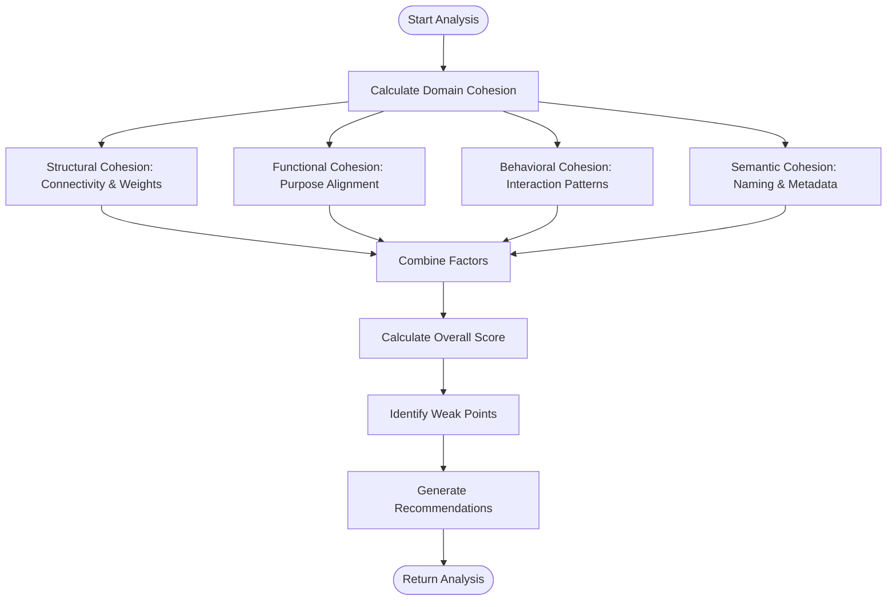
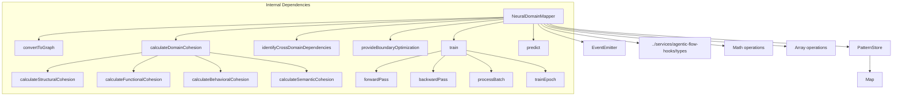

# Neural Network API

<cite>
**Referenced Files in This Document**   
- [NeuralDomainMapper.ts](file://src/neural/NeuralDomainMapper.ts#L0-L1678)
</cite>

## Table of Contents
1. [Introduction](#introduction)
2. [Project Structure](#project-structure)
3. [Core Components](#core-components)
4. [Architecture Overview](#architecture-overview)
5. [Detailed Component Analysis](#detailed-component-analysis)
6. [Dependency Analysis](#dependency-analysis)
7. [Performance Considerations](#performance-considerations)
8. [Troubleshooting Guide](#troubleshooting-guide)
9. [Conclusion](#conclusion)

## Introduction
The Neural Network API provides advanced cognitive analysis and pattern recognition capabilities through a Graph Neural Network (GNN)-based architecture. This API enables intelligent domain relationship mapping, cohesion analysis, dependency identification, and predictive boundary optimization for complex software systems. The core functionality is implemented in the NeuralDomainMapper class, which processes domain structures as graph data to identify architectural patterns and provide optimization recommendations. The system supports training on domain relationship patterns, making predictions about optimal domain organization, and exporting model state for persistence.

## Project Structure
The neural network functionality is located in the `src/neural` directory of the repository. The primary implementation file is `NeuralDomainMapper.ts`, which contains the complete GNN-based domain analysis system. This component is part of a larger agentic flow system that includes memory management, validation suites, and benchmarking tools. The neural module depends on type definitions from the agentic-flow-hooks service and uses EventEmitter for event-driven communication between components.

**Diagram sources**
- [NeuralDomainMapper.ts](file://src/neural/NeuralDomainMapper.ts#L0-L1678)

**Section sources**
- [NeuralDomainMapper.ts](file://src/neural/NeuralDomainMapper.ts#L0-L1678)

## Core Components
The NeuralDomainMapper class is the central component of the neural network API, implementing a Graph Neural Network architecture for domain relationship analysis. It converts domain structures into graph representations with nodes and edges, each containing rich metadata and feature vectors. The system calculates comprehensive cohesion scores across structural, functional, behavioral, and semantic dimensions, and identifies cross-domain dependencies including circular dependencies and critical paths. The mapper provides predictive boundary optimization suggestions for merging, splitting, or relocating domains to improve system architecture. The implementation includes a multi-layer GNN with configurable layer types (GCN, GAT), activation functions, and regularization techniques.

**Section sources**
- [NeuralDomainMapper.ts](file://src/neural/NeuralDomainMapper.ts#L254-L1665)

## Architecture Overview
The Neural Network API follows a graph-based machine learning architecture where domain structures are represented as nodes and their relationships as edges. The system processes these graphs through multiple GNN layers to learn domain relationship patterns. The architecture supports both training and inference modes, with the ability to persist model state. Events are emitted at key points in the processing pipeline, enabling integration with monitoring and logging systems. The design separates concerns between graph conversion, cohesion analysis, dependency identification, and optimization recommendation generation.

**Diagram sources**
- [NeuralDomainMapper.ts](file://src/neural/NeuralDomainMapper.ts#L0-L1678)

## Detailed Component Analysis

### Neural Domain Mapper Analysis
The NeuralDomainMapper class implements a complete GNN-based system for analyzing software domain relationships. It begins by converting domain structures and their relationships into a graph format with numerical feature vectors for machine learning processing. The system then performs multi-dimensional cohesion analysis, evaluating domains across structural, functional, behavioral, and semantic dimensions to identify architectural weaknesses.

#### For API/Service Components:

**Diagram sources**
- [NeuralDomainMapper.ts](file://src/neural/NeuralDomainMapper.ts#L254-L1665)

#### For Complex Logic Components:

**Diagram sources**
- [NeuralDomainMapper.ts](file://src/neural/NeuralDomainMapper.ts#L254-L1665)

**Section sources**
- [NeuralDomainMapper.ts](file://src/neural/NeuralDomainMapper.ts#L254-L1665)

## Dependency Analysis
The NeuralDomainMapper has minimal external dependencies, primarily relying on Node.js EventEmitter for event handling and type definitions from the agentic-flow-hooks module. The internal dependency structure is self-contained, with the class managing its own graph data, training configuration, and model state. The system uses a layered architecture where higher-level analysis functions depend on lower-level graph processing utilities. There are no circular dependencies within the implementation, and the class follows a clear hierarchy from data conversion to advanced analysis.

**Diagram sources**
- [NeuralDomainMapper.ts](file://src/neural/NeuralDomainMapper.ts#L0-L1678)

**Section sources**
- [NeuralDomainMapper.ts](file://src/neural/NeuralDomainMapper.ts#L0-L1678)

## Performance Considerations
The Neural Domain Mapper is designed with performance in mind, implementing several optimization techniques. The system uses efficient data structures like Maps for O(1) lookups of nodes and edges. Feature vectors are preprocessed to fixed sizes to ensure consistent computational requirements. The training process includes early stopping to prevent unnecessary computation when performance plateaus. Batch processing reduces memory overhead during training, and the implementation includes learning rate scheduling to improve convergence speed. For large graphs, the system could benefit from additional optimizations such as graph sampling or mini-batch training, but the current implementation is suitable for moderate-sized domain models.

## Troubleshooting Guide
When encountering issues with the Neural Network API, consider the following common problems and solutions:

1. **Training fails to converge**: Check the learning rate setting in the training configuration. A rate that is too high can cause instability, while one that is too low may result in slow convergence. Adjust the learningRate parameter and consider enabling learning rate scheduling.

2. **Low prediction confidence**: Ensure that input domain features are properly normalized and contain sufficient information. The system relies on numerical feature vectors to make predictions, so sparse or poorly encoded features will result in low confidence scores.

3. **Memory issues with large graphs**: The current implementation loads the entire graph into memory. For very large domain models, consider breaking the analysis into smaller chunks or implementing graph sampling techniques.

4. **Circular dependency detection issues**: Verify that the dependency graph is correctly constructed with proper source and target relationships. The circular dependency detection algorithm assumes directed edges, so bidirectional relationships should be represented as two separate unidirectional edges.

5. **Poor cohesion scores**: Review the domain definitions and relationships to ensure they accurately reflect the system architecture. The cohesion analysis is only as good as the input data, so incomplete or inaccurate domain information will produce misleading results.

**Section sources**
- [NeuralDomainMapper.ts](file://src/neural/NeuralDomainMapper.ts#L254-L1665)

## Conclusion
The Neural Network API provides a sophisticated system for analyzing and optimizing software domain relationships using Graph Neural Network technology. The NeuralDomainMapper class offers comprehensive capabilities for converting domain structures into machine-readable graphs, analyzing cohesion and dependencies, and providing actionable optimization recommendations. The implementation is well-structured, with clear separation of concerns between data conversion, analysis, and optimization functions. While the current API focuses on architectural analysis, the foundation supports expansion into additional cognitive capabilities such as predictive modeling and adaptive learning. The event-driven design enables integration with monitoring systems, and the model persistence features allow for continuous learning across analysis sessions.