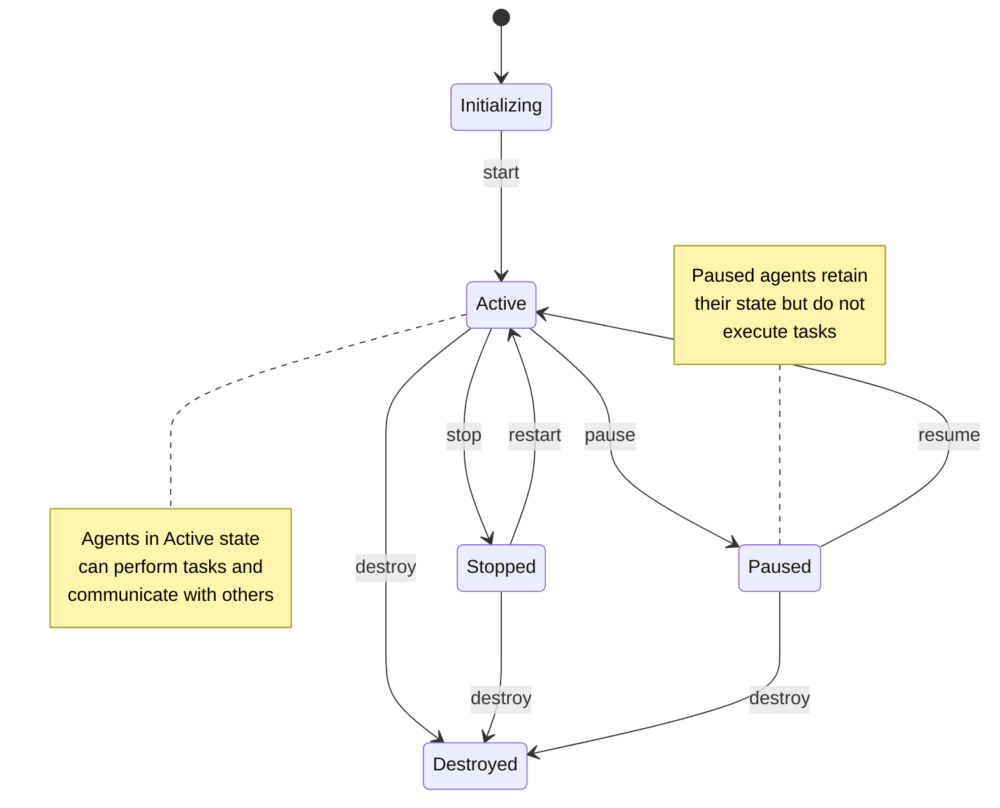
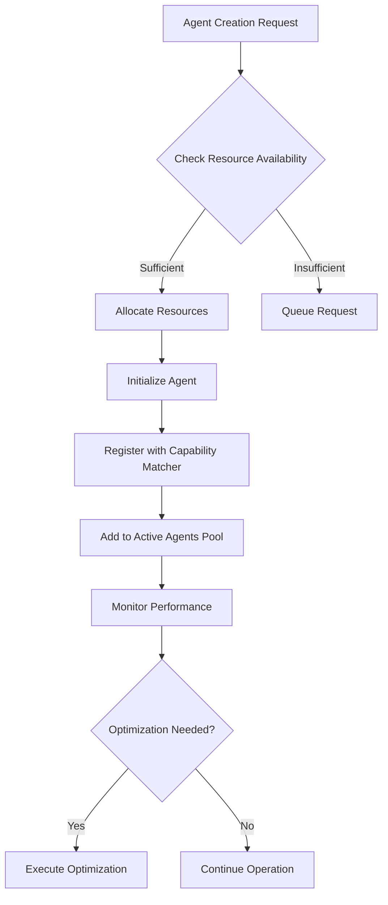
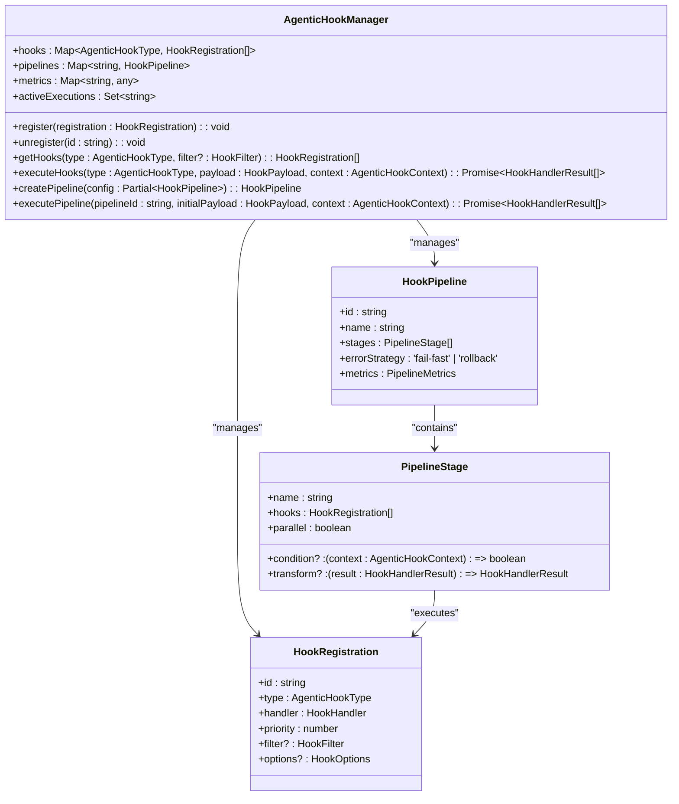
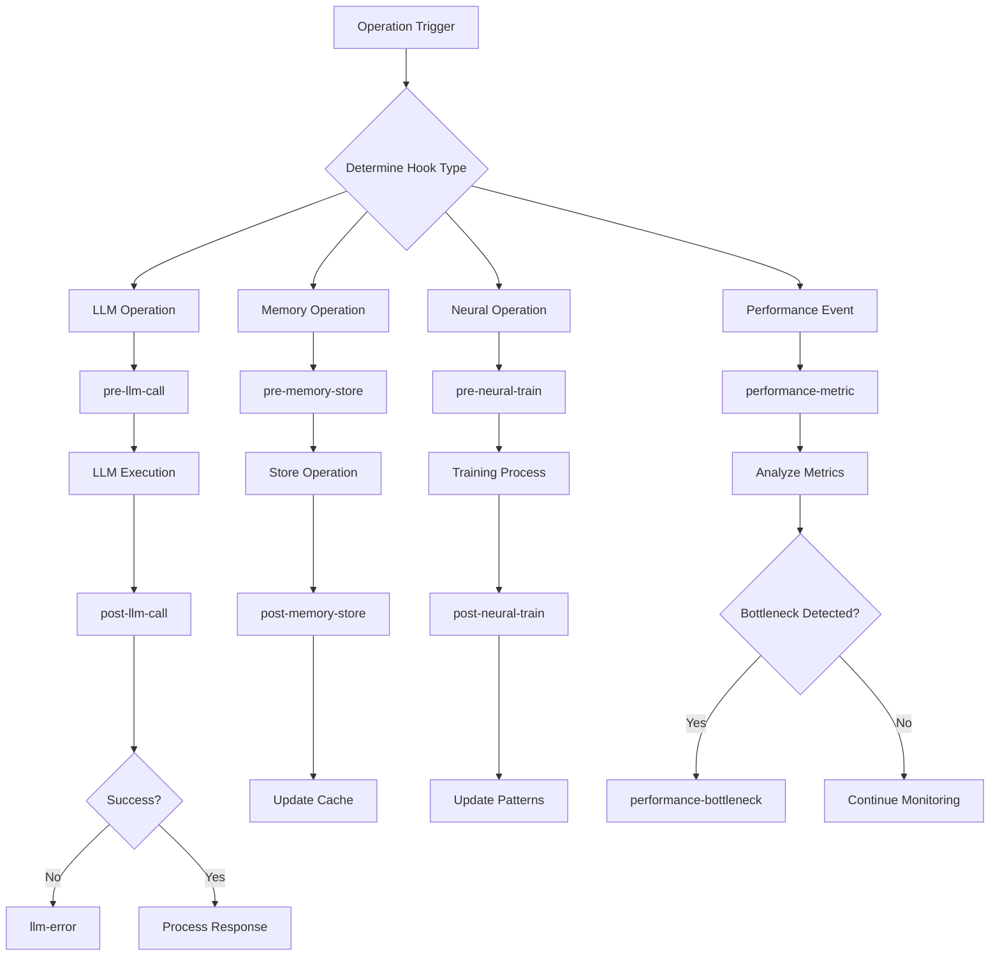
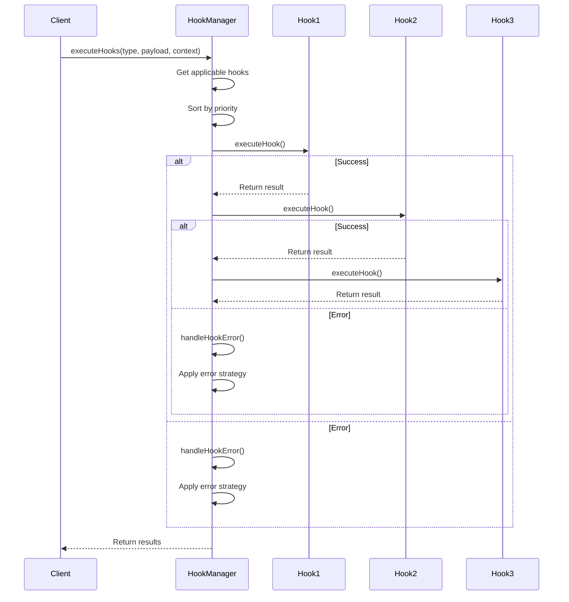
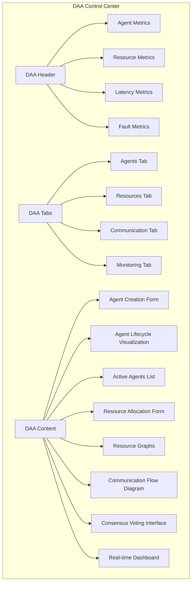
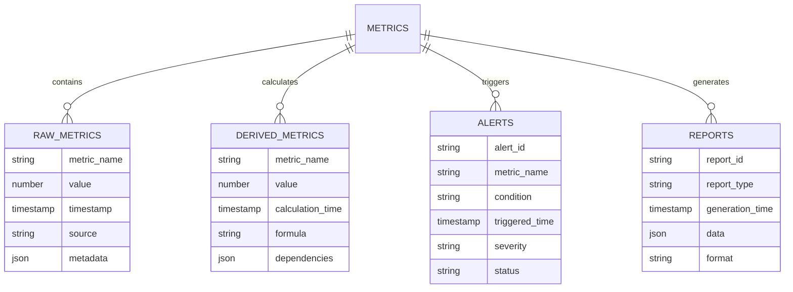
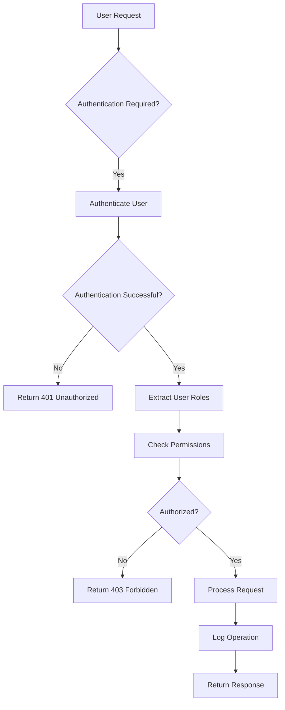
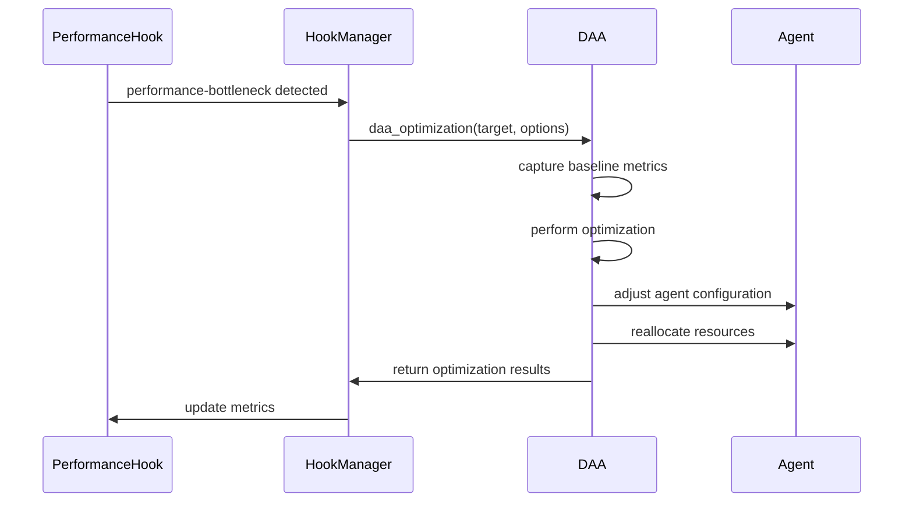

# Advanced Features

<cite>
**Referenced Files in This Document**   
- [hook-manager.ts](file://src/services/agentic-flow-hooks/hook-manager.ts)
- [types.ts](file://src/services/agentic-flow-hooks/types.ts)
- [daa-tools.js](file://src/ui/console/js/daa-tools.js)
- [DAAView.js](file://src/ui/web-ui/views/DAAView.js)
- [llm-hooks.ts](file://src/services/agentic-flow-hooks/llm-hooks.ts)
- [memory-hooks.ts](file://src/services/agentic-flow-hooks/memory-hooks.ts)
- [neural-hooks.ts](file://src/services/agentic-flow-hooks/neural-hooks.ts)
- [performance-hooks.ts](file://src/services/agentic-flow-hooks/performance-hooks.ts)
- [workflow-hooks.ts](file://src/services/agentic-flow-hooks/workflow-hooks.ts)
</cite>

## Table of Contents
1. [Introduction](#introduction)
2. [Dynamic Agent Architecture (DAA)](#dynamic-agent-architecture-daa)
3. [Hook System](#hook-system)
4. [Web UI Interface](#web-ui-interface)
5. [Performance Monitoring](#performance-monitoring)
6. [Security Features](#security-features)
7. [Feature Integration and Best Practices](#feature-integration-and-best-practices)
8. [Troubleshooting Guide](#troubleshooting-guide)

## Introduction
The Advanced Features section details the extended capabilities of Claude-Flow that enhance its core swarm intelligence system. These features provide sophisticated mechanisms for agent lifecycle management, automation, visualization, performance tracking, and security. The Dynamic Agent Architecture (DAA) enables flexible agent creation and management, while the hook system allows for pre- and post-operation automation. The Web UI interface offers visual monitoring and configuration, and comprehensive performance monitoring tools provide insights into system behavior. These advanced features work together to create a robust, scalable, and maintainable agentic system that can handle complex workflows and adapt to changing requirements.

## Dynamic Agent Architecture (DAA)
The Dynamic Agent Architecture (DAA) provides a comprehensive framework for managing agents throughout their lifecycle, from creation to destruction. This architecture enables dynamic allocation of resources, capability matching, inter-agent communication, consensus mechanisms, fault tolerance, and performance optimization.

### Agent Lifecycle Management
The DAA implements a complete agent lifecycle management system with eight core tools that allow for the creation, monitoring, and control of agents within the swarm intelligence system. The lifecycle management functionality is implemented in the DAATools class, which provides methods for all stages of an agent's existence.

**Diagram sources**
- [daa-tools.js](file://src/ui/console/js/daa-tools.js#L0-L1036)

The agent lifecycle begins with creation through the `daa_agent_create` method, which initializes a new agent with specified capabilities, resources, and metadata. Agents transition through various states including initializing, active, paused, stopped, and destroyed. The `daa_lifecycle_manage` method handles state transitions, allowing agents to be started, paused, resumed, stopped, restarted, or destroyed based on system requirements.

**Section sources**
- [daa-tools.js](file://src/ui/console/js/daa-tools.js#L0-L1036)

### Resource Management and Capability Matching
The DAA includes sophisticated resource management and capability matching systems that optimize the allocation of computational resources and ensure agents with appropriate capabilities are assigned to tasks. The resource allocation system tracks CPU, memory, storage, and network resources, providing real-time utilization metrics and allocation capabilities.

**Diagram sources**
- [daa-tools.js](file://src/ui/console/js/daa-tools.js#L0-L1036)

The capability matching system evaluates agent capabilities against task requirements, scoring potential matches and ranking them by suitability. This ensures that tasks are assigned to the most capable agents, improving overall system efficiency and success rates. The system supports fuzzy matching of capabilities, allowing for flexible interpretation of requirements.

**Section sources**
- [daa-tools.js](file://src/ui/console/js/daa-tools.js#L0-L1036)

## Hook System
The hook system provides a powerful mechanism for extending and customizing the behavior of Claude-Flow through pre- and post-operation automation. This event-driven architecture allows developers to inject custom logic at specific points in the execution flow, enabling advanced monitoring, modification, and control of system operations.

### Core Architecture and Implementation
The hook system is centered around the AgenticHookManager class, which implements a registry for managing hook registrations, execution, and lifecycle. The system supports multiple hook types for different subsystems including LLM operations, memory management, neural processing, and performance monitoring.

**Diagram sources**
- [hook-manager.ts](file://src/services/agentic-flow-hooks/hook-manager.ts#L0-L701)

The hook manager maintains a collection of hooks organized by type, with each hook having a priority that determines execution order. Hooks are executed in descending priority order, allowing critical operations to be processed first. The system supports filtering based on providers, models, patterns, and conditions, enabling targeted execution of hooks based on specific criteria.

**Section sources**
- [hook-manager.ts](file://src/services/agentic-flow-hooks/hook-manager.ts#L0-L701)

### Hook Types and Payloads
The system defines several specialized hook types for different subsystems, each with its own payload structure and execution context. These include LLM hooks for language model operations, memory hooks for data storage and retrieval, neural hooks for pattern detection and adaptation, and performance hooks for monitoring and optimization.

**Diagram sources**
- [types.ts](file://src/services/agentic-flow-hooks/types.ts#L0-L503)

LLM hooks intercept language model operations before and after execution, allowing for request modification, response processing, error handling, and caching. Memory hooks manage data storage and retrieval operations, enabling synchronization, persistence, and expiration of stored data. Neural hooks monitor pattern detection and adaptation processes, capturing training events and prediction outcomes. Performance hooks collect metrics and detect bottlenecks, triggering optimization workflows when necessary.

**Section sources**
- [types.ts](file://src/services/agentic-flow-hooks/types.ts#L0-L503)

### Execution Pipeline and Error Handling
The hook system implements a sophisticated execution pipeline that supports both sequential and parallel processing of hooks, with comprehensive error handling and recovery mechanisms. The pipeline architecture allows for complex workflows with conditional execution, transformations, and rollback capabilities.

**Diagram sources**
- [hook-manager.ts](file://src/services/agentic-flow-hooks/hook-manager.ts#L0-L701)

Hooks can be organized into pipelines with multiple stages, where each stage can execute hooks sequentially or in parallel. The system supports conditional execution based on context, allowing stages to be skipped when certain conditions are not met. Results from one stage can be transformed before being passed to the next stage, enabling complex data processing workflows.

The error handling system provides multiple strategies including fail-fast (immediate termination on error), retry with exponential backoff, fallback execution, and rollback of completed operations. Each hook can specify its own error handling strategy through options, allowing for fine-grained control over error recovery.

**Section sources**
- [hook-manager.ts](file://src/services/agentic-flow-hooks/hook-manager.ts#L0-L701)

## Web UI Interface
The Web UI interface provides a visual environment for monitoring, configuring, and interacting with the Claude-Flow system. It offers real-time visualization of agent states, resource utilization, communication flows, and performance metrics, enabling users to gain insights into system behavior and make informed decisions.

### DAA Visualization and Control
The DAA View component provides a comprehensive interface for managing dynamic agents and their resources. It displays agent lifecycle states, resource allocation, communication patterns, and consensus mechanisms through interactive visualizations.

**Diagram sources**
- [DAAView.js](file://src/ui/web-ui/views/DAAView.js#L0-L54)
- [daa-tools.js](file://src/ui/console/js/daa-tools.js#L0-L1036)

The interface includes tools for agent creation, capability matching, resource allocation, lifecycle management, inter-agent communication, consensus mechanisms, fault tolerance, and performance optimization. Users can create agents with specific capabilities, allocate resources, manage agent states, initiate communication between agents, establish consensus on proposals, handle system faults, and optimize performance through a unified interface.

**Section sources**
- [DAAView.js](file://src/ui/web-ui/views/DAAView.js#L0-L54)
- [daa-tools.js](file://src/ui/console/js/daa-tools.js#L0-L1036)

## Performance Monitoring
The performance monitoring system provides comprehensive tools for tracking system behavior, identifying bottlenecks, and optimizing performance. It collects metrics from various subsystems and presents them through visualizations and reports, enabling proactive management of system resources.

### Metrics Collection and Analysis
The system collects a wide range of performance metrics including agent count, resource utilization, communication latency, consensus time, and fault count. These metrics are used to calculate derived values such as throughput, error rates, and performance gains.

**Diagram sources**
- [hook-manager.ts](file://src/services/agentic-flow-hooks/hook-manager.ts#L0-L701)
- [daa-tools.js](file://src/ui/console/js/daa-tools.js#L0-L1036)

The metrics system supports real-time monitoring and historical analysis, allowing users to identify trends and patterns in system behavior. It integrates with the hook system to collect metrics from various operations and provides APIs for custom metric collection and analysis.

**Section sources**
- [hook-manager.ts](file://src/services/agentic-flow-hooks/hook-manager.ts#L0-L701)
- [daa-tools.js](file://src/ui/console/js/daa-tools.js#L0-L1036)

## Security Features
The security features of Claude-Flow ensure the integrity, confidentiality, and availability of the system and its data. These features include authentication, authorization, data encryption, audit logging, and secure communication protocols.

### Authentication and Authorization
The system implements role-based access control (RBAC) to manage user permissions and ensure that only authorized users can perform specific operations. It supports multiple authentication methods including API keys, OAuth, and JWT tokens.

**Diagram sources**
- [hook-manager.ts](file://src/services/agentic-flow-hooks/hook-manager.ts#L0-L701)

The authorization system integrates with the hook system to enforce security policies at various points in the execution flow. Security hooks can be registered to validate permissions before critical operations, log security events, and trigger alerts for suspicious activities.

**Section sources**
- [hook-manager.ts](file://src/services/agentic-flow-hooks/hook-manager.ts#L0-L701)

## Feature Integration and Best Practices
The advanced features of Claude-Flow are designed to work together seamlessly, creating a cohesive system that is greater than the sum of its parts. Proper integration of these features can significantly enhance the capabilities and reliability of the swarm intelligence system.

### Integrating DAA with Hook System
The Dynamic Agent Architecture and hook system can be integrated to create self-managing agents that automatically adapt to changing conditions. For example, performance monitoring hooks can trigger optimization workflows through the DAA interface, or fault detection hooks can initiate recovery procedures.

**Diagram sources**
- [hook-manager.ts](file://src/services/agentic-flow-hooks/hook-manager.ts#L0-L701)
- [daa-tools.js](file://src/ui/console/js/daa-tools.js#L0-L1036)

This integration enables autonomous optimization of the system, where performance bottlenecks are automatically detected and addressed without human intervention. Similarly, fault tolerance hooks can trigger DAA recovery procedures when system faults are detected, ensuring high availability and reliability.

**Section sources**
- [hook-manager.ts](file://src/services/agentic-flow-hooks/hook-manager.ts#L0-L701)
- [daa-tools.js](file://src/ui/console/js/daa-tools.js#L0-L1036)

## Troubleshooting Guide
This section addresses common issues encountered when implementing and using the advanced features of Claude-Flow, providing guidance for diagnosis and resolution.

### Hook System Issues
Common issues with the hook system include registration conflicts, execution errors, and performance degradation due to excessive hook processing.

**Issue**: Hook registration fails with "Hook with ID already registered" error
**Solution**: Ensure each hook has a unique ID. Use descriptive IDs that include the module and purpose, such as "llm-cache-validation" or "memory-sync-post-store".

**Issue**: Hooks are not executing as expected
**Solution**: Verify that the hook type matches the operation being performed. Check that the hook filter conditions are correctly configured to match the intended operations.

**Issue**: System performance degrades with many registered hooks
**Solution**: Optimize hook execution by using appropriate priorities, implementing caching where possible, and minimizing the complexity of hook handlers. Consider using pipeline stages to group related hooks and reduce overhead.

**Section sources**
- [hook-manager.ts](file://src/services/agentic-flow-hooks/hook-manager.ts#L0-L701)

### DAA Management Issues
Common issues with DAA management include agent lifecycle errors, resource allocation failures, and communication problems.

**Issue**: Agent creation fails with resource allocation error
**Solution**: Check available system resources and adjust the allocation request accordingly. Implement queuing for resource requests when immediate allocation is not possible.

**Issue**: Agents fail to communicate with each other
**Solution**: Verify that both agents are in an active state and that the communication channel is properly configured. Check for network connectivity issues and firewall restrictions.

**Issue**: Consensus process fails to reach agreement
**Solution**: Review the consensus algorithm and threshold settings. Ensure that a sufficient number of agents are available and responsive. Consider implementing timeout mechanisms and fallback strategies.

**Section sources**
- [daa-tools.js](file://src/ui/console/js/daa-tools.js#L0-L1036)