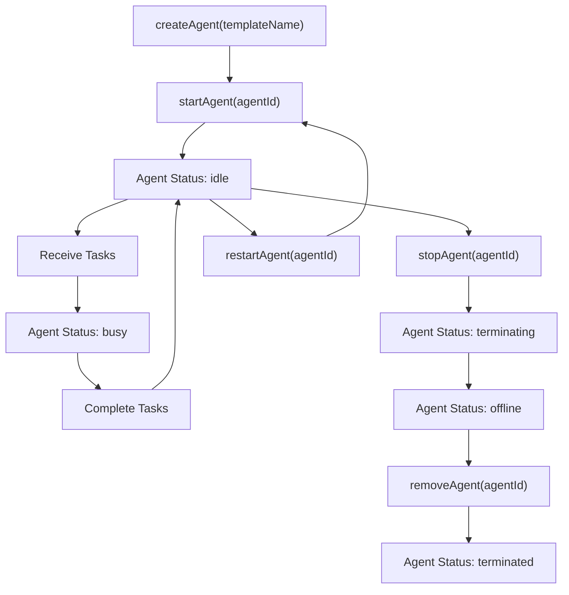
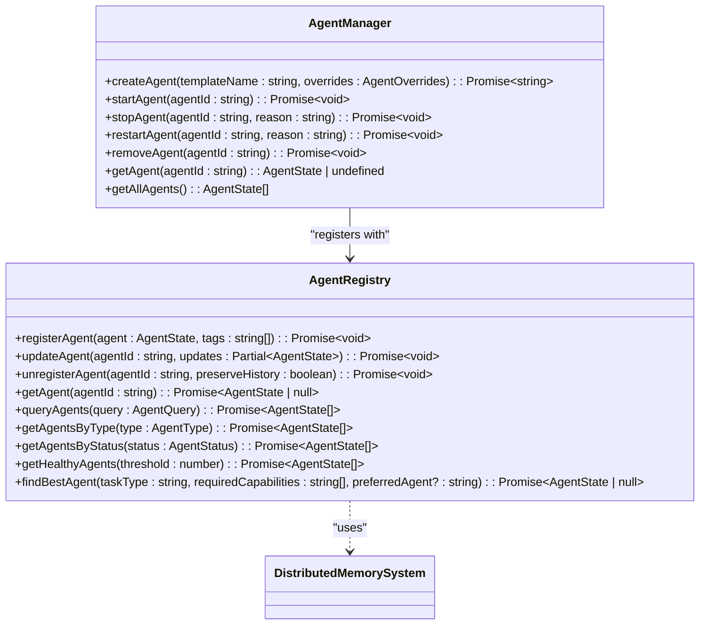
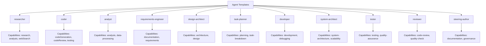
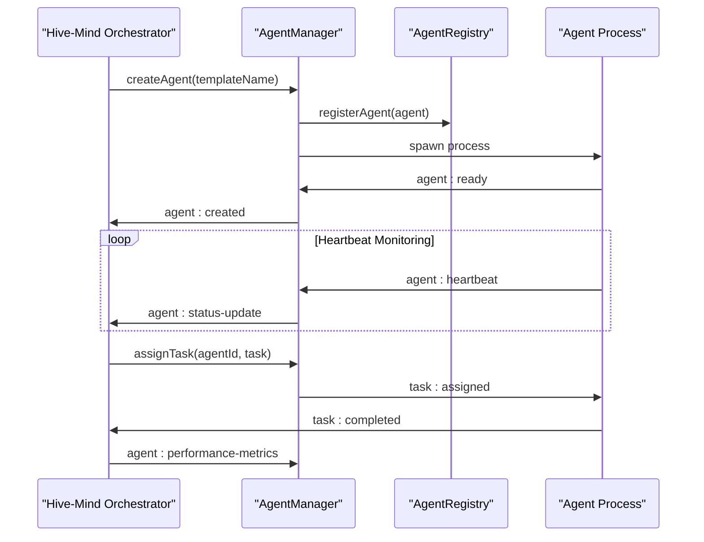

# Dynamic Agent Architecture (DAA)

<cite>
**Referenced Files in This Document**   
- [agent-manager.ts](file://src/agents/agent-manager.ts)
- [agent-registry.ts](file://src/agents/agent-registry.ts)
</cite>

## Table of Contents
1. [Introduction](#introduction)
2. [Agent Lifecycle Management](#agent-lifecycle-management)
3. [Agent Registration and Discovery](#agent-registration-and-discovery)
4. [Domain Model: Agent Types, Capabilities, and States](#domain-model-agent-types-capabilities-and-states)
5. [Custom Agent Definition and Deployment](#custom-agent-definition-and-deployment)
6. [Integration with Hive-Mind Orchestration System](#integration-with-hive-mind-orchestration-system)
7. [Troubleshooting Common Issues](#troubleshooting-common-issues)
8. [Performance Considerations and Best Practices](#performance-considerations-and-best-practices)

## Introduction
The Dynamic Agent Architecture (DAA) is a core subsystem within the Claude-Flow framework designed to manage the creation, configuration, execution, and termination of autonomous software agents. This document provides a comprehensive overview of the DAA, focusing on agent lifecycle management, registration and discovery mechanisms, domain modeling, and integration with the Hive-Mind orchestration system. The architecture enables scalable, resilient, and intelligent agent swarms capable of performing complex tasks through coordinated collaboration.

**Section sources**
- [agent-manager.ts](file://src/agents/agent-manager.ts)
- [agent-registry.ts](file://src/agents/agent-registry.ts)

## Agent Lifecycle Management

The DAA implements a robust agent lifecycle management system through the `AgentManager` class, which orchestrates the complete lifecycle of agents from creation to termination. The lifecycle consists of several distinct states and operations that ensure reliable and efficient agent operation.

### Agent States
Agents transition through a well-defined state machine:
- **initializing**: Agent is being created and configured
- **idle**: Agent is running and ready to accept tasks
- **busy**: Agent is currently executing one or more tasks
- **terminating**: Agent is in the process of shutting down
- **error**: Agent has encountered a failure condition
- **offline**: Agent is not currently running
- **terminated**: Agent has been completely removed from the system

### Lifecycle Operations
The `AgentManager` provides a comprehensive API for managing agent lifecycles:



**Diagram sources**
- [agent-manager.ts](file://src/agents/agent-manager.ts#L200-L400)

**Section sources**
- [agent-manager.ts](file://src/agents/agent-manager.ts#L200-L400)

#### Agent Creation
The `createAgent` method instantiates a new agent based on a predefined template with optional configuration overrides:

```typescript
async createAgent(
  templateName: string,
  overrides: {
    name?: string;
    config?: Partial<AgentConfig>;
    environment?: Partial<AgentEnvironment>;
  } = {}
): Promise<string>
```

This method validates agent limits, applies template defaults, merges configuration overrides, and initializes the agent state with comprehensive metrics and health monitoring.

#### Agent Startup
The `startAgent` method transitions an agent from the initializing or offline state to an active state by spawning a child process:

```typescript
async startAgent(agentId: string): Promise<void>
```

The method handles process spawning, startup timeout monitoring, and error handling for failed initialization. It emits events to notify the system of agent status changes.

#### Agent Termination
The `stopAgent` method implements a graceful shutdown sequence:

```typescript
async stopAgent(agentId: string, reason: string = 'user_request'): Promise<void>
```

The process sends a SIGTERM signal followed by a forced SIGKILL if the agent does not terminate within the configured timeout period, ensuring resource cleanup and preventing zombie processes.

#### Agent Restart
The `restartAgent` method combines stopping and starting operations to refresh agent state:

```typescript
async restartAgent(agentId: string, reason: string = 'restart_requested'): Promise<void>
```

This operation is essential for recovering from error states or applying configuration updates.

## Agent Registration and Discovery

The DAA employs a dual-component system for agent registration and discovery, consisting of the `AgentManager` for lifecycle operations and the `AgentRegistry` for discovery and querying.

### AgentManager Interface
The `AgentManager` serves as the primary interface for agent lifecycle operations and provides methods for retrieving agent information:

```typescript
// Get individual agent
getAgent(agentId: string): AgentState | undefined

// Get all agents
getAllAgents(): AgentState[]

// Filter by type or status
getAgentsByType(type: AgentType): AgentState[]
getAgentsByStatus(status: AgentStatus): AgentState[]
```

### AgentRegistry Interface
The `AgentRegistry` provides a persistent, queryable store for agent metadata and enables sophisticated discovery capabilities:



**Diagram sources**
- [agent-manager.ts](file://src/agents/agent-manager.ts#L124-L1734)
- [agent-registry.ts](file://src/agents/agent-registry.ts#L41-L481)

**Section sources**
- [agent-manager.ts](file://src/agents/agent-manager.ts#L124-L1734)
- [agent-registry.ts](file://src/agents/agent-registry.ts#L41-L481)

#### Registration Process
When an agent is created and started, the `AgentManager` automatically registers it with the `AgentRegistry`:

```typescript
async registerAgent(agent: AgentState, tags: string[] = []): Promise<void>
```

The registry stores agent state along with metadata, creation timestamps, and tags for efficient querying.

#### Agent Discovery
The registry supports multiple discovery mechanisms:

1. **Direct lookup**: Retrieve an agent by ID
2. **Query-based filtering**: Search agents by type, status, health threshold, or name patterns
3. **Capability-based search**: Find agents with specific language, framework, domain, or tool capabilities
4. **Best agent selection**: Automatically identify the most suitable agent for a given task

The `findBestAgent` method uses a scoring algorithm that considers health, success rate, availability, and capability match to select optimal agents:

```typescript
async findBestAgent(
  taskType: string,
  requiredCapabilities: string[] = [],
  preferredAgent?: string,
): Promise<AgentState | null>
```

## Domain Model: Agent Types, Capabilities, and States

The DAA implements a rich domain model that defines agent types, capabilities, and states, enabling sophisticated agent specialization and coordination.

### Agent State Model
The `AgentState` interface represents the complete state of an agent:

```typescript
interface AgentState {
  id: AgentIdentifier;
  name: string;
  type: AgentType;
  status: AgentStatus;
  capabilities: AgentCapabilities;
  metrics: AgentMetrics;
  workload: number;
  health: number;
  config: AgentConfig;
  environment: AgentEnvironment;
  endpoints: string[];
  lastHeartbeat: Date;
  taskHistory: AgentTask[];
  errorHistory: AgentError[];
  childAgents: AgentIdentifier[];
  collaborators: AgentIdentifier[];
}
```

### Agent Templates
The system uses templates to define agent types with specific capabilities and configurations. The `AgentManager` initializes several built-in templates:



**Diagram sources**
- [agent-manager.ts](file://src/agents/agent-manager.ts#L180-L1100)

**Section sources**
- [agent-manager.ts](file://src/agents/agent-manager.ts#L180-L1100)

### Capabilities Model
Each agent template defines a comprehensive capabilities profile:

```typescript
interface AgentCapabilities {
  codeGeneration: boolean;
  codeReview: boolean;
  testing: boolean;
  documentation: boolean;
  research: boolean;
  analysis: boolean;
  webSearch: boolean;
  apiIntegration: boolean;
  fileSystem: boolean;
  terminalAccess: boolean;
  languages: string[];
  frameworks: string[];
  domains: string[];
  tools: string[];
  maxConcurrentTasks: number;
  maxMemoryUsage: number;
  maxExecutionTime: number;
  reliability: number;
  speed: number;
  quality: number;
}
```

These capabilities enable the system to route tasks to appropriately skilled agents and enforce security policies based on permission levels.

## Custom Agent Definition and Deployment

The DAA supports the definition and deployment of custom agent types through template extension and configuration.

### Defining Custom Agent Templates
Custom agents can be defined by extending the template system:

```typescript
// Example: Creating a custom data scientist agent
agentManager.templates.set('data-scientist', {
  name: 'Data Scientist Agent',
  type: 'data-scientist',
  capabilities: {
    codeGeneration: true,
    codeReview: true,
    testing: true,
    documentation: true,
    research: true,
    analysis: true,
    webSearch: false,
    apiIntegration: true,
    fileSystem: true,
    terminalAccess: true,
    languages: ['python', 'r', 'sql'],
    frameworks: ['tensorflow', 'pytorch', 'scikit-learn'],
    domains: ['machine-learning', 'data-science', 'statistical-analysis'],
    tools: ['jupyter', 'pandas', 'numpy', 'matplotlib'],
    maxConcurrentTasks: 2,
    maxMemoryUsage: 2048 * 1024 * 1024, // 2GB
    maxExecutionTime: 1800000, // 30 minutes
    reliability: 0.9,
    speed: 0.7,
    quality: 0.95,
  },
  config: {
    autonomyLevel: 0.7,
    learningEnabled: true,
    adaptationEnabled: true,
    maxTasksPerHour: 8,
    maxConcurrentTasks: 2,
    timeoutThreshold: 1800000,
    reportingInterval: 60000,
    heartbeatInterval: 15000,
    permissions: ['file-read', 'file-write', 'terminal-access'],
    trustedAgents: [],
    expertise: { 'machine-learning': 0.95, statistics: 0.9, 'data-visualization': 0.8 },
    preferences: { notebookFormat: 'jupyter', visualizationLibrary: 'plotly' },
  },
  environment: {
    runtime: 'deno',
    version: '1.40.0',
    workingDirectory: './agents/data-scientist',
    tempDirectory: './tmp/data-scientist',
    logDirectory: './logs/data-scientist',
    apiEndpoints: {},
    credentials: {},
    availableTools: ['python', 'jupyter', 'pandas', 'numpy'],
    toolConfigs: {},
  },
  startupScript: './scripts/start-data-scientist.ts',
});
```

### Deploying Custom Agents
Once a template is defined, agents can be instantiated and deployed:

```typescript
// Create and start a custom agent
const agentId = await agentManager.createAgent('data-scientist', {
  name: 'ML-Research-Agent-01',
  config: {
    autonomyLevel: 0.8,
    preferences: { focusArea: 'deep-learning' }
  }
});

await agentManager.startAgent(agentId);
```

The system handles process isolation, resource allocation, and health monitoring automatically.

**Section sources**
- [agent-manager.ts](file://src/agents/agent-manager.ts#L180-L1100)

## Integration with Hive-Mind Orchestration System

The DAA integrates tightly with the core Hive-Mind orchestration system through event-driven communication and shared memory infrastructure.

### Event Bus Integration
The `AgentManager` subscribes to and emits events on a central event bus, enabling coordination with the Hive-Mind system:



**Diagram sources**
- [agent-manager.ts](file://src/agents/agent-manager.ts#L130-L150)
- [agent-manager.ts](file://src/agents/agent-manager.ts#L270-L290)

**Section sources**
- [agent-manager.ts](file://src/agents/agent-manager.ts#L130-L150)

### Shared Memory System
Both components utilize a distributed memory system for state persistence and coordination:

```typescript
constructor(
  config: Partial<AgentManagerConfig>,
  logger: ILogger,
  eventBus: IEventBus,
  memory: DistributedMemorySystem,
)
```

This shared memory infrastructure enables:
- Persistent agent state storage
- Cross-component data sharing
- Coordination data exchange
- Historical data retention

### Health Monitoring Integration
The DAA's health monitoring system feeds into the Hive-Mind's overall system health assessment:

```typescript
private setupEventHandlers(): void {
  this.eventBus.on('agent:heartbeat', (data: unknown) => {
    const heartbeatData = data as { agentId: string; timestamp: Date; metrics?: AgentMetrics };
    this.handleHeartbeat(heartbeatData);
  });

  this.eventBus.on('agent:error', (data: unknown) => {
    const errorData = data as { agentId: string; error: AgentError };
    this.handleAgentError(errorData);
  });
}
```

This integration allows the Hive-Mind system to make informed decisions about resource allocation, task routing, and system scaling based on agent health and performance metrics.

## Troubleshooting Common Issues

### Agent Initialization Failures
**Symptoms**: Agents remain in "initializing" state or transition to "error" state immediately after creation.

**Causes and Solutions**:
- **Missing template**: Verify the template name exists in the `AgentManager` templates map
- **Resource limits exceeded**: Check system resources and adjust `resourceLimits` in the agent manager config
- **Startup script errors**: Validate the startup script path and permissions
- **Dependency issues**: Ensure all required tools and dependencies are available in the agent environment

```typescript
// Check for initialization errors
const agent = agentManager.getAgent(agentId);
if (agent?.status === 'error') {
  console.log('Initialization errors:', agent.errorHistory);
}
```

### Resource Leaks
**Symptoms**: Increasing memory or CPU usage over time, agent processes not terminating properly.

**Prevention and Resolution**:
- Implement proper cleanup in agent shutdown handlers
- Use the `removeAgent` method to ensure complete cleanup
- Monitor resource usage through the `resourceUsage` map
- Configure appropriate timeouts for agent operations

```typescript
// Monitor resource usage
const systemStats = agentManager.getSystemStats();
console.log('Resource utilization:', systemStats.resourceUtilization);
```

### Communication Breakdowns
**Symptoms**: Heartbeat timeouts, agents appearing offline, task assignment failures.

**Diagnosis and Fixes**:
- **Network issues**: Verify event bus connectivity and message delivery
- **Process crashes**: Check agent process logs and error history
- **High latency**: Optimize agent responsiveness and reduce processing overhead
- **Event bus overload**: Implement message batching or increase event bus capacity

```typescript
// Handle heartbeat timeouts
private checkHeartbeats(): void {
  const now = Date.now();
  const timeout = this.config.heartbeatInterval * 3;

  for (const [agentId, agent] of Array.from(this.agents.entries())) {
    const timeSinceHeartbeat = now - agent.lastHeartbeat.getTime();

    if (timeSinceHeartbeat > timeout && agent.status !== 'offline') {
      // Auto-restart if enabled
      if (this.config.autoRestart) {
        this.restartAgent(agentId, 'heartbeat_timeout');
      }
    }
  }
}
```

**Section sources**
- [agent-manager.ts](file://src/agents/agent-manager.ts#L124-L1734)

## Performance Considerations and Best Practices

### Managing Large Agent Swarms
For optimal performance when managing large numbers of agents:

1. **Use agent pools**: Pre-create and manage groups of agents for specific tasks
2. **Implement auto-scaling**: Configure scaling policies based on workload
3. **Optimize health checks**: Adjust health check intervals based on agent criticality
4. **Batch operations**: Group similar operations to reduce overhead

```typescript
// Create a scalable agent pool
const poolId = await agentManager.createAgentPool(
  'research-pool',
  'researcher',
  {
    minSize: 5,
    maxSize: 20,
    autoScale: true,
    scaleUpThreshold: 0.8,
    scaleDownThreshold: 0.3,
  }
);
```

### Optimizing Agent Lifecycle Operations
Best practices for efficient lifecycle management:

1. **Reuse agents**: Prefer restarting over recreating agents when possible
2. **Batch creation**: Create multiple agents in sequence to amortize initialization costs
3. **Graceful shutdown**: Always use `stopAgent` before `removeAgent` for proper cleanup
4. **Monitor metrics**: Track creation, startup, and termination times to identify bottlenecks

### Resource Optimization
To minimize resource consumption:

1. **Right-size agents**: Configure memory and CPU limits according to actual needs
2. **Limit concurrent tasks**: Set appropriate `maxConcurrentTasks` values
3. **Optimize heartbeat intervals**: Balance responsiveness with overhead
4. **Use lightweight templates**: Create specialized templates with only necessary capabilities

### Configuration Best Practices
Recommended configuration settings:

```typescript
const config: AgentManagerConfig = {
  maxAgents: 100, // Adjust based on system capacity
  defaultTimeout: 30000, // 30 seconds
  heartbeatInterval: 10000, // 10 seconds
  healthCheckInterval: 30000, // 30 seconds
  autoRestart: true,
  resourceLimits: {
    memory: 1024 * 1024 * 1024, // 1GB
    cpu: 2.0,
    disk: 2 * 1024 * 1024 * 1024, // 2GB
  },
  agentDefaults: {
    autonomyLevel: 0.7,
    learningEnabled: true,
    adaptationEnabled: true,
  },
};
```

**Section sources**
- [agent-manager.ts](file://src/agents/agent-manager.ts#L124-L1734)