# Hook System

<cite>
**Referenced Files in This Document**   
- [hook-manager.ts](file://src/services/agentic-flow-hooks/hook-manager.ts)
- [types.ts](file://src/services/agentic-flow-hooks/types.ts)
- [index.ts](file://src/services/agentic-flow-hooks/index.ts)
- [llm-hooks.ts](file://src/services/agentic-flow-hooks/llm-hooks.ts)
- [memory-hooks.ts](file://src/services/agentic-flow-hooks/memory-hooks.ts)
- [neural-hooks.ts](file://src/services/agentic-flow-hooks/neural-hooks.ts)
- [performance-hooks.ts](file://src/services/agentic-flow-hooks/performance-hooks.ts)
- [workflow-hooks.ts](file://src/services/agentic-flow-hooks/workflow-hooks.ts)
</cite>

## Table of Contents
1. [Introduction](#introduction)
2. [Hook System Architecture](#hook-system-architecture)
3. [Hook Execution Lifecycle](#hook-execution-lifecycle)
4. [Hook Registration and Management](#hook-registration-and-management)
5. [Hook Types and Domain Model](#hook-types-and-domain-model)
6. [Execution Context and Safety](#execution-context-and-safety)
7. [Hook Pipelines and Stages](#hook-pipelines-and-stages)
8. [Error Handling and Resilience](#error-handling-and-resilience)
9. [Performance Considerations](#performance-considerations)
10. [Hook Implementation Examples](#hook-implementation-examples)
11. [Integration with CLI Command Execution](#integration-with-cli-command-execution)
12. [Troubleshooting Common Issues](#troubleshooting-common-issues)
13. [Best Practices](#best-practices)

## Introduction

The Hook System in Claude-Flow provides a comprehensive framework for pre/post operation automation across various components of the agentic flow. This system enables developers to extend functionality, implement monitoring, validation, and optimization strategies through a well-defined interface. The hook system is designed to be extensible, performant, and safe, supporting multiple hook types with configurable execution conditions, priorities, and error handling strategies.

The system is implemented as a centralized manager that handles registration, execution, and lifecycle management of hooks. It supports various hook types including LLM operations, memory operations, neural processing, performance monitoring, and workflow management. The architecture is designed to be modular, allowing for easy addition of new hook types and integration with different components of the system.

**Section sources**
- [hook-manager.ts](file://src/services/agentic-flow-hooks/hook-manager.ts#L1-L50)
- [types.ts](file://src/services/agentic-flow-hooks/types.ts#L1-L50)

## Hook System Architecture

The Hook System architecture is built around a central `AgenticHookManager` class that implements the `HookRegistry` interface. This manager maintains collections of hooks organized by type, manages execution pipelines, tracks metrics, and handles the lifecycle of hook executions.

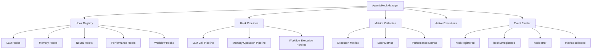

**Diagram sources**
- [hook-manager.ts](file://src/services/agentic-flow-hooks/hook-manager.ts#L30-L45)
- [types.ts](file://src/services/agentic-flow-hooks/types.ts#L303-L350)

**Section sources**
- [hook-manager.ts](file://src/services/agentic-flow-hooks/hook-manager.ts#L1-L100)
- [types.ts](file://src/services/agentic-flow-hooks/types.ts#L1-L100)

## Hook Execution Lifecycle

The hook execution lifecycle in Claude-Flow follows a well-defined sequence of operations that ensures consistent behavior across different hook types and execution scenarios. The lifecycle begins with the registration of hooks and culminates in their execution during specific events in the system.

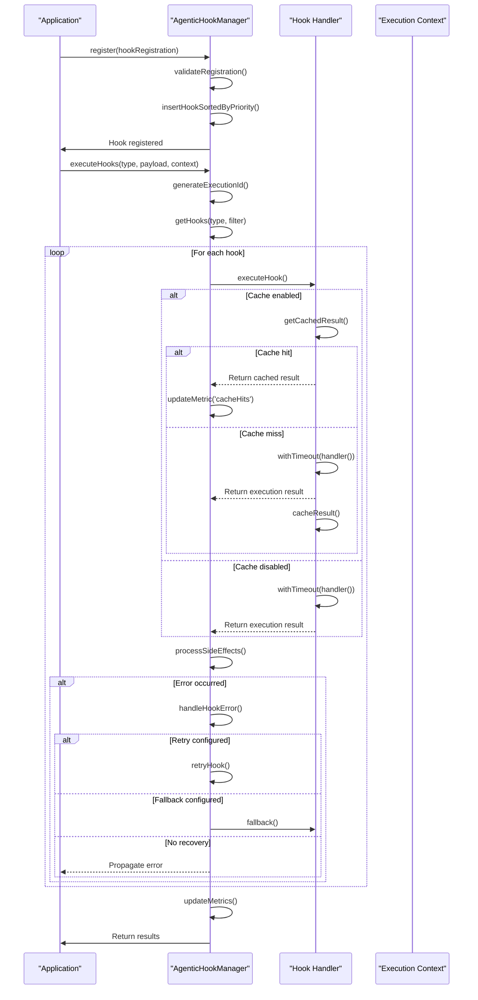

The execution lifecycle begins when the `executeHooks` method is called with a specific hook type, payload, and execution context. The manager first generates a unique execution ID and adds it to the set of active executions. It then retrieves the applicable hooks for the specified type, applying any filters based on the payload content.

Hooks are executed in order of priority (higher priority first), with each hook's execution wrapped in timeout protection to prevent hanging operations. Before executing the handler, the system checks for cached results if caching is enabled for the hook. After execution, side effects are processed, and the payload is updated if the hook modified it.

The lifecycle concludes with the updating of execution metrics and the removal of the execution ID from the active executions set, regardless of whether the execution was successful or resulted in an error.

**Diagram sources**
- [hook-manager.ts](file://src/services/agentic-flow-hooks/hook-manager.ts#L141-L200)
- [hook-manager.ts](file://src/services/agentic-flow-hooks/hook-manager.ts#L400-L500)

**Section sources**
- [hook-manager.ts](file://src/services/agentic-flow-hooks/hook-manager.ts#L141-L700)

## Hook Registration and Management

The hook registration and management system in Claude-Flow provides a robust interface for registering, unregistering, and retrieving hooks. The `AgenticHookManager` class implements the `HookRegistry` interface, which defines the core operations for managing hooks.

```mermaid
classDiagram
class AgenticHookManager {
+hooks : Map<AgenticHookType, HookRegistration[]>
+pipelines : Map<string, HookPipeline>
+metrics : Map<string, any>
+activeExecutions : Set<string>
+register(registration : HookRegistration) : void
+unregister(id : string) : void
+getHooks(type : AgenticHookType, filter? : HookFilter) : HookRegistration[]
+executeHooks(type : AgenticHookType, payload : HookPayload, context : AgenticHookContext) : Promise<HookHandlerResult[]>
+createPipeline(config : Partial<HookPipeline>) : HookPipeline
+getMetrics() : Record<string, any>
}
class HookRegistration {
+id : string
+type : AgenticHookType
+handler : HookHandler
+priority : number
+filter? : HookFilter
+options? : HookOptions
}
class HookFilter {
+providers? : string[]
+models? : string[]
+operations? : string[]
+namespaces? : string[]
+patterns? : RegExp[]
+conditions? : Array<{field : string, operator : string, value : any}>
}
class HookOptions {
+async? : boolean
+timeout? : number
+retries? : number
+fallback? : HookHandler
+errorHandler? : (error : Error) => void
+cache? : {enabled : boolean, ttl : number, key : (payload : HookPayload) => string}
}
AgenticHookManager --> HookRegistration : "manages"
AgenticHookManager --> HookFilter : "uses for filtering"
AgenticHookManager --> HookOptions : "configures behavior"
HookRegistration --> HookHandler : "contains"
HookRegistration --> HookFilter : "optional filtering"
HookRegistration --> HookOptions : "optional configuration"
```

**Diagram sources**
- [hook-manager.ts](file://src/services/agentic-flow-hooks/hook-manager.ts#L30-L100)
- [types.ts](file://src/services/agentic-flow-hooks/types.ts#L303-L350)

**Section sources**
- [hook-manager.ts](file://src/services/agentic-flow-hooks/hook-manager.ts#L100-L200)
- [types.ts](file://src/services/agentic-flow-hooks/types.ts#L303-L350)

The registration process begins with validation of the hook registration object, ensuring it has a valid ID, type, handler function, and non-negative priority. The manager then checks for duplicate IDs within the same hook type to prevent conflicts.

Hooks are stored in a Map where the key is the hook type and the value is an array of hook registrations. When a new hook is registered, it is inserted into the appropriate array in priority order (higher priority first). This ensures that hooks are executed in the correct order when triggered.

The manager also provides methods for unregistering hooks by ID and retrieving hooks by type with optional filtering. The filtering capability allows for conditional execution of hooks based on criteria such as providers, models, operations, namespaces, patterns, and custom conditions.

## Hook Types and Domain Model

The Hook System in Claude-Flow supports multiple hook types, each designed for specific aspects of the agentic flow. The domain model is defined in the `types.ts` file and includes comprehensive type definitions for all hook types, payloads, and related entities.

```mermaid
classDiagram
class AgenticHookType {
<<enumeration>>
LLMHookType
MemoryHookType
NeuralHookType
PerformanceHookType
WorkflowHookType
}
class LLMHookType {
<<enumeration>>
pre-llm-call
post-llm-call
llm-error
llm-retry
llm-fallback
llm-cache-hit
llm-cache-miss
}
class MemoryHookType {
<<enumeration>>
pre-memory-store
post-memory-store
pre-memory-retrieve
post-memory-retrieve
memory-sync
memory-persist
memory-expire
}
class NeuralHookType {
<<enumeration>>
pre-neural-train
post-neural-train
neural-pattern-detected
neural-prediction
neural-adaptation
}
class PerformanceHookType {
<<enumeration>>
performance-metric
performance-bottleneck
performance-optimization
performance-threshold
}
class WorkflowHookType {
<<enumeration>>
workflow-start
workflow-step
workflow-decision
workflow-complete
workflow-error
}
AgenticHookType <|-- LLMHookType
AgenticHookType <|-- MemoryHookType
AgenticHookType <|-- NeuralHookType
AgenticHookType <|-- PerformanceHookType
AgenticHookType <|-- WorkflowHookType
class HookPayload {
<<union>>
LLMHookPayload
MemoryHookPayload
NeuralHookPayload
PerformanceHookPayload
WorkflowHookPayload
}
class LLMHookPayload {
+provider : string
+model : string
+operation : 'completion' | 'embedding' | 'function-call' | 'vision'
+request : LLMRequest
+response? : LLMResponse
+error? : Error
+metrics? : LLMMetrics
}
class MemoryHookPayload {
+operation : 'store' | 'retrieve' | 'sync' | 'persist' | 'expire'
+namespace : string
+key? : string
+value? : any
+ttl? : number
+provider : string
+crossProvider? : boolean
+syncTargets? : string[]
}
class NeuralHookPayload {
+operation : 'train' | 'predict' | 'adapt' | 'analyze'
+modelId : string
+patterns? : Pattern[]
+trainingData? : TrainingData
+prediction? : Prediction
+accuracy? : number
+adaptations? : Adaptation[]
}
class PerformanceHookPayload {
+metric : string
+value : number
+unit : string
+threshold? : number
+bottleneck? : BottleneckInfo
+optimization? : OptimizationInfo
+context : Record<string, any>
}
class WorkflowHookPayload {
+workflowId : string
+step? : string
+decision? : WorkflowDecision
+state : Record<string, any>
+metrics? : WorkflowMetrics
+error? : Error
}
HookPayload <|-- LLMHookPayload
HookPayload <|-- MemoryHookPayload
HookPayload <|-- NeuralHookPayload
HookPayload <|-- PerformanceHookPayload
HookPayload <|-- WorkflowHookPayload
```

**Diagram sources**
- [types.ts](file://src/services/agentic-flow-hooks/types.ts#L50-L200)
- [types.ts](file://src/services/agentic-flow-hooks/types.ts#L200-L400)

**Section sources**
- [types.ts](file://src/services/agentic-flow-hooks/types.ts#L50-L503)

The domain model defines several hook types, each with specific use cases:

- **LLM Hook Types**: Handle operations related to LLM calls, including pre-call optimization, post-call analysis, error handling, and caching.
- **Memory Hook Types**: Manage memory operations such as storing, retrieving, syncing, and persisting data across different providers.
- **Neural Hook Types**: Support neural processing tasks including training, prediction, pattern detection, and adaptation.
- **Performance Hook Types**: Monitor system performance, detect bottlenecks, suggest optimizations, and track metrics.
- **Workflow Hook Types**: Control workflow execution, including start, step, decision, completion, and error events.

Each hook type has a corresponding payload interface that defines the data structure passed to the hook handler. The payload contains relevant information for the specific hook type, such as LLM request/response data, memory operation details, or workflow state.

## Execution Context and Safety

The execution context in the Hook System provides a rich environment for hook handlers to operate within, containing session information, memory access, neural processing capabilities, and performance monitoring. The context is designed to ensure safety and consistency across hook executions.

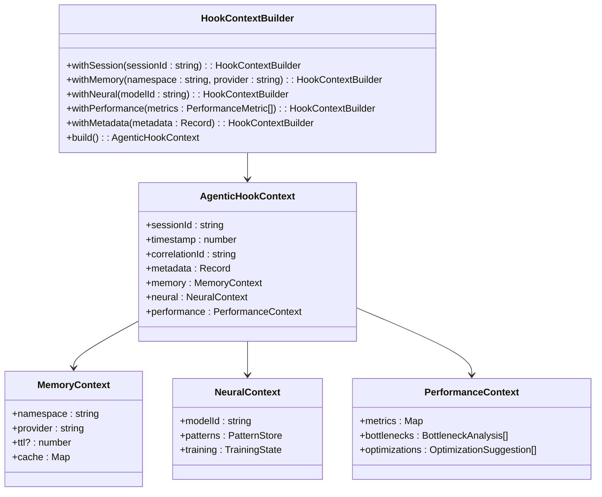

**Diagram sources**
- [types.ts](file://src/services/agentic-flow-hooks/types.ts#L10-L50)
- [types.ts](file://src/services/agentic-flow-hooks/types.ts#L400-L502)
- [index.ts](file://src/services/agentic-flow-hooks/index.ts#L303-L385)

**Section sources**
- [types.ts](file://src/services/agentic-flow-hooks/types.ts#L10-L50)
- [types.ts](file://src/services/agentic-flow-hooks/types.ts#L400-L502)
- [index.ts](file://src/services/agentic-flow-hooks/index.ts#L303-L385)

The `AgenticHookContext` interface defines the execution context that is passed to all hook handlers. It contains:

- **Session Information**: Session ID, timestamp, and correlation ID for tracing requests across the system.
- **Metadata**: A flexible key-value store for additional context-specific data.
- **Memory Access**: Access to a memory context with namespace, provider, TTL, and cache capabilities.
- **Neural Processing**: Access to neural context with pattern store, training state, and model information.
- **Performance Monitoring**: Access to performance metrics, bottleneck analysis, and optimization suggestions.

To ensure safety and consistency, the system provides a `HookContextBuilder` class that allows for the creation of properly structured contexts. The builder enforces required fields and provides sensible defaults for optional ones. This prevents issues that could arise from incomplete or malformed contexts.

The context also includes safety mechanisms such as timeout protection, error handling, and active execution tracking. The `activeExecutions` set in the `AgenticHookManager` tracks all currently executing hooks, allowing for proper cleanup and preventing resource leaks.

## Hook Pipelines and Stages

The Hook System supports the concept of pipelines, which allow for the orchestration of multiple hooks in a specific sequence or parallel execution. Pipelines provide a higher-level abstraction for complex workflows that involve multiple hook types and execution stages.

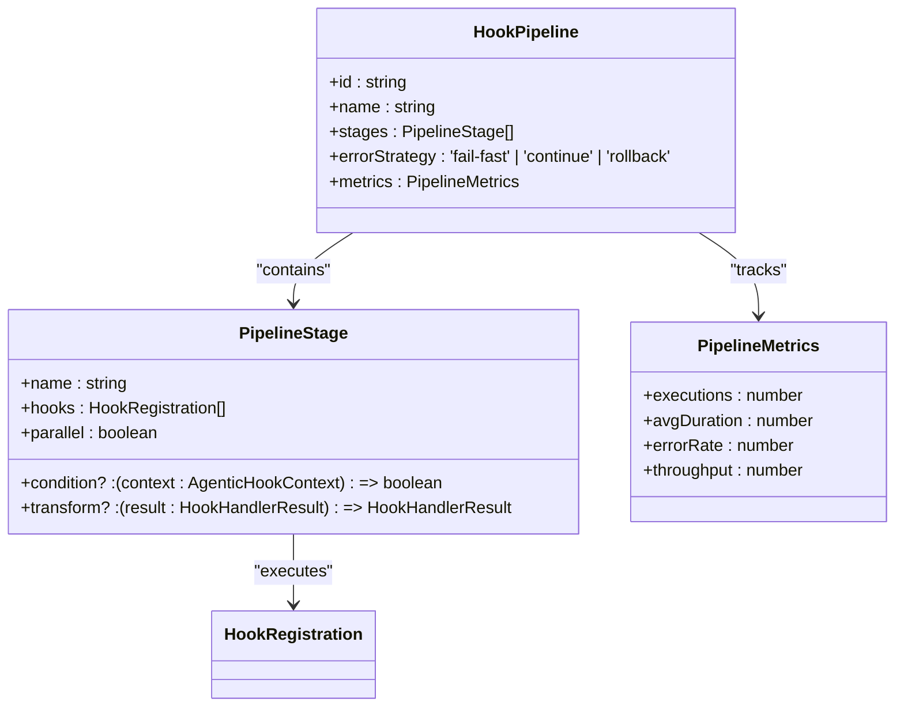

**Diagram sources**
- [types.ts](file://src/services/agentic-flow-hooks/types.ts#L350-L400)

**Section sources**
- [types.ts](file://src/services/agentic-flow-hooks/types.ts#L350-L400)
- [hook-manager.ts](file://src/services/agentic-flow-hooks/hook-manager.ts#L200-L250)

Pipelines are created using the `createPipeline` method of the `AgenticHookManager`, which accepts a configuration object with the pipeline ID, name, stages, and error strategy. Each pipeline consists of one or more stages, which can be executed sequentially or in parallel.

A pipeline stage contains:
- **Name**: A descriptive name for the stage.
- **Hooks**: An array of hook registrations to execute in the stage.
- **Parallel**: A boolean indicating whether hooks should be executed in parallel (true) or sequentially (false).
- **Condition**: An optional function that determines whether the stage should be executed based on the context.
- **Transform**: An optional function that transforms the results of the stage before they are passed to the next stage.

The system includes three default pipelines:
- **LLM Call Pipeline**: Handles the complete LLM call process with pre-call, call execution, and post-call stages.
- **Memory Operation Pipeline**: Manages memory operations with validation, storage, and synchronization stages.
- **Workflow Execution Pipeline**: Controls workflow execution with initialization, execution, and completion stages.

Pipelines support three error strategies:
- **fail-fast**: Stop execution immediately when an error occurs.
- **continue**: Continue execution despite errors, collecting all results.
- **rollback**: Attempt to roll back changes when an error occurs.

## Error Handling and Resilience

The Hook System implements comprehensive error handling and resilience mechanisms to ensure reliable operation even in the face of failures. These mechanisms are designed to prevent cascading failures and provide graceful degradation when issues occur.

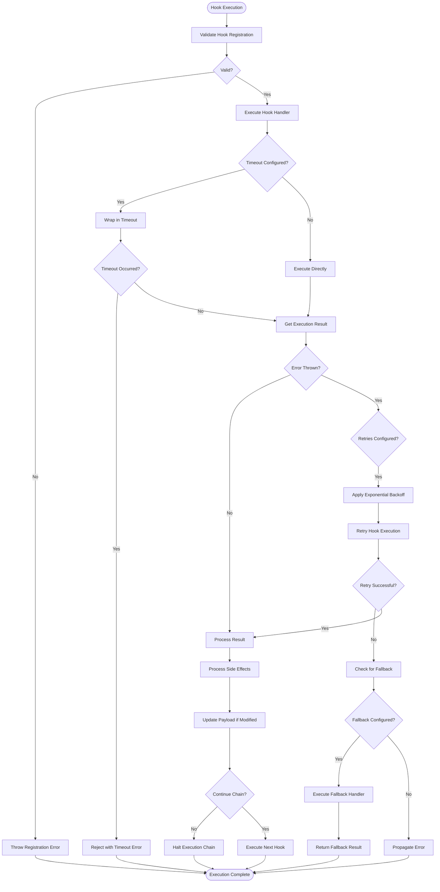

**Diagram sources**
- [hook-manager.ts](file://src/services/agentic-flow-hooks/hook-manager.ts#L400-L500)
- [hook-manager.ts](file://src/services/agentic-flow-hooks/hook-manager.ts#L500-L600)

**Section sources**
- [hook-manager.ts](file://src/services/agentic-flow-hooks/hook-manager.ts#L400-L700)

The error handling system includes several key features:

- **Timeout Protection**: All hook executions are wrapped in a timeout mechanism that prevents hanging operations. The timeout duration is configurable per hook.
- **Retry Mechanism**: Hooks can be configured to automatically retry on failure with exponential backoff, reducing the impact of transient errors.
- **Fallback Handlers**: When a hook fails and retries are exhausted, a fallback handler can be executed to provide alternative functionality.
- **Error Propagation Control**: Hooks can choose whether to continue the execution chain after an error by setting the `continue` flag in the result.
- **Side Effect Isolation**: Side effects are processed independently, so a failure in one side effect doesn't prevent others from executing.

The system also includes metrics tracking for errors, allowing for monitoring of error rates and identification of problematic hooks. Error events are emitted through the event emitter, enabling external systems to respond to hook failures.

## Performance Considerations

The Hook System is designed with performance in mind, incorporating several mechanisms to minimize overhead and ensure efficient execution. These considerations are critical for maintaining system responsiveness, especially when multiple hooks are registered for the same event.

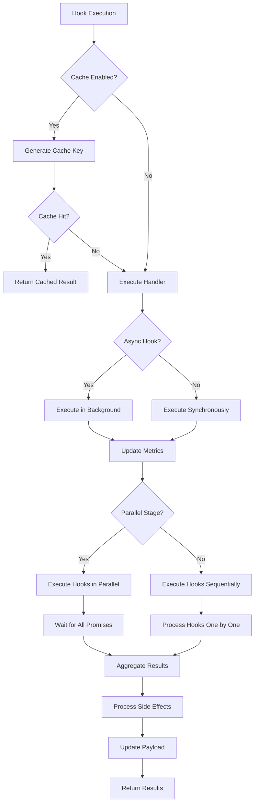

**Diagram sources**
- [hook-manager.ts](file://src/services/agentic-flow-hooks/hook-manager.ts#L400-L500)
- [types.ts](file://src/services/agentic-flow-hooks/types.ts#L350-L400)

**Section sources**
- [hook-manager.ts](file://src/services/agentic-flow-hooks/hook-manager.ts#L400-L700)
- [types.ts](file://src/services/agentic-flow-hooks/types.ts#L350-L400)

Key performance considerations include:

- **Caching**: Hooks can be configured to cache their results, avoiding redundant computation for identical inputs. The cache key is generated based on the payload, and the TTL is configurable.
- **Asynchronous Execution**: Hooks can be marked as asynchronous, allowing them to execute in the background without blocking the main execution thread.
- **Parallel Execution**: Pipeline stages can be configured to execute hooks in parallel, improving throughput for independent operations.
- **Lazy Loading**: Hooks are only loaded and initialized when needed, reducing startup time and memory usage.
- **Metrics Collection**: The system collects performance metrics for all hook executions, including duration, error rates, and throughput, enabling optimization based on real-world usage.

The system also includes mechanisms to prevent performance degradation:
- **Timeout Protection**: Prevents hooks from running indefinitely and consuming system resources.
- **Active Execution Tracking**: Monitors the number of active executions to prevent resource exhaustion.
- **Memory Management**: Uses efficient data structures and avoids memory leaks through proper cleanup.

## Hook Implementation Examples

The Hook System provides several concrete examples of hook implementations that demonstrate its capabilities for automation, monitoring, and validation. These examples illustrate how to create hooks for different use cases and integrate them with the system.

### LLM Call Hooks

The LLM call hooks demonstrate how to implement pre and post processing for LLM operations:

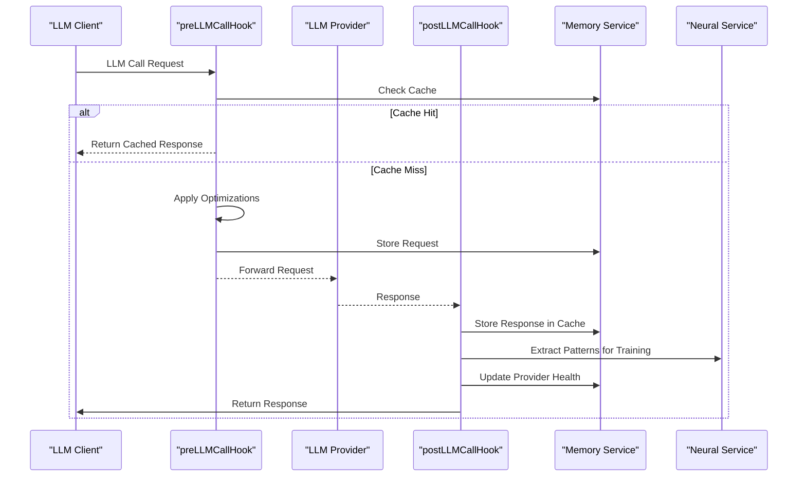

**Diagram sources**
- [llm-hooks.ts](file://src/services/agentic-flow-hooks/llm-hooks.ts#L50-L200)
- [llm-hooks.ts](file://src/services/agentic-flow-hooks/llm-hooks.ts#L200-L400)

**Section sources**
- [llm-hooks.ts](file://src/services/agentic-flow-hooks/llm-hooks.ts#L50-L557)

The `preLLMCallHook` checks for cached responses and applies request optimizations before forwarding the request to the LLM provider. The `postLLMCallHook` stores the response in the cache, extracts patterns for neural training, and updates performance metrics.

### Memory Operation Hooks

Memory operation hooks demonstrate how to manage data persistence and synchronization:

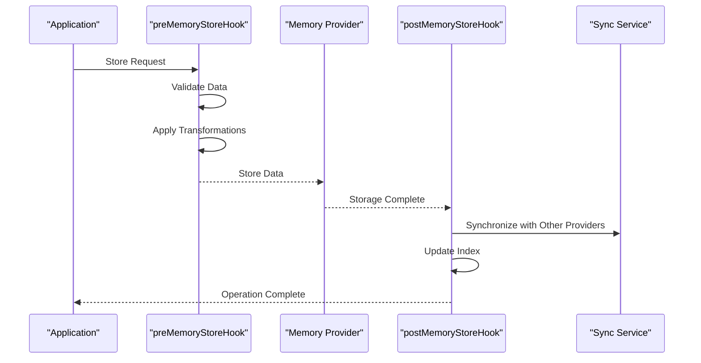

**Diagram sources**
- [memory-hooks.ts](file://src/services/agentic-flow-hooks/memory-hooks.ts#L50-L200)

**Section sources**
- [memory-hooks.ts](file://src/services/agentic-flow-hooks/memory-hooks.ts#L50-L500)

These hooks validate and transform data before storage, and handle synchronization and indexing after storage.

### Workflow Execution Hooks

Workflow execution hooks control the flow of multi-step processes:

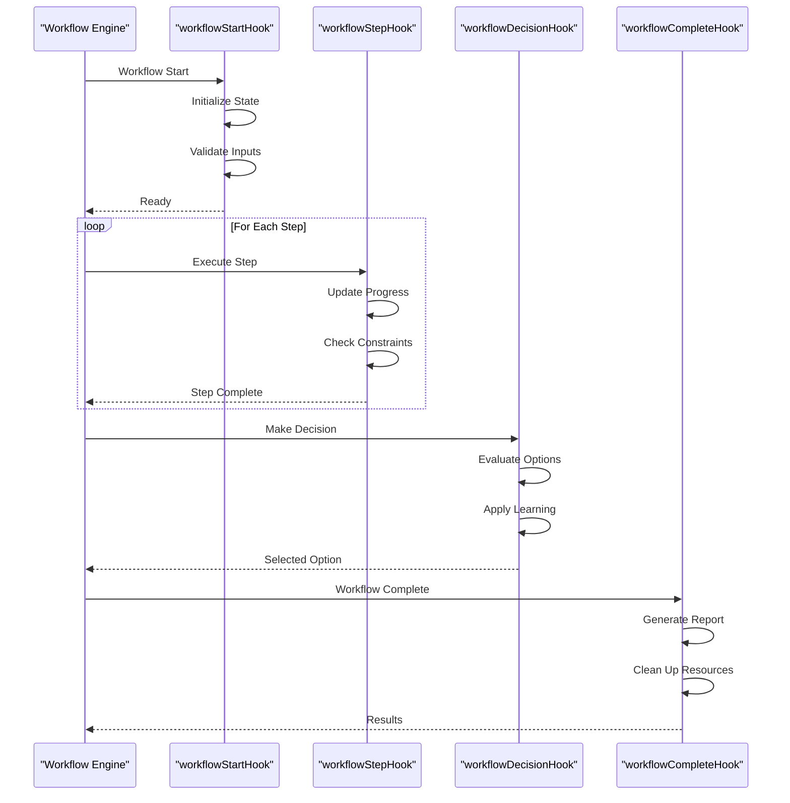

**Diagram sources**
- [workflow-hooks.ts](file://src/services/agentic-flow-hooks/workflow-hooks.ts#L50-L200)

**Section sources**
- [workflow-hooks.ts](file://src/services/agentic-flow-hooks/workflow-hooks.ts#L50-L500)

These hooks manage the complete workflow lifecycle, from initialization to completion, including step execution and decision making.

## Integration with CLI Command Execution

The Hook System is tightly integrated with the core CLI command execution in Claude-Flow, providing automation capabilities for various command lifecycle events. This integration enables pre and post processing for commands, as well as session-level hooks.

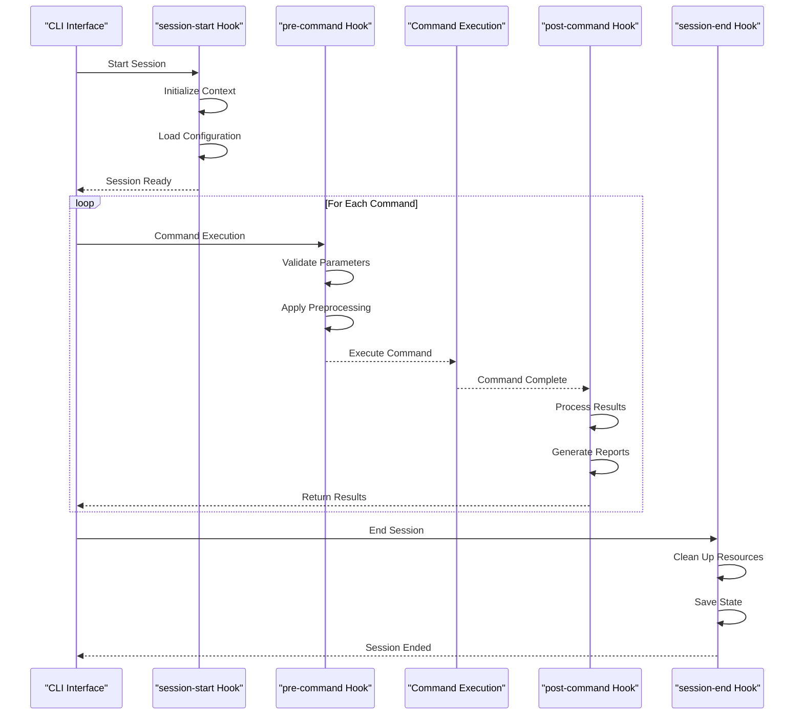

**Diagram sources**
- [hook-manager.ts](file://src/services/agentic-flow-hooks/hook-manager.ts#L141-L200)
- [types.ts](file://src/services/agentic-flow-hooks/types.ts#L50-L200)

**Section sources**
- [hook-manager.ts](file://src/services/agentic-flow-hooks/hook-manager.ts#L141-L700)
- [types.ts](file://src/services/agentic-flow-hooks/types.ts#L50-L503)

The integration points include:
- **session-start**: Executed when a CLI session begins, used for initialization and configuration loading.
- **pre-command**: Executed before each command, used for parameter validation and preprocessing.
- **post-command**: Executed after each command, used for result processing and reporting.
- **session-end**: Executed when a CLI session ends, used for cleanup and state saving.

This integration allows for comprehensive automation of CLI workflows, enabling features such as:
- Automatic validation of command parameters
- Preprocessing of input data
- Post-processing of command results
- Generation of execution reports
- Resource cleanup and state management

## Troubleshooting Common Issues

The Hook System may encounter various issues during operation. Understanding these common problems and their solutions is essential for maintaining system reliability.

### Hook Execution Order Conflicts

When multiple hooks are registered for the same event, their execution order is determined by priority. Conflicts can occur when hooks have the same priority or when the expected order is not achieved.

**Solution**: Explicitly set priorities for hooks to ensure the desired execution order. Higher priority values execute first. For example:

```typescript
const hook1 = {
  id: 'validation-hook',
  type: 'pre-command',
  priority: 100, // High priority - executes first
  handler: validateInput
};

const hook2 = {
  id: 'transformation-hook',
  type: 'pre-command',
  priority: 50, // Lower priority - executes after validation
  handler: transformInput
};
```

**Section sources**
- [hook-manager.ts](file://src/services/agentic-flow-hooks/hook-manager.ts#L60-L80)

### Error Propagation

By default, unhandled errors in hooks will propagate and terminate the execution chain. This can cause unexpected interruptions in workflows.

**Solution**: Implement proper error handling in hooks using the available mechanisms:

```typescript
const safeHook = {
  id: 'resilient-hook',
  type: 'pre-command',
  options: {
    retries: 3,
    fallback: (payload, context) => {
      // Return safe default values
      return { continue: true, modified: false };
    },
    errorHandler: (error) => {
      // Log error but don't propagate
      console.error('Hook error:', error);
    }
  },
  handler: async (payload, context) => {
    // Risky operation that might fail
    return { continue: true };
  }
};
```

**Section sources**
- [hook-manager.ts](file://src/services/agentic-flow-hooks/hook-manager.ts#L400-L500)

### Performance Overhead

Chains of multiple hooks can introduce significant performance overhead, especially if hooks perform expensive operations.

**Solution**: Optimize hook performance using these strategies:

1. Use caching for expensive operations:
```typescript
const cachedHook = {
  id: 'expensive-operation',
  type: 'pre-command',
  options: {
    cache: {
      enabled: true,
      ttl: 300, // 5 minutes
      key: (payload) => `expensive-${payload.input}`
    }
  },
  handler: expensiveOperation
};
```

2. Execute non-critical hooks asynchronously:
```typescript
const asyncHook = {
  id: 'analytics-hook',
  type: 'post-command',
  options: { async: true },
  handler: sendAnalytics
};
```

3. Use parallel execution in pipelines:
```typescript
const pipeline = agenticHookManager.createPipeline({
  stages: [{
    name: 'analytics',
    hooks: [hook1, hook2, hook3],
    parallel: true // Execute hooks in parallel
  }]
});
```

**Section sources**
- [hook-manager.ts](file://src/services/agentic-flow-hooks/hook-manager.ts#L400-L700)
- [types.ts](file://src/services/agentic-flow-hooks/types.ts#L350-L400)

## Best Practices

Following best practices when implementing and using the Hook System ensures reliable, maintainable, and performant code.

### Writing Efficient Hooks

1. **Keep hooks focused**: Each hook should have a single responsibility and perform one specific task.

2. **Use appropriate priorities**: Set priorities carefully to ensure hooks execute in the correct order.

3. **Implement proper error handling**: Use the built-in error handling mechanisms to prevent cascading failures.

4. **Consider performance implications**: Avoid expensive operations in synchronous hooks; use caching and asynchronous execution when appropriate.

5. **Use descriptive IDs**: Choose clear, meaningful IDs for hooks to aid debugging and maintenance.

### Hook Registration

1. **Register hooks early**: Register hooks during system initialization to ensure they are available when needed.

2. **Use consistent naming**: Follow a consistent naming convention for hook IDs.

3. **Document hook behavior**: Include comments explaining what the hook does and why it's necessary.

4. **Test hooks thoroughly**: Write unit tests for hooks to ensure they behave as expected.

### System Integration

1. **Minimize side effects**: Limit side effects to what is necessary for the hook's purpose.

2. **Use the context appropriately**: Leverage the execution context for shared data rather than global state.

3. **Monitor hook performance**: Regularly review hook metrics to identify performance bottlenecks.

4. **Plan for scalability**: Design hooks to handle increasing loads without degrading system performance.

By following these best practices, developers can create robust, efficient, and maintainable hook implementations that enhance the functionality of Claude-Flow without compromising its stability or performance.

**Section sources**
- [hook-manager.ts](file://src/services/agentic-flow-hooks/hook-manager.ts#L1-L700)
- [types.ts](file://src/services/agentic-flow-hooks/types.ts#L1-L503)
- [index.ts](file://src/services/agentic-flow-hooks/index.ts#L1-L385)
- [llm-hooks.ts](file://src/services/agentic-flow-hooks/llm-hooks.ts#L1-L557)
- [memory-hooks.ts](file://src/services/agentic-flow-hooks/memory-hooks.ts#L1-L500)
- [neural-hooks.ts](file://src/services/agentic-flow-hooks/neural-hooks.ts#L1-L500)
- [performance-hooks.ts](file://src/services/agentic-flow-hooks/performance-hooks.ts#L1-L500)
- [workflow-hooks.ts](file://src/services/agentic-flow-hooks/workflow-hooks.ts#L1-L500)