# Performance Monitoring

<cite>
**Referenced Files in This Document**   
- [scripts/performance-monitor.js](file://scripts/performance-monitor.js)
- [src/mcp/implementations/workflow-tools.js](file://src/mcp/implementations/workflow-tools.js)
- [src/swarm/optimizations/performance_monitor.py](file://src/swarm/optimizations/performance_monitor.py)
- [benchmark/tools/continuous_performance_monitor.py](file://benchmark/tools/continuous_performance_monitor.py)
- [src/cli/simple-commands/init/performance-monitor.js](file://src/cli/simple-commands/init/performance-monitor.js)
- [benchmark/src/swarm_benchmark/core/integration_utils.py](file://benchmark/src/swarm_benchmark/core/integration_utils.py)
- [src/cli/simple-commands/hive-mind.js](file://src/cli/simple-commands/hive-mind.js)
</cite>

## Table of Contents
1. [Introduction](#introduction)
2. [Performance Monitoring Architecture](#performance-monitoring-architecture)
3. [Core Components](#core-components)
4. [Metrics Collection Implementation](#metrics-collection-implementation)
5. [Analysis and Reporting](#analysis-and-reporting)
6. [Optimization Recommendations](#optimization-recommendations)
7. [Hive-Mind Integration](#hive-mind-integration)
8. [Common Issues and Troubleshooting](#common-issues-and-troubleshooting)
9. [Performance Considerations](#performance-considerations)
10. [Best Practices](#best-practices)

## Introduction
The Performance Monitoring system in Claude-Flow provides comprehensive metrics collection, analysis, and optimization capabilities for the agentic workflow system. This documentation details the implementation of performance data collection, analysis, and reporting across multiple components of the system. The monitoring infrastructure spans JavaScript, TypeScript, and Python implementations, providing real-time insights into system resources, task execution times, and swarm efficiency metrics. The system is designed to support both interactive monitoring and automated performance optimization, with tight integration between monitoring components and the Hive-Mind orchestrator.

**Section sources**
- [scripts/performance-monitor.js](file://scripts/performance-monitor.js)
- [src/mcp/implementations/workflow-tools.js](file://src/mcp/implementations/workflow-tools.js)

## Performance Monitoring Architecture
The Performance Monitoring system in Claude-Flow consists of multiple specialized components that work together to collect, analyze, and act upon performance data. The architecture is distributed across different execution contexts and programming languages, reflecting the polyglot nature of the overall system.

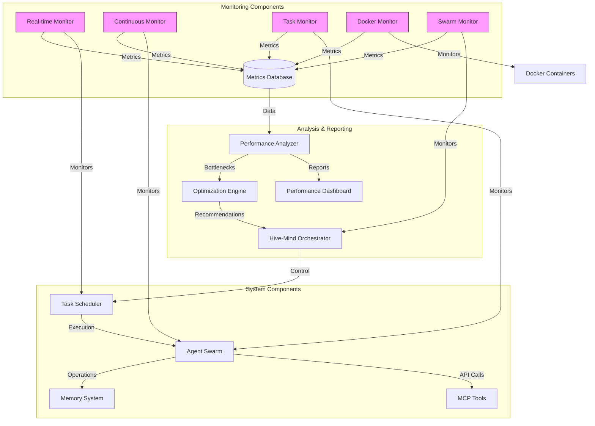

**Diagram sources**
- [scripts/performance-monitor.js](file://scripts/performance-monitor.js)
- [src/swarm/optimizations/performance_monitor.py](file://src/swarm/optimizations/performance_monitor.py)
- [benchmark/tools/continuous_performance_monitor.py](file://benchmark/tools/continuous_performance_monitor.py)

**Section sources**
- [scripts/performance-monitor.js](file://scripts/performance-monitor.js)
- [src/swarm/optimizations/performance_monitor.py](file://src/swarm/optimizations/performance_monitor.py)

## Core Components

### Real-time Performance Monitor
The real-time performance monitor provides an interactive terminal interface for monitoring Claude-Flow operations. Implemented in JavaScript using the blessed library, this component displays key metrics in a curses-style interface.

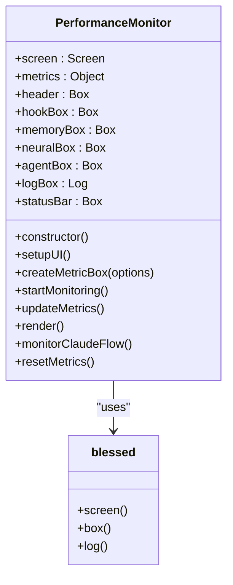

**Diagram sources**
- [scripts/performance-monitor.js](file://scripts/performance-monitor.js#L9-L237)

**Section sources**
- [scripts/performance-monitor.js](file://scripts/performance-monitor.js#L9-L237)

### Continuous Performance Monitor
The continuous performance monitor is a Python-based system that collects metrics at regular intervals and stores them in a database for historical analysis. This component is designed for long-term monitoring and regression detection.

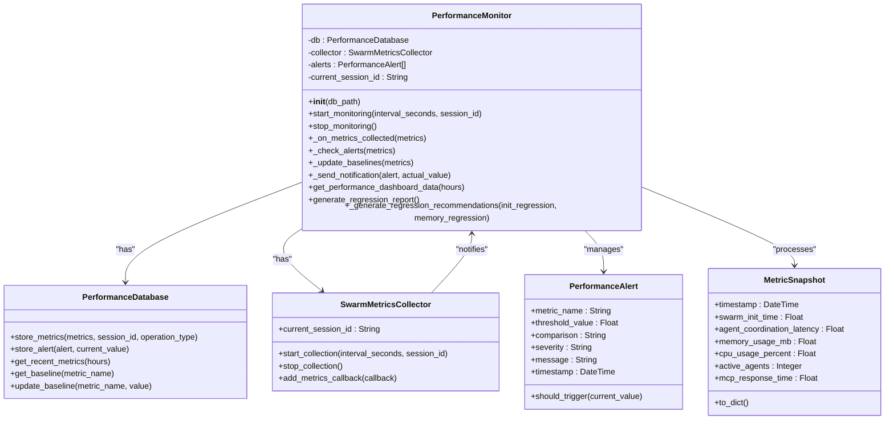

**Diagram sources**
- [benchmark/tools/continuous_performance_monitor.py](file://benchmark/tools/continuous_performance_monitor.py#L389-L600)

**Section sources**
- [benchmark/tools/continuous_performance_monitor.py](file://benchmark/tools/continuous_performance_monitor.py#L389-L600)

### Task-level Performance Monitor
The task-level performance monitor is a lightweight JavaScript class designed to monitor individual command execution. This component is used to track memory usage, operation counts, and errors during specific tasks.

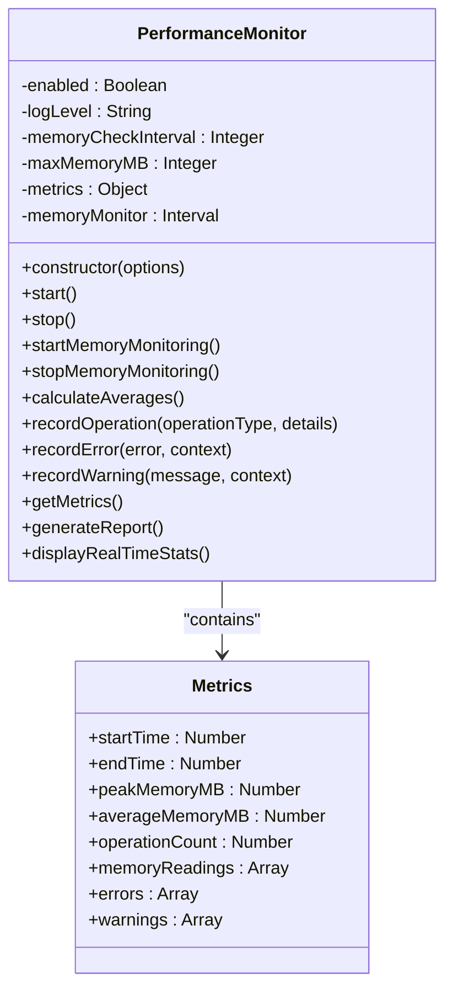

**Diagram sources**
- [src/cli/simple-commands/init/performance-monitor.js](file://src/cli/simple-commands/init/performance-monitor.js#L3-L189)

**Section sources**
- [src/cli/simple-commands/init/performance-monitor.js](file://src/cli/simple-commands/init/performance-monitor.js#L3-L189)

## Metrics Collection Implementation

### System and Resource Metrics
The system collects a comprehensive set of metrics covering CPU usage, memory consumption, disk I/O, and network activity. The Python implementation uses psutil to gather detailed system statistics.

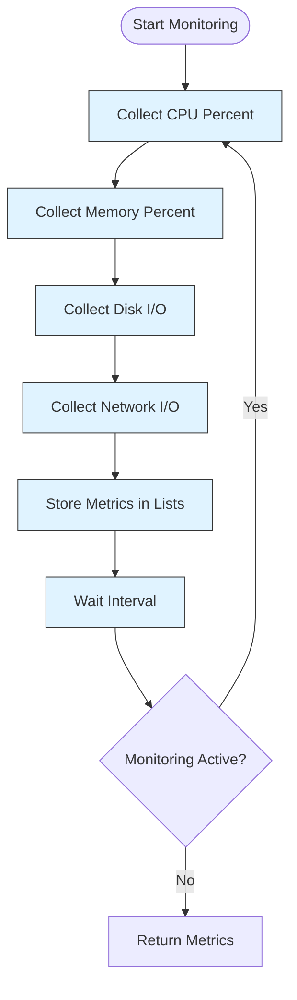

**Diagram sources**
- [benchmark/src/swarm_benchmark/core/integration_utils.py](file://benchmark/src/swarm_benchmark/core/integration_utils.py#L65-L131)

**Section sources**
- [benchmark/src/swarm_benchmark/core/integration_utils.py](file://benchmark/src/swarm_benchmark/core/integration_utils.py#L65-L131)

### Docker and Application Metrics
For containerized environments, the system collects Docker-specific metrics including container status, resource usage, and network configuration. It also monitors application endpoints and response times.

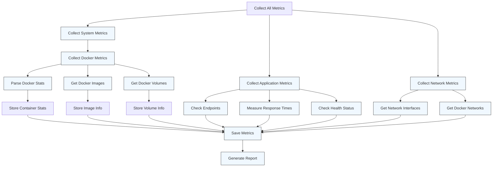

**Section sources**
- [archive/infrastructure/docker/testing/scripts/performance-monitor.js](file://archive/infrastructure/docker/testing/scripts/performance-monitor.js)

## Analysis and Reporting

### Performance Reporting Tool
The performance reporting tool provides a command-line interface for generating performance reports with configurable timeframes and formats.

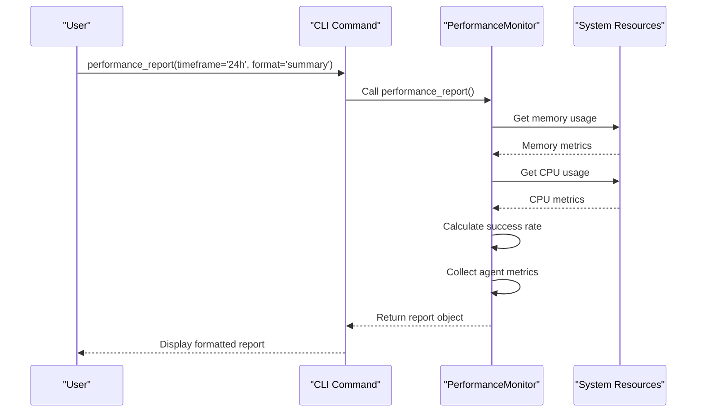

**Diagram sources**
- [src/mcp/implementations/workflow-tools.js](file://src/mcp/implementations/workflow-tools.js#L247-L363)

**Section sources**
- [src/mcp/implementations/workflow-tools.js](file://src/mcp/implementations/workflow-tools.js#L247-L363)

### Bottleneck Analysis
The bottleneck analysis tool identifies performance constraints in the system and provides recommendations for improvement.

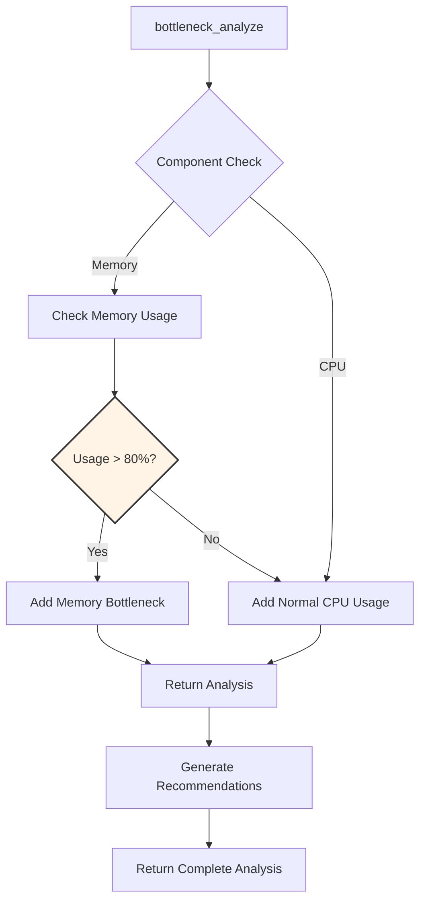

**Section sources**
- [src/mcp/implementations/workflow-tools.js](file://src/mcp/implementations/workflow-tools.js#L247-L363)

## Optimization Recommendations

### Optimization Engine
The Optimization Engine analyzes performance metrics and bottlenecks to generate actionable optimization recommendations across multiple categories.

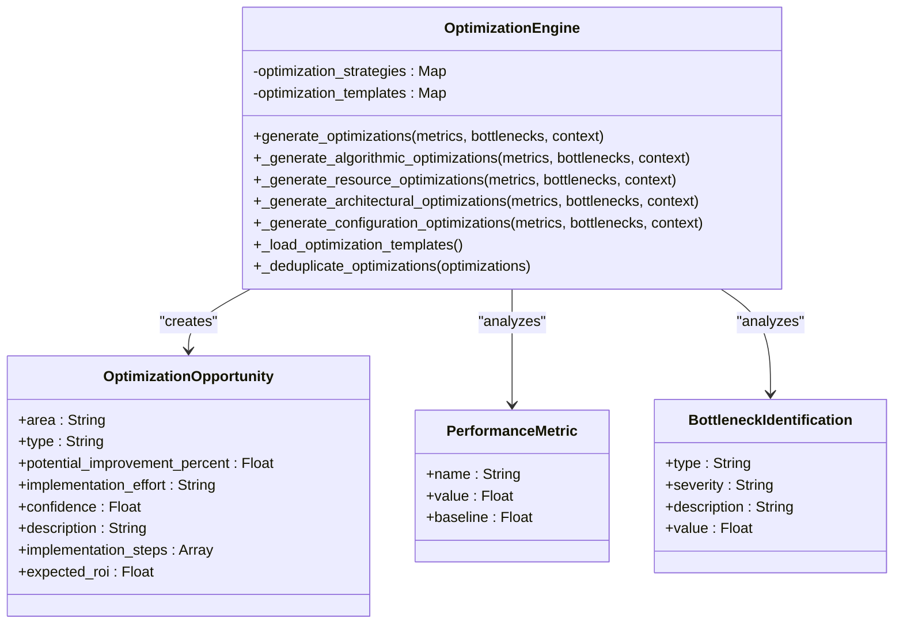

**Diagram sources**
- [benchmark/src/swarm_benchmark/advanced_metrics/performance_analyzer.py](file://benchmark/src/swarm_benchmark/advanced_metrics/performance_analyzer.py#L325-L606)

**Section sources**
- [benchmark/src/swarm_benchmark/advanced_metrics/performance_analyzer.py](file://benchmark/src/swarm_benchmark/advanced_metrics/performance_analyzer.py#L325-L606)

### Optimization Strategy Categories
The Optimization Engine categorizes recommendations into four main types, each addressing different aspects of system performance.

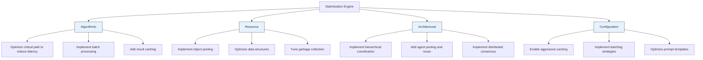

**Section sources**
- [benchmark/src/swarm_benchmark/advanced_metrics/performance_analyzer.py](file://benchmark/src/swarm_benchmark/advanced_metrics/performance_analyzer.py#L325-L606)

## Hive-Mind Integration
The Performance Monitoring system is tightly integrated with the Hive-Mind orchestrator, providing real-time metrics and optimization recommendations for swarm operations.

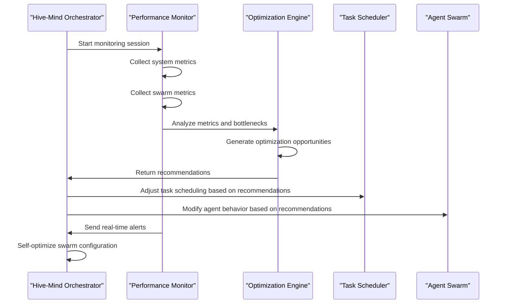

**Diagram sources**
- [src/cli/simple-commands/hive-mind.js](file://src/cli/simple-commands/hive-mind.js)
- [benchmark/tools/continuous_performance_monitor.py](file://benchmark/tools/continuous_performance_monitor.py)

**Section sources**
- [src/cli/simple-commands/hive-mind.js](file://src/cli/simple-commands/hive-mind.js)
- [benchmark/tools/continuous_performance_monitor.py](file://benchmark/tools/continuous_performance_monitor.py)

## Common Issues and Troubleshooting

### Metric Collection Failures
When metric collection fails, the system provides diagnostic information to help identify the root cause.

**Common Issues:**
- **Permission Denied**: Docker metrics collection requires appropriate permissions
- **Resource Unavailable**: System metrics may not be available in certain environments
- **Network Connectivity**: Application endpoint checks fail if services are unreachable
- **Database Connection**: Metrics storage fails if the database is unavailable

**Troubleshooting Steps:**
1. Verify the monitoring process has necessary permissions
2. Check system resource availability
3. Validate network connectivity to monitored services
4. Ensure the metrics database is accessible and has sufficient storage
5. Review log files for specific error messages

**Section sources**
- [archive/infrastructure/docker/testing/scripts/performance-monitor.js](file://archive/infrastructure/docker/testing/scripts/performance-monitor.js)
- [benchmark/tools/continuous_performance_monitor.py](file://benchmark/tools/continuous_performance_monitor.py)

### False Performance Alerts
False alerts can occur due to misconfigured thresholds or temporary system spikes.

**Causes:**
- **Inappropriate Thresholds**: Alert thresholds set too low for normal operation
- **Transient Spikes**: Short-lived resource usage spikes that don't indicate real problems
- **Cold Start Effects**: Initial performance characteristics differ from steady-state

**Solutions:**
- Adjust alert thresholds based on historical baselines
- Implement hysteresis in alert conditions
- Use moving averages instead of instantaneous values
- Exclude warm-up periods from analysis

**Section sources**
- [benchmark/tools/continuous_performance_monitor.py](file://benchmark/tools/continuous_performance_monitor.py)

## Performance Considerations
The monitoring system itself consumes system resources, so careful consideration must be given to monitoring overhead.

**Monitoring Overhead:**
- **Sampling Frequency**: More frequent sampling provides better resolution but increases overhead
- **Data Storage**: Storing detailed metrics requires disk space and I/O capacity
- **Processing Cost**: Real-time analysis consumes CPU resources
- **Memory Usage**: Keeping metrics history in memory affects available resources

**Optimization Strategies:**
- Use adaptive sampling rates based on system load
- Implement metrics aggregation to reduce storage requirements
- Offload analysis to separate monitoring servers
- Use efficient data structures for metrics storage
- Implement data retention policies to manage storage growth

## Best Practices
To effectively use the Performance Monitoring system, follow these best practices:

**Configuration:**
- Set appropriate sampling intervals based on use case (1-10 seconds for production, 100-500ms for development)
- Configure meaningful alert thresholds based on historical baselines
- Enable auto-scaling of monitoring resources during peak loads

**Implementation:**
- Instrument critical code paths with custom metrics
- Use consistent metric naming conventions
- Include contextual information with metrics
- Implement proper error handling in monitoring code

**Analysis:**
- Regularly review performance trends and baselines
- Correlate metrics across different system components
- Use regression analysis to detect performance degradation
- Document optimization efforts and their impact

**Integration:**
- Integrate monitoring with existing alerting and notification systems
- Connect performance data with business metrics
- Use optimization recommendations to guide system improvements
- Continuously refine monitoring configuration based on operational experience