# Security Features

<cite>
**Referenced Files in This Document**   
- [security-manager.ts](file://src/enterprise/security-manager.ts)
- [security.ts](file://src/verification/security.ts)
</cite>

## Table of Contents
1. [Introduction](#introduction)
2. [Core Security Components](#core-security-components)
3. [Security Manager Architecture](#security-manager-architecture)
4. [Security Enforcement System](#security-enforcement-system)
5. [Authentication and Access Control](#authentication-and-access-control)
6. [Data Validation and Integrity Verification](#data-validation-and-integrity-verification)
7. [Threat Detection and Byzantine Fault Tolerance](#threat-detection-and-byzantine-fault-tolerance)
8. [Audit Trail and Compliance](#audit-trail-and-compliance)
9. [Security Scanning and Vulnerability Management](#security-scanning-and-vulnerability-management)
10. [Incident Management and Response](#incident-management-and-response)
11. [Performance Considerations](#performance-considerations)
12. [Troubleshooting Guide](#troubleshooting-guide)
13. [Conclusion](#conclusion)

## Introduction
The Claude-Flow security system implements a comprehensive, multi-layered approach to system protection and integrity. This document details the implementation of authentication, authorization, data validation, and rollback mechanisms that ensure the platform's security. The system features two primary components: the Security Manager for vulnerability scanning and compliance, and the Security Enforcement System for real-time verification and protection against Byzantine attacks. These components work together to provide enterprise-grade security for agent-based operations, ensuring that all truth claims are authenticated, cryptographically signed, and protected against malicious behavior.

## Core Security Components

The security architecture consists of two main components: the Security Manager for vulnerability scanning and compliance, and the Security Enforcement System for real-time verification and protection. The Security Manager handles scheduled and on-demand security scans, vulnerability detection, and compliance checks, while the Security Enforcement System provides real-time protection through cryptographic verification, rate limiting, and Byzantine fault tolerance.

**Section sources**
- [security-manager.ts](file://src/enterprise/security-manager.ts#L0-L1497)
- [security.ts](file://src/verification/security.ts#L0-L1425)

## Security Manager Architecture

The Security Manager provides a comprehensive security scanning framework that supports multiple scanner types and integrates with various security tools. It manages the complete lifecycle of security scans, from configuration to reporting, and provides detailed metrics and compliance information.

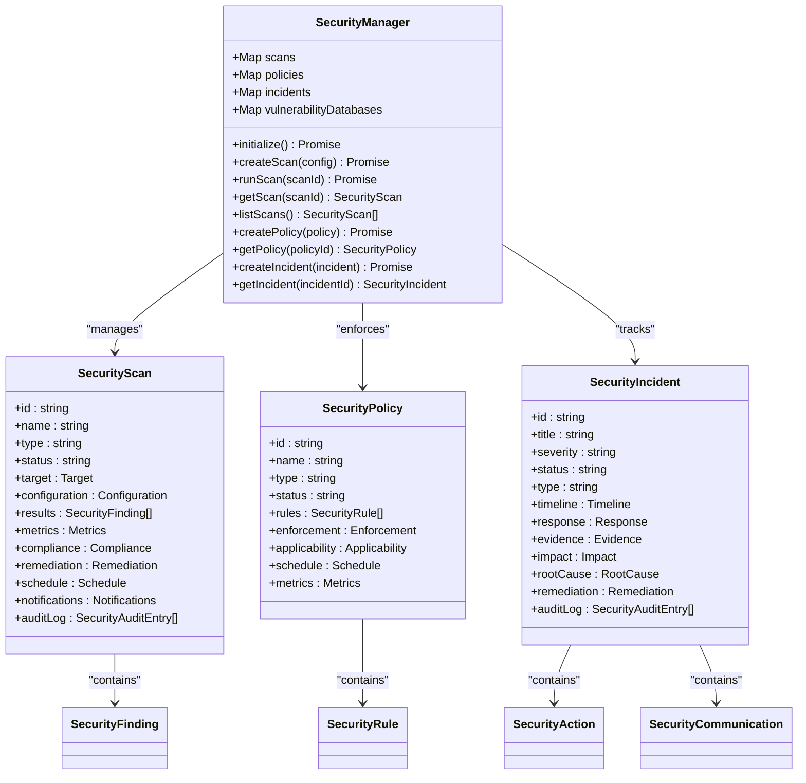

**Diagram sources**
- [security-manager.ts](file://src/enterprise/security-manager.ts#L0-L1497)

**Section sources**
- [security-manager.ts](file://src/enterprise/security-manager.ts#L0-L1497)

## Security Enforcement System

The Security Enforcement System provides real-time protection for agent-based operations through cryptographic verification, rate limiting, and Byzantine fault tolerance. It ensures that no agent can bypass verification and that all truth claims are authenticated and protected against malicious behavior.

```mermaid
classDiagram
class SecurityEnforcementSystem {
+auth : AgentAuthenticationSystem
+rateLimiter : AdvancedRateLimiter
+auditTrail : AuditTrailSystem
+byzantine : ByzantineFaultToleranceSystem
+thresholdSig : ThresholdSignatureSystem
+zkProof : ZeroKnowledgeProofSystem
+crypto : CryptographicCore
+metrics : SecurityMetrics
+initialize(participants) Promise<void>
+processVerificationRequest(request) Promise<VerificationResult>
+registerAgent(agentId, capabilities, securityLevel) Promise<AgentIdentity>
+revokeAgent(agentId, reason) Promise<void>
+getSecurityStatus() SecurityStatus
+emergencyShutdown(reason) Promise<void>
+exportSecurityReport() SecurityReport
}
class AgentAuthenticationSystem {
+agentRegistry : Map<string, AgentIdentity>
+authTokens : Map<string, AuthToken>
+registerAgent(agentId, capabilities, securityLevel) Promise<AgentIdentity>
+authenticateAgent(agentId, challenge, signature) Promise<boolean>
+generateAuthToken(agentId, permissions) string
+validateAuthToken(token, requiredPermission) ValidationResult
+updateReputation(agentId, delta, reason) void
}
class AdvancedRateLimiter {
+requestCounts : Map<string, RateLimitRecord>
+globalLimits : Limits
+agentLimits : Map<string, Limits>
+checkRateLimit(agentId) RateLimitResult
+getRateLimitStats(agentId) RateLimitStats
+resetRateLimits(agentId) void
}
class AuditTrailSystem {
+auditLog : AuditEntry[]
+createAuditEntry(agentId, action, details, witnesses) AuditEntry
+verifyAuditTrail() VerificationResult
+getAgentAuditHistory(agentId, limit) AuditEntry[]
+searchAuditTrail(query) AuditEntry[]
+exportAuditTrail(format) string
}
class ByzantineFaultToleranceSystem {
+nodeStates : Map<string, NodeState>
+consensusThreshold : number
+totalNodes : number
+registerNode(nodeId) void
+processHeartbeat(nodeId, signature) boolean
+detectByzantineBehavior(nodeId, message) DetectionResult
+achieveConsensus(proposalId, votes) ConsensusResult
+getSystemHealth() SystemHealth
}
class ThresholdSignatureSystem {
+threshold : number
+totalParties : number
+masterPublicKey : string
+privateKeyShares : Map<string, string>
+publicKeyShares : Map<string, string>
+generateDistributedKeys(participants) DistributedKeys
+createThresholdSignature(message, signatories) Promise<string>
+verifyThresholdSignature(message, signature, signatories) boolean
}
class ZeroKnowledgeProofSystem {
+proveKnowledge(secret, publicCommitment, challenge) Promise<Proof>
+verifyProof(proof, publicCommitment) boolean
+proveRange(value, min, max) Promise<RangeProof>
+verifyRangeProof(proof, min, max) boolean
}
SecurityEnforcementSystem --> AgentAuthenticationSystem : "uses"
SecurityEnforcementSystem --> AdvancedRateLimiter : "uses"
SecurityEnforcementSystem --> AuditTrailSystem : "uses"
SecurityEnforcementSystem --> ByzantineFaultToleranceSystem : "uses"
SecurityEnforcementSystem --> ThresholdSignatureSystem : "uses"
SecurityEnforcementSystem --> ZeroKnowledgeProofSystem : "uses"
```

**Diagram sources**
- [security.ts](file://src/verification/security.ts#L0-L1425)

**Section sources**
- [security.ts](file://src/verification/security.ts#L0-L1425)

## Authentication and Access Control

The authentication system implements a robust agent identity management framework with cryptographic verification, reputation-based access control, and token-based session management. Agents must be registered with a public key pair and are assigned capabilities that determine their access rights.

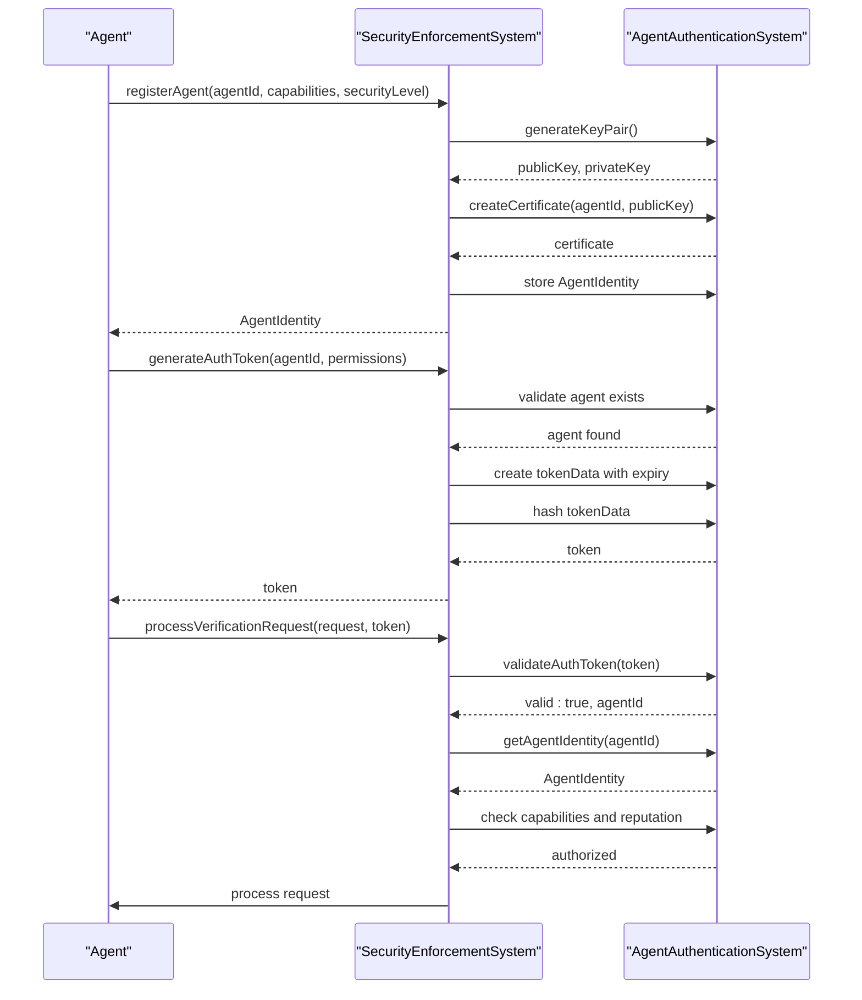

The system implements multiple layers of authentication:

1. **Agent Registration**: Agents are registered with a unique ID, public key, and capabilities. The system generates a cryptographic key pair and creates a digital certificate for the agent.

2. **Challenge-Response Authentication**: For each verification request, the system verifies the agent's identity through a challenge-response mechanism using cryptographic signatures.

3. **Token-Based Sessions**: The system supports token-based authentication for extended sessions, with tokens containing permissions and expiration times.

4. **Reputation-Based Access Control**: Agents have a reputation score (0-100) that affects their ability to perform verification requests. Agents with low reputation (<50) are denied access.

**Section sources**
- [security.ts](file://src/verification/security.ts#L400-L600)

## Data Validation and Integrity Verification

The system implements comprehensive data validation and integrity verification through cryptographic hashing, digital signatures, and zero-knowledge proofs. All data is protected against tampering and unauthorized modification.

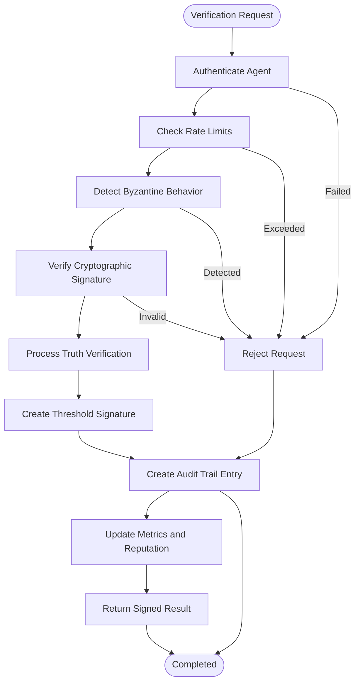

The CryptographicCore class provides essential cryptographic utilities:

- **Key Generation**: RSA 4096-bit key pairs for agent authentication
- **Digital Signatures**: RSA-PSS signatures for message authentication
- **Hashing**: SHA-256 hashing for data integrity
- **Encryption**: AES-256-GCM encryption for sensitive data
- **Nonce Generation**: Cryptographically secure random nonces

Zero-knowledge proofs allow agents to prove knowledge of secrets without revealing the secrets themselves. The system supports two types of zero-knowledge proofs:

1. **Knowledge Proofs**: Agents can prove they know a secret value without revealing it
2. **Range Proofs**: Agents can prove that a committed value falls within a specified range

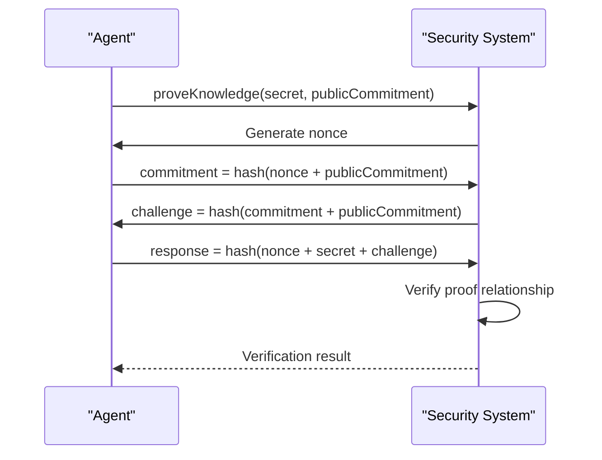

**Section sources**
- [security.ts](file://src/verification/security.ts#L0-L400)
- [security.ts](file://src/verification/security.ts#L600-L800)

## Threat Detection and Byzantine Fault Tolerance

The system implements advanced threat detection capabilities through Byzantine fault tolerance, behavior analysis, and consensus mechanisms. This protects against malicious agents attempting to subvert the system through contradictory messages, timing attacks, or collusion.

```mermaid
classDiagram
class ByzantineFaultToleranceSystem {
+nodeStates : Map<string, NodeState>
+consensusThreshold : number
+totalNodes : number
+registerNode(nodeId) void
+processHeartbeat(nodeId, signature) boolean
+detectByzantineBehavior(nodeId, message) DetectionResult
+achieveConsensus(proposalId, votes) ConsensusResult
+getSystemHealth() SystemHealth
}
class NodeState {
+isAlive : boolean
+lastHeartbeat : Date
+messageHistory : MessageEntry[]
+suspicionLevel : number
+byzantineBehavior : string[]
}
class MessageEntry {
+timestamp : Date
+message : any
+hash : string
}
class DetectionResult {
+isByzantine : boolean
+reasons : string[]
+confidence : number
}
class ConsensusResult {
+consensus : boolean
+result : boolean | null
+participatingNodes : string[]
+byzantineNodes : string[]
}
class SystemHealth {
+totalNodes : number
+aliveNodes : number
+byzantineNodes : number
+consensusCapable : boolean
+avgSuspicionLevel : number
}
ByzantineFaultToleranceSystem --> NodeState : "contains"
ByzantineFaultToleranceSystem --> DetectionResult : "returns"
ByzantineFaultToleranceSystem --> ConsensusResult : "returns"
ByzantineFaultToleranceSystem --> SystemHealth : "returns"
```

The system detects Byzantine behavior through multiple indicators:

1. **Contradictory Messages**: Detects when an agent sends messages with the same request ID but different content
2. **Timing Attacks**: Identifies suspiciously regular message intervals that may indicate automated attacks
3. **Message Spamming**: Flags agents that send excessive messages within a short time window
4. **Collusion Patterns**: Detects multiple agents with highly similar message patterns, indicating possible coordination

The consensus mechanism requires a supermajority of honest nodes to reach agreement, following the Byzantine consensus threshold formula: ⌊(2n/3)⌋ + 1, where n is the total number of nodes.

**Section sources**
- [security.ts](file://src/verification/security.ts#L800-L1200)

## Audit Trail and Compliance

The audit trail system provides comprehensive logging and integrity verification for all security-related activities. Each audit entry includes cryptographic proof and witness signatures to ensure tamper-evidence.

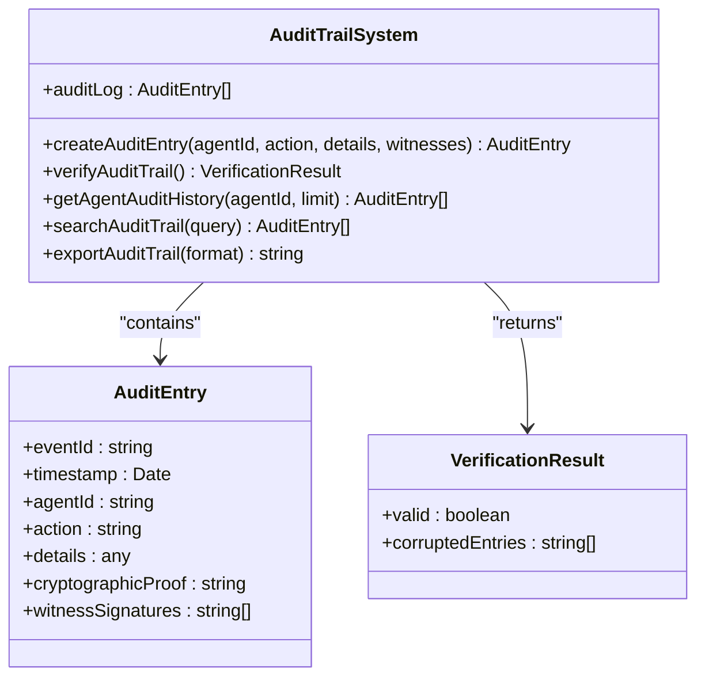

Audit entries are created for all significant security events, including:

- Agent registration and revocation
- Verification requests and responses
- Rate limit violations
- Byzantine behavior detection
- System initialization and shutdown

The system verifies audit trail integrity by recalculating the cryptographic proof for each entry and comparing it to the stored proof. Any discrepancy indicates potential tampering.

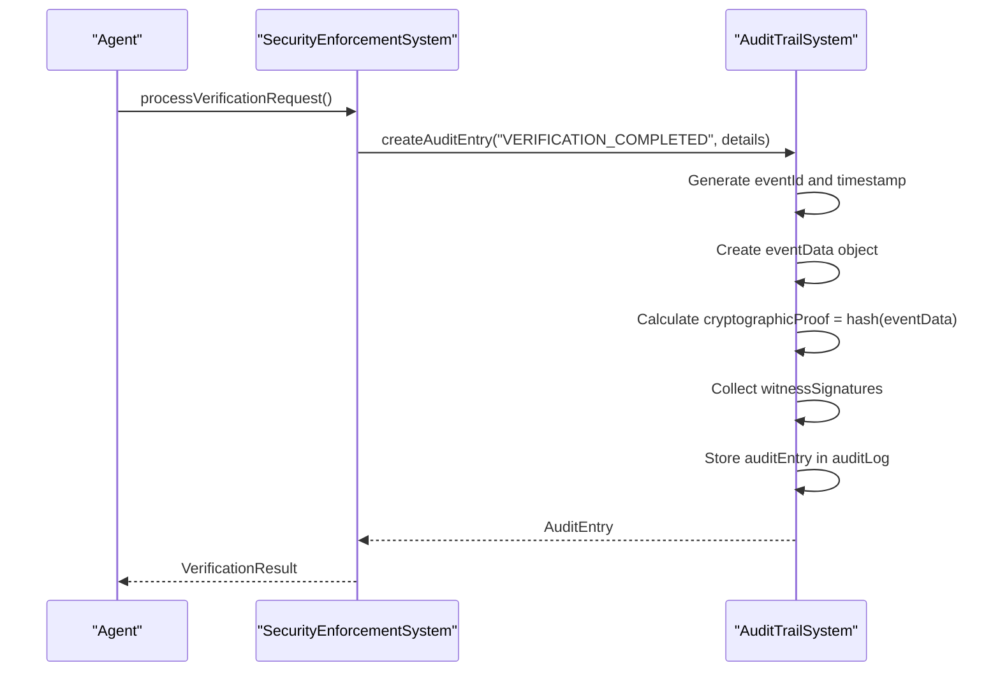

**Section sources**
- [security.ts](file://src/verification/security.ts#L600-L800)

## Security Scanning and Vulnerability Management

The Security Manager provides comprehensive vulnerability scanning capabilities through integration with multiple security tools. It supports various scan types including vulnerability, dependency, code quality, secrets, compliance, infrastructure, and container scanning.

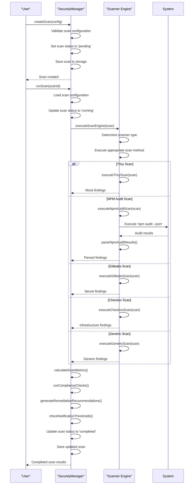

The system supports the following scanners:

- **Trivy**: Container and dependency vulnerability scanning
- **NPM Audit**: JavaScript dependency vulnerability scanning
- **Gitleaks**: Secrets detection in source code
- **Checkov**: Infrastructure as Code (IaC) scanning
- **SonarQube**: Code quality analysis
- **Inspec**: Compliance checking
- **Clair**: Container vulnerability scanning

Scan results include detailed information about each finding:

- **Identification**: Unique ID, title, and description
- **Severity**: Critical, high, medium, low, or info
- **Location**: File, line number, and component
- **Evidence**: Code snippet and context
- **Impact**: Description of potential impact
- **Remediation**: Steps to fix the issue
- **Metadata**: CVE, CWE, CVSS scores, and references

**Section sources**
- [security-manager.ts](file://src/enterprise/security-manager.ts#L1000-L1200)

## Incident Management and Response

The system provides comprehensive incident management capabilities for tracking and responding to security incidents. Incidents can be created from scan findings, alerts, user reports, or automated detection.

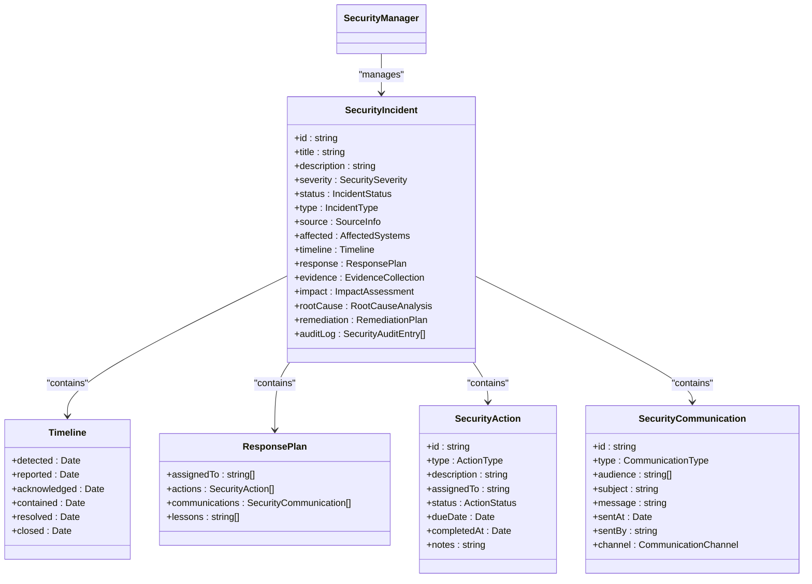

The incident response process follows a structured timeline:

1. **Detection**: The incident is identified through scanning, monitoring, or user reports
2. **Reporting**: The incident is formally documented with details and initial assessment
3. **Acknowledgment**: The security team acknowledges the incident and begins investigation
4. **Containment**: Steps are taken to prevent further damage or spread
5. **Resolution**: The root cause is addressed and the system is restored
6. **Closure**: The incident is formally closed with lessons learned documented

The system automatically assigns incidents based on severity:

- **Critical**: Assigned to security lead and CISO
- **High**: Assigned to security team
- **Medium/Low**: Assigned to security analyst

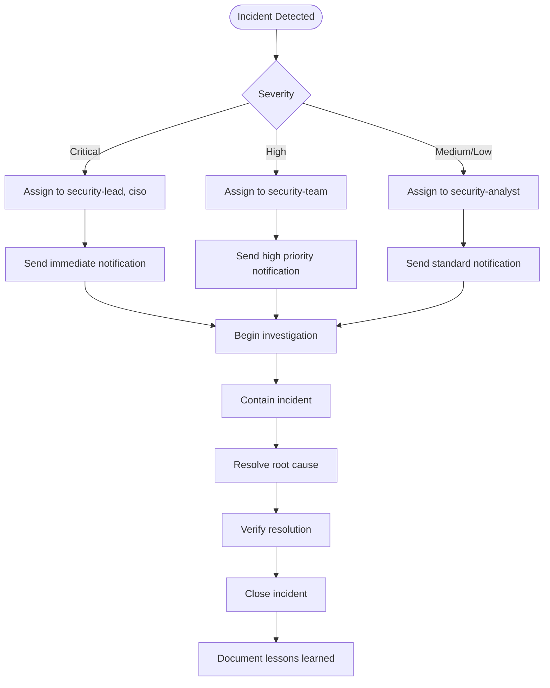

**Section sources**
- [security-manager.ts](file://src/enterprise/security-manager.ts#L200-L400)

## Performance Considerations

The security system is designed to balance thorough protection with acceptable performance. Various mechanisms are in place to minimize the performance impact of security checks while maintaining system integrity.

### Performance Metrics and Optimization

The system tracks key performance indicators for security operations:

- **Scan Duration**: Average time to complete security scans
- **Verification Response Time**: Average time to process verification requests
- **Resource Utilization**: CPU, memory, and I/O usage during security operations
- **Throughput**: Number of requests processed per unit time

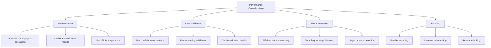

### Optimization Strategies

1. **Caching**: The system caches authentication tokens, reputation scores, and validation results to avoid redundant computations.

2. **Asynchronous Processing**: Security scans and some verification operations are performed asynchronously to avoid blocking critical operations.

3. **Resource Limiting**: The system limits the resources allocated to security operations to prevent denial-of-service conditions.

4. **Incremental Scanning**: The system supports incremental scanning that only examines changed files rather than the entire codebase.

5. **Parallel Execution**: Multiple scanners can run in parallel to reduce overall scan time.

6. **Sampling**: For large datasets, the system may use statistical sampling to detect issues without examining every data point.

**Section sources**
- [security-manager.ts](file://src/enterprise/security-manager.ts#L1200-L1497)
- [security.ts](file://src/verification/security.ts#L1200-L1425)

## Troubleshooting Guide

This section addresses common security-related issues and provides troubleshooting solutions.

### Permission Errors

**Symptom**: "Agent lacks verification capability" error when processing verification requests.

**Cause**: The agent does not have the required capabilities assigned during registration.

**Solution**: Register the agent with the appropriate capabilities:

```typescript
const identity = await securitySystem.registerAgent(
  'agent-123',
  ['verify', 'sign'], // Required capabilities
  'HIGH'
);
```

### Authentication Failures

**Symptom**: "Authentication failed: Agent not registered" error.

**Cause**: The agent ID is not registered in the system.

**Solution**: Register the agent before attempting authentication:

```typescript
// Register the agent first
await securitySystem.registerAgent('agent-123', ['verify'], 'MEDIUM');

// Then authenticate
const token = securitySystem.generateAuthToken('agent-123', ['verify']);
```

### Security Bypass Attempts

**Symptom**: "Byzantine behavior detected" error with reasons like "CONTRADICTORY_MESSAGES" or "TIMING_ATTACK".

**Cause**: The agent is exhibiting behavior patterns consistent with malicious activity.

**Solution**: 
1. Review the agent's behavior and message patterns
2. Check for legitimate reasons for the behavior (e.g., retry logic)
3. If legitimate, adjust the detection thresholds
4. If malicious, revoke the agent's access:

```typescript
await securitySystem.revokeAgent('agent-123', 'Byzantine behavior detected');
```

### High Resource Usage During Scans

**Symptom**: System slowdowns or timeouts during security scans.

**Solution**:
1. Configure resource limits for scanners
2. Use incremental scanning instead of full scans
3. Schedule scans during off-peak hours
4. Limit the number of parallel scans

```typescript
const scan = await securityManager.createScan({
  name: 'Daily Security Scan',
  type: 'vulnerability',
  target: { type: 'repository', path: './' },
  configuration: {
    scanner: 'trivy',
    rules: ['--severity', 'CRITICAL,HIGH'],
    excludes: ['node_modules', 'dist'],
    severity: ['critical', 'high'],
    formats: ['json'],
    outputPath: './security/scans'
  },
  schedule: { frequency: 'daily' },
  notifications: {
    channels: ['email'],
    thresholds: { critical: 1, high: 5, medium: 10 }
  }
});
```

### False Positive Findings

**Symptom**: Security findings that are not actual vulnerabilities.

**Solution**:
1. Review the finding details and evidence
2. If a false positive, update the finding status:
```typescript
finding.status = 'false-positive';
finding.remediation.description = 'False positive - legitimate use case';
```
3. Add the finding to the suppression list in the security policy
4. Update scanner rules to reduce false positives

**Section sources**
- [security-manager.ts](file://src/enterprise/security-manager.ts#L0-L1497)
- [security.ts](file://src/verification/security.ts#L0-L1425)

## Conclusion

The Claude-Flow security system provides a comprehensive, multi-layered approach to system protection and integrity. By combining proactive vulnerability scanning with real-time verification and Byzantine fault tolerance, the system ensures that agents cannot bypass security checks and that all truth claims are properly authenticated.

The Security Manager component provides enterprise-grade vulnerability scanning, compliance checking, and incident management, integrating with industry-standard tools like Trivy, NPM Audit, and Gitleaks. It offers detailed metrics, automated remediation recommendations, and comprehensive reporting capabilities.

The Security Enforcement System provides real-time protection through cryptographic verification, rate limiting, and advanced threat detection. Its implementation of threshold signatures, zero-knowledge proofs, and Byzantine fault tolerance ensures that the system remains secure even in the presence of malicious agents.

Together, these components create a robust security framework that protects against a wide range of threats while maintaining system performance and usability. The system's modular design allows for easy extension and integration with additional security tools and protocols as needed.