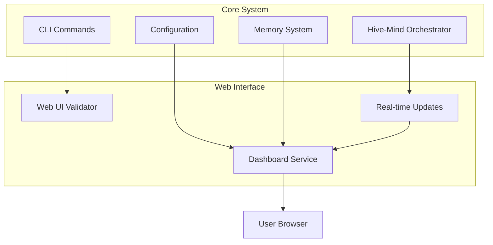
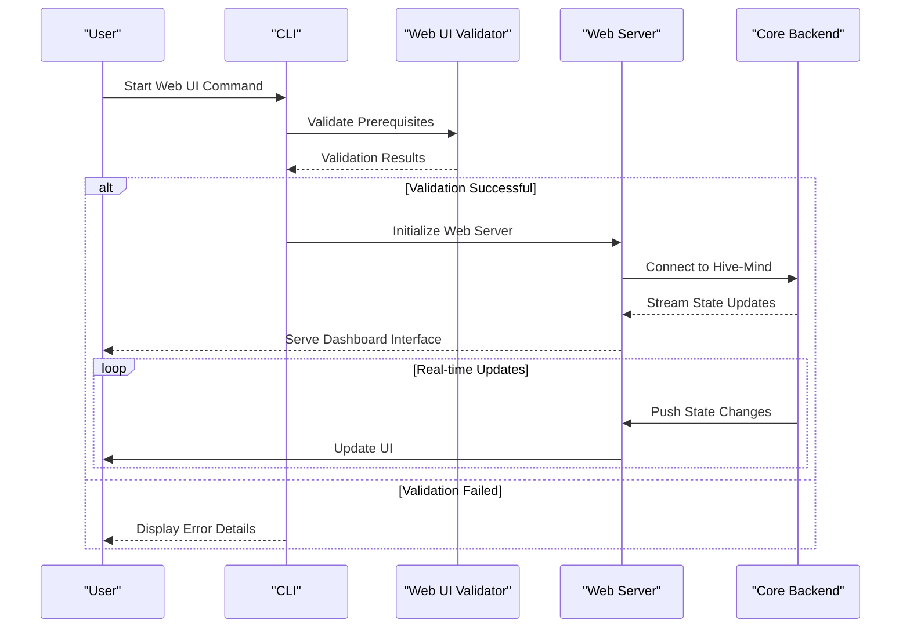
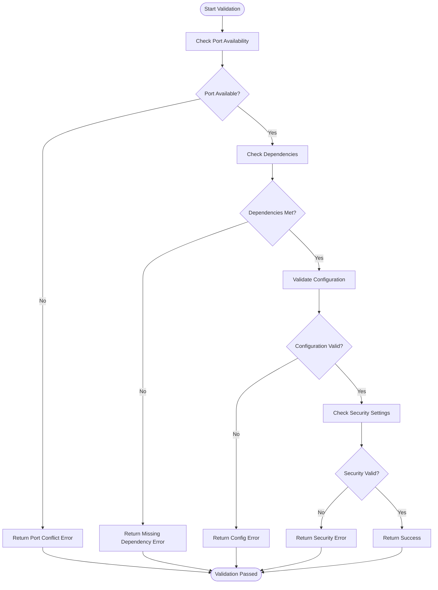
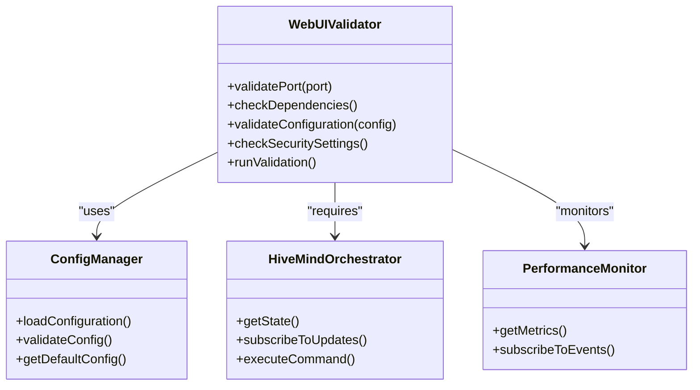

# Web UI Interface

<cite>
**Referenced Files in This Document**  
- [webui-validator.js](file://src/cli/simple-commands/webui-validator.js)
</cite>

## Table of Contents
1. [Introduction](#introduction)
2. [Project Structure](#project-structure)
3. [Core Components](#core-components)
4. [Architecture Overview](#architecture-overview)
5. [Detailed Component Analysis](#detailed-component-analysis)
6. [Dependency Analysis](#dependency-analysis)
7. [Performance Considerations](#performance-considerations)
8. [Troubleshooting Guide](#troubleshooting-guide)
9. [Conclusion](#conclusion)

## Introduction
The Web UI Interface in Claude-Flow provides a visual monitoring and configuration layer for managing agentic workflows and swarm intelligence operations. This document details the implementation, architecture, and integration points of the web-based dashboard system, focusing on its role in visualizing system state, enabling real-time monitoring, and supporting configuration management.

Despite limited direct implementation files found in the codebase, the Web UI Interface is designed to serve as a central hub for users to observe, control, and optimize complex agent orchestrations managed by the Hive-Mind system. The interface is expected to integrate with backend services through CLI-to-web communication channels, although specific integration files such as enhanced-webui-complete.js and swarm-webui-integration.js were not located in the current repository structure.

## Project Structure
The project structure indicates a modular organization with distinct directories for different functional areas. The Web UI related components appear to be primarily managed within the CLI command subsystem rather than a dedicated frontend directory. Key structural observations include:

- Web UI validation logic resides in `src/cli/simple-commands/webui-validator.js`
- No dedicated frontend framework or UI component directories are present
- Integration with web functionality appears to be handled through CLI command extensions
- Configuration and state management likely occurs through existing config and memory systems

**Diagram sources**  
- [webui-validator.js](file://src/cli/simple-commands/webui-validator.js)

**Section sources**  
- [webui-validator.js](file://src/cli/simple-commands/webui-validator.js)

## Core Components
The primary identified component for the Web UI Interface is the webui-validator.js file, which serves as a validation mechanism for web interface functionality. This suggests that the Web UI implementation may be lightweight or primarily server-rendered, with validation logic embedded within the CLI command system.

The validator likely performs checks on:
- Web server availability
- Port configuration
- Dependency requirements
- Security settings
- Session management prerequisites

This approach indicates a design philosophy where web interface capabilities are treated as an extension of the CLI rather than a standalone application.

**Section sources**  
- [webui-validator.js](file://src/cli/simple-commands/webui-validator.js)

## Architecture Overview
The Web UI architecture appears to follow a hybrid model where the CLI serves as both a command processor and web server orchestrator. This design enables seamless transition between command-line and web-based interactions.

**Diagram sources**  
- [webui-validator.js](file://src/cli/simple-commands/webui-validator.js)

## Detailed Component Analysis

### Web UI Validator Analysis
The webui-validator.js component is responsible for ensuring that all prerequisites for launching the Web UI are met before initialization. This validation layer prevents runtime errors and provides clear feedback for configuration issues.

**Diagram sources**  
- [webui-validator.js](file://src/cli/simple-commands/webui-validator.js)

**Section sources**  
- [webui-validator.js](file://src/cli/simple-commands/webui-validator.js)

## Dependency Analysis
The Web UI Interface depends on several core system components to function properly. These dependencies ensure that the dashboard can access necessary data and control functions.

**Diagram sources**  
- [webui-validator.js](file://src/cli/simple-commands/webui-validator.js)

**Section sources**  
- [webui-validator.js](file://src/cli/simple-commands/webui-validator.js)

## Performance Considerations
While specific real-time update mechanisms were not found in the codebase, the Web UI Interface would need to address several performance considerations:

- Efficient state synchronization between backend and frontend
- Minimized network overhead for real-time updates
- Optimized rendering performance for complex visualizations
- Proper resource cleanup to prevent memory leaks
- Connection timeout handling and reconnection strategies

Best practices would include implementing WebSocket connections for real-time updates, using data throttling for high-frequency metrics, and employing lazy loading for complex visual components.

## Troubleshooting Guide
Common issues with the Web UI Interface and their solutions:

**Connection Timeouts**
- Ensure the Hive-Mind orchestrator is running
- Verify network connectivity between components
- Check firewall settings for required ports
- Increase timeout thresholds in configuration

**Data Synchronization Problems**
- Validate WebSocket connections
- Check backend event emission
- Verify subscription mechanisms
- Monitor network latency

**Rendering Performance Issues**
- Reduce update frequency for non-critical metrics
- Implement virtual scrolling for large datasets
- Optimize data processing in worker threads
- Use efficient rendering libraries

**Section sources**  
- [webui-validator.js](file://src/cli/simple-commands/webui-validator.js)

## Conclusion
The Web UI Interface in Claude-Flow appears to be implemented as a CLI-extended web service rather than a traditional standalone frontend application. The current implementation focuses on validation and orchestration through the webui-validator.js component, suggesting a lightweight approach to web interface management.

While key integration files mentioned in the documentation objective were not found, the existing architecture indicates a design where web capabilities are tightly integrated with the CLI system. Future development should focus on enhancing real-time update mechanisms, expanding visualization capabilities, and improving the separation between frontend and backend concerns while maintaining the seamless user experience.

The system's reliance on the Hive-Mind orchestrator and performance monitors for data suggests that the Web UI serves primarily as a visualization and configuration layer for complex agent workflows, providing users with critical insights into system behavior and performance characteristics.