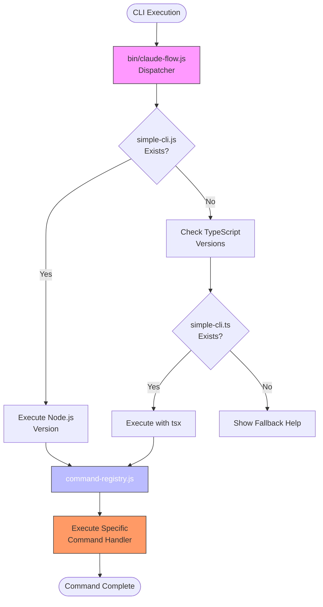
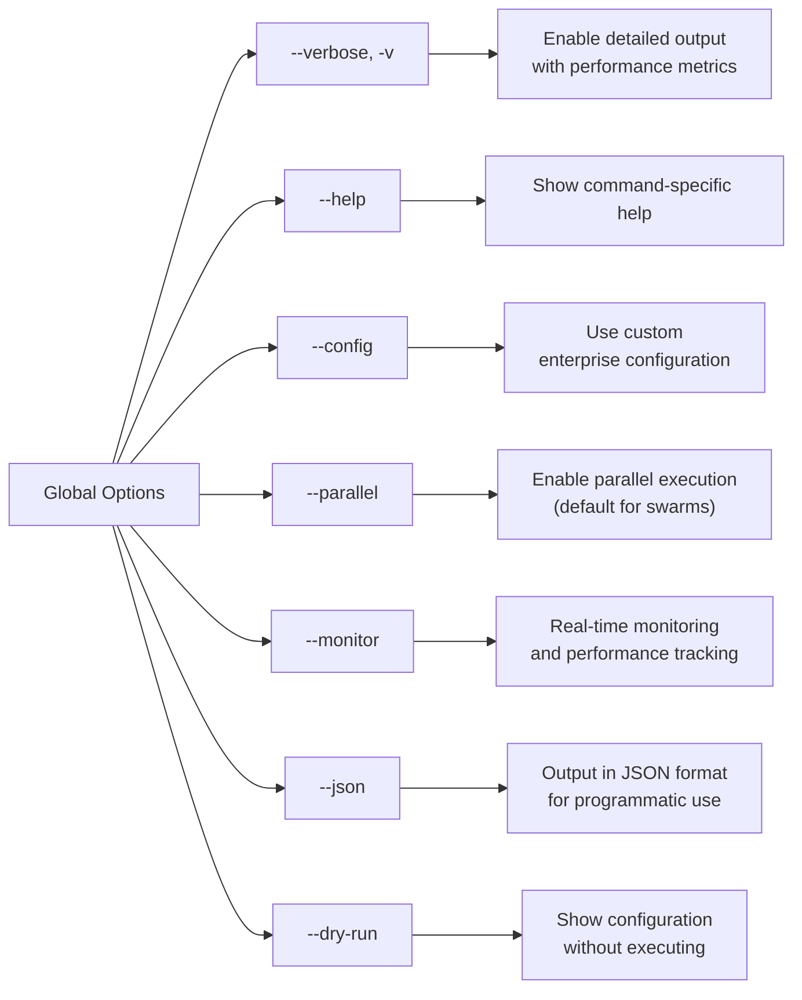
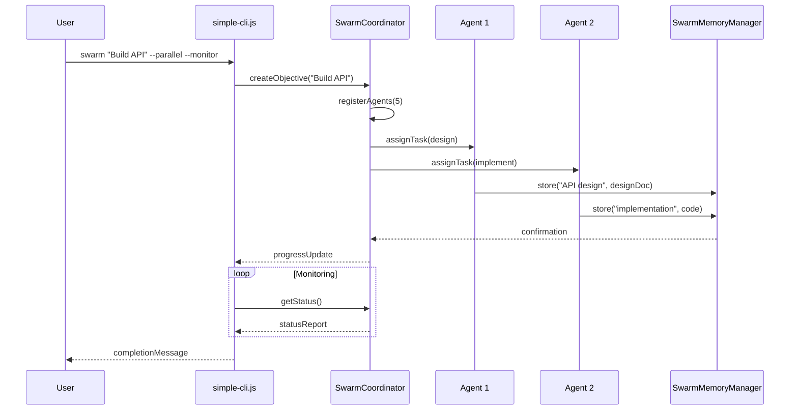
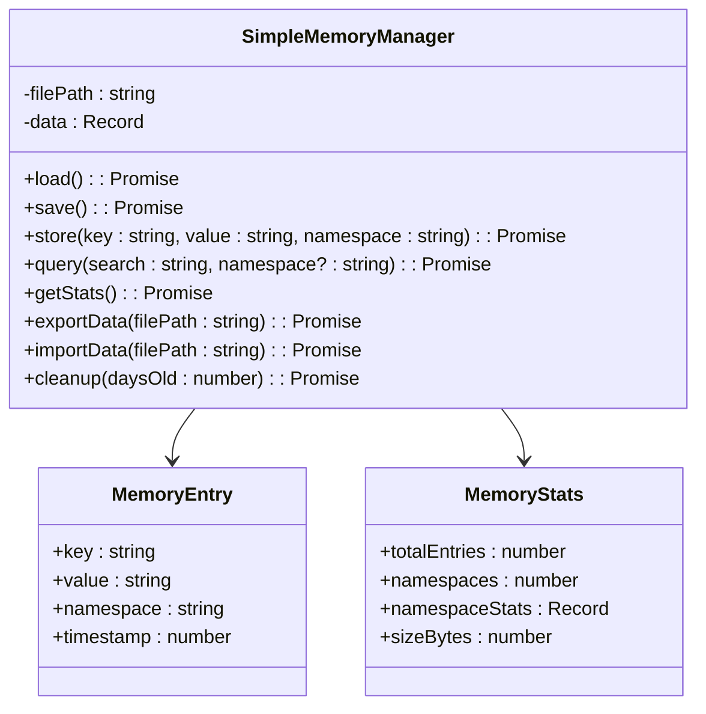
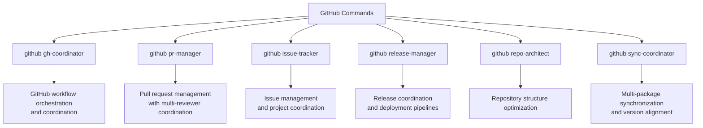

<docs>
# CLI Reference

<cite>
**Referenced Files in This Document**   
- [bin/claude-flow.js](file://bin/claude-flow.js)
- [src/cli/simple-cli.js](file://src/cli/simple-cli.js)
- [src/cli/command-registry.js](file://src/cli/command-registry.js)
- [src/cli/help-text.js](file://src/cli/help-text.js)
- [src/cli/commands/hive-mind/index.ts](file://src/cli/commands/hive-mind/index.ts)
- [src/cli/commands/swarm.ts](file://src/cli/commands/swarm.ts)
- [src/cli/commands/memory.ts](file://src/cli/commands/memory.ts)
- [src/cli/commands/github.js](file://src/cli/simple-commands/github.js)
- [src/cli/commands/workflow.ts](file://src/cli/commands/workflow.ts)
- [src/cli/commands/utility.js](file://src/cli/simple-commands/utils.js)
- [python-claude-flow/src/claude_flow/cli/main.py](file://python-claude-flow/src/claude_flow/cli/main.py) - *Added in recent commit*
- [python-claude-flow/src/claude_flow/cli/commands.py](file://python-claude-flow/src/claude_flow/cli/commands.py) - *Added in recent commit*
</cite>

## Table of Contents
1. [Command Structure and Syntax](#command-structure-and-syntax)
2. [Global Options](#global-options)
3. [Hive-Mind Commands](#hive-mind-commands)
4. [Swarm Commands](#swarm-commands)
5. [Memory Commands](#memory-commands)
6. [Neural Commands](#neural-commands)
7. [GitHub Commands](#github-commands)
8. [Workflow Commands](#workflow-commands)
9. [Utility Commands](#utility-commands)
10. [Command Relationships and Workflows](#command-relationships-and-workflows)
11. [Common Issues and Troubleshooting](#common-issues-and-troubleshooting)
12. [Performance Considerations](#performance-considerations)

## Command Structure and Syntax

The Claude-Flow CLI follows a consistent command structure designed for both simplicity and advanced orchestration capabilities. The basic syntax pattern is:

```
claude-flow <command> [subcommand] [arguments] [options]
```

Commands are organized into categories with hierarchical subcommands. The system uses Commander.js for command parsing and validation. The CLI dispatcher in `bin/claude-flow.js` detects the optimal runtime environment and routes execution to the appropriate implementation.

The command execution flow begins with the dispatcher, which attempts to execute the JavaScript version of the CLI (`simple-cli.js`) first for maximum compatibility. If the JavaScript version is unavailable, it falls back to the TypeScript version using `tsx`.



**Diagram sources**
- [bin/claude-flow.js](file://bin/claude-flow.js#L1-L148)
- [src/cli/simple-cli.js](file://src/cli/simple-cli.js#L1-L3430)
- [src/cli/command-registry.js](file://src/cli/command-registry.js#L1-L1088)

**Section sources**
- [bin/claude-flow.js](file://bin/claude-flow.js#L1-L148)
- [src/cli/simple-cli.js](file://src/cli/simple-cli.js#L1-L3430)

## Global Options

Claude-Flow provides a set of global options that can be used with most commands to modify their behavior:



These options are processed by the `parseFlags` function in `utils.js` and made available to command handlers through the `CommandContext` object. The `--verbose` flag enables detailed logging that includes performance metrics and internal state information, which is particularly useful for debugging complex workflows.

The `--json` flag is implemented across most commands to provide machine-readable output, facilitating integration with other tools and automation scripts. This is particularly valuable in CI/CD pipelines where the output needs to be parsed programmatically.

**Section sources**
- [src/cli/simple-cli.js](file://src/cli/simple-cli.js#L1-L3430)
- [src/cli/utils.js](file://src/cli/utils.js#L1-L100)

## Hive-Mind Commands

The Hive-Mind command category provides collective intelligence swarm management capabilities, enabling coordinated multi-agent operations with centralized control.

```mermaid
classDiagram
class HiveMindCommand {
+description : string
+addCommand(command : Command)
+execute(context : CommandContext)
}
class Command {
<<interface>>
+name : string
+description : string
+handler : Function
}
class InitCommand {
+handler(context : CommandContext)
}
class SpawnCommand {
+handler(context : CommandContext)
}
class StatusCommand {
+handler(context : CommandContext)
}
class TaskCommand {
+handler(context : CommandContext)
}
class WizardCommand {
+handler(context : CommandContext)
}
class StopCommand {
+handler(context : CommandContext)
}
class PauseCommand {
+handler(context : CommandContext)
}
class ResumeCommand {
+handler(context : CommandContext)
}
class PsCommand {
+handler(context : CommandContext)
}
HiveMindCommand --> Command : "contains"
HiveMindCommand --> InitCommand : "addCommand"
HiveMindCommand --> SpawnCommand : "addCommand"
HiveMindCommand --> StatusCommand : "addCommand"
HiveMindCommand --> TaskCommand : "addCommand"
HiveMindCommand --> WizardCommand : "addCommand"
HiveMindCommand --> StopCommand : "addCommand"
HiveMindCommand --> PauseCommand : "addCommand"
HiveMindCommand --> ResumeCommand : "addCommand"
HiveMindCommand --> PsCommand : "addCommand"
```



**Diagram sources**
- [src/cli/commands/hive-mind/index.ts](file://src/cli/commands/hive-mind/index.ts#L1-L43)
- [src/cli/commands/hive-mind/init.js](file://src/cli/commands/hive-mind/init.js#L1-L50)
- [src/cli/commands/hive-mind/spawn.js](file://src/cli/commands/hive-mind/spawn.js#L1-L50)

### hive-mind wizard

The interactive setup wizard guides users through the configuration process:

**Invocation Syntax**
```
claude-flow hive-mind wizard
```

**Parameters**
- No positional parameters

**Options**
- None

**Return Values**
- Exit code 0 on successful completion
- Exit code 1 on error or interruption

**Examples**
```bash
# Start the interactive setup wizard
claude-flow hive-mind wizard

# The wizard will guide you through:
# 1. System configuration
# 2. Agent type selection
# 3. Memory settings
# 4. Network topology
# 5. Security configuration
```

### hive-mind spawn

Creates an intelligent swarm with a specific objective:

**Invocation Syntax**
```
claude-flow hive-mind spawn <task> [options]
```

**Parameters**
- `task`: The objective for the swarm to accomplish

**Options**
- `--claude`: Open Claude Code CLI after swarm creation
- `--strategy <type>`: Strategy type (research, development, analysis, testing, optimization, maintenance)
- `--mode <type>`: Coordination mode (centralized, distributed, hierarchical, mesh, hybrid)
- `--max-agents <n>`: Maximum number of agents (default: 5)
- `--parallel`: Enable parallel execution
- `--monitor`: Enable real-time monitoring

**Return Values**
- Swarm ID on success
- Error message on failure

**Examples**
```bash
# Create a swarm to build an API
claude-flow hive-mind spawn "Build a REST API" --strategy development --parallel

# Create a research swarm
claude-flow hive-mind spawn "Research cloud architecture" --strategy research --monitor

# Create a swarm and open Claude Code CLI
claude-flow hive-mind spawn "Implement feature" --claude
```

### hive-mind status

Displays the current status of active swarms:

**Invocation Syntax**
```
claude-flow hive-mind status [options]
```

**Parameters**
- None

**Options**
- `--verbose`: Show detailed information
- `--json`: Output in JSON format
- `--recent <n>`: Show only the most recent n swarms

**Return Values**
- Table of active swarms with status information
- JSON object when `--json` is specified

**Examples**
```bash
# Show basic status
claude-flow hive-mind status

# Show detailed status
claude-flow hive-mind status --verbose

# Get JSON output for scripting
claude-flow hive-mind status --json | jq '.activeSwarmCount'
```

## Swarm Commands

The Swarm command category enables multi-agent AI coordination for accomplishing complex objectives through parallel processing and neural optimization.



**Diagram sources**
- [src/cli/commands/swarm.ts](file://src/cli/commands/swarm.ts#L1-L640)
- [src/coordination/swarm-coordinator.js](file://src/coordination/swarm-coordinator.js#L1-L200)
- [src/memory/swarm-memory.js](file://src/memory/swarm-memory.js#L1-L100)

### swarm

Deploys intelligent multi-agent swarms to accomplish complex objectives:

**Invocation Syntax**
```
claude-flow swarm <objective> [options]
```

**Parameters**
- `objective`: The goal for the swarm to achieve

**Options**
- `--dry-run`: Show configuration without executing
- `--strategy <type>`: Strategy type (auto, research, development, analysis, testing, optimization)
- `--max-agents <n>`: Maximum number of agents (default: 5)
- `--timeout <minutes>`: Timeout in minutes (default: 60)
- `--research`: Enable research capabilities
- `--parallel`: Enable parallel execution
- `--review`: Enable peer review between agents
- `--monitor`: Enable real-time monitoring
- `--ui`: Use terminal UI
- `--background`: Run in background mode
- `--distributed`: Enable distributed coordination
- `--memory-namespace`: Memory namespace for swarm (default: swarm)
- `--persistence`: Enable task persistence (default: true)

**Return Values**
- Swarm ID and objective ID on success
- Error message on failure
- Progress updates during execution
- Final completion message

**Examples**
```bash
# Deploy a swarm to build a REST API
claude-flow swarm "Build a REST API" --strategy development --parallel --monitor

# Research cloud architecture options
claude-flow swarm "Research cloud architecture" --strategy research --research --max-agents 3

# Dry run to see configuration
claude-flow swarm "Implement feature" --strategy development --dry-run

# Run in background mode
claude-flow swarm "Analyze codebase" --background --timeout 120
```

## Memory Commands

The Memory command category provides persistent storage and retrieval capabilities for cross-session data and knowledge management.



**Diagram sources**
- [src/cli/commands/memory.ts](file://src/cli/commands/memory.ts#L1-L266)
- [src/memory/memory-store.json](file://src/memory/memory-store.json#L1-L50)

### memory store

Stores information in the persistent memory bank:

**Invocation Syntax**
```
claude-flow memory store <key> <value> [options]
```

**Parameters**
- `key`: Identifier for the stored data
- `value`: Data to store (can be quoted string)

**Options**
- `-n, --namespace <namespace>`: Target namespace (default: default)

**Return Values**
- Success confirmation with key, namespace, and size
- Error message on failure

**Examples**
```bash
# Store architectural decision
claude-flow memory store "architecture" "microservices with API gateway pattern"

# Store in specific namespace
claude-flow memory store "security-rules" "implement OAuth2" --namespace security

# Store configuration
claude-flow memory store "db-config" '{"host":"localhost","port":5432}' --namespace database
```

### memory query

Searches for stored memory entries:

**Invocation Syntax**
```
claude-flow memory query <search> [options]
```

**Parameters**
- `search`: Term to search for in keys or values

**Options**
- `-n, --namespace <namespace>`: Filter by namespace
- `-l, --limit <limit>`: Limit results (default: 10)

**Return Values**
- List of matching entries with key, namespace, value preview, and timestamp
- "No results found" message if no matches

**Examples**
```bash
# Search for all entries containing "API"
claude-flow memory query "API"

# Search in specific namespace
claude-flow memory query "security" --namespace security

# Limit results
claude-flow memory query "database" --limit 5
```

### memory stats

Displays statistics about the memory store:

**Invocation Syntax**
```
claude-flow memory stats
```

**Parameters**
- None

**Options**
- None

**Return Values**
- Total number of entries
- Number of namespaces
- Statistics by namespace
- Total size in bytes

**Examples**
```bash
# Show memory statistics
claude-flow memory stats
```

### memory export

Exports memory data to a file:

**Invocation Syntax**
```
claude-flow memory export <file>
```

**Parameters**
- `file`: Path to export file

**Options**
- None

**Return Values**
- Success confirmation with file path and entry count
- Error message on failure

**Examples**
```bash
# Export memory to backup file
claude-flow memory export backup-2025-08-04.json
```

## Neural Commands

Based on the repository analysis, while neural networking capabilities are mentioned in the documentation and help text, no specific "neural" command file was found in the codebase. The neural functionality appears to be integrated into other command categories, particularly Swarm and Hive-Mind commands.

The system references "WASM-powered cognitive patterns with SIMD optimization" and "Real WASM Neural Networks - ruv-fann powered actual neural processing" in its help text, indicating that neural processing is implemented but not exposed as a separate command category.

Neural capabilities are likely embedded within the swarm coordination and memory management systems, providing optimization and learning capabilities without requiring direct user interaction with neural-specific commands.

**Section sources**
- [src/cli/help-text.js](file://src/cli/help-text.js#L1-L1030)
- [src/cli/simple-cli.js](file://src/cli/simple-cli.js#L1-L3430)

## GitHub Commands

The GitHub command category provides specialized modes for GitHub workflow automation, enabling coordinated development and project management.



**Diagram sources**
- [src/cli/simple-commands/github.js](file://src/cli