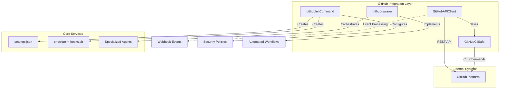
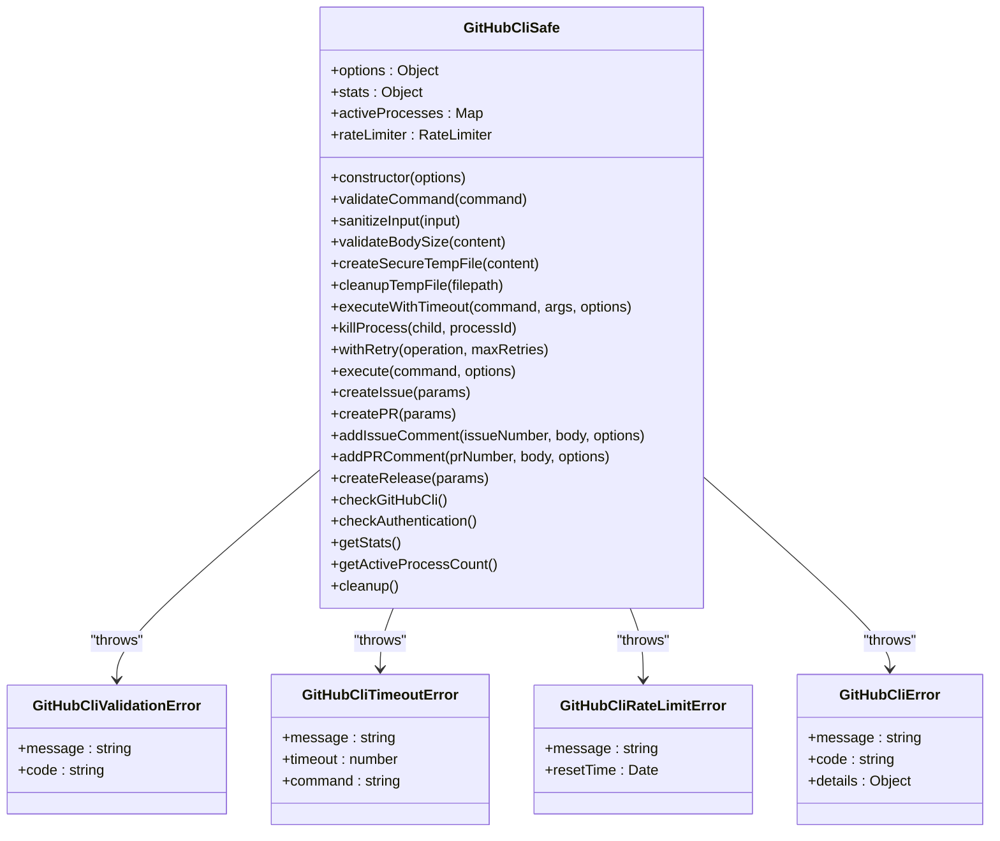
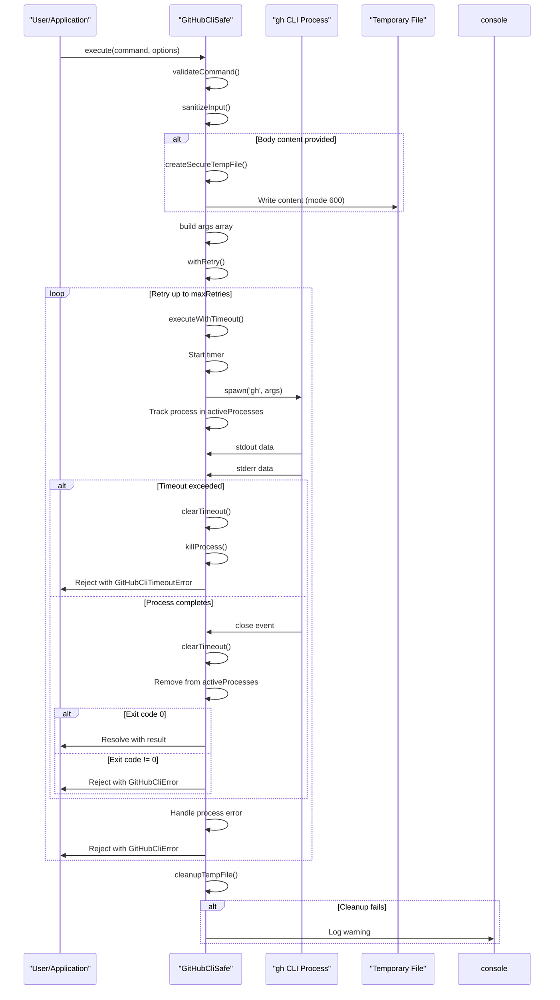
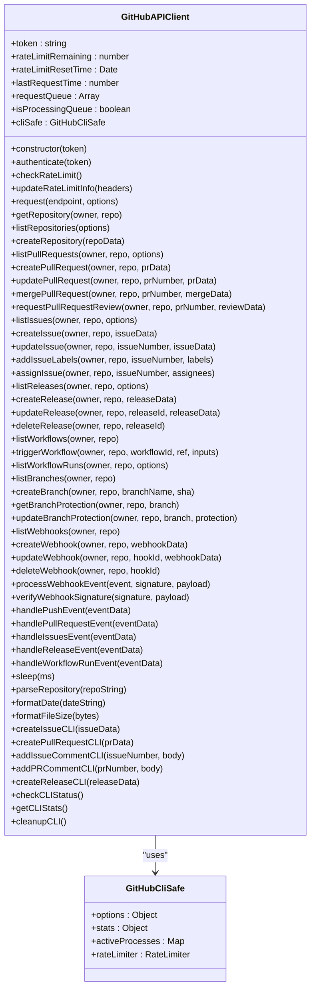
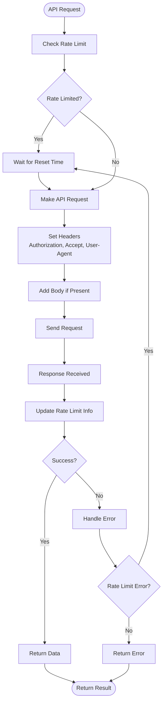
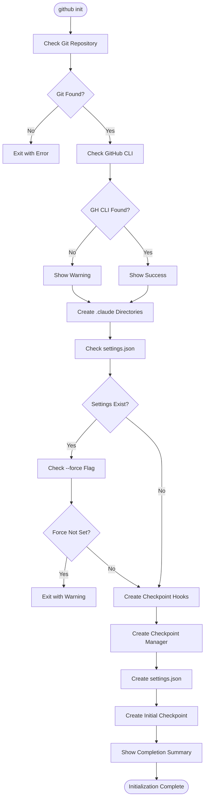
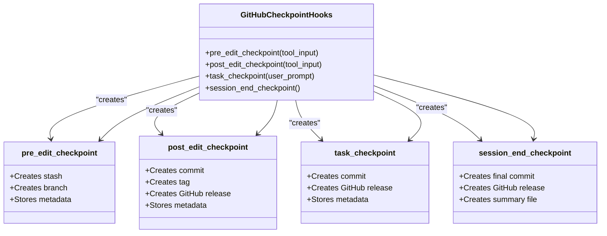
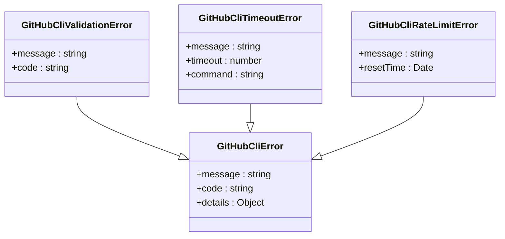

# GitHub Commands

<cite>
**Referenced Files in This Document**   
- [github-cli-safety-wrapper.js](file://src/utils/github-cli-safety-wrapper.js#L1-L587)
- [init.js](file://src/cli/simple-commands/github/init.js#L1-L529)
- [github-api.js](file://src/cli/simple-commands/github/github-api.js#L1-L619)
- [github-swarm.md](file://src/cli/simple-commands/init/templates/commands/github/github-swarm.md#L1-L122)
</cite>

## Table of Contents
1. [Introduction](#introduction)
2. [Core Architecture](#core-architecture)
3. [GitHub CLI Safety Wrapper](#github-cli-safety-wrapper)
4. [GitHub API Client](#github-api-client)
5. [Initialization System](#initialization-system)
6. [Swarm Integration](#swarm-integration)
7. [Security and Error Handling](#security-and-error-handling)
8. [Usage Examples](#usage-examples)
9. [Troubleshooting Guide](#troubleshooting-guide)
10. [Conclusion](#conclusion)

## Introduction

The GitHub Commands sub-feature provides a comprehensive integration layer between the claude-flow system and GitHub's platform, enabling automated repository management, pull request handling, issue tracking, and code review operations. This documentation details the implementation of secure GitHub interactions through both API and CLI interfaces, with a focus on safety, reliability, and ease of use.

The system is designed to support both basic GitHub operations and advanced automation workflows, with features including secure temporary file handling, process management with timeout protection, rate limiting, and retry logic with exponential backoff. The integration supports both direct API calls and safe CLI command execution, providing flexibility for different use cases and security requirements.

**Section sources**
- [github-api.js](file://src/cli/simple-commands/github/github-api.js#L1-L619)
- [github-cli-safety-wrapper.js](file://src/utils/github-cli-safety-wrapper.js#L1-L587)

## Core Architecture

The GitHub integration system follows a layered architecture with clear separation of concerns between the API client, CLI safety wrapper, and initialization components. The architecture is designed to provide secure, reliable, and efficient access to GitHub functionality while protecting against common security vulnerabilities and operational issues.



**Diagram sources**
- [github-api.js](file://src/cli/simple-commands/github/github-api.js#L16-L619)
- [github-cli-safety-wrapper.js](file://src/utils/github-cli-safety-wrapper.js#L1-L587)
- [init.js](file://src/cli/simple-commands/github/init.js#L1-L529)

**Section sources**
- [github-api.js](file://src/cli/simple-commands/github/github-api.js#L1-L619)
- [github-cli-safety-wrapper.js](file://src/utils/github-cli-safety-wrapper.js#L1-L587)

## GitHub CLI Safety Wrapper

The GitHub CLI Safety Wrapper provides a secure interface for executing GitHub CLI commands with comprehensive safety features including input validation, secure temporary file handling, process management with timeout protection, and automatic cleanup.

### Key Features

- **Input Validation**: All commands and parameters are validated before execution
- **Secure Temporary Files**: Body content is written to temporary files with restricted permissions (600 - owner read/write only)
- **Process Management**: Child processes are tracked and can be terminated if they exceed timeout limits
- **Timeout Protection**: Commands are automatically terminated if they exceed configurable timeout limits
- **Automatic Cleanup**: Temporary files and processes are automatically cleaned up, even in error conditions
- **Retry Logic**: Failed operations are automatically retried with exponential backoff
- **Rate Limiting**: Optional rate limiting to prevent API abuse



**Diagram sources**
- [github-cli-safety-wrapper.js](file://src/utils/github-cli-safety-wrapper.js#L1-L587)

**Section sources**
- [github-cli-safety-wrapper.js](file://src/utils/github-cli-safety-wrapper.js#L1-L587)

### Execution Flow

The execution flow for a GitHub CLI command involves multiple safety checks and protections to ensure reliable and secure operation:



**Diagram sources**
- [github-cli-safety-wrapper.js](file://src/utils/github-cli-safety-wrapper.js#L1-L587)

## GitHub API Client

The GitHub API Client provides a comprehensive interface to GitHub's REST API with built-in rate limiting, authentication management, and error handling. It serves as the primary interface for programmatic access to GitHub resources and operations.

### Key Features

- **Authentication Management**: Supports token-based authentication with environment variable fallback
- **Rate Limiting**: Automatic handling of rate limits with wait-and-retry logic
- **Error Handling**: Comprehensive error handling with detailed error information
- **Event Processing**: Webhook event processing with signature verification
- **CLI Integration**: Safe CLI command execution through the GitHubCliSafe wrapper
- **Utility Methods**: Helper methods for common operations like repository parsing and formatting



**Diagram sources**
- [github-api.js](file://src/cli/simple-commands/github/github-api.js#L16-L619)

**Section sources**
- [github-api.js](file://src/cli/simple-commands/github/github-api.js#L1-L619)

### API Request Flow

The API request flow includes comprehensive rate limiting, authentication, and error handling to ensure reliable operation:



**Diagram sources**
- [github-api.js](file://src/cli/simple-commands/github/github-api.js#L16-L619)

## Initialization System

The GitHub initialization system sets up the necessary configuration and hooks for GitHub integration, including checkpoint management, security policies, and automated workflows.

### Initialization Process

The initialization process creates the required directory structure, configuration files, and hooks for GitHub integration:



**Diagram sources**
- [init.js](file://src/cli/simple-commands/github/init.js#L1-L529)

**Section sources**
- [init.js](file://src/cli/simple-commands/github/init.js#L1-L529)

### Checkpoint Hooks

The checkpoint system provides automated version control and rollback capabilities through shell hooks that integrate with GitHub releases:



**Diagram sources**
- [init.js](file://src/cli/simple-commands/github/init.js#L1-L529)

## Swarm Integration

The GitHub swarm functionality enables specialized agent teams for automated repository management, with different focus areas and capabilities.

### Agent Types

The system supports multiple specialized agent types for different GitHub management tasks:

```mermaid
graph TD
Swarm[GitHub Swarm] --> IssueTriager
Swarm --> PRReviewer
Swarm --> DocumentationAgent
Swarm --> TestAgent
Swarm --> SecurityAgent
IssueTriager --> |Analyzes| Issues[Open Issues]
IssueTriager --> |Suggests| Labels[Labels & Priorities]
IssueTriager --> |Identifies| Duplicates[Duplicate Issues]
PRReviewer --> |Reviews| PRs[Pull Requests]
PRReviewer --> |Suggests| Improvements[Code Improvements]
PRReviewer --> |Checks| BestPractices[Best Practices]
DocumentationAgent --> |Updates| README[README Files]
DocumentationAgent --> |Creates| APIDocs[API Documentation]
DocumentationAgent --> |Maintains| Changelog[Changelog]
TestAgent --> |Identifies| MissingTests[Missing Tests]
TestAgent --> |Suggests| TestCases[Test Cases]
TestAgent --> |Validates| Coverage[Test Coverage]
SecurityAgent --> |Scans| Vulnerabilities[Vulnerabilities]
SecurityAgent --> |Reviews| Dependencies[Dependencies]
SecurityAgent --> |Suggests| SecurityImprovements[Security Improvements]
```



**Diagram sources**
- [github-swarm.md](file://src/cli/simple-commands/init/templates/commands/github/github-swarm.md#L1-L122)

**Section sources**
- [github-swarm.md](file://src/cli/simple-commands/init/templates/commands/github/github-swarm.md#L1-L122)

### Workflows

The system implements several automated workflows for common GitHub management tasks:

```mermaid
flowchart TD
subgraph "Issue Triage Workflow"
ITW[Issue Triage] --> ScanIssues["Scan all open issues"]
ScanIssues --> Categorize["Categorize by type and priority"]
Categorize --> ApplyLabels["Apply appropriate labels"]
ApplyLabels --> SuggestAssignees["Suggest assignees"]
SuggestAssignees --> LinkIssues["Link related issues"]
end
subgraph "PR Enhancement Workflow"
PREW[PR Enhancement] --> AnalyzePR["Analyze PR changes"]
AnalyzePR --> SuggestTests["Suggest missing tests"]
SuggestTests --> ImproveDocs["Improve documentation"]
ImproveDocs --> FormatCode["Format code consistently"]
FormatCode --> AddComments["Add helpful comments"]
end
subgraph "Repository Health Check"
RHC[Health Check] --> AnalyzeCode["Analyze code quality metrics"]
AnalyzeCode --> ReviewDeps["Review dependency status"]
ReviewDeps --> CheckCoverage["Check test coverage"]
CheckCoverage --> AssessDocs["Assess documentation completeness"]
AssessDocs --> GenerateReport["Generate health report"]
end
```



**Diagram sources**
- [github-swarm.md](file://src/cli/simple-commands/init/templates/commands/github/github-swarm.md#L1-L122)

## Security and Error Handling

The GitHub integration system implements comprehensive security and error handling to ensure reliable and safe operation.

### Security Features

- **Input Validation**: All commands and parameters are validated before execution
- **Input Sanitization**: User input is sanitized to prevent injection attacks
- **Secure File Permissions**: Temporary files are created with restricted permissions (600)
- **Shell Injection Prevention**: Shell execution is disabled (shell: false) to prevent injection
- **Process Isolation**: Child processes are isolated and can be terminated if necessary
- **Rate Limiting**: API rate limits are respected to prevent abuse
- **Signature Verification**: Webhook signatures are verified when secret is configured

### Error Handling

The system implements comprehensive error handling with appropriate error types for different failure modes:



**Diagram sources**
- [github-cli-safety-wrapper.js](file://src/utils/github-cli-safety-wrapper.js#L1-L587)

**Section sources**
- [github-cli-safety-wrapper.js](file://src/utils/github-cli-safety-wrapper.js#L1-L587)

## Usage Examples

### Basic GitHub Initialization

Initialize GitHub integration with checkpoint system:

```bash
npx claude-flow github init
```

### Create a GitHub Issue

Create a new issue using the API client:

```javascript
const client = new GitHubAPIClient('your-token');
const result = await client.createIssue('owner', 'repo', {
  title: 'Bug report',
  body: 'Detailed description of the issue',
  labels: ['bug', 'high-priority'],
  assignees: ['username']
});
```

### Create a Pull Request

Create a new pull request using the CLI wrapper:

```javascript
const { githubCli } = require('./github-cli-safety-wrapper');
const result = await githubCli.createPR({
  title: 'Feature implementation',
  body: 'Description of the changes',
  base: 'main',
  head: 'feature-branch',
  draft: false
});
```

### Initialize a GitHub Swarm

Create a specialized swarm for repository maintenance:

```bash
npx claude-flow github swarm -r owner/repo -f maintenance --issue-labels
```

## Troubleshooting Guide

### Common Issues and Solutions

**Authentication Failures**
- **Symptom**: "GitHub token not found" or "Authentication failed"
- **Solution**: Set the GITHUB_TOKEN environment variable or provide a token to the constructor
- **CLI Alternative**: Run `gh auth login` to authenticate the GitHub CLI

**Rate Limiting**
- **Symptom**: "Rate limit exceeded" messages
- **Solution**: Wait for the reset time or reduce request frequency
- **Prevention**: Implement caching or batch operations to reduce API calls

**GitHub CLI Not Found**
- **Symptom**: "GitHub CLI not found" warning
- **Solution**: Install the GitHub CLI from https://cli.github.com/
- **Verification**: Run `gh --version` to verify installation

**Permission Errors**
- **Symptom**: "Failed to create temp file" or "Permission denied"
- **Solution**: Check file permissions and ensure the application has write access to the temporary directory
- **Security Note**: The system creates temporary files with mode 600 (owner read/write only)

**Process Timeout**
- **Symptom**: "Command failed with exit code 1" or timeout errors
- **Solution**: Increase the timeout value in the options or optimize the command
- **Debugging**: Enable logging to see detailed error information

**Webhook Signature Verification**
- **Symptom**: "Invalid webhook signature" errors
- **Solution**: Set the GITHUB_WEBHOOK_SECRET environment variable
- **Note**: Signature verification is skipped if the secret is not configured

## Conclusion

The GitHub Commands sub-feature provides a robust and secure integration between the claude-flow system and GitHub's platform. The architecture combines API and CLI access methods with comprehensive safety features including input validation, secure temporary file handling, process management with timeout protection, and automatic cleanup.

Key strengths of the implementation include:
- **Security**: Multiple layers of protection against injection attacks and unauthorized access
- **Reliability**: Automatic retry logic with exponential backoff and comprehensive error handling
- **Flexibility**: Support for both API and CLI access methods with consistent interfaces
- **Automation**: Comprehensive initialization system and swarm capabilities for automated workflows
- **Observability**: Detailed statistics and logging for monitoring and debugging

The system is designed to support both basic GitHub operations and advanced automation scenarios, making it suitable for a wide range of use cases from simple issue management to complex repository maintenance workflows.