# Hive-Mind Commands

<cite>
**Referenced Files in This Document**   
- [HiveMind.ts](file://src/hive-mind/core/HiveMind.ts)
- [Queen.ts](file://src/hive-mind/core/Queen.ts)
- [Agent.ts](file://src/hive-mind/core/Agent.ts)
- [types.ts](file://src/hive-mind/types.ts)
- [swarm-spawn.ts](file://src/cli/commands/swarm-spawn.ts)
- [swarm-stop.ts](file://src/cli/commands/swarm-stop.ts)
- [swarm-status.ts](file://src/cli/commands/swarm-status.ts)
- [swarm-task.ts](file://src/cli/commands/swarm-task.ts)
- [swarm-wizard.ts](file://src/cli/commands/swarm-wizard.ts)
</cite>

## Table of Contents
1. [Introduction](#introduction)
2. [Domain Model](#domain-model)
3. [Hive-Mind Command Overview](#hive-mind-command-overview)
4. [Spawn Command](#spawn-command)
5. [Stop Command](#stop-command)
6. [Status Command](#status-command)
7. [Task Command](#task-command)
8. [Wizard Command](#wizard-command)
9. [Swarm Lifecycle Management](#swarm-lifecycle-management)
10. [Error Handling and Troubleshooting](#error-handling-and-troubleshooting)
11. [Performance Considerations](#performance-considerations)
12. [Conclusion](#conclusion)

## Introduction

The Hive-Mind Commands sub-feature provides a comprehensive interface for managing collective intelligence swarms in the Agentic-Flow system. These commands enable users to create, control, monitor, and interact with swarms of AI agents that work together to solve complex tasks through coordinated effort. The system is built around a Queen-agent architecture where a central Queen coordinates worker agents in various topologies including hierarchical, mesh, ring, star, and specs-driven configurations.

This documentation provides a detailed explanation of the implementation, invocation patterns, interfaces, and usage scenarios for all hive-mind related commands: spawn, stop, status, task, and wizard. It covers the domain model, configuration options, parameters, return values, and interactions between the Queen agent and worker agents. The document includes concrete examples from the codebase and addresses common issues with their solutions, making it accessible to beginners while providing technical depth for experienced developers.

## Domain Model

The Hive-Mind system is built on a rich domain model that defines the relationships between swarms, agents, tasks, and coordination mechanisms. At the core of this model is the HiveMind class, which orchestrates the collective intelligence system.

```mermaid
classDiagram
class HiveMind {
+string id
+HiveMindConfig config
+Queen queen
+Map<string, Agent> agents
+Memory memory
+Communication communication
+SwarmOrchestrator orchestrator
+ConsensusEngine consensus
+DatabaseManager db
+boolean started
+number startTime
+initialize() Promise<string>
+load(swarmId) Promise<HiveMind>
+autoSpawnAgents() Promise<Agent[]>
+spawnAgent(options) Promise<Agent>
+submitTask(options) Promise<Task>
+getFullStatus() Promise<SwarmStatus>
+getStats() Promise<any>
+getAgents() Promise<Agent[]>
+getTasks() Promise<any[]>
+getTask(taskId) Promise<any>
+cancelTask(taskId) Promise<void>
+retryTask(taskId) Promise<Task>
+rebalanceAgents() Promise<void>
+shutdown() Promise<void>
}
class Queen {
+string id
+QueenConfig config
+Map<string, Agent> agents
+Map<string, Task> taskQueue
+Map<string, CoordinationStrategy> strategies
+DatabaseManager db
+MCPToolWrapper mcpWrapper
+boolean isActive
+initialize() Promise<void>
+registerAgent(agent) Promise<void>
+onTaskSubmitted(task) Promise<QueenDecision>
+makeStrategicDecision(task, analysis) Promise<QueenDecision>
+selectOptimalStrategy(task, analysis, neuralAnalysis) CoordinationStrategy
+selectAgentsForTask(task, strategy) Promise<Agent[]>
+scoreAgentForTask(agent, task, requiredCapabilities) Promise<number>
+getTypeSuitabilityForTask(agentType, task) number
+detectTaskType(description) string
+createExecutionPlan(task, agents, strategy) any
+initiateConsensus(task, decision) Promise<void>
+applyDecision(decision) Promise<void>
+startCoordinationLoop() void
+startOptimizationLoop() void
+initializeStrategies() void
+shutdown() Promise<void>
}
class Agent {
+string id
+string name
+AgentType type
+string swarmId
+AgentCapability[] capabilities
+Date createdAt
+AgentStatus status
+string currentTask
+number messageCount
+initialize() Promise<void>
+assignTask(taskId, executionPlan) Promise<void>
+executeTask(taskId, executionPlan) Promise<void>
+executeByType(task, executionPlan) Promise<ExecutionResult>
+executePhase(phase, task, plan) Promise<any>
+performAnalysis(task) Promise<any>
+performExecution(task, plan) Promise<any>
+performValidation(task) Promise<any>
+executeAction(action, task) Promise<any>
+sendMessage(toAgentId, messageType, content) Promise<void>
+receiveMessage(message) Promise<void>
+voteOnProposal(proposalId, vote, reason) Promise<void>
+updateTaskProgress(taskId, progress) Promise<void>
+communicateProgress(taskId, phase, progress) Promise<void>
+storeInMemory(key, value) Promise<void>
+retrieveFromMemory(key) Promise<any>
+learnFromExecution(task, result) Promise<void>
+handleTaskFailure(taskId, error) Promise<void>
+startHeartbeatLoop() void
+startCommunicationLoop() void
+startLearningLoop() void
+processMessage(message) Promise<void>
+isResponsive() boolean
+getState() any
+shutdown() Promise<void>
}
class Task {
+string id
+string swarmId
+string description
+TaskPriority priority
+TaskStrategy strategy
+TaskStatus status
+number progress
+any result
+string error
+string[] dependencies
+string[] assignedAgents
+boolean requireConsensus
+boolean consensusAchieved
+number maxAgents
+AgentCapability[] requiredCapabilities
+Date createdAt
+Date assignedAt
+Date startedAt
+Date completedAt
+any metadata
}
HiveMind --> Queen : "has"
HiveMind --> Agent : "manages"
HiveMind --> Task : "submits"
Queen --> Agent : "coordinates"
Queen --> Task : "assigns"
Agent --> Task : "executes"
```

**Diagram sources**
- [HiveMind.ts](file://src/hive-mind/core/HiveMind.ts)
- [Queen.ts](file://src/hive-mind/core/Queen.ts)
- [Agent.ts](file://src/hive-mind/core/Agent.ts)
- [types.ts](file://src/hive-mind/types.ts)

**Section sources**
- [HiveMind.ts](file://src/hive-mind/core/HiveMind.ts)
- [Queen.ts](file://src/hive-mind/core/Queen.ts)
- [Agent.ts](file://src/hive-mind/core/Agent.ts)
- [types.ts](file://src/hive-mind/types.ts)

## Hive-Mind Command Overview

The Hive-Mind system provides five primary commands for managing swarms: spawn, stop, status, task, and wizard. These commands form the CLI interface for interacting with the collective intelligence system. Each command corresponds to specific functionality in the HiveMind class and interacts with the Queen agent and worker agents in different ways.

The commands follow a consistent pattern of configuration, execution, and feedback. They are implemented as CLI commands in the src/cli/commands directory and leverage the core Hive-Mind classes to perform their operations. The system uses a configuration-driven approach where swarm behavior can be customized through various parameters and settings.

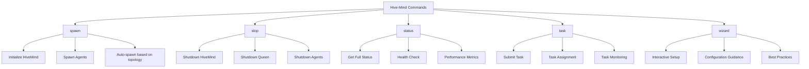

**Diagram sources**
- [swarm-spawn.ts](file://src/cli/commands/swarm-spawn.ts)
- [swarm-stop.ts](file://src/cli/commands/swarm-stop.ts)
- [swarm-status.ts](file://src/cli/commands/swarm-status.ts)
- [swarm-task.ts](file://src/cli/commands/swarm-task.ts)
- [swarm-wizard.ts](file://src/cli/commands/swarm-wizard.ts)

**Section sources**
- [HiveMind.ts](file://src/hive-mind/core/HiveMind.ts)
- [Queen.ts](file://src/hive-mind/core/Queen.ts)
- [Agent.ts](file://src/hive-mind/core/Agent.ts)

## Spawn Command

The spawn command initializes a new Hive-Mind swarm and optionally spawns worker agents according to the specified topology. This command is the entry point for creating a collective intelligence system.

### Implementation Details

The spawn command is implemented in the swarm-spawn.ts file and uses the HiveMind class to create and initialize a new swarm. The command accepts various configuration options that define the swarm's characteristics.

```typescript
// Example from src/cli/commands/swarm-spawn.ts
interface SpawnOptions {
  name: string;
  topology: SwarmTopology;
  queenMode: QueenMode;
  maxAgents: number;
  autoSpawn: boolean;
  consensusThreshold: number;
  memoryTTL: number;
}
```

The spawn process follows these steps:
1. Create a HiveMindConfig object with the specified parameters
2. Instantiate a new HiveMind instance with the configuration
3. Call the initialize() method to set up the swarm and subsystems
4. If autoSpawn is enabled, call autoSpawnAgents() to create initial agents
5. Return the swarm ID for future reference

### Configuration Options

The spawn command supports the following configuration parameters:

**Spawn Configuration Parameters**
- **name**: Name of the swarm (required)
- **topology**: Network topology (hierarchical, mesh, ring, star, specs-driven)
- **queenMode**: Queen coordination mode (centralized, distributed, strategic)
- **maxAgents**: Maximum number of agents in the swarm
- **autoSpawn**: Whether to automatically spawn initial agents
- **consensusThreshold**: Percentage threshold for consensus decisions
- **memoryTTL**: Time-to-live for memory entries in seconds

### Usage Scenarios

The spawn command can be used in various scenarios:

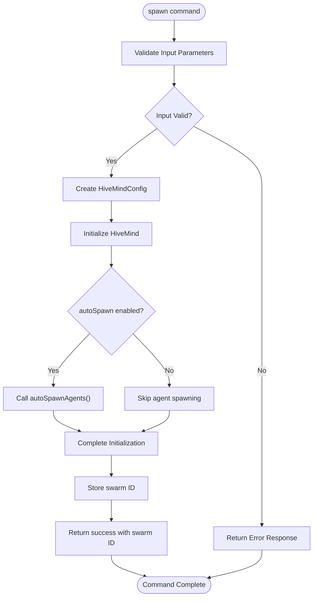

**Diagram sources**
- [HiveMind.ts](file://src/hive-mind/core/HiveMind.ts#L28-L540)
- [swarm-spawn.ts](file://src/cli/commands/swarm-spawn.ts)

**Section sources**
- [HiveMind.ts](file://src/hive-mind/core/HiveMind.ts#L28-L540)
- [swarm-spawn.ts](file://src/cli/commands/swarm-spawn.ts)

## Stop Command

The stop command shuts down a running Hive-Mind swarm, terminating all agents and releasing resources. This command ensures a clean shutdown of the collective intelligence system.

### Implementation Details

The stop command is implemented in the swarm-stop.ts file and uses the HiveMind class's shutdown method to terminate the swarm. The command first loads the existing swarm by its ID and then initiates the shutdown sequence.

```typescript
// Example from src/cli/commands/swarm-stop.ts
async function stopSwarm(swarmId: string): Promise<void> {
  const hiveMind = await HiveMind.load(swarmId);
  await hiveMind.shutdown();
}
```

The shutdown process follows a specific sequence to ensure all components are properly terminated:

1. Set the started flag to false to prevent new operations
2. Shutdown all worker agents through their shutdown() methods
3. Shutdown the Queen agent
4. Shutdown subsystems (memory, communication, orchestrator)
5. Emit a shutdown event to notify listeners

### Invocation Patterns

The stop command can be invoked in several ways:

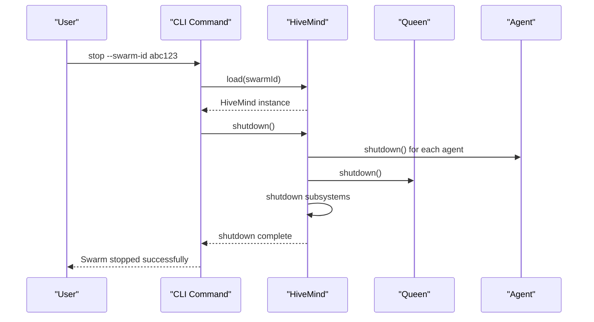

**Diagram sources**
- [HiveMind.ts](file://src/hive-mind/core/HiveMind.ts#L28-L540)
- [swarm-stop.ts](file://src/cli/commands/swarm-stop.ts)

**Section sources**
- [HiveMind.ts](file://src/hive-mind/core/HiveMind.ts#L28-L540)
- [swarm-stop.ts](file://src/cli/commands/swarm-stop.ts)

## Status Command

The status command provides comprehensive information about a running Hive-Mind swarm, including health, performance, and operational metrics. This command is essential for monitoring and troubleshooting swarms.

### Implementation Details

The status command is implemented in the swarm-status.ts file and uses the HiveMind class's getFullStatus method to retrieve detailed information about the swarm.

```typescript
// Example from src/cli/commands/swarm-status.ts
async function getStatus(swarmId: string): Promise<SwarmStatus> {
  const hiveMind = await HiveMind.load(swarmId);
  return await hiveMind.getFullStatus();
}
```

The getFullStatus method collects information from multiple sources:

1. Agent statistics (count, types, status)
2. Task statistics (pending, in-progress, completed)
3. Memory system metrics (hit rate, size, entries)
4. Communication system metrics (throughput, latency)
5. Performance metrics (task completion time, utilization)
6. System warnings and health assessment

### Return Values

The status command returns a comprehensive SwarmStatus object with the following structure:

**SwarmStatus Structure**
- **swarmId**: Unique identifier of the swarm
- **name**: Name of the swarm
- **topology**: Current topology configuration
- **queenMode**: Queen coordination mode
- **health**: Health status (healthy, degraded, critical)
- **uptime**: Duration the swarm has been running
- **agents**: Array of agent information
- **agentsByType**: Count of agents by type
- **tasks**: Array of task information
- **taskStats**: Task statistics (total, pending, completed, etc.)
- **memoryStats**: Memory system statistics
- **communicationStats**: Communication system statistics
- **performance**: Performance metrics
- **warnings**: Array of system warnings

### Usage Examples

The status command can be used to monitor swarm health and identify potential issues:

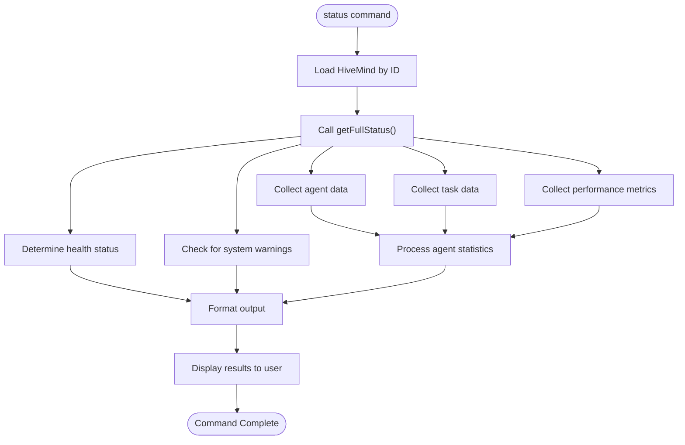

**Diagram sources**
- [HiveMind.ts](file://src/hive-mind/core/HiveMind.ts#L28-L540)
- [swarm-status.ts](file://src/cli/commands/swarm-status.ts)

**Section sources**
- [HiveMind.ts](file://src/hive-mind/core/HiveMind.ts#L28-L540)
- [swarm-status.ts](file://src/cli/commands/swarm-status.ts)

## Task Command

The task command enables users to submit, manage, and monitor tasks within a Hive-Mind swarm. This command is central to the swarm's functionality, as it drives the collective intelligence system's work.

### Implementation Details

The task command is implemented in the swarm-task.ts file and provides several sub-commands for task management:

- **submit**: Submit a new task to the swarm
- **cancel**: Cancel a running task
- **retry**: Retry a failed task
- **list**: List all tasks in the swarm
- **get**: Get details of a specific task

The task submission process involves the following steps:

1. Create a Task object with the specified parameters
2. Store the task in the database with status "pending"
3. Submit the task to the SwarmOrchestrator
4. Notify the Queen agent of the task submission
5. The Queen analyzes the task and makes a strategic decision
6. The task is assigned to appropriate agents based on capabilities

```typescript
// Example from src/cli/commands/swarm-task.ts
interface TaskSubmitOptions {
  description: string;
  priority: TaskPriority;
  strategy: TaskStrategy;
  dependencies?: string[];
  requireConsensus?: boolean;
  maxAgents?: number;
  requiredCapabilities?: AgentCapability[];
  metadata?: any;
}
```

### Task Lifecycle

The task command manages the complete lifecycle of tasks within the swarm:

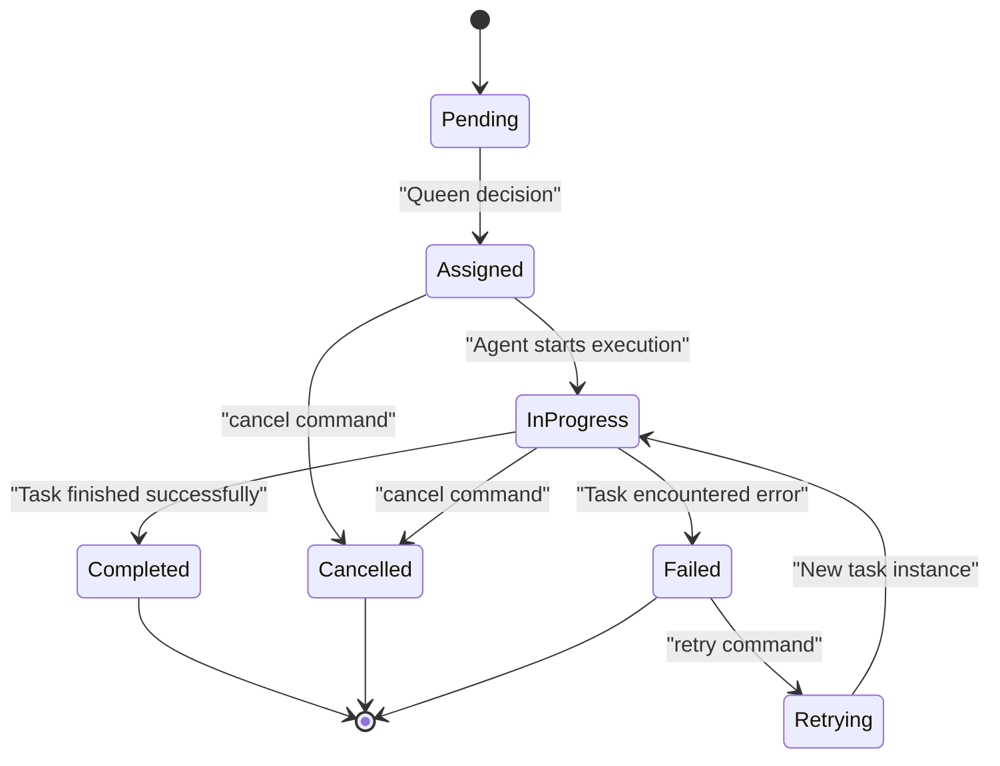

**Diagram sources**
- [HiveMind.ts](file://src/hive-mind/core/HiveMind.ts#L28-L540)
- [Queen.ts](file://src/hive-mind/core/Queen.ts#L28-L773)
- [swarm-task.ts](file://src/cli/commands/swarm-task.ts)

**Section sources**
- [HiveMind.ts](file://src/hive-mind/core/HiveMind.ts#L28-L540)
- [Queen.ts](file://src/hive-mind/core/Queen.ts#L28-L773)
- [swarm-task.ts](file://src/cli/commands/swarm-task.ts)

## Wizard Command

The wizard command provides an interactive interface for setting up and configuring Hive-Mind swarms. This command guides users through the configuration process, offering recommendations and best practices.

### Implementation Details

The wizard command is implemented in the swarm-wizard.ts file and uses an interactive prompt system to gather configuration information from the user. The command asks a series of questions to determine the optimal configuration for the user's needs.

The wizard follows these steps:

1. Determine the use case (research, development, analysis, etc.)
2. Recommend appropriate topology based on use case
3. Suggest Queen mode based on coordination needs
4. Calculate optimal agent count and types
5. Set consensus threshold based on decision criticality
6. Configure memory settings based on data requirements
7. Generate a configuration file or directly create the swarm

### Interactive Flow

The wizard command provides a guided experience for users:

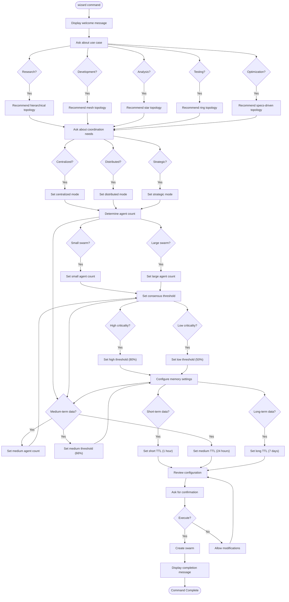

**Diagram sources**
- [swarm-wizard.ts](file://src/cli/commands/swarm-wizard.ts)

**Section sources**
- [swarm-wizard.ts](file://src/cli/commands/swarm-wizard.ts)

## Swarm Lifecycle Management

The Hive-Mind commands work together to manage the complete lifecycle of a swarm, from creation to termination. Understanding this lifecycle is crucial for effective swarm orchestration.

### Initialization Process

The initialization process begins with the spawn command and involves several key steps:

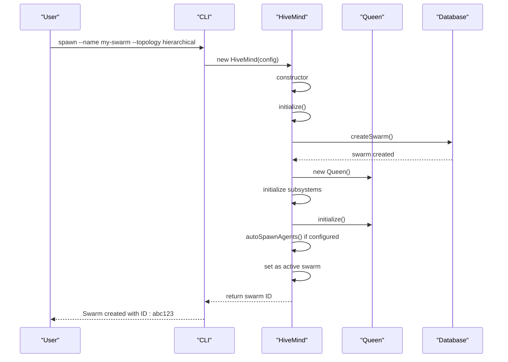

**Diagram sources**
- [HiveMind.ts](file://src/hive-mind/core/HiveMind.ts#L28-L540)

**Section sources**
- [HiveMind.ts](file://src/hive-mind/core/HiveMind.ts#L28-L540)

### Agent Coordination

Once initialized, the Queen agent coordinates worker agents through a continuous process:

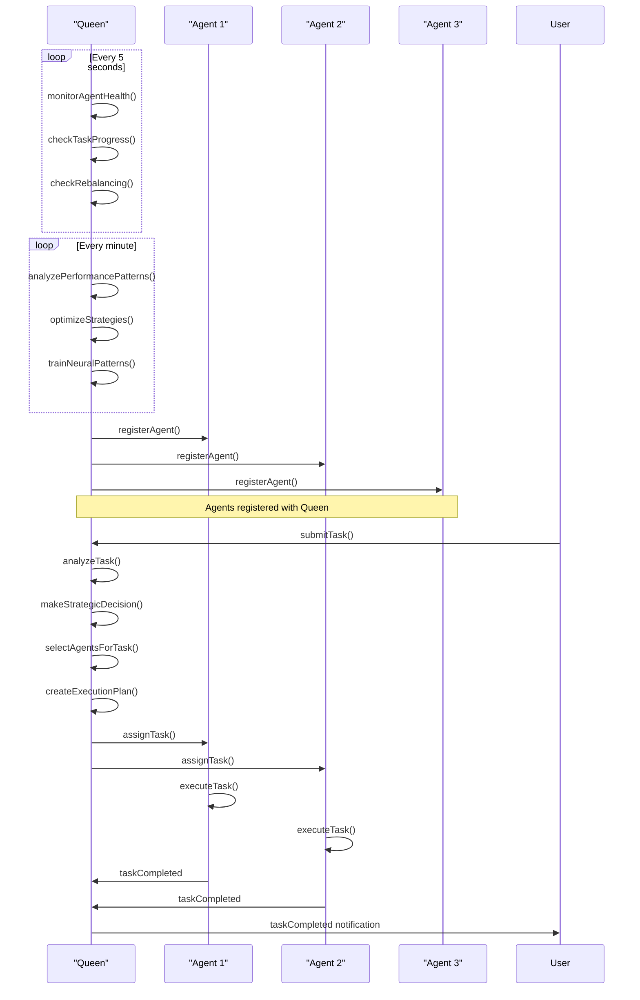

**Diagram sources**
- [Queen.ts](file://src/hive-mind/core/Queen.ts#L28-L773)
- [Agent.ts](file://src/hive-mind/core/Agent.ts#L21-L673)

**Section sources**
- [Queen.ts](file://src/hive-mind/core/Queen.ts#L28-L773)
- [Agent.ts](file://src/hive-mind/core/Agent.ts#L21-L673)

## Error Handling and Troubleshooting

The Hive-Mind system includes comprehensive error handling and troubleshooting capabilities to address common issues that may arise during swarm operation.

### Common Issues and Solutions

**Initialization Failures**
- **Issue**: Database connection failure during initialization
- **Solution**: Verify database configuration and connectivity
- **Code Reference**: HiveMind.initialize() method handles database errors with try-catch

**Task Timeouts**
- **Issue**: Tasks not completing within expected timeframe
- **Solution**: Implement stalled task detection and reassignment
- **Code Reference**: Queen.checkTaskProgress() and isTaskStalled() methods

**Coordination Errors**
- **Issue**: Consensus not achieved for critical decisions
- **Solution**: Adjust consensus threshold or implement fallback strategies
- **Code Reference**: ConsensusEngine class and Queen.initiateConsensus() method

### Error Handling Patterns

The system uses several error handling patterns:

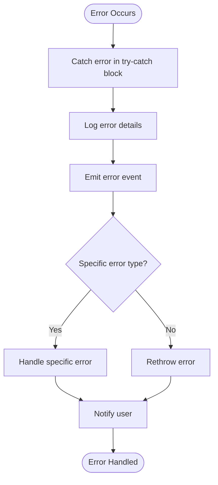

**Diagram sources**
- [HiveMind.ts](file://src/hive-mind/core/HiveMind.ts#L28-L540)
- [Queen.ts](file://src/hive-mind/core/Queen.ts#L28-L773)
- [Agent.ts](file://src/hive-mind/core/Agent.ts#L21-L673)

**Section sources**
- [HiveMind.ts](file://src/hive-mind/core/HiveMind.ts#L28-L540)
- [Queen.ts](file://src/hive-mind/core/Queen.ts#L28-L773)
- [Agent.ts](file://src/hive-mind/core/Agent.ts#L21-L673)

## Performance Considerations

The Hive-Mind system is designed with performance in mind, using various optimization techniques to ensure efficient operation.

### Performance Metrics

The system tracks several key performance metrics:

**Performance Metrics**
- **avgTaskCompletion**: Average time to complete tasks in milliseconds
- **messageThroughput**: Number of messages processed per second
- **consensusSuccessRate**: Percentage of successful consensus decisions
- **memoryHitRate**: Cache hit rate for memory operations
- **agentUtilization**: Percentage of agents actively working

These metrics are calculated in the HiveMind.calculatePerformanceMetrics() method and used to assess swarm health and efficiency.

### Optimization Strategies

The system employs several optimization strategies:

1. **Agent Selection**: The Queen uses a scoring system to select the most suitable agents for tasks based on capabilities, workload, and historical performance.

2. **Strategy Adaptation**: The Queen continuously analyzes performance patterns and adjusts coordination strategies accordingly.

3. **Resource Management**: Agents manage their own resources and communicate progress to prevent bottlenecks.

4. **Learning Loop**: Agents learn from task execution and update their capabilities over time.

5. **Rebalancing**: The system automatically detects when rebalancing is needed and triggers the process.

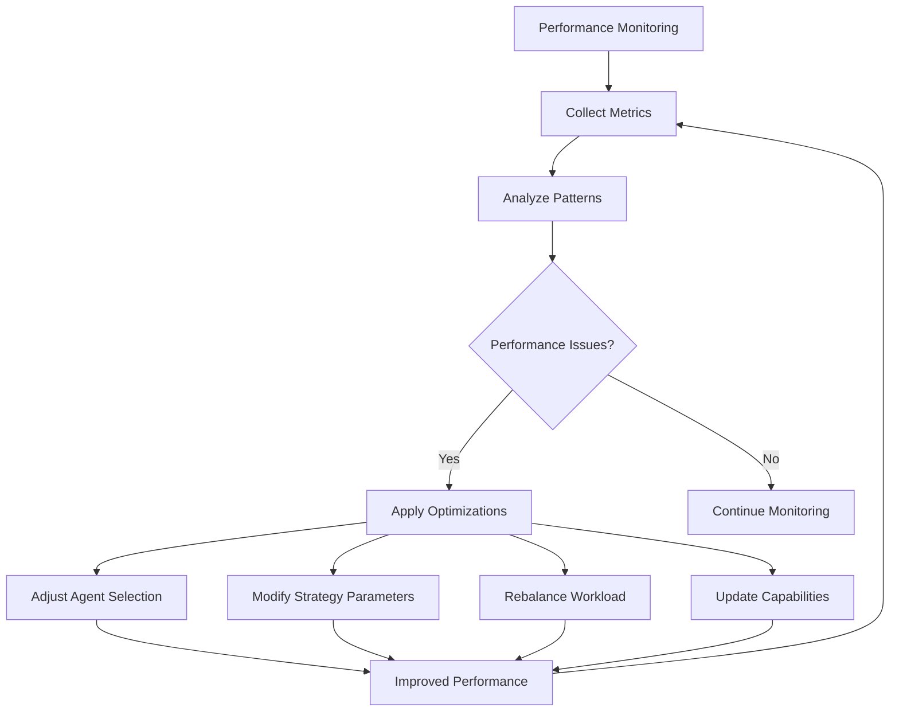

**Diagram sources**
- [HiveMind.ts](file://src/hive-mind/core/HiveMind.ts#L28-L540)
- [Queen.ts](file://src/hive-mind/core/Queen.ts#L28-L773)

**Section sources**
- [HiveMind.ts](file://src/hive-mind/core/HiveMind.ts#L28-L540)
- [Queen.ts](file://src/hive-mind/core/Queen.ts#L28-L773)

## Conclusion

The Hive-Mind Commands sub-feature provides a powerful interface for managing collective intelligence swarms in the Agentic-Flow system. Through the spawn, stop, status, task, and wizard commands, users can create, control, monitor, and interact with swarms of AI agents that work together to solve complex tasks.

The system is built on a robust architecture with a Queen agent that coordinates worker agents in various topologies. The domain model defines clear relationships between swarms, agents, tasks, and coordination mechanisms, enabling sophisticated collective intelligence operations.

Key features of the system include:
- Flexible topology configurations (hierarchical, mesh, ring, star, specs-driven)
- Intelligent task assignment based on agent capabilities and workload
- Consensus-based decision making for critical operations
- Comprehensive monitoring and status reporting
- Interactive wizard for guided setup and configuration
- Robust error handling and troubleshooting capabilities
- Performance optimization through continuous learning and adaptation

The commands are designed to be accessible to users with limited technical knowledge while providing sufficient depth for experienced developers. The system's modular design and clear interfaces make it easy to extend and customize for specific use cases.

By understanding the implementation details, invocation patterns, and interactions between components, users can effectively leverage the Hive-Mind system to solve complex problems through coordinated AI agent collaboration.