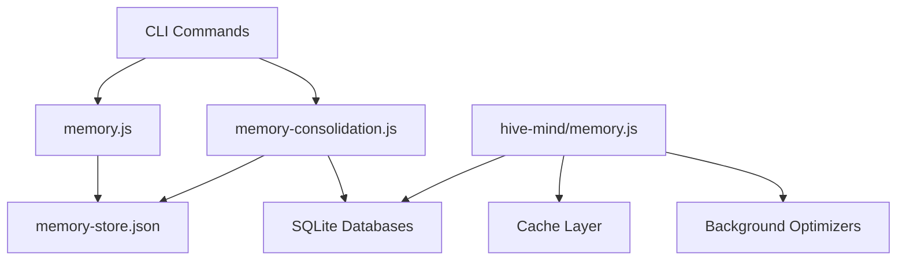
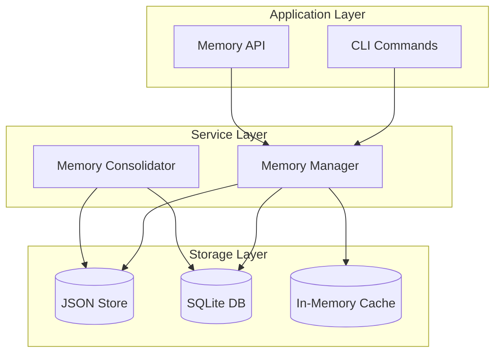
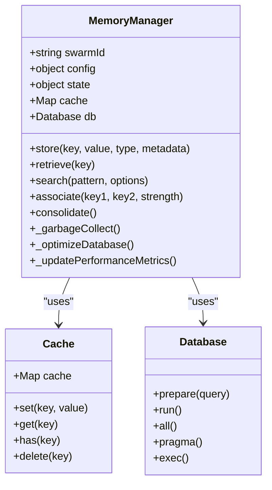
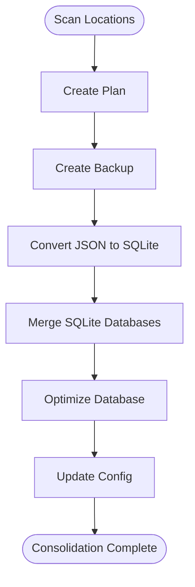
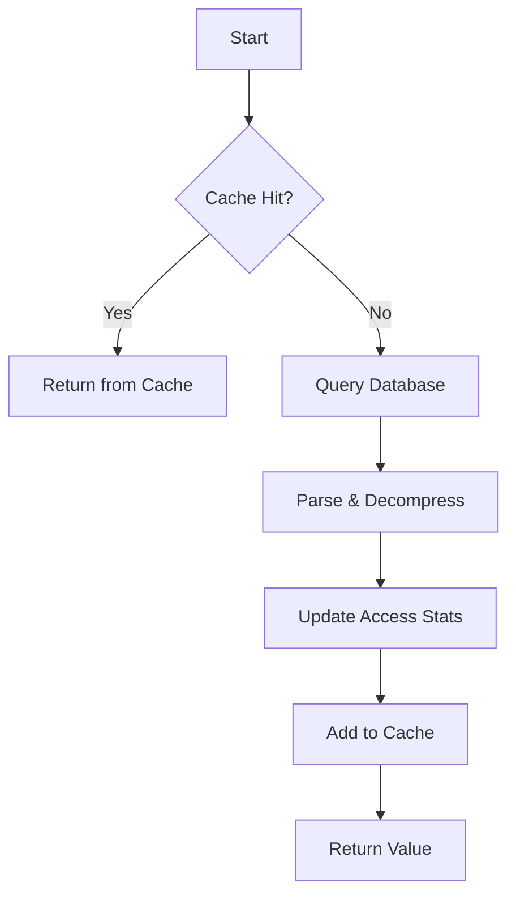

# Memory Commands

<cite>
**Referenced Files in This Document**   
- [memory.js](file://src/cli/simple-commands/hive-mind/memory.js#L400-L1292)
- [memory-store.json](file://memory/memory-store.json#L0-L531)
- [memory-consolidation.js](file://src/cli/simple-commands/memory-consolidation.js#L0-L631)
- [memory.js](file://src/cli/simple-commands/memory.js#L0-L345)
</cite>

## Table of Contents
1. [Introduction](#introduction)  
2. [Project Structure](#project-structure)  
3. [Core Components](#core-components)  
4. [Architecture Overview](#architecture-overview)  
5. [Detailed Component Analysis](#detailed-component-analysis)  
6. [Memory Command Usage and Interfaces](#memory-command-usage-and-interfaces)  
7. [Persistence and Storage Backends](#persistence-and-storage-backends)  
8. [Configuration and Parameters](#configuration-and-parameters)  
9. [Performance and Optimization](#performance-and-optimization)  
10. [Troubleshooting and Common Issues](#troubleshooting-and-common-issues)  
11. [Conclusion](#conclusion)

## Introduction
The **Memory Commands** sub-feature provides a comprehensive system for storing, retrieving, and managing data across agentic workflows in the `claude-flow` framework. It supports both short-term and long-term memory patterns, enabling cross-session persistence, knowledge retention, and intelligent data association. This document details the implementation, usage, architecture, and optimization strategies of the memory system, focusing on the SQLite and JSON-based backends, command interfaces, and collective memory management.

The system is designed to support multi-agent coordination, workflow state tracking, and historical data retention, with features such as TTL-based expiration, garbage collection, caching, and consolidation across multiple storage formats.

## Project Structure
The memory system spans multiple directories and file types, reflecting a hybrid persistence strategy:

```
.
├── memory/
│   └── memory-store.json          # Primary JSON-based memory store
├── src/cli/simple-commands/
│   ├── memory.js                  # CLI memory commands (JSON backend)
│   ├── hive-mind/memory.js        # Advanced memory manager (SQLite backend)
│   └── memory-consolidation.js    # Tool for unifying memory stores
└── swarm-memory/
    └── state.json                 # Swarm-specific state storage
```

The system uses both flat JSON files for simplicity and SQLite databases for scalability and query performance. The `memory-consolidation.js` utility enables migration and unification of disparate memory stores into a centralized SQLite database.



**Diagram sources**  
- [memory.js](file://src/cli/simple-commands/memory.js#L0-L345)  
- [memory-consolidation.js](file://src/cli/simple-commands/memory-consolidation.js#L0-L631)  
- [hive-mind/memory.js](file://src/cli/simple-commands/hive-mind/memory.js#L400-L1292)

## Core Components
The memory system consists of three primary components:

1. **CLI Memory Commands** – Simple key-value operations using JSON storage.
2. **Hive-Mind Memory Manager** – Advanced memory system with SQLite, caching, TTL, and optimization.
3. **Memory Consolidator** – Utility for unifying multiple memory stores into a single SQLite database.

These components work together to provide a flexible, scalable, and persistent memory layer for agentic workflows.

**Section sources**  
- [memory.js](file://src/cli/simple-commands/memory.js#L0-L345)  
- [hive-mind/memory.js](file://src/cli/simple-commands/hive-mind/memory.js#L400-L1292)  
- [memory-consolidation.js](file://src/cli/simple-commands/memory-consolidation.js#L0-L631)

## Architecture Overview
The memory architecture follows a layered design:



The **Hive-Mind Memory Manager** acts as the central service, handling all CRUD operations, background optimization, and cross-store consistency. It uses SQLite as the primary backend for structured queries and performance, while maintaining backward compatibility with JSON-based stores.

**Diagram sources**  
- [hive-mind/memory.js](file://src/cli/simple-commands/hive-mind/memory.js#L400-L1292)  
- [memory-consolidation.js](file://src/cli/simple-commands/memory-consolidation.js#L0-L631)

## Detailed Component Analysis

### Hive-Mind Memory Manager
The `hive-mind/memory.js` file implements a robust memory system with SQLite backend, caching, and background optimization.

#### Key Features:
- **Store/Retrieve**: Full CRUD operations with JSON serialization.
- **Search & Query**: Pattern-based search with filtering by type and confidence.
- **Association**: Bidirectional memory linking via `associate()` method.
- **Consolidation**: Automatic merging of similar memories.
- **Garbage Collection**: TTL-based cleanup and LRU eviction.
- **Performance Monitoring**: Real-time metrics and cache hit tracking.



**Diagram sources**  
- [hive-mind/memory.js](file://src/cli/simple-commands/hive-mind/memory.js#L400-L1292)

### Memory Consolidation System
The `memory-consolidation.js` utility enables migration from multiple JSON and SQLite stores into a unified SQLite database.

#### Workflow:
1. **Scan** – Discover all memory stores.
2. **Plan** – Generate a migration strategy.
3. **Backup** – Preserve original data.
4. **Convert** – Transform JSON to SQLite.
5. **Merge** – Combine SQLite databases.
6. **Optimize** – Index and vacuum the database.



**Diagram sources**  
- [memory-consolidation.js](file://src/cli/simple-commands/memory-consolidation.js#L0-L631)

## Memory Command Usage and Interfaces

### Basic Memory Operations
The CLI provides simple commands for memory management:

```bash
# Store a value
memory store research_summary "LLMs show 22% accuracy improvement in 2025"

# Query by keyword
memory query "accuracy improvement"

# Show statistics
memory stats

# Export to file
memory export backup-2025.json

# Import from file
memory import project-data.json

# Clear a namespace
memory clear --namespace temp
```

### Advanced Memory Operations
Using the Hive-Mind interface:

```javascript
// Store with metadata
await memory.store('model:sota', {
  llm: 'GPT-4o',
  cv: 'Vision Transformers',
  nlp: 'BERT-Large'
}, 'knowledge', { confidence: 0.95 });

// Retrieve
const sota = await memory.retrieve('model:sota');

// Search
const results = await memory.search('transformer', { type: 'knowledge' });

// Associate memories
await memory.associate('model:sota', 'research:2025');

// Get related memories
const related = await memory.getRelated('model:sota');
```

**Section sources**  
- [memory.js](file://src/cli/simple-commands/memory.js#L0-L345)  
- [hive-mind/memory.js](file://src/cli/simple-commands/hive-mind/memory.js#L400-L1292)

## Persistence and Storage Backends

### JSON Backend
The default `memory-store.json` file stores data in a namespace-based structure:

```json
{
  "default": [
    {
      "key": "agent/search_agent/sota_models_2025",
      "value": "{\"llms\":{\"gpt4o\":\"multimodal...\"}}",
      "namespace": "default",
      "timestamp": 1754339309863
    }
  ]
}
```

Used for simple, human-readable storage and backward compatibility.

### SQLite Backend
The Hive-Mind system uses SQLite for structured, high-performance storage:

```sql
CREATE TABLE collective_memory (
  id TEXT PRIMARY KEY,
  swarm_id TEXT,
  key TEXT NOT NULL,
  value TEXT NOT NULL,
  type TEXT,
  confidence REAL,
  created_by TEXT,
  accessed_at TIMESTAMP,
  access_count INTEGER,
  compressed INTEGER,
  size INTEGER,
  UNIQUE(swarm_id, key)
);
```

Supports indexing, complex queries, and transactional integrity.

**Section sources**  
- [memory-store.json](file://memory/memory-store.json#L0-L531)  
- [hive-mind/memory.js](file://src/cli/simple-commands/hive-mind/memory.js#L400-L1292)

## Configuration and Parameters
The memory system is highly configurable via the `config` object:

```javascript
config: {
  swarmId: 'swarm-123',
  maxSize: 100, // MB
  gcInterval: 60000, // 1 minute
  compressionThreshold: 1024, // bytes
  enablePooling: true,
  enableAsyncOperations: true
}
```

### Memory Types and TTL
Different memory types have configurable TTL and compression:

```javascript
const MEMORY_TYPES = {
  knowledge: { ttl: 86400000, compress: true },     // 24 hours
  result: { ttl: 43200000, compress: true },        // 12 hours
  system: { ttl: null, compress: false },           // Persistent
  cache: { ttl: 300000, compress: true }            // 5 minutes
};
```

Namespaces allow logical separation of memory domains (e.g., `sparc`, `research`, `temp`).

**Section sources**  
- [hive-mind/memory.js](file://src/cli/simple-commands/hive-mind/memory.js#L400-L1292)

## Performance and Optimization

### Background Optimizers
The system runs periodic maintenance tasks:

```javascript
_startOptimizationTimers() {
  this.gcTimer = setInterval(() => this._garbageCollect(), this.config.gcInterval);
  this.optimizeTimer = setInterval(() => this._optimizeDatabase(), 1800000); // 30 min
  this.cacheTimer = setInterval(() => this._optimizeCache(), 60000); // 1 min
  this.metricsTimer = setInterval(() => this._updatePerformanceMetrics(), 30000); // 30 sec
}
```

### Caching Strategy
An in-memory LRU cache improves read performance:

```javascript
// Check cache first
if (this.cache.has(key)) {
  return this.cache.get(key).value;
}
```

Cache entries expire after 5 minutes of inactivity.

### Memory Efficiency
The system monitors:
- Cache hit rate
- Memory utilization
- Query performance
- Compression ratio

And provides health checks:

```javascript
const health = await memory.healthCheck();
// { status: 'healthy', issues: [], recommendations: [] }
```



**Diagram sources**  
- [hive-mind/memory.js](file://src/cli/simple-commands/hive-mind/memory.js#L400-L1292)

## Troubleshooting and Common Issues

### Memory Corruption
**Symptoms**: JSON parse errors, database lock issues.  
**Solution**: Use `memory-consolidate` to rebuild from backups.

### Storage Limits
**Symptoms**: `Memory limit exceeded` errors.  
**Solution**: Increase `maxSize` or run garbage collection:
```bash
memory-consolidate execute --force
```

### Performance Degradation
**Symptoms**: Slow queries, high CPU usage.  
**Solutions**:
- Run `ANALYZE` and `VACUUM` on SQLite
- Increase cache size
- Add indexes on frequently queried keys

### Cross-Session Persistence
To ensure data persists across sessions:
1. Use the Hive-Mind memory manager (SQLite)
2. Avoid ephemeral namespaces
3. Regularly export backups:
```bash
memory export session-backup-$(date +%s).json
```

**Section sources**  
- [hive-mind/memory.js](file://src/cli/simple-commands/hive-mind/memory.js#L400-L1292)  
- [memory-consolidation.js](file://src/cli/simple-commands/memory-consolidation.js#L0-L631)

## Conclusion
The Memory Commands system provides a robust, scalable solution for persistent data storage in agentic workflows. It supports both simple JSON-based operations and advanced SQLite-backed memory management with caching, TTL, and optimization. The architecture enables cross-session persistence, intelligent consolidation, and high-performance querying, making it suitable for complex multi-agent systems. By leveraging both CLI commands and programmatic interfaces, developers can effectively manage knowledge, state, and historical data across diverse use cases.