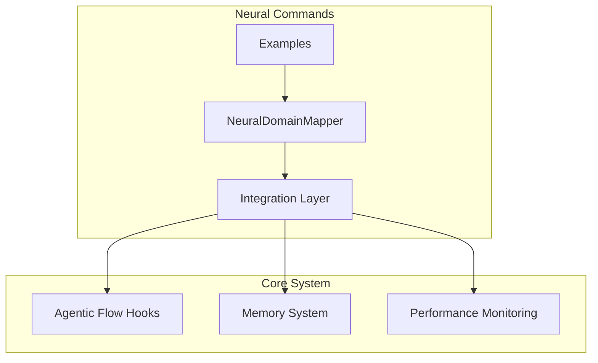
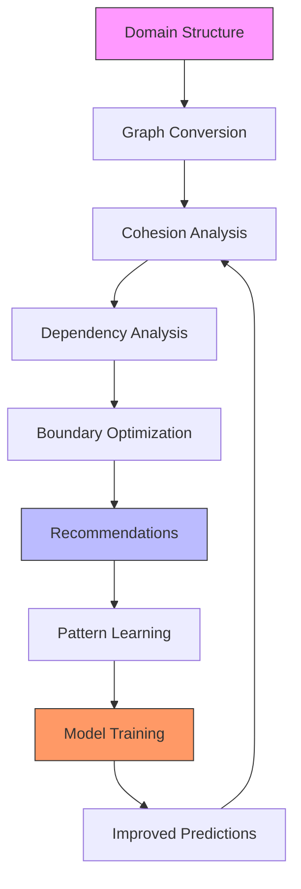
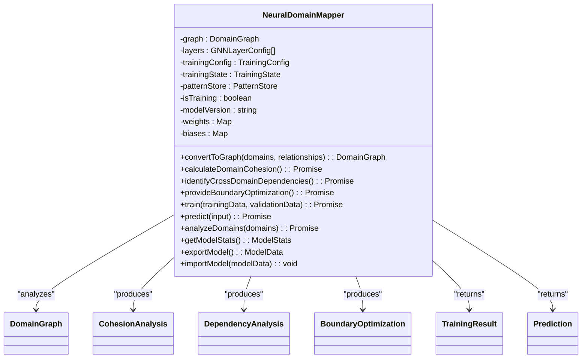
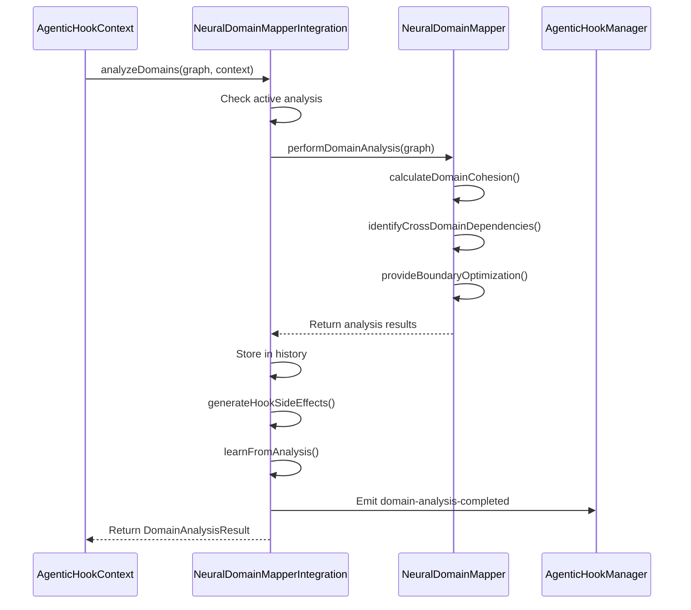
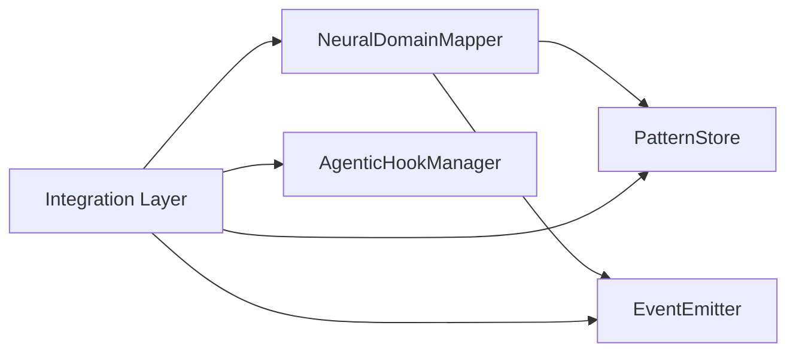

# Neural Commands

<cite>
**Referenced Files in This Document**   
- [NeuralDomainMapper.ts](file://src/neural/NeuralDomainMapper.ts)
- [integration.ts](file://src/neural/integration.ts)
- [examples.md](file://src/neural/examples.md)
</cite>

## Table of Contents
1. [Introduction](#introduction)
2. [Project Structure](#project-structure)
3. [Core Components](#core-components)
4. [Architecture Overview](#architecture-overview)
5. [Detailed Component Analysis](#detailed-component-analysis)
6. [Dependency Analysis](#dependency-analysis)
7. [Performance Considerations](#performance-considerations)
8. [Troubleshooting Guide](#troubleshooting-guide)
9. [Conclusion](#conclusion)

## Introduction

The Neural Commands sub-feature in the Claude Flow system enables advanced domain relationship analysis and architectural optimization through a Graph Neural Network (GNN)-based approach. This documentation provides a comprehensive overview of the neural command system, focusing on the NeuralDomainMapper class and its integration with the broader orchestration framework.

The system is designed to analyze domain structures, calculate cohesion scores, identify cross-domain dependencies, and provide predictive boundary optimization suggestions. It leverages cognitive computing capabilities and adaptive learning to continuously improve its recommendations based on observed patterns and historical data.

## Project Structure

The neural command functionality is organized within the `src/neural` directory, which contains the core implementation files and supporting documentation. The key components include:

- **NeuralDomainMapper.ts**: The main implementation of the GNN-based domain analysis system
- **integration.ts**: Integration layer connecting the neural mapper with the Claude Flow hooks system
- **examples.md**: Comprehensive usage examples and implementation patterns

The neural command system is designed to work seamlessly with the broader Claude Flow architecture, particularly the agentic-flow-hooks service, enabling event-driven analysis and optimization workflows.



**Diagram sources**
- [NeuralDomainMapper.ts](file://src/neural/NeuralDomainMapper.ts)
- [integration.ts](file://src/neural/integration.ts)

**Section sources**
- [NeuralDomainMapper.ts](file://src/neural/NeuralDomainMapper.ts)
- [integration.ts](file://src/neural/integration.ts)
- [examples.md](file://src/neural/examples.md)

## Core Components

The Neural Commands system consists of two primary components: the NeuralDomainMapper class and the integration layer that connects it to the broader Claude Flow ecosystem.

The **NeuralDomainMapper** class implements a sophisticated GNN architecture for analyzing domain relationships. It provides capabilities for:
- Converting domain structures to graph representations
- Calculating domain cohesion scores using multiple metrics
- Identifying and analyzing cross-domain dependencies
- Providing predictive boundary optimization suggestions
- Training on domain relationship patterns
- Making inferences about optimal domain organization

The **integration layer** connects the NeuralDomainMapper with the existing neural hooks system, enabling seamless domain analysis and optimization within the broader orchestration framework. It automatically analyzes domain structures, generates optimization suggestions, and learns from domain relationship patterns.

**Section sources**
- [NeuralDomainMapper.ts](file://src/neural/NeuralDomainMapper.ts#L1-L50)
- [integration.ts](file://src/neural/integration.ts#L1-L30)

## Architecture Overview

The Neural Commands system follows a layered architecture that combines graph neural network principles with event-driven integration patterns. The system processes domain structures through a series of analytical stages, each building upon the previous results to provide comprehensive insights and optimization suggestions.



**Diagram sources**
- [NeuralDomainMapper.ts](file://src/neural/NeuralDomainMapper.ts#L1-L1678)
- [integration.ts](file://src/neural/integration.ts#L1-L826)

## Detailed Component Analysis

### NeuralDomainMapper Analysis

The NeuralDomainMapper class is the core component of the neural command system, implementing a Graph Neural Network (GNN) architecture for domain relationship analysis. The class extends EventEmitter, enabling event-driven interactions with other system components.

#### Class Structure


**Diagram sources**
- [NeuralDomainMapper.ts](file://src/neural/NeuralDomainMapper.ts#L1-L1678)

**Section sources**
- [NeuralDomainMapper.ts](file://src/neural/NeuralDomainMapper.ts#L1-L1678)

### Integration Layer Analysis

The integration layer connects the NeuralDomainMapper with the Claude Flow neural hooks system, enabling seamless domain analysis and optimization within the broader orchestration framework.

#### Sequence Diagram


**Diagram sources**
- [integration.ts](file://src/neural/integration.ts#L129-L168)

**Section sources**
- [integration.ts](file://src/neural/integration.ts#L1-L826)

## Dependency Analysis

The Neural Commands system has a well-defined dependency structure that enables modular integration with the broader Claude Flow ecosystem. The core dependencies include:

- **Agentic Flow Hooks**: Provides the event system and pattern storage capabilities
- **Memory System**: Stores analysis results and learned patterns
- **Performance Monitoring**: Tracks analysis metrics and optimization impacts

The system follows a dependency inversion principle, with the integration layer depending on abstractions rather than concrete implementations. This allows for flexible configuration and testing.



**Diagram sources**
- [NeuralDomainMapper.ts](file://src/neural/NeuralDomainMapper.ts)
- [integration.ts](file://src/neural/integration.ts)

**Section sources**
- [NeuralDomainMapper.ts](file://src/neural/NeuralDomainMapper.ts)
- [integration.ts](file://src/neural/integration.ts)

## Performance Considerations

The Neural Commands system is designed with performance in mind, implementing several optimization strategies:

1. **Asynchronous Processing**: All analysis methods return promises, allowing non-blocking execution
2. **Batch Operations**: Training data is processed in batches to improve efficiency
3. **Caching**: Analysis results are stored in memory to avoid redundant calculations
4. **Early Stopping**: Training can be terminated early if improvements plateau
5. **Model Export/Import**: Allows pre-trained models to be loaded quickly

The system also provides comprehensive performance monitoring through the getModelStats() method, which returns information about graph size, training state, and cohesion scores.

For large domain graphs, the system can be configured with appropriate batch sizes and learning rates to balance accuracy and processing time. The integration layer also implements request deduplication by tracking active analyses with correlation IDs.

## Troubleshooting Guide

### Common Issues and Solutions

**Section sources**
- [NeuralDomainMapper.ts](file://src/neural/NeuralDomainMapper.ts)
- [integration.ts](file://src/neural/integration.ts)

#### Training Failures
**Issue**: Training fails with "Training already in progress" error
**Solution**: Ensure only one training session runs at a time. Check the isTraining property before starting training.

```typescript
if (!mapper.isTraining) {
  await mapper.train(trainingData);
}
```

#### Prediction Inaccuracies
**Issue**: Predictions have low confidence scores
**Solution**: 
1. Verify the model has been properly trained on relevant data
2. Check that input features are properly normalized
3. Consider retraining with additional training examples

#### Model Overfitting
**Issue**: Model performs well on training data but poorly on new data
**Solution**:
1. Increase regularization parameters (l1, l2, dropout)
2. Reduce model complexity by simplifying the layer configuration
3. Use early stopping to prevent over-optimization on training data
4. Increase the validation split ratio

```typescript
const config = {
  regularization: {
    l1: 0.001,
    l2: 0.001,
    dropout: 0.2
  },
  earlyStoping: {
    enabled: true,
    patience: 5,
    minDelta: 0.005
  },
  validationSplit: 0.3
};
```

#### Circular Dependencies
**Issue**: System identifies problematic circular dependencies in domain structure
**Solution**:
1. Implement abstraction layers to break direct dependencies
2. Use message queues or event-driven communication
3. Restructure domains to follow dependency inversion principles

The system provides specific optimization suggestions through the provideBoundaryOptimization() method, which can guide refactoring efforts.

## Conclusion

The Neural Commands system provides a powerful foundation for understanding and optimizing domain relationships in complex systems. By leveraging Graph Neural Network principles, the system enables data-driven architecture decisions that improve system maintainability and performance.

Key strengths of the system include:
- Comprehensive domain analysis through multiple metrics (cohesion, dependencies, optimization)
- Adaptive learning capabilities that improve over time
- Seamless integration with the broader Claude Flow ecosystem
- Flexible configuration options for different use cases

The system is particularly valuable for large-scale applications where domain boundaries can become blurred over time. By providing objective metrics and actionable recommendations, it helps teams maintain clean architectural boundaries and avoid common pitfalls like circular dependencies and low cohesion.

Future enhancements could include support for ensemble models, explainable AI features to provide clearer rationale for recommendations, and enhanced visualization capabilities to help teams understand the suggested optimizations.