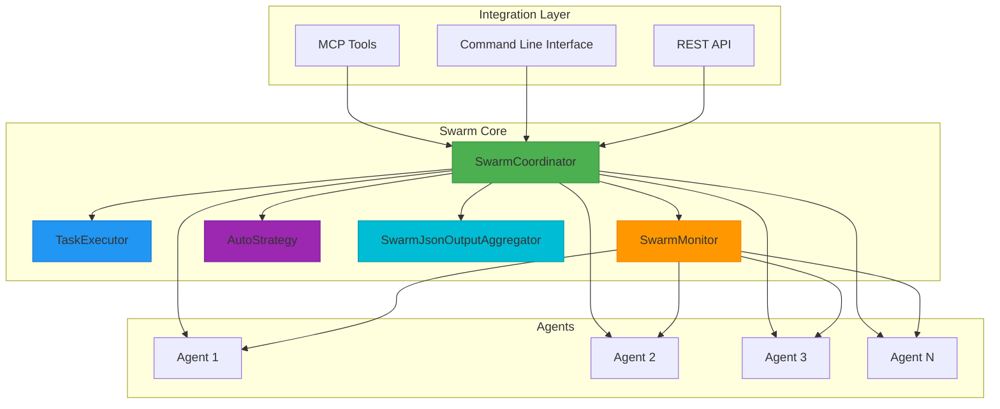
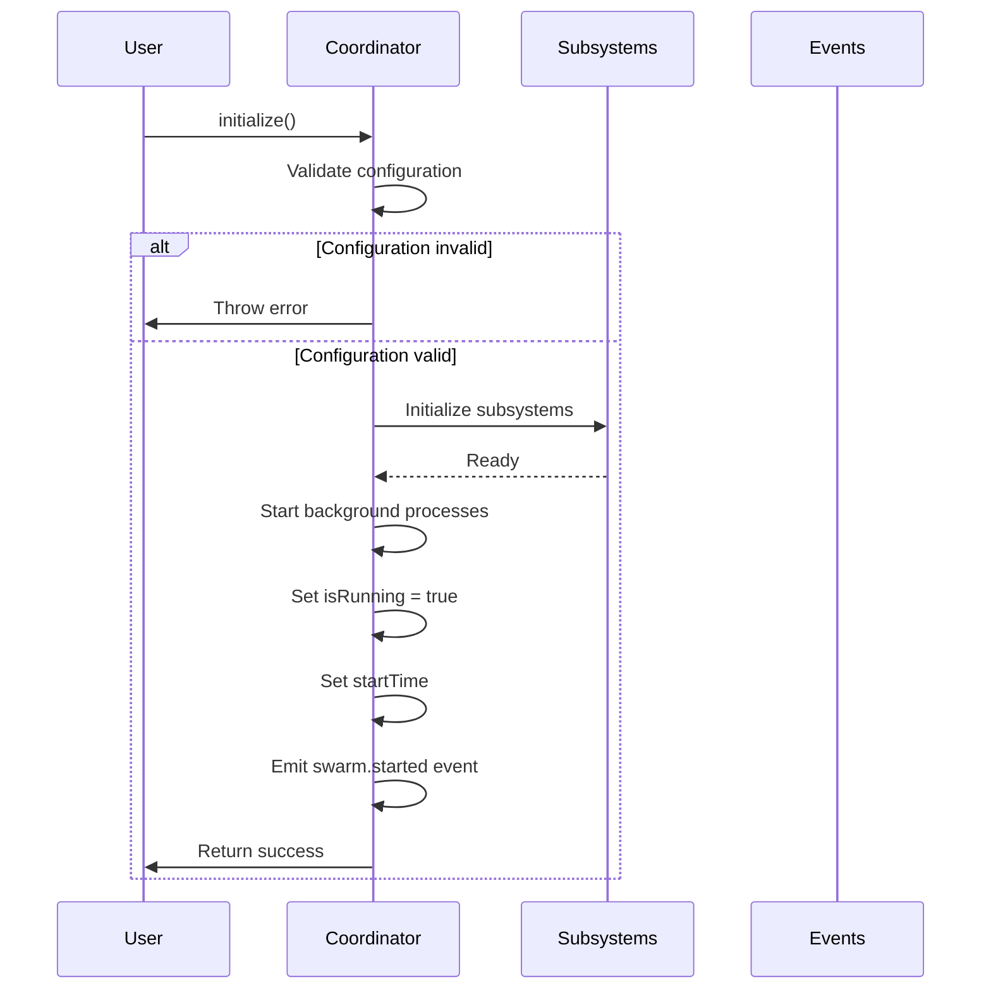
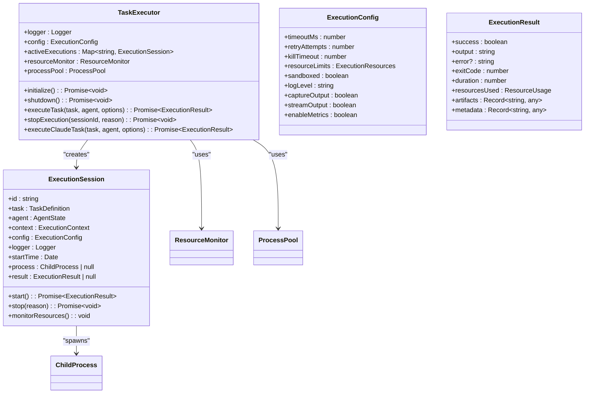
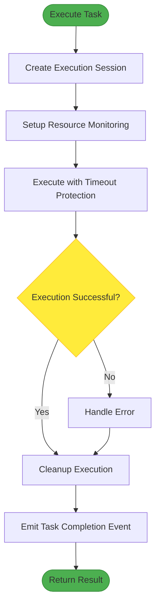
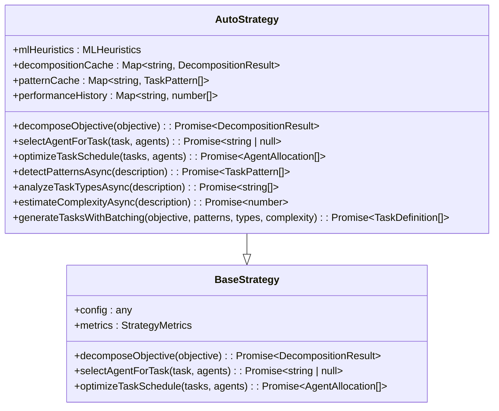
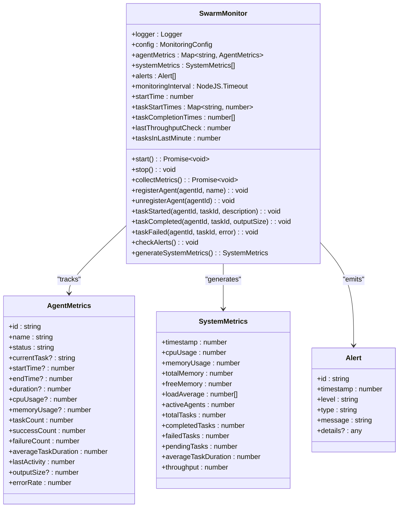
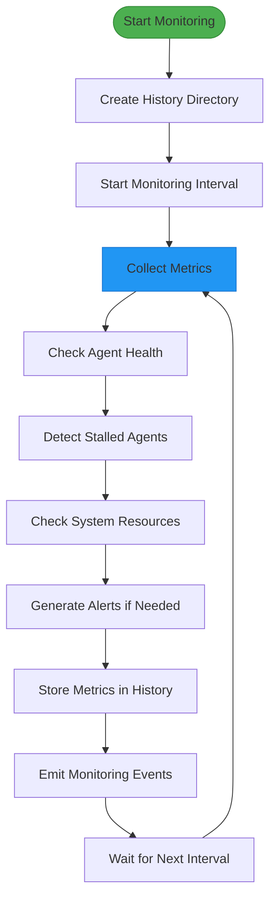
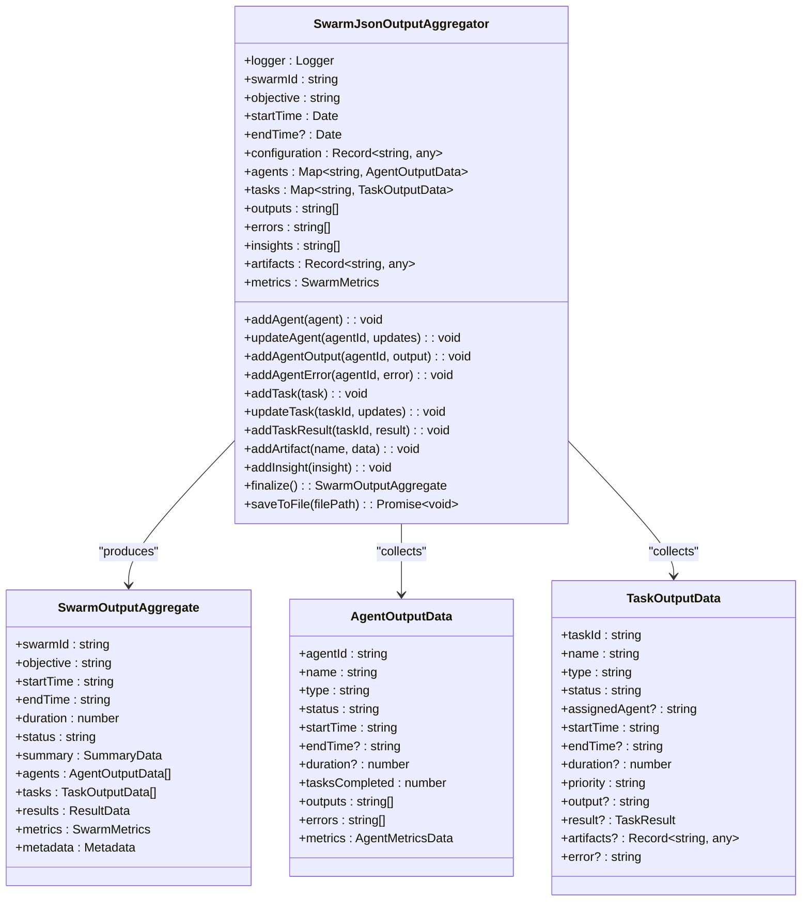
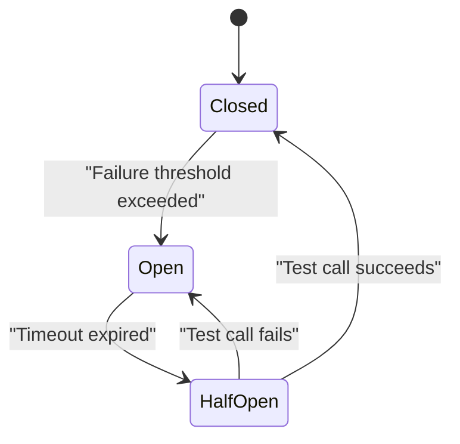

# Swarm Commands

<cite>
**Referenced Files in This Document**   
- [src/swarm/coordinator.ts](file://src/swarm/coordinator.ts)
- [src/mcp/swarm-tools.ts](file://src/mcp/swarm-tools.ts)
- [src/swarm/types.ts](file://src/swarm/types.ts)
- [src/swarm/executor.ts](file://src/swarm/executor.ts)
- [src/swarm/strategies/auto.ts](file://src/swarm/strategies/auto.ts)
- [src/swarm/json-output-aggregator.ts](file://src/swarm/json-output-aggregator.ts)
- [src/coordination/swarm-coordinator.ts](file://src/coordination/swarm-coordinator.ts)
- [src/coordination/swarm-monitor.ts](file://src/coordination/swarm-monitor.ts)
</cite>

## Table of Contents
1. [Swarm Commands](#swarm-commands)
2. [Core Architecture](#core-architecture)
3. [Swarm Lifecycle Management](#swarm-lifecycle-management)
4. [Task Execution and Coordination](#task-execution-and-coordination)
5. [Agent Management and Capabilities](#agent-management-and-capabilities)
6. [Swarm Strategies and Intelligence](#swarm-strategies-and-intelligence)
7. [Monitoring and Metrics](#monitoring-and-metrics)
8. [Result Aggregation and Output](#result-aggregation-and-output)
9. [MCP Integration and Tooling](#mcp-integration-and-tooling)
10. [Error Handling and Resilience](#error-handling-and-resilience)

## Core Architecture

The swarm system is built around a modular architecture that enables distributed agent coordination, intelligent task management, and comprehensive monitoring. At its core, the system implements a hybrid coordination model that combines centralized control with distributed execution capabilities.

The primary architectural components include:

- **SwarmCoordinator**: The central orchestrator that manages swarm lifecycle, agent coordination, and task distribution
- **TaskExecutor**: Responsible for executing individual tasks with resource management and timeout protection
- **SwarmMonitor**: Provides real-time monitoring of agent health, system performance, and alerting
- **AutoStrategy**: Implements intelligent task decomposition and agent selection using ML-inspired heuristics
- **SwarmJsonOutputAggregator**: Collects and formats results for non-interactive execution modes
- **MCP Tools**: Provides integration with the Multi-agent Collaboration Protocol for cross-system interoperability



**Diagram sources**
- [src/swarm/coordinator.ts](file://src/swarm/coordinator.ts#L1-L50)
- [src/swarm/executor.ts](file://src/swarm/executor.ts#L1-L50)
- [src/coordination/swarm-monitor.ts](file://src/coordination/swarm-monitor.ts#L1-L50)

**Section sources**
- [src/swarm/coordinator.ts](file://src/swarm/coordinator.ts#L1-L100)
- [src/coordination/swarm-coordinator.ts](file://src/coordination/swarm-coordinator.ts#L1-L100)

## Swarm Lifecycle Management

The swarm lifecycle is managed through a well-defined state machine that ensures proper initialization, execution, and cleanup of swarm operations. The `SwarmCoordinator` class implements the primary lifecycle methods that control the swarm's operational state.

### Initialization Process

The initialization process begins with the `initialize()` method, which performs several critical setup tasks:

1. Validates the swarm configuration
2. Initializes subsystems (monitoring, scheduling, memory management)
3. Starts background processes (heartbeat, monitoring, cleanup)
4. Sets the initial state to "executing"



**Diagram sources**
- [src/swarm/coordinator.ts](file://src/swarm/coordinator.ts#L150-L250)

**Section sources**
- [src/swarm/coordinator.ts](file://src/swarm/coordinator.ts#L150-L300)

### Shutdown and Cleanup

The shutdown process is handled by the `shutdown()` method, which ensures graceful termination of all swarm components:

1. Stops background processes
2. Gracefully terminates all running agents
3. Completes any pending tasks
4. Saves the final swarm state
5. Emits a completion event with metrics

The shutdown process is designed to be resilient, with proper error handling to ensure that critical cleanup operations are completed even if individual components fail.

```typescript
async shutdown(): Promise<void> {
  if (!this._isRunning) {
    return;
  }

  this.logger.info('Shutting down swarm coordinator...');
  this.status = 'paused';

  try {
    // Stop background processes
    this.stopBackgroundProcesses();

    // Gracefully stop all agents
    await this.stopAllAgents();

    // Complete any running tasks
    await this.completeRunningTasks();

    // Save final state
    await this.saveState();

    this._isRunning = false;
    this.endTime = new Date();
    this.status = 'completed';
  } catch (error) {
    this.logger.error('Error during swarm coordinator shutdown', { error });
    throw error;
  }
}
```

**Section sources**
- [src/swarm/coordinator.ts](file://src/swarm/coordinator.ts#L250-L300)

## Task Execution and Coordination

The task execution system is designed to handle complex workflows with intelligent resource management, timeout protection, and comprehensive monitoring.

### Task Executor Architecture

The `TaskExecutor` class is responsible for executing individual tasks with robust error handling and resource management. It implements several key features:

- **Timeout Protection**: Tasks are executed with configurable timeout limits
- **Resource Monitoring**: Tracks CPU, memory, disk, and network usage
- **Process Management**: Manages child processes and handles termination
- **Retry Mechanisms**: Supports configurable retry attempts for failed tasks
- **Sandboxing**: Optional sandboxed execution for security



**Diagram sources**
- [src/swarm/executor.ts](file://src/swarm/executor.ts#L1-L100)

**Section sources**
- [src/swarm/executor.ts](file://src/swarm/executor.ts#L1-L300)

### Execution Workflow

The task execution workflow follows a structured process to ensure reliability and proper resource management:



**Section sources**
- [src/swarm/executor.ts](file://src/swarm/executor.ts#L300-L500)

## Agent Management and Capabilities

The swarm system supports a diverse set of agent types, each with specialized capabilities and roles within the coordination framework.

### Agent Types and Roles

The system defines multiple agent types through the `AgentType` union type, including:

- **Coordinator**: Orchestrates and manages other agents
- **Researcher**: Performs research and data gathering
- **Coder**: Writes and maintains code
- **Analyst**: Analyzes data and generates insights
- **Architect**: Designs system architecture and solutions
- **Tester**: Tests and validates functionality
- **Reviewer**: Reviews and validates work
- **Optimizer**: Optimizes performance and efficiency
- **Documenter**: Creates and maintains documentation
- **Monitor**: Monitors system health and performance
- **Specialist**: Domain-specific specialized agent

Each agent type has specific capabilities that determine its suitability for different task types.

### Agent State Management

The `AgentState` interface defines the comprehensive state model for agents, including:

- **Identification**: Unique ID, name, and type
- **Status**: Current operational state (idle, busy, error, etc.)
- **Capabilities**: Detailed capability matrix
- **Metrics**: Performance and resource usage metrics
- **Configuration**: Behavioral and resource limits
- **Environment**: Runtime environment and tool access
- **Relationships**: Parent, child, and collaborator agents

```typescript
interface AgentState {
  id: AgentId;
  name: string;
  type: AgentType;
  status: AgentStatus;
  capabilities: AgentCapabilities;
  metrics: AgentMetrics;
  currentTask?: TaskId;
  workload: number;
  health: number;
  config: AgentConfig;
  environment: AgentEnvironment;
  endpoints: string[];
  lastHeartbeat: Date;
  taskHistory: TaskId[];
  errorHistory: AgentError[];
  parentAgent?: AgentId;
  childAgents: AgentId[];
  collaborators: AgentId[];
}
```

**Section sources**
- [src/swarm/types.ts](file://src/swarm/types.ts#L50-L200)

## Swarm Strategies and Intelligence

The swarm system implements intelligent coordination strategies, with the `AutoStrategy` class providing advanced task decomposition and agent selection capabilities.

### Auto Strategy Implementation

The `AutoStrategy` class extends the `BaseStrategy` and implements ML-inspired heuristics for intelligent swarm coordination:



**Diagram sources**
- [src/swarm/strategies/auto.ts](file://src/swarm/strategies/auto.ts#L1-L50)

**Section sources**
- [src/swarm/strategies/auto.ts](file://src/swarm/strategies/auto.ts#L1-L300)

### Intelligent Task Decomposition

The auto strategy implements sophisticated task decomposition using multiple parallel analysis techniques:

1. **Pattern Detection**: Identifies common task patterns in the objective description
2. **Task Type Analysis**: Classifies the types of tasks required
3. **Complexity Estimation**: Estimates the overall complexity of the objective
4. **Batch Generation**: Creates optimized task batches based on dependencies

The decomposition process is cached to improve performance for recurring objectives.

```typescript
async decomposeObjective(objective: SwarmObjective): Promise<DecompositionResult> {
  const startTime = Date.now();
  const cacheKey = this.getCacheKey(objective);

  // Check cache first
  if (this.decompositionCache.has(cacheKey)) {
    this.metrics.cacheHitRate = (this.metrics.cacheHitRate + 1) / 2;
    return this.decompositionCache.get(cacheKey)!;
  }

  // Parallel pattern detection and task type analysis
  const [detectedPatterns, taskTypes, complexity] = await Promise.all([
    this.detectPatternsAsync(objective.description),
    this.analyzeTaskTypesAsync(objective.description),
    this.estimateComplexityAsync(objective.description),
  ]);

  // Generate tasks based on detected patterns and strategy
  const tasks = await this.generateTasksWithBatching(
    objective,
    detectedPatterns,
    taskTypes,
    complexity,
  );

  // Analyze dependencies and create batches
  const dependencies = this.analyzeDependencies(tasks);
  const batchGroups = this.createTaskBatches(tasks, dependencies);

  // Estimate total duration with parallel processing consideration
  const estimatedDuration = this.calculateOptimizedDuration(batchGroups);

  const result: DecompositionResult = {
    tasks,
    dependencies,
    estimatedDuration,
    recommendedStrategy: this.selectOptimalStrategy(objective, complexity),
    complexity,
    batchGroups,
    timestamp: new Date(),
    ttl: 1800000,
    accessCount: 0,
    lastAccessed: new Date(),
    data: { objectiveId: objective.id, strategy: 'auto' },
  };

  // Cache the result
  this.decompositionCache.set(cacheKey, result);
  this.updateMetrics(result, Date.now() - startTime);

  return result;
}
```

**Section sources**
- [src/swarm/strategies/auto.ts](file://src/swarm/strategies/auto.ts#L150-L300)

## Monitoring and Metrics

The swarm system includes comprehensive monitoring capabilities through the `SwarmMonitor` class, which tracks both agent-level and system-level metrics.

### Monitoring Architecture

The monitoring system collects and analyzes multiple dimensions of performance data:

- **Agent Metrics**: Individual agent performance, resource usage, and task success rates
- **System Metrics**: Overall system CPU, memory, load, and throughput
- **Alerting**: Real-time alerts for critical conditions (high resource usage, stalled agents, etc.)
- **History**: Long-term metric storage for trend analysis



**Diagram sources**
- [src/coordination/swarm-monitor.ts](file://src/coordination/swarm-monitor.ts#L1-L50)

**Section sources**
- [src/coordination/swarm-monitor.ts](file://src/coordination/swarm-monitor.ts#L1-L300)

### Metric Collection Workflow

The monitoring system follows a periodic collection pattern to ensure real-time visibility into swarm operations:



**Section sources**
- [src/coordination/swarm-monitor.ts](file://src/coordination/swarm-monitor.ts#L150-L300)

## Result Aggregation and Output

The `SwarmJsonOutputAggregator` class provides comprehensive result aggregation for non-interactive swarm execution, collecting data from all agents and tasks into a structured JSON format.

### Output Aggregation Model

The aggregator collects and structures data across multiple dimensions:

- **Swarm Summary**: Overall swarm status, duration, and success rate
- **Agent Data**: Individual agent performance and outputs
- **Task Data**: Detailed task execution results and artifacts
- **Results**: Consolidated outputs, errors, and insights
- **Metrics**: Performance metrics and resource usage
- **Metadata**: Configuration and execution context



**Diagram sources**
- [src/swarm/json-output-aggregator.ts](file://src/swarm/json-output-aggregator.ts#L1-L50)

**Section sources**
- [src/swarm/json-output-aggregator.ts](file://src/swarm/json-output-aggregator.ts#L1-L300)

## MCP Integration and Tooling

The swarm system integrates with the Multi-agent Collaboration Protocol (MCP) through a set of specialized tools that enable cross-system interoperability and agent coordination.

### MCP Tool Implementation

The `createSwarmTools` function returns an array of MCP tools that expose swarm functionality to external systems:

```typescript
function createSwarmTools(logger: ILogger): MCPTool[] {
  return [
    {
      name: 'dispatch_agent',
      description: 'Spawn a new agent in the swarm to handle a specific task',
      inputSchema: { /* schema definition */ },
      handler: async (input: any, context?: SwarmToolContext) => {
        // Implementation details
      },
    },
    {
      name: 'swarm_status',
      description: 'Get the current status of the swarm and all agents',
      inputSchema: { /* schema definition */ },
      handler: async (input: any, context?: SwarmToolContext) => {
        // Implementation details
      },
    },
    {
      name: 'swarm/create-objective',
      description: 'Create a new swarm objective with tasks and coordination',
      inputSchema: { /* schema definition */ },
      handler: async (input: any, context?: SwarmToolContext) => {
        // Implementation details
      },
    },
    {
      name: 'swarm/execute-objective',
      description: 'Execute a swarm objective',
      inputSchema: { /* schema definition */ },
      handler: async (input: any, context?: SwarmToolContext) => {
        // Implementation details
      },
    },
  ];
}
```

### Tool Categories

The MCP tools are organized into two main categories:

1. **Legacy Swarm Tools**: Basic agent management and status reporting
2. **Swarm Coordination Tools**: Advanced objective creation and execution

These tools enable external systems to interact with the swarm, creating objectives, monitoring progress, and retrieving results through a standardized protocol.

**Section sources**
- [src/mcp/swarm-tools.ts](file://src/mcp/swarm-tools.ts#L1-L300)

## Error Handling and Resilience

The swarm system implements comprehensive error handling and resilience mechanisms to ensure reliable operation in the face of failures and unexpected conditions.

### Failure Modes and Recovery

The system handles several key failure scenarios:

- **Agent Failures**: Failed agents are detected through heartbeat monitoring and their tasks are reassigned
- **Task Failures**: Failed tasks are retried according to configurable retry policies
- **Network Partitions**: The system continues operation with available agents and resumes coordination when connectivity is restored
- **Resource Exhaustion**: Resource monitoring detects high usage and triggers alerts or task throttling

### Circuit Breaker Pattern

The system implements a circuit breaker pattern to prevent cascading failures:



When the failure rate exceeds a threshold, the circuit breaker opens, temporarily halting new task assignments to allow the system to recover. After a timeout period, it enters a half-open state to test recovery before fully closing.

**Section sources**
- [src/coordination/swarm-coordinator.ts](file://src/coordination/swarm-coordinator.ts#L500-L600)
- [src/coordination/swarm-monitor.ts](file://src/coordination/swarm-monitor.ts#L400-L450)