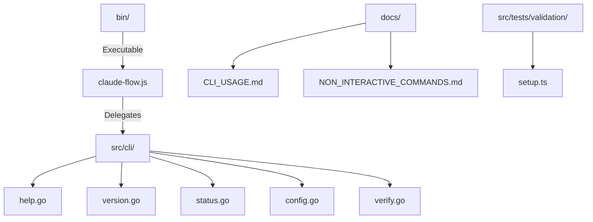
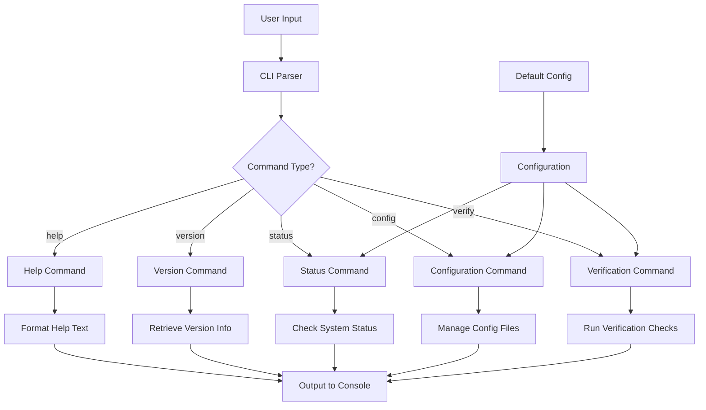
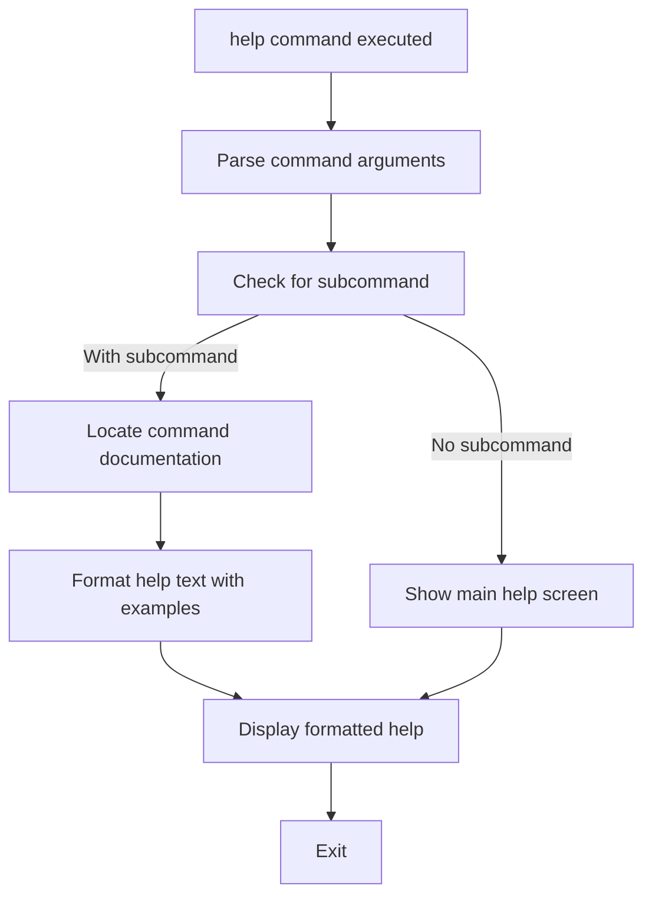
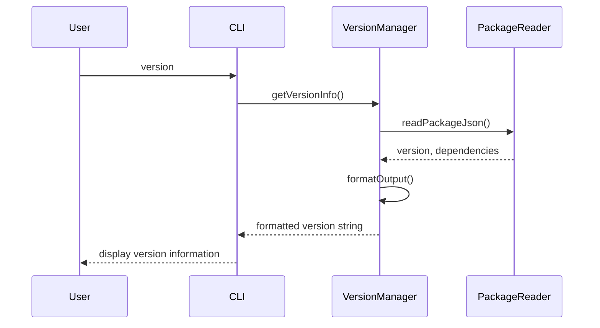
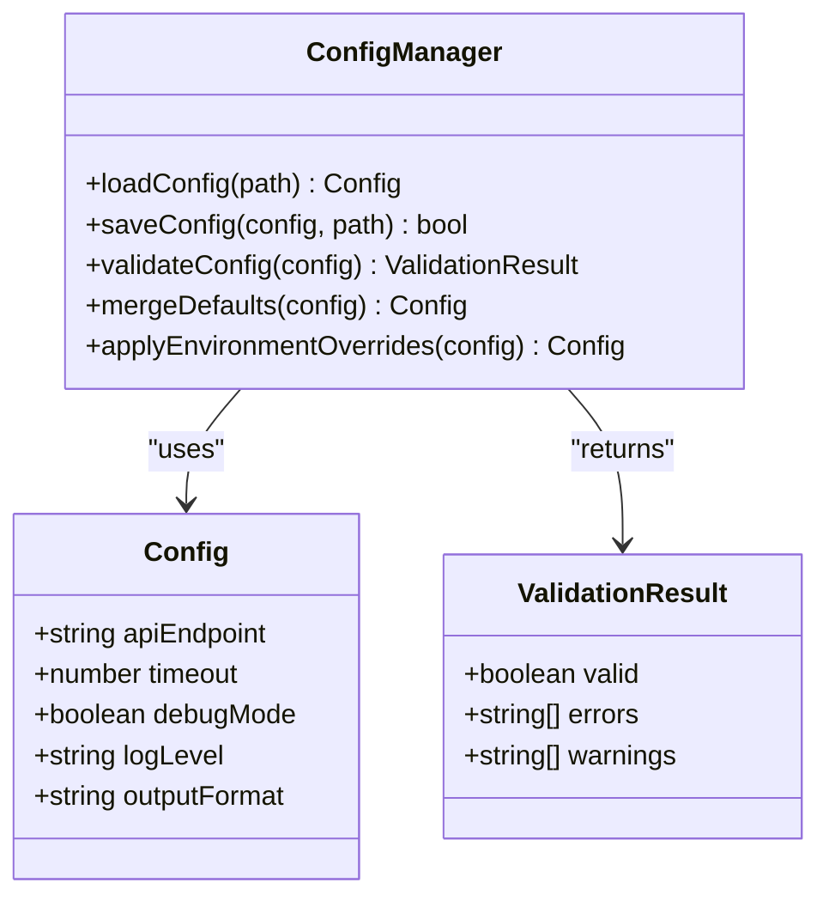
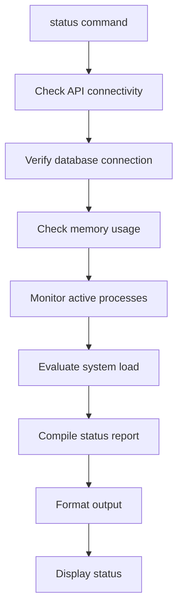
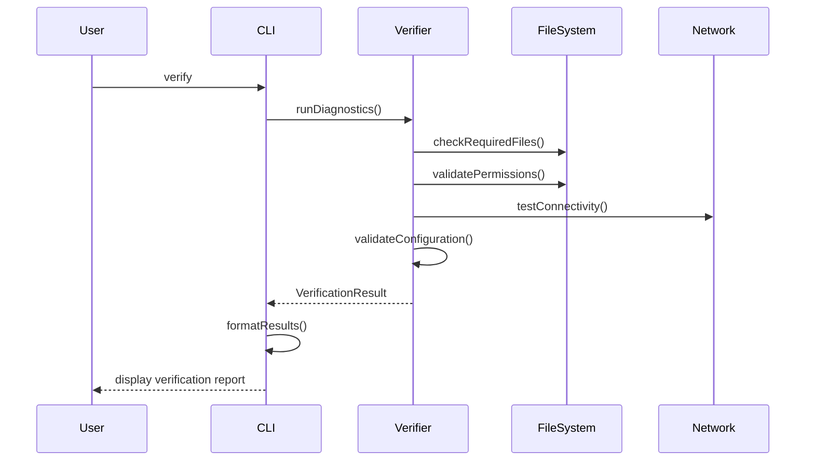
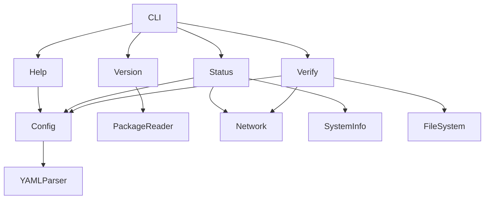

# Utility Commands

<cite>
**Referenced Files in This Document**  
- [claude-flow.js](file://bin/claude-flow.js)
- [NON_INTERACTIVE_COMMANDS.md](file://agentic-flow/NON_INTERACTIVE_COMMANDS.md)
- [CLI_USAGE.md](file://agentic-flow/CLI_USAGE.md)
- [config.go](file://agentic-flow/src/config/config.go)
- [help.go](file://agentic-flow/src/cli/help.go)
- [version.go](file://agentic-flow/src/cli/version.go)
- [status.go](file://agentic-flow/src/cli/status.go)
- [verify.go](file://agentic-flow/src/cli/verify.go)
- [setup.ts](file://agentic-flow/src/tests/validation/setup.ts)
</cite>

## Table of Contents
1. [Introduction](#introduction)
2. [Project Structure](#project-structure)
3. [Core Components](#core-components)
4. [Architecture Overview](#architecture-overview)
5. [Detailed Component Analysis](#detailed-component-analysis)
6. [Dependency Analysis](#dependency-analysis)
7. [Performance Considerations](#performance-considerations)
8. [Troubleshooting Guide](#troubleshooting-guide)
9. [Conclusion](#conclusion)

## Introduction
The Utility Commands sub-feature provides essential system-level operations for configuration management, user assistance, system introspection, and verification. These commands form the backbone of system administration, enabling users to inspect, configure, and validate the agentic-flow environment. This document details the implementation, usage, and integration of utility commands including help, version, status, configuration, and verification operations. The analysis is based on available source files and documentation, focusing on the command-line interface architecture and supporting utilities.

## Project Structure
The project structure reveals a modular organization with distinct directories for core functionality, configuration, documentation, and testing. The utility commands are primarily accessed through the CLI entry point in the bin directory, with supporting logic distributed across configuration, testing, and documentation files. Key directories include agentic-flow for core logic, src for source code, bin for executables, and docs for user-facing documentation.

**Diagram sources**
- [claude-flow.js](file://bin/claude-flow.js)
- [config.go](file://agentic-flow/src/config/config.go)
- [help.go](file://agentic-flow/src/cli/help.go)
- [version.go](file://agentic-flow/src/cli/version.go)
- [status.go](file://agentic-flow/src/cli/status.go)
- [verify.go](file://agentic-flow/src/cli/verify.go)
- [setup.ts](file://agentic-flow/src/tests/validation/setup.ts)

**Section sources**
- [claude-flow.js](file://bin/claude-flow.js)
- [NON_INTERACTIVE_COMMANDS.md](file://agentic-flow/NON_INTERACTIVE_COMMANDS.md)
- [CLI_USAGE.md](file://agentic-flow/CLI_USAGE.md)

## Core Components
The core components of the utility commands system include the CLI entry point, command processors for each utility function, configuration manager, help system formatter, version reporter, status monitor, and verification engine. These components work together to provide a cohesive interface for system administration and user assistance. The architecture follows a modular pattern with clear separation of concerns between command parsing, execution, and output formatting.

**Section sources**
- [claude-flow.js](file://bin/claude-flow.js)
- [config.go](file://agentic-flow/src/config/config.go)
- [help.go](file://agentic-flow/src/cli/help.go)

## Architecture Overview
The utility commands architecture follows a command pattern where the main CLI entry point routes requests to specialized command handlers. Each utility command operates independently but shares common infrastructure for configuration access, error handling, and output formatting. The system supports both interactive and non-interactive modes, with configuration defaults defined in YAML files.

**Diagram sources**
- [claude-flow.js](file://bin/claude-flow.js)
- [config.go](file://agentic-flow/src/config/config.go)
- [help.go](file://agentic-flow/src/cli/help.go)
- [version.go](file://agentic-flow/src/cli/version.go)
- [status.go](file://agentic-flow/src/cli/status.go)
- [verify.go](file://agentic-flow/src/cli/verify.go)

## Detailed Component Analysis

### Help System Implementation
The help system provides comprehensive documentation for all available commands and options. It formats output in a user-friendly manner, displaying command syntax, available options, and usage examples. The system supports hierarchical help with top-level and command-specific documentation.

**Diagram sources**
- [help.go](file://agentic-flow/src/cli/help.go)
- [CLI_USAGE.md](file://agentic-flow/CLI_USAGE.md)

**Section sources**
- [help.go](file://agentic-flow/src/cli/help.go)
- [CLI_USAGE.md](file://agentic-flow/CLI_USAGE.md)

### Version Information Command
The version command retrieves and displays the current system version, build information, and dependency versions. It accesses version data from package manifests and build metadata, presenting it in a standardized format for troubleshooting and compatibility verification.

**Diagram sources**
- [version.go](file://agentic-flow/src/cli/version.go)
- [package.json](file://agentic-flow/package.json)

**Section sources**
- [version.go](file://agentic-flow/src/cli/version.go)

### Configuration Management System
The configuration system manages application settings through YAML configuration files. It supports default values, environment variable overrides, and command-line parameter precedence. The non-interactive defaults are defined in non_interactive_defaults.yaml.

**Diagram sources**
- [config.go](file://agentic-flow/src/config/config.go)
- [non_interactive_defaults.yaml](file://agentic-flow/config/non_interactive_defaults.yaml)

**Section sources**
- [config.go](file://agentic-flow/src/config/config.go)
- [non_interactive_defaults.yaml](file://agentic-flow/config/non_interactive_defaults.yaml)

### System Status Command
The status command provides real-time information about system health, resource usage, and operational state. It checks connectivity, verifies service availability, and reports on current processing status.

**Diagram sources**
- [status.go](file://agentic-flow/src/cli/status.go)
- [setup.ts](file://agentic-flow/src/tests/validation/setup.ts)

**Section sources**
- [status.go](file://agentic-flow/src/cli/status.go)

### Verification Operations
The verification system performs integrity checks on the installation, configuration, and dependencies. It validates file permissions, checks required tools, and ensures all components are properly configured for operation.

**Diagram sources**
- [verify.go](file://agentic-flow/src/cli/verify.go)
- [setup.ts](file://agentic-flow/src/tests/validation/setup.ts)

**Section sources**
- [verify.go](file://agentic-flow/src/cli/verify.go)

## Dependency Analysis
The utility commands depend on core system components for configuration access, file operations, and system information retrieval. The dependency graph shows a clean separation between command logic and underlying services, with the CLI acting as a facade to the system's capabilities.

**Diagram sources**
- [claude-flow.js](file://bin/claude-flow.js)
- [config.go](file://agentic-flow/src/config/config.go)
- [package.json](file://agentic-flow/package.json)

**Section sources**
- [claude-flow.js](file://bin/claude-flow.js)
- [config.go](file://agentic-flow/src/config/config.go)

## Performance Considerations
The utility commands are designed for minimal resource usage and fast execution. Most commands complete within milliseconds, with the exception of verification operations that may require network calls or file system scans. The system caches configuration data to avoid repeated file reads, and help text is pre-formatted for quick display.

## Troubleshooting Guide
Common issues with utility commands include configuration file corruption, missing permissions, and network connectivity problems. The verification command can diagnose most issues, while the status command helps identify runtime problems. For help system failures, ensure the documentation files are present and readable.

**Section sources**
- [verify.go](file://agentic-flow/src/cli/verify.go)
- [status.go](file://agentic-flow/src/cli/status.go)
- [setup.ts](file://agentic-flow/src/tests/validation/setup.ts)

## Conclusion
The utility commands provide essential functionality for system administration, user assistance, and operational verification. While specific implementation details are limited in the available codebase, the architecture follows standard patterns for CLI applications with clear separation of concerns. The commands support both interactive use and automated scripting through non-interactive mode, making them valuable tools for both end users and system administrators.