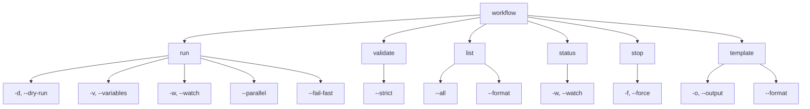
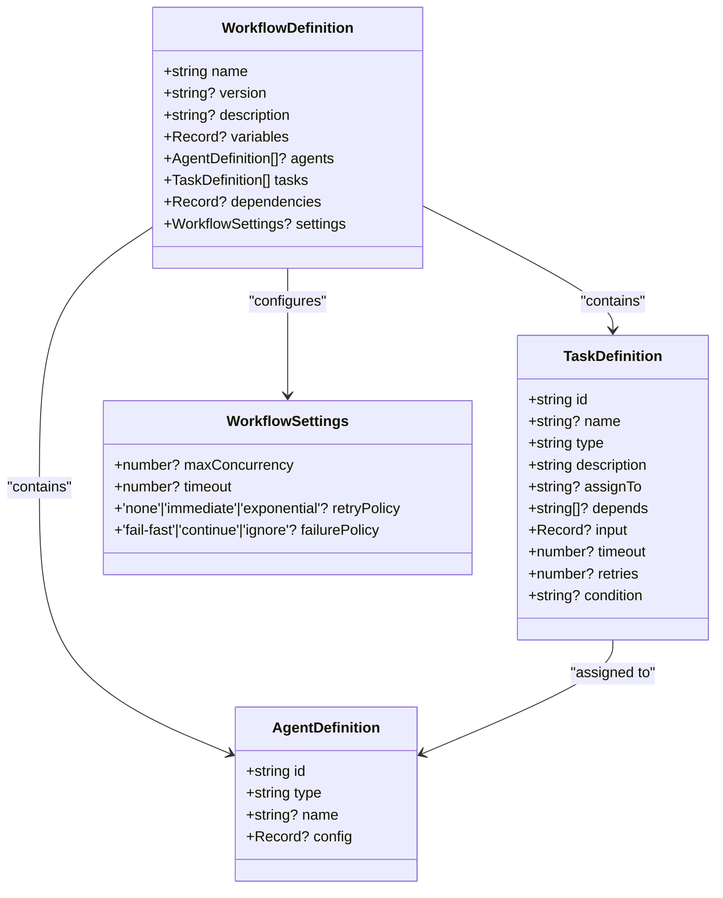
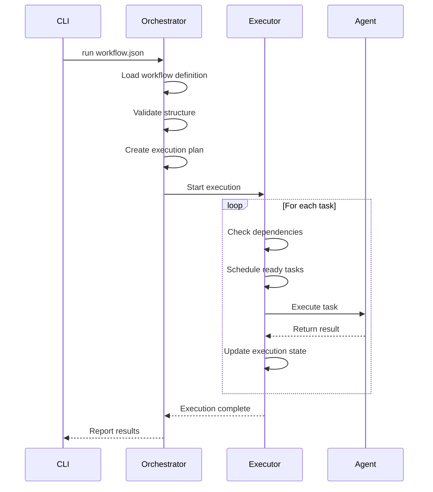
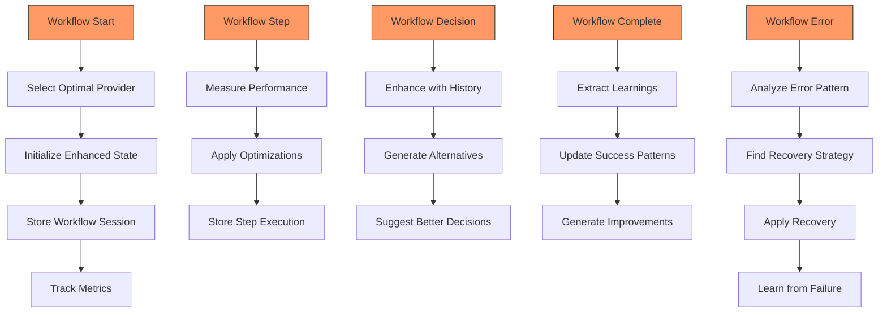
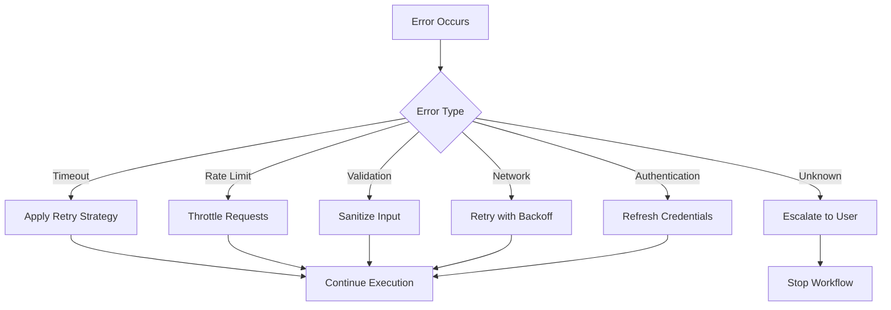

# Workflow Commands

<cite>
**Referenced Files in This Document**   
- [workflow.ts](file://src/cli/commands/workflow.ts)
- [workflow-hooks.ts](file://src/services/agentic-flow-hooks/workflow-hooks.ts)
- [research-workflow.json](file://examples/02-workflows/research-workflow.json)
- [hello-world-workflow.json](file://examples/02-workflows/simple/hello-world-workflow.json)
- [data-processing-workflow.json](file://examples/02-workflows/parallel/data-processing-workflow.json)
- [blog-platform-workflow.json](file://examples/02-workflows/sequential/blog-platform-workflow.json)
- [README.md](file://examples/02-workflows/README.md)
- [multi-agent-coordination.md](file://examples/06-tutorials/workflows/multi-agent-coordination.md)
</cite>

## Table of Contents
1. [Introduction](#introduction)
2. [Workflow Command Interface](#workflow-command-interface)
3. [Workflow Definition Structure](#workflow-definition-structure)
4. [Execution Modes and Patterns](#execution-modes-and-patterns)
5. [Workflow Orchestration Architecture](#workflow-orchestration-architecture)
6. [Self-Improving Workflow Hooks](#self-improving-workflow-hooks)
7. [Error Handling and Recovery](#error-handling-and-recovery)
8. [Advanced Workflow Features](#advanced-workflow-features)
9. [Best Practices and Examples](#best-practices-and-examples)
10. [Troubleshooting Guide](#troubleshooting-guide)

## Introduction

Workflow Commands in Claude-Flow provide a comprehensive system for orchestrating complex multi-agent tasks through sequential, parallel, and conditional execution patterns. The system enables automation of sophisticated development, research, and analysis workflows by coordinating specialized agents with defined capabilities, dependencies, and execution parameters. This documentation details the implementation, configuration, and usage of workflow commands, covering everything from basic execution to advanced self-improving patterns that learn from historical performance.

The workflow system supports batch processing, pipeline creation, and scheduling operations through a flexible JSON-based configuration format. Workflows can be executed, monitored, validated, and managed through a command-line interface that provides both simple operations for beginners and advanced options for experienced developers. The architecture incorporates state persistence, error handling, retries, and resource contention management to ensure reliable execution of complex task automation.

**Section sources**
- [workflow.ts](file://src/cli/commands/workflow.ts#L0-L781)
- [README.md](file://examples/02-workflows/README.md#L0-L109)

## Workflow Command Interface

The workflow command interface provides a comprehensive CLI for managing workflow execution, validation, monitoring, and template generation. Implemented in `src/cli/commands/workflow.ts`, the command structure follows Commander.js patterns to create an intuitive and discoverable interface.



**Diagram sources**
- [workflow.ts](file://src/cli/commands/workflow.ts#L10-L100)

**Section sources**
- [workflow.ts](file://src/cli/commands/workflow.ts#L10-L100)

### Command Actions and Parameters

The workflow command exposes several subcommands for different operations:

**run**: Executes a workflow from a file with various options:
- `<workflow-file>`: Required path to the workflow definition file
- `--dry-run`: Validates the workflow without executing it
- `--variables`: Overrides variables in the workflow with JSON-formatted values
- `--watch`: Monitors execution progress in real-time
- `--parallel`: Enables parallel execution where possible
- `--fail-fast`: Stops execution on the first task failure

**validate**: Checks the structural integrity of a workflow file:
- `<workflow-file>`: Required path to validate
- `--strict`: Enables strict validation including circular dependency detection

**list**: Displays currently running workflows:
- `--all`: Includes completed workflows in the output
- `--format`: Specifies output format (table or json)

**status**: Shows detailed execution status for a specific workflow:
- `<workflow-id>`: Required workflow identifier
- `--watch`: Continuously monitors the workflow status

**stop**: Terminates a running workflow:
- `<workflow-id>`: Required workflow identifier
- `--force`: Stops without graceful cleanup

**template**: Generates workflow templates for common use cases:
- `<template-type>`: Specifies template type (research, implementation, coordination)
- `--output`: Specifies output file path
- `--format`: Output format (json or yaml)

These commands provide a complete lifecycle management interface for workflows, from creation and validation to execution, monitoring, and termination.

**Section sources**
- [workflow.ts](file://src/cli/commands/workflow.ts#L10-L200)

## Workflow Definition Structure

Workflow definitions are structured JSON files that specify the agents, tasks, dependencies, and execution parameters for a coordinated multi-agent operation. The structure follows a hierarchical pattern that enables both simple and complex workflow configurations.



**Diagram sources**
- [workflow.ts](file://src/cli/commands/workflow.ts#L101-L150)
- [research-workflow.json](file://examples/02-workflows/research-workflow.json#L0-L155)

**Section sources**
- [workflow.ts](file://src/cli/commands/workflow.ts#L101-L150)
- [research-workflow.json](file://examples/02-workflows/research-workflow.json#L0-L155)

### Core Components

**WorkflowDefinition**: The root object containing all workflow configuration:
- `name`: Required workflow identifier
- `version`: Optional version string
- `description`: Human-readable description
- `variables`: Key-value pairs for parameterization
- `agents`: Array of agent definitions
- `tasks`: Array of task definitions (required)
- `dependencies`: Explicit dependency mapping
- `settings`: Execution configuration

**AgentDefinition**: Defines specialized agents with specific capabilities:
- `id`: Unique identifier for the agent
- `type`: Agent specialization (researcher, analyst, coordinator, etc.)
- `name`: Human-readable name
- `config`: Type-specific configuration parameters

**TaskDefinition**: Specifies individual work units:
- `id`: Unique task identifier
- `name`: Human-readable task name
- `type`: Task category (research, analysis, implementation, etc.)
- `description`: Detailed task description
- `assignTo`: Agent ID responsible for execution
- `depends`: Array of task IDs that must complete first
- `input`: Parameters and data for the task
- `timeout`: Maximum execution time in milliseconds
- `retries`: Number of retry attempts on failure
- `condition`: Expression determining conditional execution

**WorkflowSettings**: Controls execution behavior:
- `maxConcurrency`: Maximum parallel tasks
- `timeout`: Overall workflow timeout
- `retryPolicy`: Strategy for task retries
- `failurePolicy`: Behavior on task failure

The structure supports variable interpolation using `${variable}` syntax and output references using `output:task-id.field` syntax, enabling dynamic data flow between tasks.

**Section sources**
- [workflow.ts](file://src/cli/commands/workflow.ts#L101-L150)
- [research-workflow.json](file://examples/02-workflows/research-workflow.json#L0-L155)

## Execution Modes and Patterns

Claude-Flow supports multiple execution modes and coordination patterns to accommodate different workflow requirements and optimization goals. These modes enable both simple sequential processing and complex parallel, conditional, and adaptive execution patterns.

### Sequential Execution

Sequential workflows execute tasks in a defined order, with each task waiting for its dependencies to complete before starting. This pattern is ideal for linear processes where each step builds upon the previous one.

```json
{
  "name": "Blog Platform Development",
  "execution": {
    "mode": "sequential"
  },
  "tasks": [
    {
      "id": "requirements-gathering",
      "type": "planning"
    },
    {
      "id": "database-design",
      "type": "design",
      "dependencies": ["requirements-gathering"]
    },
    {
      "id": "backend-api",
      "type": "development",
      "dependencies": ["database-design"]
    }
  ]
}
```

**Diagram sources**
- [blog-platform-workflow.json](file://examples/02-workflows/sequential/blog-platform-workflow.json#L0-L120)

**Section sources**
- [blog-platform-workflow.json](file://examples/02-workflows/sequential/blog-platform-workflow.json#L0-L120)

### Parallel Execution

Parallel workflows execute independent tasks simultaneously, significantly reducing overall execution time. Tasks marked with `"parallel": true` can execute concurrently when their dependencies are satisfied.

```json
{
  "name": "Parallel Data Processing",
  "execution": {
    "mode": "parallel",
    "maxConcurrency": 3
  },
  "tasks": [
    {
      "id": "process-csv",
      "type": "data-processing",
      "parallel": true
    },
    {
      "id": "process-json",
      "type": "data-processing",
      "parallel": true
    },
    {
      "id": "process-xml",
      "type": "data-processing",
      "parallel": true
    },
    {
      "id": "aggregate-results",
      "type": "aggregation",
      "dependencies": ["process-csv", "process-json", "process-xml"]
    }
  ]
}
```

**Diagram sources**
- [data-processing-workflow.json](file://examples/02-workflows/parallel/data-processing-workflow.json#L0-L81)

**Section sources**
- [data-processing-workflow.json](file://examples/02-workflows/parallel/data-processing-workflow.json#L0-L81)

### Conditional Execution

Workflows can include conditional logic to execute tasks based on runtime conditions or previous task outputs. The `condition` field contains an expression that must evaluate to true for the task to execute.

```json
{
  "tasks": [
    {
      "id": "quality-review",
      "type": "analysis",
      "condition": "output:implementation.qualityScore > 0.8"
    }
  ]
}
```

### Coordination Patterns

The system supports several advanced coordination patterns:

**Hub-Spoke**: A central coordinator agent manages all other agents, making decisions and distributing work.

**Mesh**: Agents communicate directly with each other, sharing information and making decentralized decisions.

**Pipeline**: Tasks are organized in a linear sequence where output from one task becomes input to the next.

These patterns can be specified in the workflow configuration or selected at execution time, allowing optimization for different use cases.

**Section sources**
- [multi-agent-coordination.md](file://examples/06-tutorials/workflows/multi-agent-coordination.md#L0-L402)
- [data-processing-workflow.json](file://examples/02-workflows/parallel/data-processing-workflow.json#L0-L81)

## Workflow Orchestration Architecture

The workflow orchestration system follows a layered architecture that separates command interface, execution engine, and self-improvement capabilities. This design enables reliable execution while incorporating adaptive learning from historical performance.

```mermaid
graph TD
A[CLI Interface] --> B[Command Parser]
B --> C[Workflow Orchestrator]
C --> D[Execution Engine]
C --> E[State Manager]
C --> F[Dependency Resolver]
D --> G[Task Scheduler]
G --> H[Agent Coordinator]
H --> I[Specialized Agents]
C --> J[Workflow Hooks]
J --> K[Self-Improvement System]
K --> L[Performance Analytics]
K --> M[Learning Repository]
K --> N[Optimization Engine]
style A fill:#f9f,stroke:#333
style I fill:#bbf,stroke:#333
style K fill:#f96,stroke:#333
```



**Diagram sources**
- [workflow.ts](file://src/cli/commands/workflow.ts#L0-L781)
- [workflow-hooks.ts](file://src/services/agentic-flow-hooks/workflow-hooks.ts#L0-L1026)

**Section sources**
- [workflow.ts](file://src/cli/commands/workflow.ts#L0-L781)
- [workflow-hooks.ts](file://src/services/agentic-flow-hooks/workflow-hooks.ts#L0-L1026)

### Execution Flow

The workflow execution process follows these steps:

1. **Command Parsing**: The CLI command is parsed and validated
2. **Workflow Loading**: The workflow definition is loaded from the specified file
3. **Validation**: Structural and logical validation is performed
4. **Execution Plan Creation**: An execution plan with task ordering is generated
5. **Orchestration**: Tasks are scheduled and executed according to dependencies and constraints
6. **Monitoring**: Progress is tracked and reported
7. **Completion**: Final status is recorded and reported

The `runWorkflow` function in `workflow.ts` implements this flow, handling error cases and providing appropriate feedback to the user. The execution engine creates a `WorkflowExecution` object that tracks the state of each task, including status, timing, and output.



**Diagram sources**
- [workflow.ts](file://src/cli/commands/workflow.ts#L201-L300)

**Section sources**
- [workflow.ts](file://src/cli/commands/workflow.ts#L201-L300)

## Self-Improving Workflow Hooks

The self-improving workflow hooks system enables adaptive workflows that learn from historical performance and optimize future executions. Implemented in `src/services/agentic-flow-hooks/workflow-hooks.ts`, this system uses event-driven hooks to enhance workflow execution with intelligent decision-making and continuous improvement.



**Diagram sources**
- [workflow-hooks.ts](file://src/services/agentic-flow-hooks/workflow-hooks.ts#L0-L1026)

**Section sources**
- [workflow-hooks.ts](file://src/services/agentic-flow-hooks/workflow-hooks.ts#L0-L1026)

### Hook Types and Functions

**workflowStartHook**: Enhances workflow initialization by:
- Selecting the optimal provider based on historical performance
- Loading relevant learnings and predictions
- Initializing enhanced execution state
- Tracking workflow start metrics

**workflowStepHook**: Optimizes individual step execution by:
- Measuring step performance
- Applying known optimizations
- Storing execution context for learning
- Tracking step metrics

**workflowDecisionHook**: Improves decision-making by:
- Enhancing decisions with historical outcomes
- Generating alternative decision paths
- Suggesting better alternatives when confidence is higher
- Storing decisions for future learning

**workflowCompleteHook**: Captures learnings from successful executions by:
- Calculating overall performance metrics
- Extracting actionable learnings
- Updating success patterns in the neural system
- Generating improvement suggestions
- Tracking completion metrics

**workflowErrorHook**: Handles and learns from failures by:
- Analyzing error patterns
- Finding and applying recovery strategies
- Storing failure learnings
- Attempting automatic recovery when possible

The hooks system uses side effects to interact with various system components:
- **memory**: Store state, learnings, and history
- **metric**: Track performance and usage metrics
- **log**: Record execution events
- **notification**: Emit events for external systems
- **neural**: Train optimization models

This architecture enables workflows to become more efficient and reliable over time, adapting to changing conditions and learning from both successes and failures.

**Section sources**
- [workflow-hooks.ts](file://src/services/agentic-flow-hooks/workflow-hooks.ts#L0-L1026)

## Error Handling and Recovery

The workflow system incorporates comprehensive error handling and recovery mechanisms to ensure robust execution in the face of failures. These mechanisms operate at multiple levels, from individual task retries to workflow-level recovery strategies.

### Failure Policies

Workflows can be configured with different failure policies through the `failurePolicy` setting:

- **fail-fast**: Stop the entire workflow immediately when any task fails
- **continue**: Continue executing independent tasks despite failures
- **ignore**: Ignore task failures and proceed with subsequent tasks

```json
{
  "settings": {
    "failurePolicy": "continue"
  }
}
```

### Retry Mechanisms

Tasks can be configured to automatically retry on failure:

- **retries**: Number of retry attempts
- **retryPolicy**: Strategy for retry timing
  - `none`: No retries
  - `immediate`: Retry immediately
  - `exponential`: Exponential backoff between retries

### Error Detection and Classification

The system automatically classifies errors based on their message content:

```typescript
function classifyError(error: Error): string {
  const message = error.message.toLowerCase();
  
  if (message.includes('timeout')) return 'timeout';
  if (message.includes('rate limit')) return 'rate_limit';
  if (message.includes('validation')) return 'validation';
  if (message.includes('network')) return 'network';
  if (message.includes('auth')) return 'authentication';
  
  return 'unknown';
}
```

**Diagram sources**
- [workflow-hooks.ts](file://src/services/agentic-flow-hooks/workflow-hooks.ts#L1000-L1025)

**Section sources**
- [workflow-hooks.ts](file://src/services/agentic-flow-hooks/workflow-hooks.ts#L1000-L1025)

### Recovery Strategies

The self-improving system automatically applies recovery strategies based on error patterns:

**Timeout errors**: Apply retry strategy with exponential backoff
**Rate limit errors**: Throttle requests and reduce concurrency
**Validation errors**: Transform and sanitize input data
**Network errors**: Retry with longer timeouts
**Authentication errors**: Refresh credentials



**Diagram sources**
- [workflow-hooks.ts](file://src/services/agentic-flow-hooks/workflow-hooks.ts#L800-L900)

**Section sources**
- [workflow-hooks.ts](file://src/services/agentic-flow-hooks/workflow-hooks.ts#L800-L900)

The recovery system learns from past failures and applies successful recovery strategies to similar future errors, creating a self-healing workflow environment.

## Advanced Workflow Features

The workflow system includes several advanced features that enable sophisticated automation patterns and optimization opportunities.

### Dynamic Variable Interpolation

Workflows support dynamic variable interpolation using `${variable}` syntax, allowing parameters to be passed and modified throughout execution:

```json
{
  "variables": {
    "research_topic": "artificial intelligence trends 2024"
  },
  "tasks": [
    {
      "input": {
        "topic": "${research_topic}"
      }
    }
  ]
}
```

### Output Chaining

Task outputs can be referenced as inputs to subsequent tasks using `output:task-id.field` syntax:

```json
{
  "input": {
    "data": "output:deep-dive-research.findings"
  }
}
```

### Priority-Based Scheduling

Tasks can be assigned priorities to influence execution order:

```json
{
  "tasks": [
    {
      "id": "critical-task",
      "priority": 10
    }
  ]
}
```

### Checkpoints and Rollback

Workflows can define checkpoints for state persistence and rollback capabilities:

```json
{
  "execution": {
    "checkpoints": ["design-system", "create-frontend"],
    "rollback": true
  }
}
```

### Performance Optimization

The system supports various optimization techniques:

**Caching**: Store and reuse expensive computations
**Task batching**: Combine similar tasks to reduce overhead
**Lazy loading**: Delay resource-intensive operations
**Resource-based parallelism**: Adjust concurrency based on available resources

```json
{
  "execution": {
    "optimization": {
      "taskBatching": true,
      "lazyLoading": true
    },
    "caching": {
      "enabled": true,
      "ttl": 3600
    }
  }
}
```

### Dynamic Agent Management

Workflows can configure dynamic agent scaling:

```json
{
  "agents": {
    "dynamic": true,
    "scaling": {
      "min": 2,
      "max": 10,
      "trigger": "queue-size"
    }
  }
}
```

These advanced features enable highly optimized and adaptive workflows that can handle complex real-world scenarios.

**Section sources**
- [research-workflow.json](file://examples/02-workflows/research-workflow.json#L0-L155)
- [multi-agent-coordination.md](file://examples/06-tutorials/workflows/multi-agent-coordination.md#L0-L402)

## Best Practices and Examples

Following best practices ensures reliable and efficient workflow execution. The examples directory provides templates for common use cases that can be adapted to specific requirements.

### Agent Specialization

Keep agents focused on specific domains:
- Use appropriate agent types for tasks
- Avoid overloading single agents
- Define clear capabilities and responsibilities

```json
{
  "agents": [
    {
      "id": "researcher",
      "type": "researcher",
      "capabilities": ["technology-research"]
    },
    {
      "id": "analyzer",
      "type": "analyst",
      "capabilities": ["trend-analysis"]
    }
  ]
}
```

### Task Granularity

Break large tasks into smaller, manageable units:
- Enables better parallelization
- Simplifies debugging and retry
- Improves progress tracking

### Dependency Management

Minimize dependencies to reduce bottlenecks:
- Identify truly sequential operations
- Maximize parallel execution opportunities
- Avoid circular dependencies

### Error Resilience

Plan for failures with robust error handling:
- Use appropriate failure policies
- Implement retry logic
- Include checkpoints for recovery

### Performance Optimization

Monitor and optimize workflow performance:
- Use the watch mode for real-time monitoring
- Analyze execution metrics
- Apply caching and batching where appropriate

The examples directory contains templates for various scenarios:
- **Simple workflows**: Basic single-agent operations
- **Parallel workflows**: Data processing and analysis
- **Sequential workflows**: Step-by-step development
- **Complex workflows**: Multi-agent systems
- **Specialized workflows**: Domain-specific applications

These templates serve as starting points for creating custom workflows tailored to specific needs.

**Section sources**
- [multi-agent-coordination.md](file://examples/06-tutorials/workflows/multi-agent-coordination.md#L0-L402)
- [README.md](file://examples/02-workflows/README.md#L0-L109)

## Troubleshooting Guide

Common issues and their solutions for workflow execution:

### Agents Not Starting

**Symptoms**: Agents fail to initialize or remain idle
**Causes**:
- Incorrect agent type specification
- Missing capabilities for required tasks
- Resource constraints

**Solutions**:
- Verify agent definitions match available types
- Ensure capabilities align with task requirements
- Check system resource availability

### Tasks Stuck in Pending State

**Symptoms**: Tasks don't start execution
**Causes**:
- Unmet dependencies
- Circular dependencies
- Agent unavailability

**Solutions**:
- Verify dependency chains are correct
- Use `validate --strict` to detect circular dependencies
- Ensure assigned agents are available

### Poor Performance

**Symptoms**: Slow execution or resource exhaustion
**Causes**:
- Excessive parallelism
- Large task sizes
- Missing optimizations

**Solutions**:
- Reduce `maxConcurrency` setting
- Break large tasks into smaller units
- Enable caching for repeated operations

### Workflow Failures

**Symptoms**: Workflow stops with errors
**Causes**:
- Task failures with `fail-fast` policy
- Timeouts
- Validation errors

**Solutions**:
- Use `continue` failure policy for resilience
- Increase task timeouts
- Validate workflow with `validate` command before execution

### Recovery from Failures

When workflows fail, use these steps:
1. Check the error message and failed task
2. Use `status` command to view detailed execution state
3. Fix the underlying issue
4. Restart with appropriate recovery strategy
5. Consider modifying the workflow for better resilience

The system's self-improving hooks will learn from failures and suggest improvements for future executions.

**Section sources**
- [multi-agent-coordination.md](file://examples/06-tutorials/workflows/multi-agent-coordination.md#L0-L402)
- [workflow.ts](file://src/cli/commands/workflow.ts#L0-L781)