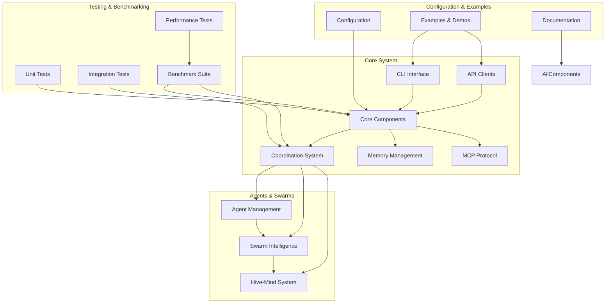
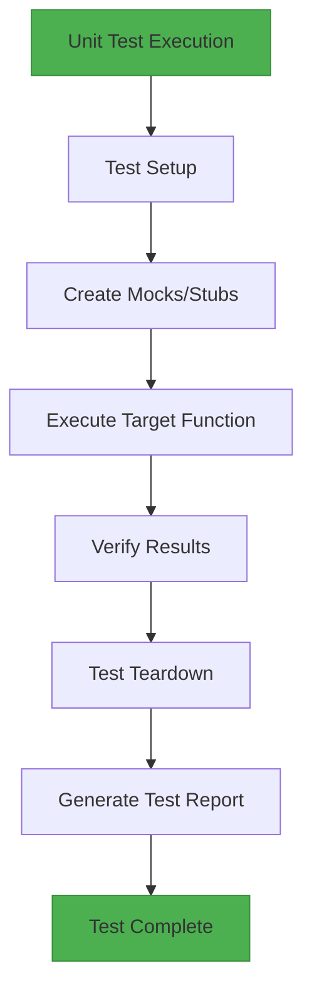

<docs>
# Contributing and Development

<cite>
**Referenced Files in This Document**   
- [real-benchmark-architecture.md](file://benchmark/docs/real-benchmark-architecture.md)
- [real_metrics_collection.md](file://benchmark/docs/real_metrics_collection.md)
- [api_reference.md](file://benchmark/docs/api_reference.md)
- [cli-reference.md](file://benchmark/docs/cli-reference.md)
- [test_swe_bench_official.py](file://benchmark/test_swe_bench_official.py)
- [run_real_benchmarks.py](file://benchmark/run_real_benchmarks.py)
- [RealBenchmarkEngine](file://benchmark/src/swarm_benchmark/core/real_benchmark_engine.py)
- [PerformanceCollector](file://benchmark/src/swarm_benchmark/core/performance_collector.py)
- [ResourceMonitor](file://benchmark/src/swarm_benchmark/core/resource_monitor.py)
- [MetricsAggregator](file://benchmark/src/swarm_benchmark/core/metrics_aggregator.py)
- [BenchmarkConfig](file://benchmark/src/swarm_benchmark/core/models.py)
- [test_real_benchmarks.py](file://benchmark/tests/test_real_benchmarks.py)
- [jest.config.js](file://jest.config.js)
- [test.config.js](file://tests/test.config.js)
- [package.json](file://package.json)
- [docker-compose.hive-mind.yml](file://docker/docker-compose.hive-mind.yml)
- [src\cli\main.ts](file://src/cli/main.ts)
- [src\core\orchestrator.ts](file://src/core/orchestrator.ts)
- [src\coordination\swarm-coordinator.ts](file://src/coordination/swarm-coordinator.ts)
- [src\mcp\server.ts](file://src/mcp/server.ts)
- [python-claude-flow/CONTRIBUTING.md](file://python-claude-flow/CONTRIBUTING.md)
- [python-claude-flow/README.md](file://python-claude-flow/README.md)
- [python-claude-flow/pyproject.toml](file://python-claude-flow/pyproject.toml)
- [python-claude-flow/src/claude_flow](file://python-claude-flow/src/claude_flow)
- [python-claude-flow/tests](file://python-claude-flow/tests)
</cite>

## Update Summary
**Changes Made**   
- Added comprehensive Python development guidelines and contribution standards
- Integrated Python-specific tooling, testing, and environment setup instructions
- Enhanced code quality standards with Python-specific practices
- Updated contribution workflow to include Python development patterns
- Added Python project structure and architecture details

## Table of Contents
1. [Introduction](#introduction)
2. [Codebase Structure and Organization](#codebase-structure-and-organization)
3. [Testing Guidelines](#testing-guidelines)
4. [Pull Request Process](#pull-request-process)
5. [Versioning Policy and Release Cycle](#versioning-policy-and-release-cycle)
6. [Feature Development and Bug Fixing](#feature-development-and-bug-fixing)
7. [Performance Optimization](#performance-optimization)
8. [Code Quality and Documentation](#code-quality-and-documentation)
9. [Conclusion](#conclusion)

## Introduction

This document provides comprehensive guidance for contributing to and developing the Claude-Flow project. It covers the codebase structure, testing methodologies, contribution workflows, versioning policies, and best practices for extending and improving the system. The information is designed to be accessible to new contributors while providing sufficient technical depth for experienced developers to make meaningful contributions to the project. With the addition of the Python implementation, this document now includes specific guidelines for Python development within the Claude-Flow ecosystem.

## Codebase Structure and Organization

The Claude-Flow repository follows a modular architecture with clear separation of concerns. The codebase is organized into several key directories, each serving a specific purpose in the overall system.

### Core Directories and Their Purposes

#### src
The `src` directory contains the main implementation code for the Claude-Flow system. It is organized into subdirectories based on functionality:

- **adapters**: Integration points with external systems and libraries
- **agents**: Agent management and lifecycle components
- **api**: API clients and error handling for Claude integration
- **automation\agents**: Python-based foundation agents for automation tasks
- **cli**: Command-line interface implementation
- **communication**: Message bus and inter-component communication
- **config**: Configuration management and settings
- **coordination**: Swarm coordination, scheduling, and resource management
- **core**: Fundamental system components like orchestrator, event bus, and persistence
- **enterprise**: Enterprise-level features including analytics, audit, and security
- **hive-mind**: Distributed intelligence and consensus mechanisms
- **mcp**: Multi-agent coordination protocol implementation
- **memory**: Memory management, storage backends, and serialization
- **swarm**: Swarm intelligence and collective behavior algorithms
- **task**: Task management and execution framework
- **templates\claude-optimized**: Optimized templates for Claude interactions
- **utils**: Utility functions and helpers
- **verification**: Validation and verification tools

#### benchmark
The `benchmark` directory contains the comprehensive benchmarking system used to evaluate Claude-Flow performance. Key components include:

- **docs**: Architecture and usage documentation for the benchmarking system
- **hive-mind-benchmarks**: Specialized benchmarks for hive-mind functionality
- **src\swarm_benchmark**: Core benchmarking engine and models
- **swe-bench**: Software engineering benchmark suite
- **tests**: Benchmark validation and testing framework
- **scripts**: Performance monitoring and test execution scripts

#### tests
The `tests` directory contains the testing framework for Claude-Flow, organized by test type:

- **unit**: Isolated unit tests for individual components
- **integration**: Tests for component interactions and system integration
- **performance**: Performance benchmarks and load testing
- **production**: Validation tests for production deployment scenarios
- **cli**: Command-line interface specific tests
- **fixtures**: Test data and mock generators

#### examples
The `examples` directory provides practical demonstrations of Claude-Flow usage:

- **01-configurations**: Configuration examples for different use cases
- **02-workflows**: Workflow definitions and execution examples
- **03-demos**: Complete demonstration applications
- **04-testing**: Testing methodology examples
- **05-swarm-apps**: Swarm intelligence application examples
- **06-tutorials**: Step-by-step tutorial materials

#### docker
The `docker` directory contains containerization and deployment configurations:

- **docker-test**: Dockerfiles and configurations for testing environments
- **docker-compose.hive-mind.yml**: Docker Compose configuration for hive-mind deployments

#### scripts
The `scripts` directory contains utility scripts for development and operations:

- Build, deployment, and maintenance scripts
- Performance monitoring and analysis tools
- Testing and validation utilities

#### python-claude-flow
The `python-claude-flow` directory contains the Python implementation of Claude-Flow with its own complete development ecosystem:

- **src\claude_flow**: Python package implementation with modular components
- **tests**: Comprehensive test suite with unit, integration, and end-to-end tests
- **config**: Configuration files and environment templates
- **docs**: Documentation for the Python implementation
- **k8s**: Kubernetes deployment manifests
- **requirements.txt**: Python dependencies
- **pyproject.toml**: Python project configuration and metadata



**Diagram sources**
- [src\cli\main.ts](file://src/cli/main.ts)
- [src\core\orchestrator.ts](file://src/core/orchestrator.ts)
- [src\coordination\swarm-coordinator.ts](file://src/coordination/swarm-coordinator.ts)
- [src\mcp\server.ts](file://src/mcp/server.ts)

**Section sources**
- [src](file://src)
- [benchmark](file://benchmark)
- [tests](file://tests)
- [examples](file://examples)
- [docker](file://docker)
- [scripts](file://scripts)
- [python-claude-flow](file://python-claude-flow)

## Testing Guidelines

Claude-Flow employs a comprehensive testing strategy that includes unit tests, integration tests, performance benchmarks, and validation suites to ensure code quality and system reliability.

### Unit Tests

Unit tests focus on verifying the correctness of individual functions and classes in isolation. The testing framework uses Jest for JavaScript/TypeScript components and pytest for Python components.

Key characteristics of unit tests:
- Test individual functions and methods
- Use mocks and stubs to isolate dependencies
- Fast execution time
- High code coverage requirements
- Focus on edge cases and error conditions

Unit tests are located in the `tests/unit` directory and organized by component:
- **api**: Tests for API clients and error handling
- **cli**: Tests for command-line interface functionality
- **core**: Tests for orchestrator, event bus, and persistence
- **coordination**: Tests for scheduling and resource management
- **mcp**: Tests for multi-agent coordination protocol
- **memory**: Tests for memory storage and retrieval
- **utils**: Tests for utility functions

For Python components, unit tests are located in `python-claude-flow/tests/python/unit` and follow pytest conventions with descriptive test names and comprehensive coverage:

```python
def test_agent_creation_with_valid_config(agent_config):
    """Test agent creation with valid configuration."""
    agent = Agent(agent_config)
    assert agent.type == agent_config["type"]
    assert agent.max_tasks == agent_config["max_tasks"]

@pytest.mark.asyncio
async def test_task_execution(agent, sample_task):
    """Test asynchronous task execution."""
    result = await agent.execute_task(sample_task)
    assert result.status == "completed"
```



**Diagram sources**
- [tests/unit](file://tests/unit)
- [python-claude-flow/tests/python/unit](file://python-claude-flow/tests/python/unit)
- [jest.config.js](file://jest.config.js)
- [test.config.js](file://tests/test.config.js)
- [python-claude-flow/pytest.ini](file://python-claude-flow/pytest.ini)

**Section sources**
- [tests/unit](file://tests/unit)
- [python-claude-flow/tests/python/unit](file://python-claude-flow/tests/python/unit)
- [jest.config.js](file://jest.config.js)
- [test.config.js](file://tests/test.config.js)

### Integration Tests

Integration tests verify the interaction between multiple components and ensure that the system works correctly as a whole. These tests are located in the `tests/integration` directory.

Key aspects of integration tests:
- Test component interactions and interfaces
- Use real (not mocked) dependencies when possible
- Verify system behavior under realistic conditions
- Test error recovery and fault tolerance
- Validate configuration and deployment scenarios

Integration test categories:
- **batch-task**: Tests for batch task execution and management
- **cli-simple**: Tests for simple CLI command execution
- **cross-platform-portability**: Tests for cross-platform compatibility
- **error-handling-patterns**: Tests for error handling and recovery
- **functional-portability**: Tests for functional consistency across environments
- **hive-mind-schema**: Tests for hive-mind data schema and persistence
- **hook-basic**: Tests for hook system functionality
- **json-output**: Tests for JSON output formatting and structure
- **mcp**: Tests for MCP protocol implementation
- **portability-fixes**: Tests for platform-specific fixes
- **real-metrics**: Tests for real metrics collection
- **start-command**: Tests for start command functionality
- **start-compatibility**: Tests for start command compatibility
- **system-integration**: End-to-end system integration tests
- **ui-display-fixes**: Tests for UI display and formatting

For Python components, integration tests are located in `python-claude-flow/tests/python/integration` and test component interactions with real dependencies:

```python
class TestAgentCoordination:
    """Integration tests for agent coordination."""
    
    @pytest.fixture
    def agent_system(self):
        """Create test agent system with queen and workers."""
        queen = QueenAgent(config=queen_config)
        workers = [CoderAgent(config=worker_config) for _ in range(3)]
        return AgentSystem(queen, workers)
    
    def test_task_distribution(self, agent_system, sample_task):
        """Test task distribution from queen to workers."""
        result = agent_system.assign_task(sample_task)
        assert result.assigned_worker is not None
        assert result.status == "assigned"
```

