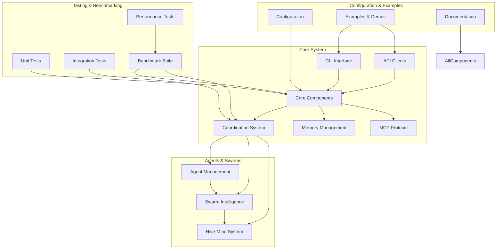
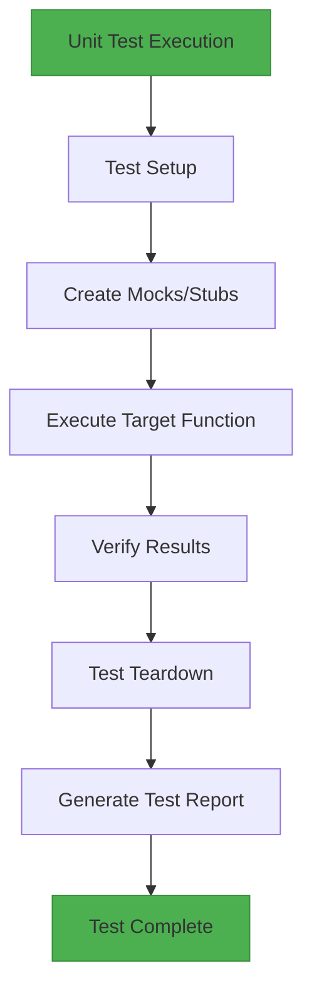
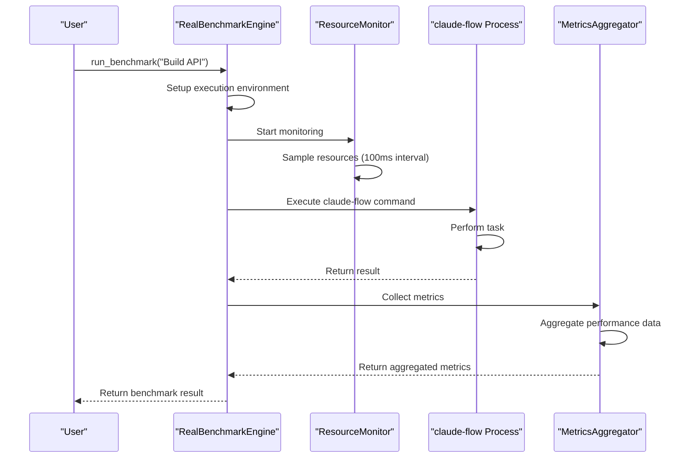
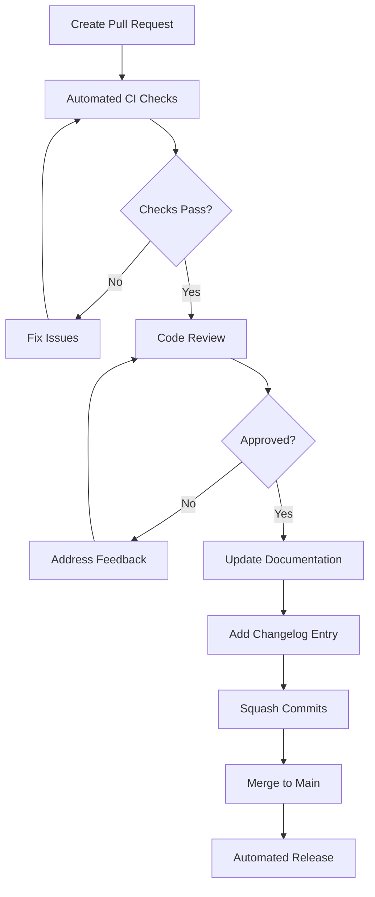
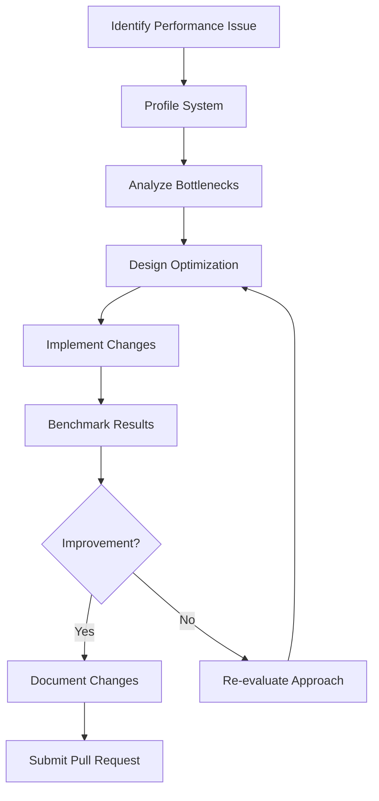

# Contributing and Development

<cite>
**Referenced Files in This Document**   
- [real-benchmark-architecture.md](file://benchmark/docs/real-benchmark-architecture.md)
- [real_metrics_collection.md](file://benchmark/docs/real_metrics_collection.md)
- [api_reference.md](file://benchmark/docs/api_reference.md)
- [cli-reference.md](file://benchmark/docs/cli-reference.md)
- [test_swe_bench_official.py](file://benchmark/test_swe_bench_official.py)
- [run_real_benchmarks.py](file://benchmark/run_real_benchmarks.py)
- [RealBenchmarkEngine](file://benchmark/src/swarm_benchmark/core/real_benchmark_engine.py)
- [PerformanceCollector](file://benchmark/src/swarm_benchmark/core/performance_collector.py)
- [ResourceMonitor](file://benchmark/src/swarm_benchmark/core/resource_monitor.py)
- [MetricsAggregator](file://benchmark/src/swarm_benchmark/core/metrics_aggregator.py)
- [BenchmarkConfig](file://benchmark/src/swarm_benchmark/core/models.py)
- [test_real_benchmarks.py](file://benchmark/tests/test_real_benchmarks.py)
- [jest.config.js](file://jest.config.js)
- [test.config.js](file://tests/test.config.js)
- [package.json](file://package.json)
- [docker-compose.hive-mind.yml](file://docker/docker-compose.hive-mind.yml)
- [src\cli\main.ts](file://src/cli/main.ts)
- [src\core\orchestrator.ts](file://src/core/orchestrator.ts)
- [src\coordination\swarm-coordinator.ts](file://src/coordination/swarm-coordinator.ts)
- [src\mcp\server.ts](file://src/mcp/server.ts)
</cite>

## Table of Contents
1. [Introduction](#introduction)
2. [Codebase Structure and Organization](#codebase-structure-and-organization)
3. [Testing Guidelines](#testing-guidelines)
4. [Pull Request Process](#pull-request-process)
5. [Versioning Policy and Release Cycle](#versioning-policy-and-release-cycle)
6. [Feature Development and Bug Fixing](#feature-development-and-bug-fixing)
7. [Performance Optimization](#performance-optimization)
8. [Code Quality and Documentation](#code-quality-and-documentation)
9. [Conclusion](#conclusion)

## Introduction

This document provides comprehensive guidance for contributing to and developing the Claude-Flow project. It covers the codebase structure, testing methodologies, contribution workflows, versioning policies, and best practices for extending and improving the system. The information is designed to be accessible to new contributors while providing sufficient technical depth for experienced developers to make meaningful contributions to the project.

## Codebase Structure and Organization

The Claude-Flow repository follows a modular architecture with clear separation of concerns. The codebase is organized into several key directories, each serving a specific purpose in the overall system.

### Core Directories and Their Purposes

#### src
The `src` directory contains the main implementation code for the Claude-Flow system. It is organized into subdirectories based on functionality:

- **adapters**: Integration points with external systems and libraries
- **agents**: Agent management and lifecycle components
- **api**: API clients and error handling for Claude integration
- **automation\agents**: Python-based foundation agents for automation tasks
- **cli**: Command-line interface implementation
- **communication**: Message bus and inter-component communication
- **config**: Configuration management and settings
- **coordination**: Swarm coordination, scheduling, and resource management
- **core**: Fundamental system components like orchestrator, event bus, and persistence
- **enterprise**: Enterprise-level features including analytics, audit, and security
- **hive-mind**: Distributed intelligence and consensus mechanisms
- **mcp**: Multi-agent coordination protocol implementation
- **memory**: Memory management, storage backends, and serialization
- **swarm**: Swarm intelligence and collective behavior algorithms
- **task**: Task management and execution framework
- **templates\claude-optimized**: Optimized templates for Claude interactions
- **utils**: Utility functions and helpers
- **verification**: Validation and verification tools

#### benchmark
The `benchmark` directory contains the comprehensive benchmarking system used to evaluate Claude-Flow performance. Key components include:

- **docs**: Architecture and usage documentation for the benchmarking system
- **hive-mind-benchmarks**: Specialized benchmarks for hive-mind functionality
- **src\swarm_benchmark**: Core benchmarking engine and models
- **swe-bench**: Software engineering benchmark suite
- **tests**: Benchmark validation and testing framework
- **scripts**: Performance monitoring and test execution scripts

#### tests
The `tests` directory contains the testing framework for Claude-Flow, organized by test type:

- **unit**: Isolated unit tests for individual components
- **integration**: Tests for component interactions and system integration
- **performance**: Performance benchmarks and load testing
- **production**: Validation tests for production deployment scenarios
- **cli**: Command-line interface specific tests
- **fixtures**: Test data and mock generators

#### examples
The `examples` directory provides practical demonstrations of Claude-Flow usage:

- **01-configurations**: Configuration examples for different use cases
- **02-workflows**: Workflow definitions and execution examples
- **03-demos**: Complete demonstration applications
- **04-testing**: Testing methodology examples
- **05-swarm-apps**: Swarm intelligence application examples
- **06-tutorials**: Step-by-step tutorial materials

#### docker
The `docker` directory contains containerization and deployment configurations:

- **docker-test**: Dockerfiles and configurations for testing environments
- **docker-compose.hive-mind.yml**: Docker Compose configuration for hive-mind deployments

#### scripts
The `scripts` directory contains utility scripts for development and operations:

- Build, deployment, and maintenance scripts
- Performance monitoring and analysis tools
- Testing and validation utilities



**Diagram sources**
- [src\cli\main.ts](file://src/cli/main.ts)
- [src\core\orchestrator.ts](file://src/core/orchestrator.ts)
- [src\coordination\swarm-coordinator.ts](file://src/coordination/swarm-coordinator.ts)
- [src\mcp\server.ts](file://src/mcp/server.ts)

**Section sources**
- [src](file://src)
- [benchmark](file://benchmark)
- [tests](file://tests)
- [examples](file://examples)
- [docker](file://docker)
- [scripts](file://scripts)

## Testing Guidelines

Claude-Flow employs a comprehensive testing strategy that includes unit tests, integration tests, performance benchmarks, and validation suites to ensure code quality and system reliability.

### Unit Tests

Unit tests focus on verifying the correctness of individual functions and classes in isolation. The testing framework uses Jest for JavaScript/TypeScript components and pytest for Python components.

Key characteristics of unit tests:
- Test individual functions and methods
- Use mocks and stubs to isolate dependencies
- Fast execution time
- High code coverage requirements
- Focus on edge cases and error conditions

Unit tests are located in the `tests/unit` directory and organized by component:
- **api**: Tests for API clients and error handling
- **cli**: Tests for command-line interface functionality
- **core**: Tests for orchestrator, event bus, and persistence
- **coordination**: Tests for scheduling and resource management
- **mcp**: Tests for multi-agent coordination protocol
- **memory**: Tests for memory storage and retrieval
- **utils**: Tests for utility functions



**Diagram sources**
- [tests/unit](file://tests/unit)
- [jest.config.js](file://jest.config.js)
- [test.config.js](file://tests/test.config.js)

**Section sources**
- [tests/unit](file://tests/unit)
- [jest.config.js](file://jest.config.js)
- [test.config.js](file://tests/test.config.js)

### Integration Tests

Integration tests verify the interaction between multiple components and ensure that the system works correctly as a whole. These tests are located in the `tests/integration` directory.

Key aspects of integration tests:
- Test component interactions and interfaces
- Use real (not mocked) dependencies when possible
- Verify system behavior under realistic conditions
- Test error recovery and fault tolerance
- Validate configuration and deployment scenarios

Integration test categories:
- **batch-task**: Tests for batch task execution and management
- **cli-simple**: Tests for simple CLI command execution
- **cross-platform-portability**: Tests for cross-platform compatibility
- **error-handling-patterns**: Tests for error handling and recovery
- **functional-portability**: Tests for functional consistency across environments
- **hive-mind-schema**: Tests for hive-mind data schema and persistence
- **hook-basic**: Tests for hook system functionality
- **json-output**: Tests for JSON output formatting and structure
- **mcp**: Tests for MCP protocol implementation
- **portability-fixes**: Tests for platform-specific fixes
- **real-metrics**: Tests for real metrics collection
- **start-command**: Tests for start command functionality
- **start-compatibility**: Tests for start command compatibility
- **system-integration**: End-to-end system integration tests
- **ui-display-fixes**: Tests for UI display and formatting

### Performance Benchmarks

The performance benchmarking system measures the efficiency and scalability of Claude-Flow under various workloads. The benchmark suite is located in the `benchmark` directory.

#### Real Benchmark Engine

The Real Benchmark Engine executes actual `claude-flow` commands and captures detailed performance metrics:

```python
class RealBenchmarkEngine:
    - Locates claude-flow executable
    - Manages benchmark execution
    - Coordinates resource monitoring
    - Handles result aggregation
    - Manages temporary workspaces
```

Key features:
- Automatic claude-flow discovery across multiple paths
- Subprocess-based execution with full isolation
- Configurable parallelism and timeout handling
- Comprehensive error handling and recovery

#### Resource Monitoring System

The resource monitoring system captures fine-grained resource usage data:

- **ProcessMetrics**: CPU utilization, memory consumption, I/O operations
- **ResourceMonitor**: Background thread-based monitoring with configurable sampling
- **SystemMonitor**: Overall system resource tracking and comparative analysis

#### Performance Metrics Collected

- **execution_time**: Total wall clock time
- **cpu_time**: Total CPU time consumed
- **throughput**: Tasks completed per second
- **queue_time**: Time spent waiting in queue
- **coordination_overhead**: Time spent on coordination
- **communication_latency**: Inter-agent communication delay
- **cpu_percent**: CPU utilization percentage
- **memory_mb**: Current memory usage in MB
- **peak_memory_mb**: Maximum memory usage
- **average_cpu_percent**: Average CPU usage over time

Performance benchmarks are executed using the `run_real_benchmarks.py` script:

```bash
python run_real_benchmarks.py "Build a REST API" --strategy=auto --mode=centralized
```



**Diagram sources**
- [real-benchmark-architecture.md](file://benchmark/docs/real-benchmark-architecture.md)
- [real_metrics_collection.md](file://benchmark/docs/real_metrics_collection.md)
- [run_real_benchmarks.py](file://benchmark/run_real_benchmarks.py)
- [RealBenchmarkEngine](file://benchmark/src/swarm_benchmark/core/real_benchmark_engine.py)

**Section sources**
- [benchmark](file://benchmark)
- [real-benchmark-architecture.md](file://benchmark/docs/real-benchmark-architecture.md)
- [real_metrics_collection.md](file://benchmark/docs/real_metrics_collection.md)
- [run_real_benchmarks.py](file://benchmark/run_real_benchmarks.py)

### Validation Suites

The validation suite ensures that Claude-Flow meets quality standards across different dimensions. Validation tests are located in the `tests/production` directory and include:

- **deployment-validation**: Tests for deployment scenarios and configurations
- **environment-validation**: Tests for different runtime environments
- **integration-validation**: Tests for third-party integrations
- **performance-validation**: Tests for performance requirements
- **security-validation**: Tests for security controls and vulnerabilities

The validation suite also includes specialized test files:
- **test_real_execution.sh**: Shell script for real execution testing
- **test_separability_bug.py**: Test for separability issues
- **test_swe_bench_official.py**: Test for official SWE-bench compatibility
- **test_swe_single.py**: Test for single SWE-bench task execution

Validation is also performed through the `validation-test` directory, which contains a dedicated testing environment for comprehensive validation.

## Pull Request Process

The pull request process for Claude-Flow follows a structured workflow to ensure code quality, maintainability, and alignment with project goals.

### Code Review Expectations

All pull requests must undergo thorough code review before merging. Reviewers evaluate submissions based on the following criteria:

- **Code Quality**: Adherence to coding standards, readability, and maintainability
- **Functionality**: Correct implementation of features or bug fixes
- **Testing**: Adequate test coverage and validation
- **Documentation**: Clear documentation of changes and usage
- **Performance**: Consideration of performance implications
- **Security**: Absence of security vulnerabilities
- **Compatibility**: Backward compatibility and integration with existing code

Reviewers provide constructive feedback and may request changes before approving the pull request.

### Testing Requirements

All pull requests must meet the following testing requirements:

1. **Unit Tests**: New code must be accompanied by appropriate unit tests with at least 80% code coverage.
2. **Integration Tests**: Changes that affect component interactions must include integration tests.
3. **Performance Tests**: Performance-critical changes must include performance benchmarks showing no regression.
4. **Validation Tests**: All changes must pass the production validation suite.

Pull requests should include test results in the description, showing that all tests pass in the contributor's environment.

### Merge Criteria

A pull request can be merged when all of the following criteria are met:

- **Approved Reviews**: At least two maintainers have approved the pull request
- **Passing Tests**: All automated tests pass in the CI/CD pipeline
- **Documentation**: Changes are properly documented in relevant documentation files
- **Changelog Entry**: A descriptive entry is added to the CHANGELOG.md file
- **Code Style**: Code adheres to the project's coding standards
- **Squashed Commits**: Commits are squashed into logical units

The merge process is automated through GitHub Actions, which runs the complete test suite and performs code quality checks before allowing the merge.



**Diagram sources**
- [package.json](file://package.json)
- [.github\workflows\test-suite.yml](file://benchmark/.github/workflows/test-suite.yml)

**Section sources**
- [package.json](file://package.json)
- [.github\workflows\test-suite.yml](file://benchmark/.github/workflows/test-suite.yml)

## Versioning Policy and Release Cycle

Claude-Flow follows Semantic Versioning (SemVer) 2.0.0 for version numbering and maintains a regular release cycle to deliver new features and improvements.

### Versioning Scheme

The version format is MAJOR.MINOR.PATCH, where:

- **MAJOR**: Incremented for backward-incompatible changes
- **MINOR**: Incremented for new features that are backward-compatible
- **PATCH**: Incremented for backward-compatible bug fixes

Version numbers are managed in the `package.json` file and updated during the release process.

### Release Cycle

The project follows a time-based release cycle with regular releases:

- **Patch Releases**: Every 2 weeks for critical bug fixes and security updates
- **Minor Releases**: Every 6 weeks for new features and improvements
- **Major Releases**: As needed for significant architectural changes

The release process is automated and includes the following steps:

1. **Feature Freeze**: Stop accepting new features 1 week before release
2. **Testing Phase**: Comprehensive testing and bug fixing
3. **Documentation Update**: Finalize documentation for new features
4. **Release Candidate**: Create and test release candidate
5. **Final Release**: Publish to package repositories
6. **Announcement**: Notify users through appropriate channels

Pre-releases (alpha, beta, rc) are used for major features to gather user feedback before final release.

### Branching Strategy

The repository uses the following branching model:

- **main**: Stable production code, protected branch
- **develop**: Integration branch for upcoming release
- **feature/\***: Feature branches for new functionality
- **hotfix/\***: Hotfix branches for critical bug fixes

Pull requests are made against the `develop` branch for regular features and against `main` for critical hotfixes.

## Feature Development and Bug Fixing

Developing new features and fixing bugs in Claude-Flow follows a structured approach to ensure high-quality contributions.

### Developing New Features

When developing new features, follow these guidelines:

1. **Create an Issue**: Document the feature request with clear requirements and use cases
2. **Design Review**: Discuss the proposed implementation with maintainers
3. **Create Feature Branch**: Branch from `develop` with a descriptive name
4. **Implement Feature**: Write code following project conventions
5. **Write Tests**: Create comprehensive tests for the new functionality
6. **Update Documentation**: Document the feature in relevant documentation files
7. **Submit Pull Request**: Follow the pull request process outlined above

New features should be modular and follow the existing architecture patterns. When introducing new dependencies, justify their necessity and ensure they are compatible with the project's license.

### Fixing Bugs

When fixing bugs, follow these steps:

1. **Reproduce the Issue**: Verify the bug can be consistently reproduced
2. **Create Issue**: Document the bug with steps to reproduce and expected behavior
3. **Investigate Root Cause**: Analyze the code to identify the underlying problem
4. **Create Fix Branch**: Branch from `main` or `develop` depending on severity
5. **Implement Fix**: Write the minimal code necessary to resolve the issue
6. **Write Tests**: Create tests that reproduce the bug and verify the fix
7. **Submit Pull Request**: Follow the standard pull request process

Bug fixes should include a clear description of the problem, the solution, and any potential side effects. For security vulnerabilities, follow the project's security disclosure policy.

## Performance Optimization

Performance optimization is a critical aspect of Claude-Flow development, focusing on efficiency, scalability, and resource utilization.

### Optimization Strategies

The project employs several optimization strategies:

- **Caching**: Implement caching for frequently accessed data and computations
- **Parallel Execution**: Utilize parallel processing where appropriate
- **Memory Management**: Optimize memory usage and prevent leaks
- **Algorithm Efficiency**: Use efficient algorithms and data structures
- **I/O Optimization**: Minimize disk and network I/O operations
- **Lazy Loading**: Load resources only when needed

### Performance Monitoring

The performance monitoring system provides insights into system behavior:

- **Continuous Monitoring**: Real-time monitoring of key performance indicators
- **Benchmarking**: Regular performance benchmarks to detect regressions
- **Profiling**: Detailed profiling of CPU and memory usage
- **Alerting**: Threshold-based alerts for performance degradation

Performance metrics are collected using the Real Benchmark Engine and analyzed to identify optimization opportunities.

### Optimization Guidelines

When optimizing code, follow these guidelines:

1. **Measure First**: Use profiling tools to identify actual bottlenecks
2. **Focus on Hot Paths**: Optimize code that is executed frequently
3. **Avoid Premature Optimization**: Prioritize readability and maintainability
4. **Test Performance Impact**: Verify that optimizations actually improve performance
5. **Document Changes**: Explain the rationale and impact of optimization changes

Performance improvements should be accompanied by before-and-after benchmark results to demonstrate their effectiveness.



**Diagram sources**
- [real-benchmark-architecture.md](file://benchmark/docs/real-benchmark-architecture.md)
- [real_metrics_collection.md](file://benchmark/docs/real_metrics_collection.md)

**Section sources**
- [benchmark](file://benchmark)
- [real-benchmark-architecture.md](file://benchmark/docs/real-benchmark-architecture.md)
- [real_metrics_collection.md](file://benchmark/docs/real_metrics_collection.md)

## Code Quality and Documentation

Maintaining high code quality and comprehensive documentation is essential for the long-term success of Claude-Flow.

### Code Quality Standards

The project adheres to the following code quality standards:

- **Consistent Style**: Follow established coding conventions and style guides
- **Meaningful Names**: Use descriptive names for variables, functions, and classes
- **Modular Design**: Organize code into logical, reusable modules
- **Error Handling**: Implement robust error handling and recovery
- **Security**: Follow security best practices and avoid vulnerabilities
- **Performance**: Consider performance implications of design choices

Code quality is enforced through automated tools:
- **ESLint**: JavaScript/TypeScript linting
- **Prettier**: Code formatting
- **pylint**: Python code analysis
- **SonarQube**: Comprehensive code quality analysis

### Documentation Best Practices

Documentation is maintained in several forms:

- **Inline Comments**: Explain complex logic and algorithms
- **Function Documentation**: Describe parameters, return values, and exceptions
- **Architecture Documentation**: High-level system design and components
- **User Guides**: Step-by-step instructions for common tasks
- **API Reference**: Comprehensive API documentation
- **Examples**: Practical usage examples

Documentation should be:
- **Accurate**: Reflect the current state of the code
- **Complete**: Cover all relevant aspects of the functionality
- **Clear**: Use simple language and avoid jargon
- **Up-to-date**: Updated when code changes are made

The project uses Markdown for documentation files, with a consistent structure and formatting.

### Testing and Validation

Code quality is validated through comprehensive testing:
- **Unit Tests**: Verify individual components
- **Integration Tests**: Verify component interactions
- **End-to-End Tests**: Verify complete workflows
- **Performance Tests**: Verify efficiency and scalability
- **Security Tests**: Verify absence of vulnerabilities

All code changes must pass the complete test suite before being merged.

## Conclusion

Contributing to Claude-Flow involves understanding the codebase structure, following testing guidelines, adhering to the pull request process, and maintaining high standards of code quality and documentation. The project's modular architecture, comprehensive testing framework, and structured development processes enable contributors to make meaningful improvements while ensuring system stability and reliability. By following the guidelines outlined in this document, both new and experienced developers can effectively extend and enhance the Claude-Flow system.