# Agent Specialization

<cite>
**Referenced Files in This Document**   
- [agent-registry.ts](file://src/agents/agent-registry.ts)
- [agent-manager.ts](file://src/agents/agent-manager.ts)
- [types.ts](file://src/swarm/types.ts)
</cite>

## Table of Contents
1. [Introduction](#introduction)
2. [Agent Specialization Overview](#agent-specialization-overview)
3. [Specialized Agent Types](#specialized-agent-types)
4. [Agent Registry and Management](#agent-registry-and-management)
5. [Domain Model of Agent Specialization](#domain-model-of-agent-specialization)
6. [Configuration and Performance Metrics](#configuration-and-performance-metrics)
7. [Common Issues and Best Practices](#common-issues-and-best-practices)

## Introduction
The Claude-Flow system implements a sophisticated agent specialization framework that enables different worker agents to perform specific roles within a collaborative AI swarm. This document details the implementation of specialized agents including researcher, coder, analyst, architect, and tester roles, explaining their unique capabilities, responsibilities, and interactions within the system. The architecture leverages the AgentRegistry and AgentManager classes to register, instantiate, and manage these specialized agents, creating a flexible and scalable multi-agent system.

## Agent Specialization Overview

The agent specialization system in Claude-Flow enables the creation of distinct agent types, each optimized for specific tasks and domains. This specialization allows for efficient task delegation, improved performance, and better resource utilization across the agent swarm. The system implements a comprehensive domain model that defines agent capabilities, responsibilities, and interaction patterns.

The specialization framework is built on a foundation of agent templates that define the configuration, capabilities, and behavior of different agent types. These templates are used by the AgentManager to instantiate agents with specific expertise and resource allocations. The system supports both general agent types and more specialized variants, allowing for fine-grained control over the agent ecosystem.

Agent specialization enables the system to handle complex workflows by distributing tasks to the most appropriate agents based on their capabilities, current workload, and performance metrics. This approach mimics real-world team structures where individuals have specialized skills and responsibilities, creating a more efficient and effective collaborative environment.

**Section sources**
- [agent-manager.ts](file://src/agents/agent-manager.ts#L200-L400)
- [types.ts](file://src/swarm/types.ts#L50-L100)

## Specialized Agent Types

### Researcher Agent
The researcher agent specializes in information gathering, data analysis, and knowledge synthesis. This agent type is optimized for tasks that require extensive web search capabilities, document analysis, and data extraction. The researcher agent has high capabilities in research (0.9), analysis (0.8), and documentation (0.7), making it ideal for investigative tasks and preliminary analysis.

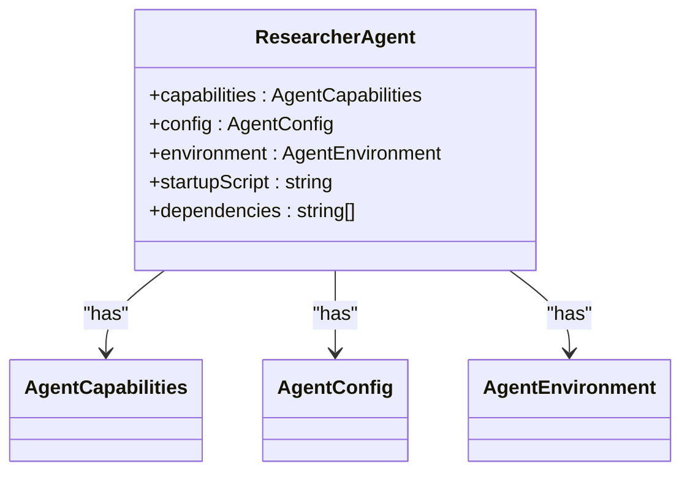

**Diagram sources**
- [agent-manager.ts](file://src/agents/agent-manager.ts#L200-L250)

**Section sources**
- [agent-manager.ts](file://src/agents/agent-manager.ts#L200-L250)

### Coder Agent
The coder agent is designed for software development tasks, including code generation, implementation, and basic debugging. This agent type has strong capabilities in code generation (0.95), testing (0.8), and debugging (0.9), with expertise in multiple programming languages including TypeScript, JavaScript, Python, and Rust. The coder agent has terminal access and git integration, enabling it to work directly with code repositories.

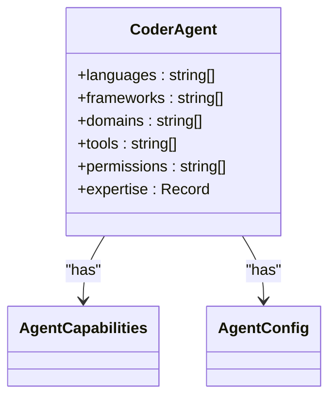

**Diagram sources**
- [agent-manager.ts](file://src/agents/agent-manager.ts#L250-L300)

**Section sources**
- [agent-manager.ts](file://src/agents/agent-manager.ts#L250-L300)

### Analyst Agent
The analyst agent specializes in data analysis, statistical processing, and visualization. This agent type has expertise in Python, R, and SQL, with capabilities in data processing, chart generation, and statistical analysis. The analyst agent is optimized for handling large datasets and generating insights through quantitative methods. It has access to specialized tools like pandas, numpy, and matplotlib for advanced data manipulation.

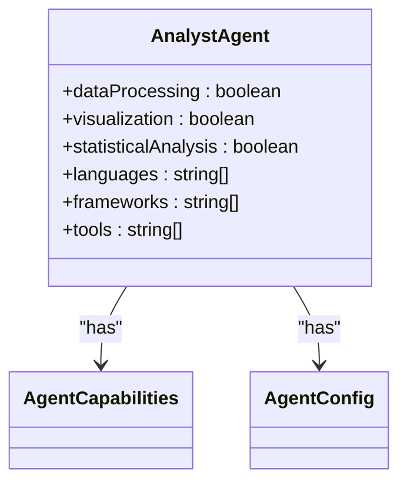

**Diagram sources**
- [agent-manager.ts](file://src/agents/agent-manager.ts#L300-L350)

**Section sources**
- [agent-manager.ts](file://src/agents/agent-manager.ts#L300-L350)

### Architect Agent
The architect agent focuses on system design, software architecture, and high-level planning. This agent type has two specialized variants: design-architect for UI/UX and component design, and system-architect for system-level architecture. The architect agent has expertise in software architecture (0.95), design (0.9), and modeling (0.85), with capabilities in diagram generation, code analysis, and API design.

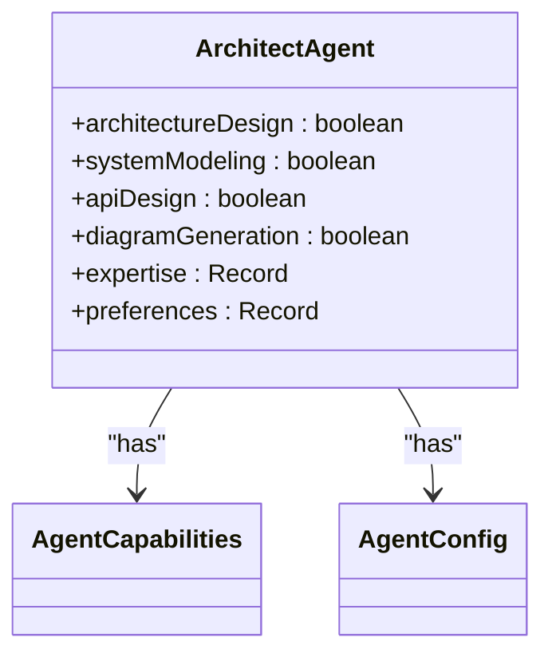

**Diagram sources**
- [agent-manager.ts](file://src/agents/agent-manager.ts#L400-L450)

**Section sources**
- [agent-manager.ts](file://src/agents/agent-manager.ts#L400-L450)

### Tester Agent
The tester agent specializes in quality assurance, testing, and validation. This agent type has capabilities in test automation, coverage analysis, and bug detection. With expertise in testing (0.9), quality assurance (0.85), and automation (0.8), the tester agent can generate comprehensive test suites and execute them across various frameworks including deno-test, jest, and cypress.

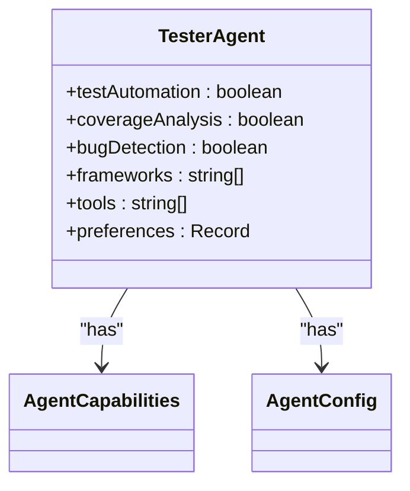

**Diagram sources**
- [agent-manager.ts](file://src/agents/agent-manager.ts#L600-L650)

**Section sources**
- [agent-manager.ts](file://src/agents/agent-manager.ts#L600-L650)

## Agent Registry and Management

### Agent Registry Implementation
The AgentRegistry class provides a centralized repository for managing agent states and capabilities. It implements methods for searching agents by capabilities, finding the best agent for a specific task, and maintaining agent statistics. The registry uses a distributed memory system for persistence and caching to ensure efficient access to agent information.

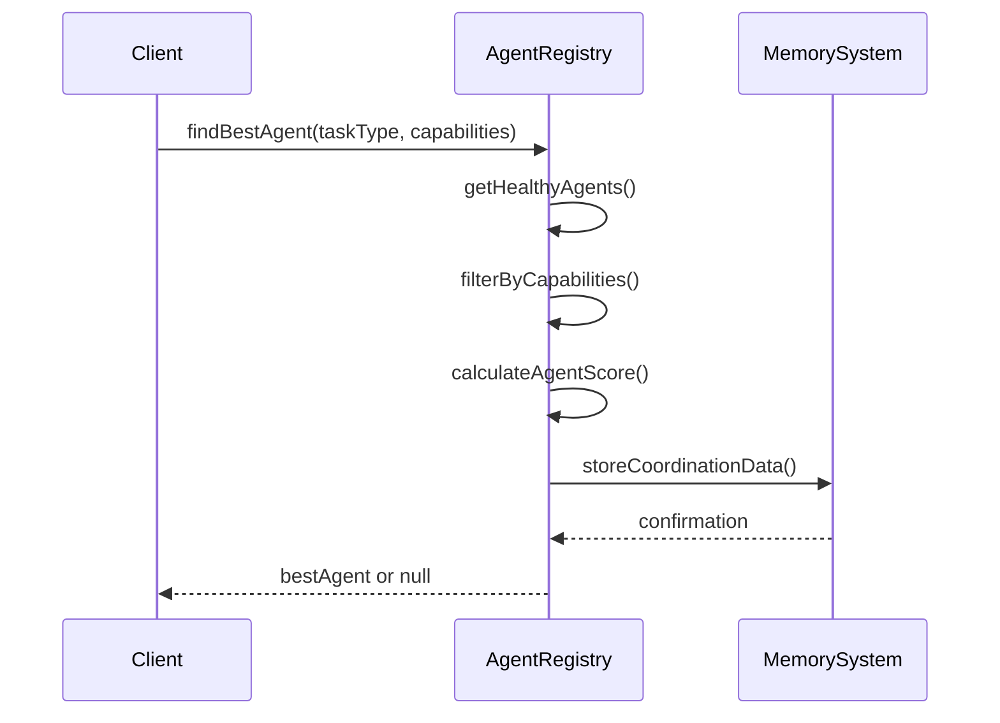

**Diagram sources**
- [agent-registry.ts](file://src/agents/agent-registry.ts#L283-L482)

**Section sources**
- [agent-registry.ts](file://src/agents/agent-registry.ts#L283-L482)

### Agent Manager Implementation
The AgentManager class is responsible for the complete lifecycle management of agents, including creation, startup, monitoring, and shutdown. It maintains agent templates, manages agent pools, and implements health monitoring and auto-restart capabilities. The manager uses event-driven architecture to respond to agent heartbeats, errors, and task assignments.

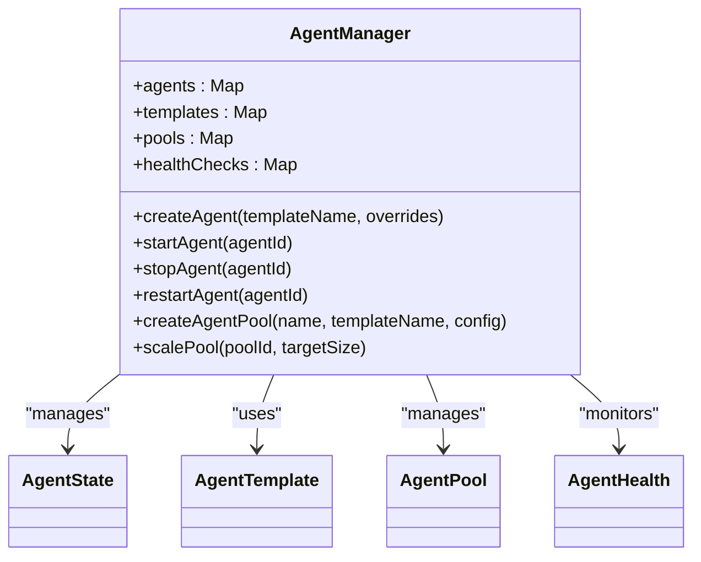

**Diagram sources**
- [agent-manager.ts](file://src/agents/agent-manager.ts#L0-L200)

**Section sources**
- [agent-manager.ts](file://src/agents/agent-manager.ts#L0-L200)

## Domain Model of Agent Specialization

### Agent Registration and Instantiation
The domain model for agent specialization begins with the registration of agent templates in the AgentManager. Each template defines the configuration, capabilities, and environment for a specific agent type. When a new agent is needed, the AgentManager uses the template to instantiate a new AgentState object with the appropriate settings.

The registration process involves defining the agent's capabilities, resource limits, and behavioral parameters. These templates are initialized during the AgentManager's setup phase, creating a repository of available agent types that can be instantiated as needed. The system supports both predefined templates and dynamic template creation, allowing for flexible agent specialization.

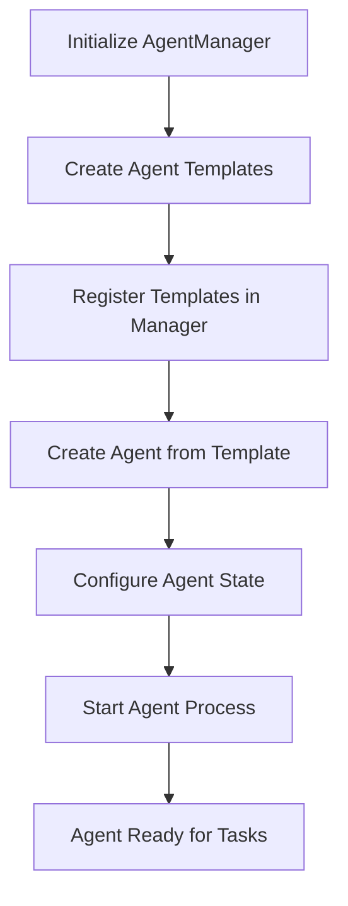

**Diagram sources**
- [agent-manager.ts](file://src/agents/agent-manager.ts#L200-L800)

**Section sources**
- [agent-manager.ts](file://src/agents/agent-manager.ts#L200-L800)

### Agent Management and Coordination
The AgentManager coordinates agent activities through a combination of event-driven communication and state management. Agents emit events for heartbeats, task assignments, and errors, which the manager listens to and responds to appropriately. This event system enables real-time monitoring and dynamic adjustment of the agent ecosystem.

The manager maintains several data structures to track agent state, including maps for agents, processes, pools, and health checks. It implements health monitoring through periodic checks of agent responsiveness, performance, reliability, and resource usage. Based on these metrics, the manager can automatically restart unhealthy agents or adjust resource allocations.

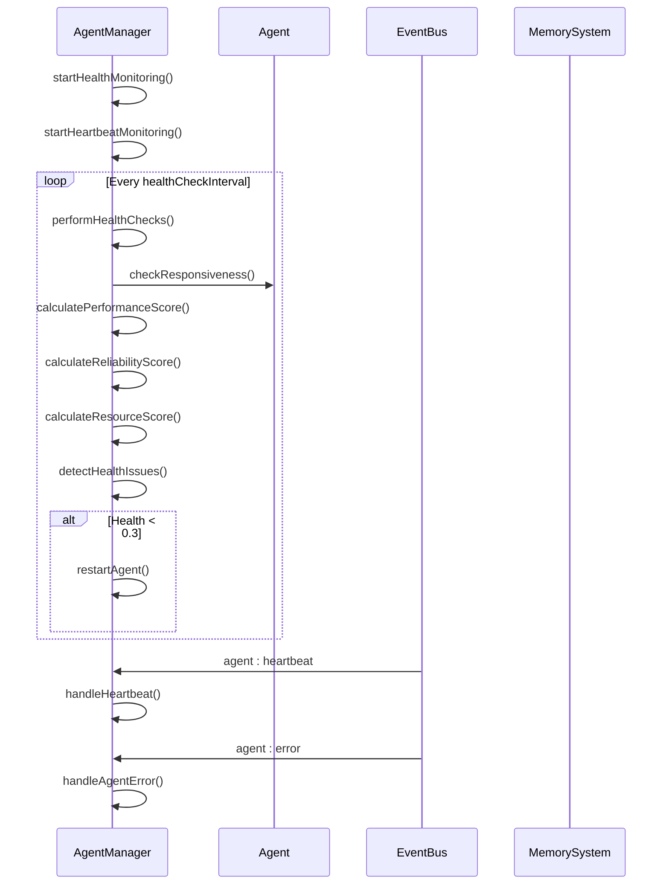

**Diagram sources**
- [agent-manager.ts](file://src/agents/agent-manager.ts#L1200-L1400)

**Section sources**
- [agent-manager.ts](file://src/agents/agent-manager.ts#L1200-L1400)

## Configuration and Performance Metrics

### Agent Configuration Options
The system provides extensive configuration options for agent behavior, allowing fine-tuning of agent performance and capabilities. Configuration parameters include autonomy level (0-1), learning and adaptation settings, resource limits, and communication intervals. These settings can be defined at the template level and overridden during agent creation.

Each agent type has specific configuration defaults optimized for its role. For example, researcher agents have higher autonomy levels (0.8) and more frequent reporting intervals, while coder agents have lower autonomy (0.6) to ensure code quality and security. The configuration system supports both global defaults and agent-specific overrides, providing flexibility in agent behavior.

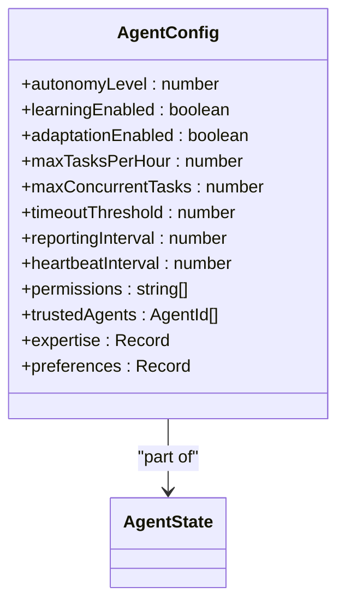

**Diagram sources**
- [types.ts](file://src/swarm/types.ts#L250-L300)

**Section sources**
- [types.ts](file://src/swarm/types.ts#L250-L300)

### Performance Metrics Collection
The system collects comprehensive performance metrics for each agent, enabling data-driven decision making and optimization. Metrics include task completion rates, execution times, resource usage, code quality, test coverage, and user satisfaction. These metrics are used to calculate agent health scores and inform task assignment decisions.

The AgentManager maintains performance history for each agent, storing the last 100 metric entries for trend analysis. This historical data enables the system to identify performance patterns, detect degradation, and make informed decisions about agent scaling and replacement. Metrics are also used in the agent scoring algorithm to determine the best agent for a given task.

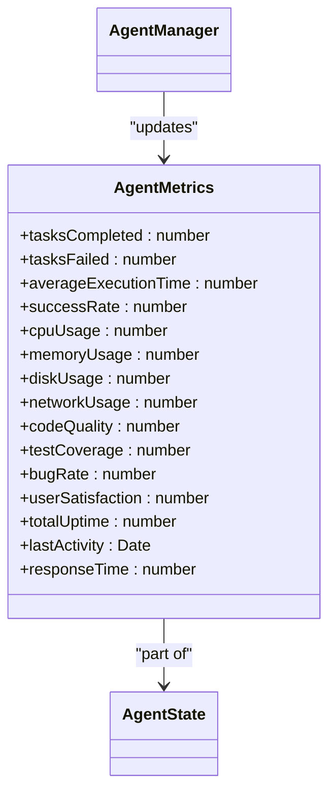

**Diagram sources**
- [types.ts](file://src/swarm/types.ts#L150-L200)

**Section sources**
- [types.ts](file://src/swarm/types.ts#L150-L200)

## Common Issues and Best Practices

### Agent Overload Prevention
Agent overload occurs when an agent's workload exceeds its capacity, leading to performance degradation and task failures. The system prevents overload through several mechanisms: workload tracking, capacity limits, and intelligent task assignment. Each agent has a maxConcurrentTasks limit defined in its capabilities, and the AgentManager tracks current workload to ensure agents are not assigned beyond their capacity.

Best practices for preventing agent overload include:
- Monitoring agent workload metrics and setting appropriate thresholds
- Using agent pools with auto-scaling to handle variable workloads
- Implementing task queuing for high-demand agent types
- Regularly reviewing and adjusting agent capacity based on performance data

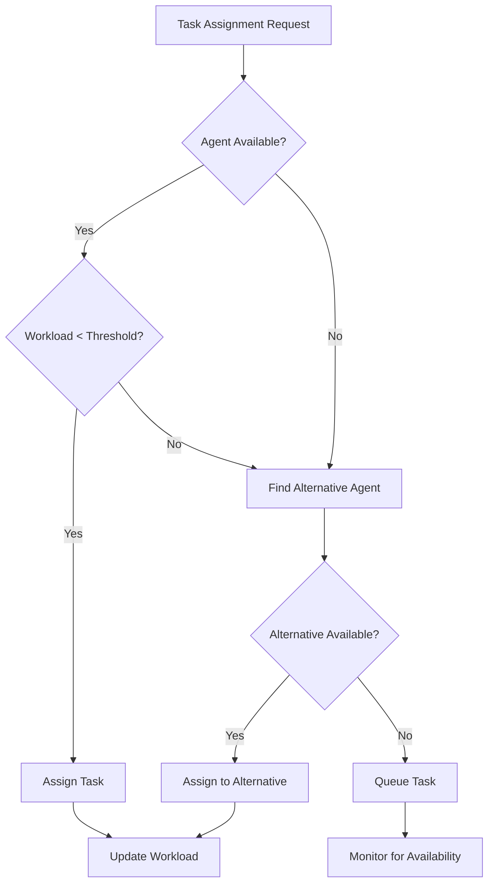

**Diagram sources**
- [agent-manager.ts](file://src/agents/agent-manager.ts#L1000-L1200)

**Section sources**
- [agent-manager.ts](file://src/agents/agent-manager.ts#L1000-L1200)

### Capability Mismatch Resolution
Capability mismatches occur when a task is assigned to an agent that lacks the necessary skills or tools to complete it successfully. The system addresses this through capability-based agent selection and comprehensive capability definitions. The findBestAgent method in AgentRegistry filters candidates by required capabilities before scoring them.

Best practices for resolving capability mismatches include:
- Defining clear capability requirements for each task type
- Maintaining up-to-date agent capability profiles
- Using the searchByCapabilities method to find suitable agents
- Implementing fallback mechanisms for when no suitable agent is available
- Regularly reviewing and updating agent templates to reflect evolving requirements

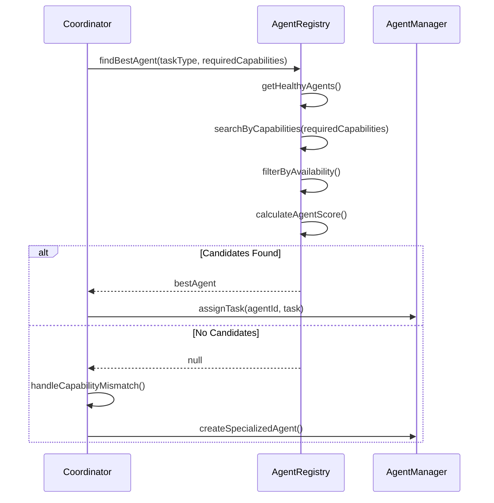

**Diagram sources**
- [agent-registry.ts](file://src/agents/agent-registry.ts#L283-L482)

**Section sources**
- [agent-registry.ts](file://src/agents/agent-registry.ts#L283-L482)