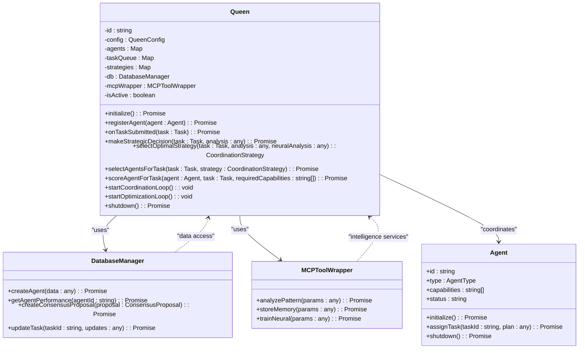
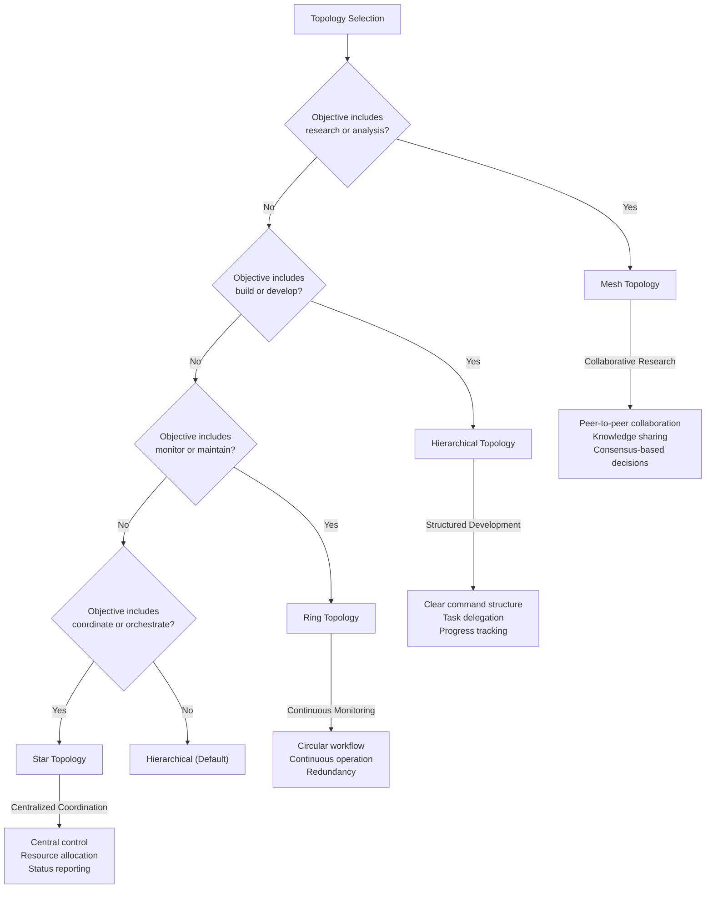

<docs>
# Core Concepts

<cite>
**Referenced Files in This Document**   
- [Queen.ts](file://src/hive-mind/core/Queen.ts) - *Updated in recent commit*
- [HiveMind.ts](file://src/hive-mind/core/HiveMind.ts) - *Updated in recent commit*
- [Agent.ts](file://src/hive-mind/core/Agent.ts) - *Updated in recent commit*
- [Memory.ts](file://src/hive-mind/core/Memory.ts) - *Updated in recent commit*
- [NeuralDomainMapper.ts](file://src/neural/NeuralDomainMapper.ts) - *Updated in recent commit*
- [event_bus.py](file://python-claude-flow/src/claude_flow/core/event_bus.py) - *Added in recent commit*
- [config_manager.py](file://python-claude-flow/src/claude_flow/core/config_manager.py) - *Added in recent commit*
</cite>

## Table of Contents
1. [Hive-Mind Intelligence](#hive-mind-intelligence)
2. [Queen-Led Coordination](#queen-led-coordination)
3. [Agent Specialization](#agent-specialization)
4. [Swarm Topologies](#swarm-topologies)
5. [Memory System](#memory-system)
6. [MCP Tools](#mcp-tools)
7. [Neural Networks](#neural-networks)
8. [Component Relationships](#component-relationships)

## Hive-Mind Intelligence

The Hive-Mind intelligence architecture represents a collective intelligence system where multiple specialized agents work together under centralized coordination to accomplish complex tasks. This architecture combines distributed problem-solving capabilities with centralized strategic decision-making, creating a hybrid model that leverages the strengths of both hierarchical and peer-to-peer organizational structures.

The core principle of the Hive-Mind is emergent intelligence—where the collective capabilities of the swarm exceed the sum of individual agent capabilities through coordinated collaboration, information sharing, and strategic task allocation. This approach enables the system to tackle complex, multi-faceted problems that would be beyond the capabilities of individual agents.

Key characteristics of the Hive-Mind intelligence include:
- **Collective problem solving**: Tasks are decomposed and distributed among specialized agents
- **Dynamic resource allocation**: Agents are assigned based on task requirements and availability
- **Knowledge sharing**: Information discovered by one agent becomes available to the entire swarm
- **Adaptive coordination**: The system adjusts its approach based on task requirements and performance feedback

The Hive-Mind operates as a self-organizing system that can adapt its structure and strategy based on the nature of the tasks it encounters, the performance of individual agents, and the overall objectives of the system.

**Section sources**
- [HiveMind.ts](file://src/hive-mind/core/HiveMind.ts#L1-L541)

## Queen-Led Coordination

The Queen class serves as the central coordination and decision-making authority within the Hive-Mind swarm. As the primary orchestrator, the Queen manages strategic planning, task allocation, and performance optimization across all agents in the swarm.

### Queen Architecture and Implementation

The Queen class implements a sophisticated coordination system that combines rule-based decision making with neural pattern analysis to determine optimal strategies for task execution.



**Diagram sources**
- [Queen.ts](file://src/hive-mind/core/Queen.ts#L1-L774)

**Section sources**
- [Queen.ts](file://src/hive-mind/core/Queen.ts#L1-L774)

### Strategic Decision-Making Process

The Queen's decision-making process follows a multi-stage approach that combines task analysis, agent evaluation, and strategic planning:

1. **Task Analysis**: When a task is submitted, the Queen analyzes its requirements, complexity, and priority using MCP neural capabilities
2. **Strategy Selection**: Based on the analysis, the Queen selects the optimal coordination strategy from its predefined strategy library
3. **Agent Selection**: The Queen evaluates available agents based on their capabilities, current workload, and historical performance
4. **Execution Planning**: The Queen creates a detailed execution plan with phase assignments, coordination points, and fallback options
5. **Decision Application**: The Queen assigns the task to selected agents and stores the decision for future learning

The Queen uses a scoring system to evaluate agents for specific tasks, considering factors such as:
- **Capability match**: Number of required capabilities the agent possesses
- **Type suitability**: How well the agent's type matches the task requirements
- **Current workload**: Preference for idle agents over busy ones
- **Historical performance**: Success rate and performance metrics from previous tasks
- **Specialty bonus**: Additional points for specialist agents on complex tasks

### Coordination Strategies

The Queen maintains a library of coordination strategies that are selected based on task requirements and swarm topology:


**Diagram sources**
- [Queen.ts](file://src/hive-mind/core/Queen.ts#L500-L550)

**Section sources**
- [Queen.ts](file://src/hive-mind/core/Queen.ts#L500-L550)

### Continuous Optimization Loops

The Queen runs two primary background loops that enable continuous improvement of swarm performance:

1. **Coordination Loop (5-second interval)**:
   - Monitors agent health and responsiveness
   - Checks task progress for signs of stalling
   - Identifies rebalancing needs based on utilization metrics
   - Handles agent failures and task reassignment

2. **Optimization Loop (1-minute interval)**:
   - Analyzes performance patterns using MCP tools
   - Optimizes coordination strategies based on effectiveness
   - Trains neural patterns on successful decisions
   - Adjusts strategy parameters based on performance data

These loops enable the Queen to maintain swarm health, prevent task stagnation, and continuously improve coordination effectiveness over time.

## Agent Specialization

The agent specialization system enables the Hive-Mind to deploy a diverse workforce of specialized agents, each optimized for specific types of tasks. This specialization allows for more efficient task execution and higher quality outcomes by matching tasks with agents that have the most relevant capabilities.

### Agent Types and Capabilities

The system supports multiple agent types, each with distinct capabilities and specializations:

```mermaid
classDiagram
class AgentFactory {
+createAgent(type : AgentType, config : Partial<AgentConfig>) : BaseAgent
+createAgents(specs : Array<{type : AgentType, count? : number}>) : BaseAgent[]
+createBalancedSwarm(size : number, strategy : string) : BaseAgent[]
+getSupportedTypes() : AgentType[]
+getAgentTypeDescriptions() : Record<AgentType, string>
}
class BaseAgent {
+id : string
+type : AgentType
+capabilities : string[]
+status : string
+initialize() : Promise<void>
+shutdown() : Promise<void>
}
BaseAgent <|-- ResearcherAgent
BaseAgent <|-- CoderAgent
BaseAgent <|-- AnalystAgent
BaseAgent <|-- ArchitectAgent
BaseAgent <|-- TesterAgent
BaseAgent <|-- CoordinatorAgent
class ResearcherAgent {
+capabilities : string[] = ["information_gathering", "pattern_recognition", "knowledge_synthesis"]
}
class CoderAgent {
+capabilities : string[] = ["code_generation", "refactoring", "debugging"]
}
class AnalystAgent {
+capabilities : string[] = ["data_analysis", "performance_metrics", "bottleneck_detection"]
}
class ArchitectAgent {
+capabilities : string[] = ["system_design", "architecture_patterns", "integration_planning"]
}
class TesterAgent {
+capabilities : string[] = ["test_generation", "quality_assurance", "edge_case_detection"]
}
class CoordinatorAgent {
+capabilities : string[] = ["task_management", "resource_allocation", "consensus_building"]
}
AgentFactory --> BaseAgent : "creates"
AgentFactory --> ResearcherAgent : "creates"
AgentFactory --> CoderAgent : "creates"
AgentFactory --> AnalystAgent : "creates"
AgentFactory --> ArchitectAgent : "creates"
AgentFactory --> TesterAgent : "creates"
AgentFactory --> CoordinatorAgent : "creates"
```

**Diagram sources**
- [index.ts](file://src/cli/agents/index.ts#L1-L399)

**Section sources**
- [index.ts](file://src/cli/agents/index.ts#L1-L399)

### Agent Factory System

The AgentFactory class provides a centralized mechanism for creating specialized agents based on type. This factory pattern ensures consistent agent creation and configuration across the system.

Key features of the AgentFactory include:

- **Type-based creation**: Creates agents of specific types (researcher, coder, analyst, etc.)
- **Batch creation**: Can create multiple agents of different types in a single operation
- **Balanced swarm generation**: Creates swarms with composition optimized for specific strategies (research, development, analysis, balanced)
- **Lifecycle management**: Integrates with AgentLifecycle for initialization and shutdown of agent groups

The factory supports both standard agent types and Maestro specs-driven agent types that follow a more structured development workflow:

**Standard Agent Types:**
- Researcher: Information gathering and knowledge synthesis
- Coder: Code generation and implementation
- Analyst: Data analysis and insights
- Architect: System design and technical planning
- Tester: Quality assurance and validation
- Coordinator: Task orchestration and team management

**Maestro Specs-Driven Agent Types:**
- Requirements Analyst: Requirements analysis and user story creation
- Design Architect: Technical design and architecture
- Task Planner: Implementation planning and workflow orchestration
- Implementation Coder: Code implementation with quality focus
- Quality Reviewer: Code review and standards enforcement
- Steering Documenter: Governance documentation and project steering

### Specialization-Based Task Assignment

The system uses agent specialization to optimize task assignment through a scoring mechanism that evaluates how well an agent's capabilities match task requirements. The scoring algorithm considers:

1. **Capability matching**: Each matching capability adds 10 points to the agent's score
2. **Type suitability**: Agents receive additional points based on how well their type matches the task type (research, development, analysis, etc.)
3. **Workload preference**: Idle agents receive 8 points, active agents receive 4 points
4. **Performance history**: Agents gain points based on their historical success rate
5. **Specialist bonus**: Specialist agents receive 5 additional points for tasks requiring multiple capabilities

This scoring system ensures that tasks are assigned to the most qualified agents while maintaining balanced workload distribution across the swarm.

## Swarm Topologies

The swarm topology system enables the Hive-Mind to adapt its organizational structure based on the nature of the tasks it needs to accomplish. Different topologies provide distinct advantages for different types of work, allowing the system to optimize its coordination approach for maximum effectiveness.

### Supported Topology Types

The system supports five primary swarm topologies, each designed for specific use cases:



**Diagram sources**
- [core.js](file://src/cli/simple-commands/hive-mind/core.js#L173-L214)

**Section sources**
- [core.js](file://src/cli/simple-commands/hive-mind/core.js#L173-L214)
- [HiveMind.ts](file://src/hive-mind/core/HiveMind.ts#L200-L250)

### Topology Selection Logic

The system uses heuristic-based topology selection to automatically determine the optimal structure based on the swarm's objective:

- **Mesh Topology**: Selected for research and analysis objectives, enabling peer-to-peer collaboration and knowledge sharing among agents
- **Hierarchical Topology**: Chosen for build and development objectives, providing a clear command structure with task delegation and progress tracking
- **Ring Topology**: Used for monitoring and maintenance objectives, creating a circular workflow that ensures continuous operation
- **Star Topology**: Applied for coordination and orchestration objectives, centralizing control and resource allocation
- **Default**: Hierarchical topology is used when no clear objective match is found

This automatic selection ensures that the swarm is optimally structured for its intended purpose without requiring manual configuration.

### Topology-Specific Agent Configurations

Each topology has a predefined agent configuration that determines the types and quantities of agents spawned:

**Hierarchical Topology:**
- 1 Coordinator
- 2 Researchers
- 2 Coders
- 1 Analyst
- 1 Tester

**Mesh Topology:**
- 2 Coordinators
- 2 Researchers
- 2 Coders
- 2 Specialists

**Ring Topology:**
- 1 Coordinator
- 3 Coders
- 2 Reviewers

**Star Topology:**
- 1 Coordinator
- 4 Specialists

**Maestro Specs-Driven Topology:**
- 1 Requirements Analyst
- 2 Design Architects
- 1 Task Planner
- 2 Implementation Coders
- 1 Quality Reviewer
- 1 Steering Documenter

These configurations ensure that each topology has the appropriate mix of capabilities to effectively execute its intended use cases.

## Memory System

The memory system provides a distributed, persistent storage solution that enables information sharing and knowledge retention across the Hive-Mind swarm. This system serves as the collective memory of the swarm, allowing agents to access information discovered by other agents and building upon previous work.

### Memory Architecture

The memory system is implemented as a layered architecture with multiple components working together:

```mermaid
classDiagram
class MemoryManager {
-backend : IMemoryBackend
-cache : MemoryCache
-indexer : MemoryIndexer
-banks : Map<string, MemoryBank>
-initialized : boolean
+initialize() : Promise<void>
+shutdown() : Promise<void>
+createBank(agentId : string) : Promise<string>
+store(id : string, entry : MemoryEntry) : Promise<void>
+retrieve(id : string) : Promise<MemoryEntry | undefined>
+query(query : MemoryQuery) : Promise<MemoryEntry[]>
+update(id : string, updates : Partial<MemoryEntry>) : Promise<void>
+delete(id : string) : Promise<void>
}
class IMemoryBackend {
<<interface>>
+initialize() : Promise<void>
+shutdown() : Promise<void>
+store(entry : MemoryEntry) : Promise<void>
+retrieve(id : string) : Promise<MemoryEntry | undefined>
+update(id : string, entry : MemoryEntry) : Promise<void>
+delete(id : string) : Promise<void>
+query(query : MemoryQuery) : Promise<MemoryEntry[]>
+getAllEntries() : Promise<MemoryEntry[]>
}
class MemoryCache {
-max