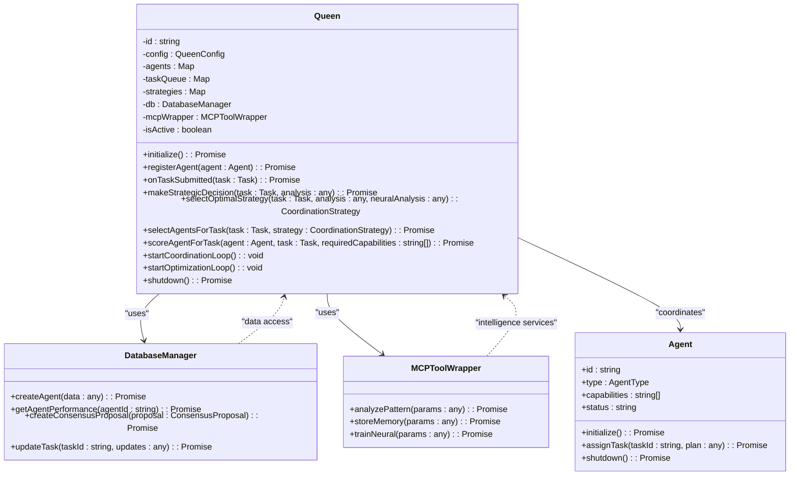
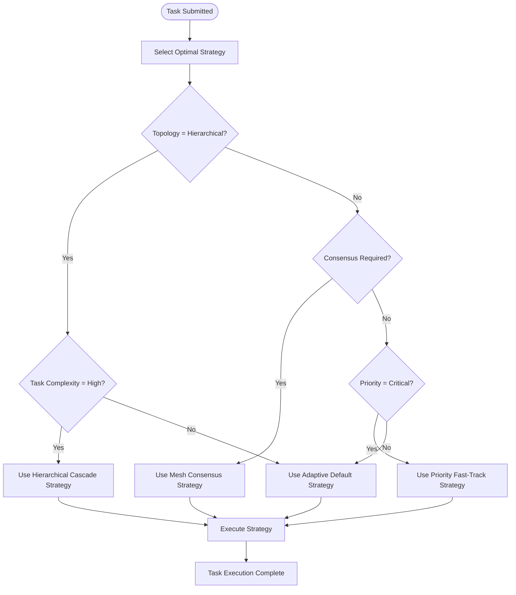
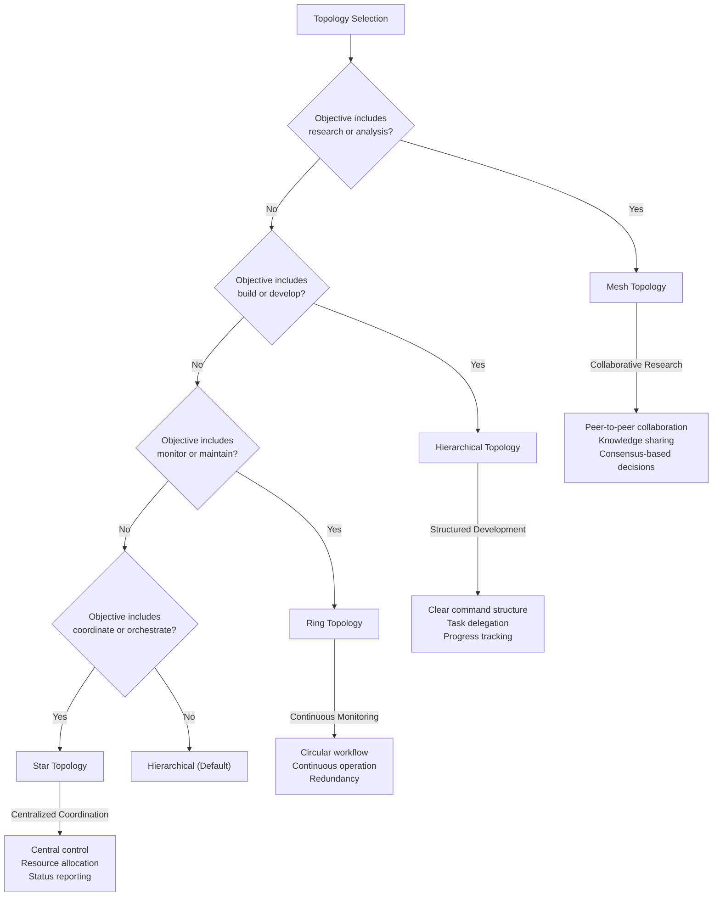
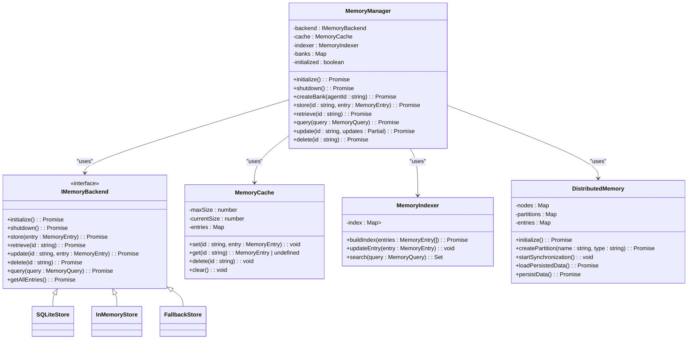
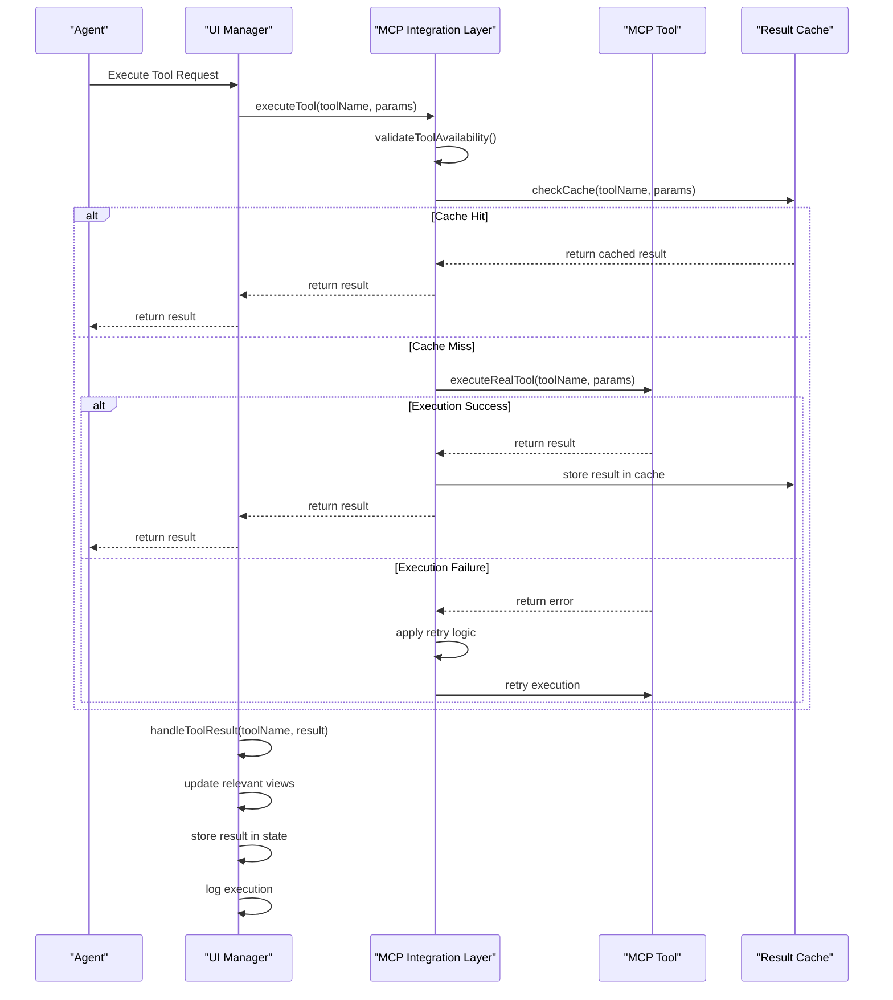
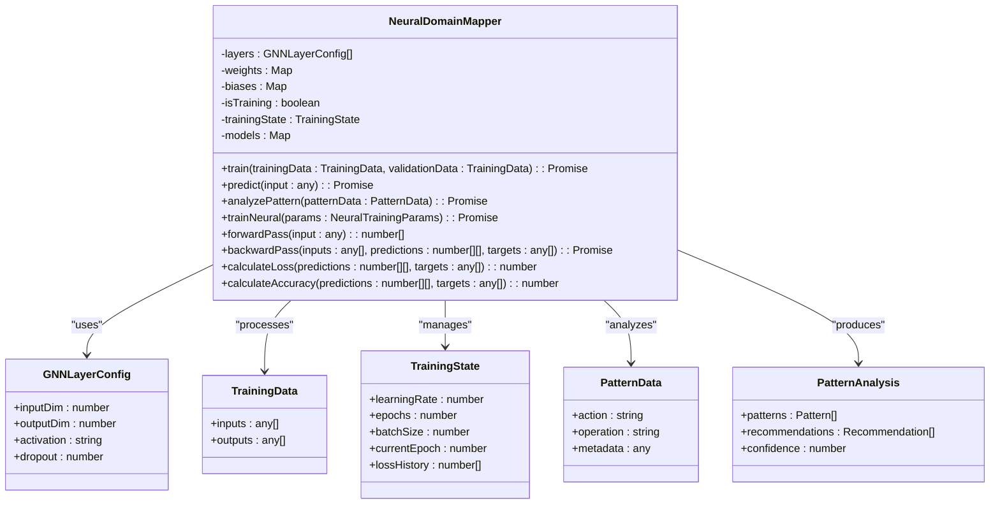
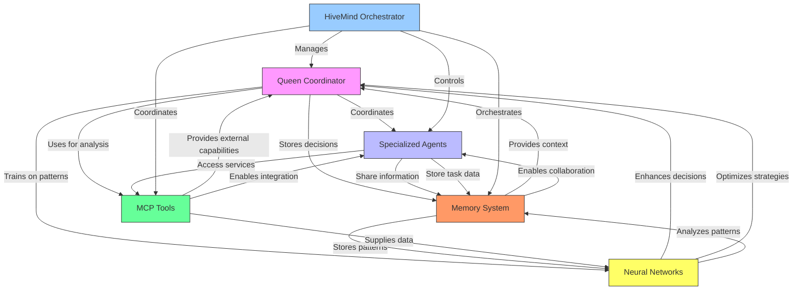

# Core Concepts

<cite>
**Referenced Files in This Document**   
- [Queen.ts](file://src/hive-mind/core/Queen.ts)
- [HiveMind.ts](file://src/hive-mind/core/HiveMind.ts)
- [Agent.ts](file://src/hive-mind/core/Agent.ts)
- [Memory.ts](file://src/hive-mind/core/Memory.ts)
- [mcp-wrapper.js](file://src/cli/simple-commands/hive-mind/mcp-wrapper.js)
- [core.js](file://src/cli/simple-commands/hive-mind/core.js)
- [manager.ts](file://src/memory/manager.ts)
- [distributed-memory.ts](file://src/memory/distributed-memory.ts)
- [NeuralDomainMapper.ts](file://src/neural/NeuralDomainMapper.ts)
- [index.ts](file://src/cli/agents/index.ts)
</cite>

## Table of Contents
1. [Hive-Mind Intelligence](#hive-mind-intelligence)
2. [Queen-Led Coordination](#queen-led-coordination)
3. [Agent Specialization](#agent-specialization)
4. [Swarm Topologies](#swarm-topologies)
5. [Memory System](#memory-system)
6. [MCP Tools](#mcp-tools)
7. [Neural Networks](#neural-networks)
8. [Component Relationships](#component-relationships)

## Hive-Mind Intelligence

The Hive-Mind intelligence architecture represents a collective intelligence system where multiple specialized agents work together under centralized coordination to accomplish complex tasks. This architecture combines distributed problem-solving capabilities with centralized strategic decision-making, creating a hybrid model that leverages the strengths of both hierarchical and peer-to-peer organizational structures.

The core principle of the Hive-Mind is emergent intelligence—where the collective capabilities of the swarm exceed the sum of individual agent capabilities through coordinated collaboration, information sharing, and strategic task allocation. This approach enables the system to tackle complex, multi-faceted problems that would be beyond the capabilities of individual agents.

Key characteristics of the Hive-Mind intelligence include:
- **Collective problem solving**: Tasks are decomposed and distributed among specialized agents
- **Dynamic resource allocation**: Agents are assigned based on task requirements and availability
- **Knowledge sharing**: Information discovered by one agent becomes available to the entire swarm
- **Adaptive coordination**: The system adjusts its approach based on task requirements and performance feedback

The Hive-Mind operates as a self-organizing system that can adapt its structure and strategy based on the nature of the tasks it encounters, the performance of individual agents, and the overall objectives of the system.

**Section sources**
- [HiveMind.ts](file://src/hive-mind/core/HiveMind.ts#L1-L541)

## Queen-Led Coordination

The Queen class serves as the central coordination and decision-making authority within the Hive-Mind swarm. As the primary orchestrator, the Queen manages strategic planning, task allocation, and performance optimization across all agents in the swarm.

### Queen Architecture and Implementation

The Queen class implements a sophisticated coordination system that combines rule-based decision making with neural pattern analysis to determine optimal strategies for task execution.



**Diagram sources**
- [Queen.ts](file://src/hive-mind/core/Queen.ts#L1-L774)

**Section sources**
- [Queen.ts](file://src/hive-mind/core/Queen.ts#L1-L774)

### Strategic Decision-Making Process

The Queen's decision-making process follows a multi-stage approach that combines task analysis, agent evaluation, and strategic planning:

1. **Task Analysis**: When a task is submitted, the Queen analyzes its requirements, complexity, and priority using MCP neural capabilities
2. **Strategy Selection**: Based on the analysis, the Queen selects the optimal coordination strategy from its predefined strategy library
3. **Agent Selection**: The Queen evaluates available agents based on their capabilities, current workload, and historical performance
4. **Execution Planning**: The Queen creates a detailed execution plan with phase assignments, coordination points, and fallback options
5. **Decision Application**: The Queen assigns the task to selected agents and stores the decision for future learning

The Queen uses a scoring system to evaluate agents for specific tasks, considering factors such as:
- **Capability match**: Number of required capabilities the agent possesses
- **Type suitability**: How well the agent's type matches the task requirements
- **Current workload**: Preference for idle agents over busy ones
- **Historical performance**: Success rate and performance metrics from previous tasks
- **Specialty bonus**: Additional points for specialist agents on complex tasks

### Coordination Strategies

The Queen maintains a library of coordination strategies that are selected based on task requirements and swarm topology:



**Diagram sources**
- [Queen.ts](file://src/hive-mind/core/Queen.ts#L500-L550)

**Section sources**
- [Queen.ts](file://src/hive-mind/core/Queen.ts#L500-L550)

### Continuous Optimization Loops

The Queen runs two primary background loops that enable continuous improvement of swarm performance:

1. **Coordination Loop (5-second interval)**:
   - Monitors agent health and responsiveness
   - Checks task progress for signs of stalling
   - Identifies rebalancing needs based on utilization metrics
   - Handles agent failures and task reassignment

2. **Optimization Loop (1-minute interval)**:
   - Analyzes performance patterns using MCP tools
   - Optimizes coordination strategies based on effectiveness
   - Trains neural patterns on successful decisions
   - Adjusts strategy parameters based on performance data

These loops enable the Queen to maintain swarm health, prevent task stagnation, and continuously improve coordination effectiveness over time.

## Agent Specialization

The agent specialization system enables the Hive-Mind to deploy a diverse workforce of specialized agents, each optimized for specific types of tasks. This specialization allows for more efficient task execution and higher quality outcomes by matching tasks with agents that have the most relevant capabilities.

### Agent Types and Capabilities

The system supports multiple agent types, each with distinct capabilities and specializations:

```mermaid
classDiagram
class AgentFactory {
+createAgent(type : AgentType, config : Partial<AgentConfig>) : BaseAgent
+createAgents(specs : Array<{type : AgentType, count? : number}>) : BaseAgent[]
+createBalancedSwarm(size : number, strategy : string) : BaseAgent[]
+getSupportedTypes() : AgentType[]
+getAgentTypeDescriptions() : Record<AgentType, string>
}
class BaseAgent {
+id : string
+type : AgentType
+capabilities : string[]
+status : string
+initialize() : Promise<void>
+shutdown() : Promise<void>
}
BaseAgent <|-- ResearcherAgent
BaseAgent <|-- CoderAgent
BaseAgent <|-- AnalystAgent
BaseAgent <|-- ArchitectAgent
BaseAgent <|-- TesterAgent
BaseAgent <|-- CoordinatorAgent
class ResearcherAgent {
+capabilities : string[] = ["information_gathering", "pattern_recognition", "knowledge_synthesis"]
}
class CoderAgent {
+capabilities : string[] = ["code_generation", "refactoring", "debugging"]
}
class AnalystAgent {
+capabilities : string[] = ["data_analysis", "performance_metrics", "bottleneck_detection"]
}
class ArchitectAgent {
+capabilities : string[] = ["system_design", "architecture_patterns", "integration_planning"]
}
class TesterAgent {
+capabilities : string[] = ["test_generation", "quality_assurance", "edge_case_detection"]
}
class CoordinatorAgent {
+capabilities : string[] = ["task_management", "resource_allocation", "consensus_building"]
}
AgentFactory --> BaseAgent : "creates"
AgentFactory --> ResearcherAgent : "creates"
AgentFactory --> CoderAgent : "creates"
AgentFactory --> AnalystAgent : "creates"
AgentFactory --> ArchitectAgent : "creates"
AgentFactory --> TesterAgent : "creates"
AgentFactory --> CoordinatorAgent : "creates"
```

**Diagram sources**
- [index.ts](file://src/cli/agents/index.ts#L1-L399)

**Section sources**
- [index.ts](file://src/cli/agents/index.ts#L1-L399)

### Agent Factory System

The AgentFactory class provides a centralized mechanism for creating specialized agents based on type. This factory pattern ensures consistent agent creation and configuration across the system.

Key features of the AgentFactory include:

- **Type-based creation**: Creates agents of specific types (researcher, coder, analyst, etc.)
- **Batch creation**: Can create multiple agents of different types in a single operation
- **Balanced swarm generation**: Creates swarms with composition optimized for specific strategies (research, development, analysis, balanced)
- **Lifecycle management**: Integrates with AgentLifecycle for initialization and shutdown of agent groups

The factory supports both standard agent types and Maestro specs-driven agent types that follow a more structured development workflow:

**Standard Agent Types:**
- Researcher: Information gathering and knowledge synthesis
- Coder: Code generation and implementation
- Analyst: Data analysis and insights
- Architect: System design and technical planning
- Tester: Quality assurance and validation
- Coordinator: Task orchestration and team management

**Maestro Specs-Driven Agent Types:**
- Requirements Analyst: Requirements analysis and user story creation
- Design Architect: Technical design and architecture
- Task Planner: Implementation planning and workflow orchestration
- Implementation Coder: Code implementation with quality focus
- Quality Reviewer: Code review and standards enforcement
- Steering Documenter: Governance documentation and project steering

### Specialization-Based Task Assignment

The system uses agent specialization to optimize task assignment through a scoring mechanism that evaluates how well an agent's capabilities match task requirements. The scoring algorithm considers:

1. **Capability matching**: Each matching capability adds 10 points to the agent's score
2. **Type suitability**: Agents receive additional points based on how well their type matches the task type (research, development, analysis, etc.)
3. **Workload preference**: Idle agents receive 8 points, active agents receive 4 points
4. **Performance history**: Agents gain points based on their historical success rate
5. **Specialist bonus**: Specialist agents receive 5 additional points for tasks requiring multiple capabilities

This scoring system ensures that tasks are assigned to the most qualified agents while maintaining balanced workload distribution across the swarm.

## Swarm Topologies

The swarm topology system enables the Hive-Mind to adapt its organizational structure based on the nature of the tasks it needs to accomplish. Different topologies provide distinct advantages for different types of work, allowing the system to optimize its coordination approach for maximum effectiveness.

### Supported Topology Types

The system supports five primary swarm topologies, each designed for specific use cases:



**Diagram sources**
- [core.js](file://src/cli/simple-commands/hive-mind/core.js#L173-L214)

**Section sources**
- [core.js](file://src/cli/simple-commands/hive-mind/core.js#L173-L214)
- [HiveMind.ts](file://src/hive-mind/core/HiveMind.ts#L200-L250)

### Topology Selection Logic

The system uses heuristic-based topology selection to automatically determine the optimal structure based on the swarm's objective:

- **Mesh Topology**: Selected for research and analysis objectives, enabling peer-to-peer collaboration and knowledge sharing among agents
- **Hierarchical Topology**: Chosen for build and development objectives, providing a clear command structure with task delegation and progress tracking
- **Ring Topology**: Used for monitoring and maintenance objectives, creating a circular workflow that ensures continuous operation
- **Star Topology**: Applied for coordination and orchestration objectives, centralizing control and resource allocation
- **Default**: Hierarchical topology is used when no clear objective match is found

This automatic selection ensures that the swarm is optimally structured for its intended purpose without requiring manual configuration.

### Topology-Specific Agent Configurations

Each topology has a predefined agent configuration that determines the types and quantities of agents spawned:

**Hierarchical Topology:**
- 1 Coordinator
- 2 Researchers
- 2 Coders
- 1 Analyst
- 1 Tester

**Mesh Topology:**
- 2 Coordinators
- 2 Researchers
- 2 Coders
- 2 Specialists

**Ring Topology:**
- 1 Coordinator
- 3 Coders
- 2 Reviewers

**Star Topology:**
- 1 Coordinator
- 4 Specialists

**Maestro Specs-Driven Topology:**
- 1 Requirements Analyst
- 2 Design Architects
- 1 Task Planner
- 2 Implementation Coders
- 1 Quality Reviewer
- 1 Steering Documenter

These configurations ensure that each topology has the appropriate mix of capabilities to effectively execute its intended use cases.

## Memory System

The memory system provides a distributed, persistent storage solution that enables information sharing and knowledge retention across the Hive-Mind swarm. This system serves as the collective memory of the swarm, allowing agents to access information discovered by other agents and building upon previous work.

### Memory Architecture

The memory system is implemented as a layered architecture with multiple components working together:



**Diagram sources**
- [manager.ts](file://src/memory/manager.ts#L37-L315)
- [distributed-memory.ts](file://src/memory/distributed-memory.ts#L190-L241)

**Section sources**
- [manager.ts](file://src/memory/manager.ts#L37-L315)
- [distributed-memory.ts](file://src/memory/distributed-memory.ts#L190-L241)

### Memory Components

The memory system consists of several key components that work together to provide efficient, reliable storage:

**MemoryManager**: The primary interface for memory operations, responsible for:
- Initializing and shutting down the memory system
- Coordinating between backend storage, caching, and indexing
- Managing memory banks for individual agents
- Handling memory operations (store, retrieve, query, update, delete)

**IMemoryBackend**: An interface that defines the contract for memory storage backends, allowing for pluggable storage implementations:
- SQLiteStore: Persistent storage using SQLite database
- InMemoryStore: High-performance storage for temporary data
- FallbackStore: Backup storage for critical data

**MemoryCache**: A high-speed cache layer that improves performance by:
- Storing frequently accessed entries in memory
- Reducing database queries for common operations
- Automatically managing cache size and eviction

**MemoryIndexer**: A search and retrieval optimization component that:
- Builds indexes on memory entries for fast searching
- Supports complex queries with filtering and sorting
- Maintains relationships between related entries

**DistributedMemory**: A distributed storage system that:
- Partitions data across multiple nodes
- Handles synchronization between nodes
- Provides fault tolerance and redundancy
- Supports data persistence to disk

### Memory Operations and API

The memory system provides a comprehensive API for storing and retrieving information:

**Core Methods:**
- `initialize()`: Initialize the database and caching system
- `store(key, value, options)`: Store a value with optional namespace, TTL, tags
- `retrieve(key, namespace)`: Get a value by key and namespace
- `list(namespace, options)`: List entries in a namespace
- `delete(key, namespace)`: Delete a specific entry
- `clear(namespace)`: Clear all entries in a namespace
- `search(options)`: Search entries by pattern, tags, or namespace
- `getStats()`: Get memory statistics
- `backup(filepath)`: Backup the database
- `close()`: Close database connection

**Swarm-Specific Methods:**
- `storeAgent(agentId, data)`: Store agent information
- `getAgent(agentId)`: Retrieve agent data
- `listAgents(filter)`: List agents with optional filtering
- `storeTask(taskId, data)`: Store task information
- `updateTaskStatus(taskId, status, result)`: Update task progress
- `getTask(taskId)`: Retrieve task data
- `storeCommunication(from, to, message)`: Log agent communication
- `storeConsensus(id, decision)`: Store consensus decision
- `exportSwarmState()`: Export complete swarm state
- `importSwarmState(state)`: Import swarm state

The memory system also emits events to notify the system of important memory operations:
- `initialized`: Database initialized
- `stored`: Data stored successfully
- `deleted`: Data deleted
- `error`: Error occurred
- `gc`: Garbage collection completed

## MCP Tools

The MCP (Management Control Panel) tools system provides a framework for integrating external services and advanced capabilities into the Hive-Mind swarm. These tools enable agents to access specialized functionality beyond their core capabilities, expanding the swarm's overall problem-solving capacity.

### MCP Integration Architecture

The MCP tools system is implemented as a layered integration framework that provides secure, reliable access to external services:



**Diagram sources**
- [MCPIntegrationLayer.js](file://src/ui/web-ui/core/MCPIntegrationLayer.js#L369-L419)
- [UIManager.js](file://src/ui/web-ui/core/UIManager.js#L327-L375)

**Section sources**
- [MCPIntegrationLayer.js](file://src/ui/web-ui/core/MCPIntegrationLayer.js#L369-L419)
- [UIManager.js](file://src/ui/web-ui/core/UIManager.js#L327-L375)

### MCP Tool Execution Process

The MCP tool execution process follows a robust pattern that ensures reliability and performance:

1. **Initialization**: The MCP Integration Layer initializes and discovers available tools, categorizing them for easy access
2. **Execution Request**: When a tool is requested, the system first checks if it's already executing to prevent duplicates
3. **Cache Check**: The system checks the result cache to avoid redundant executions of identical requests
4. **Execution**: If not cached, the tool is executed through the MCP server with full error handling and retry logic
5. **Result Processing**: The result is stored in the cache, relevant views are updated, and the execution is logged
6. **Error Handling**: If execution fails, retry mechanisms and circuit breakers prevent cascading failures

The system supports parallel execution of multiple MCP tools, allowing for efficient integration with multiple services simultaneously. This is particularly useful for batch operations and comprehensive system checks.

### MCP Tool Categories

MCP tools are organized into categories based on their functionality, making it easier to discover and use appropriate tools for specific tasks:

- **System Monitoring**: Tools for checking system status, performance metrics, and health indicators
- **Data Integration**: Tools for connecting to databases, APIs, and external data sources
- **Security**: Tools for authentication, authorization, and security validation
- **Development**: Tools for code analysis, testing, and deployment
- **Analytics**: Tools for data processing, pattern detection, and insight generation
- **Communication**: Tools for messaging, notifications, and collaboration

The template documentation shows specific examples of MCP tool usage, including parallel execution of server status checks across multiple services, demonstrating the system's capability for batch operations and efficient resource utilization.

## Neural Networks

The neural network system provides advanced pattern recognition, decision optimization, and learning capabilities to the Hive-Mind swarm. These neural capabilities are integrated throughout the system to enhance strategic decision-making, improve coordination effectiveness, and enable continuous learning from experience.

### Neural Domain Mapper Implementation

The NeuralDomainMapper class implements a neural network system that can be trained on successful patterns and used for strategic analysis:



**Diagram sources**
- [NeuralDomainMapper.ts](file://src/neural/NeuralDomainMapper.ts#L1056-L1470)

**Section sources**
- [NeuralDomainMapper.ts](file://src/neural/NeuralDomainMapper.ts#L1056-L1470)

### Neural Network Architecture

The neural network implementation features a flexible architecture that supports various layer types and activation functions:

**Layer Configuration:**
- Configurable input and output dimensions
- Multiple activation functions (ReLU, Tanh, Sigmoid, GELU, Swish)
- Dropout support for regularization during training
- Customizable learning rate and training parameters

**Activation Functions:**
- **ReLU**: f(x) = max(0, x) - Standard rectifier function
- **Tanh**: f(x) = tanh(x) - Hyperbolic tangent
- **Sigmoid**: f(x) = 1 / (1 + exp(-x)) - Logistic function
- **GELU**: f(x) = 0.5 * x * (1 + tanh(√(2/π) * (x + 0.044715 * x³))) - Gaussian Error Linear Unit
- **Swish**: f(x) = x / (1 + exp(-x)) - Self-gated activation function

The network uses a standard feedforward architecture with backpropagation for training, implementing the following key methods:

- **Forward Pass**: Processes input through each layer, applying weights, biases, and activation functions
- **Backward Pass**: Calculates gradients and updates weights using gradient descent
- **Loss Calculation**: Uses mean squared error for regression tasks
- **Accuracy Calculation**: Implements threshold-based accuracy for regression outputs

### Neural Integration in Swarm Operations

The neural capabilities are deeply integrated into the swarm's decision-making and optimization processes:

**Strategic Decision Support:**
- The Queen uses neural analysis to inform strategic decisions about task execution
- Neural pattern analysis helps select optimal coordination strategies based on task requirements
- Confidence scores from neural predictions inform risk assessment and fallback planning

**Performance Optimization:**
- The Queen's optimization loop uses neural analysis to identify performance patterns
- Successful coordination patterns are used to train the neural network, creating a feedback loop for continuous improvement
- Neural recommendations guide strategy adjustments and parameter tuning

**Learning and Adaptation:**
- The system trains neural models on successful decisions and coordination patterns
- Historical performance data is used to improve agent selection and task assignment
- The swarm adapts its behavior based on neural insights into what approaches work best for different types of tasks

This integration creates a self-improving system where the swarm becomes more effective over time as it learns from experience and refines its coordination strategies through neural analysis.

## Component Relationships

The core components of Claude-Flow work together in a coordinated architecture that enables sophisticated swarm intelligence. The relationships between these components create a system greater than the sum of its parts, with each component playing a specific role in the overall functionality.



**Diagram sources**
- [HiveMind.ts](file://src/hive-mind/core/HiveMind.ts#L1-L541)
- [Queen.ts](file://src/hive-mind/core/Queen.ts#L1-L774)
- [manager.ts](file://src/memory/manager.ts#L37-L315)
- [MCPIntegrationLayer.js](file://src/ui/web-ui/core/MCPIntegrationLayer.js#L369-L419)
- [NeuralDomainMapper.ts](file://src/neural/NeuralDomainMapper.ts#L1056-L1470)

**Section sources**
- [HiveMind.ts](file://src/hive-mind/core/HiveMind.ts#L1-L541)
- [Queen.ts](file://src/hive-mind/core/Queen.ts#L1-L774)
- [manager.ts](file://src/memory/manager.ts#L37-L315)
- [MCPIntegrationLayer.js](file://src/ui/web-ui/core/MCPIntegrationLayer.js#L369-L419)
- [NeuralDomainMapper.ts](file://src/neural/NeuralDomainMapper.ts#L1056-L1470)

The HiveMind class serves as the top-level orchestrator, initializing and coordinating all core components. It creates the Queen coordinator, initializes the memory system, sets up communication channels, and manages the overall swarm lifecycle.

The Queen acts as the central intelligence, making strategic decisions about task allocation and coordination. It leverages MCP tools for external service integration and neural network capabilities for advanced pattern analysis. The Queen's decisions are informed by data stored in the memory system and its own analysis of agent capabilities and task requirements.

Specialized agents execute tasks according to the Queen's directives, storing their work products and findings in the shared memory system. This creates a collaborative environment where knowledge is shared across the swarm, enabling agents to build upon each other's work.

The memory system serves as the collective knowledge base, storing information about agents, tasks, decisions, and domain knowledge. This shared memory enables continuity across sessions and allows the swarm to learn from past experiences.

MCP tools extend the capabilities of the swarm by providing access to external services and specialized functionality. These tools are integrated throughout the system, allowing both the Queen and individual agents to leverage external resources.

Neural networks provide advanced pattern recognition and learning capabilities, analyzing successful coordination patterns and improving decision-making over time. The system uses neural analysis to optimize strategies, predict outcomes, and identify performance bottlenecks.

Together, these components create a sophisticated swarm intelligence system that can adapt to complex tasks, learn from experience, and continuously improve its performance through coordinated collaboration and strategic optimization.