# Hive-Mind Intelligence

<cite>
**Referenced Files in This Document**   
- [HiveMind.ts](file://src/hive-mind/core/HiveMind.ts)
- [types.ts](file://src/hive-mind/types.ts)
- [Queen.ts](file://src/hive-mind/core/Queen.ts)
- [Agent.ts](file://src/hive-mind/core/Agent.ts)
- [SwarmOrchestrator.ts](file://src/hive-mind/integration/SwarmOrchestrator.ts)
- [ConsensusEngine.ts](file://src/hive-mind/integration/ConsensusEngine.ts)
</cite>

## Table of Contents
1. [Introduction](#introduction)
2. [Core Components](#core-components)
3. [Architecture Overview](#architecture-overview)
4. [Swarm Topology Management](#swarm-topology-management)
5. [Configuration Options](#configuration-options)
6. [Task Distribution and Orchestration](#task-distribution-and-orchestration)
7. [Data Flow Patterns](#data-flow-patterns)
8. [System Monitoring and Status](#system-monitoring-and-status)
9. [Failure Recovery and Resilience](#failure-recovery-and-resilience)
10. [Practical Examples](#practical-examples)

## Introduction
The Hive-Mind Intelligence system serves as the central orchestration framework for the Claude-Flow swarm architecture. This document provides a comprehensive analysis of the HiveMind class, which functions as the primary orchestrator for managing swarm lifecycle, task distribution, and system monitoring. The Hive-Mind system enables coordinated collective intelligence through a sophisticated network of specialized agents working under centralized or distributed governance. This documentation details the implementation of various swarm topologies, configuration options for swarm behavior, and the mechanisms for task assignment, load balancing, and failure recovery.

## Core Components

The Hive-Mind Intelligence system comprises several core components that work together to create a cohesive swarm orchestration framework. At the heart of this system is the HiveMind class, which extends EventEmitter to facilitate event-driven communication between components.

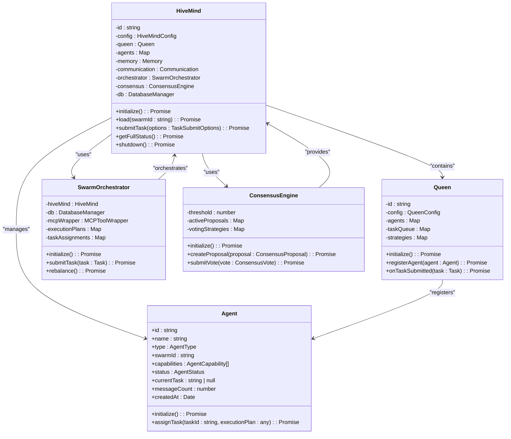

**Diagram sources**
- [HiveMind.ts](file://src/hive-mind/core/HiveMind.ts)
- [Queen.ts](file://src/hive-mind/core/Queen.ts)
- [Agent.ts](file://src/hive-mind/core/Agent.ts)
- [SwarmOrchestrator.ts](file://src/hive-mind/integration/SwarmOrchestrator.ts)
- [ConsensusEngine.ts](file://src/hive-mind/integration/ConsensusEngine.ts)

**Section sources**
- [HiveMind.ts](file://src/hive-mind/core/HiveMind.ts)
- [Queen.ts](file://src/hive-mind/core/Queen.ts)
- [Agent.ts](file://src/hive-mind/core/Agent.ts)

## Architecture Overview

The Hive-Mind Intelligence system follows a modular architecture with clear separation of concerns between components. The HiveMind class serves as the central orchestrator, coordinating interactions between specialized subsystems.

```mermaid
graph TD
A[HiveMind] --> B[Queen]
A --> C[Agent Management]
A --> D[SwarmOrchestrator]
A --> E[ConsensusEngine]
A --> F[Memory]
A --> G[Communication]
A --> H[DatabaseManager]
B --> I[Strategic Planning]
B --> J[Task Allocation]
B --> K[Consensus Coordination]
C --> L[Agent Spawning]
C --> M[Agent Lifecycle]
C --> N[Capability Management]
D --> O[Task Distribution]
D --> P[Execution Planning]
D --> Q[Load Balancing]
E --> R[Voting System]
E --> S[Proposal Management]
E --> T[Consensus Checking]
F --> U[Knowledge Storage]
F --> V[Pattern Recognition]
F --> W[Retrieval System]
G --> X[Message Routing]
G --> Y[Broadcast System]
G --> Z[Channel Management]
```

**Diagram sources**
- [HiveMind.ts](file://src/hive-mind/core/HiveMind.ts)
- [Queen.ts](file://src/hive-mind/core/Queen.ts)
- [SwarmOrchestrator.ts](file://src/hive-mind/integration/SwarmOrchestrator.ts)
- [ConsensusEngine.ts](file://src/hive-mind/integration/ConsensusEngine.ts)

## Swarm Topology Management

The Hive-Mind Intelligence system supports multiple swarm topologies, each designed for different coordination patterns and use cases. The topology is configured through the HiveMindConfig interface and determines the structure and behavior of the agent network.

### Hierarchical Topology
In the hierarchical topology, agents are organized in a tree-like structure with clear leadership and reporting relationships. The Queen serves as the central authority, coordinating a small number of coordinator agents that manage specialized worker agents.

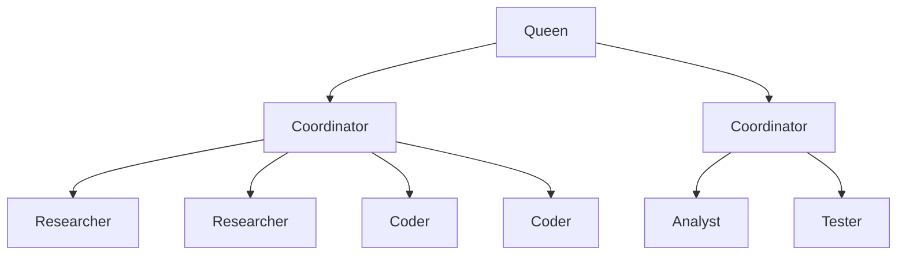

### Mesh Topology
The mesh topology enables peer-to-peer communication between agents, allowing for distributed decision-making and redundancy. All agents can communicate directly with each other, creating a resilient network.

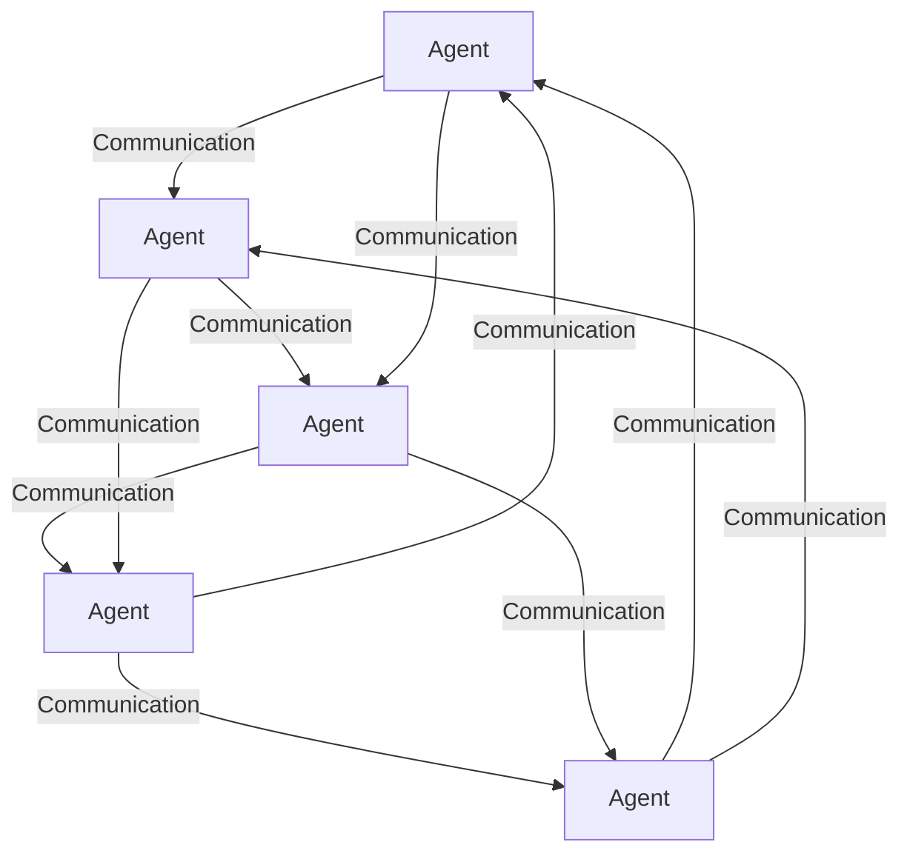

### Hybrid Configuration
The system also supports hybrid configurations that combine elements of different topologies. The 'specs-driven' topology, for example, implements a specialized hierarchy designed for software development workflows.

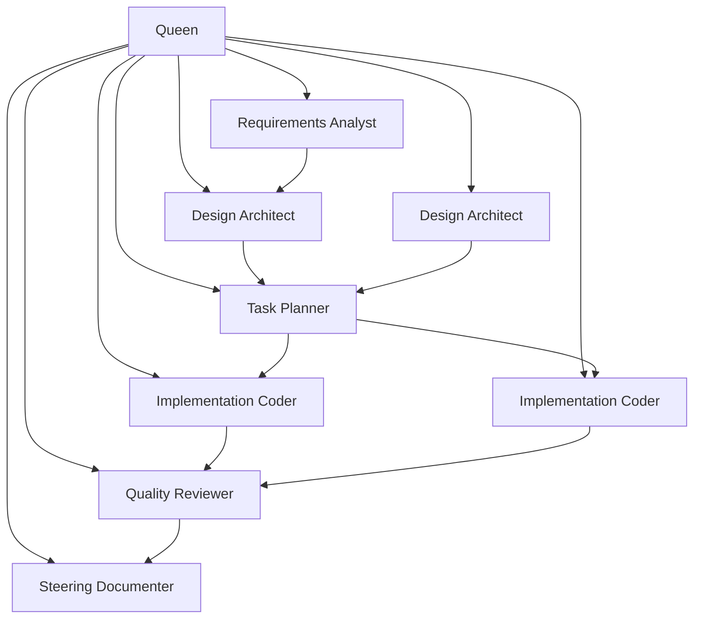

**Section sources**
- [HiveMind.ts](file://src/hive-mind/core/HiveMind.ts#L150-L200)
- [types.ts](file://src/hive-mind/types.ts#L10-L23)

## Configuration Options

The Hive-Mind Intelligence system provides extensive configuration options to customize swarm behavior according to specific requirements and constraints.

### HiveMind Configuration
The HiveMindConfig interface defines the primary configuration options for the swarm system:

```typescript
export interface HiveMindConfig {
  name: string;
  topology: SwarmTopology;
  maxAgents: number;
  queenMode: QueenMode;
  memoryTTL: number;
  consensusThreshold: number;
  autoSpawn: boolean;
  enableConsensus?: boolean;
  enableMemory?: boolean;
  enableCommunication?: boolean;
  enabledFeatures?: string[];
  createdAt?: Date;
}
```

**Key Configuration Parameters:**
- **name**: Unique identifier for the swarm instance
- **topology**: Network structure (hierarchical, mesh, ring, star, or specs-driven)
- **maxAgents**: Maximum number of agents allowed in the swarm
- **queenMode**: Governance model (centralized, distributed, or strategic)
- **memoryTTL**: Time-to-live for memory entries in milliseconds
- **consensusThreshold**: Minimum percentage of positive votes required for consensus
- **autoSpawn**: Whether to automatically create initial agents based on topology

### Task Assignment Strategies
The system supports multiple task assignment strategies through the TaskStrategy type:

```typescript
export type TaskStrategy = 'parallel' | 'sequential' | 'adaptive' | 'consensus';
```

Each strategy determines how tasks are distributed and executed:
- **Parallel**: Multiple agents work on different aspects of the task simultaneously
- **Sequential**: Tasks are processed in a defined order, with each step completed before the next begins
- **Adaptive**: The system dynamically selects the optimal strategy based on task characteristics
- **Consensus**: Requires agreement among multiple agents before proceeding

### Load Balancing Configuration
The system implements automatic load balancing through several mechanisms:
- Agent utilization monitoring
- Task queue management
- Dynamic resource allocation
- Performance-based routing

The rebalanceAgents method in the HiveMind class enables explicit load balancing when needed.

**Section sources**
- [types.ts](file://src/hive-mind/types.ts#L10-L23)
- [HiveMind.ts](file://src/hive-mind/core/HiveMind.ts#L500-L520)

## Task Distribution and Orchestration

The Hive-Mind Intelligence system employs a sophisticated task distribution and orchestration mechanism that ensures efficient workload management across the swarm.

### Task Submission Process
When a task is submitted to the Hive-Mind system, it follows a well-defined workflow:

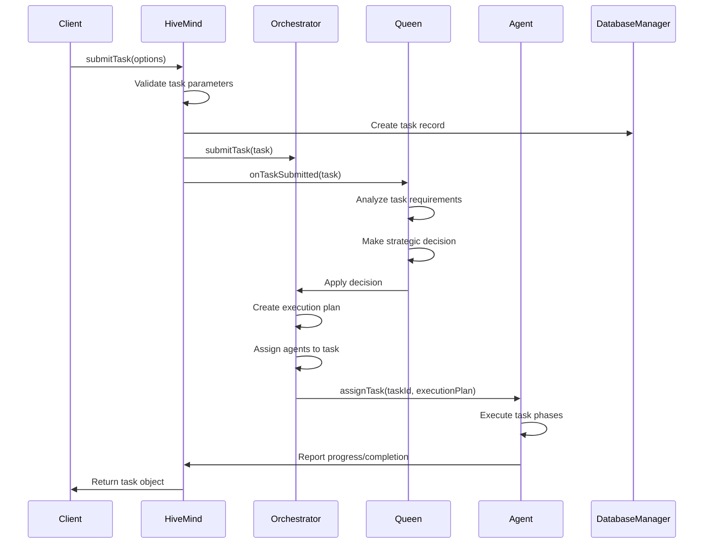

**Diagram sources**
- [HiveMind.ts](file://src/hive-mind/core/HiveMind.ts#L300-L350)
- [SwarmOrchestrator.ts](file://src/hive-mind/integration/SwarmOrchestrator.ts#L50-L100)
- [Queen.ts](file://src/hive-mind/core/Queen.ts#L150-L200)

### Execution Planning
The SwarmOrchestrator creates detailed execution plans for each task based on its strategy and complexity:

```typescript
interface ExecutionPlan {
  taskId: string;
  strategy: TaskStrategy;
  phases: string[];
  phaseAssignments: TaskAssignment[][];
  dependencies: string[];
  checkpoints: any[];
  parallelizable: boolean;
  estimatedDuration: number;
  resourceRequirements: any;
}
```

The execution plan breaks down tasks into discrete phases, assigns appropriate agents to each phase, and establishes checkpoints for monitoring progress.

### Adaptive Task Routing
The system implements adaptive task routing based on agent capabilities and current workload:

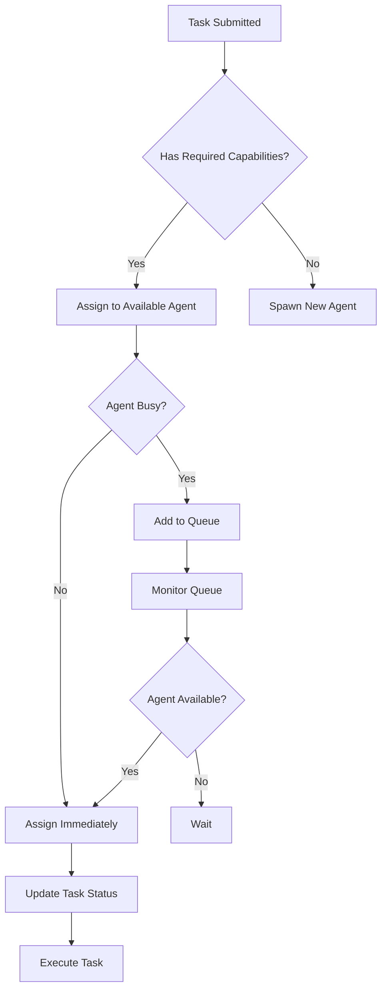

**Section sources**
- [HiveMind.ts](file://src/hive-mind/core/HiveMind.ts#L300-L350)
- [SwarmOrchestrator.ts](file://src/hive-mind/integration/SwarmOrchestrator.ts)
- [Queen.ts](file://src/hive-mind/core/Queen.ts#L150-L200)

## Data Flow Patterns

The Hive-Mind Intelligence system implements several key data flow patterns that enable efficient communication and coordination between components.

### Event-Driven Architecture
The system uses an event-driven architecture based on the EventEmitter pattern, allowing components to communicate asynchronously:

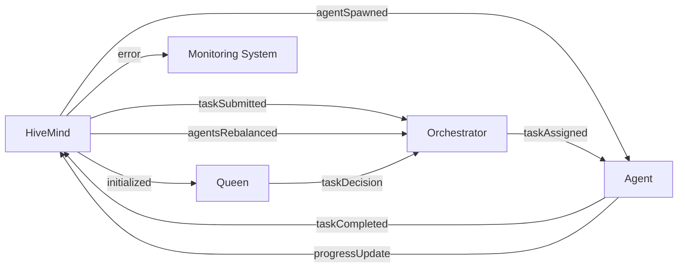

### Message Communication
Agents communicate through a structured messaging system that supports various message types:

```typescript
interface Message {
  id: string;
  fromAgentId: string;
  toAgentId: string | null;
  swarmId: string;
  type: MessageType;
  content: any;
  priority?: MessagePriority;
  timestamp: Date;
  requiresResponse: boolean;
}
```

The communication system supports direct messages, broadcasts, consensus requests, queries, responses, notifications, task assignments, progress updates, coordination messages, and channel communications.

### Memory and Knowledge Sharing
The system implements a shared memory system that allows agents to access and contribute to collective knowledge:

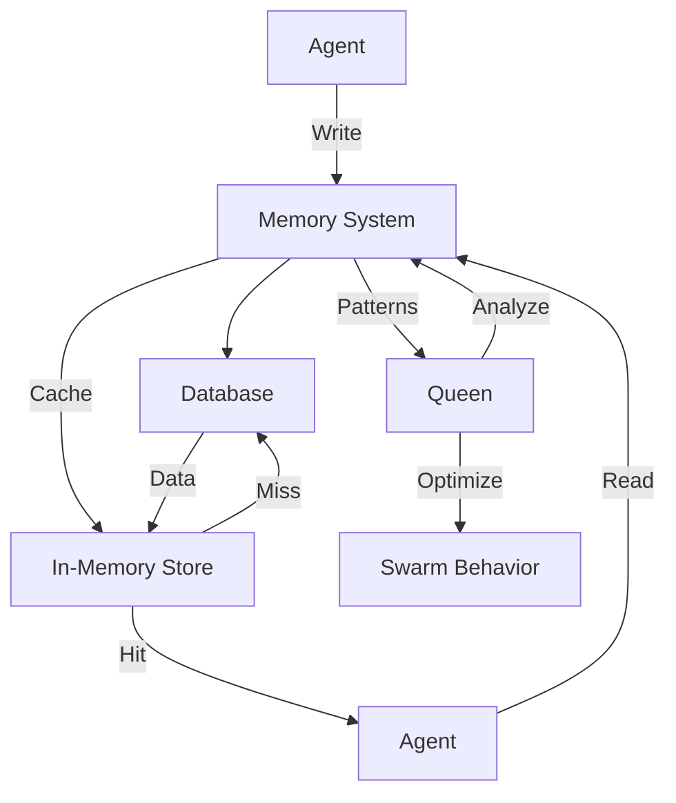

**Section sources**
- [HiveMind.ts](file://src/hive-mind/core/HiveMind.ts)
- [types.ts](file://src/hive-mind/types.ts#L150-L200)
- [Agent.ts](file://src/hive-mind/core/Agent.ts#L200-L250)

## System Monitoring and Status

The Hive-Mind Intelligence system provides comprehensive monitoring and status reporting capabilities to ensure visibility into swarm operations.

### Health Monitoring
The system continuously monitors the health of the swarm and its components:

```typescript
interface SwarmStatus {
  swarmId: string;
  name: string;
  topology: SwarmTopology;
  queenMode: QueenMode;
  health: 'healthy' | 'degraded' | 'critical' | 'unknown';
  uptime: number;
  agents: Array<{
    id: string;
    name: string;
    type: AgentType;
    status: AgentStatus;
    currentTask: string | null;
    messageCount: number;
    createdAt: number;
  }>;
  agentsByType: Record<AgentType, number>;
  tasks: Array<{
    id: string;
    description: string;
    status: TaskStatus;
    priority: TaskPriority;
    progress: number;
    assignedAgent: string | null;
  }>;
  taskStats: {
    total: number;
    pending: number;
    inProgress: number;
    completed: number;
    failed: number;
  };
  memoryStats: MemoryStats;
  communicationStats: CommunicationStats;
  performance: {
    avgTaskCompletion: number;
    messageThroughput: number;
    consensusSuccessRate: number;
    memoryHitRate: number;
    agentUtilization: number;
  };
  warnings: string[];
}
```

### Performance Metrics
The system tracks key performance indicators to optimize swarm efficiency:

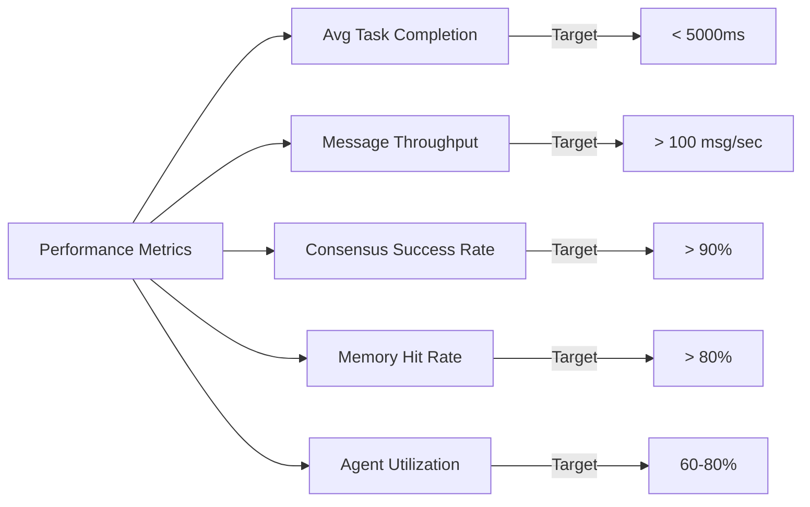

### Warning System
The system proactively identifies potential issues and generates warnings:

```typescript
private getSystemWarnings(agents: Agent[], tasks: any[], performance: any): string[] {
  const warnings: string[] = [];

  const utilization = agents.filter((a) => a.status === 'busy').length / agents.length;
  if (utilization > 0.8) {
    warnings.push('High agent utilization - consider spawning more agents');
  }

  const pendingTasks = tasks.filter((t) => t.status === 'pending').length;
  if (pendingTasks > agents.length * 2) {
    warnings.push('Large task backlog - tasks may be delayed');
  }

  if (performance.memoryHitRate < 60) {
    warnings.push('Low memory hit rate - consider optimizing memory usage');
  }

  return warnings;
}
```

**Section sources**
- [HiveMind.ts](file://src/hive-mind/core/HiveMind.ts#L400-L500)
- [types.ts](file://src/hive-mind/types.ts#L300-L350)

## Failure Recovery and Resilience

The Hive-Mind Intelligence system implements robust failure recovery mechanisms to ensure system resilience and continuity.

### Task Failure Handling
When a task fails, the system follows a structured recovery process:

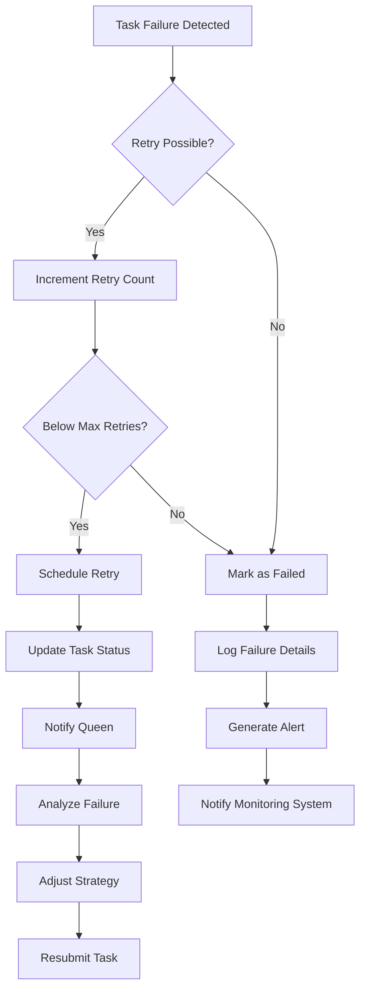

### Agent Failure Recovery
The system monitors agent health and responds to failures appropriately:

```typescript
private async handleTaskFailure(taskId: string, error: any): Promise<void> {
  // Update task status
  await this.db.updateTaskStatus(taskId, 'failed');
  await this.db.updateTask(taskId, {
    error: error.message,
    completed_at: new Date(),
  });

  // Update agent status
  this.status = 'idle';
  await this.db.updateAgent(this.id, {
    status: 'idle',
    current_task_id: null,
    error_count: this.db.raw('error_count + 1'),
  });

  // Clear task
  this.currentTask = null;

  // Notify orchestrator
  this.emit('taskFailed', { taskId, error });
}
```

### Consensus-Based Decision Making
For critical operations, the system uses consensus mechanisms to ensure reliability:

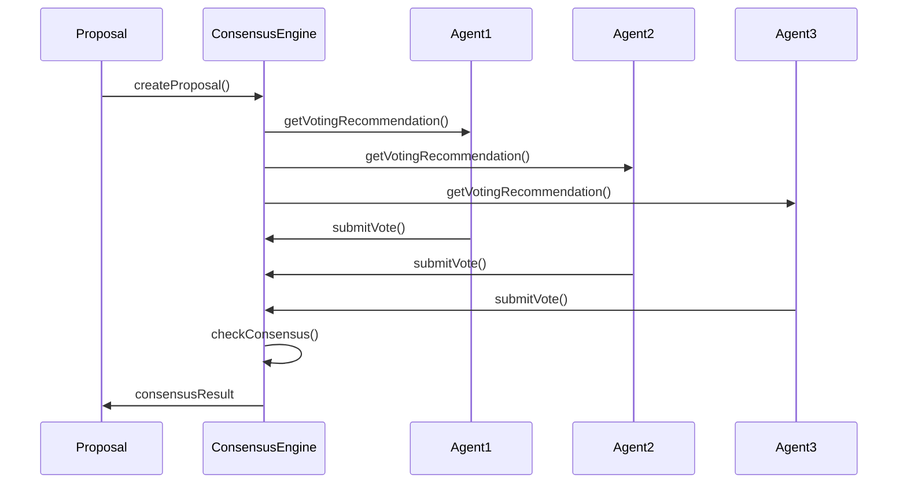

**Section sources**
- [Agent.ts](file://src/hive-mind/core/Agent.ts#L300-L350)
- [ConsensusEngine.ts](file://src/hive-mind/integration/ConsensusEngine.ts)
- [HiveMind.ts](file://src/hive-mind/core/HiveMind.ts#L350-L400)

## Practical Examples

This section provides practical examples demonstrating how the Hive-Mind class interacts with other components in real-world scenarios.

### Initializing a Swarm
Creating and initializing a new swarm instance with hierarchical topology:

```typescript
const config: HiveMindConfig = {
  name: 'Development Swarm',
  topology: 'hierarchical',
  maxAgents: 10,
  queenMode: 'centralized',
  memoryTTL: 3600000, // 1 hour
  consensusThreshold: 0.66,
  autoSpawn: true
};

const hiveMind = new HiveMind(config);
const swarmId = await hiveMind.initialize();
console.log(`Swarm initialized with ID: ${swarmId}`);
```

### Submitting a Task
Submitting a task to the swarm for processing:

```typescript
const task = await hiveMind.submitTask({
  description: 'Implement user authentication API',
  priority: 'high',
  strategy: 'sequential',
  requiredCapabilities: ['code_generation', 'security_best_practices'],
  metadata: {
    deadline: '2025-12-31',
    complexity: 'medium'
  }
});

console.log(`Task submitted with ID: ${task.id}`);
```

### Monitoring Swarm Status
Retrieving comprehensive status information about the swarm:

```typescript
const status = await hiveMind.getFullStatus();
console.log(`Swarm Health: ${status.health}`);
console.log(`Uptime: ${status.uptime}ms`);
console.log(`Active Agents: ${status.agents.filter(a => a.status === 'busy').length}`);
console.log(`Pending Tasks: ${status.taskStats.pending}`);
```

### Handling Task Completion
Setting up event listeners to respond to task completion:

```typescript
hiveMind.on('taskCompleted', async ({ taskId, result }) => {
  console.log(`Task ${taskId} completed successfully`);
  
  // Process results
  await processTaskResults(result);
  
  // Check if more tasks are pending
  const pendingTasks = await hiveMind.getTasks();
  if (pendingTasks.filter(t => t.status === 'pending').length === 0) {
    console.log('All tasks completed');
    await hiveMind.shutdown();
  }
});
```

### Error Handling
Implementing robust error handling for the swarm system:

```typescript
hiveMind.on('error', async (error) => {
  console.error('Swarm error:', error);
  
  // Log error details
  await logError(error);
  
  // Attempt recovery
  if (error.recoverable) {
    await attemptRecovery(error);
  } else {
    // Shutdown gracefully
    await hiveMind.shutdown();
    process.exit(1);
  }
});
```

**Section sources**
- [HiveMind.ts](file://src/hive-mind/core/HiveMind.ts)
- [Queen.ts](file://src/hive-mind/core/Queen.ts)
- [Agent.ts](file://src/hive-mind/core/Agent.ts)