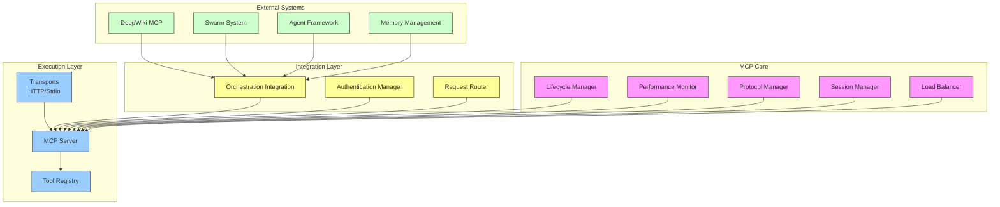
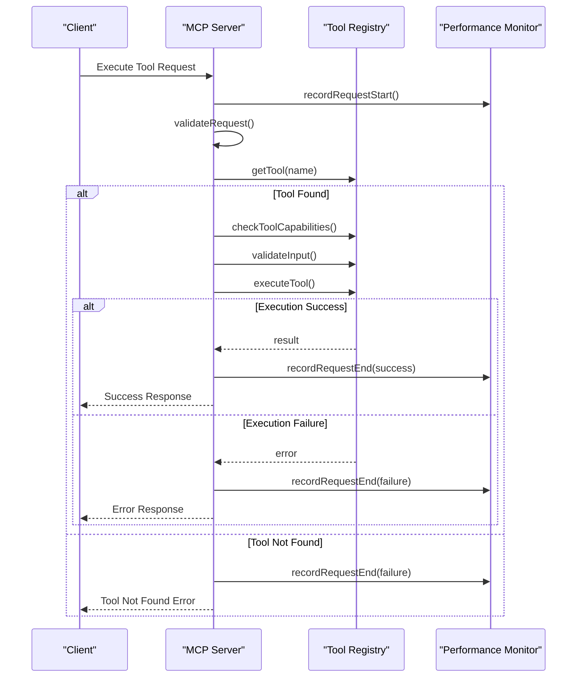
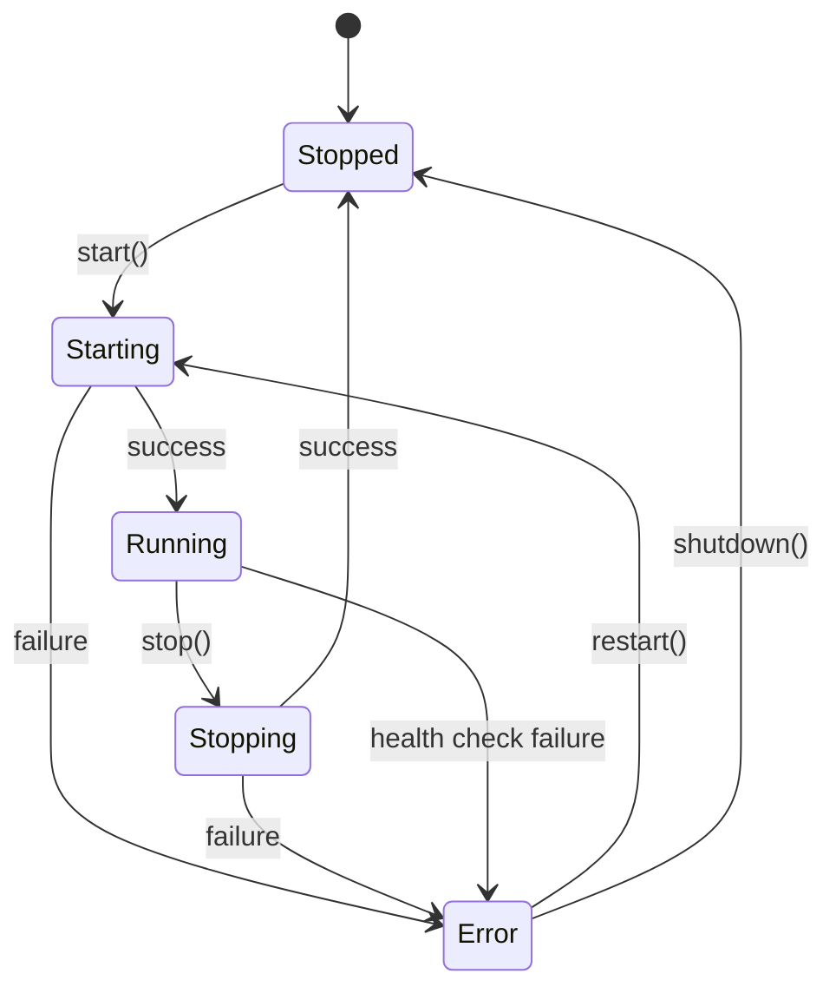
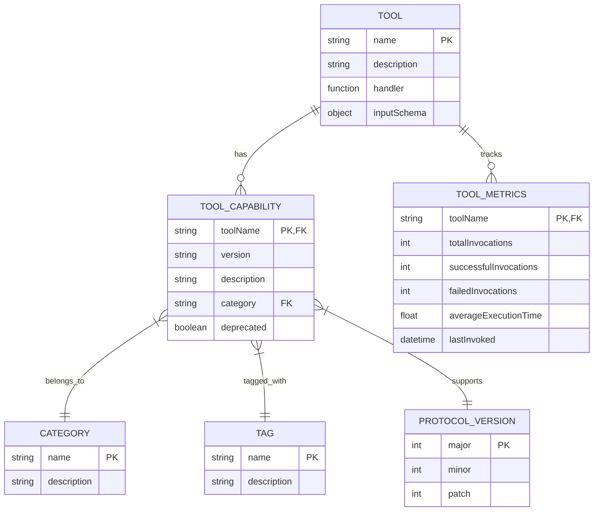

# MCP Tools Integration

<cite>
**Referenced Files in This Document**   
- [mcp.json](file://mcp.json)
- [src/mcp/README.md](file://src/mcp/README.md)
- [src/mcp/tools.ts](file://src/mcp/tools.ts#L0-L553)
- [src/mcp/server.ts](file://src/mcp/server.ts)
- [src/mcp/lifecycle-manager.ts](file://src/mcp/lifecycle-manager.ts)
- [src/mcp/orchestration-integration.ts](file://src/mcp/orchestration-integration.ts)
- [src/mcp/auth.ts](file://src/mcp/auth.ts)
- [src/mcp/performance-monitor.ts](file://src/mcp/performance-monitor.ts)
- [src/mcp/protocol-manager.ts](file://src/mcp/protocol-manager.ts)
- [src/mcp/implementations/deepwiki-mcp.js](file://src/mcp/implementations/deepwiki-mcp.js)
- [src/mcp/implementations/daa-tools.js](file://src/mcp/implementations/daa-tools.js)
- [src/mcp/implementations/workflow-tools.js](file://src/mcp/implementations/workflow-tools.js)
</cite>

## Table of Contents
1. [Introduction](#introduction)
2. [Architecture Overview](#architecture-overview)
3. [Core Components](#core-components)
4. [Tool Domain Model](#tool-domain-model)
5. [Implementation Details](#implementation-details)
6. [Integration with System Components](#integration-with-system-components)
7. [Performance and Error Management](#performance-and-error-management)
8. [Best Practices and Troubleshooting](#best-practices-and-troubleshooting)

## Introduction

The MCP (Model Context Protocol) Tools Integration system within the Claude-Flow ecosystem provides a robust framework for managing over 87 advanced tools across multiple domains. This system enables seamless orchestration of neural, cognitive, memory, performance, workflow, GitHub, and Dynamic Agent Architecture (DAA) tools through a standardized protocol. The MCP layer acts as a central hub for tool registration, discovery, execution, and monitoring, ensuring consistent behavior and interoperability across the entire agent ecosystem.

The integration leverages a modular architecture with clear separation of concerns, allowing for extensibility while maintaining stability. Tools are exposed through a well-defined interface that supports capability negotiation, version compatibility checking, and secure execution. This document provides a comprehensive analysis of the MCP tools integration layer, detailing its architecture, implementation, and operational characteristics.

**Section sources**
- [src/mcp/README.md](file://src/mcp/README.md#L1-L530)

## Architecture Overview

The MCP tools integration follows a layered architecture that separates concerns into distinct components, each responsible for specific aspects of tool management and execution. This design enables scalability, maintainability, and fault isolation.



**Diagram sources**
- [src/mcp/README.md](file://src/mcp/README.md#L15-L50)
- [src/mcp/server.ts](file://src/mcp/server.ts#L1-L20)
- [src/mcp/lifecycle-manager.ts](file://src/mcp/lifecycle-manager.ts#L1-L15)

**Section sources**
- [src/mcp/README.md](file://src/mcp/README.md#L1-L530)

## Core Components

The MCP tools integration system comprises several core components that work together to provide a comprehensive tool management solution. Each component has a well-defined responsibility and interface, enabling loose coupling and independent evolution.

### Tool Registry

The Tool Registry serves as the central repository for all available tools within the system. It provides capabilities for registration, discovery, execution, and metrics tracking.

```mermaid
classDiagram
class ToolRegistry {
-tools : Map<string, MCPTool>
-capabilities : Map<string, ToolCapability>
-metrics : Map<string, ToolMetrics>
-categories : Set<string>
-tags : Set<string>
+register(tool : MCPTool, capability : ToolCapability) : void
+unregister(name : string) : void
+getTool(name : string) : MCPTool | undefined
+executeTool(name : string, input : unknown, context? : any) : Promise<unknown>
+discoverTools(query : ToolDiscoveryQuery) : Array<{tool : MCPTool, capability : ToolCapability}>
+getToolCapability(name : string) : ToolCapability | undefined
+getToolMetrics(name? : string) : ToolMetrics | ToolMetrics[]
+getRegistryStats() : RegistryStats
+resetMetrics(toolName? : string) : void
}
class ToolCapability {
+name : string
+version : string
+description : string
+category : string
+tags : string[]
+requiredPermissions? : string[]
+supportedProtocolVersions : MCPProtocolVersion[]
+dependencies? : string[]
+deprecated? : boolean
+deprecationMessage? : string
}
class ToolMetrics {
+name : string
+totalInvocations : number
+successfulInvocations : number
+failedInvocations : number
+averageExecutionTime : number
+lastInvoked? : Date
+totalExecutionTime : number
}
class ToolDiscoveryQuery {
+category? : string
+tags? : string[]
+capabilities? : string[]
+protocolVersion? : MCPProtocolVersion
+includeDeprecated? : boolean
+permissions? : string[]
}
ToolRegistry --> ToolCapability : "manages"
ToolRegistry --> ToolMetrics : "tracks"
ToolRegistry --> ToolDiscoveryQuery : "uses"
```

**Diagram sources**
- [src/mcp/tools.ts](file://src/mcp/tools.ts#L0-L553)

**Section sources**
- [src/mcp/tools.ts](file://src/mcp/tools.ts#L0-L553)

### MCP Server

The MCP Server acts as the primary entry point for tool execution requests. It handles protocol-compliant communication, manages sessions, and coordinates with the Tool Registry to execute requested tools.



**Diagram sources**
- [src/mcp/server.ts](file://src/mcp/server.ts#L1-L100)
- [src/mcp/tools.ts](file://src/mcp/tools.ts#L100-L200)

**Section sources**
- [src/mcp/server.ts](file://src/mcp/server.ts#L1-L100)

### Lifecycle Manager

The Lifecycle Manager provides robust control over the MCP server's operational state, including startup, shutdown, health monitoring, and automatic recovery.



**Diagram sources**
- [src/mcp/lifecycle-manager.ts](file://src/mcp/lifecycle-manager.ts#L1-L50)

**Section sources**
- [src/mcp/lifecycle-manager.ts](file://src/mcp/lifecycle-manager.ts#L1-L100)

### Orchestration Integration

The Orchestration Integration component enables seamless connectivity between the MCP tools system and other core components of the Claude-Flow ecosystem, including swarm coordination, agent management, and memory systems.

```mermaid
flowchart TD
ORCH[Orchestration Integration] --> SERVER[MCP Server]
ORCH --> ORCHESTRATOR[Orchestrator]
ORCH --> SWARM[Swarm Coordinator]
ORCH --> AGENT[Agent Manager]
ORCH --> RESOURCE[Resource Manager]
ORCH --> MEMORY[Memory Manager]
ORCH --> MONITOR[Monitor]
ORCH --> EVENTBUS[Event Bus]
SERVER --> ORCH : emits events
ORCHESTRATOR --> ORCH : health updates
SWARM --> ORCH : status updates
AGENT --> ORCH : agent events
RESOURCE --> ORCH : resource events
MEMORY --> ORCH : memory events
MONITOR --> ORCH : metrics
EVENTBUS --> ORCH : system events
style ORCH fill:#ff9,stroke:#333
style SERVER fill:#9cf,stroke:#333
style ORCHESTRATOR fill:#cfc,stroke:#333
style SWARM fill:#cfc,stroke:#333
style AGENT fill:#cfc,stroke:#333
style RESOURCE fill:#cfc,stroke:#333
style MEMORY fill:#cfc,stroke:#333
style MONITOR fill:#cfc,stroke:#333
style EVENTBUS fill:#cfc,stroke:#333
```

**Diagram sources**
- [src/mcp/orchestration-integration.ts](file://src/mcp/orchestration-integration.ts#L1-L30)

**Section sources**
- [src/mcp/orchestration-integration.ts](file://src/mcp/orchestration-integration.ts#L1-L100)

## Tool Domain Model

The MCP tools integration system organizes tools into distinct categories based on their functionality and domain. This categorization enables efficient discovery, management, and utilization of tools across the ecosystem.

### Neural and Cognitive Tools

Neural and cognitive tools focus on AI model interaction, reasoning, and decision-making capabilities. These tools enable agents to perform complex cognitive tasks and leverage advanced AI models.



**Diagram sources**
- [src/mcp/tools.ts](file://src/mcp/tools.ts#L20-L50)
- [src/mcp/implementations/daa-tools.js](file://src/mcp/implementations/daa-tools.js#L1-L20)

**Section sources**
- [src/mcp/tools.ts](file://src/mcp/tools.ts#L20-L100)
- [src/mcp/implementations/daa-tools.js](file://src/mcp/implementations/daa-tools.js#L1-L50)

### Memory Management Tools

Memory management tools provide capabilities for storing, retrieving, and manipulating agent memory and context. These tools are essential for maintaining state across agent interactions and enabling long-term reasoning.

The system supports multiple memory backends including in-memory storage, SQLite, and distributed memory systems. Tools in this category enable operations such as:

- Memory storage and retrieval
- Context management
- Knowledge base queries
- Session persistence
- Memory optimization

These tools are integrated with the MCP registry and can be discovered using the category "memory" or tags such as "context", "storage", and "persistence".

**Section sources**
- [src/mcp/tools.ts](file://src/mcp/tools.ts#L150-L200)
- [src/mcp/implementations/workflow-tools.js](file://src/mcp/implementations/workflow-tools.js#L1-L30)

### Performance Monitoring Tools

Performance monitoring tools provide real-time insights into system behavior, resource utilization, and execution metrics. These tools enable proactive optimization and issue detection.

The performance monitoring system tracks:

- Request/response time percentiles (P50, P95, P99)
- Throughput (requests per second)
- Error rates by category
- Memory and CPU usage
- Tool invocation patterns

Custom alert rules can be configured to trigger notifications when specific thresholds are exceeded, enabling automated responses to performance degradation.

**Section sources**
- [src/mcp/performance-monitor.ts](file://src/mcp/performance-monitor.ts#L1-L50)
- [src/mcp/tools.ts](file://src/mcp/tools.ts#L450-L500)

### Workflow Automation Tools

Workflow automation tools enable the creation and execution of complex multi-step processes. These tools support:

- Sequential and parallel task execution
- Conditional branching
- Error handling and recovery
- State management
- Progress tracking

The workflow system integrates with the MCP tool registry, allowing any registered tool to be incorporated into workflows. Workflows can be defined programmatically or through configuration files, providing flexibility for different use cases.

**Section sources**
- [src/mcp/implementations/workflow-tools.js](file://src/mcp/implementations/workflow-tools.js#L1-L100)
- [src/mcp/tools.ts](file://src/mcp/tools.ts#L300-L350)

### GitHub Integration Tools

GitHub integration tools provide seamless connectivity with GitHub repositories, enabling operations such as:

- Repository cloning and management
- Pull request creation and review
- Issue tracking and management
- Code search and analysis
- CI/CD pipeline integration

These tools leverage the MCP protocol to expose GitHub functionality as callable services, allowing agents to interact with GitHub repositories programmatically.

**Section sources**
- [src/mcp/implementations/deepwiki-mcp.js](file://src/mcp/implementations/deepwiki-mcp.js#L1-L50)
- [mcp.json](file://mcp.json#L1-L8)

### Dynamic Agent Architecture Tools

Dynamic Agent Architecture (DAA) tools enable the creation, management, and coordination of autonomous agents. These tools support:

- Agent creation and configuration
- Role-based behavior definition
- Communication protocol management
- Task delegation and coordination
- Swarm intelligence patterns

The DAA tools are implemented in the daa-tools.js file and provide a comprehensive API for building complex agent systems that can collaborate to achieve shared goals.

**Section sources**
- [src/mcp/implementations/daa-tools.js](file://src/mcp/implementations/daa-tools.js#L1-L100)
- [src/mcp/tools.ts](file://src/mcp/tools.ts#L250-L300)

## Implementation Details

The MCP tools integration layer is implemented with a focus on extensibility, reliability, and performance. The system follows a modular design that separates concerns into distinct components, each with well-defined interfaces.

### Tool Registration Process

The tool registration process ensures that all tools are properly validated and integrated into the system. When a tool is registered, the following steps occur:

1. **Validation**: The tool definition is validated to ensure it has a name, description, handler function, and input schema.
2. **Capability Registration**: If provided, capability information is registered; otherwise, default capabilities are inferred from the tool name and description.
3. **Metrics Initialization**: Execution metrics are initialized for the tool to track invocations, success rates, and performance.
4. **Event Emission**: A "toolRegistered" event is emitted to notify other components of the new tool.

```typescript
register(tool: MCPTool, capability?: ToolCapability): void {
    if (this.tools.has(tool.name)) {
        throw new MCPError(`Tool already registered: ${tool.name}`);
    }

    this.validateTool(tool);
    this.tools.set(tool.name, tool);

    if (capability) {
        this.registerCapability(tool.name, capability);
    } else {
        const defaultCapability: ToolCapability = {
            name: tool.name,
            version: '1.0.0',
            description: tool.description,
            category: this.extractCategory(tool.name),
            tags: this.extractTags(tool),
            supportedProtocolVersions: [{ major: 2024, minor: 11, patch: 5 }],
        };
        this.registerCapability(tool.name, defaultCapability);
    }

    this.metrics.set(tool.name, {
        name: tool.name,
        totalInvocations: 0,
        successfulInvocations: 0,
        failedInvocations: 0,
        averageExecutionTime: 0,
        totalExecutionTime: 0,
    });

    this.emit('toolRegistered', { name: tool.name, capability });
}
```

**Section sources**
- [src/mcp/tools.ts](file://src/mcp/tools.ts#L50-L100)

### Tool Discovery Mechanism

The tool discovery mechanism enables clients to find tools based on various criteria such as category, tags, protocol version compatibility, and permissions. The discovery process follows these steps:

1. **Query Parsing**: The discovery query is parsed to extract filtering criteria.
2. **Filtering**: Tools are filtered based on the specified criteria (category, tags, protocol version, etc.).
3. **Permission Checking**: For queries with permission requirements, tools are filtered to include only those accessible to the requesting entity.
4. **Result Compilation**: Matching tools and their capabilities are compiled into a response.

The discovery system supports complex queries that can combine multiple criteria, enabling precise tool selection for specific use cases.

**Section sources**
- [src/mcp/tools.ts](file://src/mcp/tools.ts#L400-L450)

### Tool Execution Flow

The tool execution flow ensures reliable and secure execution of tools while collecting comprehensive metrics. The execution process follows these steps:

1. **Tool Lookup**: The requested tool is retrieved from the registry.
2. **Capability Checking**: The tool's capabilities are checked against the execution context (permissions, protocol version, etc.).
3. **Input Validation**: The input is validated against the tool's schema.
4. **Execution**: The tool handler is invoked with the validated input.
5. **Metrics Collection**: Execution metrics are updated based on the outcome.
6. **Result Return**: The result (or error) is returned to the caller.

The execution system includes comprehensive error handling and recovery mechanisms to ensure system stability even when individual tools fail.

**Section sources**
- [src/mcp/tools.ts](file://src/mcp/tools.ts#L100-L150)

## Integration with System Components

The MCP tools integration system is designed to work seamlessly with other components of the Claude-Flow ecosystem. This integration enables coordinated operation across multiple subsystems.

### DeepWiki Integration

The system integrates with DeepWiki through the MCP protocol, enabling bidirectional communication and tool sharing. The integration is configured in the mcp.json file:

```json
{
  "mcpServers": {
    "deepwiki": {
      "serverUrl": "https://mcp.deepwiki.com/sse"
    }
  }
}
```

This configuration establishes a connection to the DeepWiki MCP server, allowing tools to be shared between systems. The integration supports real-time updates and synchronization of tool availability and capabilities.

**Section sources**
- [mcp.json](file://mcp.json#L1-L8)
- [src/mcp/implementations/deepwiki-mcp.js](file://src/mcp/implementations/deepwiki-mcp.js#L1-L100)

### Agent Framework Integration

The MCP tools system integrates with the agent framework to provide tools as services that agents can invoke. This integration enables agents to leverage the full suite of available tools in their decision-making and execution processes.

Agents can discover and use tools through the standard MCP interface, with proper authentication and authorization controls ensuring that agents only access tools for which they have permission.

**Section sources**
- [src/mcp/orchestration-integration.ts](file://src/mcp/orchestration-integration.ts#L50-L100)
- [src/mcp/auth.ts](file://src/mcp/auth.ts#L1-L50)

### Memory System Integration

The tools system integrates with the memory management subsystem to enable persistent storage of tool execution context and results. This integration allows tools to maintain state across invocations and share information between related operations.

Memory-backed tools can store intermediate results, cache expensive computations, and maintain session-specific data, enhancing their effectiveness and efficiency.

**Section sources**
- [src/mcp/orchestration-integration.ts](file://src/mcp/orchestration-integration.ts#L75-L100)
- [src/mcp/implementations/workflow-tools.js](file://src/mcp/implementations/workflow-tools.js#L50-L100)

## Performance and Error Management

The MCP tools integration system includes comprehensive performance monitoring and error management capabilities to ensure reliability and efficiency.

### Performance Monitoring

The performance monitoring system tracks key metrics for all tool executions, including:

- Request/response time percentiles (P50, P95, P99)
- Throughput (requests per second)
- Error rates by category
- Memory and CPU usage
- Tool invocation patterns

These metrics are used to generate optimization suggestions and trigger alerts when performance thresholds are exceeded.

```typescript
addAlertRule({
  id: 'high_latency',
  name: 'High Response Time',
  metric: 'p95ResponseTime',
  operator: 'gt',
  threshold: 5000,
  duration: 60000,
  enabled: true,
  severity: 'high',
  actions: ['log', 'notify', 'escalate'],
});
```

**Section sources**
- [src/mcp/performance-monitor.ts](file://src/mcp/performance-monitor.ts#L1-L100)
- [src/mcp/tools.ts](file://src/mcp/tools.ts#L450-L500)

### Error Handling and Recovery

The system implements robust error handling and recovery mechanisms to maintain availability and reliability:

- **Reconnection Logic**: Exponential backoff for failed connections
- **Circuit Breaker Pattern**: Prevents cascading failures
- **Health Check Recovery**: Automatic recovery from transient failures
- **Graceful Degradation**: Maintains core functionality during partial outages
- **Automatic Restart**: Recovery from critical failures with state preservation

These mechanisms ensure that the system can recover from various failure modes while minimizing disruption to ongoing operations.

**Section sources**
- [src/mcp/recovery/reconnection-manager.ts](file://src/mcp/recovery/reconnection-manager.ts#L1-L50)
- [src/mcp/lifecycle-manager.ts](file://src/mcp/lifecycle-manager.ts#L50-L100)

## Best Practices and Troubleshooting

### Best Practices

#### Performance Optimization
- Use batch operations for multiple tool requests
- Implement appropriate caching strategies
- Monitor memory usage and clean up resources
- Use connection pooling for HTTP transport
- Leverage asynchronous operations where possible

#### Security
- Always use HTTPS/TLS in production environments
- Implement regular token rotation
- Use strong password hashing (bcrypt)
- Implement proper input validation and sanitization
- Monitor for suspicious activity patterns

#### Reliability
- Implement comprehensive health checks
- Use graceful shutdown procedures
- Monitor system resource utilization
- Implement structured logging and alerting
- Test failure recovery scenarios

#### Scalability
- Use load balancing for high-traffic scenarios
- Implement horizontal scaling strategies
- Monitor performance metrics for bottlenecks
- Use asynchronous operations for long-running tasks
- Implement rate limiting to prevent resource exhaustion

### Troubleshooting Common Issues

#### Connection Failures
- Verify network connectivity and firewall settings
- Check server health and availability
- Validate authentication credentials
- Review transport configuration (HTTP/Stdio)

#### Authentication Errors
- Verify tokens and credentials
- Check token expiration and refresh requirements
- Validate permission assignments
- Review authentication method configuration

#### Performance Issues
- Monitor metrics for bottlenecks
- Check for memory leaks or resource exhaustion
- Review tool execution patterns
- Analyze slow queries or operations
- Consider implementing caching

#### Memory Leaks
- Review resource cleanup procedures
- Monitor memory usage over time
- Check for unclosed connections or handles
- Implement garbage collection monitoring
- Review object retention patterns

**Section sources**
- [src/mcp/README.md](file://src/mcp/README.md#L400-L530)
- [src/mcp/performance-monitor.ts](file://src/mcp/performance-monitor.ts#L100-L150)
- [src/mcp/lifecycle-manager.ts](file://src/mcp/lifecycle-manager.ts#L100-L150)