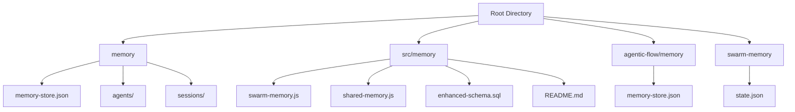
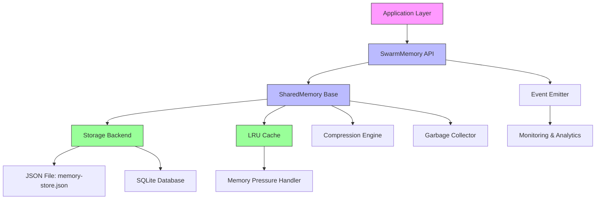
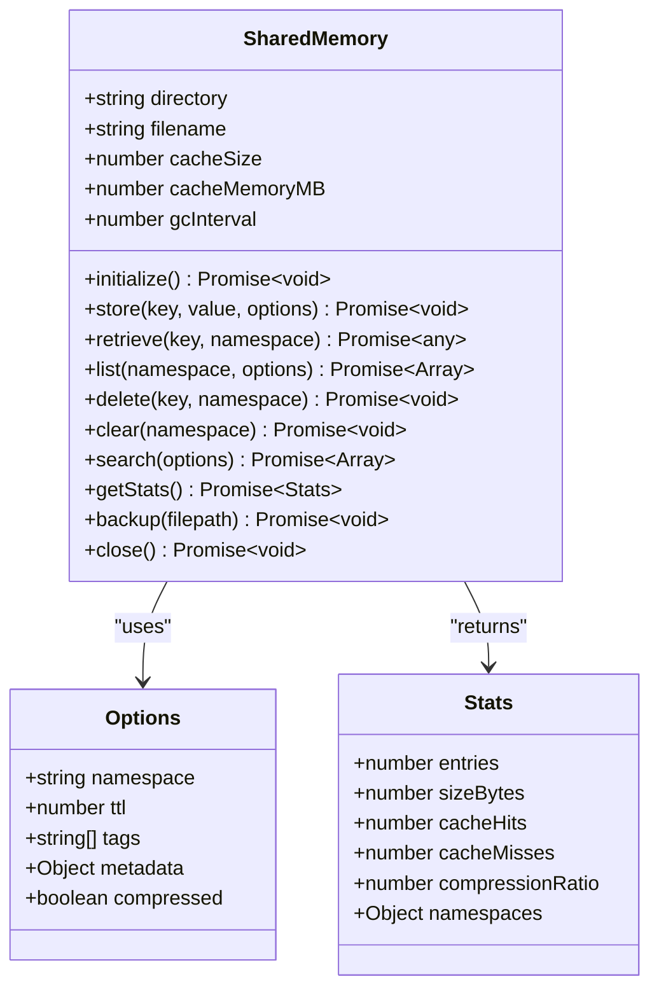
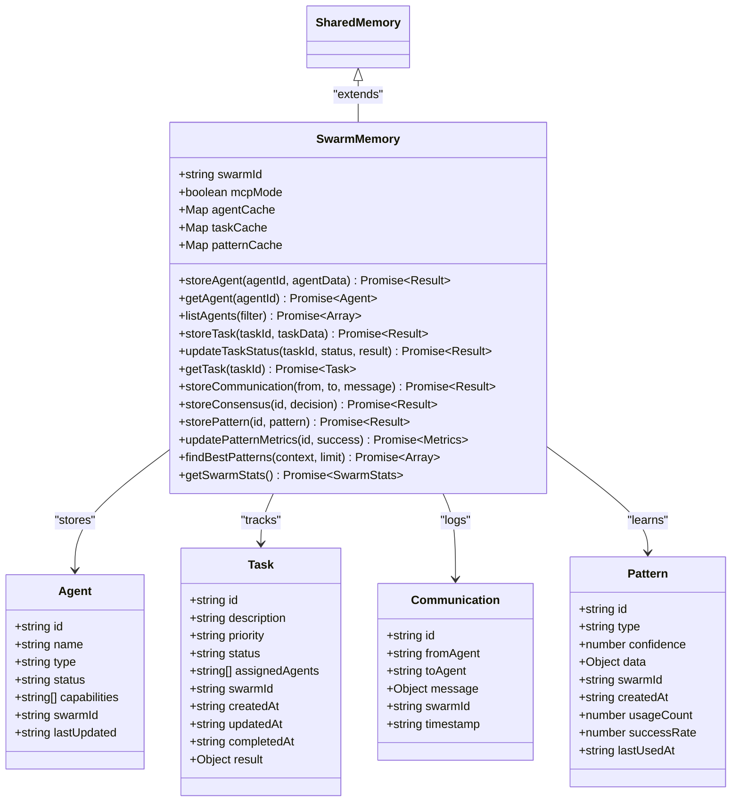
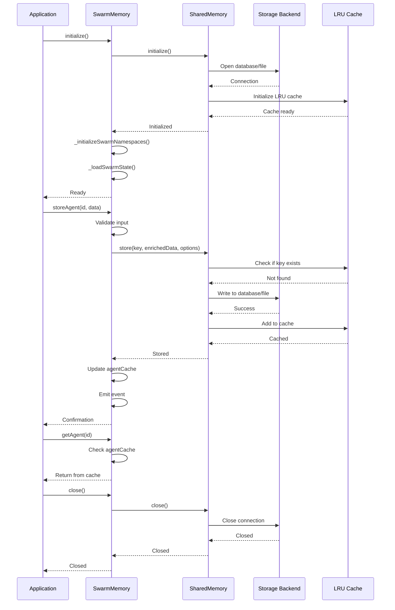
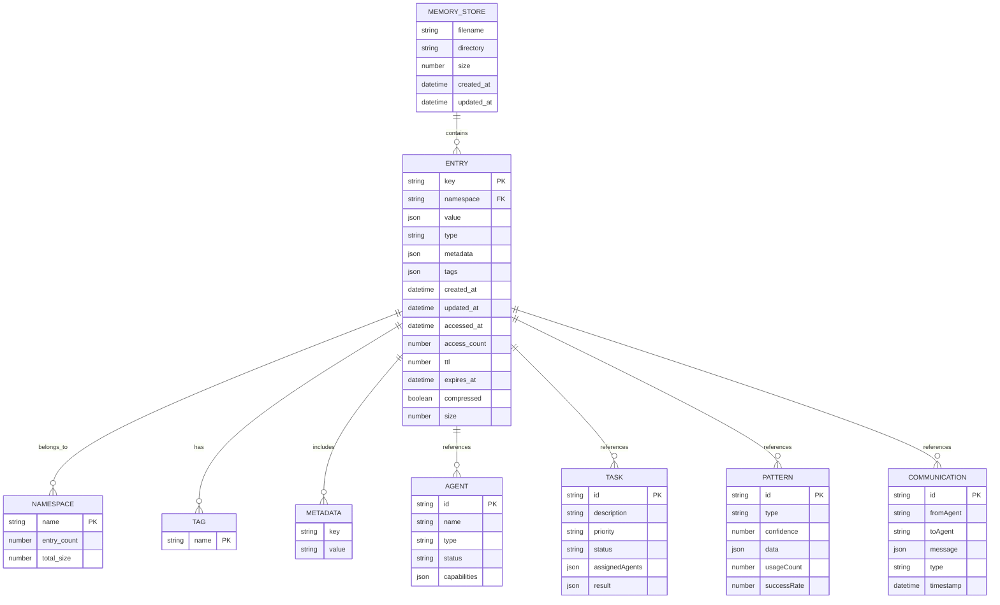
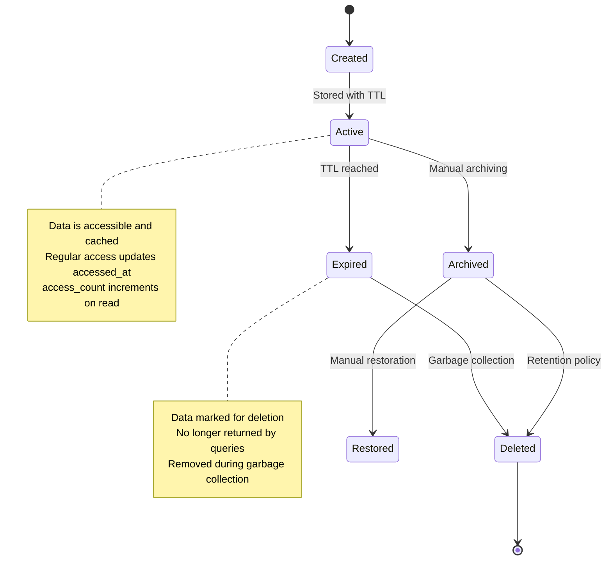

# Memory System

<cite>
**Referenced Files in This Document**   
- [memory-store.json](file://memory/memory-store.json)
- [README.md](file://src/memory/README.md)
- [swarm-memory.js](file://src/memory/swarm-memory.js)
- [shared-memory.js](file://src/memory/shared-memory.js)
- [enhanced-schema.sql](file://src/memory/enhanced-schema.sql)
</cite>

## Table of Contents
1. [Introduction](#introduction)
2. [Project Structure](#project-structure)
3. [Core Components](#core-components)
4. [Architecture Overview](#architecture-overview)
5. [Detailed Component Analysis](#detailed-component-analysis)
6. [Data Model and Schema](#data-model-and-schema)
7. [Data Access and Operations](#data-access-and-operations)
8. [Performance and Caching](#performance-and-caching)
9. [Data Lifecycle and Retention](#data-lifecycle-and-retention)
10. [Security and Access Control](#security-and-access-control)
11. [Sample Data and Usage Patterns](#sample-data-and-usage-patterns)
12. [Troubleshooting Guide](#troubleshooting-guide)

## Introduction

The Memory System in Claude-Flow is a persistent storage architecture designed to maintain agent states, task results, and system metrics across sessions. It serves as the Hive-Mind database, enabling long-term memory and coordination for agentic workflows. The system uses a JSON-based storage model with a unified memory interface that supports both generic data persistence and MCP-specific swarm intelligence features. This documentation provides a comprehensive overview of the data model, entity relationships, storage mechanisms, and operational patterns that govern the memory system.

## Project Structure

The memory system is organized across multiple directories in the Claude-Flow repository, with core functionality located in the `src/memory` directory. The persistent storage is primarily managed through a central `memory-store.json` file, while additional agent-specific and session-specific data is stored in dedicated directories.



**Diagram sources**
- [memory-store.json](file://memory/memory-store.json)
- [swarm-memory.js](file://src/memory/swarm-memory.js)
- [shared-memory.js](file://src/memory/shared-memory.js)

**Section sources**
- [memory-store.json](file://memory/memory-store.json)
- [src/memory](file://src/memory)

## Core Components

The Memory System consists of several core components that work together to provide persistent storage capabilities:

- **SharedMemory**: Base class providing generic key-value storage with namespaces, TTL, tagging, and caching
- **SwarmMemory**: Extends SharedMemory with MCP-specific features for agent coordination and task tracking
- **memory-store.json**: Primary JSON storage file containing all persistent data
- **SQLite Backend**: Optional relational storage for enhanced querying and indexing capabilities
- **LRU Cache**: High-performance in-memory cache for frequently accessed data
- **Migration System**: Handles schema evolution and data migration between versions

The system is designed to be extensible, allowing for multiple backends while maintaining a consistent API for data operations.

**Section sources**
- [README.md](file://src/memory/README.md)
- [swarm-memory.js](file://src/memory/swarm-memory.js)

## Architecture Overview

The Memory System follows a layered architecture with a clear separation between the storage backend, caching layer, and application interface. The system supports both JSON file-based storage and SQLite database storage, with automatic compression and garbage collection.



**Diagram sources**
- [README.md](file://src/memory/README.md)
- [swarm-memory.js](file://src/memory/swarm-memory.js)
- [shared-memory.js](file://src/memory/shared-memory.js)

## Detailed Component Analysis

### SharedMemory Analysis

The SharedMemory class provides the foundational persistence layer for the memory system, implementing a robust key-value store with advanced features for data management.

#### Key Features:
- **Namespaces**: Logical organization of data (e.g., "users", "tasks", "agents")
- **TTL Support**: Automatic expiration of temporary data entries
- **Tagging System**: Flexible metadata tagging for enhanced search capabilities
- **Compression**: Automatic compression of large entries to optimize storage
- **Event Emission**: Real-time notifications for storage operations



**Diagram sources**
- [shared-memory.js](file://src/memory/shared-memory.js)
- [README.md](file://src/memory/README.md)

**Section sources**
- [shared-memory.js](file://src/memory/shared-memory.js)
- [README.md](file://src/memory/README.md)

### SwarmMemory Analysis

The SwarmMemory class extends SharedMemory to provide MCP-specific functionality for managing swarms of agents, tracking tasks, and storing learned patterns.

#### Key Features:
- **Agent Management**: Persistent storage of agent states, capabilities, and status
- **Task Coordination**: Tracking of task assignments, progress, and results
- **Communication History**: Logging of inter-agent messages and interactions
- **Consensus Tracking**: Recording of group decision-making processes
- **Neural Patterns**: Storage of learned optimization patterns and strategies
- **Performance Metrics**: Collection of swarm-specific analytics



**Diagram sources**
- [swarm-memory.js](file://src/memory/swarm-memory.js)
- [README.md](file://src/memory/README.md)

**Section sources**
- [swarm-memory.js](file://src/memory/swarm-memory.js)
- [README.md](file://src/memory/README.md)

### Data Flow Analysis

The memory system follows a consistent pattern for data operations, with proper initialization, storage, retrieval, and cleanup processes.



**Diagram sources**
- [swarm-memory.js](file://src/memory/swarm-memory.js)
- [shared-memory.js](file://src/memory/shared-memory.js)

## Data Model and Schema

### Entity Relationships

The memory system organizes data into a hierarchical structure with namespaces, keys, and metadata. The primary entities and their relationships are:



**Diagram sources**
- [memory-store.json](file://memory/memory-store.json)
- [enhanced-schema.sql](file://src/memory/enhanced-schema.sql)

**Section sources**
- [memory-store.json](file://memory/memory-store.json)
- [enhanced-schema.sql](file://src/memory/enhanced-schema.sql)

### Field Definitions and Data Types

The memory system uses a flexible JSON-based schema with the following core fields:

**MEMORY_STORE Table Fields**
- `id`: Auto-incrementing primary key (integer)
- `key`: Unique key within namespace (string, indexed)
- `namespace`: Data namespace for logical organization (string, indexed)
- `value`: Stored value, can be JSON object or string (json/string)
- `type`: Value type indicator (string: "json" or "string")
- `metadata`: Additional metadata as JSON object (json)
- `tags`: Search tags as JSON array (json array)
- `created_at`: Creation timestamp (datetime)
- `updated_at`: Last update timestamp (datetime)
- `accessed_at`: Last access timestamp (datetime)
- `access_count`: Number of accesses (integer)
- `ttl`: Time to live in seconds (integer)
- `expires_at`: Expiration timestamp (datetime)
- `compressed`: Compression flag (boolean)
- `size`: Data size in bytes (integer)

### Primary and Foreign Keys

- **Primary Key**: `id` (auto-incrementing integer)
- **Composite Unique Constraint**: `key` + `namespace` (ensures uniqueness within namespace)
- **Indexes**: 
  - `key` (for fast lookups)
  - `namespace` (for namespace-based queries)
  - `expires_at` (for efficient TTL cleanup)
  - `tags` (for tag-based searches)

### Constraints and Validation Rules

- **Key Format**: Must be a non-empty string
- **Namespace**: Must be a non-empty string
- **Value Size**: Limited by system memory and storage
- **TTL**: Must be a positive integer or null
- **Data Type**: Value must be valid JSON or string
- **Uniqueness**: Key must be unique within its namespace
- **Timestamps**: Must be valid ISO 8601 datetime strings

## Data Access and Operations

### Data Access Patterns

The memory system supports several access patterns optimized for different use cases:

1. **Direct Key Access**: Fast retrieval by key and namespace
2. **Namespace Scanning**: List all entries in a namespace
3. **Pattern Matching**: Search by key patterns (e.g., "workflow/*")
4. **Tag-Based Search**: Find entries with specific tags
5. **Metadata Filtering**: Query based on metadata properties
6. **Time-Based Queries**: Filter by creation, update, or access time

### Business Rules for Memory Operations

- **Initialization**: Database connection and cache must be initialized before any operations
- **Atomicity**: Store and update operations are atomic
- **Consistency**: Data integrity is maintained through transactional operations
- **Isolation**: Concurrent access is handled through connection pooling
- **Durability**: Data is persisted to disk with WAL (Write-Ahead Logging)
- **Error Handling**: Operations fail gracefully with descriptive error messages
- **Event Emission**: Key operations trigger events for monitoring and logging

### CRUD Operations

**Create (Store)**
```javascript
await memory.store(
  'workflow/workflow-exec-1754319459673-96rujiytv/dataset_analysis',
  {
    status: 'completed',
    agent: 'foundation_agent',
    executionTime: 5065,
    metadata: {
      timestamp: '2025-08-04T14:57:49.366Z',
      executionId: 'workflow-exec-1754319459673-96rujiytv'
    }
  },
  {
    namespace: 'default',
    tags: ['workflow', 'completed'],
    ttl: 86400 // 24 hours
  }
);
```

**Read (Retrieve)**
```javascript
const workflowStatus = await memory.retrieve(
  'workflow/workflow-exec-1754319459673-96rujiytv/dataset_analysis',
  'default'
);
```

**Update (Store with existing key)**
```javascript
await memory.store(
  'agent/search_agent/status',
  {
    agent: 'search_agent',
    status: 'processing',
    session: 'automation-session-1754319839721-scewi2uw3',
    workflow: 'workflow-exec-1754319839721-454uw778d',
    message: 'Currently processing search queries'
  },
  {
    namespace: 'default'
  }
);
```

**Delete**
```javascript
await memory.delete(
  'temp/cache-key-123',
  'cache'
);
```

**Section sources**
- [swarm-memory.js](file://src/memory/swarm-memory.js)
- [shared-memory.js](file://src/memory/shared-memory.js)

## Performance and Caching

### Caching Strategy

The memory system implements a multi-layer caching strategy to optimize performance:

1. **LRU Cache**: In-memory cache with size and memory limits
2. **Cache Eviction**: Least Recently Used (LRU) algorithm
3. **Memory Pressure Handling**: Automatic cache reduction under memory constraints
4. **Connection Pooling**: Reuse of database connections
5. **Prepared Statements**: Compiled SQL queries for repeated operations

### Performance Considerations

- **Read Performance**: Cached data is retrieved in O(1) time
- **Write Performance**: Batched writes and WAL improve throughput
- **Indexing**: Critical fields are indexed for fast queries
- **Compression**: Reduces I/O for large entries
- **Garbage Collection**: Background cleanup of expired entries
- **Connection Management**: Efficient connection pooling reduces overhead

### Optimization Recommendations

1. **Use Namespaces**: Organize data logically to improve query performance
2. **Set Appropriate TTLs**: Automatically clean up temporary data
3. **Leverage Tags**: Enable efficient searching and filtering
4. **Monitor Cache Hit Rate**: Optimize cache size based on usage patterns
5. **Batch Operations**: Group related operations when possible
6. **Use Pattern Matching**: Efficiently query related entries

**Section sources**
- [README.md](file://src/memory/README.md)
- [shared-memory.js](file://src/memory/shared-memory.js)

## Data Lifecycle and Retention

### Data Lifecycle

The memory system manages data through a complete lifecycle:



**Diagram sources**
- [shared-memory.js](file://src/memory/shared-memory.js)
- [README.md](file://src/memory/README.md)

### Retention Policies

- **Default Retention**: Data persists until explicitly deleted
- **TTL-Based Expiration**: Entries with TTL are automatically removed when expired
- **Session Data**: Temporary data expires after 24 hours
- **Workflow Data**: Retained for 7 days by default
- **Agent States**: Persistent until agent is decommissioned
- **Learned Patterns**: Permanent storage with periodic review

### Archival Rules

- **Automatic Archival**: Data older than retention period is moved to archive
- **Manual Archival**: Users can explicitly archive important data
- **Archive Storage**: Compressed format to save space
- **Archive Access**: Slower retrieval but preserves historical data
- **Archive Retention**: 90 days by default, configurable

**Section sources**
- [shared-memory.js](file://src/memory/shared-memory.js)
- [README.md](file://src/memory/README.md)

## Security and Access Control

### Data Security Requirements

- **Encryption at Rest**: Optional encryption for sensitive data
- **Access Logging**: All operations are logged for audit purposes
- **Data Integrity**: Checksums ensure data hasn't been corrupted
- **Backup Security**: Encrypted backups with access controls
- **Memory Safety**: Secure handling of sensitive data in memory

### Privacy Requirements

- **Data Minimization**: Only store necessary information
- **Anonymization**: Remove personally identifiable information when possible
- **Consent Management**: Track user consent for data storage
- **Right to Erasure**: Support for data deletion requests
- **Data Portability**: Export functionality for user data

### Access Control Mechanisms

- **File System Permissions**: Standard OS-level access controls
- **Namespace Isolation**: Logical separation of data by namespace
- **Role-Based Access**: Future extension for multi-user scenarios
- **API Key Authentication**: For remote access scenarios
- **Audit Trails**: Complete history of data access and modifications

**Section sources**
- [README.md](file://src/memory/README.md)
- [swarm-memory.js](file://src/memory/swarm-memory.js)

## Sample Data and Usage Patterns

### Typical Memory Usage Patterns

The memory system is used in various patterns throughout the Claude-Flow system:

1. **Workflow Tracking**: Storing the status and results of workflow executions
2. **Agent State Management**: Maintaining the current state and capabilities of agents
3. **Knowledge Persistence**: Storing learned information and best practices
4. **Task Coordination**: Tracking task assignments and progress
5. **Communication Logging**: Recording inter-agent messages
6. **Performance Monitoring**: Collecting metrics and statistics

### Sample Data from memory-store.json

The following examples illustrate typical data stored in the memory system:

**Workflow Execution Status**
```json
{
  "key": "workflow/workflow-exec-1754319459673-96rujiytv/dataset_analysis",
  "value": "{\"status\":\"completed\",\"agent\":\"foundation_agent\",\"executionTime\":5065,\"metadata\":{\"timestamp\":\"2025-08-04T14:57:49.366Z\",\"executionId\":\"workflow-exec-1754319459673-96rujiytv\"}}",
  "namespace": "default",
  "timestamp": 1754319470862
}
```

**Agent Status Information**
```json
{
  "key": "agent/search_agent/status",
  "value": "{\"agent\":\"search_agent\",\"status\":\"ready\",\"session\":\"automation-session-1754319839721-scewi2uw3\",\"workflow\":\"workflow-exec-1754319839721-454uw778d\",\"message\":\"Search agent initialized and ready. Previous search phase completed. Ready for new search tasks or handoff to foundation agent.\"}",
  "namespace": "default",
  "timestamp": 1754319943914
}
```

**Learned Best Practices**
```json
{
  "key": "agent/search_agent/kaggle_winning_techniques_2025",
  "value": "{\"ensemble_techniques\":{\"multi_level_stacking\":\"XGBoost+LightGBM+CatBoost base, NN meta-learner\",\"blending\":\"Different CV strategies (KFold, GroupKFold, TimeSeriesSplit)\",\"diversity\":\"Tree-based + linear + neural networks\"},\"feature_engineering\":{\"automated\":\"Featuretools, AutoFeat for generation\",\"volume\":\"2000+ features common in winners\",\"selection\":\"SHAP values, permutation importance\",\"domain_specific\":\"Business understanding critical\"}}",
  "namespace": "default",
  "timestamp": 1754365084097
}
```

**Task Handoff Information**
```json
{
  "key": "agent/search_agent/handoff",
  "value": "{\"from\":\"search_agent\",\"to\":\"foundation_agent\",\"workflow\":\"workflow-exec-1754319839721-454uw778d\",\"status\":\"ready_for_foundation_phase\",\"message\":\"Web search phase completed. Ready for foundation model building based on discovered approaches.\",\"timestamp\":\"2025-08-04T15:06:15.645Z\"}",
  "namespace": "default",
  "timestamp": 1754319988561
}
```

These examples demonstrate how the memory system stores structured JSON data with timestamps and namespaces to maintain context and enable efficient retrieval.

**Section sources**
- [memory-store.json](file://memory/memory-store.json)

## Troubleshooting Guide

### Common Issues and Solutions

**Database Locked**
- **Symptom**: "Database is locked" errors during operations
- **Cause**: Multiple processes trying to access the database simultaneously
- **Solution**: Ensure only one instance accesses the database; use connection pooling

**Memory Growth**
- **Symptom**: Increasing memory usage over time
- **Cause**: Cache growing without proper eviction
- **Solution**: Adjust cacheSize and cacheMemoryMB settings; monitor cache statistics

**Slow Queries**
- **Symptom**: Delayed responses from search operations
- **Cause**: Missing indexes or inefficient search patterns
- **Solution**: Review indexes; optimize search queries; use appropriate namespaces

**Migration Errors**
- **Symptom**: Errors during database schema migration
- **Cause**: Incompatible schema changes or data corruption
- **Solution**: Run migration in dry-run mode first; backup data before migration

**Data Loss**
- **Symptom**: Missing entries after restart
- **Cause**: Improper shutdown or write failures
- **Solution**: Always close connections properly; enable WAL mode; verify backups

### Debugging Tools and Techniques

- **Verbose Logging**: Enable debug mode to trace operations
- **Statistics Monitoring**: Regularly check memory statistics
- **Event Listeners**: Subscribe to 'stored', 'deleted', and 'error' events
- **Backup Verification**: Regularly test backup restoration
- **Integrity Checks**: Validate database integrity periodically

```javascript
// Enable debug mode
memory.on('error', console.error);
memory.on('stored', (data) => console.log('Stored:', data));
memory.on('deleted', (data) => console.log('Deleted:', data));
memory.on('gc', (stats) => console.log('Garbage collection:', stats));
```

**Section sources**
- [README.md](file://src/memory/README.md)
- [shared-memory.js](file://src/memory/shared-memory.js)