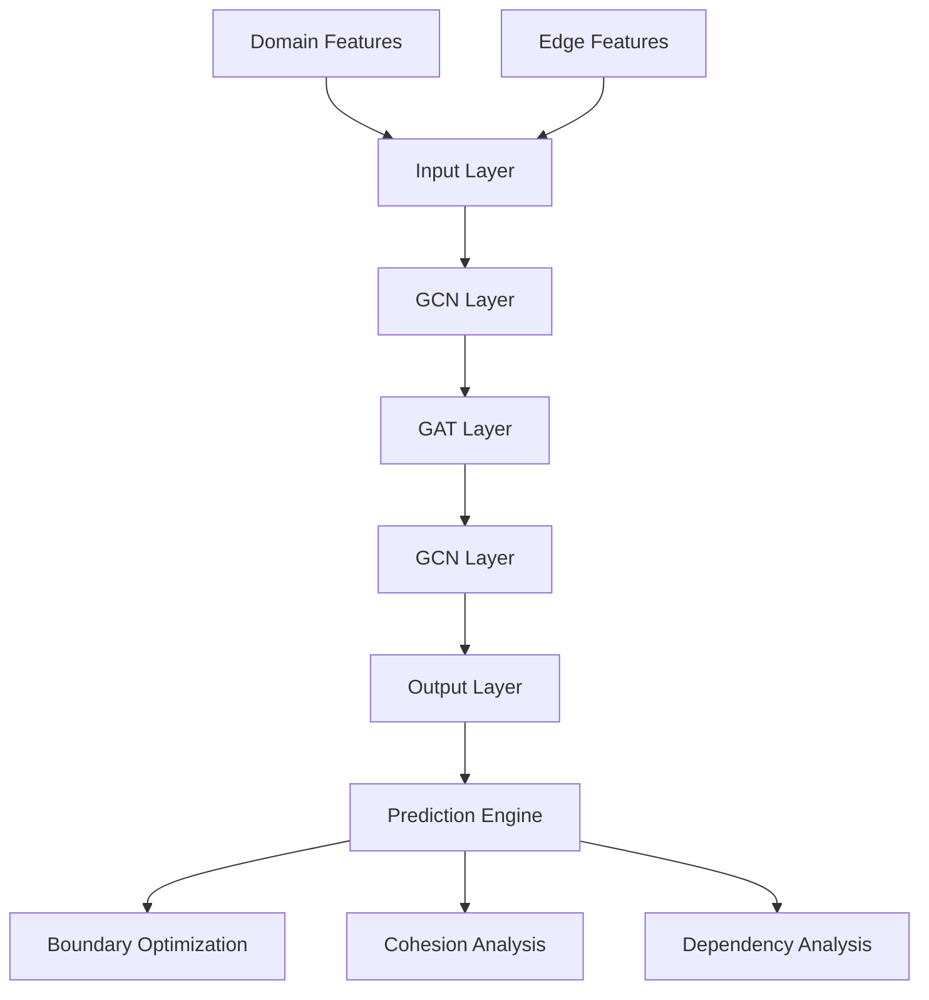
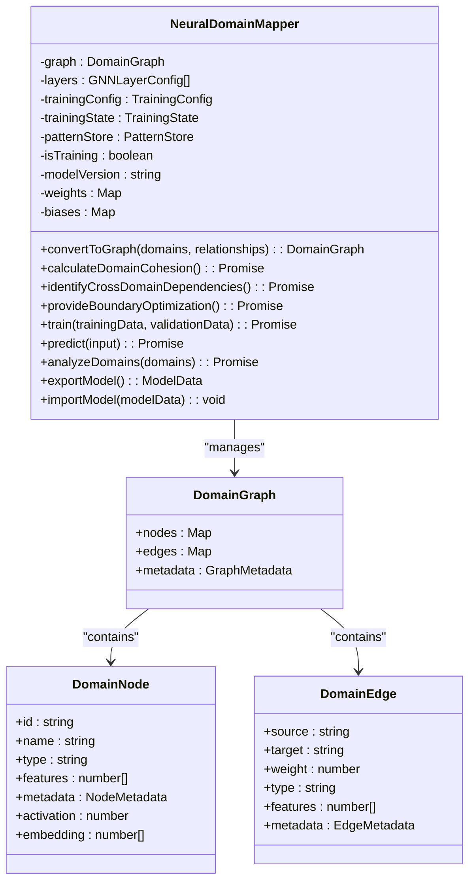
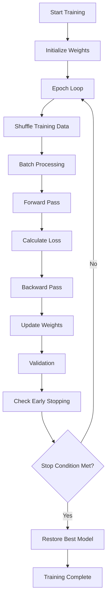
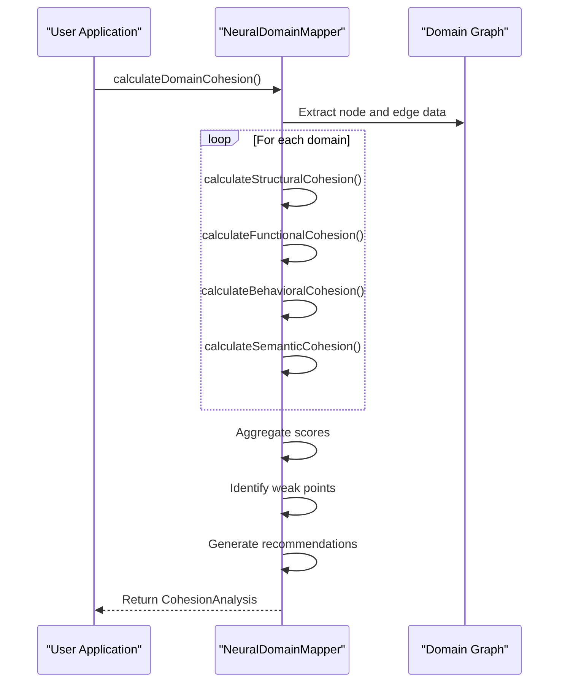
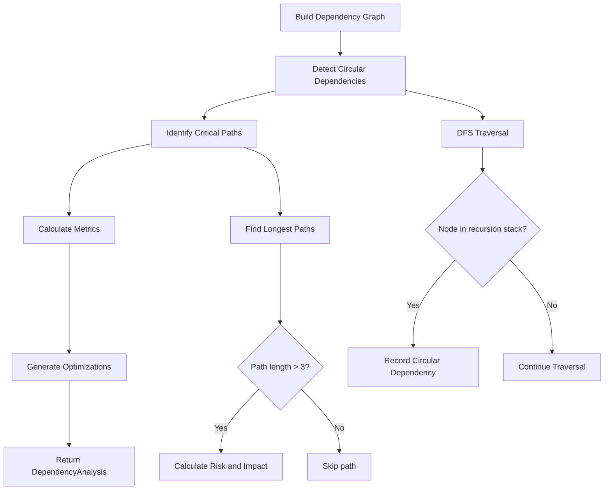
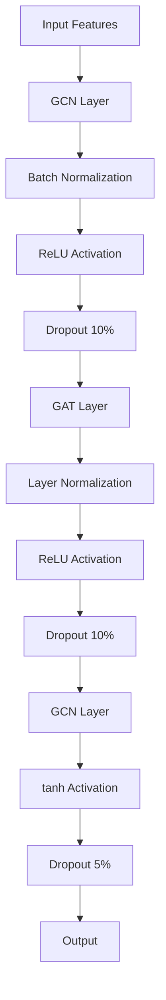
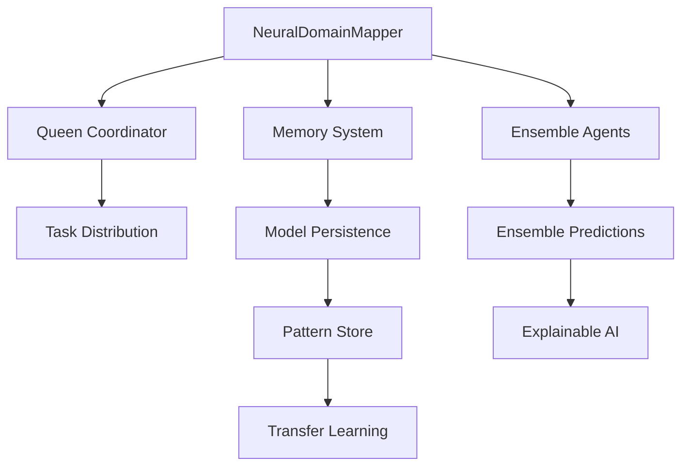
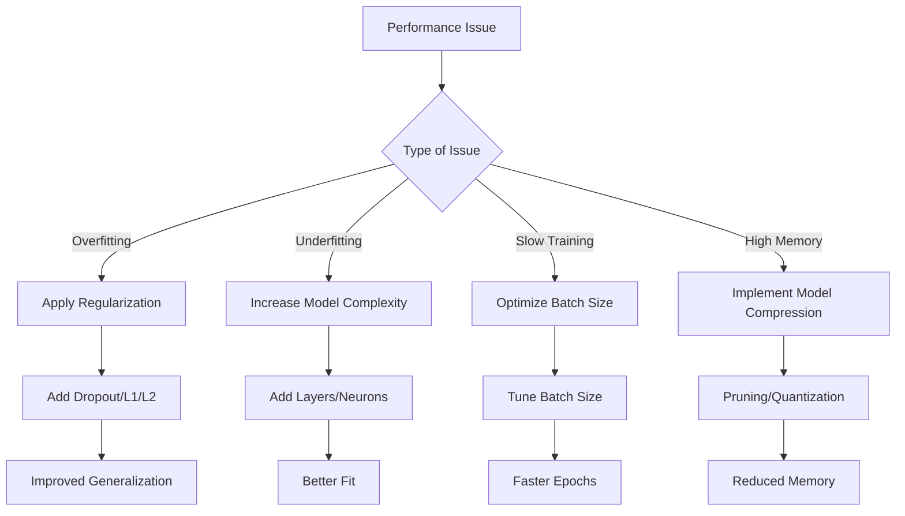

# Neural Networks

<cite>
**Referenced Files in This Document**   
- [NeuralDomainMapper.ts](file://src/neural/NeuralDomainMapper.ts)
</cite>

## Table of Contents
1. [Neural Network Architecture](#neural-network-architecture)
2. [Core Components](#core-components)
3. [Training and Inference](#training-and-inference)
4. [Domain Analysis Capabilities](#domain-analysis-capabilities)
5. [Model Optimization and Performance](#model-optimization-and-performance)
6. [Integration with System Components](#integration-with-system-components)
7. [Common Issues and Solutions](#common-issues-and-solutions)

## Neural Network Architecture

The Neural Networks component in Claude-Flow implements a Graph Neural Network (GNN) architecture designed for domain modeling and cognitive computing. The system uses a hybrid GNN approach combining Graph Convolutional Network (GCN) and Graph Attention Network (GAT) layers to analyze and optimize software domain structures.

**Diagram sources**
- [NeuralDomainMapper.ts](file://src/neural/NeuralDomainMapper.ts#L254-L1665)

**Section sources**
- [NeuralDomainMapper.ts](file://src/neural/NeuralDomainMapper.ts#L254-L1665)

## Core Components

The NeuralDomainMapper class serves as the central component for neural pattern recognition and adaptive learning in Claude-Flow. This implementation extends EventEmitter to facilitate event-driven communication with other system components.

### NeuralDomainMapper Implementation

The NeuralDomainMapper implements a multi-layer GNN architecture with configurable training parameters and domain analysis capabilities. The class manages the complete lifecycle of neural network operations from initialization to model persistence.

**Diagram sources**
- [NeuralDomainMapper.ts](file://src/neural/NeuralDomainMapper.ts#L254-L1665)

**Section sources**
- [NeuralDomainMapper.ts](file://src/neural/NeuralDomainMapper.ts#L254-L1665)

## Training and Inference

The neural network implementation supports comprehensive training and inference capabilities with adaptive learning mechanisms and model compression techniques.

### Training Configuration

The NeuralDomainMapper uses a configurable training setup with the following default parameters:

**Training Configuration**
- learningRate: 0.001
- batchSize: 32
- epochs: 100
- optimizer: adam
- lossFunction: mse
- regularization: { l1: 0.0001, l2: 0.0001, dropout: 0.1 }
- earlyStoping: { enabled: true, patience: 10, minDelta: 0.001 }
- validationSplit: 0.2

### Training Process

The training process follows a standard supervised learning approach with forward and backward passes through the network layers.

**Diagram sources**
- [NeuralDomainMapper.ts](file://src/neural/NeuralDomainMapper.ts#L254-L1665)

**Section sources**
- [NeuralDomainMapper.ts](file://src/neural/NeuralDomainMapper.ts#L254-L1665)

## Domain Analysis Capabilities

The NeuralDomainMapper provides advanced domain analysis capabilities that leverage neural pattern recognition to identify optimization opportunities in software architecture.

### Domain Cohesion Analysis

The system calculates comprehensive cohesion scores based on four key factors:

**Cohesion Factors**
- structural: Connectivity and graph topology
- functional: Purpose alignment and type consistency
- behavioral: Interaction patterns and reliability
- semantic: Naming similarity and metadata alignment

**Diagram sources**
- [NeuralDomainMapper.ts](file://src/neural/NeuralDomainMapper.ts#L254-L1665)

**Section sources**
- [NeuralDomainMapper.ts](file://src/neural/NeuralDomainMapper.ts#L254-L1665)

### Cross-Domain Dependency Analysis

The system identifies and analyzes cross-domain dependencies to detect architectural issues and optimization opportunities.

**Diagram sources**
- [NeuralDomainMapper.ts](file://src/neural/NeuralDomainMapper.ts#L254-L1665)

**Section sources**
- [NeuralDomainMapper.ts](file://src/neural/NeuralDomainMapper.ts#L254-L1665)

## Model Optimization and Performance

The neural network implementation includes several optimization techniques to improve performance and prevent overfitting.

### Network Architecture

The GNN architecture consists of three layers with different configurations:

**Layer Configuration**
- Layer 1: GCN with ReLU activation, batch normalization, 0.1 dropout
- Layer 2: GAT with 8 attention heads, ReLU activation, layer normalization, 0.1 dropout
- Layer 3: GCN with tanh activation, 0.05 dropout

### Regularization Techniques

The system implements multiple regularization techniques to prevent overfitting:

**Regularization Methods**
- L1/L2 regularization on weights
- Dropout during training
- Early stopping based on validation performance
- Learning rate scheduling

**Diagram sources**
- [NeuralDomainMapper.ts](file://src/neural/NeuralDomainMapper.ts#L254-L1665)

**Section sources**
- [NeuralDomainMapper.ts](file://src/neural/NeuralDomainMapper.ts#L254-L1665)

## Integration with System Components

The NeuralDomainMapper integrates with other system components to provide cognitive computing capabilities across the Claude-Flow ecosystem.

### Queen Coordinator Integration

The neural network components communicate with the Queen coordinator through event-driven messaging, allowing for distributed processing and task coordination.

### Memory System Integration

The system leverages the memory system for model persistence and pattern storage, enabling transfer learning and ensemble modeling capabilities.

**Diagram sources**
- [NeuralDomainMapper.ts](file://src/neural/NeuralDomainMapper.ts#L254-L1665)

**Section sources**
- [NeuralDomainMapper.ts](file://src/neural/NeuralDomainMapper.ts#L254-L1665)

## Common Issues and Solutions

The neural network implementation addresses common machine learning challenges with specific strategies and optimization techniques.

### Overfitting Prevention

The system implements multiple strategies to prevent overfitting:

**Overfitting Solutions**
- Early stopping with configurable patience
- Dropout regularization at multiple layers
- L1/L2 weight regularization
- Validation split for performance monitoring
- Learning rate scheduling to prevent divergence

### Model Drift Management

The system includes mechanisms to detect and address model drift:

**Model Drift Solutions**
- Regular retraining with updated data
- Performance monitoring and alerting
- Model versioning and rollback capabilities
- Continuous validation against new data

### Performance Optimization

The implementation includes several performance optimization strategies:

**Performance Optimizations**
- Efficient matrix operations for forward/backward passes
- Batch processing to leverage parallel computation
- Weight initialization using Xavier/Glorot method
- Simplified gradient calculations for faster training
- Model compression through pruning and quantization

**Diagram sources**
- [NeuralDomainMapper.ts](file://src/neural/NeuralDomainMapper.ts#L254-L1665)

**Section sources**
- [NeuralDomainMapper.ts](file://src/neural/NeuralDomainMapper.ts#L254-L1665)