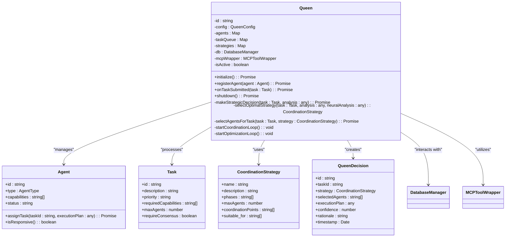
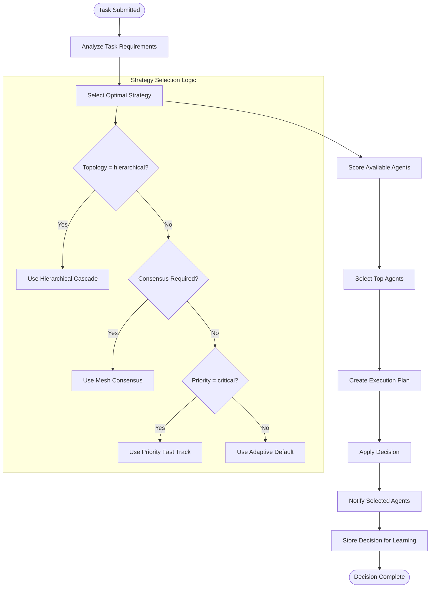
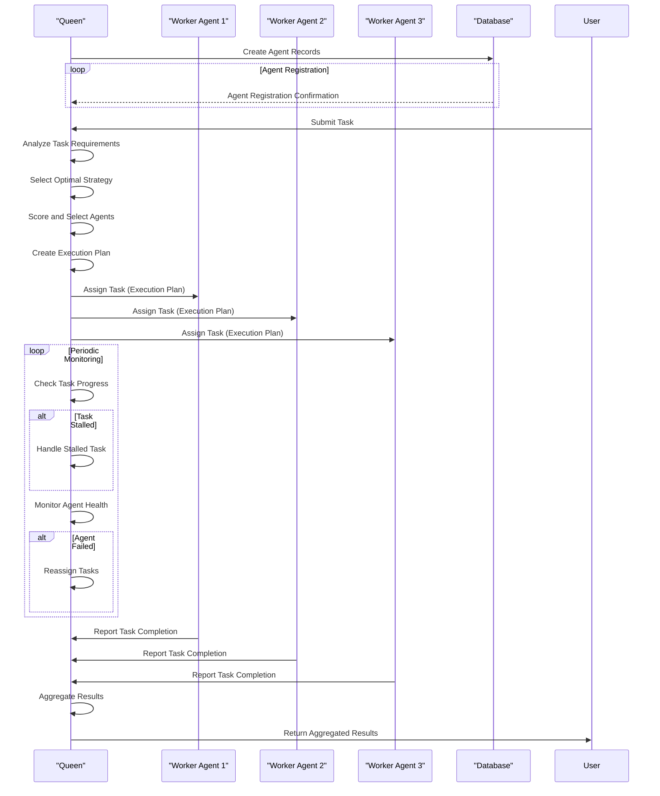
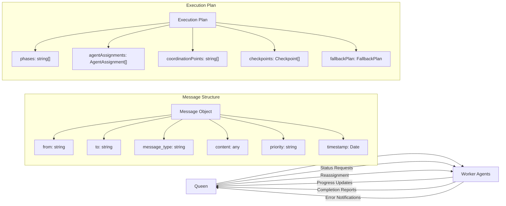
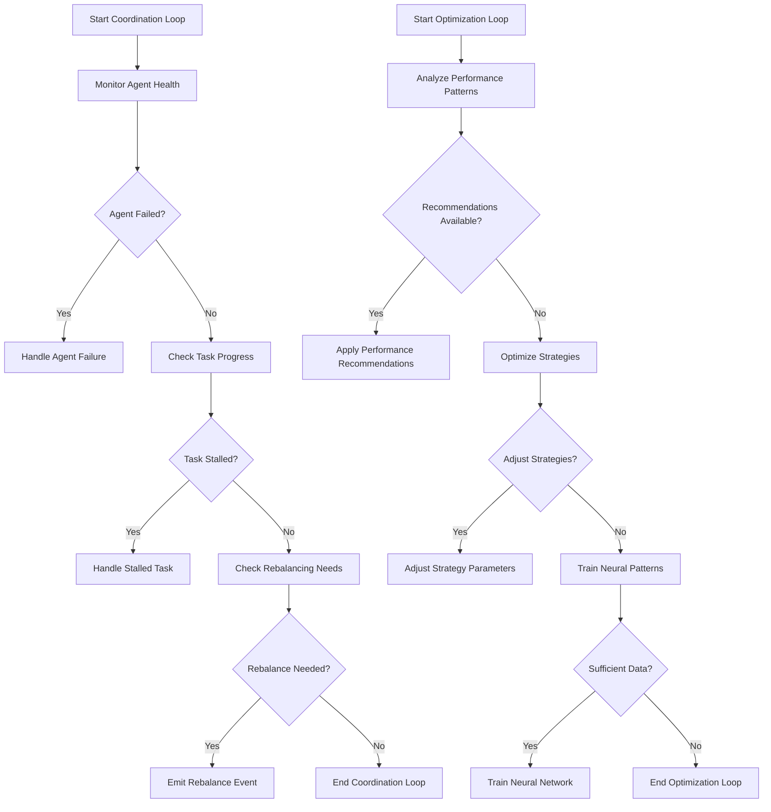
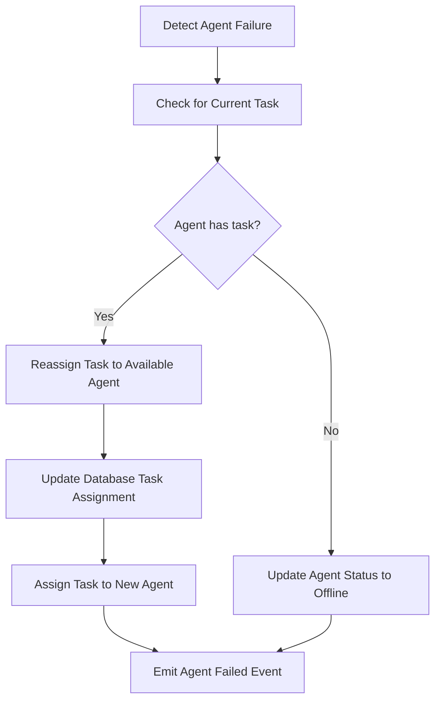
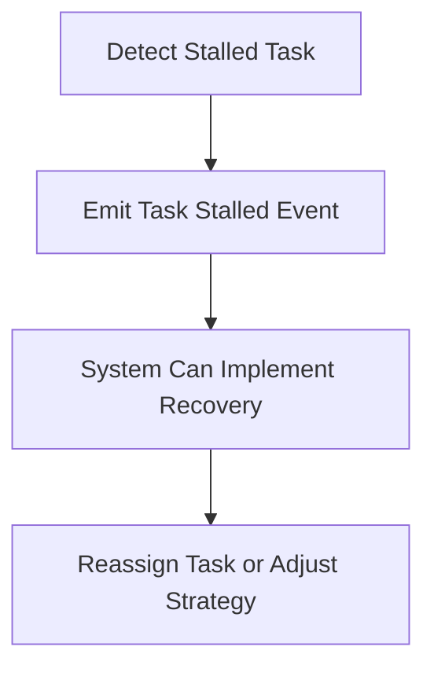
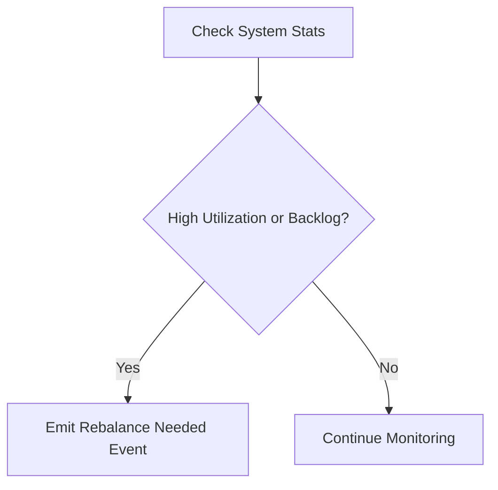

# Queen-Led Coordination

<cite>
**Referenced Files in This Document**   
- [Queen.ts](file://src/hive-mind/core/Queen.ts#L28-L773)
- [hive-agents.ts](file://src/cli/agents/hive-agents.ts#L628-L699)
- [daa-tools.js](file://src/mcp/implementations/daa-tools.js#L171-L219)
</cite>

## Table of Contents
1. [Introduction](#introduction)
2. [Queen Class Implementation](#queen-class-implementation)
3. [Strategic Planning and Decision Making](#strategic-planning-and-decision-making)
4. [Agent Coordination and Task Management](#agent-coordination-and-task-management)
5. [Queen-to-Agent Communication Model](#queen-to-agent-communication-model)
6. [Performance Monitoring and Optimization](#performance-monitoring-and-optimization)
7. [Queen Failure Scenarios and Solutions](#queen-failure-scenarios-and-solutions)
8. [Conclusion](#conclusion)

## Introduction
The Queen class serves as the central decision-making component in the swarm system, orchestrating the activities of worker agents and ensuring efficient task execution. This document provides a comprehensive analysis of the Queen's implementation, responsibilities, and interactions within the swarm architecture. The Queen is responsible for strategic planning, agent coordination, performance monitoring, and system governance, making it the pivotal element in maintaining swarm efficiency and effectiveness.

**Section sources**
- [Queen.ts](file://src/hive-mind/core/Queen.ts#L28-L773)

## Queen Class Implementation
The Queen class is implemented as an EventEmitter that extends the core coordination capabilities of the swarm system. It maintains several key data structures including a Map of agents, a task queue, and coordination strategies. The class is initialized with a configuration object that specifies the swarm ID, operational mode, and topology.

**Diagram sources**
- [Queen.ts](file://src/hive-mind/core/Queen.ts#L28-L773)

**Section sources**
- [Queen.ts](file://src/hive-mind/core/Queen.ts#L28-L773)

## Strategic Planning and Decision Making
The Queen's strategic planning capabilities are centered around the `makeStrategicDecision` method, which analyzes tasks and determines optimal execution strategies. When a task is submitted, the Queen first analyzes its requirements using MCP (Multi-agent Coordination Protocol) tools, then selects the most appropriate coordination strategy based on task complexity, priority, and system topology.

The decision-making process involves several key steps:
1. Task analysis to determine complexity and required capabilities
2. Strategy selection based on multiple factors including topology and priority
3. Agent selection by scoring available agents on capability match, type suitability, workload, and historical performance
4. Execution plan creation with defined phases, agent roles, and checkpoints

**Diagram sources**
- [Queen.ts](file://src/hive-mind/core/Queen.ts#L28-L773)

**Section sources**
- [Queen.ts](file://src/hive-mind/core/Queen.ts#L28-L773)

## Agent Coordination and Task Management
The Queen coordinates worker agents through a systematic process of task assignment, progress tracking, and result aggregation. When agents are created, they are automatically registered with the Queen, who maintains a registry of all active agents and their capabilities.

The task management workflow follows this sequence:
1. Task submission to the Queen
2. Strategic decision making and agent selection
3. Task assignment to selected agents
4. Continuous monitoring of task progress
5. Result collection and aggregation

**Diagram sources**
- [Queen.ts](file://src/hive-mind/core/Queen.ts#L28-L773)
- [hive-agents.ts](file://src/cli/agents/hive-agents.ts#L628-L699)

**Section sources**
- [Queen.ts](file://src/hive-mind/core/Queen.ts#L28-L773)

## Queen-to-Agent Communication Model
The Queen communicates with worker agents through a structured message-passing system that ensures reliable coordination and information exchange. The communication model includes both direct agent assignment and broadcast mechanisms for system-wide notifications.

The message format includes the following key components:
- **from**: The sender's agent ID
- **to**: The recipient's agent ID (or null for broadcast)
- **message_type**: The type of communication (task_assignment, status_update, etc.)
- **content**: The message payload, typically containing task details or instructions
- **priority**: The message priority level
- **timestamp**: When the message was created

When the Queen assigns a task, it creates an execution plan that includes:
- Phases of execution
- Agent assignments with specific roles and responsibilities
- Coordination points for synchronization
- Checkpoints for progress verification
- A fallback plan for handling failures

**Diagram sources**
- [Queen.ts](file://src/hive-mind/core/Queen.ts#L28-L773)
- [daa-tools.js](file://src/mcp/implementations/daa-tools.js#L171-L219)

**Section sources**
- [Queen.ts](file://src/hive-mind/core/Queen.ts#L28-L773)

## Performance Monitoring and Optimization
The Queen continuously monitors system performance through two dedicated loops: a coordination loop that runs every 5 seconds and an optimization loop that runs every minute. These loops enable proactive system management and continuous improvement.

The coordination loop performs three key monitoring functions:
1. **Agent Health Monitoring**: Checks if agents are responsive and handles failures
2. **Task Progress Monitoring**: Identifies stalled tasks that haven't progressed in 10 minutes
3. **System Rebalancing**: Detects high agent utilization or task backlog that requires resource adjustment

The optimization loop focuses on long-term system improvement:
1. **Performance Pattern Analysis**: Uses MCP tools to identify performance trends
2. **Strategy Optimization**: Adjusts coordination strategies based on effectiveness
3. **Neural Pattern Training**: Trains neural networks on successful decisions for future learning

**Diagram sources**
- [Queen.ts](file://src/hive-mind/core/Queen.ts#L28-L773)

**Section sources**
- [Queen.ts](file://src/hive-mind/core/Queen.ts#L28-L773)

## Queen Failure Scenarios and Solutions
The Queen implements several mechanisms to handle failure scenarios and ensure system resilience. While the Queen is a central component, the system includes safeguards to maintain functionality even when the Queen encounters issues.

### Agent Failure Handling
When an agent fails or becomes unresponsive, the Queen automatically reassigns its tasks to available agents:

### Stalled Task Recovery
Tasks that stall (show no progress for 10 minutes) trigger a recovery process:

### System Rebalancing
When system load becomes unbalanced, the Queen emits a rebalance event:

The primary solution for Queen failure scenarios is proactive monitoring and automatic recovery. The Queen continuously monitors agent health and task progress, automatically reassigning tasks when agents fail or tasks stall. For system-wide rebalancing, the Queen emits events that can be handled by higher-level system components.

**Section sources**
- [Queen.ts](file://src/hive-mind/core/Queen.ts#L28-L773)

## Conclusion
The Queen class serves as the central intelligence in the swarm system, providing strategic planning, agent coordination, and performance optimization capabilities. Through its sophisticated decision-making algorithms, the Queen analyzes tasks, selects optimal strategies, and assigns work to the most suitable agents. The continuous monitoring loops ensure system health and enable proactive optimization. The communication model provides a robust framework for task assignment and progress tracking, while the failure handling mechanisms maintain system resilience. This comprehensive implementation makes the Queen an effective central coordinator that can adapt to changing conditions and optimize swarm performance over time.