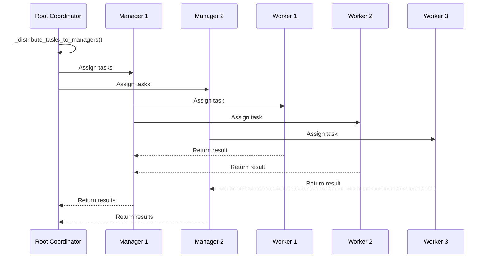
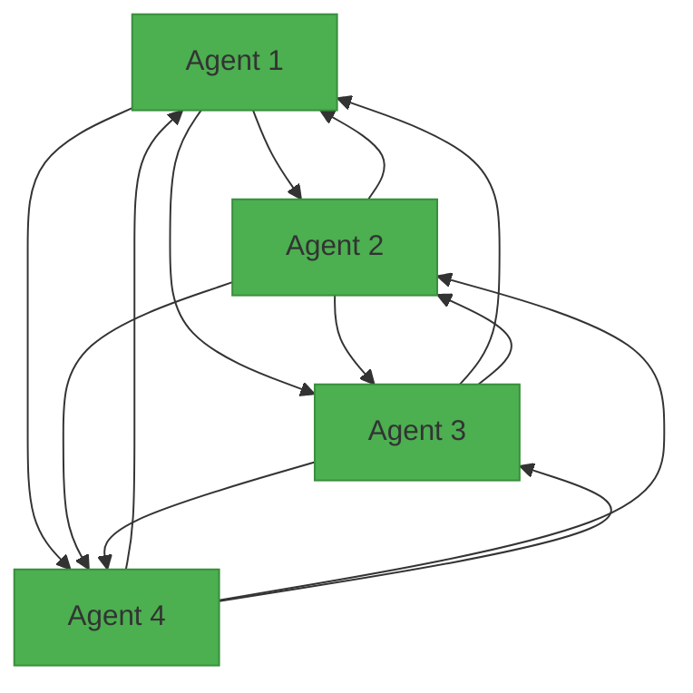
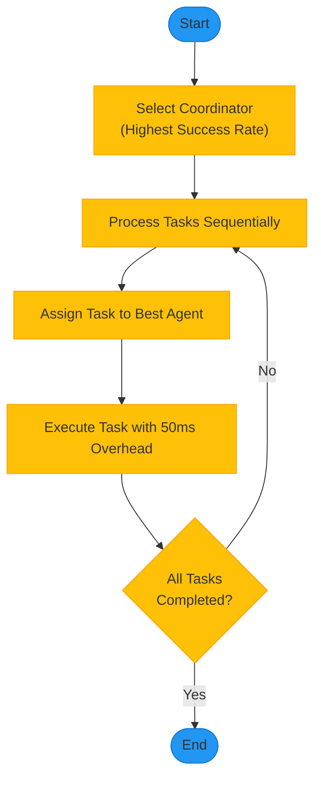
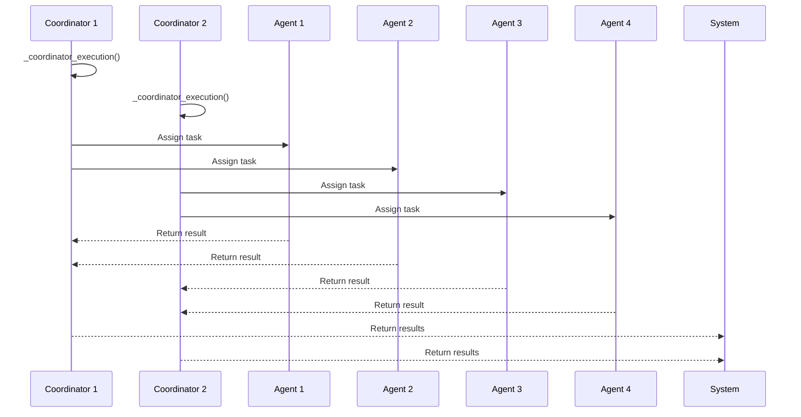
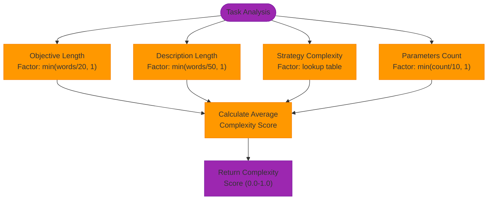
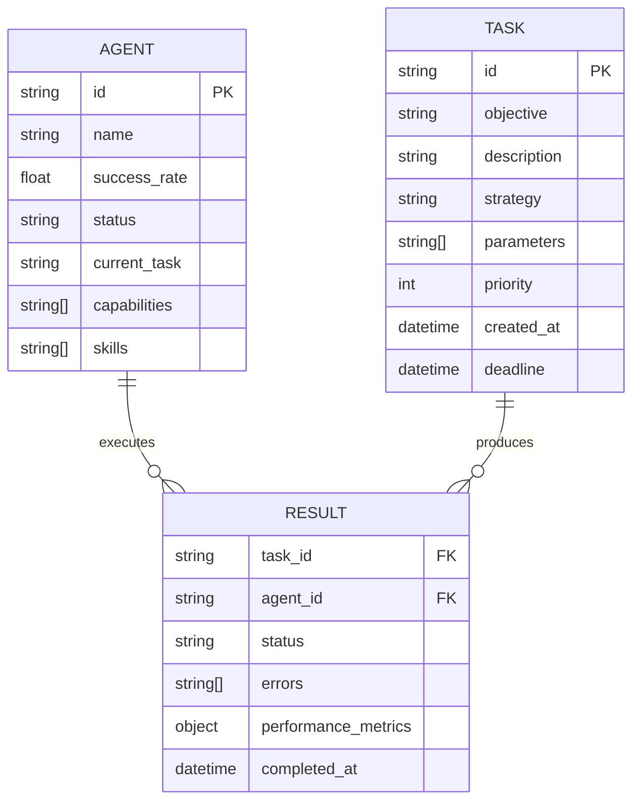

# Swarm Topologies

<cite>
**Referenced Files in This Document**   
- [hierarchical_mode.py](file://benchmark/src/swarm_benchmark/modes/hierarchical_mode.py)
- [mesh_mode.py](file://benchmark/src/swarm_benchmark/modes/mesh_mode.py)
- [hybrid_mode.py](file://benchmark/src/swarm_benchmark/modes/hybrid_mode.py)
- [centralized_mode.py](file://benchmark/src/swarm_benchmark/modes/centralized_mode.py)
- [distributed_mode.py](file://benchmark/src/swarm_benchmark/modes/distributed_mode.py)
- [base_mode.py](file://benchmark/src/swarm_benchmark/modes/base_mode.py)
- [models.py](file://benchmark/src/swarm_benchmark/core/models.py)
</cite>

## Table of Contents
1. [Introduction](#introduction)
2. [Core Topology Models](#core-topology-models)
3. [Hierarchical Topology](#hierarchical-topology)
4. [Mesh Topology](#mesh-topology)
5. [Centralized Topology](#centralized-topology)
6. [Distributed Topology](#distributed-topology)
7. [Hybrid Topology](#hybrid-topology)
8. [Domain Model of Swarm Relationships](#domain-model-of-swarm-relationships)
9. [Configuration and Parameter Tuning](#configuration-and-parameter-tuning)
10. [Common Issues and Optimization Strategies](#common-issues-and-optimization-strategies)

## Introduction
Swarm topologies define the structural configurations of agent swarms, determining how agents communicate, coordinate tasks, and distribute workloads. The system implements five primary topology models: hierarchical, mesh, centralized, distributed, and hybrid. Each topology offers distinct advantages in communication patterns, fault tolerance, and performance characteristics. This document provides a comprehensive analysis of these topologies, their implementation details, and practical considerations for deployment and optimization.

**Section sources**
- [hierarchical_mode.py](file://benchmark/src/swarm_benchmark/modes/hierarchical_mode.py)
- [mesh_mode.py](file://benchmark/src/swarm_benchmark/modes/mesh_mode.py)
- [hybrid_mode.py](file://benchmark/src/swarm_benchmark/modes/hybrid_mode.py)

## Core Topology Models
The swarm system implements a modular topology framework based on the `BaseCoordinationMode` class, which defines the common interface for all coordination strategies. Each topology inherits from this base class and implements specific coordination logic tailored to its structural characteristics.

```mermaid
classDiagram
class BaseCoordinationMode {
+name : str
+description : str
+coordinate(agents : List[Agent], tasks : List[Task]) List[Result]
+get_coordination_metrics() Dict[str, Any]
}
class CentralizedMode {
-coordinator_agent : Agent
+_select_coordinator(agents : List[Agent]) Agent
+_centralized_execution(agents : List[Agent], tasks : List[Task]) List[Result]
}
class DistributedMode {
-coordinator_agents : List[Agent]
-task_assignments : Dict[str, str]
+_select_coordinators(agents : List[Agent]) List[Agent]
+_distribute_tasks(tasks : List[Task]) Dict[Agent, List[Task]]
}
class HierarchicalMode {
-root_coordinator : Agent
-hierarchy_levels : Dict[int, List[Agent]]
+_build_hierarchy(agents : List[Agent]) void
+_hierarchical_execution(tasks : List[Task]) List[Result]
}
class MeshMode {
-peer_connections : Dict[str, Dict]
-task_negotiations : Dict[str, Dict]
+_establish_mesh_connections(agents : List[Agent]) void
+_negotiate_task_assignments(agents : List[Agent], tasks : List[Task]) Dict[Agent, List[Task]]
}
class HybridMode {
-coordination_strategies : Dict[str, BaseCoordinationMode]
-strategy_usage : Dict[str, int]
-task_strategy_mapping : Dict[str, str]
+_partition_tasks_by_strategy(agents : List[Agent], tasks : List[Task]) Dict[str, tuple]
+_select_optimal_strategy(task : Task, agents : List[Agent]) str
}
BaseCoordinationMode <|-- CentralizedMode
BaseCoordinationMode <|-- DistributedMode
BaseCoordinationMode <|-- HierarchicalMode
BaseCoordinationMode <|-- MeshMode
BaseCoordinationMode <|-- HybridMode
```



**Diagram sources**
- [base_mode.py](file://benchmark/src/swarm_benchmark/modes/base_mode.py)
- [centralized_mode.py](file://benchmark/src/swarm_benchmark/modes/centralized_mode.py)
- [distributed_mode.py](file://benchmark/src/swarm_benchmark/modes/distributed_mode.py)
- [hierarchical_mode.py](file://benchmark/src/swarm_benchmark/modes/hierarchical_mode.py)
- [mesh_mode.py](file://benchmark/src/swarm_benchmark/modes/mesh_mode.py)
- [hybrid_mode.py](file://benchmark/src/swarm_benchmark/modes/hybrid_mode.py)

**Section sources**
- [base_mode.py](file://benchmark/src/swarm_benchmark/modes/base_mode.py)
- [centralized_mode.py](file://benchmark/src/swarm_benchmark/modes/centralized_mode.py)
- [distributed_mode.py](file://benchmark/src/swarm_benchmark/modes/distributed_mode.py)

## Hierarchical Topology
The hierarchical topology implements a tree structure with multiple levels of authority and responsibility. This model organizes agents into a clear hierarchy with a root coordinator, managers, and workers, enabling efficient task delegation and oversight.

### Implementation Details
The `HierarchicalMode` class builds a three-level hierarchy based on agent success rates, with the highest-performing agent serving as the root coordinator. The hierarchy construction algorithm sorts agents by success rate and distributes them across levels:

```python
def _build_hierarchy(self, agents: List[Agent]) -> None:
    """Build agent hierarchy."""
    if len(agents) <= 1:
        self.root_coordinator = agents[0] if agents else None
        self.hierarchy_levels = {0: agents}
        return
    
    # Sort agents by success rate for hierarchy assignment
    sorted_agents = sorted(agents, key=lambda a: a.success_rate, reverse=True)
    
    # Assign hierarchy levels
    self.root_coordinator = sorted_agents[0]
    
    # Simple 3-level hierarchy
    if len(sorted_agents) <= 3:
        self.hierarchy_levels = {
            0: [self.root_coordinator],  # Root
            1: sorted_agents[1:2],       # Managers
            2: sorted_agents[2:]         # Workers
        }
    else:
        num_managers = max(1, len(sorted_agents) // 3)
        self.hierarchy_levels = {
            0: [self.root_coordinator],                    # Root
            1: sorted_agents[1:1+num_managers],           # Managers
            2: sorted_agents[1+num_managers:]             # Workers
        }
```

### Communication Patterns
The hierarchical model follows a top-down communication pattern where the root coordinator distributes tasks to managers, who then assign work to workers. This creates a clear chain of command but introduces coordination overhead at each level.



**Diagram sources**
- [hierarchical_mode.py](file://benchmark/src/swarm_benchmark/modes/hierarchical_mode.py#L100-L150)

### Performance Characteristics
The hierarchical topology introduces a coordination overhead of approximately 80ms per task due to the multi-level delegation process. However, this model excels in complex tasks where oversight and quality control are critical. The hierarchy efficiency metric tracks the success rate of tasks completed through the hierarchical structure.

**Section sources**
- [hierarchical_mode.py](file://benchmark/src/swarm_benchmark/modes/hierarchical_mode.py)

## Mesh Topology
The mesh topology implements a peer-to-peer network where all agents can communicate directly with each other. This decentralized model enables flexible task negotiation and high fault tolerance.

### Implementation Details
The `MeshMode` class establishes a full mesh network where each agent maintains connections to all other agents. The connection strength and communication latency are randomly initialized to simulate real-world network conditions:

```python
def _establish_mesh_connections(self, agents: List[Agent]) -> None:
    """Establish peer-to-peer connections."""
    # Create full mesh connections (each agent knows all others)
    self.peer_connections = {}
    
    for agent in agents:
        self.peer_connections[agent.id] = {
            "peers": [a.id for a in agents if a.id != agent.id],
            "connection_strength": {
                peer.id: random.uniform(0.7, 1.0) 
                for peer in agents if peer.id != agent.id
            },
            "communication_latency": {
                peer.id: random.uniform(0.01, 0.05) 
                for peer in agents if peer.id != agent.id
            }
        }
```

### Task Negotiation Process
Tasks are assigned through a decentralized negotiation process where agents "bid" for tasks based on their capabilities, current load, and random factors:

```python
def _peer_task_negotiation(self, task: Task, available_agents: List[Agent]) -> Agent:
    """Simulate peer-to-peer task negotiation."""
    if not available_agents:
        return None
    
    # Simulate auction-based assignment
    agent_bids = {}
    
    for agent in available_agents:
        # Calculate bid based on success rate, current load, and random factor
        base_bid = agent.success_rate
        load_factor = 1.0 - (len([t for t in self.task_negotiations.values() 
                                  if t.get("assigned_agent") == agent.id]) * 0.1)
        random_factor = random.uniform(0.8, 1.2)
        
        bid = base_bid * load_factor * random_factor
        agent_bids[agent] = bid
    
    # Select agent with highest bid
    winning_agent = max(agent_bids.items(), key=lambda x: x[1])[0]
    return winning_agent
```

### Communication Patterns
The mesh topology enables direct communication between any agents, eliminating bottlenecks but increasing overall network complexity:



**Diagram sources**
- [mesh_mode.py](file://benchmark/src/swarm_benchmark/modes/mesh_mode.py#L50-L80)

### Performance Characteristics
The mesh topology has the highest coordination overhead (150-250ms) due to the negotiation process but offers excellent fault tolerance and load balancing. The average connection strength and negotiation count metrics help assess network health and efficiency.

**Section sources**
- [mesh_mode.py](file://benchmark/src/swarm_benchmark/modes/mesh_mode.py)

## Centralized Topology
The centralized topology features a single coordinator that manages all tasks and agents. This model provides simplicity and clear accountability but creates a potential single point of failure.

### Implementation Details
The `CentralizedMode` class selects a coordinator based on agent success rates and processes tasks sequentially through this central authority:

```python
def _select_coordinator(self, agents: List[Agent]) -> Agent:
    """Select the coordinator agent."""
    # Simple selection: use first available agent or one with highest success rate
    available_agents = [a for a in agents if a.status == AgentStatus.IDLE]
    
    if not available_agents:
        return agents[0]  # Fallback to any agent
    
    # Select agent with highest success rate
    coordinator = max(available_agents, key=lambda a: a.success_rate)
    return coordinator
```

### Task Distribution Process
Tasks are processed sequentially with the coordinator assigning each task to the most suitable available agent:



**Diagram sources**
- [centralized_mode.py](file://benchmark/src/swarm_benchmark/modes/centralized_mode.py#L50-L70)

### Performance Characteristics
The centralized topology has the lowest coordination overhead (50ms) but may become a bottleneck under high load. The coordinator efficiency metric measures the success rate of tasks managed by the central authority.

**Section sources**
- [centralized_mode.py](file://benchmark/src/swarm_benchmark/modes/centralized_mode.py)

## Distributed Topology
The distributed topology employs multiple coordinators that manage tasks independently, combining the benefits of centralization with improved scalability and fault tolerance.

### Implementation Details
The `DistributedMode` class selects 2-3 coordinators based on agent success rates and distributes tasks among them using a round-robin approach:

```python
def _select_coordinators(self, agents: List[Agent]) -> List[Agent]:
    """Select multiple coordinator agents."""
    available_agents = [a for a in agents if a.status == AgentStatus.IDLE]
    
    if not available_agents:
        return agents[:1]  # Fallback to any agent
    
    # Select 2-3 coordinators based on agent pool size
    num_coordinators = min(max(2, len(available_agents) // 3), 3)
    
    # Select agents with highest success rates
    coordinators = sorted(available_agents, key=lambda a: a.success_rate, reverse=True)[:num_coordinators]
    
    return coordinators
```

### Parallel Execution Model
Each coordinator manages a subset of agents and processes tasks independently, enabling true parallel execution:



**Diagram sources**
- [distributed_mode.py](file://benchmark/src/swarm_benchmark/modes/distributed_mode.py#L100-L150)

### Performance Characteristics
The distributed topology balances coordination overhead (100-180ms) with excellent scalability. The coordinator count and task distribution metrics help optimize the balance between parallelism and coordination costs.

**Section sources**
- [distributed_mode.py](file://benchmark/src/swarm_benchmark/modes/distributed_mode.py)

## Hybrid Topology
The hybrid topology combines multiple coordination strategies adaptively, selecting the optimal approach for each task based on complexity, agent count, and task type.

### Implementation Details
The `HybridMode` class maintains instances of all coordination strategies and dynamically partitions tasks among them:

```python
def __init__(self):
    """Initialize hybrid coordination mode."""
    super().__init__()
    self.coordination_strategies = {
        "centralized": CentralizedMode(),
        "distributed": DistributedMode(),
        "hierarchical": HierarchicalMode(),
        "mesh": MeshMode()
    }
    self.strategy_usage = {}
    self.task_strategy_mapping = {}
```

### Adaptive Strategy Selection
Tasks are assigned to strategies based on heuristics considering task complexity, agent count, and task type:

```python
def _select_optimal_strategy(self, task: Task, agents: List[Agent]) -> str:
    """Select optimal coordination strategy for a task."""
    # Decision factors
    task_complexity = self._estimate_task_complexity(task)
    agent_count = len(agents)
    task_type = task.strategy.value.lower()
    
    # Strategy selection heuristics
    if agent_count <= 2:
        return "centralized"  # Few agents, centralized is optimal
    
    if task_complexity > 0.8 and agent_count >= 5:
        return "hierarchical"  # Complex tasks benefit from hierarchy
    
    if task_type in ["research", "analysis"] and agent_count >= 4:
        return "distributed"  # Research tasks work well distributed
    
    if task_type in ["development", "testing"] and agent_count >= 6:
        return "mesh"  # Development benefits from peer coordination
    
    # Default strategies based on agent count
    if agent_count >= 8:
        return random.choice(["distributed", "mesh"])  # Large groups
    elif agent_count >= 4:
        return random.choice(["hierarchical", "distributed"])  # Medium groups
    else:
        return "centralized"  # Small groups
```

### Task Complexity Estimation
The hybrid model estimates task complexity using multiple factors including objective length, description length, strategy type, and parameter count:



**Diagram sources**
- [hybrid_mode.py](file://benchmark/src/swarm_benchmark/modes/hybrid_mode.py#L150-L200)

### Performance Characteristics
The hybrid topology uses an adaptation score to measure how effectively it utilizes multiple strategies. The score combines diversity (number of strategies used) and balance (evenness of usage) to assess overall effectiveness.

**Section sources**
- [hybrid_mode.py](file://benchmark/src/swarm_benchmark/modes/hybrid_mode.py)

## Domain Model of Swarm Relationships
The swarm system implements a rich domain model for agent relationships, capturing both structural hierarchies and dynamic interactions.

### Core Data Structures
The `Agent` and `Task` models define the fundamental entities in the swarm system:



**Diagram sources**
- [models.py](file://benchmark/src/swarm_benchmark/core/models.py)

### Relationship Patterns
The system supports four primary relationship patterns that correspond to the different topology models:

1. **Parent-Child Hierarchy**: Used in hierarchical topology, where higher-level agents manage lower-level agents
2. **Peer-to-Peer Network**: Used in mesh topology, where all agents have equal status and communicate directly
3. **Centralized Control**: Used in centralized topology, where one agent controls all others
4. **Multiple Authority**: Used in distributed topology, where several agents share coordination responsibilities

These relationships are dynamically established based on the selected topology and can be reconfigured as system conditions change.

**Section sources**
- [models.py](file://benchmark/src/swarm_benchmark/core/models.py)
- [hierarchical_mode.py](file://benchmark/src/swarm_benchmark/modes/hierarchical_mode.py)
- [mesh_mode.py](file://benchmark/src/swarm_benchmark/modes/mesh_mode.py)

## Configuration and Parameter Tuning
The swarm topologies can be configured and tuned through various parameters to optimize performance for specific use cases.

### Topology Selection
The topology is selected by specifying the coordination mode in the configuration:

```python
# Configuration example
config = {
    "coordination_mode": "hybrid",  # Options: centralized, distributed, hierarchical, mesh, hybrid
    "max_coordinators": 3,
    "hierarchy_levels": 3,
    "mesh_negotiation_timeout": 0.25
}
```

### Performance Tuning Parameters
Each topology has specific parameters that can be adjusted to optimize performance:

| Topology | Tunable Parameter | Default Value | Description |
|---------|------------------|---------------|-------------|
| Centralized | coordination_overhead | 0.05 | Time delay for central coordination |
| Distributed | coordinator_count | min(max(2, agents//3), 3) | Number of coordinating agents |
| Hierarchical | manager_ratio | 1/3 | Proportion of agents assigned as managers |
| Mesh | negotiation_timeout | 0.25 | Maximum time for task negotiation |
| Hybrid | complexity_threshold | 0.8 | Task complexity threshold for hierarchical selection |

### Dynamic Adaptation
The hybrid topology automatically adapts to changing conditions by monitoring performance metrics and adjusting strategy usage:

```python
def _calculate_adaptation_score(self) -> float:
    """Calculate how well the hybrid mode adapted to different scenarios."""
    if not self.strategy_usage:
        return 1.0
    
    # Good adaptation means using multiple strategies
    used_strategies = len([count for count in self.strategy_usage.values() if count > 0])
    total_strategies = len(self.coordination_strategies)
    
    diversity_score = used_strategies / total_strategies
    
    # Balance score - good adaptation avoids over-reliance on one strategy
    total_usage = sum(self.strategy_usage.values())
    if total_usage == 0:
        balance_score = 1.0
    else:
        # Calculate variance in usage
        avg_usage = total_usage / len(self.coordination_strategies)
        variance = sum((count - avg_usage) ** 2 for count in self.strategy_usage.values())
        normalized_variance = variance / (avg_usage ** 2) if avg_usage > 0 else 0
        balance_score = max(0.0, 1.0 - normalized_variance / 4.0)  # Normalize to 0-1
    
    # Combine diversity and balance
    adaptation_score = (diversity_score + balance_score) / 2
    return min(1.0, max(0.0, adaptation_score))
```

**Section sources**
- [hybrid_mode.py](file://benchmark/src/swarm_benchmark/modes/hybrid_mode.py#L250-L290)
- [centralized_mode.py](file://benchmark/src/swarm_benchmark/modes/centralized_mode.py)
- [distributed_mode.py](file://benchmark/src/swarm_benchmark/modes/distributed_mode.py)

## Common Issues and Optimization Strategies
This section addresses common challenges in swarm topology deployment and provides solutions and optimization strategies.

### Network Partitioning
Network partitioning can disrupt communication in mesh and distributed topologies. The system handles this through:

1. **Connection Monitoring**: Regularly checking peer connections and updating the network graph
2. **Fallback Strategies**: Switching to centralized coordination when network connectivity is poor
3. **Message Queuing**: Buffering messages during partitions for delivery when connectivity is restored

```python
# Example: Mesh connection monitoring
def _establish_mesh_connections(self, agents: List[Agent]) -> None:
    """Establish peer-to-peer connections with resilience."""
    self.peer_connections = {}
    
    for agent in agents:
        peers = [a.id for a in agents if a.id != agent.id]
        # Initialize with reasonable defaults
        self.peer_connections[agent.id] = {
            "peers": peers,
            "connection_strength": {peer: 0.8 for peer in peers},
            "communication_latency": {peer: 0.03 for peer in peers},
            "last_heartbeat": time.time()
        }
```

### Topology-Induced Bottlenecks
Different topologies have characteristic bottlenecks:

- **Centralized**: Coordinator overload
- **Hierarchical**: Root coordinator bottleneck
- **Distributed**: Coordinator imbalance
- **Mesh**: Negotiation overhead

**Optimization Strategies:**

1. **Load Monitoring**: Track agent utilization and redistribute tasks when imbalances occur
2. **Dynamic Reconfiguration**: Change topology based on current load and task characteristics
3. **Caching**: Cache frequently accessed data to reduce communication overhead
4. **Batching**: Group small tasks to reduce coordination overhead

### Performance Optimization
Key performance optimization strategies include:

1. **Hybrid Approach**: Use the hybrid topology to automatically select the most efficient strategy
2. **Agent Specialization**: Assign agents to tasks matching their capabilities
3. **Overhead Reduction**: Minimize coordination overhead through efficient algorithms
4. **Parallel Execution**: Maximize parallelism in distributed and mesh topologies

The adaptation score in the hybrid topology provides a quantitative measure of optimization effectiveness, guiding further tuning and improvement.

**Section sources**
- [hybrid_mode.py](file://benchmark/src/swarm_benchmark/modes/hybrid_mode.py)
- [mesh_mode.py](file://benchmark/src/swarm_benchmark/modes/mesh_mode.py)
- [distributed_mode.py](file://benchmark/src/swarm_benchmark/modes/distributed_mode.py)