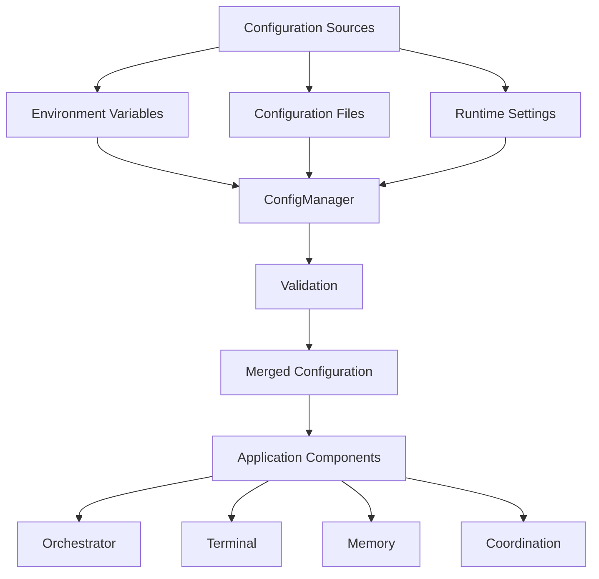
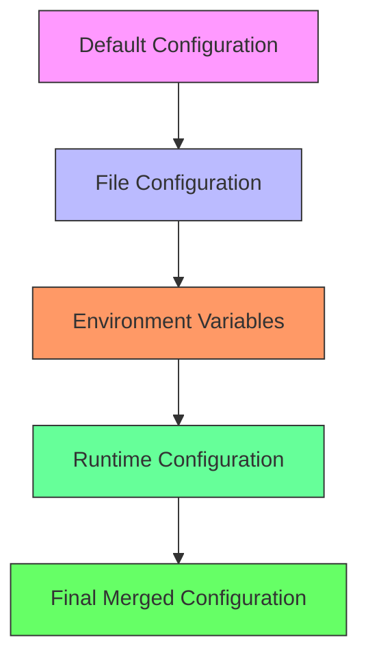
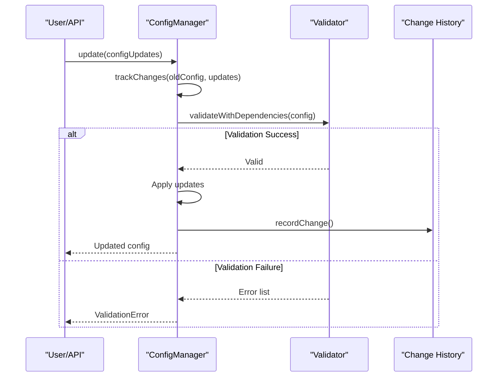
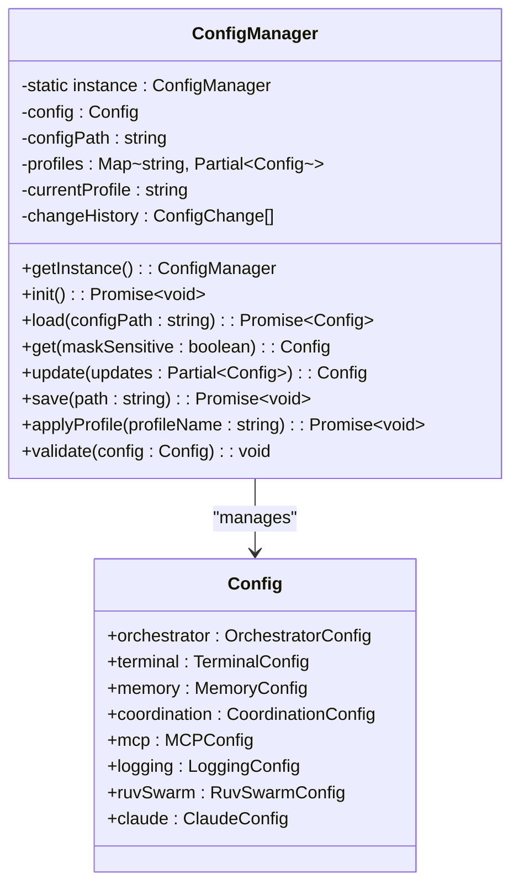
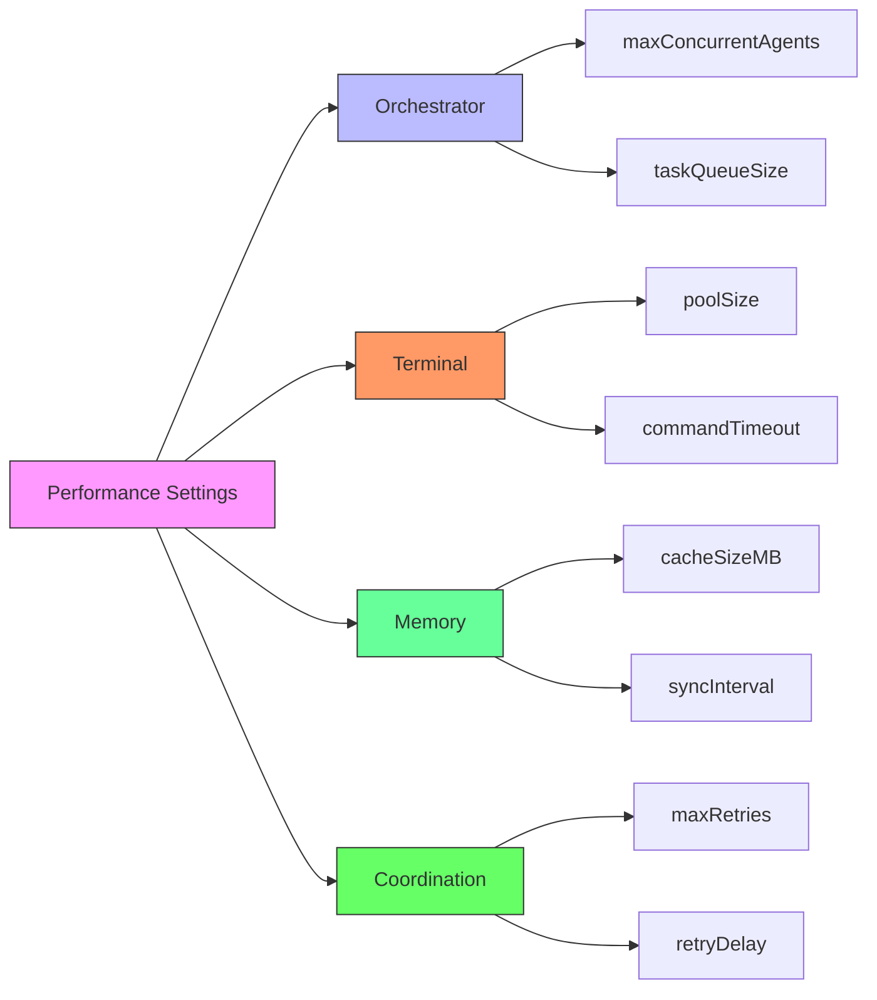
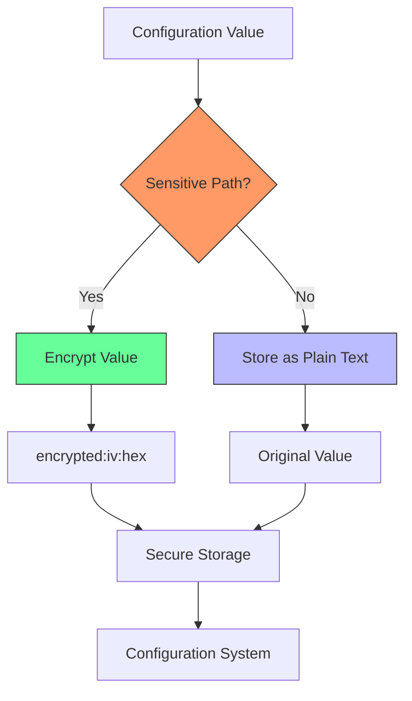
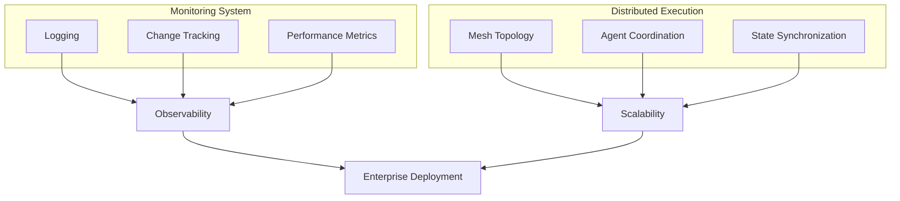

# Advanced Configuration

<cite>
**Referenced Files in This Document**   
- [config-manager.ts](file://src/config/config-manager.ts#L80-L138)
- [config.ts](file://src/core/config.ts#L195-L242)
- [batch-config-advanced.json](file://examples/batch-config-advanced.json)
- [batch-config-enterprise.json](file://examples/batch-config-enterprise.json)
</cite>

## Table of Contents
1. [Advanced Configuration Overview](#advanced-configuration-overview)
2. [Production Configuration Patterns](#production-configuration-patterns)
3. [Batch Configuration Advanced Example](#batch-configuration-advanced-example)
4. [Configuration Inheritance and Environment Overrides](#configuration-inheritance-and-environment-overrides)
5. [Dynamic Configuration Reloading](#dynamic-configuration-reloading)
6. [ConfigManager and Initialization System](#configmanager-and-initialization-system)
7. [Performance Optimization Settings](#performance-optimization-settings)
8. [Security Configuration](#security-configuration)
9. [Monitoring and Distributed Execution](#monitoring-and-distributed-execution)
10. [Common Configuration Issues and Best Practices](#common-configuration-issues-and-best-practices)

## Advanced Configuration Overview

The Advanced Configuration section explores complex configuration patterns for production and enterprise environments in the claude-flow system. This document provides a comprehensive analysis of sophisticated settings for performance optimization, security, monitoring, and distributed execution. The configuration system is built around the ConfigManager class, which handles configuration loading, validation, and management throughout the application lifecycle.

The configuration architecture supports multiple sources including JSON files, environment variables, and runtime modifications, with a hierarchical merging strategy that allows for environment-specific overrides. The system implements comprehensive validation rules to prevent misconfiguration and includes features for configuration inheritance, dynamic reloading, and secure storage of sensitive values.

**Section sources**
- [config-manager.ts](file://src/config/config-manager.ts#L80-L138)
- [config.ts](file://src/core/config.ts#L195-L242)

## Production Configuration Patterns

Production configurations in the claude-flow system are designed to optimize performance, ensure reliability, and maintain security in enterprise environments. The DEFAULT_CONFIG object in the configuration system defines sensible defaults for production use, with parameters carefully tuned for high-throughput scenarios.

Key production configuration patterns include:

- **Resource Management**: Configuring appropriate limits for concurrent agents, terminal pools, and memory usage to prevent resource exhaustion
- **Health Monitoring**: Setting appropriate intervals for health checks and timeouts to ensure system responsiveness
- **Fault Tolerance**: Configuring retry mechanisms, deadlock detection, and message timeouts for reliable operation
- **Security Hardening**: Enabling encryption, audit logging, and sensitive value masking by default

The production configuration also includes settings for the MCP (Multi-Agent Communication Protocol) with configurable transport methods (stdio, http, websocket) and TLS support for secure communications between components.



**Diagram sources**
- [config-manager.ts](file://src/config/config-manager.ts#L80-L138)
- [config.ts](file://src/core/config.ts#L195-L242)

**Section sources**
- [config-manager.ts](file://src/config/config-manager.ts#L80-L138)
- [config.ts](file://src/core/config.ts#L195-L242)

## Batch Configuration Advanced Example

The batch-config-advanced.json file provides an example of advanced batch configuration for initializing multiple projects with different templates and environments. This configuration demonstrates how to set up a complex development environment with various service types and technology stacks.

```json
{
  "baseOptions": {
    "sparc": true,
    "parallel": true,
    "maxConcurrency": 4,
    "force": true
  },
  "projectConfigs": {
    "user-api": {
      "template": "web-api",
      "environment": "dev",
      "customConfig": {
        "database": "postgresql",
        "auth": "jwt"
      }
    },
    "notification-service": {
      "template": "microservice",
      "environment": "dev",
      "customConfig": {
        "messageQueue": "rabbitmq",
        "cache": "redis"
      }
    },
    "admin-portal": {
      "template": "react-app",
      "environment": "dev",
      "customConfig": {
        "ui": "material-ui",
        "state": "redux"
      }
    },
    "cli-tools": {
      "template": "cli-tool",
      "environment": "dev",
      "customConfig": {
        "targets": ["node", "deno"]
      }
    },
    "payment-gateway": {
      "template": "microservice",
      "environment": "staging",
      "customConfig": {
        "security": "high",
        "compliance": "pci-dss"
      }
    }
  }
}
```

This configuration demonstrates several advanced patterns:

- **Base Options**: Global settings that apply to all projects, including SPARC mode, parallel execution, maximum concurrency, and force mode
- **Project-Specific Configuration**: Each project can have its own template, environment, and custom configuration parameters
- **Environment Segregation**: Different environments (dev, staging) can be configured with appropriate settings
- **Technology Stack Specification**: Specific technologies can be specified for databases, message queues, UI frameworks, etc.
- **Compliance Requirements**: Security and compliance requirements can be specified for sensitive components like payment gateways

The configuration enables the system to initialize multiple projects simultaneously with appropriate settings for each, optimizing development workflow efficiency.

**Section sources**
- [batch-config-advanced.json](file://examples/batch-config-advanced.json)

## Configuration Inheritance and Environment Overrides

The configuration system supports a sophisticated inheritance model that allows for environment-specific overrides and configuration reuse. The ConfigManager class implements a hierarchical merging strategy that combines configuration from multiple sources with appropriate precedence.

Configuration sources are processed in the following order (from lowest to highest precedence):
1. Default configuration (hardcoded defaults)
2. Configuration files
3. Environment variables
4. Runtime modifications

This hierarchy enables environment-specific overrides through environment variables, allowing different settings for development, staging, and production environments without modifying configuration files.



**Diagram sources**
- [config-manager.ts](file://src/config/config-manager.ts#L80-L138)

The system also supports named profiles that can be applied to switch between different configuration sets. Profiles are stored in the user's configuration directory and can be loaded, saved, and managed through the ConfigManager API.

Environment variables follow a naming convention (CLAUDE_FLOW_[SECTION]_[SETTING]) and are automatically loaded during configuration initialization. This allows for easy configuration of deployment environments without exposing sensitive values in configuration files.

The validation system ensures that inherited configurations maintain integrity by validating the final merged configuration against defined rules, preventing invalid combinations that might arise from the merging process.

**Section sources**
- [config-manager.ts](file://src/config/config-manager.ts#L80-L138)

## Dynamic Configuration Reloading

The ConfigManager supports dynamic configuration reloading, allowing settings to be updated at runtime without restarting the application. This feature is critical for production environments where configuration changes need to be applied without service interruption.

The system implements change tracking through a history mechanism that records all configuration modifications, including:
- Timestamp of each change
- Path of the modified configuration setting
- Previous and new values
- User or source of the change
- Reason for the change (optional)



**Diagram sources**
- [config-manager.ts](file://src/config/config-manager.ts#L80-L138)

The dynamic reloading process includes several safety mechanisms:
- **Validation**: All changes are validated against schema and dependency rules before being applied
- **Rollback**: The system maintains a history of changes, allowing for rollback to previous states
- **Atomic Updates**: Configuration updates are applied atomically to prevent partial updates
- **Event Notification**: Components can subscribe to configuration changes and react appropriately

The system also supports configuration watching, where components can register callbacks to be notified when specific configuration paths change, enabling reactive behavior to configuration updates.

**Section sources**
- [config-manager.ts](file://src/config/config-manager.ts#L80-L138)

## ConfigManager and Initialization System

The ConfigManager is the central component responsible for configuration management in the claude-flow system. Implemented as a singleton, it provides a unified interface for accessing and modifying configuration throughout the application.



**Diagram sources**
- [config-manager.ts](file://src/config/config-manager.ts#L80-L138)

The initialization process follows these steps:
1. **Singleton Creation**: The ConfigManager instance is created lazily when first accessed
2. **Async Initialization**: The init() method initializes encryption and other async components
3. **Configuration Loading**: Configuration is loaded from files, environment variables, and other sources
4. **Validation**: The loaded configuration is validated against schema and business rules
5. **Profile Application**: If specified, a named profile is applied to customize the configuration

The ConfigManager implements several advanced features:
- **Encryption**: Sensitive values are encrypted using AES-256-CBC with a randomly generated key
- **Validation Rules**: Comprehensive validation rules prevent invalid configurations
- **Change Tracking**: All configuration changes are recorded with metadata
- **Profile Management**: Named configuration profiles can be saved and loaded
- **Secure Value Handling**: Sensitive values can be masked when displayed

The system also includes a sophisticated validation framework with both schema-based validation and custom business rules that can check dependencies between configuration values.

**Section sources**
- [config-manager.ts](file://src/config/config-manager.ts#L80-L138)

## Performance Optimization Settings

The configuration system includes numerous settings for performance optimization in production environments. These settings are organized by component and can be tuned based on specific workload requirements.

### Orchestrator Settings
- **maxConcurrentAgents**: Controls the maximum number of agents that can run simultaneously (default: 10, max: 100)
- **taskQueueSize**: Size of the task queue that holds pending tasks (default: 100, max: 10,000)
- **healthCheckInterval**: Frequency of health checks for agents and resources (default: 30,000ms)
- **shutdownTimeout**: Maximum time to wait for graceful shutdown (default: 30,000ms)

### Terminal Settings
- **poolSize**: Number of terminal instances to maintain in the pool (default: 5, max: 50)
- **recycleAfter**: Number of uses before recycling a terminal instance (default: 10)
- **commandTimeout**: Maximum time to wait for command completion (default: 300,000ms)

### Memory Settings
- **cacheSizeMB**: Size of the in-memory cache (default: 100MB, can be increased to 10GB)
- **syncInterval**: Frequency of synchronization between memory backends (default: 5,000ms)
- **backend**: Storage backend (sqlite, markdown, or hybrid)

### Coordination Settings
- **maxRetries**: Maximum number of retry attempts for failed operations (default: 3)
- **retryDelay**: Delay between retry attempts (default: 1,000ms)
- **resourceTimeout**: Timeout for resource acquisition (default: 60,000ms)
- **messageTimeout**: Timeout for inter-agent messages (default: 30,000ms)

The system includes validation rules that prevent performance bottlenecks by ensuring appropriate ratios between related settings. For example, the task queue size should be at least 10 times the maximum concurrent agents to prevent queue exhaustion.



**Diagram sources**
- [config.ts](file://src/core/config.ts#L195-L242)

**Section sources**
- [config.ts](file://src/core/config.ts#L195-L242)

## Security Configuration

The security configuration in claude-flow provides comprehensive protection for sensitive data and system integrity. The security settings are designed to meet enterprise requirements for data protection and compliance.

Key security features include:

- **Encryption**: All sensitive configuration values are encrypted at rest using AES-256-CBC
- **Audit Logging**: All configuration changes are logged with user, timestamp, and reason
- **Value Masking**: Sensitive values are masked when displayed in logs or UI
- **Environment Overrides**: Secure configuration of environment-specific settings

The security configuration is defined in the config object with the following properties:

```typescript
security: {
  encryptionEnabled: true,
  auditLogging: true,
  maskSensitiveValues: true,
  allowEnvironmentOverrides: true,
}
```

The system implements several security best practices:
- **Key Management**: Encryption keys are generated randomly and stored securely
- **Input Validation**: All configuration inputs are validated to prevent injection attacks
- **Secure Defaults**: Security features are enabled by default
- **Least Privilege**: Configuration access is restricted based on user roles

The ConfigManager includes a sophisticated system for identifying sensitive paths and automatically encrypting values stored at those paths. This ensures that API keys, passwords, and other sensitive information are protected without requiring manual intervention.



**Diagram sources**
- [config-manager.ts](file://src/config/config-manager.ts#L80-L138)

**Section sources**
- [config-manager.ts](file://src/config/config-manager.ts#L80-L138)
- [config.ts](file://src/core/config.ts#L195-L242)

## Monitoring and Distributed Execution

The configuration system supports sophisticated monitoring and distributed execution patterns for enterprise environments. These features enable the system to scale across multiple nodes and provide comprehensive observability.

### Monitoring Configuration
The logging configuration allows for flexible monitoring setup:

```typescript
logging: {
  level: 'info',
  format: 'json',
  destination: 'console',
}
```

Additional monitoring features include:
- **Change History**: Track all configuration modifications
- **Validation Warnings**: Log warnings for suboptimal configurations
- **Performance Metrics**: Monitor system performance indicators

### Distributed Execution
The ruvSwarm configuration enables distributed execution with the following settings:

```typescript
ruvSwarm: {
  enabled: true,
  defaultTopology: 'mesh',
  maxAgents: 8,
  defaultStrategy: 'adaptive',
  autoInit: true,
  enableHooks: true,
  enablePersistence: true,
  enableNeuralTraining: true,
  configPath: '.claude/ruv-swarm-config.json',
}
```

These settings configure:
- **Topology**: Mesh network for peer-to-peer communication
- **Agent Management**: Maximum number of agents and adaptive strategy
- **Persistence**: State persistence across sessions
- **Neural Training**: Enable machine learning-based optimization
- **Auto-initialization**: Automatic swarm setup

The system also supports distributed memory management through the hybrid memory backend, which synchronizes state between SQLite and markdown storage, ensuring consistency across distributed nodes.



**Diagram sources**
- [config-manager.ts](file://src/config/config-manager.ts#L80-L138)

**Section sources**
- [config-manager.ts](file://src/config/config-manager.ts#L80-L138)

## Common Configuration Issues and Best Practices

This section addresses common issues encountered with complex configurations and provides best practices for managing configurations in team environments.

### Common Issues

**Configuration Conflicts**
- **Symptom**: Settings from different sources conflict, causing validation errors
- **Solution**: Understand the precedence order (defaults < files < environment < runtime) and plan accordingly

**Performance Bottlenecks**
- **Symptom**: System slowdowns due to inappropriate configuration values
- **Solution**: Follow validation rules and recommended ratios (e.g., task queue size should be 10x max concurrent agents)

**Security Vulnerabilities**
- **Symptom**: Exposure of sensitive information through improper configuration
- **Solution**: Enable encryption, audit logging, and value masking; avoid storing secrets in configuration files

### Best Practices

**Team Configuration Management**
- Use version control for configuration files
- Document configuration changes and their rationale
- Implement code reviews for configuration changes
- Use configuration profiles for different environments

**Production Configuration**
- Enable all security features by default
- Set appropriate resource limits based on infrastructure
- Configure comprehensive logging and monitoring
- Test configuration changes in staging before production

**Configuration Validation**
- Leverage the built-in validation system
- Create custom validation rules for business-specific requirements
- Test edge cases and failure scenarios
- Monitor for validation warnings that indicate suboptimal configurations

**Dynamic Configuration**
- Use configuration watching for reactive components
- Implement graceful degradation when configuration changes
- Test rollback procedures regularly
- Document the impact of each configurable parameter

The ConfigManager's change history feature is particularly valuable in team environments, as it provides an audit trail of all configuration modifications, helping to diagnose issues and maintain accountability.

**Section sources**
- [config-manager.ts](file://src/config/config-manager.ts#L80-L138)
- [config.ts](file://src/core/config.ts#L195-L242)