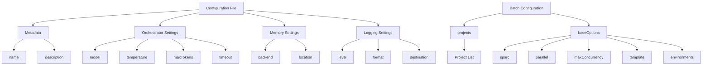
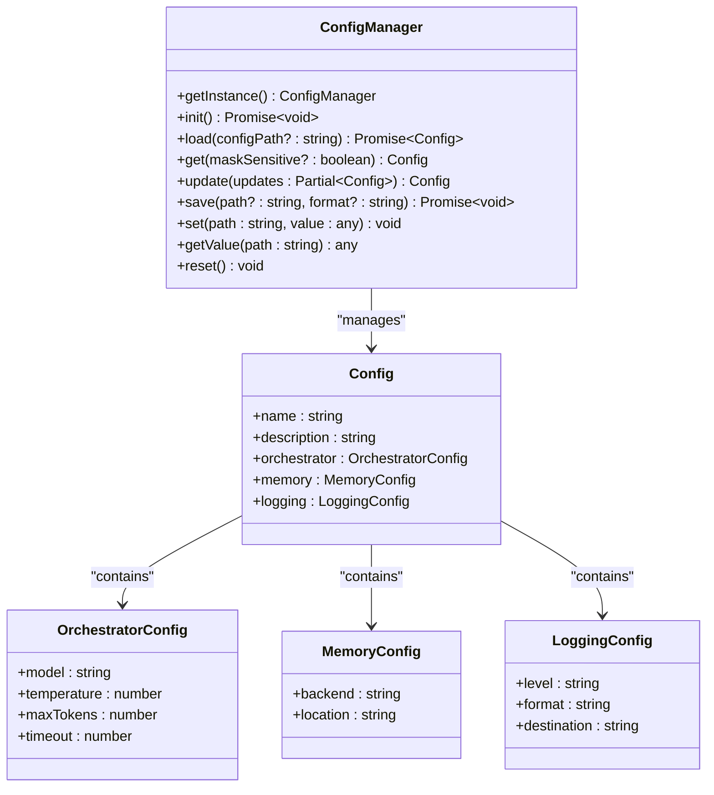
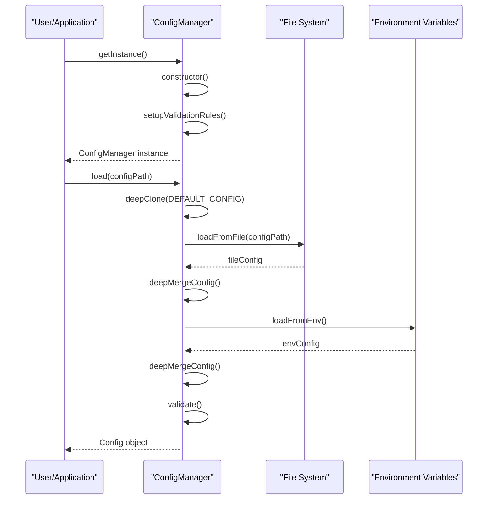
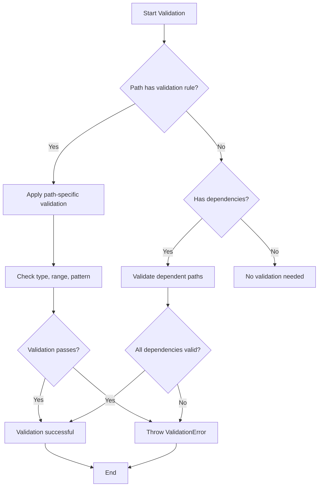
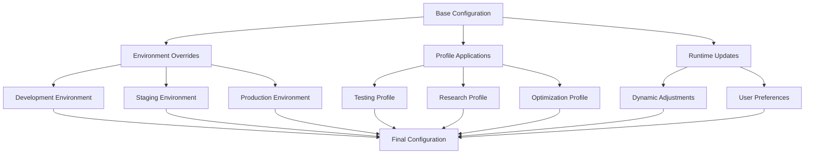

# Basic Configuration

<cite>
**Referenced Files in This Document**   
- [simple-config.json](file://examples/01-configurations/basic/simple-config.json)
- [batch-config-simple.json](file://examples/batch-config-simple.json)
- [config.ts](file://src/core/config.ts)
- [README.md](file://examples/01-configurations/README.md)
</cite>

## Table of Contents
1. [Introduction](#introduction)
2. [Configuration File Structure](#configuration-file-structure)
3. [Core Configuration Options](#core-configuration-options)
4. [ConfigManager Class and Configuration Lifecycle](#configmanager-class-and-configuration-lifecycle)
5. [Common Configuration Issues and Troubleshooting](#common-configuration-issues-and-troubleshooting)
6. [Best Practices for Configuration Management](#best-practices-for-configuration-management)
7. [Extending Basic Configurations](#extending-basic-configurations)

## Introduction

The Basic Configuration section provides a comprehensive guide to understanding and implementing configuration files for the Claude-Flow system. Configuration files are essential for defining system behavior, agent initialization parameters, workflow execution settings, and resource allocation strategies. This document thoroughly examines the `simple-config.json` and `batch-config-simple.json` examples, explaining each configuration option, its data type, default value, and impact on system behavior. The analysis also covers the relationship between configuration files and the core ConfigManager class, detailing how settings are loaded, validated, and applied throughout the system.

**Section sources**
- [simple-config.json](file://examples/01-configurations/basic/simple-config.json)
- [batch-config-simple.json](file://examples/batch-config-simple.json)
- [README.md](file://examples/01-configurations/README.md)

## Configuration File Structure

Claude-Flow configuration files follow a hierarchical JSON structure that organizes settings into logical sections. The configuration system supports multiple formats including JSON, YAML, and TOML, with JSON being the most commonly used format for examples and documentation.

The primary configuration file `simple-config.json` demonstrates the fundamental structure:

```json
{
  "name": "Simple Claude Flow Configuration",
  "description": "Basic configuration for getting started with Claude Flow",
  "orchestrator": {
    "model": "claude-3-sonnet-20240229",
    "temperature": 0.7,
    "maxTokens": 4096,
    "timeout": 30000
  },
  "memory": {
    "backend": "json",
    "location": "./memory/simple-flow.json"
  },
  "logging": {
    "level": "info",
    "format": "pretty",
    "destination": "console"
  }
}
```

This structure consists of top-level sections that group related configuration options:
- **Metadata**: Name and description fields that provide human-readable information about the configuration
- **Orchestrator**: Settings that control the AI model behavior and execution parameters
- **Memory**: Configuration for the memory storage system, including backend type and location
- **Logging**: Options for controlling log output, format, and destination

The batch configuration file `batch-config-simple.json` demonstrates a different structure optimized for batch operations:

```json
{
  "projects": ["api-service", "web-frontend", "admin-dashboard"],
  "baseOptions": {
    "sparc": true,
    "parallel": true,
    "maxConcurrency": 3,
    "template": "web-api",
    "environments": ["dev", "staging"]
  }
}
```

This batch configuration uses a project-based approach with shared base options, enabling consistent configuration across multiple projects while allowing for individual project customization.



**Diagram sources**
- [simple-config.json](file://examples/01-configurations/basic/simple-config.json)
- [batch-config-simple.json](file://examples/batch-config-simple.json)

**Section sources**
- [simple-config.json](file://examples/01-configurations/basic/simple-config.json)
- [batch-config-simple.json](file://examples/batch-config-simple.json)

## Core Configuration Options

### Orchestrator Configuration

The orchestrator section controls the behavior of the AI model and task execution parameters:

**model**: Specifies the Claude model to use for processing. The default value is "claude-3-sonnet-20240229". This string parameter determines the AI model's capabilities, context window size, and performance characteristics.

**temperature**: Controls the creativity level of the AI model, with values ranging from 0.0 (deterministic) to 1.0 (highly creative). The default value is 0.7, which provides a balance between creativity and consistency. Higher values increase randomness in responses, while lower values produce more predictable outputs.

**maxTokens**: Sets the maximum response length in tokens. The default value is 4096, which represents the maximum number of tokens the model can generate in a single response. This integer parameter helps prevent excessively long outputs and manage computational resources.

**timeout**: Defines the operation timeout in milliseconds. The default value is 30000 (30 seconds), which specifies how long the system will wait for a response before terminating the operation. This prevents indefinite waiting when processing complex tasks.

### Memory Configuration

The memory section configures the system's memory storage and retrieval mechanisms:

**backend**: Specifies the storage type for memory data. The default value is "json", but other options include "sqlite" and "redis". This string parameter determines the persistence mechanism and performance characteristics of the memory system.

**location**: Defines the file path or connection string for the memory storage. The default value is "./memory/simple-flow.json", which specifies where memory data will be stored on disk. This string parameter must be a valid path or connection string depending on the selected backend.

### Logging Configuration

The logging section controls diagnostic output and monitoring:

**level**: Sets the detail level for log messages. The default value is "info", with available options including "debug", "warn", and "error". This string parameter determines which messages are output based on their severity level.

**format**: Specifies the output format for log messages. The default value is "pretty", with alternatives including "json" and "text". This string parameter affects how log data is structured and presented.

**destination**: Determines where log output is directed. The default value is "console", with options for "file" or "both". This string parameter controls whether logs are displayed in the terminal, written to disk, or both.



**Diagram sources**
- [config.ts](file://src/core/config.ts)
- [simple-config.json](file://examples/01-configurations/basic/simple-config.json)

**Section sources**
- [simple-config.json](file://examples/01-configurations/basic/simple-config.json)
- [config.ts](file://src/core/config.ts)

## ConfigManager Class and Configuration Lifecycle

The ConfigManager class serves as the central component for handling configuration operations in the Claude-Flow system. Implemented as a singleton, it ensures consistent configuration access across the application.

### Initialization and Loading

The configuration lifecycle begins with the ConfigManager initialization:



**Diagram sources**
- [config.ts](file://src/core/config.ts)

The loading process follows a specific priority order:
1. Start with default configuration values
2. Load configuration from the specified file (if provided)
3. Apply environment variable overrides
4. Validate the final merged configuration

This hierarchical approach allows for flexible configuration management, where specific settings can override more general defaults.

### Configuration Validation

The ConfigManager implements comprehensive validation to ensure configuration integrity:



**Diagram sources**
- [config.ts](file://src/core/config.ts)

Validation rules are defined for critical configuration paths, ensuring that values meet specific criteria:
- Type checking (string, number, boolean)
- Range validation (minimum and maximum values)
- Pattern matching (regular expressions)
- Value enumeration (allowed values)
- Cross-field dependencies and custom validation logic

For example, the orchestrator's `maxConcurrentAgents` is validated to ensure it doesn't exceed twice the terminal pool size, preventing resource exhaustion.

### Configuration Operations

The ConfigManager provides several methods for runtime configuration management:

**get()**: Retrieves the current configuration, with an option to mask sensitive values for security purposes.

**set()**: Updates a specific configuration value by path, with change tracking and validation. This method supports dot notation for nested properties (e.g., "orchestrator.model").

**update()**: Applies multiple configuration changes simultaneously, useful for applying profile changes or batch updates.

**save()**: Persists the current configuration to a file, with support for multiple formats (JSON, YAML, TOML).

**applyProfile()**: Loads and applies a named configuration profile, enabling quick switching between different configuration sets.

The ConfigManager also implements change tracking, recording configuration modifications with timestamps, previous values, new values, user information, and modification reasons. This audit trail is valuable for debugging and maintaining configuration history.

**Section sources**
- [config.ts](file://src/core/config.ts)

## Common Configuration Issues and Troubleshooting

### Missing Required Fields

One of the most common configuration issues is missing required fields. The ConfigManager validates configuration files against defined rules, and missing required fields will trigger validation errors. For example, the orchestrator section requires the `model` field, and omitting it will result in a validation error.

To troubleshoot missing fields:
1. Check the configuration schema in the ConfigManager's getSchema() method
2. Verify that all required fields are present in your configuration file
3. Refer to the default configuration for examples of required fields

### Incorrect Data Types

Another frequent issue is using incorrect data types for configuration values. The validation system enforces strict type checking:
- String values must be enclosed in quotes
- Numeric values must not be quoted
- Boolean values must be true/false (not "true"/"false")

For example, setting `"timeout": "30000"` (string) instead of `"timeout": 30000` (number) will fail validation.

### Configuration Loading Failures

Configuration loading can fail for several reasons:
- Invalid JSON syntax
- File not found at the specified path
- Insufficient file permissions
- Circular dependency in configuration merging

When a loading failure occurs, the ConfigManager provides detailed error messages indicating the specific issue. To resolve loading failures:
1. Validate JSON syntax using a JSON validator
2. Verify the file path is correct and accessible
3. Check file permissions
4. Ensure the configuration file doesn't reference itself

### Environment Variable Conflicts

Environment variables can override configuration file settings, which may lead to unexpected behavior. The ConfigManager loads environment variables after the configuration file, so they take precedence. To troubleshoot environment variable conflicts:
1. Check for environment variables that match configuration paths (e.g., ORCHESTRATOR_MODEL)
2. Use the getSecure() method to see the final merged configuration
3. Temporarily unset suspected environment variables to isolate the issue

```mermaid
flowchart TD
A[Configuration Issue] --> B{Error Type?}
B --> |Validation Error| C[Check required fields and data types]
B --> |Loading Error| D[Verify file path and syntax]
B --> |Runtime Error| E[Check environment variable conflicts]
B --> |Unexpected Behavior| F[Review configuration merging order]
C --> G[Consult default configuration]
D --> H[Validate JSON syntax]
E --> I[Use getSecure() to inspect final config]
F --> J[Understand merge priority: defaults → file → environment]
G --> K[Test configuration]
H --> K
I --> K
J --> K
K --> L[Issue Resolved]
```

**Diagram sources**
- [config.ts](file://src/core/config.ts)

**Section sources**
- [config.ts](file://src/core/config.ts)

## Best Practices for Configuration Management

### Organizing Configuration Files

Effective configuration management requires a well-organized approach:

1. **Use descriptive names**: Name configuration files based on their purpose (e.g., development-config.json, production-config.json)
2. **Implement a directory structure**: Organize configurations by complexity and use case, as demonstrated in the examples/01-configurations directory
3. **Maintain version control**: Keep configuration files in version control to track changes and enable collaboration
4. **Document configuration options**: Include comments or external documentation explaining non-obvious settings

### Configuration Hierarchy

Implement a hierarchical configuration strategy:
- **Default configuration**: Built-in defaults for all settings
- **Base configuration**: Project-specific defaults in a base file
- **Environment-specific configuration**: Overrides for different environments (development, staging, production)
- **Local overrides**: Developer-specific settings in local files

This hierarchy allows for consistent configuration across environments while enabling necessary variations.

### Security Considerations

Protect sensitive configuration data:
- Never store credentials in configuration files
- Use environment variables for sensitive data
- Implement encryption for sensitive values when necessary
- Use the ConfigManager's masking features when displaying configurations

### Testing Configurations

Always test configuration changes:
1. Validate syntax before deployment
2. Test in a development environment before production
3. Use the ConfigManager's validation methods to catch issues early
4. Monitor system behavior after configuration changes

**Section sources**
- [README.md](file://examples/01-configurations/README.md)
- [config.ts](file://src/core/config.ts)

## Extending Basic Configurations

Basic configurations can be extended for more complex use cases through several mechanisms:

### Configuration Profiles

The ConfigManager supports named profiles that can be applied to modify the current configuration:

```typescript
// Create and apply a development profile
await configManager.saveProfile('development', {
  orchestrator: {
    model: 'claude-3-opus-20240229',
    temperature: 0.8
  },
  logging: {
    level: 'debug'
  }
});

await configManager.applyProfile('development');
```

Profiles enable quick switching between different configuration sets for various scenarios.

### Environment-Based Configuration

Leverage environment variables to customize behavior without modifying configuration files:

```
ORCHESTRATOR_MODEL=claude-3-haiku-20240307
ORCHESTRATOR_TEMPERATURE=0.5
MEMORY_BACKEND=sqlite
```

Environment variables provide a flexible way to override settings in different deployment environments.

### Dynamic Configuration Updates

Use the ConfigManager's runtime methods to modify configuration during execution:

```typescript
// Update configuration based on runtime conditions
if (process.env.NODE_ENV === 'production') {
  configManager.set('logging.level', 'error');
  configManager.set('orchestrator.timeout', 60000);
}
```

Dynamic updates allow the system to adapt to changing conditions or user preferences.

### Batch Configuration Patterns

For managing multiple projects, extend the batch configuration pattern:

```json
{
  "projects": ["service-a", "service-b", "service-c"],
  "baseOptions": {
    "sparc": true,
    "template": "microservice"
  },
  "projectOverrides": {
    "service-a": {
      "environments": ["dev", "staging", "production"],
      "maxConcurrency": 5
    },
    "service-b": {
      "environments": ["dev", "staging"],
      "maxConcurrency": 3
    }
  }
}
```

This pattern combines shared base options with project-specific overrides, enabling consistent configuration across multiple projects while allowing necessary variations.



**Diagram sources**
- [config.ts](file://src/core/config.ts)
- [batch-config-simple.json](file://examples/batch-config-simple.json)

**Section sources**
- [config.ts](file://src/core/config.ts)
- [batch-config-simple.json](file://examples/batch-config-simple.json)