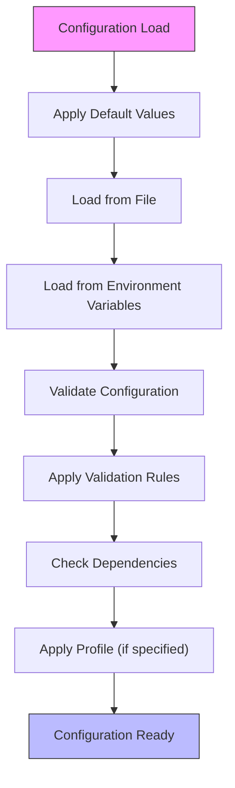
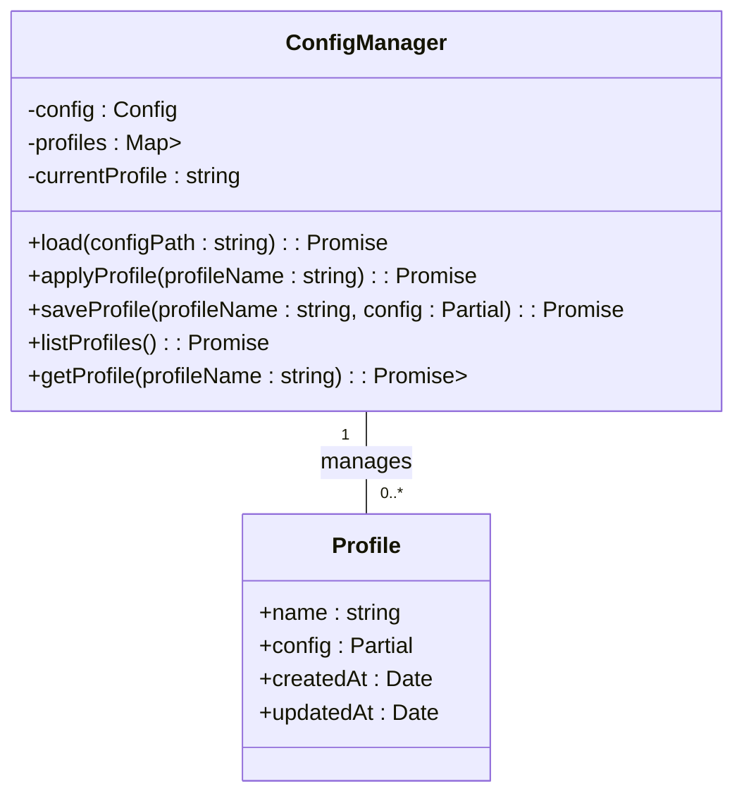
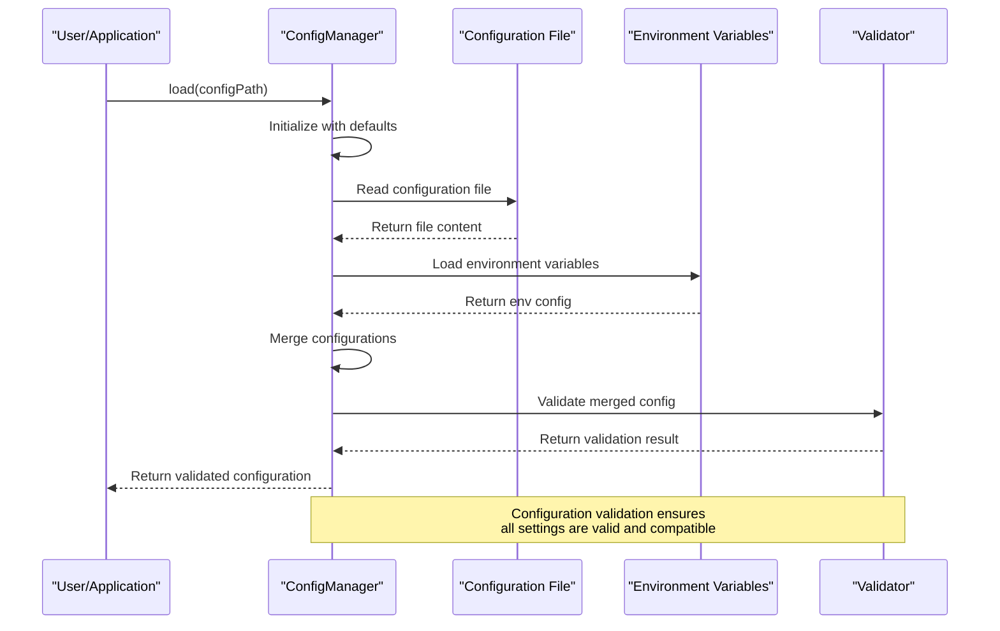

# Configuration Examples

<cite>
**Referenced Files in This Document**   
- [development-config.json](file://examples/01-configurations/development-config.json)
- [config.ts](file://src/core/config.ts)
</cite>

## Table of Contents
1. [Basic Configuration](#basic-configuration)
2. [Advanced Configuration](#advanced-configuration)
3. [Minimal Configuration](#minimal-configuration)
4. [Specialized Configuration](#specialized-configuration)
5. [Configuration Manager Implementation](#configuration-manager-implementation)
6. [Common Configuration Issues](#common-configuration-issues)
7. [Best Practices](#best-practices)

## Basic Configuration

Basic configurations in Claude-Flow provide a straightforward setup for standard use cases. The development configuration example demonstrates a comprehensive yet accessible configuration structure that balances performance, reliability, and debugging capabilities.

The basic configuration follows a hierarchical structure with top-level sections for orchestrator, terminal, memory, coordination, MCP (Multi-Process Communication), and logging components. Each section contains parameters that control specific aspects of the system's behavior.

```json
{
  "orchestrator": {
    "maxConcurrentAgents": 5,
    "taskQueueSize": 50,
    "healthCheckInterval": 10000,
    "shutdownTimeout": 15000
  },
  "terminal": {
    "type": "auto",
    "poolSize": 3,
    "recycleAfter": 5,
    "healthCheckInterval": 30000,
    "commandTimeout": 180000
  },
  "memory": {
    "backend": "hybrid",
    "cacheSizeMB": 50,
    "syncInterval": 5000,
    "conflictResolution": "crdt",
    "retentionDays": 7
  },
  "coordination": {
    "maxRetries": 2,
    "retryDelay": 1000,
    "deadlockDetection": true,
    "resourceTimeout": 30000,
    "messageTimeout": 15000
  },
  "mcp": {
    "transport": "stdio",
    "port": 3000,
    "tlsEnabled": false
  },
  "logging": {
    "level": "debug",
    "format": "text",
    "destination": "console"
  }
}
```

**Key Parameters:**
- **orchestrator.maxConcurrentAgents**: Controls the maximum number of agents that can run simultaneously
- **terminal.type**: Determines the terminal type with "auto" enabling automatic detection
- **memory.backend**: Specifies the memory storage backend with "hybrid" combining multiple storage methods
- **logging.level**: Sets the verbosity of logging output with "debug" providing maximum detail

This configuration is suitable for development environments where debugging and monitoring are prioritized over performance optimization. The debug logging level provides detailed insights into system operations, while the hybrid memory backend offers flexibility in data storage.

**Section sources**
- [development-config.json](file://examples/01-configurations/development-config.json)

## Advanced Configuration

Advanced configurations in Claude-Flow enable sophisticated system behaviors through complex parameter relationships and validation rules. The ConfigManager implementation reveals an extensive validation system that ensures configuration integrity and prevents incompatible settings.

The advanced configuration system supports dependency validation, where certain parameters are validated against the values of other parameters. For example, the validation rules ensure that `maxConcurrentAgents` does not exceed twice the `terminal.poolSize`, preventing resource contention issues.



**Advanced Features:**
- **Validation Rules**: Comprehensive validation system with type checking, range validation, and custom validators
- **Dependency Checking**: Cross-parameter validation to ensure compatible settings
- **Profile Management**: Support for configuration profiles that can be applied dynamically
- **Change Tracking**: History of configuration changes with timestamps and sources
- **Encryption**: Sensitive values can be encrypted when stored

The configuration manager implements a sophisticated validation system that checks not only individual parameter validity but also relationships between parameters. For instance, when `memory.cacheSizeMB` exceeds 1000 with a SQLite backend, a warning is generated about potential performance impacts.

**Section sources**
- [config.ts](file://src/core/config.ts#L247-L1256)

## Minimal Configuration

Minimal configurations contain only essential parameters required for system operation. While the repository doesn't include explicit minimal configuration examples, the ConfigManager implementation reveals the required fields through its validation rules.

Based on the validation rules in the ConfigManager class, the minimal configuration must include:

```json
{
  "orchestrator": {
    "maxConcurrentAgents": 1,
    "taskQueueSize": 1
  },
  "terminal": {
    "type": "auto",
    "poolSize": 1
  },
  "memory": {
    "backend": "sqlite"
  },
  "coordination": {
    "maxRetries": 0
  },
  "mcp": {
    "transport": "stdio"
  },
  "logging": {
    "level": "info"
  }
}
```

The minimal configuration focuses on the required fields identified in the validation rules:
- **orchestrator.maxConcurrentAgents**: Required, minimum value 1
- **orchestrator.taskQueueSize**: Required, minimum value 1
- **terminal.type**: Required, must be one of "auto", "vscode", or "native"
- **terminal.poolSize**: Required, minimum value 1
- **memory.backend**: Required, must be one of "sqlite", "markdown", or "hybrid"
- **coordination.maxRetries**: Required, minimum value 0
- **mcp.transport**: Required, must be one of "stdio", "http", or "websocket"
- **logging.level**: Required, must be one of "debug", "info", "warn", or "error"

This minimal configuration provides the bare essentials for the system to function, making it suitable for constrained environments or initial testing.

**Section sources**
- [config.ts](file://src/core/config.ts#L247-L1256)

## Specialized Configuration

Specialized configurations in Claude-Flow are designed for specific use cases and environments. The system supports configuration profiles that allow different settings to be applied based on the operational context.

The ConfigManager implementation includes profile management capabilities that enable specialized configurations for different scenarios:



**Specialized Configuration Types:**
- **Development Profile**: High verbosity logging, relaxed security settings, and comprehensive debugging
- **Production Profile**: Optimized performance settings, secure communication, and minimal logging
- **Testing Profile**: Isolated environments, mock services, and enhanced monitoring
- **Performance Profile**: Resource optimization, aggressive caching, and reduced overhead

The system allows profiles to be stored in the user configuration directory (`~/.claude-flow/profiles/`) as JSON files. Profiles can be applied programmatically or through command-line interface options, enabling seamless switching between different operational modes.

Specialized configurations often include environment-specific overrides that take precedence over default settings. For example, a production profile might enforce TLS encryption for MCP communication and limit the maximum number of concurrent agents to conserve resources.

**Diagram sources**
- [config.ts](file://src/core/config.ts#L247-L1256)

**Section sources**
- [config.ts](file://src/core/config.ts#L247-L1256)

## Configuration Manager Implementation

The ConfigManager class serves as the central component for configuration management in Claude-Flow, handling loading, validation, and propagation of settings throughout the system.



The ConfigManager implementation follows a singleton pattern, ensuring that all components access the same configuration instance. Key features include:

**Core Methods:**
- **load()**: Loads configuration from files and environment variables
- **get()**: Retrieves configuration values with optional security masking
- **set()**: Updates configuration values with change tracking
- **validate()**: Validates configuration against defined rules
- **applyProfile()**: Applies named configuration profiles

**Configuration Loading Process:**
1. Start with default configuration values
2. Load configuration from specified file (if provided)
3. Override with environment variables
4. Apply validation rules and dependency checks
5. Return validated configuration

The configuration manager supports multiple file formats (JSON, YAML, TOML) with automatic format detection based on file extension or content analysis. This flexibility allows users to choose the format that best suits their needs and preferences.

Configuration values can be accessed using dot notation paths (e.g., "orchestrator.maxConcurrentAgents"), enabling granular control over specific settings. The system also supports change tracking, recording modifications with timestamps, previous values, and sources.

**Diagram sources**
- [config.ts](file://src/core/config.ts#L247-L1256)

**Section sources**
- [config.ts](file://src/core/config.ts#L247-L1256)

## Common Configuration Issues

Several common issues can arise when working with Claude-Flow configurations. Understanding these issues and their solutions is crucial for maintaining system stability and performance.

**Configuration Validation Errors:**
- **Missing Required Fields**: Ensure all required parameters are present in the configuration
- **Invalid Value Types**: Verify that values match the expected type (number, string, boolean)
- **Out-of-Range Values**: Check that numeric values fall within acceptable ranges
- **Invalid Enumerations**: Confirm that string values are from the allowed set

**Missing Required Fields:**
When required fields are missing, the validation system will throw a ValidationError. To resolve this issue:
1. Consult the validation rules in the ConfigManager class
2. Ensure all required parameters are present
3. Provide values that meet the type and range requirements

```javascript
// Example of handling missing required fields
try {
  await configManager.load('config.json');
} catch (error) {
  if (error instanceof ValidationError) {
    console.error('Configuration validation failed:', error.message);
    // Provide guidance on required fields
  }
}
```

**Environment-Specific Overrides:**
Environment variables take precedence over file-based configurations, allowing for environment-specific settings without modifying configuration files. Key environment variables include:
- **CLAUDE_FLOW_MAX_AGENTS**: Overrides orchestrator.maxConcurrentAgents
- **CLAUDE_FLOW_TERMINAL_TYPE**: Overrides terminal.type
- **CLAUDE_FLOW_MEMORY_BACKEND**: Overrides memory.backend
- **CLAUDE_FLOW_MCP_TRANSPORT**: Overrides mcp.transport
- **CLAUDE_FLOW_LOG_LEVEL**: Overrides logging.level

This override mechanism enables seamless deployment across different environments (development, staging, production) without requiring configuration file modifications.

**Section sources**
- [config.ts](file://src/core/config.ts#L247-L1256)

## Best Practices

Adhering to best practices ensures reliable and maintainable configuration management in Claude-Flow deployments.

**Organizing Configuration Files:**
- Store configuration files in version control (excluding sensitive information)
- Use descriptive filenames that indicate the environment or purpose
- Organize configurations by environment (development, production, testing)
- Use comments to explain non-obvious settings

**Managing Secrets:**
- Never store API keys or credentials in configuration files
- Use environment variables for sensitive information
- Enable encryption for sensitive configuration values
- Regularly rotate credentials and update configurations

**Versioning Configurations:**
- Maintain version history of configuration changes
- Use configuration profiles to manage different versions
- Document changes and their rationale
- Implement backup and restore procedures

**Configuration Validation:**
- Always validate configurations before deployment
- Use the built-in validation system to catch errors early
- Test configurations in isolated environments before production use
- Monitor for validation warnings that may indicate suboptimal settings

**Performance Considerations:**
- Avoid excessively large cache sizes that may impact system performance
- Balance agent concurrency with available terminal resources
- Use appropriate logging levels for the environment (debug for development, info/error for production)
- Monitor resource usage and adjust configuration accordingly

Following these best practices ensures that Claude-Flow configurations are secure, maintainable, and optimized for their intended environments.

**Section sources**
- [config.ts](file://src/core/config.ts#L247-L1256)