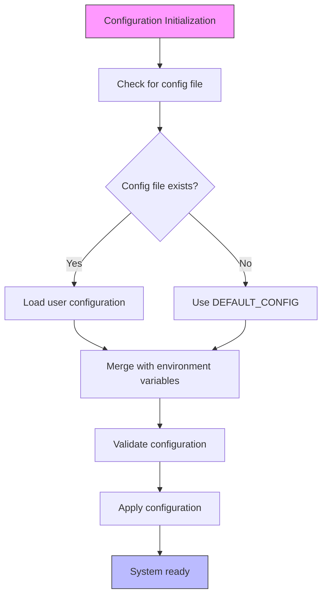
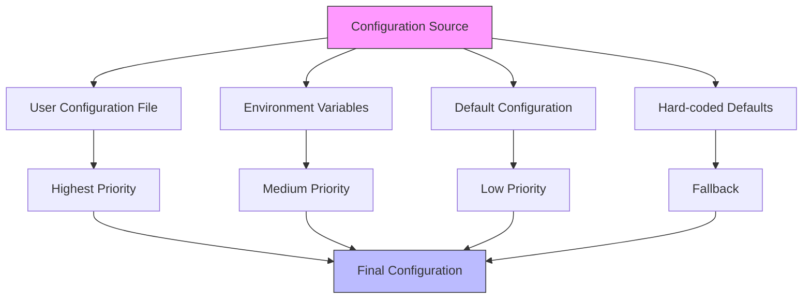
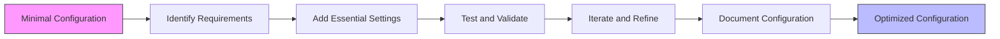

# Minimal Configuration

<cite>
**Referenced Files in This Document**   
- [config.ts](file://src/core/config.ts#L195-L242)
- [config-manager.ts](file://src/config/config-manager.ts#L80-L138)
- [non_interactive_defaults.yaml](file://benchmark/config/non_interactive_defaults.yaml#L1-L46)
</cite>

## Table of Contents
1. [Minimal Configuration Requirements](#minimal-configuration-requirements)
2. [Default Configuration Values](#default-configuration-values)
3. [Configuration Fallback Mechanisms](#configuration-fallback-mechanisms)
4. [Common Configuration Issues](#common-configuration-issues)
5. [Progressive Configuration Enhancement](#progressive-configuration-enhancement)

## Minimal Configuration Requirements

The Claude-Flow system is designed to operate with minimal configuration requirements, leveraging a comprehensive default configuration system to ensure functionality even when no explicit configuration is provided. The system can run with an empty configuration file or even without a configuration file entirely, as the ConfigManager automatically applies default values for all essential parameters.

The core principle behind the minimal configuration approach is that Claude-Flow provides sensible defaults for all critical system parameters, allowing users to get started immediately without needing to understand the full complexity of the configuration system. When no configuration file is present, the system initializes with the DEFAULT_CONFIG object, which contains carefully selected values optimized for typical use cases.

The configuration system follows a hierarchical fallback mechanism:
1. User-provided configuration values
2. Environment variables
3. Default configuration values
4. Hard-coded system defaults

This layered approach ensures that the system remains functional even in the most basic setup while providing extensive customization options for advanced users.

**Section sources**
- [config.ts](file://src/core/config.ts#L195-L242)
- [config-manager.ts](file://src/config/config-manager.ts#L80-L138)

## Default Configuration Values

The DEFAULT_CONFIG object defines the complete set of default values that are applied when no user configuration is provided. These defaults are designed to balance performance, reliability, and resource usage for typical deployment scenarios.

### Core System Parameters

The default configuration includes the following essential parameters:

**Orchestrator Settings**
- `maxConcurrentAgents`: 10 (maximum number of agents that can run simultaneously)
- `taskQueueSize`: 100 (maximum number of tasks that can be queued)
- `healthCheckInterval`: 30000 (30 seconds between health checks)
- `shutdownTimeout`: 30000 (30 seconds to gracefully shutdown)

**Terminal Settings**
- `type`: 'auto' (automatically detect the best terminal type)
- `poolSize`: 5 (number of terminal instances to maintain)
- `recycleAfter`: 10 (recycle terminal instances after 10 uses)
- `healthCheckInterval`: 60000 (1 minute between terminal health checks)
- `commandTimeout`: 300000 (5 minutes maximum for command execution)

**Memory Settings**
- `backend`: 'hybrid' (use both SQLite and Markdown for memory storage)
- `cacheSizeMB`: 100 (memory cache size in megabytes)
- `syncInterval`: 5000 (5 seconds between memory synchronization)
- `conflictResolution`: 'crdt' (Conflict-free Replicated Data Type for conflict resolution)
- `retentionDays`: 30 (number of days to retain memory entries)

**Coordination Settings**
- `maxRetries`: 3 (maximum number of retry attempts for failed operations)
- `retryDelay`: 1000 (1 second delay between retry attempts)
- `deadlockDetection`: true (enable deadlock detection and resolution)
- `resourceTimeout`: 60000 (1 minute timeout for resource acquisition)
- `messageTimeout`: 30000 (30 seconds timeout for message delivery)

**MCP (Message Control Protocol) Settings**
- `transport`: 'stdio' (use standard input/output for communication)
- `port`: 3000 (network port for MCP communication)
- `tlsEnabled`: false (TLS encryption disabled by default)

**Logging Settings**
- `level`: 'info' (log level: debug, info, warn, error)
- `format`: 'json' (log output format)
- `destination`: 'console' (log output destination)

**ruvSwarm Settings**
- `enabled`: true (ruvSwarm functionality enabled by default)
- `defaultTopology`: 'mesh' (default network topology)
- `maxAgents`: 8 (maximum number of agents in the swarm)
- `defaultStrategy`: 'adaptive' (adaptive coordination strategy)
- `autoInit`: true (automatically initialize swarm on startup)
- `enableHooks`: true (enable lifecycle hooks)
- `enablePersistence`: true (enable state persistence)
- `enableNeuralTraining`: true (enable neural network training)
- `configPath`: '.claude/ruv-swarm-config.json' (path to swarm configuration)

**Claude API Settings**
- `model`: 'claude-3-sonnet-20240229' (default AI model)
- `temperature`: 0.7 (creativity level of AI responses)
- `maxTokens`: 4096 (maximum response length)
- `topP`: 1 (diversity of AI responses)
- `timeout`: 60000 (1 minute timeout for API calls)
- `retryAttempts`: 3 (number of retry attempts for failed API calls)
- `retryDelay`: 1000 (1 second delay between retry attempts)

These default values are carefully selected to provide optimal performance and reliability for most use cases while remaining within reasonable resource constraints.



**Diagram sources**
- [config.ts](file://src/core/config.ts#L195-L242)
- [config-manager.ts](file://src/config/config-manager.ts#L80-L138)

**Section sources**
- [config.ts](file://src/core/config.ts#L195-L242)
- [config-manager.ts](file://src/config/config-manager.ts#L80-L138)

## Configuration Fallback Mechanisms

The ConfigManager implements a sophisticated fallback mechanism that ensures the system remains operational even when configuration is incomplete or missing. This multi-layered approach provides robustness and flexibility in various deployment scenarios.

### Configuration Loading Process

The configuration loading process follows a specific sequence to determine the final configuration values:

1. **File Configuration**: The system first attempts to load configuration from a file (typically 'claude-flow.config.json'). If the file exists, its values are used as the base configuration.

2. **Environment Variables**: After loading the file configuration, the system checks for environment variables that may override specific settings. This allows for easy configuration in containerized environments and CI/CD pipelines.

3. **Default Configuration**: For any settings not provided by the user, the system applies values from the DEFAULT_CONFIG object. This ensures that all required parameters have valid values.

4. **Validation and Adjustment**: The final configuration is validated against predefined rules, and adjustments are made if necessary to ensure system stability.

### Environment Variable Overrides

The system supports environment variable overrides for key configuration parameters, allowing for flexible deployment across different environments:

- `CLAUDE_FLOW_MAX_AGENTS`: Overrides orchestrator.maxConcurrentAgents
- `CLAUDE_FLOW_TERMINAL_TYPE`: Overrides terminal.type
- `CLAUDE_FLOW_MEMORY_BACKEND`: Overrides memory.backend
- `CLAUDE_FLOW_MCP_TRANSPORT`: Overrides mcp.transport
- `CLAUDE_FLOW_MCP_PORT`: Overrides mcp.port
- `CLAUDE_FLOW_LOG_LEVEL`: Overrides logging.level
- `CLAUDE_FLOW_RUV_SWARM_ENABLED`: Overrides ruvSwarm.enabled
- `CLAUDE_FLOW_RUV_SWARM_TOPOLOGY`: Overrides ruvSwarm.defaultTopology
- `CLAUDE_FLOW_RUV_SWARM_MAX_AGENTS`: Overrides ruvSwarm.maxAgents
- `ANTHROPIC_API_KEY`: Overrides claude.apiKey
- `CLAUDE_MODEL`: Overrides claude.model
- `CLAUDE_TEMPERATURE`: Overrides claude.temperature
- `CLAUDE_MAX_TOKENS`: Overrides claude.maxTokens
- `CLAUDE_TOP_P`: Overrides claude.topP
- `CLAUDE_TOP_K`: Overrides claude.topK
- `CLAUDE_SYSTEM_PROMPT`: Overrides claude.systemPrompt

This environment variable support enables seamless integration with container orchestration systems and infrastructure-as-code deployments.

### Validation Rules and Dependencies

The configuration system includes comprehensive validation rules to prevent invalid configurations that could lead to system instability:

- **Range Validation**: Ensures numeric values fall within acceptable ranges
- **Type Validation**: Verifies that values are of the correct data type
- **Enum Validation**: Confirms string values are from an approved list
- **Pattern Validation**: Validates string formats using regular expressions
- **Dependency Validation**: Checks relationships between related parameters

For example, the system validates that:
- `maxConcurrentAgents` is between 1 and 100
- `terminal.poolSize` is between 1 and 50
- `memory.backend` is one of: 'sqlite', 'markdown', 'hybrid'
- `mcp.port` is between 1 and 65535
- `logging.level` is one of: 'debug', 'info', 'warn', 'error'

These validation rules are applied during configuration loading and whenever configuration values are updated at runtime.



**Diagram sources**
- [config-manager.ts](file://src/config/config-manager.ts#L153-L697)

**Section sources**
- [config-manager.ts](file://src/config/config-manager.ts#L153-L697)

## Common Configuration Issues

Despite the robust fallback mechanisms, users may encounter several common issues when working with minimal configurations. Understanding these issues and their solutions is crucial for effective system operation.

### Missing Required Settings

When required settings are absent from the configuration, the system automatically applies default values. However, this can lead to unexpected behavior if users are unaware of the defaults being applied. For example:

- If `terminal.type` is not specified, the system defaults to 'auto', which may not be optimal for all environments
- If `memory.backend` is omitted, the system uses 'hybrid' storage, which may consume more resources than needed
- If `maxConcurrentAgents` is not set, the default of 10 may be too high or too low for specific use cases

To avoid surprises, it's recommended to review the DEFAULT_CONFIG values and explicitly set any parameters that should differ from the defaults.

### Validation Errors

Configuration validation errors occur when provided values violate the defined rules. Common validation errors include:

- Numeric values outside acceptable ranges
- String values not in the approved list
- Incorrect data types
- Invalid port numbers
- Malformed API keys

When validation errors occur, the system provides descriptive error messages indicating the specific issue and the acceptable values. Users should correct the configuration file or environment variables accordingly.

### Configuration Extension Challenges

Extending minimal configurations can present challenges, particularly when adding new features or modifying existing behavior. Common difficulties include:

- Understanding the relationship between different configuration parameters
- Predicting the impact of changing default values
- Ensuring backward compatibility when adding new settings
- Managing configuration complexity as more features are enabled

To address these challenges, it's recommended to:
1. Start with the minimal configuration and gradually add settings as needed
2. Test configuration changes in a development environment before deploying to production
3. Document the purpose and expected values for any custom configuration settings
4. Use configuration profiles to manage different deployment scenarios

### Environment-Specific Considerations

Different deployment environments may require specific configuration adjustments:

**Development Environment**
- Higher log levels (debug) for detailed troubleshooting
- Lower resource limits to conserve system resources
- Disabled security features for easier debugging
- Local storage backends for faster performance

**Production Environment**
- Optimized resource limits for maximum throughput
- Enhanced security settings
- Persistent storage backends
- Comprehensive logging and monitoring

**Testing Environment**
- Predictable, deterministic settings
- Isolated storage to prevent test contamination
- Controlled network settings
- Mocked external dependencies

Understanding these environment-specific requirements helps ensure that configurations are appropriate for their intended use case.

**Section sources**
- [config.ts](file://src/core/config.ts#L247-L1256)
- [config-manager.ts](file://src/config/config-manager.ts#L153-L697)

## Progressive Configuration Enhancement

The recommended approach to configuration management is progressive enhancement, starting with the minimal configuration and gradually adding settings as specific needs arise. This approach balances simplicity with functionality, allowing users to start quickly while maintaining the ability to customize the system as requirements evolve.

### When to Use Minimal Configuration

Minimal configurations are appropriate for:

- Initial system evaluation and testing
- Development and experimentation
- Simple use cases with standard requirements
- Rapid prototyping
- Learning and training scenarios

The minimal configuration provides a functional system out-of-the-box, allowing users to immediately begin working with Claude-Flow without the overhead of complex configuration.

### When to Use Comprehensive Configuration

Comprehensive configurations are necessary for:

- Production deployments
- Performance-critical applications
- Security-sensitive environments
- Complex workflows with specific requirements
- Integration with existing infrastructure
- Customized behavior and specialized features

### Progressive Enhancement Strategy

The progressive enhancement strategy involves the following steps:

1. **Start with Defaults**: Begin with the minimal configuration, relying on system defaults for all parameters.

2. **Identify Requirements**: Determine specific requirements that differ from the defaults, such as performance targets, security policies, or integration needs.

3. **Add Essential Settings**: Introduce configuration settings that address the identified requirements, starting with the most critical.

4. **Test and Validate**: Thoroughly test the enhanced configuration to ensure it meets requirements without introducing issues.

5. **Iterate and Refine**: Gradually add additional settings as needed, testing each change before proceeding.

6. **Document Configuration**: Maintain clear documentation of all configuration settings and their rationale.

### Example Enhancement Path

A typical enhancement path might follow this progression:

**Stage 1: Minimal Configuration**
```json
{}
```
The system runs with all default values.

**Stage 2: Performance Optimization**
```json
{
  "orchestrator": {
    "maxConcurrentAgents": 20,
    "taskQueueSize": 200
  },
  "terminal": {
    "poolSize": 10
  }
}
```
Increased resource limits for higher throughput.

**Stage 3: Security Enhancement**
```json
{
  "security": {
    "encryptionEnabled": true,
    "auditLogging": true
  },
  "mcp": {
    "tlsEnabled": true,
    "port": 3443
  }
}
```
Added security features for production deployment.

**Stage 4: Custom Integration**
```json
{
  "memory": {
    "backend": "sqlite",
    "syncInterval": 1000
  },
  "claude": {
    "model": "claude-3-opus-20240229",
    "temperature": 0.5
  }
}
```
Customized settings for specific integration requirements.

This progressive approach allows users to build confidence in the system while gradually introducing complexity only when necessary.



**Diagram sources**
- [non_interactive_defaults.yaml](file://benchmark/config/non_interactive_defaults.yaml#L1-L46)

**Section sources**
- [non_interactive_defaults.yaml](file://benchmark/config/non_interactive_defaults.yaml#L1-L46)