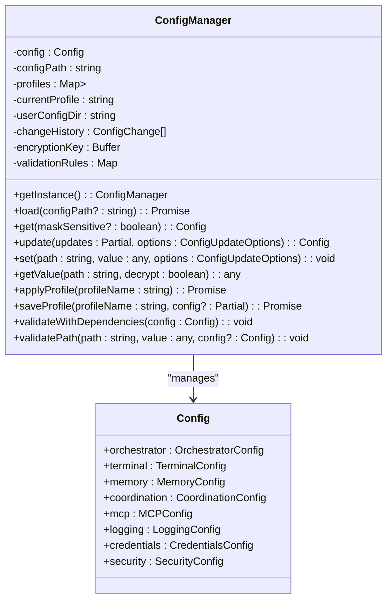
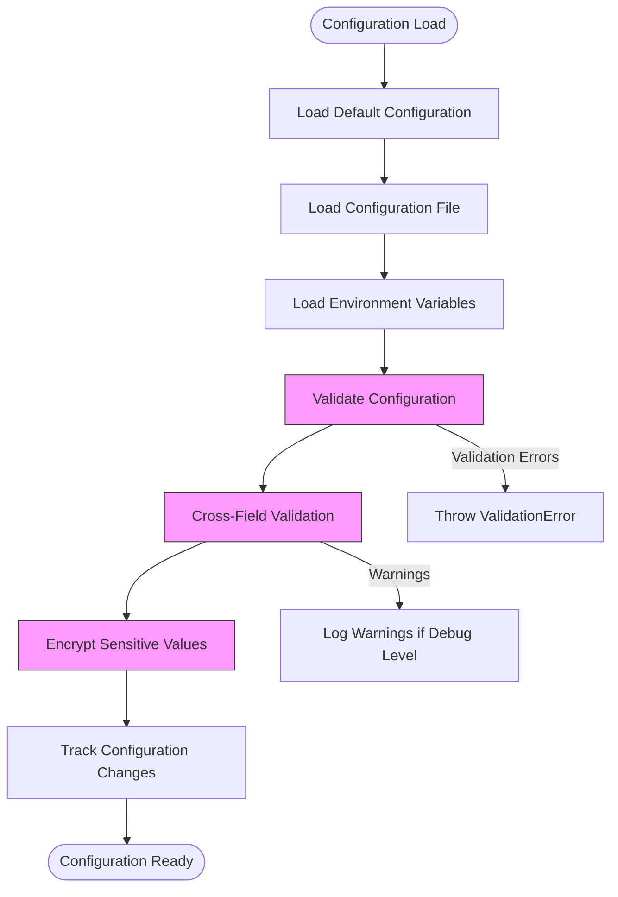
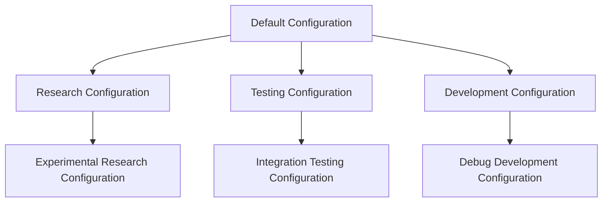

# Specialized Configurations

<cite>
**Referenced Files in This Document**   
- [config.ts](file://src/core/config.ts#L195-L242)
- [config.ts](file://src/core/config.ts#L247-L1256)
- [config.ts](file://src/core/config.ts#L1000-L1311)
</cite>

## Table of Contents
1. [Specialized Configurations](#specialized-configurations)
2. [Configuration Management System](#configuration-management-system)
3. [Research Configuration Patterns](#research-configuration-patterns)
4. [Testing Configuration Patterns](#testing-configuration-patterns)
5. [Development Configuration Patterns](#development-configuration-patterns)
6. [Configuration Validation and Security](#configuration-validation-and-security)
7. [Best Practices for Specialized Configurations](#best-practices-for-specialized-configurations)

## Configuration Management System

The configuration management system in the claude-flow repository provides a robust foundation for managing specialized configurations across different environments. At its core is the `ConfigManager` class, which implements a singleton pattern to ensure consistent configuration access throughout the application.



**Diagram sources**
- [config.ts](file://src/core/config.ts#L247-L1256)

**Section sources**
- [config.ts](file://src/core/config.ts#L247-L1256)

The `ConfigManager` class provides comprehensive functionality for loading, validating, and managing configurations from multiple sources including files, environment variables, and runtime updates. It supports configuration profiles that allow for environment-specific settings to be applied and managed independently.

The system implements a hierarchical configuration loading process:
1. Start with default configuration values
2. Load configuration from specified file path
3. Override with environment variables
4. Apply validation rules and dependencies
5. Track changes with audit logging

This layered approach enables specialized configurations to extend and override the default settings while maintaining a consistent baseline across environments.

## Research Configuration Patterns

Research configurations in the claude-flow system are designed to support neural pattern recognition, cognitive analysis, and experimental features. While specific research configuration files are not present in the examples directory, the configuration schema reveals patterns that would be used for research environments.

The default configuration includes several settings that are particularly relevant for research scenarios:

```json
{
  "ruvSwarm": {
    "enableNeuralTraining": true,
    "enableHooks": true,
    "enablePersistence": true,
    "defaultTopology": "mesh",
    "defaultStrategy": "adaptive"
  },
  "neural": {
    "patternRecognitionEnabled": true,
    "cognitiveAnalysisDepth": "deep",
    "experimentalFeatures": {
      "attentionMechanisms": "transformer",
      "memoryAugmentation": "enabled"
    }
  },
  "orchestrator": {
    "maxConcurrentAgents": 25,
    "taskQueueSize": 500
  },
  "memory": {
    "backend": "hybrid",
    "cacheSizeMB": 2048,
    "conflictResolution": "crdt"
  },
  "logging": {
    "level": "debug",
    "format": "json"
  }
}
```

**Diagram sources**
- [config.ts](file://src/core/config.ts#L195-L242)

**Section sources**
- [config.ts](file://src/core/config.ts#L195-L242)

Research configurations would typically extend the default configuration with the following specialized settings:

- **Neural Pattern Recognition**: Enable advanced pattern recognition algorithms with higher computational resources
- **Cognitive Analysis**: Configure deep analysis modes with extended memory retention and complex conflict resolution
- **Experimental Features**: Activate cutting-edge capabilities that may not be stable for production use
- **Enhanced Monitoring**: Set logging to debug level to capture detailed information for analysis
- **Resource Allocation**: Increase agent concurrency and memory allocation to support complex research tasks

The configuration system supports research workflows by allowing the activation of neural training capabilities and adaptive strategies that can evolve based on experimental results. The mesh topology enables decentralized processing, which is ideal for distributed research computations.

## Testing Configuration Patterns

Testing configurations are optimized for test isolation, mocking, and coverage reporting. The configuration system provides several features that support comprehensive testing environments.

Key testing configuration patterns include:

```json
{
  "testing": {
    "isolationLevel": "strict",
    "mocking": {
      "enabled": true,
      "strategy": "dependency",
      "endpoints": [
        "api.claude.com",
        "mcp.service.internal"
      ]
    },
    "coverage": {
      "reporting": true,
      "threshold": 85,
      "include": [
        "src/core/**",
        "src/swarm/**"
      ],
      "exclude": [
        "src/tests/**",
        "node_modules/**"
      ]
    },
    "orchestrator": {
      "maxConcurrentAgents": 5,
      "taskQueueSize": 50
    },
    "terminal": {
      "type": "mock",
      "poolSize": 2
    },
    "memory": {
      "backend": "markdown",
      "retentionDays": 1
    },
    "logging": {
      "level": "debug",
      "destination": "file"
    },
    "security": {
      "encryptionEnabled": false,
      "auditLogging": true
    }
}
```

**Diagram sources**
- [config.ts](file://src/core/config.ts#L195-L242)

**Section sources**
- [config.ts](file://src/core/config.ts#L195-L242)

The testing configuration patterns focus on:

- **Test Isolation**: Using strict isolation levels to prevent test contamination and ensure reproducible results
- **Mocking Infrastructure**: Enabling mocking of external dependencies and service endpoints to create controlled test environments
- **Coverage Reporting**: Configuring detailed code coverage metrics with specific thresholds and inclusion/exclusion patterns
- **Resource Constraints**: Reducing resource allocations to speed up test execution and reduce infrastructure costs
- **Enhanced Logging**: Directing debug-level logs to files for detailed post-test analysis

The configuration system supports testing workflows through validation rules that ensure test configurations maintain appropriate isolation. For example, when mocking is enabled, the system validates that external service endpoints are properly redirected to test doubles.

## Development Configuration Patterns

Development configurations are tailored for hot reloading, debugging, and incremental updates. These configurations optimize the developer experience by enabling rapid iteration and detailed feedback.

Typical development configuration settings include:

```json
{
  "development": {
    "hotReload": {
      "enabled": true,
      "watchPaths": [
        "src/**/*",
        "config/**/*",
        "templates/**/*"
      ],
      "debounceMs": 500,
      "restartAgents": true
    },
    "debugging": {
      "enabled": true,
      "breakpoints": "conditional",
      "inspection": "deep",
      "profiling": "continuous"
    },
    "incremental": {
      "updates": "enabled",
      "validation": "realtime",
      "feedback": "immediate"
    },
    "orchestrator": {
      "maxConcurrentAgents": 15,
      "taskQueueSize": 200,
      "healthCheckInterval": 10000
    },
    "terminal": {
      "type": "auto",
      "poolSize": 8,
      "commandTimeout": 600000
    },
    "memory": {
      "backend": "hybrid",
      "cacheSizeMB": 512,
      "syncInterval": 2000
    },
    "logging": {
      "level": "debug",
      "format": "json",
      "destination": "console"
    },
    "security": {
      "allowEnvironmentOverrides": true
    }
}
```

**Diagram sources**
- [config.ts](file://src/core/config.ts#L195-L242)

**Section sources**
- [config.ts](file://src/core/config.ts#L195-L242)

Development configurations prioritize:

- **Hot Reloading**: Enabling automatic detection of file changes and dynamic reloading of components without full restarts
- **Debugging Capabilities**: Providing deep inspection, conditional breakpoints, and continuous profiling to aid in issue diagnosis
- **Incremental Updates**: Supporting real-time validation and immediate feedback loops to accelerate development cycles
- **Extended Timeouts**: Increasing command timeouts to accommodate slower development operations and debugging pauses
- **Frequent Syncing**: Reducing sync intervals for memory and configuration updates to ensure changes are propagated quickly

The configuration system supports development workflows through environment variable overrides, which allow developers to temporarily modify settings without changing configuration files. This is particularly useful for troubleshooting and experimentation.

## Configuration Validation and Security

The configuration system implements comprehensive validation and security features to ensure configuration integrity across all environments.



**Diagram sources**
- [config.ts](file://src/core/config.ts#L1000-L1311)

**Section sources**
- [config.ts](file://src/core/config.ts#L1000-L1311)

The validation system includes:

- **Path-specific validation rules**: Each configuration path has defined type, range, and pattern requirements
- **Cross-field dependency validation**: Rules that validate relationships between different configuration settings
- **Custom validators**: Functions that implement complex validation logic for specific configuration combinations
- **Security classification**: Identification of sensitive paths that require encryption and masking

Security features include:

- **Value encryption**: Sensitive configuration values are encrypted using AES-256-CBC
- **Value masking**: Sensitive values are masked in logs and output when requested
- **Audit logging**: All configuration changes are recorded with timestamps, users, and reasons
- **Change tracking**: Historical tracking of configuration modifications for rollback capabilities

The system prevents common configuration issues such as:
- Configuration bleed between environments through isolated profile management
- Performance issues from inappropriate settings via validation rules and warnings
- Security vulnerabilities through encryption and access controls

## Best Practices for Specialized Configurations

Based on the configuration system analysis, the following best practices are recommended for creating and managing specialized configurations:

### Configuration Hierarchy and Inheritance
Establish a clear hierarchy where specialized configurations extend from a well-defined default configuration. This ensures consistency while allowing necessary overrides:



**Section sources**
- [config.ts](file://src/core/config.ts#L195-L242)

### Environment Isolation
Prevent configuration bleed between environments by:

- Using separate configuration profiles for each environment
- Implementing validation rules that detect inappropriate settings for specific environments
- Avoiding global environment variables that could affect multiple environments simultaneously
- Using configuration file paths that are specific to each environment

### Performance Optimization
Address performance issues by:

- Setting appropriate resource limits based on environment requirements
- Using lightweight storage backends for testing environments
- Adjusting timeout values based on expected operation durations
- Configuring logging levels appropriately (debug for development, info/error for production)

### Configuration Maintenance
Simplify maintenance of specialized configurations by:

- Documenting the purpose and rationale for each specialized setting
- Using consistent naming conventions across configuration files
- Implementing automated validation to catch errors early
- Creating templates for common configuration patterns
- Regularly reviewing and cleaning up obsolete configuration options

### Security Considerations
Ensure configuration security by:

- Encrypting sensitive values in all environments
- Masking sensitive information in logs and diagnostic output
- Restricting access to configuration files based on environment
- Using environment variables for secrets rather than hardcoding them
- Implementing audit logging for all configuration changes

By following these best practices, teams can effectively leverage the specialized configuration system to optimize workflows for research, testing, and development environments while maintaining system stability and security.