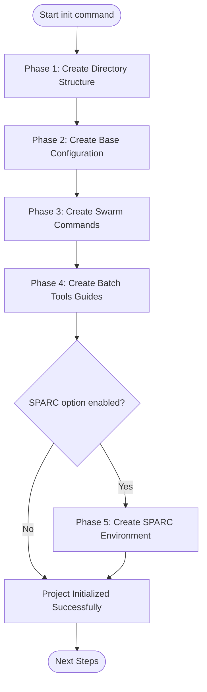
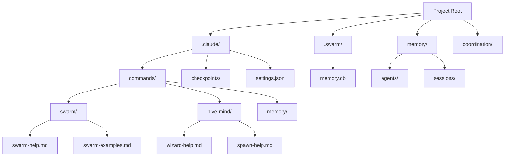
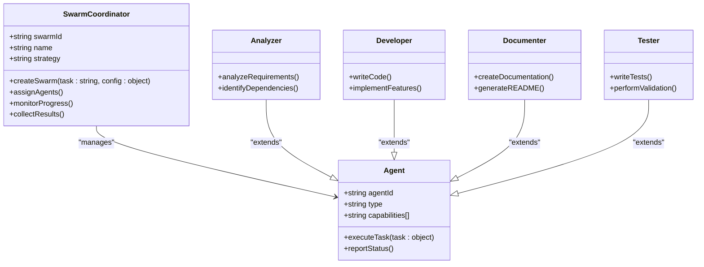
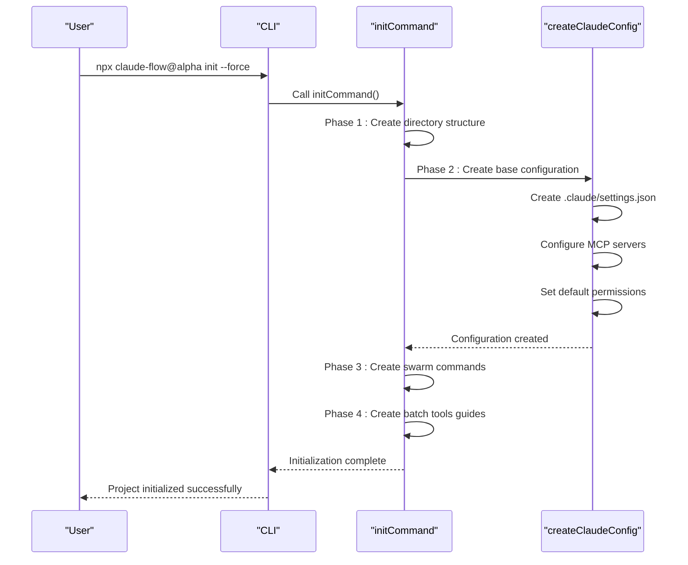
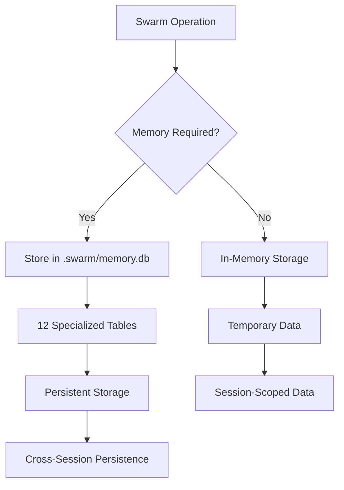

# Getting Started Tutorials

<cite>
**Referenced Files in This Document**   
- [README.md](file://README.md)
- [examples/hello-world.js](file://examples/hello-world.js)
- [examples/quick-start.sh](file://examples/quick-start.sh)
- [examples/06-tutorials/getting-started/01-first-swarm.md](file://examples/06-tutorials/getting-started/01-first-swarm.md)
- [src/cli/init/index.ts](file://src/cli/init/index.ts)
- [src/cli/init/directory-structure.ts](file://src/cli/init/directory-structure.ts)
- [src/cli/init/swarm-commands.ts](file://src/cli/init/swarm-commands.ts)
- [src/cli/init/claude-config.ts](file://src/cli/init/claude-config.ts)
</cite>

## Table of Contents
1. [Introduction](#introduction)
2. [Installation and Setup](#installation-and-setup)
3. [Initializing Your First Project](#initializing-your-first-project)
4. [Running Basic Commands](#running-basic-commands)
5. [Creating a Hello World Workflow](#creating-a-hello-world-workflow)
6. [Understanding Swarms](#understanding-swarms)
7. [Configuration Management](#configuration-management)
8. [Troubleshooting Common Issues](#troubleshooting-common-issues)
9. [Performance Considerations](#performance-considerations)

## Introduction

Claude-Flow is an AI orchestration platform that enables developers to coordinate multiple AI agents for complex development tasks. This tutorial provides a comprehensive guide for new users to get started with Claude-Flow, covering installation, project initialization, basic command execution, and swarm creation. The platform combines hive-mind intelligence, neural pattern recognition, and 87 MCP tools to streamline AI-powered development workflows.

## Installation and Setup

### Prerequisites
Before installing Claude-Flow, ensure you have the following prerequisites:
- **Node.js 18+** (LTS recommended)
- **npm 9+** or equivalent package manager
- **Claude Code** installed globally

### Installing Claude-Flow
You can install Claude-Flow globally using npm:

```bash
npm install -g claude-flow@alpha
```

Alternatively, use npx for instant testing without global installation:

```bash
npx claude-flow@alpha --help
```

### Installing Claude Code
Claude-Flow requires Claude Code to be installed first:

```bash
# Install Claude Code globally
npm install -g @anthropic-ai/claude-code

# Skip permissions check for faster setup (use with caution)
claude --dangerously-skip-permissions
```

**Windows Note**: If you encounter SQLite errors, Claude Flow will automatically use in-memory storage. For persistent storage options, refer to the Windows installation guide.

**Section sources**
- [README.md](file://README.md#L45-L65)

## Initializing Your First Project

### The Init Command
The `init` command sets up a new Claude-Flow project with the necessary directory structure, configuration files, and documentation. The initialization process follows a five-phase approach:

```bash
npx claude-flow@alpha init --force
```

### Initialization Phases
The initialization process consists of five distinct phases:



**Diagram sources**
- [src/cli/init/index.ts](file://src/cli/init/index.ts#L15-L67)

**Section sources**
- [src/cli/init/index.ts](file://src/cli/init/index.ts#L15-L67)

### Directory Structure Creation
The initialization process creates a comprehensive directory structure for your project:



**Diagram sources**
- [src/cli/init/directory-structure.ts](file://src/cli/init/directory-structure.ts)

**Section sources**
- [src/cli/init/directory-structure.ts](file://src/cli/init/directory-structure.ts)

## Running Basic Commands

### Command Reference
After initialization, you can explore the available commands:

```bash
npx claude-flow@alpha --help
```

Key commands include:
- **Hive-Mind**: `hive-mind wizard`, `hive-mind spawn`, `hive-mind status`
- **Neural**: `neural train`, `neural predict`, `cognitive analyze`
- **Memory**: `memory store`, `memory query`, `memory stats`, `memory export/import`
- **GitHub**: `github <mode>` (6 specialized modes available)
- **Workflows**: `workflow create`, `batch process`, `pipeline create`

### Checking Installation
Verify your installation is working correctly:

```bash
claude-flow --version  # Should show 2.0.0-alpha.53
```

### Testing Hive-Mind Coordination
Test the hive-mind coordination system:

```bash
npx claude-flow@alpha hive-mind test --agents 5 --coordination-test
```

**Section sources**
- [README.md](file://README.md#L600-L625)

## Creating a Hello World Workflow

### Basic Hello World Example
Create a simple "Hello World" application using the swarm command:

```bash
cd examples
../claude-flow swarm create "Build a hello world CLI application" \
  --name my-first-swarm \
  --output ./output/hello-world
```

### Examining the Output
Navigate to the output directory and examine the generated files:

```bash
cd ./output/hello-world
ls -la
```

The output should include:
- `index.js` - Main application file
- `package.json` - Node.js configuration
- `README.md` - Documentation
- `test.js` - Test file (if tests were requested)

### Running Your Application
Install dependencies and run the application:

```bash
npm install  # Install any dependencies
npm start    # Run the application
```

### Understanding the Process
The swarm creation process involves several steps:
1. Claude Flow creates a swarm coordinator
2. Assigns agents based on the task requirements
3. Agents collaborate to build the application
4. Output is saved to the specified directory

**Section sources**
- [examples/06-tutorials/getting-started/01-first-swarm.md](file://examples/06-tutorials/getting-started/01-first-swarm.md#L25-L50)

## Understanding Swarms

### What is a Swarm?
A swarm is a coordinated group of AI agents working together to complete a task. Each agent has specific capabilities and roles, enabling efficient collaboration on complex development tasks.

### Agent Roles in a Swarm
Different agents play specific roles in the swarm:



**Diagram sources**
- [src/cli/commands/swarm.ts](file://src/cli/commands/swarm.ts)
- [src/cli/agents/index.ts](file://src/cli/agents/index.ts)

**Section sources**
- [examples/06-tutorials/getting-started/01-first-swarm.md](file://examples/06-tutorials/getting-started/01-first-swarm.md#L55-L65)

### Swarm Strategies
Claude-Flow supports different strategies for swarm execution:

| Strategy | Use Case | Description |
|---------|--------|-------------|
| **Development** | Code creation | Focuses on implementation and feature development |
| **Research** | Information gathering | Specializes in data collection and analysis |
| **Analysis** | Code review | Performs thorough code examination and feedback |
| **Testing** | Quality assurance | Creates comprehensive test suites |
| **Optimization** | Performance improvement | Focuses on efficiency and resource optimization |

### Customizing Swarms
You can customize swarm behavior with various parameters:

```bash
../claude-flow swarm create \
  "Build a CLI calculator that supports add, subtract, multiply, divide" \
  --agents 3 \
  --strategy development \
  --name calculator-swarm
```

**Parameters explained:**
- `--agents 3`: Use 3 specialized agents
- `--strategy development`: Focus on code creation
- `--name`: Give your swarm a memorable name

**Section sources**
- [examples/06-tutorials/getting-started/01-first-swarm.md](file://examples/06-tutorials/getting-started/01-first-swarm.md#L75-L90)

## Configuration Management

### Configuration Files
The initialization process creates several configuration files:



**Diagram sources**
- [src/cli/init/index.ts](file://src/cli/init/index.ts#L15-L67)
- [src/cli/init/claude-config.ts](file://src/cli/init/claude-config.ts)

**Section sources**
- [src/cli/init/claude-config.ts](file://src/cli/init/claude-config.ts)

### Hooks System
Claude-Flow includes an advanced hooks system that automates coordination and enhances operations:

#### Pre-Operation Hooks
- **`pre-task`**: Auto-assigns agents based on task complexity
- **`pre-search`**: Caches searches for improved performance
- **`pre-edit`**: Validates files and prepares resources
- **`pre-command`**: Security validation before execution

#### Post-Operation Hooks
- **`post-edit`**: Auto-formats code using language-specific tools
- **`post-task`**: Trains neural patterns from successful operations
- **`post-command`**: Updates memory with operation context
- **`notification`**: Real-time progress updates

### Hook Configuration
The hooks system is configured in `.claude/settings.json`:

```json
{
  "hooks": {
    "preEditHook": {
      "command": "npx",
      "args": ["claude-flow", "hooks", "pre-edit", "--file", "${file}", "--auto-assign-agents", "true"],
      "alwaysRun": false
    },
    "postEditHook": {
      "command": "npx",
      "args": ["claude-flow", "hooks", "post-edit", "--file", "${file}", "--format", "true"],
      "alwaysRun": true
    },
    "sessionEndHook": {
      "command": "npx",
      "args": ["claude-flow", "hooks", "session-end", "--generate-summary", "true"],
      "alwaysRun": true
    }
  }
}
```

**Section sources**
- [README.md](file://README.md#L200-L250)

## Troubleshooting Common Issues

### Environment Configuration
**Problem**: Installation fails due to Node.js version
- **Solution**: Ensure you have Node.js 18+ installed. Check your version with `node --version`

**Problem**: Permission errors during installation
- **Solution**: Use `--dangerously-skip-permissions` flag or run the command with elevated privileges

### Dependency Resolution
**Problem**: Missing dependencies after swarm creation
- **Solution**: Run `npm install` in the output directory to install all dependencies

**Problem**: Package installation fails
- **Solution**: Clear npm cache with `npm cache clean --force` and retry installation

### Permission Errors
**Problem**: Cannot write to directory
- **Solution**: Ensure you have write permissions to the project directory

**Problem**: Hook execution fails due to permission issues
- **Solution**: Check the hook configuration in `.claude/settings.json` and ensure the commands have necessary permissions

### Hook Variable Interpolation
If you're experiencing issues with `${file}` or `${command}` variables not working in your hooks:

```bash
# Fix all found settings.json files
npx claude-flow@alpha fix-hook-variables

# Fix specific file
npx claude-flow@alpha fix-hook-variables .claude/settings.json
```

This command automatically transforms legacy variable syntax to working environment variables:
- `${file}` → `$CLAUDE_EDITED_FILE`
- `${command}` → `$CLAUDE_COMMAND`
- `${tool}` → `$CLAUDE_TOOL`

**Section sources**
- [README.md](file://README.md#L250-L270)

## Performance Considerations

### Initialization Optimization
The initialization process can be optimized for faster startup times:

#### Use Force Flag
The `--force` flag skips existing file checks and speeds up initialization:

```bash
npx claude-flow@alpha init --force
```

#### Selective Initialization
For faster setup, initialize only essential components:

```bash
# Initialize with minimal features
npx claude-flow@alpha init --force --hive-mind
```

### Memory Management
Claude-Flow uses a SQLite-based memory system for persistent storage:



**Diagram sources**
- [src/cli/init/directory-structure.ts](file://src/cli/init/directory-structure.ts)
- [src/memory/sqlite-store.js](file://src/memory/sqlite-store.js)

**Section sources**
- [README.md](file://README.md#L100-L120)

### Performance Tips
- **Use npx for testing**: Avoid global installation when testing
- **Leverage caching**: The system caches searches and operations for improved performance
- **Monitor resource usage**: Use `memory stats` command to track memory usage
- **Optimize swarm size**: Use appropriate number of agents for the task complexity
- **Utilize batch processing**: For multiple similar tasks, use batch commands

### Performance Metrics
Claude-Flow provides industry-leading performance metrics:
- **84.8% SWE-Bench Solve Rate**: Superior problem-solving through hive-mind coordination
- **32.3% Token Reduction**: Efficient task breakdown reduces costs significantly
- **2.8-4.4x Speed Improvement**: Parallel coordination maximizes throughput

Check memory system performance:
```bash
npx claude-flow@alpha memory stats
npx claude-flow@alpha memory list
```

**Section sources**
- [README.md](file://README.md#L500-L520)