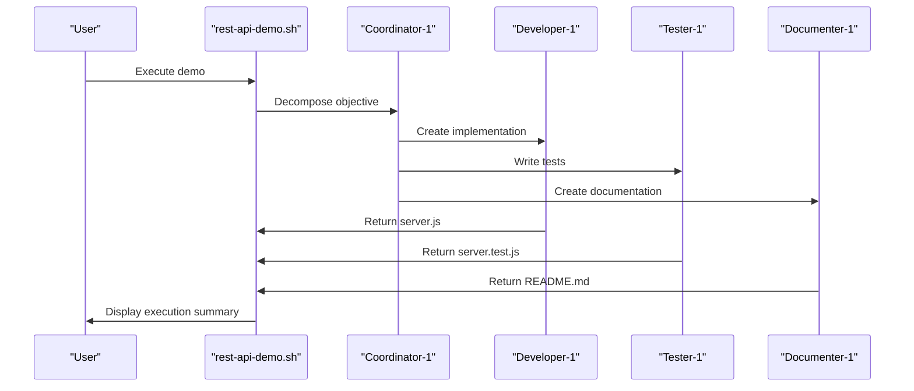
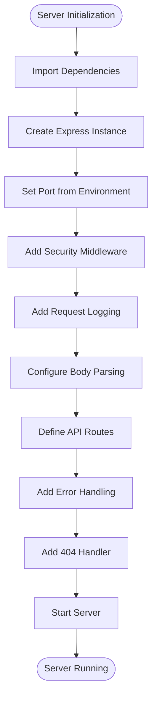
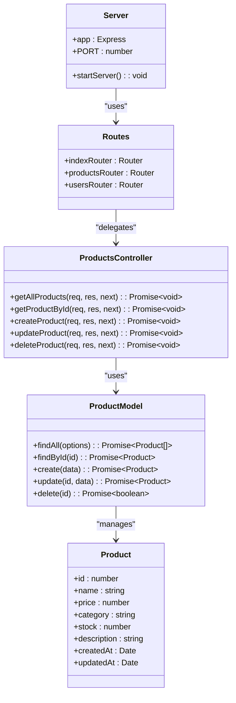
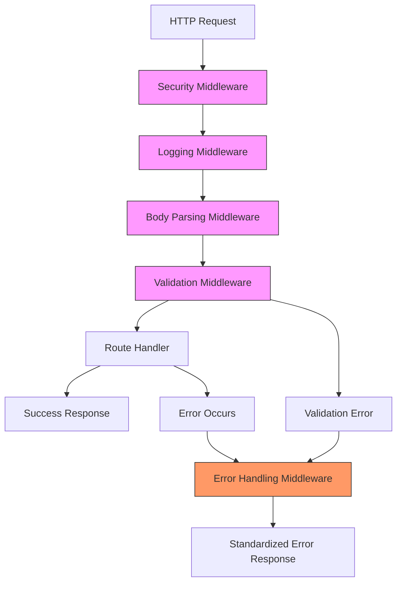
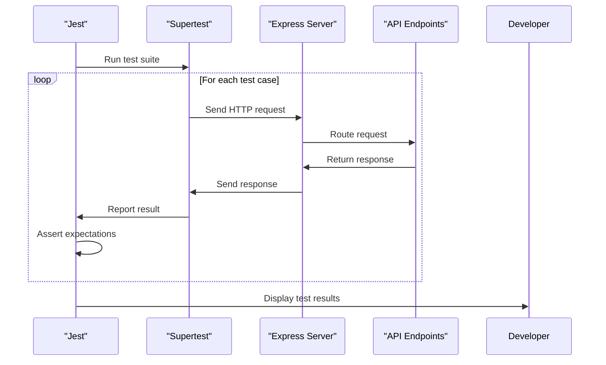
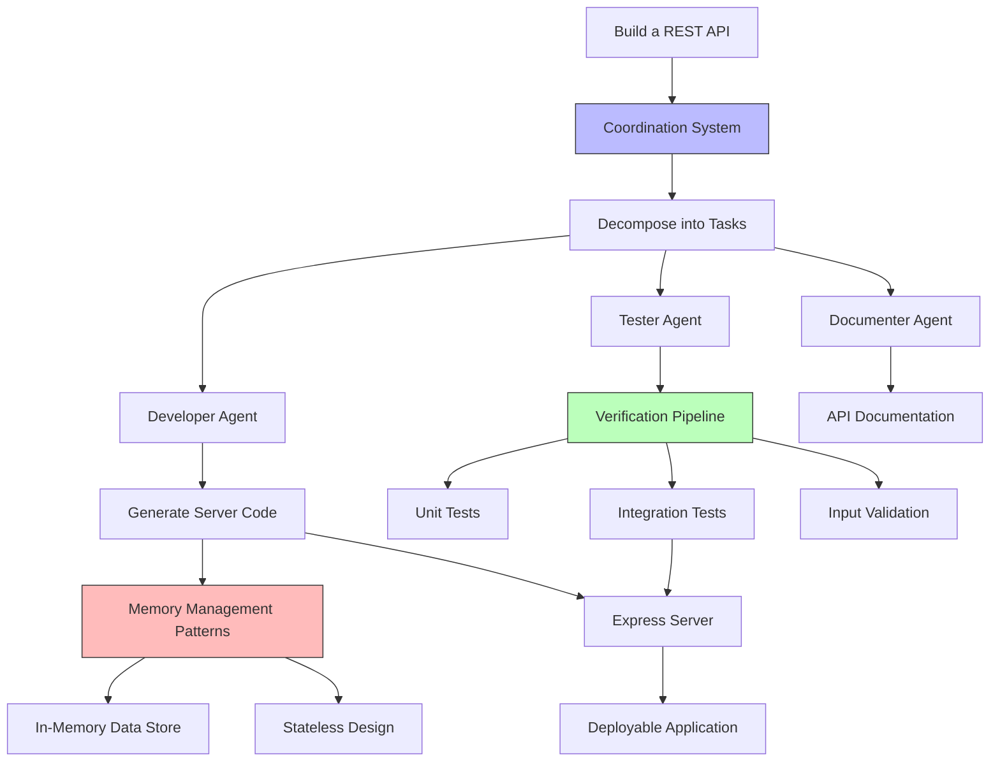
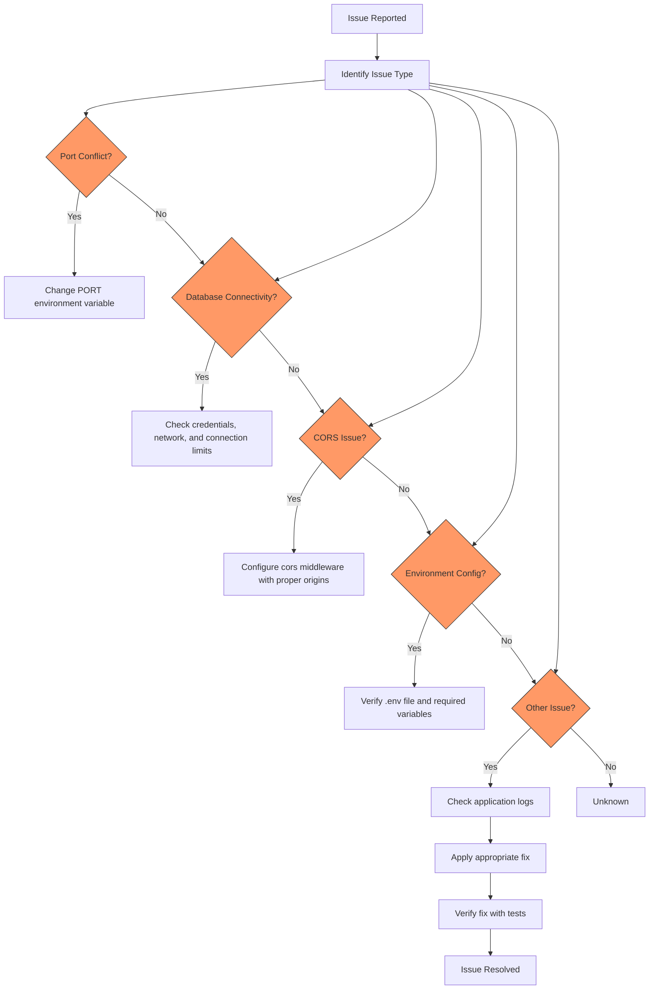
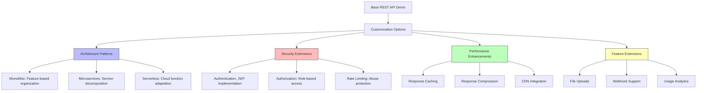

# Application Demos

<cite>
**Referenced Files in This Document**   
- [rest-api-demo.sh](file://examples/03-demos/rest-api-demo.sh)
- [server.js](file://examples/05-swarm-apps/rest-api/src/server.js)
- [routes/index.js](file://examples/05-swarm-apps/rest-api/src/routes/index.js)
- [routes/products.js](file://examples/05-swarm-apps/rest-api/src/routes/products.js)
- [controllers/productsController.js](file://examples/05-swarm-apps/rest-api/src/controllers/productsController.js)
- [models/productModel.js](file://examples/05-swarm-apps/rest-api/src/models/productModel.js)
- [middleware/errorHandler.js](file://examples/05-swarm-apps/rest-api/src/middleware/errorHandler.js)
- [tests/server.test.js](file://examples/05-swarm-apps/rest-api/tests/server.test.js)
- [tests/products.test.js](file://examples/05-swarm-apps/rest-api/tests/products.test.js)
- [README.md](file://examples/05-swarm-apps/rest-api/README.md)
</cite>

## Table of Contents
1. [Introduction](#introduction)
2. [REST API Demo Script Analysis](#rest-api-demo-script-analysis)
3. [Service Initialization and Configuration](#service-initialization-and-configuration)
4. [Endpoint Configuration and Routing](#endpoint-configuration-and-routing)
5. [Middleware Components](#middleware-components)
6. [Integration Testing Approach](#integration-testing-approach)
7. [Relationship to Coordination and Memory Management](#relationship-to-coordination-and-memory-management)
8. [Common Issues and Troubleshooting](#common-issues-and-troubleshooting)
9. [Customization and Extension Guide](#customization-and-extension-guide)
10. [Conclusion](#conclusion)

## Introduction

The Application Demos section illustrates full-stack application development workflows through practical examples. This document focuses on the `rest-api-demo.sh` script, which demonstrates how the Claude Flow Swarm system creates a complete REST API implementation. The demo showcases a comprehensive workflow from service initialization to endpoint configuration and integration testing, providing insight into the system's ability to generate production-ready applications.

The analysis covers the implementation details of the demo script, including its service initialization sequence, endpoint configuration, and integration testing approach. It examines how the demo leverages core components like `server.js`, routes configuration, and middleware to create a functional API. The document also explores the relationship between this application demo and the underlying coordination, memory management, and verification pipeline features of the system.

**Section sources**
- [rest-api-demo.sh](file://examples/03-demos/rest-api-demo.sh)

## REST API Demo Script Analysis

The `rest-api-demo.sh` script demonstrates the creation of a REST API using the Claude Flow Swarm system. When executed, it simulates the output of running the command `./bin/claude-flow swarm "Build a REST API in examples/" --strategy development`, showcasing what the swarm system generates for a REST API implementation.

The script creates a complete REST API structure in the `/workspaces/claude-code-flow/examples/rest-api` directory, including all necessary files for a functional Express.js application. It demonstrates the swarm's ability to decompose complex objectives into coordinated tasks executed by specialized agents.

The demo creates the following files:
- `server.js`: Main Express application with middleware and endpoints
- `package.json`: Dependencies and scripts configuration
- `server.test.js`: Integration tests using Jest and Supertest
- `README.md`: Comprehensive documentation with usage examples
- `.gitignore`: Git ignore configuration
- `.env.example`: Environment variables template

The script illustrates a multi-agent workflow where different swarm agents participate in the development process:
- **Coordinator-1**: Decomposes the objective into tasks
- **Developer-1**: Creates the server implementation
- **Tester-1**: Writes the test suite
- **Reviewer-1**: Analyzes requirements
- **Documenter-1**: Creates documentation

This demonstrates the system's coordination capabilities, showing how complex development tasks can be distributed across specialized agents working in concert to deliver a complete application.



**Diagram sources**
- [rest-api-demo.sh](file://examples/03-demos/rest-api-demo.sh)

**Section sources**
- [rest-api-demo.sh](file://examples/03-demos/rest-api-demo.sh)

## Service Initialization and Configuration

The service initialization process in the REST API demo follows a structured approach to create a robust Express.js application. The `server.js` file generated by the demo script serves as the entry point for the application, configuring the server with essential middleware and defining core endpoints.

The initialization sequence begins with importing required dependencies, including Express.js for the web framework. The application creates an Express instance and sets the port from the environment variable or defaults to 3000. This approach allows for flexible deployment configurations across different environments.

```javascript
const express = require('express');
const app = express();
const port = process.env.PORT || 3000;
```

The server configures essential middleware for request processing:
- `express.json()`: Parses incoming JSON payloads
- `express.urlencoded({ extended: true })`: Parses URL-encoded data

These middleware components enable the server to handle various request body formats, making it compatible with different client implementations.

The demo includes a health check endpoint that provides system status information, which is crucial for monitoring and orchestration in production environments:

```javascript
app.get('/health', (req, res) => {
  res.json({ 
    status: 'healthy',
    service: 'REST API',
    swarmId: 'swarm_demo_12345',
    created: new Date().toISOString()
  });
});
```

The actual implementation in the `examples/05-swarm-apps/rest-api` directory expands on this foundation with additional security and operational features:
- **Helmet**: Adds security headers to protect against common web vulnerabilities
- **CORS**: Configures cross-origin resource sharing for frontend integration
- **Morgan**: Implements request logging for monitoring and debugging
- **Environment awareness**: Uses dotenv for configuration management

The server initialization also includes proper error handling middleware and a 404 handler for undefined routes, ensuring consistent response formats across all scenarios.



**Diagram sources**
- [server.js](file://examples/05-swarm-apps/rest-api/src/server.js)

**Section sources**
- [server.js](file://examples/05-swarm-apps/rest-api/src/server.js)
- [rest-api-demo.sh](file://examples/03-demos/rest-api-demo.sh)

## Endpoint Configuration and Routing

The endpoint configuration in the REST API demo demonstrates a modular approach to API design, separating concerns between route definitions, controllers, and models. This separation follows the MVC (Model-View-Controller) pattern, promoting maintainability and scalability.

The demo script creates a simple set of CRUD (Create, Read, Update, Delete) endpoints for an items resource:

```javascript
// Sample endpoints from rest-api-demo.sh
app.get('/api/v1/items', (req, res) => { /* ... */ });
app.get('/api/v1/items/:id', (req, res) => { /* ... */ });
app.post('/api/v1/items', (req, res) => { /* ... */ });
app.put('/api/v1/items/:id', (req, res) => { /* ... */ });
app.delete('/api/v1/items/:id', (req, res) => { /* ... */ });
```

The actual implementation in the `examples/05-swarm-apps/rest-api` directory expands this pattern with a more sophisticated routing structure. The application uses Express Router to organize routes into modular components:

```javascript
// routes/index.js
const router = express.Router();
router.use('/users', usersRouter);
router.use('/products', productsRouter);
```

This modular approach allows for clean separation of different API resources, making the codebase easier to navigate and maintain. Each resource has its own route file (e.g., `products.js`) that defines specific endpoints and associates them with controller functions:

```javascript
// routes/products.js
router.get('/', productsController.getAllProducts);
router.get('/:id', productsController.getProductById);
router.post('/', validateProduct, handleValidationErrors, productsController.createProduct);
```

The implementation includes comprehensive input validation using `express-validator`, ensuring data integrity and providing meaningful error messages:

```javascript
const validateProduct = [
  body('name').trim().notEmpty().withMessage('Product name is required'),
  body('price').isFloat({ min: 0 }).withMessage('Price must be a positive number'),
  body('category').trim().notEmpty().withMessage('Category is required')
];
```

The routing system also supports advanced features like query parameter filtering and pagination:

```javascript
// GET /api/v1/products?category=Electronics&minPrice=50&maxPrice=200&page=2&limit=10
const { page = 1, limit = 10, category, minPrice, maxPrice } = req.query;
```

This demonstrates how the system can generate APIs that follow REST best practices, including proper HTTP status codes, consistent response formats, and support for common API patterns.



**Diagram sources**
- [server.js](file://examples/05-swarm-apps/rest-api/src/server.js)
- [routes/index.js](file://examples/05-swarm-apps/rest-api/src/routes/index.js)
- [routes/products.js](file://examples/05-swarm-apps/rest-api/src/routes/products.js)
- [controllers/productsController.js](file://examples/05-swarm-apps/rest-api/src/controllers/productsController.js)
- [models/productModel.js](file://examples/05-swarm-apps/rest-api/src/models/productModel.js)

**Section sources**
- [rest-api-demo.sh](file://examples/03-demos/rest-api-demo.sh)
- [server.js](file://examples/05-swarm-apps/rest-api/src/server.js)
- [routes/index.js](file://examples/05-swarm-apps/rest-api/src/routes/index.js)
- [routes/products.js](file://examples/05-swarm-apps/rest-api/src/routes/products.js)
- [controllers/productsController.js](file://examples/05-swarm-apps/rest-api/src/controllers/productsController.js)
- [models/productModel.js](file://examples/05-swarm-apps/rest-api/src/models/productModel.js)

## Middleware Components

The middleware components in the REST API demo play a crucial role in enhancing the application's functionality, security, and reliability. The system demonstrates a layered approach to middleware implementation, with different components handling specific concerns.

The basic demo script includes essential middleware for request processing:

```javascript
app.use(express.json());
app.use(express.urlencoded({ extended: true }));
```

These middleware functions handle request body parsing, enabling the API to process data from various sources, including JSON payloads and form submissions.

The production-ready implementation in `examples/05-swarm-apps/rest-api` expands on this foundation with additional middleware layers:

**Security Middleware**
- **Helmet**: Adds security headers to protect against common web vulnerabilities like XSS, CSRF, and clickjacking
- **CORS**: Configures cross-origin resource sharing to enable safe communication between frontend and backend

```javascript
app.use(helmet());
app.use(cors());
```

**Logging Middleware**
- **Morgan**: Implements comprehensive request logging with the 'combined' format, capturing essential information for monitoring and debugging

```javascript
app.use(morgan('combined'));
```

**Error Handling Middleware**
The system includes a sophisticated global error handling mechanism that provides consistent error responses:

```javascript
const errorHandler = (err, req, res, next) => {
  // Log error details
  console.error('Error:', {
    message: err.message,
    stack: err.stack,
    path: req.path,
    method: req.method,
    timestamp: new Date().toISOString()
  });
  
  // Handle specific error types
  if (err.name === 'ValidationError') {
    status = 400;
    message = 'Validation Error';
  } else if (err.name === 'CastError') {
    status = 400;
    message = 'Invalid ID format';
  } else if (err.code === 'ECONNREFUSED') {
    status = 503;
    message = 'Service Unavailable';
  }
  
  // Send standardized error response
  res.status(status).json(errorResponse);
};
```

This middleware demonstrates several important patterns:
- Centralized error logging for debugging and monitoring
- Type-specific error handling for common scenarios
- Environment-aware response details (more details in development)
- Standardized response format for client consistency

The implementation also includes validation middleware for input validation:

```javascript
const validateProduct = [
  body('name').trim().notEmpty().withMessage('Product name is required'),
  body('price').isFloat({ min: 0 }).withMessage('Price must be a positive number'),
  body('category').trim().notEmpty().withMessage('Category is required')
];

const handleValidationErrors = (req, res, next) => {
  const errors = validationResult(req);
  if (!errors.isEmpty()) {
    return res.status(400).json({ errors: errors.array() });
  }
  next();
};
```

This two-part validation approach separates validation rules from error handling, promoting reusability and maintainability.



**Diagram sources**
- [server.js](file://examples/05-swarm-apps/rest-api/src/server.js)
- [middleware/errorHandler.js](file://examples/05-swarm-apps/rest-api/src/middleware/errorHandler.js)
- [routes/products.js](file://examples/05-swarm-apps/rest-api/src/routes/products.js)

**Section sources**
- [server.js](file://examples/05-swarm-apps/rest-api/src/server.js)
- [middleware/errorHandler.js](file://examples/05-swarm-apps/rest-api/src/middleware/errorHandler.js)
- [routes/products.js](file://examples/05-swarm-apps/rest-api/src/routes/products.js)

## Integration Testing Approach

The integration testing approach in the REST API demo demonstrates comprehensive test coverage for API endpoints, ensuring reliability and functionality. The system generates both basic tests in the demo script and more extensive tests in the production implementation.

The `rest-api-demo.sh` script creates a `server.test.js` file with Jest tests that cover all API endpoints:

```javascript
describe('REST API Tests', () => {
  test('GET /health should return healthy status', async () => {
    const response = await request(app).get('/health');
    expect(response.status).toBe(200);
    expect(response.body.status).toBe('healthy');
  });

  test('GET /api/v1/items should return items list', async () => {
    const response = await request(app).get('/api/v1/items');
    expect(response.status).toBe(200);
    expect(response.body.items).toBeDefined();
    expect(Array.isArray(response.body.items)).toBe(true);
  });
  // Additional tests for other endpoints...
});
```

The actual implementation in `examples/05-swarm-apps/rest-api` features a more sophisticated testing strategy with separate test files for different components and comprehensive test coverage:

**Server Tests** (`server.test.js`)
- Health check endpoint validation
- API information endpoint verification
- 404 handler testing for unknown routes

**Products API Tests** (`products.test.js`)
- Comprehensive testing of all CRUD operations
- Query parameter filtering validation
- Input validation error cases
- Edge case handling (non-existent resources)

The tests use Supertest for HTTP request simulation and Jest for test execution and assertions. Key testing patterns include:

**Positive Test Cases**
```javascript
it('should get all products', async () => {
  const response = await request(app)
    .get('/api/v1/products')
    .expect(200);

  expect(response.body.success).toBe(true);
  expect(Array.isArray(response.body.data)).toBe(true);
});
```

**Negative Test Cases**
```javascript
it('should return 404 for non-existent product', async () => {
  const response = await request(app)
    .get('/api/v1/products/9999')
    .expect(404);

  expect(response.body.success).toBe(false);
  expect(response.body.message).toBe('Product not found');
});
```

**Validation Test Cases**
```javascript
it('should validate required fields', async () => {
  const response = await request(app)
    .post('/api/v1/products')
    .send({ name: 'Test' }) // Missing required fields
    .expect(400);

  expect(response.body).toHaveProperty('errors');
  expect(Array.isArray(response.body.errors)).toBe(true);
});
```

The testing approach follows best practices:
- **Test organization**: Related tests grouped in describe blocks
- **Comprehensive coverage**: All endpoints and error scenarios tested
- **Realistic data**: Tests use data that mimics production usage
- **Status code verification**: HTTP status codes explicitly checked
- **Response structure validation**: Response format and content validated

The package.json includes convenient scripts for test execution:
```json
"scripts": {
  "test": "jest",
  "test:watch": "jest --watch",
  "test:coverage": "jest --coverage"
}
```

This enables developers to run tests easily and monitor code coverage.



**Diagram sources**
- [server.test.js](file://examples/05-swarm-apps/rest-api/tests/server.test.js)
- [products.test.js](file://examples/05-swarm-apps/rest-api/tests/products.test.js)

**Section sources**
- [server.test.js](file://examples/05-swarm-apps/rest-api/tests/server.test.js)
- [products.test.js](file://examples/05-swarm-apps/rest-api/tests/products.test.js)
- [rest-api-demo.sh](file://examples/03-demos/rest-api-demo.sh)

## Relationship to Coordination and Memory Management

The REST API demo illustrates the relationship between application development and the underlying coordination, memory management, and verification pipeline features of the Claude Flow system. The demo showcases how these core system components work together to enable efficient and reliable application generation.

**Coordination System**
The demo script explicitly documents the multi-agent coordination workflow, showing how different specialized agents collaborate to complete the API development task:

```bash
echo "🤖 Swarm Agents that participated:"
echo "   • Coordinator-1: Decomposed objective into 4 tasks"
echo "   • Developer-1: Created server implementation"
echo "   • Tester-1: Wrote test suite"
echo "   • Reviewer-1: Analyzed requirements"
echo "   • Documenter-1: Created documentation"
```

This demonstrates a task decomposition pattern where a complex objective ("Build a REST API") is broken down into smaller, manageable tasks that can be assigned to specialized agents. The coordination system manages the workflow, ensuring that tasks are completed in the correct sequence and that outputs are properly integrated.

**Memory Management**
While the demo script itself doesn't directly show memory management, the generated API implementation includes patterns that relate to state management:

```javascript
// In-memory data store for demo purposes
let products = [
  { id: 1, name: 'Laptop', price: 999.99, category: 'Electronics', stock: 50 },
  // ... more products
];

let nextId = 5;
```

This in-memory storage pattern represents a simplified version of state management that would be expanded in a production system to use persistent databases. The system demonstrates awareness of data persistence needs while providing a functional demo with temporary storage.

The actual implementation shows how memory management considerations influence API design:
- **Pagination**: Limits data retrieval to prevent memory overload
- **Filtering**: Reduces data processing requirements
- **Stateless operations**: Most endpoints don't maintain server-side state

**Verification Pipeline**
The integration testing approach represents a key component of the verification pipeline, ensuring that generated code meets quality standards:

```javascript
// Comprehensive test suite verifies API functionality
describe('Products API Tests', () => {
  // Tests for all CRUD operations
  // Validation error cases
  // Edge cases and error handling
});
```

The verification pipeline includes multiple layers:
- **Syntax validation**: Ensuring generated code is syntactically correct
- **Functionality testing**: Verifying that endpoints work as expected
- **Error handling verification**: Confirming proper error responses
- **Security validation**: Checking for proper input validation and sanitization

The system also includes documentation as part of the verification process, ensuring that generated APIs are properly documented:

```markdown
## API Endpoints

### Health Check
- `GET /health` - Returns server health status

### Items Resource
- `GET /api/v1/items` - Get all items
- `GET /api/v1/items/:id` - Get item by ID
- `POST /api/v1/items` - Create new item
```

This comprehensive approach ensures that generated applications are not only functional but also maintainable and secure.



**Diagram sources**
- [rest-api-demo.sh](file://examples/03-demos/rest-api-demo.sh)
- [models/productModel.js](file://examples/05-swarm-apps/rest-api/src/models/productModel.js)
- [products.test.js](file://examples/05-swarm-apps/rest-api/tests/products.test.js)
- [README.md](file://examples/05-swarm-apps/rest-api/README.md)

**Section sources**
- [rest-api-demo.sh](file://examples/03-demos/rest-api-demo.sh)
- [models/productModel.js](file://examples/05-swarm-apps/rest-api/src/models/productModel.js)
- [products.test.js](file://examples/05-swarm-apps/rest-api/tests/products.test.js)
- [README.md](file://examples/05-swarm-apps/rest-api/README.md)

## Common Issues and Troubleshooting

The REST API demo and implementation provide insights into common issues developers may encounter and how to address them. Understanding these issues is crucial for successful deployment and maintenance of applications generated by the system.

**Port Conflicts**
Port conflicts occur when the specified port is already in use by another process. The demo handles this through environment variable configuration:

```javascript
const port = process.env.PORT || 3000;
```

**Troubleshooting steps:**
1. Check if the port is already in use:
   ```bash
   netstat -ano | grep 3000
   # Windows: netstat -ano | findstr 3000
   ```
2. Change the port in the `.env` file:
   ```env
   PORT=4000
   ```
3. Or specify the port when starting the application:
   ```bash
   PORT=4000 npm start
   ```

**Database Connectivity**
The demo uses in-memory storage for simplicity, but real applications require database connectivity. Common issues include:

- **Connection timeouts**: Network issues or database server overload
- **Authentication failures**: Incorrect credentials or permissions
- **Connection limits**: Exceeding maximum connections

**Solutions:**
- Implement connection pooling
- Add retry logic with exponential backoff
- Use environment-specific configuration
- Monitor connection health

**CORS Configuration**
Cross-Origin Resource Sharing issues commonly occur when frontend applications try to access the API from different domains:

```javascript
app.use(cors());
```

**Common CORS issues and solutions:**
- **Missing CORS headers**: Ensure cors middleware is properly configured
- **Invalid origin**: Specify allowed origins explicitly in production
- **Credentials issues**: Configure credentials properly when needed

```javascript
// Production CORS configuration
const corsOptions = {
  origin: ['https://yourdomain.com', 'https://www.yourdomain.com'],
  credentials: true
};
app.use(cors(corsOptions));
```

**Environment Configuration**
Missing or incorrect environment variables can cause application failures:

```javascript
require('dotenv').config();
const PORT = process.env.PORT || 3000;
```

**Best practices:**
- Always provide default values
- Validate required environment variables at startup
- Use `.env.example` to document required variables
- Never commit `.env` files to version control

**Error Handling**
Proper error handling is critical for application stability:

```javascript
app.use((err, req, res, next) => {
  console.error(err.stack);
  res.status(500).json({ error: 'Internal server error' });
});
```

**Common error scenarios:**
- **Unhandled promise rejections**: Always use async/await with try/catch or .catch()
- **Middleware errors**: Ensure error handling middleware is defined last
- **Validation errors**: Provide clear error messages to clients

**Performance Issues**
As APIs grow, performance can become a concern:

- **Slow database queries**: Add indexes and optimize queries
- **Memory leaks**: Monitor application memory usage
- **High CPU usage**: Profile application performance

**Monitoring solutions:**
- Implement request logging
- Add health check endpoints
- Use performance monitoring tools
- Set up alerts for异常 conditions



**Diagram sources**
- [server.js](file://examples/05-swarm-apps/rest-api/src/server.js)
- [middleware/errorHandler.js](file://examples/05-swarm-apps/rest-api/src/middleware/errorHandler.js)

**Section sources**
- [server.js](file://examples/05-swarm-apps/rest-api/src/server.js)
- [middleware/errorHandler.js](file://examples/05-swarm-apps/rest-api/src/middleware/errorHandler.js)
- [rest-api-demo.sh](file://examples/03-demos/rest-api-demo.sh)

## Customization and Extension Guide

The REST API demo provides a foundation that can be customized and extended for different application architectures and requirements. This section provides guidance on adapting the generated code for various use cases.

**Customizing for Different Architectures**

**Monolithic Architecture**
The default implementation follows a monolithic pattern with all components in a single codebase. To enhance this architecture:

1. Organize code by feature rather than layer:
   ```
   src/
   ├── products/
   │   ├── products.controller.js
   │   ├── products.routes.js
   │   ├── products.model.js
   │   └── products.middleware.js
   ├── users/
   │   ├── users.controller.js
   │   ├── users.routes.js
   │   ├── users.model.js
   │   └── users.middleware.js
   ```

2. Implement feature-specific validation and error handling.

**Microservices Architecture**
To adapt the demo for microservices:

1. Split the application into separate services:
   - Products service
   - Users service
   - Orders service

2. Use API gateways for routing:
   ```javascript
   // API Gateway routes
   app.use('/api/v1/products', proxy('http://products-service:3001'));
   app.use('/api/v1/users', proxy('http://users-service:3002'));
   ```

3. Implement service discovery and load balancing.

**Serverless Architecture**
To make the API serverless-compatible:

1. Modify the server.js to work with cloud function handlers:
   ```javascript
   // For AWS Lambda
   exports.handler = serverless(app);
   ```

2. Optimize cold start performance:
   - Minimize dependencies
   - Use lightweight frameworks
   - Implement connection pooling

**Adding Authentication and Authorization**

**Authentication Implementation**
Add JSON Web Token (JWT) based authentication:

```javascript
const jwt = require('jsonwebtoken');
const SECRET_KEY = process.env.JWT_SECRET || 'your-secret-key';

// Authentication middleware
const authenticate = (req, res, next) => {
  const token = req.header('Authorization')?.replace('Bearer ', '');
  
  if (!token) {
    return res.status(401).json({ 
      success: false, 
      error: { message: 'Access token required' } 
    });
  }
  
  try {
    const decoded = jwt.verify(token, SECRET_KEY);
    req.user = decoded;
    next();
  } catch (error) {
    res.status(401).json({ 
      success: false, 
      error: { message: 'Invalid or expired token' } 
    });
  }
};

// Apply to protected routes
router.post('/products', authenticate, validateProduct, productsController.createProduct);
```

**Authorization Implementation**
Add role-based access control (RBAC):

```javascript
// Authorization middleware
const authorize = (...allowedRoles) => {
  return (req, res, next) => {
    if (!req.user || !allowedRoles.includes(req.user.role)) {
      return res.status(403).json({ 
        success: false, 
        error: { message: 'Insufficient permissions' } 
      });
    }
    next();
  };
};

// Apply to admin-only routes
router.delete('/products/:id', authenticate, authorize('admin'), productsController.deleteProduct);
```

**User Management**
Add user registration and login endpoints:

```javascript
// Auth routes
router.post('/auth/register', authController.register);
router.post('/auth/login', authController.login);

// Auth controller
const register = async (req, res, next) => {
  try {
    const { name, email, password } = req.body;
    
    // Hash password
    const hashedPassword = await bcrypt.hash(password, 10);
    
    // Create user
    const user = await userModel.create({
      name,
      email,
      password: hashedPassword
    });
    
    // Generate token
    const token = jwt.sign(
      { id: user.id, email: user.email, role: user.role },
      SECRET_KEY,
      { expiresIn: '24h' }
    );
    
    res.status(201).json({ 
      success: true, 
      data: { user, token } 
    });
  } catch (error) {
    next(error);
  }
};
```

**Additional Extensions**

**Rate Limiting**
Protect against abuse with rate limiting:

```javascript
const rateLimit = require('express-rate-limit');

const apiLimiter = rateLimit({
  windowMs: 60 * 60 * 1000, // 1 hour
  max: 100, // limit each IP to 100 requests per windowMs
  message: { 
    success: false, 
    error: { message: 'Too many requests from this IP' } 
  }
});

app.use('/api/', apiLimiter);
```

**Caching**
Improve performance with response caching:

```javascript
const NodeCache = require('node-cache');
const cache = new NodeCache({ stdTTL: 300 }); // 5 minute cache

// Cache middleware
const cacheMiddleware = (duration) => {
  return (req, res, next) => {
    const key = req.originalUrl;
    const cachedResponse = cache.get(key);
    
    if (cachedResponse) {
      return res.json(cachedResponse);
    }
    
    // Override res.json to cache the response
    const originalJson = res.json;
    res.json = function(body) {
      cache.set(key, body, duration);
      originalJson.call(this, body);
    };
    
    next();
  };
};

// Apply to expensive endpoints
router.get('/products', cacheMiddleware(300), productsController.getAllProducts);
```

**File Uploads**
Add file upload capabilities:

```javascript
const multer = require('multer');
const storage = multer.diskStorage({
  destination: (req, file, cb) => {
    cb(null, 'uploads/');
  },
  filename: (req, file, cb) => {
    cb(null, `${Date.now()}-${file.originalname}`);
  }
});

const upload = multer({ storage });

// Add to product creation
router.post('/products', upload.single('image'), productsController.createProduct);
```

These customization options demonstrate how the base REST API demo can be extended to meet various application requirements, from simple modifications to complete architectural transformations.



**Diagram sources**
- [server.js](file://examples/05-swarm-apps/rest-api/src/server.js)
- [routes/products.js](file://examples/05-swarm-apps/rest-api/src/routes/products.js)
- [controllers/productsController.js](file://examples/05-swarm-apps/rest-api/src/controllers/productsController.js)

**Section sources**
- [server.js](file://examples/05-swarm-apps/rest-api/src/server.js)
- [routes/products.js](file://examples/05-swarm-apps/rest-api/src/routes/products.js)
- [controllers/productsController.js](file://examples/05-swarm-apps/rest-api/src/controllers/productsController.js)

## Conclusion

The Application Demos section, particularly the `rest-api-demo.sh` script, provides a comprehensive illustration of full-stack application development workflows within the Claude Flow system. The demo showcases how the swarm architecture can generate complete, production-ready applications by coordinating specialized agents to handle different aspects of development.

The analysis reveals a well-structured approach to REST API development, with clear separation of concerns between service initialization, endpoint configuration, middleware components, and integration testing. The system demonstrates best practices in API design, including proper HTTP status codes, consistent response formats, input validation, and comprehensive error handling.

Key strengths of the implementation include:
- **Modular architecture**: Clean separation between routes, controllers, and models
- **Comprehensive testing**: Extensive test coverage for all endpoints and error scenarios
- **Security considerations**: Implementation of Helmet, CORS, and input validation
- **Production readiness**: Features like logging, error handling, and environment configuration

The relationship between the application demo and the underlying system features is evident in the coordination of multiple agents, memory management patterns, and verification pipelines. This integration ensures that generated applications are not only functional but also maintainable, secure, and reliable.

For developers looking to extend the demo, the documentation provides guidance on customizing the application for different architectures and adding essential features like authentication, authorization, rate limiting, and caching. These extensions demonstrate the flexibility of the generated code and its suitability for real-world applications.

Overall, the REST API demo serves as an excellent example of how AI-assisted development can accelerate the creation of high-quality applications while adhering to industry best practices and architectural principles.

**Section sources**
- [rest-api-demo.sh](file://examples/03-demos/rest-api-demo.sh)
- [server.js](file://examples/05-swarm-apps/rest-api/src/server.js)
- [README.md](file://examples/05-swarm-apps/rest-api/README.md)