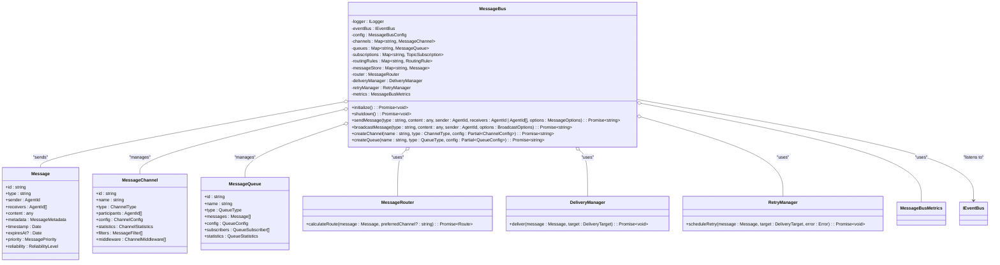
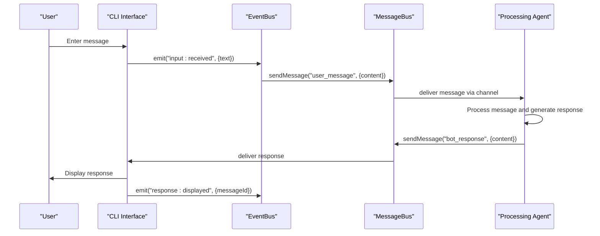

# Interactive Demos

<cite>
**Referenced Files in This Document**   
- [chat-bot-demo.sh](file://examples/03-demos/interactive/chat-bot-demo.sh)
- [event-bus.ts](file://src/core/event-bus.ts)
- [message-bus.ts](file://src/communication/message-bus.ts)
</cite>

## Table of Contents
1. [Interactive Demos Overview](#interactive-demos-overview)
2. [Chat Bot Demo Implementation](#chat-bot-demo-implementation)
3. [Event-Driven Architecture](#event-driven-architecture)
4. [Communication System](#communication-system)
5. [Session and Input Management](#session-and-input-management)
6. [Integration with CLI Features](#integration-with-cli-features)
7. [Common Issues and Troubleshooting](#common-issues-and-troubleshooting)
8. [Customization and Extension](#customization-and-extension)

## Interactive Demos Overview

The Interactive Demos section showcases real-time user engagement through chat-based interfaces. These demos demonstrate the system's ability to create dynamic, responsive applications that support natural conversation flows. The primary focus is on the `chat-bot-demo.sh` script, which serves as a practical example of building an interactive chat bot with customizable behavior and personality traits.

This demo enables users to quickly generate a functional chat bot application with features like conversation history, multiple response modes, and configuration options. It exemplifies how the system can be used to scaffold intelligent agents that interact seamlessly with users through command-line interfaces.

**Section sources**
- [chat-bot-demo.sh](file://examples/03-demos/interactive/chat-bot-demo.sh)

## Chat Bot Demo Implementation

The `chat-bot-demo.sh` script provides a guided experience for creating a personalized chat bot. It begins by collecting user preferences for the bot's specialization domain (e.g., customer support, coding help) and personality (e.g., friendly, professional). These inputs are then used to generate a tailored chat bot application.

```bash
#!/bin/bash
# Interactive Demo - Build a Chat Bot Application

set -e

echo "🤖 Claude Flow Chat Bot Demo"
echo "============================"
echo ""
echo "This demo will create an interactive chat bot application."
echo ""

# Function to show progress
show_progress() {
    echo -e "\n📍 $1"
    sleep 1
}

# Navigate to examples directory
cd "$(dirname "$0")/../.."

# Get user preferences
echo "Let's customize your chat bot!"
echo ""
read -p "What should the bot specialize in? (e.g., 'customer support', 'coding help', 'general chat'): " BOT_TYPE
BOT_TYPE=${BOT_TYPE:-"general chat"}

read -p "What personality should it have? (e.g., 'friendly', 'professional', 'humorous'): " PERSONALITY
PERSONALITY=${PERSONALITY:-"friendly"}

echo ""
show_progress "Creating your $PERSONALITY $BOT_TYPE bot..."

# Create the chat bot
../claude-flow swarm create \
  "Build an interactive chat bot for $BOT_TYPE with a $PERSONALITY personality. Include:
   - Command-line interface
   - Conversation history
   - Multiple response modes
   - Help system
   - Configuration options" \
  --strategy development \
  --name chat-bot-demo \
  --output ./output/chat-bot \
  --monitor
```

The script uses the `claude-flow swarm create` command with a detailed natural language prompt specifying required features. The `--strategy development` flag indicates an agile development approach, while `--monitor` enables real-time monitoring of the creation process. Once generated, users can navigate to the output directory and start the application with standard npm commands.

The resulting chat bot includes several key features:
- Interactive CLI interface for seamless user interaction
- Persistent conversation history to maintain context
- Multiple response modes for varied interaction styles
- Built-in help system for user guidance
- Configuration options for customization

**Section sources**
- [chat-bot-demo.sh](file://examples/03-demos/interactive/chat-bot-demo.sh#L1-L65)

## Event-Driven Architecture

The system employs an event-driven architecture centered around the `EventBus` class, which facilitates real-time communication between components. This architecture enables loose coupling and asynchronous processing, essential for responsive interactive applications.

```mermaid
classDiagram
class IEventBus {
+emit(event : string, data? : unknown) : void
+on(event : string, handler : (data : unknown) => void) : void
+off(event : string, handler : (data : unknown) => void) : void
+once(event : string, handler : (data : unknown) => void) : void
}
class EventBus {
-static instance : EventBus
-typedBus : TypedEventBus
+getInstance(debug? : boolean) : EventBus
+emit(event : string, data? : unknown) : void
+on(event : string, handler : (data : unknown) => void) : void
+off(event : string, handler : (data : unknown) => void) : void
+once(event : string, handler : (data : unknown) => void) : void
+waitFor(event : string, timeoutMs? : number) : Promise~unknown~
+onFiltered(event : string, filter : (data : unknown) => boolean, handler : (data : unknown) => void) : void
}
class TypedEventBus {
-eventCounts : Map~keyof EventMap, number~
-lastEventTimes : Map~keyof EventMap, number~
-debug : boolean
+emit~K~(event : K, data : EventMap~K~) : void
+getEventStats() : { event : string; count : number; lastEmitted : Date | null }[]
+resetStats() : void
}
EventBus ..|> IEventBus
TypedEventBus --|> TypedEventEmitter
EventBus o-- TypedEventBus : "contains"
```

**Diagram sources**
- [event-bus.ts](file://src/core/event-bus.ts#L1-L188)

The `EventBus` implements the singleton pattern through its `getInstance()` method, ensuring a single global instance for system-wide communication. It provides methods for emitting events, registering handlers (`on`), removing handlers (`off`), and registering one-time handlers (`once`). The `waitFor` method allows asynchronous waiting for specific events with optional timeouts, while `onFiltered` enables conditional event handling based on data filters.

Events are typed using the `EventMap` interface and `SystemEvents` enum, providing type safety for known events while allowing custom events. The bus maintains statistics on event frequency and timing, which can be retrieved via `getEventStats()` and reset with `resetStats()`.

This event-driven approach allows the chat bot demo to respond to user inputs, system events, and agent communications in real time, creating a responsive and dynamic user experience.

**Section sources**
- [event-bus.ts](file://src/core/event-bus.ts#L1-L188)

## Communication System

The communication system is built around the `MessageBus` class, which provides advanced messaging capabilities for swarm coordination. This system handles message routing, delivery, and reliability across distributed components.



**Diagram sources**
- [message-bus.ts](file://src/communication/message-bus.ts#L1-L1452)

The `MessageBus` supports multiple communication patterns including direct messaging, broadcasting, multicast, topic-based, and queue-based communication. Messages contain rich metadata including correlation IDs for request-response tracking, TTL (time-to-live) for expiration, and routing information.

Key features of the communication system include:
- **Multiple channel types**: Direct, broadcast, multicast, topic, and queue channels support different communication patterns
- **Reliability levels**: Best-effort, at-least-once, and exactly-once delivery semantics
- **Message filtering**: Rules-based filtering using conditions on message fields
- **Middleware pipeline**: Extensible processing pipeline for message transformation and validation
- **Access control**: Fine-grained permissions for read, write, and administration
- **Persistence**: Optional message persistence with configurable retention periods
- **Metrics and monitoring**: Comprehensive metrics collection for performance analysis

The system integrates with the event bus to respond to agent lifecycle events (`agent:connected`, `agent:disconnected`) and delivery outcomes (`delivery:success`, `delivery:failure`). This integration enables automatic channel management when agents join or leave the system.

For the chat bot demo, this communication infrastructure enables real-time message exchange between the user interface, processing agents, and backend services, ensuring responsive and reliable interactions.

**Section sources**
- [message-bus.ts](file://src/communication/message-bus.ts#L1-L1452)

## Session and Input Management

While the `chat-bot-demo.sh` script itself does not implement session management directly, it generates applications that leverage the underlying system's capabilities for handling user sessions and input/output operations. The generated chat bot applications use the event bus and message bus to manage conversation state and message flow.

Input handling is facilitated through the event-driven architecture, where user inputs trigger events that are processed by appropriate handlers. The system's real-time monitoring feature (enabled by the `--monitor` flag) provides visibility into the message flow and processing stages.

Session management is implicitly handled through the message bus's persistence capabilities and the event bus's state tracking. Conversation history is maintained through persistent message storage, allowing the chat bot to reference previous interactions when generating responses.

The communication system's support for message correlation IDs enables tracking of request-response pairs across multiple interactions, which is essential for maintaining context in extended conversations. Quality of service (QoS) levels ensure reliable message delivery even under network constraints.

Although specific session timeout mechanisms were not found in the analyzed code, the message expiration feature (`expiresAt`) provides a foundation for implementing time-based session management. Messages can be configured with TTL values to automatically expire after a specified duration, which could be leveraged to implement session timeouts in the generated chat bot applications.

**Section sources**
- [event-bus.ts](file://src/core/event-bus.ts#L1-L188)
- [message-bus.ts](file://src/communication/message-bus.ts#L1-L1452)

## Integration with CLI Features

The chat bot demo integrates closely with several CLI features that enhance its functionality and user experience:

### Real-Time Monitoring
The `--monitor` flag activates real-time monitoring, which leverages the event bus to provide live feedback on the bot creation process. This feature emits progress events that are captured and displayed to the user, creating a responsive and transparent experience.

### Concurrent Display
The system supports concurrent display through its message bus architecture, which can handle multiple communication channels simultaneously. This enables features like displaying system status alongside conversation history, or showing multiple response suggestions in parallel.

### Stream Chain Processing
The communication system implements a stream chain pattern through its middleware pipeline and routing rules. Messages flow through a chain of processing stages, where each component can transform, filter, or route the message before it reaches its destination. This enables complex processing workflows while maintaining loose coupling between components.



**Diagram sources**
- [event-bus.ts](file://src/core/event-bus.ts#L1-L188)
- [message-bus.ts](file://src/communication/message-bus.ts#L1-L1452)

This integration creates a cohesive user experience where the CLI serves as both an input mechanism and a real-time monitoring dashboard, while the underlying messaging infrastructure handles the complex routing and processing required for intelligent conversation management.

**Section sources**
- [event-bus.ts](file://src/core/event-bus.ts#L1-L188)
- [message-bus.ts](file://src/communication/message-bus.ts#L1-L1452)

## Common Issues and Troubleshooting

Based on the system architecture, several potential issues may arise in the chat bot demo, along with their mitigation strategies:

### Input Latency
Input latency can occur due to processing bottlenecks or network delays in distributed deployments. The system addresses this through:
- Asynchronous event processing to prevent UI blocking
- Configurable message priorities to ensure timely handling of user inputs
- Performance monitoring to identify and resolve bottlenecks

To minimize latency, ensure that processing agents are responsive and that the system is not overloaded. The real-time monitoring feature can help identify performance issues during development.

### Session Timeouts
While explicit session timeout handling was not found in the code, conversation state could be lost if the application terminates unexpectedly. Mitigation strategies include:
- Enabling message persistence to survive application restarts
- Implementing periodic state saving to durable storage
- Using the message bus's retention policies to preserve recent conversation history

### Message Parsing Errors
Message parsing errors can occur when malformed data is transmitted between components. The system provides several safeguards:
- Message validation in the `validateMessage` method checks size limits and expiration
- Type-safe event handling reduces the risk of data type mismatches
- Error handling in the delivery manager with retry capabilities

When extending the demo, ensure that all message content is properly serialized and that error handlers are implemented to gracefully handle parsing failures.

### Common Troubleshooting Steps
1. Check event bus statistics using `getEventStats()` to identify processing bottlenecks
2. Verify message bus configuration, particularly persistence and reliability settings
3. Monitor system logs for error messages related to message delivery or event handling
4. Use the `waitFor` method with appropriate timeouts when expecting responses
5. Validate that all required agents are connected and responsive

**Section sources**
- [event-bus.ts](file://src/core/event-bus.ts#L1-L188)
- [message-bus.ts](file://src/communication/message-bus.ts#L1-L1452)

## Customization and Extension

The chat bot demo can be customized and extended in several ways to support different conversation flows and enhanced capabilities:

### Custom Conversation Flows
The demo can be modified to support specific conversation patterns by:
- Extending the initial prompt with domain-specific requirements
- Adding custom message types for specialized interactions
- Implementing state machines to manage conversation progression
- Creating specialized response templates for different scenarios

For example, a customer support bot could include flows for issue categorization, escalation procedures, and satisfaction surveys.

### Natural Language Processing Integration
The system can be extended with NLP capabilities by:
- Adding NLP middleware to the message bus for intent recognition and entity extraction
- Integrating with external NLP services through custom agents
- Implementing sentiment analysis to adapt response tone
- Adding language translation capabilities for multilingual support

```typescript
// Example NLP middleware
const nlpMiddleware: ChannelMiddleware = {
  id: "nlp-processor",
  name: "NLP Processor",
  enabled: true,
  order: 10,
  process: async (message: Message, context: MiddlewareContext) => {
    if (message.type === "user_message") {
      // Call NLP service to analyze intent and entities
      const nlpResult = await callNLPService(message.content.text);
      
      // Enhance message with NLP insights
      message.content.intent = nlpResult.intent;
      message.content.entities = nlpResult.entities;
      message.content.sentiment = nlpResult.sentiment;
      
      // Add routing hint based on intent
      message.metadata.route = [nlpResult.intent, ...message.metadata.route];
    }
    return message;
  }
};
```

### Additional Extension Points
- **Custom channels**: Create specialized communication channels for different conversation modes
- **Response generators**: Implement multiple response strategies (e.g., creative, factual, concise)
- **Memory augmentation**: Enhance the bot's knowledge base with external data sources
- **Multimodal support**: Extend beyond text to handle voice, images, or other media types
- **Analytics integration**: Add usage tracking and performance metrics collection

These extensions leverage the system's modular architecture, allowing new capabilities to be added without modifying core components.

**Section sources**
- [chat-bot-demo.sh](file://examples/03-demos/interactive/chat-bot-demo.sh#L1-L65)
- [event-bus.ts](file://src/core/event-bus.ts#L1-L188)
- [message-bus.ts](file://src/communication/message-bus.ts#L1-L1452)