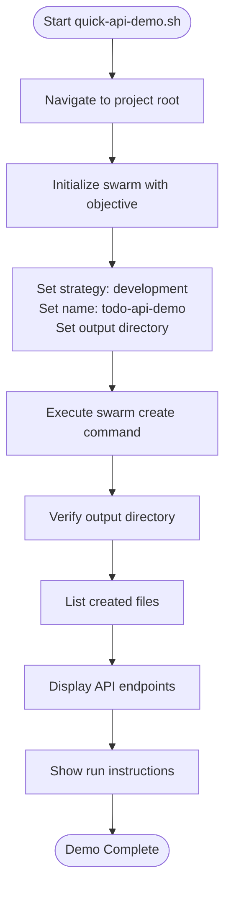
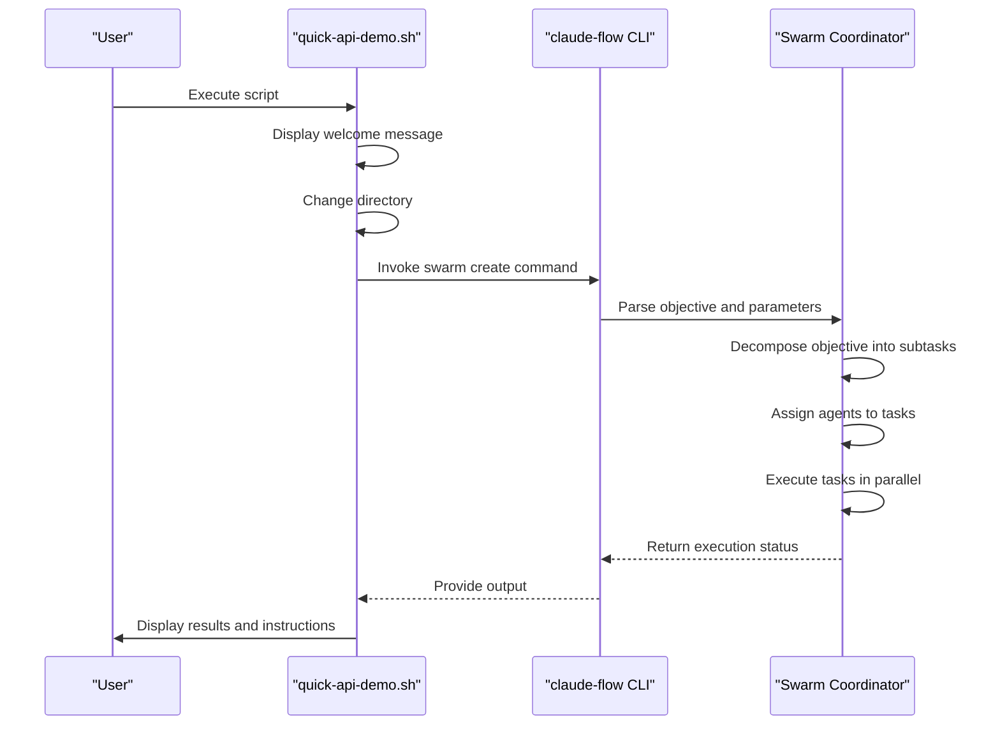
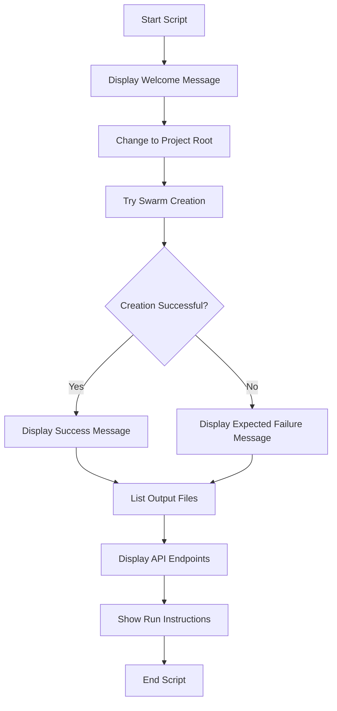
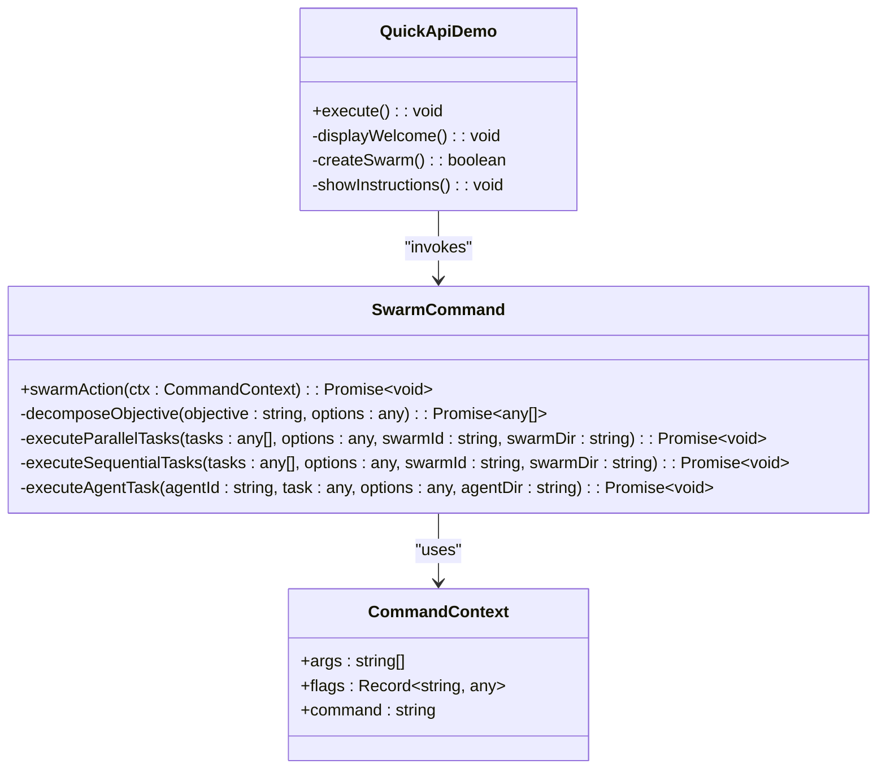
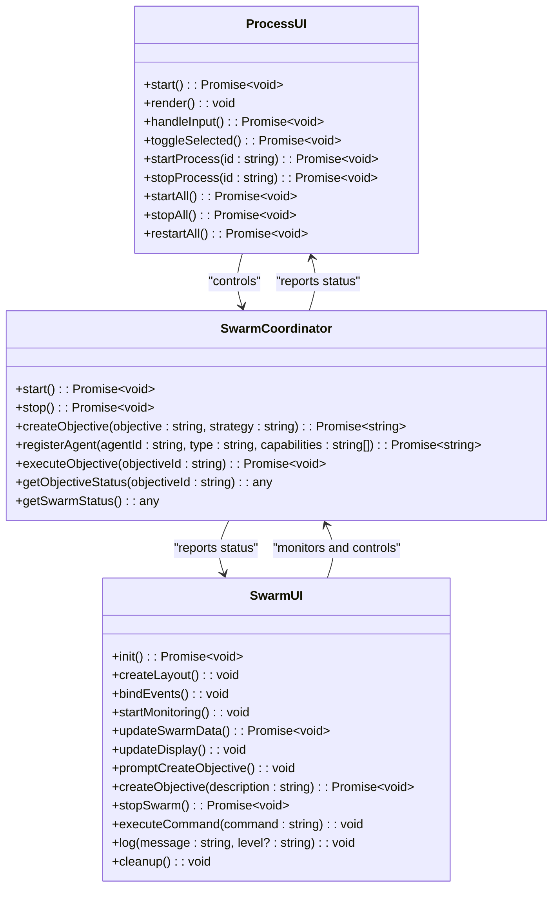
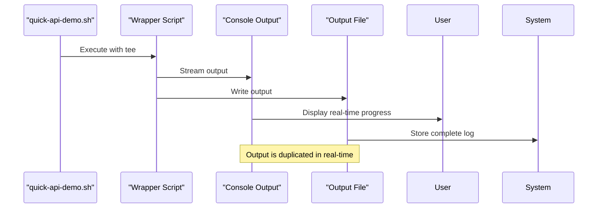
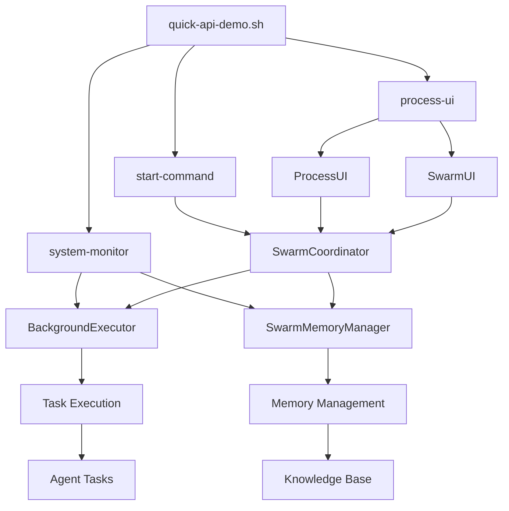

# Quick Demos

<cite>
**Referenced Files in This Document**   
- [quick-api-demo.sh](file://examples/03-demos/quick/quick-api-demo.sh)
- [swarm.ts](file://src/cli/commands/swarm.ts)
- [process-ui.js](file://src/cli/simple-commands/process-ui.js)
- [swarm-ui.js](file://src/cli/simple-commands/swarm-ui.js)
- [rest-api-demo.sh](file://examples/03-demos/rest-api-demo.sh)
- [swarm-showcase.sh](file://examples/03-demos/swarm-showcase.sh)
- [README.md](file://examples/03-demos/README.md)
</cite>

## Table of Contents
1. [Quick Demos Overview](#quick-demos-overview)
2. [Quick API Demo Implementation](#quick-api-demo-implementation)
3. [Command-Line Invocation Pattern](#command-line-invocation-pattern)
4. [Environment Setup Requirements](#environment-setup-requirements)
5. [Execution Flow Analysis](#execution-flow-analysis)
6. [CLI Command Registry Integration](#cli-command-registry-integration)
7. [Process Management System](#process-management-system)
8. [Real-Time Output Features](#real-time-output-features)
9. [Component Relationships](#component-relationships)
10. [Common Issues and Solutions](#common-issues-and-solutions)
11. [Customization and Extension](#customization-and-extension)

## Quick Demos Overview

The Quick Demos section demonstrates rapid implementation of API-based workflows using Claude-Flow, showcasing the system's ability to create functional applications in under two minutes. These demos serve as practical introductions to the swarm-based development paradigm, illustrating how multiple AI agents can coordinate to accomplish complex software development tasks through parallel execution and specialized roles.

The demo scripts are organized into categories based on their purpose and complexity, with the quick-api-demo.sh representing the fastest implementation path for API creation. These demonstrations highlight the system's capability to decompose objectives, assign specialized agents, execute tasks in parallel, and produce production-ready applications with comprehensive testing and documentation.

**Section sources**
- [README.md](file://examples/03-demos/README.md)

## Quick API Demo Implementation

The quick-api-demo.sh script provides a streamlined demonstration of creating a TODO API using Claude-Flow's swarm capabilities. This implementation showcases the core functionality of the system by initializing a swarm to build a complete REST API with standard CRUD operations in under two minutes.

The script begins by navigating to the project root directory and then invokes the swarm create command with specific parameters including the development strategy, output directory, and verbose logging. The objective is clearly defined as building a TODO API with GET, POST, PUT, and DELETE endpoints, which the swarm system decomposes into subtasks for specialized agents to execute.

Upon successful execution, the script displays the created files and provides instructions for running the API, including the necessary npm commands for installation and startup. The API endpoints are clearly documented, showing the complete interface for managing TODO items through standard HTTP methods.

**Diagram sources**
- [quick-api-demo.sh](file://examples/03-demos/quick/quick-api-demo.sh)

**Section sources**
- [quick-api-demo.sh](file://examples/03-demos/quick/quick-api-demo.sh)

## Command-Line Invocation Pattern

The quick-api-demo.sh script follows a standardized command-line invocation pattern that demonstrates the proper usage of Claude-Flow's CLI interface. The pattern begins with navigating to the appropriate directory context, then executing the claude-flow command with the swarm subcommand and specific parameters.

The primary command structure is: `../claude-flow swarm create "Build a TODO API with GET, POST, PUT, DELETE endpoints"` followed by various flags that configure the swarm behavior. Key parameters include:
- `--strategy development`: Specifies the development strategy for building complete applications
- `--name todo-api-demo`: Assigns a descriptive name to the swarm instance
- `--output ./output/todo-api`: Defines the output directory for generated files
- `--verbose`: Enables detailed logging of the execution process

This invocation pattern demonstrates the declarative approach to software development, where users specify the desired outcome rather than the implementation details. The system then handles task decomposition, agent assignment, and execution coordination automatically.

**Diagram sources**
- [quick-api-demo.sh](file://examples/03-demos/quick/quick-api-demo.sh)
- [swarm.ts](file://src/cli/commands/swarm.ts)

**Section sources**
- [quick-api-demo.sh](file://examples/03-demos/quick/quick-api-demo.sh)

## Environment Setup Requirements

The quick-api-demo.sh script has specific environment setup requirements that must be met for successful execution. These requirements ensure that the necessary tools and dependencies are available for both the demo script and the generated API application.

The primary requirements include:
- **Node.js and npm**: Required for running the Claude-Flow CLI and the generated API application
- **Claude-Flow installation**: The main executable must be available in the project directory
- **Write permissions**: The script needs permission to create directories and files in the output location
- **Bash shell**: The script is written in Bash and requires a compatible shell environment

For the generated API application, additional dependencies are automatically included in the package.json file, primarily Express.js for the server framework. Users must run `npm install` in the output directory to install these dependencies before starting the API.

The script includes error handling to detect when the swarm creation fails, providing appropriate feedback that this is expected in the example environment but would succeed in a real environment with the proper setup.

**Section sources**
- [quick-api-demo.sh](file://examples/03-demos/quick/quick-api-demo.sh)

## Execution Flow Analysis

The execution flow of the quick-api-demo.sh script follows a well-defined sequence of operations that demonstrate the swarm-based development process. The flow begins with initialization and progresses through swarm creation, output verification, and final instructions.

The script starts by displaying a welcome message and changing to the project root directory to ensure proper context for the claude-flow command. It then attempts to create a swarm with the specified objective and parameters. If successful, it displays a success message and lists the files in the output directory. If the creation fails (which is expected in the example environment), it provides explanatory feedback.

After the swarm operation, the script displays the API endpoints and provides instructions for running the application. This includes the commands to change to the output directory, install dependencies with npm install, and start the server with npm start.

The execution flow is designed to be linear and predictable, making it easy for users to understand the process and expected outcomes. The script handles both success and failure scenarios gracefully, providing appropriate feedback in each case.

**Diagram sources**
- [quick-api-demo.sh](file://examples/03-demos/quick/quick-api-demo.sh)

**Section sources**
- [quick-api-demo.sh](file://examples/03-demos/quick/quick-api-demo.sh)

## CLI Command Registry Integration

The quick-api-demo.sh script leverages the CLI command registry through the swarm create command, which is implemented in the src/cli/commands/swarm.ts file. This integration demonstrates how the script interacts with the underlying command system to initiate complex operations with simple declarative syntax.

The command registry provides a structured interface for accessing the swarm functionality, with the create command being one of several available operations. When the script invokes the swarm create command, the CLI framework routes the request to the appropriate handler function, passing along the objective and any specified flags.

The swarm command implementation includes comprehensive help documentation that is displayed when the --help flag is used, showing all available options and their descriptions. This includes parameters for strategy selection, agent limits, timeout settings, and various execution modes.

The integration between the shell script and the CLI command registry enables a clean separation of concerns, where the script handles the user interface and workflow orchestration, while the command implementation manages the complex logic of swarm coordination and task execution.

**Diagram sources**
- [quick-api-demo.sh](file://examples/03-demos/quick/quick-api-demo.sh)
- [swarm.ts](file://src/cli/commands/swarm.ts)

**Section sources**
- [swarm.ts](file://src/cli/commands/swarm.ts)

## Process Management System

The process management system in Claude-Flow, demonstrated through the quick-api-demo.sh script, provides robust control over swarm execution and monitoring. This system is implemented through the ProcessUI class in process-ui.js and the SwarmUI class in swarm-ui.js, offering both simple and enhanced interfaces for managing swarm operations.

The ProcessUI class provides a basic terminal interface for managing system processes, including the event bus, orchestrator, memory manager, and other core components. It supports operations like starting, stopping, and restarting processes, with visual indicators for process status.

The SwarmUI class offers a more sophisticated interface using the blessed library for enhanced terminal UI capabilities. It provides real-time monitoring of swarm activities, including objectives, agents, tasks, and system logs. The interface includes interactive controls for creating new objectives, stopping swarms, and executing commands.

Both interfaces demonstrate the system's ability to manage complex multi-agent workflows through intuitive user interfaces, allowing users to monitor progress and intervene when necessary. The quick-api-demo.sh script leverages these capabilities through the --monitor and --ui flags to provide real-time feedback during execution.

**Diagram sources**
- [process-ui.js](file://src/cli/simple-commands/process-ui.js)
- [swarm-ui.js](file://src/cli/simple-commands/swarm-ui.js)
- [swarm.ts](file://src/cli/commands/swarm.ts)

**Section sources**
- [process-ui.js](file://src/cli/simple-commands/process-ui.js)
- [swarm-ui.js](file://src/cli/simple-commands/swarm-ui.js)

## Real-Time Output Features

The quick-api-demo.sh script and its underlying system components incorporate real-time output features that provide immediate feedback during execution. These features are critical for monitoring progress and understanding the swarm's activities as they occur.

The script itself provides real-time feedback through its console output, displaying status messages for each major step in the process. This includes messages for initializing the swarm, creating the API, and providing final instructions. The use of emojis and clear formatting enhances readability and user engagement.

At the system level, the real-time output is implemented through the wrapper script created in the executeAgentTask function, which uses the tee command to simultaneously display output to the console and save it to a file. This allows users to see progress as it happens while also preserving a complete record for later analysis.

The enhanced SwarmUI interface takes real-time output further with a dedicated activity log panel that displays timestamped messages from all swarm activities. This log includes information about objective creation, agent registration, task execution, and system events, providing a comprehensive view of the entire process.

**Diagram sources**
- [quick-api-demo.sh](file://examples/03-demos/quick/quick-api-demo.sh)
- [swarm.ts](file://src/cli/commands/swarm.ts)

**Section sources**
- [swarm.ts](file://src/cli/commands/swarm.ts)

## Component Relationships

The quick-api-demo.sh script interacts with several core components of the Claude-Flow system, forming a cohesive architecture for swarm-based development. These components work together to enable the rapid creation of APIs and other applications through coordinated multi-agent execution.

The primary components include:
- **start-command**: Initializes the swarm process and sets up the execution environment
- **process-ui**: Provides the user interface for monitoring and controlling swarm operations
- **system-monitor**: Tracks the status and performance of swarm activities in real-time

The relationship between these components follows a hierarchical pattern, with the start-command serving as the entry point that orchestrates the overall process. The process-ui component provides the interface through which users can interact with the system, while the system-monitor component ensures that all activities are properly tracked and reported.

The quick-api-demo.sh script acts as a high-level orchestrator, combining these components to create a seamless user experience. It leverages the CLI command registry to access the swarm functionality, utilizes the process management system for execution control, and incorporates real-time output features for progress monitoring.

**Diagram sources**
- [quick-api-demo.sh](file://examples/03-demos/quick/quick-api-demo.sh)
- [swarm.ts](file://src/cli/commands/swarm.ts)
- [process-ui.js](file://src/cli/simple-commands/process-ui.js)

**Section sources**
- [swarm.ts](file://src/cli/commands/swarm.ts)
- [process-ui.js](file://src/cli/simple-commands/process-ui.js)

## Common Issues and Solutions

When using the quick-api-demo.sh script, several common issues may arise that users should be aware of and know how to address. These issues typically relate to missing dependencies, configuration problems, or environmental constraints.

**Missing Dependencies**: The most common issue is missing Node.js or npm, which are required for both the Claude-Flow CLI and the generated API application. Solution: Install Node.js from the official website and verify the installation with `node --version` and `npm --version`.

**API Endpoint Configuration**: Users may encounter issues with the default port configuration or endpoint paths. Solution: Modify the generated server.js file to change the port or adjust the endpoint routes as needed.

**Response Handling**: The generated API may not handle all edge cases or error conditions. Solution: Extend the error handling middleware in server.js to include additional validation and error responses.

**Permission Issues**: The script may fail to create directories or files due to permission constraints. Solution: Ensure the user has write permissions in the project directory or run the script with appropriate privileges.

**Network Issues**: When using web search or research tools, network connectivity problems may occur. Solution: Verify internet connection and check firewall settings that might block external requests.

The script itself includes error handling for the expected case where the swarm creation fails in the example environment, providing clear feedback that this is normal behavior for the demonstration.

**Section sources**
- [quick-api-demo.sh](file://examples/03-demos/quick/quick-api-demo.sh)

## Customization and Extension

The quick-api-demo.sh script can be customized and extended for different API scenarios and enhanced functionality. These modifications allow users to adapt the demo to their specific needs and incorporate additional validation steps.

**Custom API Scenarios**: To create different types of APIs, modify the objective string in the swarm create command. For example, changing "Build a TODO API" to "Build a user management API" will generate endpoints appropriate for user data management.

**Additional Validation Steps**: Extend the script to include automated testing by adding commands to run the generated test suite. This can be done by appending `npm test` to the execution flow after the API is created.

**Strategy Customization**: Experiment with different strategies such as 'research', 'analysis', or 'auto' to see how the swarm approaches the same objective with different methodologies.

**Output Customization**: Modify the output directory or naming convention to organize generated APIs according to project requirements.

**Integration with Other Tools**: Combine the quick-api-demo.sh script with other development tools and workflows, such as CI/CD pipelines or documentation generators, to create more comprehensive development processes.

The modular design of the script and its integration with the broader Claude-Flow ecosystem make it highly adaptable for various use cases and development workflows.

**Section sources**
- [quick-api-demo.sh](file://examples/03-demos/quick/quick-api-demo.sh)
- [rest-api-demo.sh](file://examples/03-demos/rest-api-demo.sh)
- [swarm-showcase.sh](file://examples/03-demos/swarm-showcase.sh)