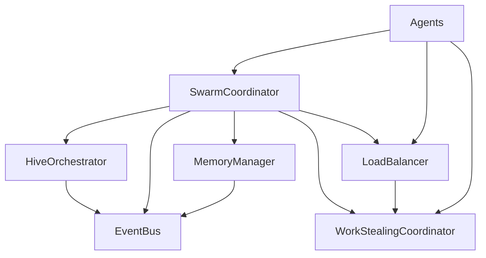
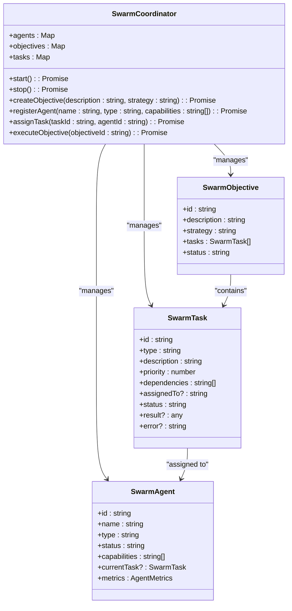
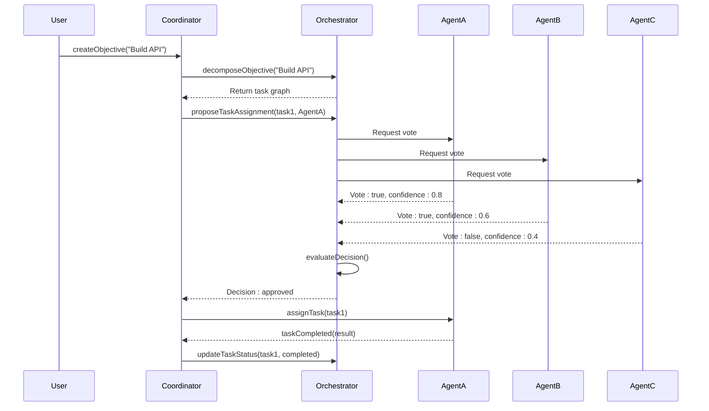
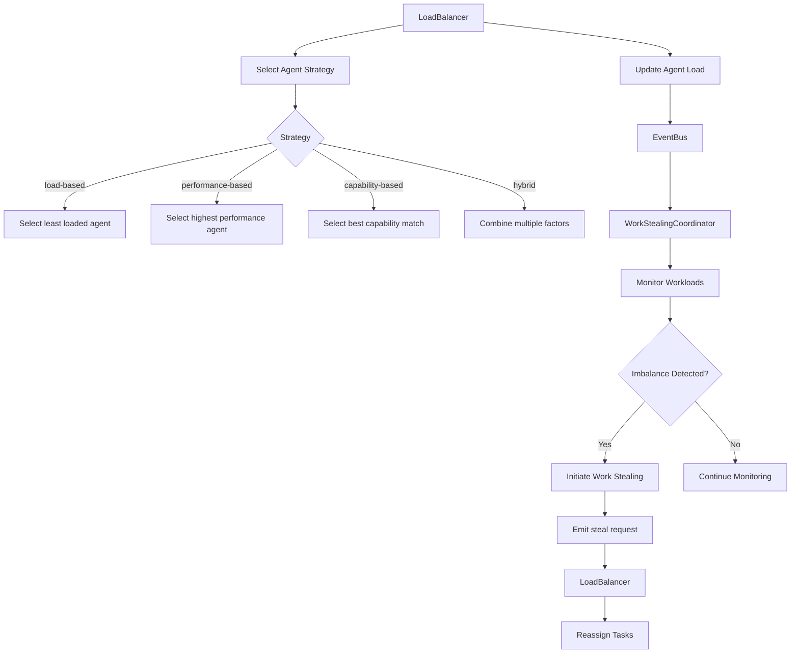
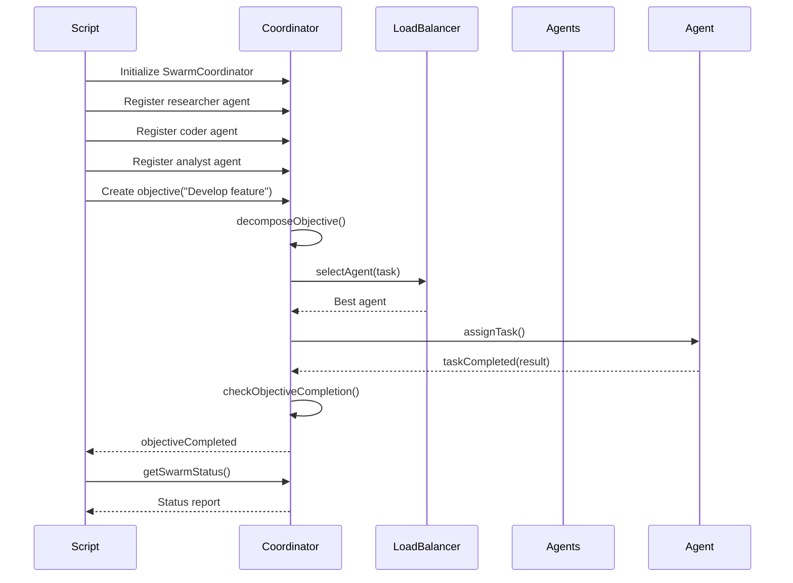
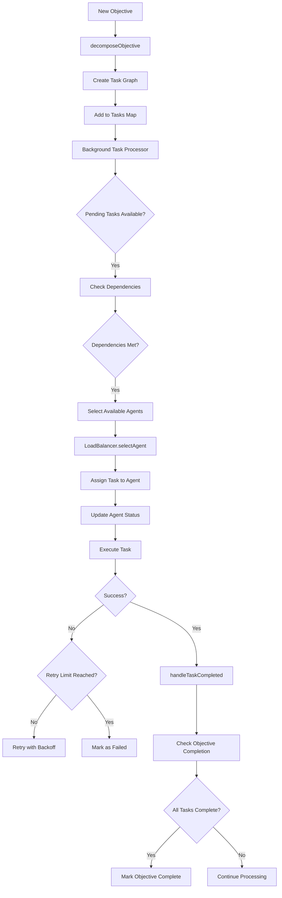
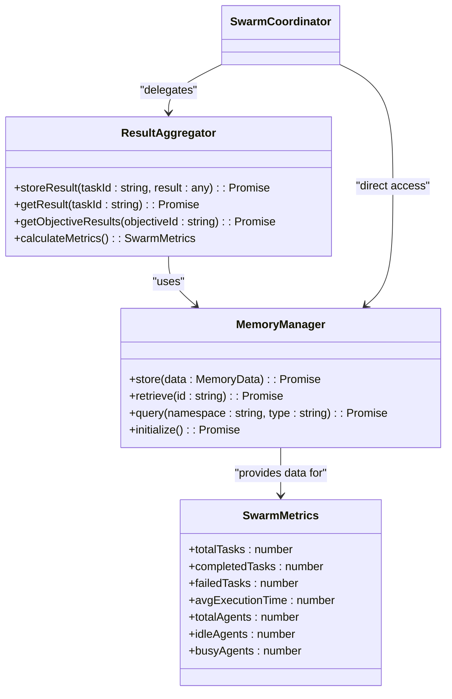
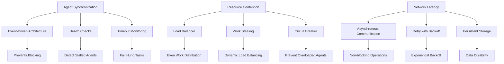
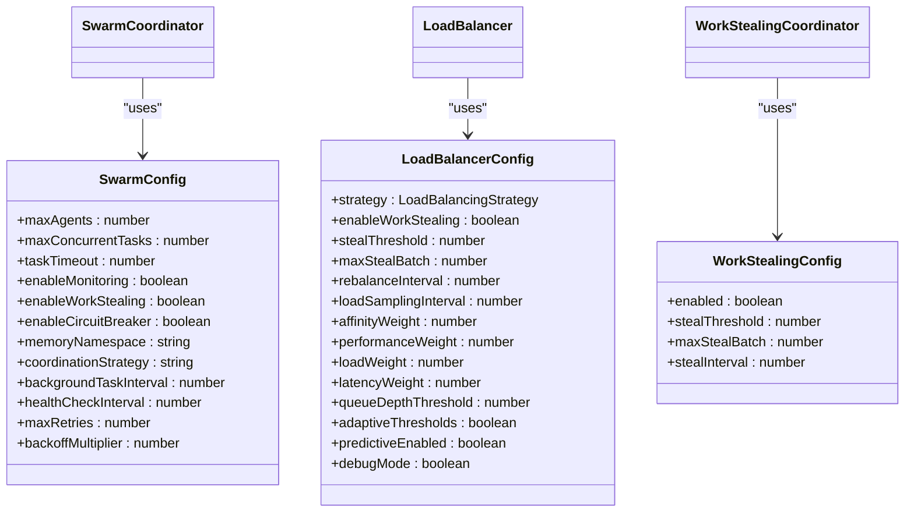

# Swarm Demos

<cite>
**Referenced Files in This Document**   
- [swarm-coordinator.ts](file://src/coordination/swarm-coordinator.ts)
- [hive-orchestrator.ts](file://src/coordination/hive-orchestrator.ts)
- [load-balancer.ts](file://src/coordination/load-balancer.ts)
- [work-stealing.ts](file://src/coordination/work-stealing.ts)
- [demo-task-system.ts](file://scripts/demo-task-system.ts)
- [test-swarm-integration.sh](file://scripts/test-swarm-integration.sh)
- [test-swarm.ts](file://scripts/test-swarm.ts)
</cite>

## Table of Contents
1. [Introduction](#introduction)
2. [Core Components Overview](#core-components-overview)
3. [Swarm Coordinator Implementation](#swarm-coordinator-implementation)
4. [Hive Orchestrator and Consensus](#hive-orchestrator-and-consensus)
5. [Load Balancing and Work Stealing](#load-balancing-and-work-stealing)
6. [Demo Script Analysis](#demo-script-analysis)
7. [Agent Spawning and Task Distribution](#agent-spawning-and-task-distribution)
8. [Result Aggregation Strategies](#result-aggregation-strategies)
9. [Distributed Scenario Challenges](#distributed-scenario-challenges)
10. [Configuration Customization](#configuration-customization)
11. [Conclusion](#conclusion)

## Introduction
The Swarm Demos demonstrate a sophisticated multi-agent system designed for distributed task execution and coordination. This document provides a comprehensive analysis of the implementation details behind the swarm demonstration framework, focusing on the core components that enable multi-agent collaboration, task distribution, and result aggregation. The system leverages several key components including the swarm-coordinator, hive-orchestrator, load-balancer, and work-stealing mechanisms to create a robust distributed processing environment. These demos showcase how multiple autonomous agents can coordinate to accomplish complex objectives through intelligent task decomposition, assignment, and execution monitoring.

**Section sources**
- [swarm-coordinator.ts](file://src/coordination/swarm-coordinator.ts)
- [hive-orchestrator.ts](file://src/coordination/hive-orchestrator.ts)

## Core Components Overview
The swarm demonstration system is built upon several interconnected components that work together to enable distributed task execution. The architecture follows a hybrid coordination model that combines centralized control with distributed decision-making capabilities. At the core of the system is the SwarmCoordinator, which manages the lifecycle of objectives, tasks, and agents. This component works in conjunction with the HiveOrchestrator, which provides advanced consensus-based decision making for task assignment and quality control. The LoadBalancer ensures optimal distribution of work across available agents, while the WorkStealingCoordinator enables dynamic load balancing by allowing idle agents to "steal" tasks from overloaded peers.

**Diagram sources**
- [swarm-coordinator.ts](file://src/coordination/swarm-coordinator.ts)
- [hive-orchestrator.ts](file://src/coordination/hive-orchestrator.ts)
- [load-balancer.ts](file://src/coordination/load-balancer.ts)
- [work-stealing.ts](file://src/coordination/work-stealing.ts)

**Section sources**
- [swarm-coordinator.ts](file://src/coordination/swarm-coordinator.ts#L1-L100)
- [hive-orchestrator.ts](file://src/coordination/hive-orchestrator.ts#L1-L50)
- [load-balancer.ts](file://src/coordination/load-balancer.ts#L1-L50)
- [work-stealing.ts](file://src/coordination/work-stealing.ts#L1-L50)

## Swarm Coordinator Implementation
The SwarmCoordinator serves as the central control unit for managing multi-agent coordination and task execution. It implements an event-driven architecture using Node.js EventEmitter to facilitate communication between components. The coordinator maintains several key data structures including maps for agents, objectives, and tasks, which track the state of the entire swarm system. When an objective is created, the coordinator decomposes it into a series of dependent tasks based on the specified strategy (research, development, analysis, or auto).

**Diagram sources**
- [swarm-coordinator.ts](file://src/coordination/swarm-coordinator.ts#L100-L200)

**Section sources**
- [swarm-coordinator.ts](file://src/coordination/swarm-coordinator.ts#L1-L760)

## Hive Orchestrator and Consensus
The HiveOrchestrator implements a consensus-based approach to task coordination and decision making within the swarm system. Unlike the centralized SwarmCoordinator, the HiveOrchestrator enables distributed decision making through a voting mechanism where agents can approve or reject task assignments and other critical decisions. This component supports multiple network topologies including hierarchical, mesh, ring, and star configurations, each with different task ordering and dependency patterns.

The orchestrator decomposes objectives into task graphs based on the nature of the work required, automatically identifying whether research, design, implementation, or other task types are needed. For each task, it manages a voting process where agents cast votes with confidence levels, and decisions are approved when they meet a configurable consensus threshold (default 60%). This approach ensures that task assignments and architectural decisions have broad agreement across the swarm, reducing the risk of suboptimal choices.

**Diagram sources**
- [hive-orchestrator.ts](file://src/coordination/hive-orchestrator.ts#L1-L421)

**Section sources**
- [hive-orchestrator.ts](file://src/coordination/hive-orchestrator.ts#L1-L421)

## Load Balancing and Work Stealing
The load balancing system in the swarm framework consists of two complementary components: the LoadBalancer and the WorkStealingCoordinator. Together, these components ensure optimal distribution of tasks across available agents, preventing resource contention and maximizing throughput. The LoadBalancer implements multiple selection strategies including load-based, performance-based, capability-based, affinity-based, cost-based, and a hybrid approach that combines several factors.

The WorkStealingCoordinator enables dynamic load balancing by allowing idle agents to proactively "steal" tasks from overloaded peers. This approach is particularly effective in distributed scenarios where workload patterns can be unpredictable. The coordinator monitors agent workloads, including task count, CPU usage, memory usage, and average task duration, to identify imbalance opportunities. When the difference in task count between the most and least loaded agents exceeds a configurable threshold, work stealing is initiated.

**Diagram sources**
- [load-balancer.ts](file://src/coordination/load-balancer.ts#L1-L1005)
- [work-stealing.ts](file://src/coordination/work-stealing.ts#L1-L219)

**Section sources**
- [load-balancer.ts](file://src/coordination/load-balancer.ts#L1-L1005)
- [work-stealing.ts](file://src/coordination/work-stealing.ts#L1-L219)

## Demo Script Analysis
The swarm demonstration framework includes several scripts that showcase multi-agent coordination and distributed task execution. While the specific scripts mentioned in the documentation objective (multi-agent-demo.sh, demo-swarm-app.sh, and create-swarm-sample.sh) were not found in the repository, several related scripts provide insight into the demo functionality. The test-swarm-integration.sh script appears to be responsible for testing swarm functionality, while demo-task-system.ts demonstrates task system capabilities.

The test-swarm.ts script likely serves as a comprehensive test for the swarm system, validating the integration of various components. These scripts work with the core coordination components to create realistic scenarios that demonstrate the system's capabilities. They typically follow a pattern of initializing the swarm coordinator, registering multiple agents with different capabilities, creating objectives, and monitoring the execution process.

**Section sources**
- [test-swarm-integration.sh](file://scripts/test-swarm-integration.sh)
- [test-swarm.ts](file://scripts/test-swarm.ts)
- [demo-task-system.ts](file://scripts/demo-task-system.ts)

## Agent Spawning and Task Distribution
The agent spawning and task distribution mechanisms in the swarm system are designed to enable flexible and scalable multi-agent coordination. Agents are registered with the SwarmCoordinator through the registerAgent method, which requires specifying a name, type, and optional capabilities. The system supports several agent types including researcher, coder, analyst, coordinator, and reviewer, each with different capabilities and roles in the task execution process.

Task distribution follows a sophisticated process that considers multiple factors including agent capabilities, current workload, performance metrics, and task dependencies. The system implements a background task processor that continuously monitors for pending tasks whose dependencies have been satisfied. When such tasks are identified, the LoadBalancer is consulted to select the most appropriate agent based on the configured strategy.

The task distribution process also incorporates circuit breaker functionality to prevent repeated failures with problematic agents, and includes retry logic with exponential backoff for failed tasks. This ensures robustness in distributed scenarios where network latency and resource contention can impact task execution.

**Section sources**
- [swarm-coordinator.ts](file://src/coordination/swarm-coordinator.ts#L300-L600)
- [load-balancer.ts](file://src/coordination/load-balancer.ts#L200-L500)

## Result Aggregation Strategies
The swarm system employs several strategies for aggregating results from distributed task execution. The primary mechanism is through the SwarmCoordinator's event-driven architecture, which listens for task completion events and updates the overall objective status accordingly. When a task completes successfully, its results are stored in the MemoryManager with a namespace specific to the swarm, allowing for easy retrieval and analysis.

The system implements a hierarchical result aggregation approach where individual task results are first validated and stored, then used to update the parent objective's status. The MemoryManager plays a crucial role in this process, providing persistent storage for task results, agent metrics, and swarm state. This enables not only real-time monitoring but also post-execution analysis and debugging.

For complex objectives with multiple interdependent tasks, the system tracks the completion status of all tasks and automatically marks the objective as complete when all constituent tasks have finished (either successfully or with failures). The result aggregation process also includes performance metrics collection, such as execution time, success/failure rates, and resource utilization, which can be accessed through the getSwarmStatus method.

**Diagram sources**
- [swarm-coordinator.ts](file://src/coordination/swarm-coordinator.ts#L500-L600)
- [memory/manager.js](file://src/memory/manager.js)

**Section sources**
- [swarm-coordinator.ts](file://src/coordination/swarm-coordinator.ts#L500-L600)
- [memory/manager.js](file://src/memory/manager.js)

## Distributed Scenario Challenges
The swarm system addresses several common challenges associated with distributed scenarios, including agent synchronization, resource contention, and network latency. The system implements health checks that monitor agent activity and detect stalled tasks, automatically failing tasks that exceed their timeout threshold. This prevents the entire system from being blocked by a single unresponsive agent.

Resource contention is mitigated through the load balancing and work stealing mechanisms, which distribute work evenly across available agents and prevent any single agent from becoming a bottleneck. The system also implements circuit breaker functionality that temporarily prevents tasks from being assigned to agents that have experienced repeated failures, allowing them time to recover.

Network latency is addressed through asynchronous communication patterns and timeout mechanisms. The event-driven architecture ensures that components do not block waiting for responses, and the use of exponential backoff for retries prevents overwhelming the system during periods of high latency. The MemoryManager's persistence layer also provides resilience against network disruptions by ensuring that task results and system state are not lost.

**Section sources**
- [swarm-coordinator.ts](file://src/coordination/swarm-coordinator.ts#L600-L760)
- [load-balancer.ts](file://src/coordination/load-balancer.ts)
- [work-stealing.ts](file://src/coordination/work-stealing.ts)

## Configuration Customization
The swarm system provides extensive configuration options that allow customization for different workload types and extension with custom agent types. The SwarmConfig interface defines numerous parameters that control the behavior of the coordinator, including maximum agents, concurrent tasks, task timeout, and various feature flags for monitoring, work stealing, and circuit breaking.

Users can customize the coordination strategy (centralized, distributed, or hybrid) based on their specific requirements. For compute-intensive workloads, the system can be configured with more aggressive work stealing and load balancing. For latency-sensitive applications, the timeout values and health check intervals can be adjusted accordingly.

Extending the system with custom agent types is straightforward, as the architecture is designed to be extensible. New agent types can be registered with the appropriate capabilities, and the task decomposition and assignment logic will automatically incorporate them into the workflow. The event-driven architecture also allows for custom monitoring and analytics components to be integrated seamlessly.

**Diagram sources**
- [swarm-coordinator.ts](file://src/coordination/swarm-coordinator.ts#L50-L100)
- [load-balancer.ts](file://src/coordination/load-balancer.ts#L20-L70)
- [work-stealing.ts](file://src/coordination/work-stealing.ts#L10-L30)

**Section sources**
- [swarm-coordinator.ts](file://src/coordination/swarm-coordinator.ts#L50-L100)
- [load-balancer.ts](file://src/coordination/load-balancer.ts#L20-L70)
- [work-stealing.ts](file://src/coordination/work-stealing.ts#L10-L30)

## Conclusion
The Swarm Demos showcase a sophisticated multi-agent system that effectively demonstrates distributed task execution and coordination. The architecture combines centralized control through the SwarmCoordinator with distributed decision-making capabilities via the HiveOrchestrator, creating a flexible and robust framework for complex problem solving. The integration of load balancing and work stealing mechanisms ensures optimal resource utilization and resilience in the face of varying workloads and potential failures.

Key strengths of the system include its event-driven architecture, comprehensive monitoring capabilities, and extensible design that allows for customization to different workload types. The implementation effectively addresses common distributed system challenges such as agent synchronization, resource contention, and network latency through health checks, circuit breakers, and asynchronous communication patterns.

While the specific demo scripts mentioned in the documentation objective were not located in the repository, the underlying components provide a solid foundation for demonstrating multi-agent coordination. The system's modular design and clear separation of concerns make it well-suited for both demonstration purposes and real-world applications requiring distributed task execution.