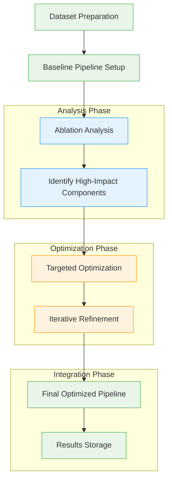
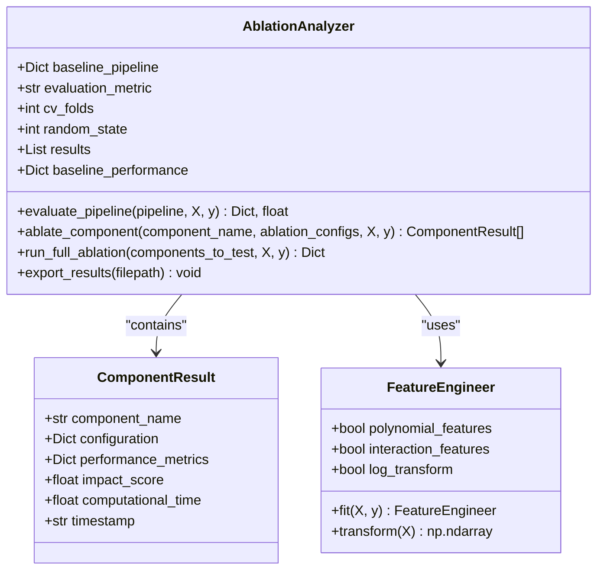
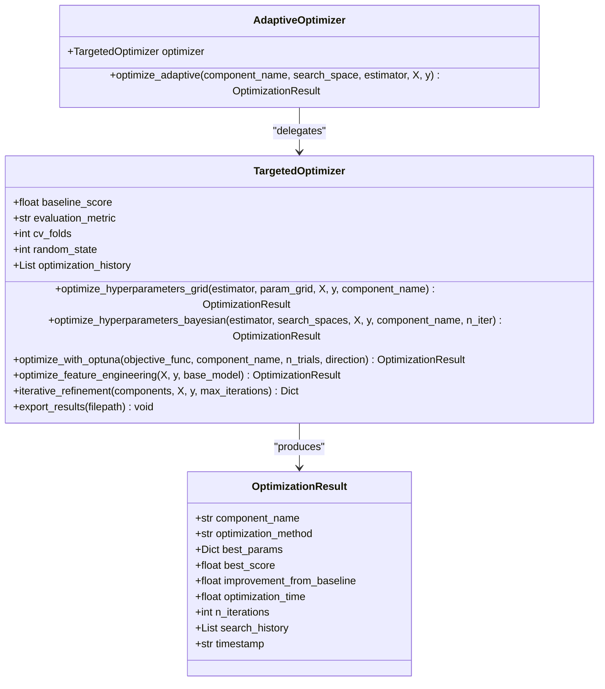

# Code Refinement Agents

<cite>
**Referenced Files in This Document**   
- [refinement_demo.py](file://examples/refinement_agent_workdir/refinement_demo.py#L0-L345)
- [ablation_framework.py](file://examples/refinement_agent_workdir/ablation_framework.py#L0-L333)
- [targeted_optimizer.py](file://examples/refinement_agent_workdir/targeted_optimizer.py#L0-L551)
</cite>

## Table of Contents
1. [Introduction](#introduction)
2. [Project Structure](#project-structure)
3. [Core Components](#core-components)
4. [Architecture Overview](#architecture-overview)
5. [Detailed Component Analysis](#detailed-component-analysis)
6. [Ablation Analysis Framework](#ablation-analysis-framework)
7. [Targeted Optimization Strategies](#targeted-optimization-strategies)
8. [Iterative Refinement Workflow](#iterative-refinement-workflow)
9. [Domain Model and Key Concepts](#domain-model-and-key-concepts)
10. [Performance Considerations](#performance-considerations)
11. [Common Issues and Mitigation](#common-issues-and-mitigation)
12. [Conclusion](#conclusion)

## Introduction

The Code Refinement Agents sub-feature implements an advanced iterative optimization system for machine learning pipelines. This system combines ablation analysis with targeted optimization strategies to systematically improve model performance through data-driven decision making. The refinement agent follows a structured workflow that identifies high-impact components, applies specialized optimization techniques, and validates improvements through iterative cycles.

The implementation is centered around three core files: `refinement_demo.py` which orchestrates the complete workflow, `ablation_framework.py` which provides component impact analysis, and `targeted_optimizer.py` which delivers deep optimization capabilities. Together, these components form a comprehensive system for automated model refinement that can be applied to various machine learning scenarios.

**Section sources**
- [refinement_demo.py](file://examples/refinement_agent_workdir/refinement_demo.py#L1-L50)

## Project Structure

The refinement agent functionality is organized within the `examples/refinement_agent_workdir` directory, which contains a focused set of components designed for code refinement and optimization. This directory structure isolates the refinement agent implementation from other system components, allowing for targeted development and testing of optimization workflows.

The project follows a modular design with clear separation of concerns between analysis, optimization, and orchestration components. Each file serves a specific purpose in the refinement process, from high-level workflow coordination to specialized optimization techniques. This structure enables both standalone execution of refinement workflows and integration with larger systems through well-defined interfaces.

```mermaid
graph TD
subgraph "Refinement Agent Workspace"
refinement_demo["refinement_demo.py<br/>Workflow Orchestration"]
ablation_framework["ablation_framework.py<br/>Component Impact Analysis"]
targeted_optimizer["targeted_optimizer.py<br/>Deep Optimization"]
end
refinement_demo --> ablation_framework : "Uses"
refinement_demo --> targeted_optimizer : "Uses"
targeted_optimizer --> ablation_framework : "Complements"
style refinement_demo fill:#4CAF50,stroke:#388E3C
style ablation_framework fill:#2196F3,stroke:#1976D2
style targeted_optimizer fill:#FF9800,stroke:#F57C00
```

**Diagram sources**
- [refinement_demo.py](file://examples/refinement_agent_workdir/refinement_demo.py#L1-L345)
- [ablation_framework.py](file://examples/refinement_agent_workdir/ablation_framework.py#L1-L333)
- [targeted_optimizer.py](file://examples/refinement_agent_workdir/targeted_optimizer.py#L1-L551)

**Section sources**
- [refinement_demo.py](file://examples/refinement_agent_workdir/refinement_demo.py#L1-L50)

## Core Components

The refinement agent system comprises three core components that work together to enable iterative code optimization. The `AblationAnalyzer` class in `ablation_framework.py` provides systematic component impact analysis, identifying which parts of a machine learning pipeline have the greatest influence on performance. This analysis forms the foundation for targeted optimization by highlighting the most promising areas for improvement.

The `TargetedOptimizer` class in `targeted_optimizer.py` implements multiple optimization strategies including grid search, Bayesian optimization, and Optuna-based optimization. This component applies deep optimization techniques to the high-impact components identified by the ablation analysis, using appropriate methods based on the parameter space characteristics. The optimizer maintains a history of optimization runs and calculates improvements relative to baseline performance.

The `refinement_demo.py` file serves as the orchestration layer, coordinating the entire refinement workflow from dataset preparation through final pipeline creation. It integrates the ablation analysis and targeted optimization components into a cohesive process, manages memory storage of results, and implements iterative refinement cycles. This file also demonstrates adaptive optimization strategies that automatically select the most appropriate optimization method based on search space characteristics.

**Section sources**
- [refinement_demo.py](file://examples/refinement_agent_workdir/refinement_demo.py#L50-L100)
- [ablation_framework.py](file://examples/refinement_agent_workdir/ablation_framework.py#L50-L100)
- [targeted_optimizer.py](file://examples/refinement_agent_workdir/targeted_optimizer.py#L50-L100)

## Architecture Overview

The refinement agent architecture follows a pipeline-based approach with sequential stages of analysis, optimization, and validation. The system begins with ablation analysis to establish a performance baseline and identify high-impact components, then applies targeted optimization to those components, and finally integrates the improvements through iterative refinement cycles.

The architecture is designed to be modular and extensible, with clear interfaces between components. The ablation framework can analyze any pipeline component (preprocessors, feature engineers, models), while the targeted optimizer supports multiple optimization algorithms that can be selected based on the problem characteristics. The orchestration layer coordinates these components and manages the overall workflow state.



**Diagram sources**
- [refinement_demo.py](file://examples/refinement_agent_workdir/refinement_demo.py#L100-L150)
- [ablation_framework.py](file://examples/refinement_agent_workdir/ablation_framework.py#L100-L150)
- [targeted_optimizer.py](file://examples/refinement_agent_workdir/targeted_optimizer.py#L100-L150)

## Detailed Component Analysis

### AblationAnalyzer Class Analysis

The `AblationAnalyzer` class implements a systematic approach to identifying which components in a machine learning pipeline have the greatest impact on performance. It works by creating variations of the baseline pipeline with different configurations of each component and measuring the resulting performance changes. This approach allows the system to quantify the relative importance of preprocessing, feature engineering, and modeling components.

The analyzer uses cross-validation to ensure robust performance estimates and calculates impact scores relative to the baseline performance. For metrics where higher values are better (accuracy, R²), positive impact scores indicate improvements, while for metrics where lower values are better (MSE), the calculation is inverted. This ensures consistent interpretation of impact across different evaluation metrics.



**Diagram sources**
- [ablation_framework.py](file://examples/refinement_agent_workdir/ablation_framework.py#L100-L333)

**Section sources**
- [ablation_framework.py](file://examples/refinement_agent_workdir/ablation_framework.py#L50-L333)

### TargetedOptimizer Class Analysis

The `TargetedOptimizer` class provides specialized optimization capabilities for high-impact components identified during ablation analysis. It implements multiple optimization strategies tailored to different types of parameter spaces. For discrete parameter spaces with few combinations, it uses grid search to exhaustively evaluate all configurations. For continuous or mixed parameter spaces, it employs Bayesian optimization through the `BayesSearchCV` interface, which efficiently explores the search space using probabilistic modeling.

The optimizer also supports Optuna for complex optimization problems with pruning capabilities, allowing it to terminate unpromising trials early. This adaptive approach to optimization method selection ensures efficient resource utilization while maximizing the likelihood of finding optimal configurations. The class maintains a history of optimization runs and calculates improvement metrics relative to the baseline performance.



**Diagram sources**
- [targeted_optimizer.py](file://examples/refinement_agent_workdir/targeted_optimizer.py#L100-L551)

**Section sources**
- [targeted_optimizer.py](file://examples/refinement_agent_workdir/targeted_optimizer.py#L50-L551)

### Refinement Workflow Analysis

The refinement workflow in `refinement_demo.py` orchestrates the complete optimization process from start to finish. It begins by preparing a dataset and establishing a baseline pipeline configuration. The workflow then executes ablation analysis to identify the component with the highest impact on performance, which becomes the focus of subsequent optimization efforts.

The workflow implements a structured approach with six distinct steps: dataset preparation, baseline setup, ablation analysis, targeted optimization, iterative refinement, and final pipeline creation. Each step builds upon the results of the previous step, creating a coherent progression from analysis to optimization. The workflow also includes comprehensive logging and result storage, enabling reproducibility and post-analysis of the refinement process.

```mermaid
sequenceDiagram
participant Workflow as "Refinement Workflow"
participant Ablation as "AblationAnalyzer"
participant Optimizer as "TargetedOptimizer"
participant Memory as "Memory System"
Workflow->>Workflow : Prepare dataset and baseline pipeline
Workflow->>Ablation : Run full ablation analysis
Ablation-->>Workflow : Return component rankings
Workflow->>Workflow : Identify highest impact component
Workflow->>Optimizer : Initialize targeted optimization
alt Model is highest impact
Optimizer->>Optimizer : Run grid search on Random Forest
Optimizer->>Optimizer : Run Bayesian optimization on Gradient Boosting
else Feature engineering is highest impact
Optimizer->>Optimizer : Run feature engineering optimization
end
Optimizer-->>Workflow : Return optimization results
Workflow->>Optimizer : Start iterative refinement
loop For each iteration
Optimizer->>Optimizer : Optimize components
Optimizer->>Workflow : Report iteration results
alt No significant improvement
Workflow->>Workflow : Apply early stopping
break
end
end
Optimizer-->>Workflow : Return final results
Workflow->>Memory : Store ablation results
Workflow->>Memory : Store optimization results
Workflow->>Memory : Store workflow summary
Workflow-->>User : Display final improvement summary
```

**Diagram sources**
- [refinement_demo.py](file://examples/refinement_agent_workdir/refinement_demo.py#L100-L345)

**Section sources**
- [refinement_demo.py](file://examples/refinement_agent_workdir/refinement_demo.py#L50-L345)

## Ablation Analysis Framework

The ablation analysis framework provides a systematic methodology for identifying which components in a machine learning pipeline have the greatest impact on performance. The framework works by systematically removing or modifying individual components and measuring the resulting change in performance. This approach allows for quantitative assessment of each component's contribution to the overall pipeline effectiveness.

The framework implements several key features to ensure robust analysis. It uses cross-validation to produce reliable performance estimates and calculates both average and maximum impact scores for each component. The analysis considers multiple configurations per component, allowing it to capture the range of possible performance changes. Results are ranked by absolute impact magnitude, ensuring that both positive and negative impacts are properly accounted for in the ranking.

The framework also identifies specific improvement opportunities by filtering configurations that provide at least a 1% improvement over baseline performance. This helps focus optimization efforts on the most promising configurations. The results include comprehensive metadata such as computational time and timestamps, enabling performance analysis and reproducibility.

**Section sources**
- [ablation_framework.py](file://examples/refinement_agent_workdir/ablation_framework.py#L1-L333)

## Targeted Optimization Strategies

The targeted optimization strategies implemented in the refinement agent are designed to maximize performance improvements while minimizing computational resources. The system employs three primary optimization methods, each suited to different types of parameter spaces. Grid search is used for small discrete spaces where exhaustive evaluation is feasible, providing guaranteed identification of the optimal configuration within the specified grid.

Bayesian optimization is applied to continuous or mixed parameter spaces, using probabilistic modeling to efficiently explore the search space. This method is particularly effective when evaluations are expensive, as it focuses sampling on promising regions. The implementation uses `BayesSearchCV` with Gaussian process priors to model the objective function and guide the search process.

For complex optimization problems with many parameters or the need for early stopping of unpromising trials, the system uses Optuna. This framework supports advanced features like pruning, which terminates trials that are unlikely to produce superior results, and TPE (Tree-structured Parzen Estimator) sampling, which efficiently handles mixed parameter types. The adaptive optimizer component automatically selects the most appropriate method based on search space characteristics, ensuring optimal resource utilization.

**Section sources**
- [targeted_optimizer.py](file://examples/refinement_agent_workdir/targeted_optimizer.py#L1-L551)

## Iterative Refinement Workflow

The iterative refinement workflow implements a cyclical process of analysis, optimization, and integration that progressively improves model performance. Each iteration builds upon the results of previous iterations, creating a compounding effect where improvements accumulate over time. The workflow maintains state between iterations, allowing it to track the best configurations found and use them as starting points for subsequent optimizations.

The iterative refinement process includes several key features to ensure efficiency and effectiveness. Early stopping terminates the process when no significant improvement is observed, preventing wasted computation on diminishing returns. The workflow updates estimators with best parameters after each successful optimization, ensuring that subsequent iterations start from improved configurations. This creates a positive feedback loop where each iteration has the potential to build on the gains of previous iterations.

The workflow also implements comprehensive result tracking, maintaining a history of all optimization runs and their outcomes. This enables post-hoc analysis of the refinement process, identification of the most effective optimization strategies, and reproduction of results. The final results include not only the best achieved performance but also metadata about the optimization process, such as total computation time and improvement trajectory.

**Section sources**
- [refinement_demo.py](file://examples/refinement_agent_workdir/refinement_demo.py#L200-L345)
- [targeted_optimizer.py](file://examples/refinement_agent_workdir/targeted_optimizer.py#L400-L500)

## Domain Model and Key Concepts

The refinement agent system is built around several key domain concepts that form its conceptual foundation. The **Refinement Cycle** represents a complete iteration of the optimization process, encompassing ablation analysis, targeted optimization, and integration of improvements. Each cycle produces measurable improvements in model performance and generates insights that inform subsequent cycles.

**Code Quality Metrics** in this context refer to the evaluation metrics used to assess pipeline performance, such as accuracy, MSE, or R². These metrics serve as the primary objective function for optimization and provide a quantitative basis for comparing different configurations. The system supports multiple metrics, allowing it to be applied to various types of machine learning problems.

**Optimization Rules** govern the decision-making process within the refinement agent. These include rules for selecting which component to optimize (highest impact from ablation analysis), which optimization method to use (based on parameter space characteristics), and when to terminate the process (early stopping based on improvement thresholds). These rules ensure that optimization efforts are focused on the most promising areas and resources are used efficiently.

The system also implements **Component Impact Analysis** as a core concept, quantifying the relative importance of different pipeline components. This analysis informs the targeting of optimization efforts, ensuring that resources are allocated to components with the greatest potential for improvement. The impact score calculation accounts for both the magnitude and consistency of performance changes across different configurations.

**Section sources**
- [ablation_framework.py](file://examples/refinement_agent_workdir/ablation_framework.py#L1-L333)
- [targeted_optimizer.py](file://examples/refinement_agent_workdir/targeted_optimizer.py#L1-L551)
- [refinement_demo.py](file://examples/refinement_agent_workdir/refinement_demo.py#L1-L345)

## Performance Considerations

The refinement agent system incorporates several performance optimization strategies to ensure efficient resource utilization during iterative optimization cycles. The most significant performance consideration is the computational cost of ablation analysis, which can be substantial when testing many component configurations. To mitigate this, the system uses cross-validation with a configurable number of folds, allowing users to balance accuracy and computation time.

The targeted optimization component implements method selection based on search space characteristics, ensuring that appropriate algorithms are used for different problem types. For small discrete spaces, grid search provides exhaustive evaluation, while for large or continuous spaces, Bayesian optimization offers more efficient exploration. The adaptive optimizer automatically selects the most appropriate method, preventing inefficient use of computational resources.

Memory management is addressed through the use of incremental analysis strategies, where results are stored to disk and memory after each major step. This prevents memory accumulation over long refinement cycles and enables recovery from interruptions. The iterative refinement process includes early stopping criteria that terminate optimization when improvements fall below a threshold, preventing wasted computation on diminishing returns.

The system also considers parallelization opportunities, with optimization methods like grid search and Bayesian optimization supporting multi-core execution through the `n_jobs=-1` parameter. This allows the system to fully utilize available computational resources when evaluating multiple configurations simultaneously.

**Section sources**
- [targeted_optimizer.py](file://examples/refinement_agent_workdir/targeted_optimizer.py#L1-L551)
- [ablation_framework.py](file://examples/refinement_agent_workdir/ablation_framework.py#L1-L333)

## Common Issues and Mitigation

The refinement agent system addresses several common issues that can arise during automated optimization processes. **Optimization regressions** are prevented through the use of baseline performance tracking and improvement validation. Each optimization result is compared against the baseline, and only improvements are integrated into subsequent iterations. The system also maintains a complete history of all configurations tested, enabling rollback to previous states if needed.

**Overfitting to specific metrics** is mitigated through the use of cross-validation in all performance evaluations. By assessing performance across multiple data splits, the system reduces the risk of finding configurations that perform well on a single split but generalize poorly. The ablation analysis also considers the consistency of performance improvements across configurations, helping to identify robust improvements rather than noise-driven fluctuations.

**False positive detections** in component impact analysis are addressed through statistical rigor in the evaluation process. The use of multiple configurations per component and cross-validation helps distinguish true performance impacts from random variation. The system also requires a minimum improvement threshold (1%) for identifying improvement opportunities, reducing the likelihood of acting on insignificant changes.

Resource exhaustion during long refinement cycles is prevented through early stopping criteria and incremental result storage. The iterative refinement process terminates when improvements fall below a threshold, preventing infinite loops. Results are stored to disk and memory after each major step, allowing the process to resume from the last saved state in case of interruption.

**Section sources**
- [ablation_framework.py](file://examples/refinement_agent_workdir/ablation_framework.py#L1-L333)
- [targeted_optimizer.py](file://examples/refinement_agent_workdir/targeted_optimizer.py#L1-L551)
- [refinement_demo.py](file://examples/refinement_agent_workdir/refinement_demo.py#L1-L345)

## Conclusion

The Code Refinement Agents system provides a comprehensive framework for iterative optimization of machine learning pipelines. By combining ablation analysis with targeted optimization strategies, the system enables data-driven improvement of model performance through systematic refinement cycles. The architecture is modular and extensible, with clear separation between analysis, optimization, and orchestration components.

The implementation demonstrates several best practices in automated machine learning, including rigorous performance evaluation, efficient resource utilization, and comprehensive result tracking. The adaptive optimization strategies ensure that appropriate methods are applied to different types of problems, while the iterative refinement process enables progressive improvement through compounding gains.

Future enhancements could include integration with additional optimization frameworks, support for more complex pipeline architectures, and enhanced visualization of the refinement process. The current implementation provides a solid foundation for automated model optimization that can be extended to address increasingly sophisticated use cases.