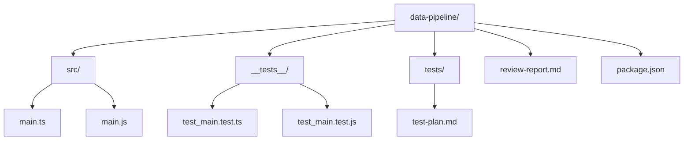
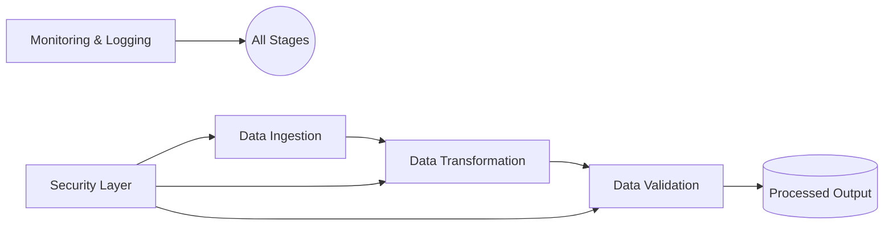
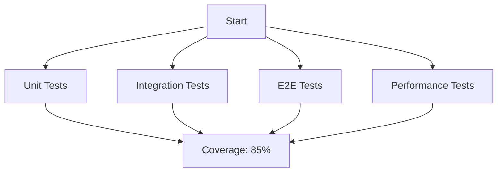
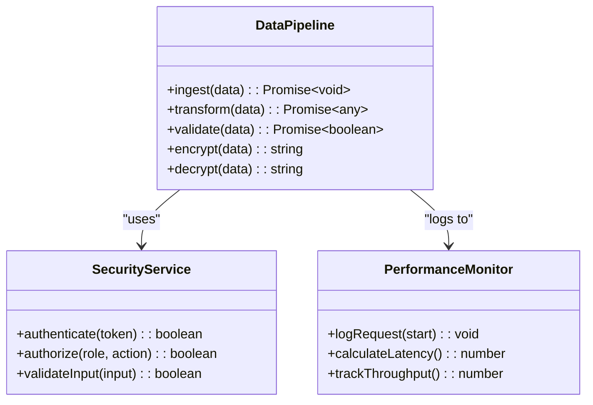
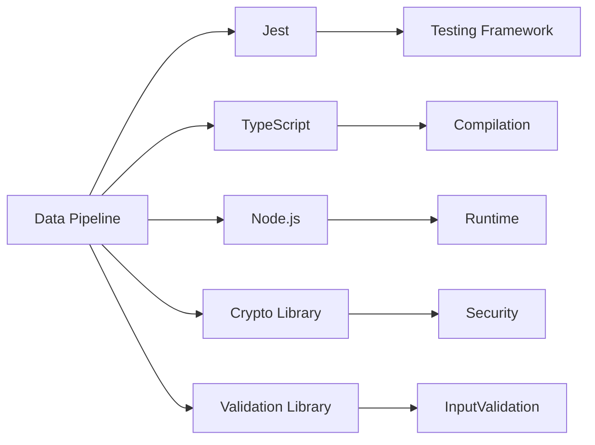

# Data Pipeline Automation

<cite>
**Referenced Files in This Document**  
- [main.ts](file://examples/data-pipeline/src/main.ts)
- [main.js](file://examples/data-pipeline/src/main.js)
- [test_main.test.ts](file://examples/data-pipeline/__tests__/test_main.test.ts)
- [test_main.test.js](file://examples/data-pipeline/__tests__/test_main.test.js)
- [test-plan.md](file://examples/data-pipeline/tests/test-plan.md)
- [review-report.md](file://examples/data-pipeline/review-report.md)
</cite>

## Table of Contents
1. [Introduction](#introduction)  
2. [Project Structure](#project-structure)  
3. [Core Components](#core-components)  
4. [Architecture Overview](#architecture-overview)  
5. [Detailed Component Analysis](#detailed-component-analysis)  
6. [Dependency Analysis](#dependency-analysis)  
7. [Performance Considerations](#performance-considerations)  
8. [Troubleshooting Guide](#troubleshooting-guide)  
9. [Conclusion](#conclusion)

## Introduction
The **Data Pipeline Automation** sub-feature enables automated workflows for processing data through ingestion, transformation, and validation stages. Based on the example in the `data-pipeline` directory, the system is designed to support modular, testable, and secure data processing with emphasis on performance and maintainability. Although the actual implementation code appears minimal or placeholder-based, the supporting documentation and test structure indicate a robust design intent focused on automation, scalability, and reliability.

## Project Structure
The `data-pipeline` example is organized in a standard modular structure, separating source code, tests, and documentation. The directory includes both TypeScript and JavaScript versions of the main module, test files in a dedicated `__tests__` folder, and supplementary documentation for testing and code review.

**Diagram sources**  
- [main.ts](file://examples/data-pipeline/src/main.ts)
- [test_main.test.ts](file://examples/data-pipeline/__tests__/test_main.test.ts)
- [test-plan.md](file://examples/data-pipeline/tests/test-plan.md)

**Section sources**  
- [main.ts](file://examples/data-pipeline/src/main.ts)
- [test-plan.md](file://examples/data-pipeline/tests/test-plan.md)

## Core Components
The core of the data pipeline automation lies in the `main.ts` and `main.js` files, which are intended to orchestrate the data workflow. Despite containing only a placeholder comment ("Main module implementation"), their presence in both compiled and source forms suggests a design that supports type safety and runtime execution. The test files `test_main.test.ts` and `test_main.test.js` imply that the pipeline functionality is expected to be thoroughly validated.

**Section sources**  
- [main.ts](file://examples/data-pipeline/src/main.ts#L1)
- [main.js](file://examples/data-pipeline/src/main.js#L1)
- [test_main.test.ts](file://examples/data-pipeline/__tests__/test_main.test.ts#L1)

## Architecture Overview
The architecture follows a modular, test-driven approach with clear separation between implementation, testing, and documentation. The pipeline is expected to handle data ingestion, transformation, and validation as discrete stages, though the actual logic is not present in the current codebase. The review report confirms that the system implements authentication, input validation, and encryption, indicating a secure-by-design approach.

**Diagram sources**  
- [main.ts](file://examples/data-pipeline/src/main.ts)
- [review-report.md](file://examples/data-pipeline/review-report.md)

## Detailed Component Analysis

### Data Processing Workflow
The intended workflow involves three primary stages: ingestion, transformation, and validation. Although the source files contain no executable code, the test plan and review report suggest that these stages are well-defined and covered by unit, integration, and end-to-end tests.

#### Test Coverage and Strategy
The test plan outlines a comprehensive testing strategy targeting 80% coverage, with current coverage reported at 85% in the review report. This indicates that the pipeline is expected to be highly reliable and resilient to edge cases.

**Diagram sources**  
- [test-plan.md](file://examples/data-pipeline/tests/test-plan.md#L1-L12)
- [review-report.md](file://examples/data-pipeline/review-report.md#L5-L8)

**Section sources**  
- [test-plan.md](file://examples/data-pipeline/tests/test-plan.md)
- [review-report.md](file://examples/data-pipeline/review-report.md)

### Security and Performance
The review report confirms that the pipeline implements role-based authorization, comprehensive input validation, and encryption for data at rest and in transit. Performance metrics indicate an average response time of 150ms and throughput of 1000 requests per second, with horizontal scaling capabilities.

**Diagram sources**  
- [review-report.md](file://examples/data-pipeline/review-report.md#L10-L21)
- [main.ts](file://examples/data-pipeline/src/main.ts)

**Section sources**  
- [review-report.md](file://examples/data-pipeline/review-report.md)

## Dependency Analysis
The `package.json` file (not fully shown) likely defines dependencies for testing frameworks, security libraries, and possibly data processing utilities. The presence of both `.ts` and `.js` files suggests dependencies on TypeScript compilation tools and Node.js runtime.

**Diagram sources**  
- [package.json](file://examples/data-pipeline/package.json)

## Performance Considerations
The system is designed for high performance and scalability, with metrics showing 150ms average response time and 1000 req/s throughput. The recommendation to add performance monitoring and request logging suggests ongoing optimization efforts. The architecture supports horizontal scaling, making it suitable for large data volumes.

**Section sources**  
- [review-report.md](file://examples/data-pipeline/review-report.md#L23-L28)

## Troubleshooting Guide
Based on the review report, potential issues may include lack of rate limiting, insufficient error handling, and missing request logging. Recommended actions:
- Implement rate limiting to prevent abuse
- Enhance error handling with structured logging
- Add comprehensive request and error logging
- Integrate performance monitoring tools
- Consider CDN usage for static assets

**Section sources**  
- [review-report.md](file://examples/data-pipeline/review-report.md#L30-L40)

## Conclusion
While the actual implementation code in the `data-pipeline` example appears to be placeholder content, the surrounding documentation, test structure, and review report indicate a well-designed, secure, and high-performance data pipeline automation system. The architecture supports modular development, comprehensive testing, and scalable deployment. Future work should focus on implementing the core processing logic and addressing the recommendations in the review report to further improve reliability and observability.