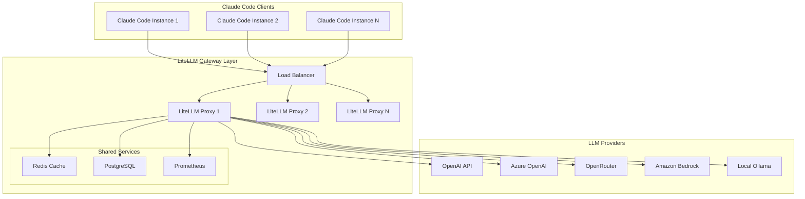
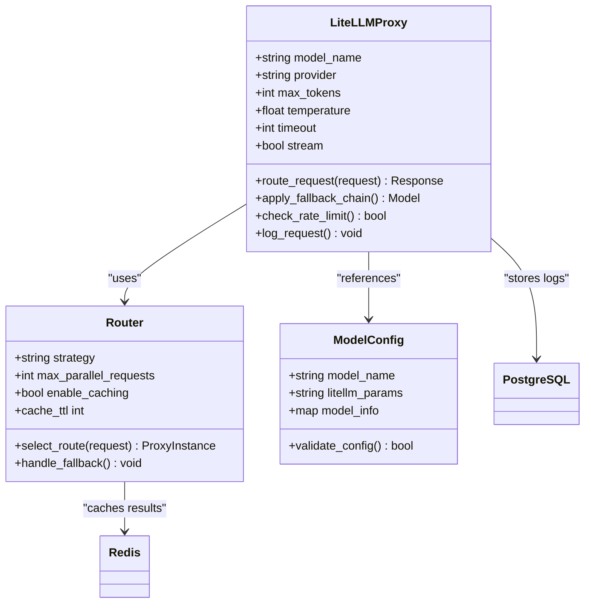
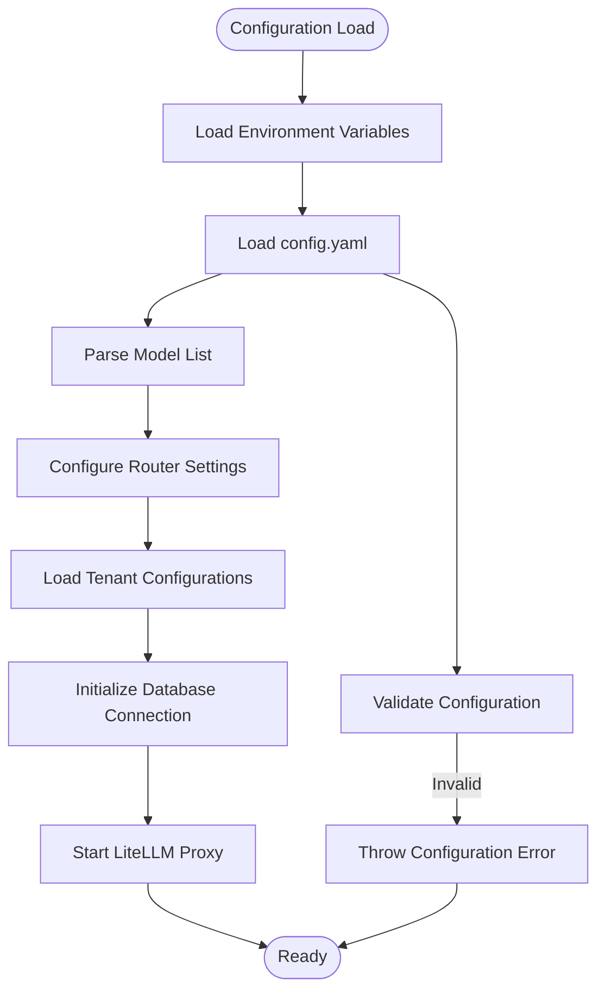
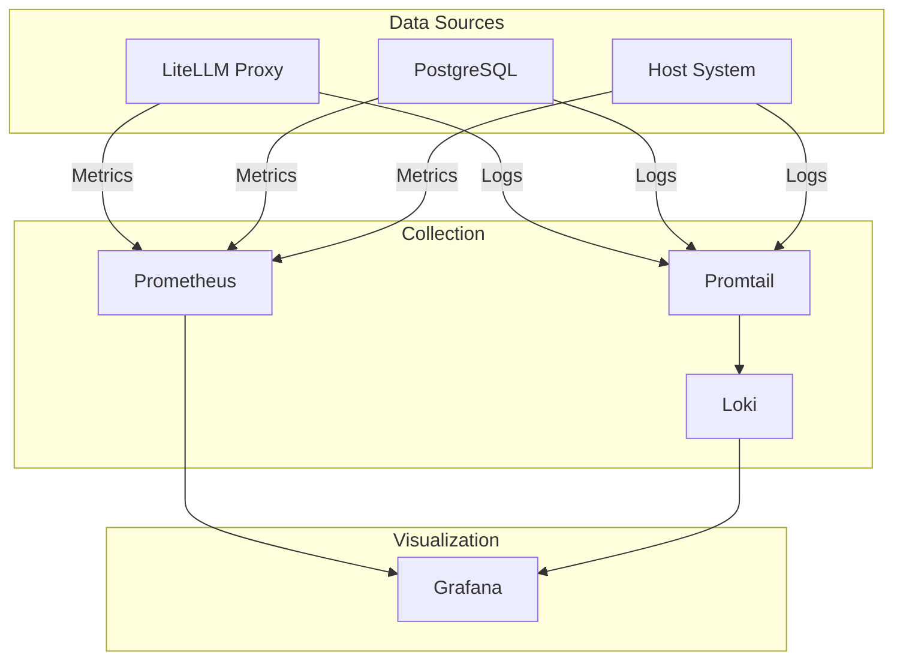
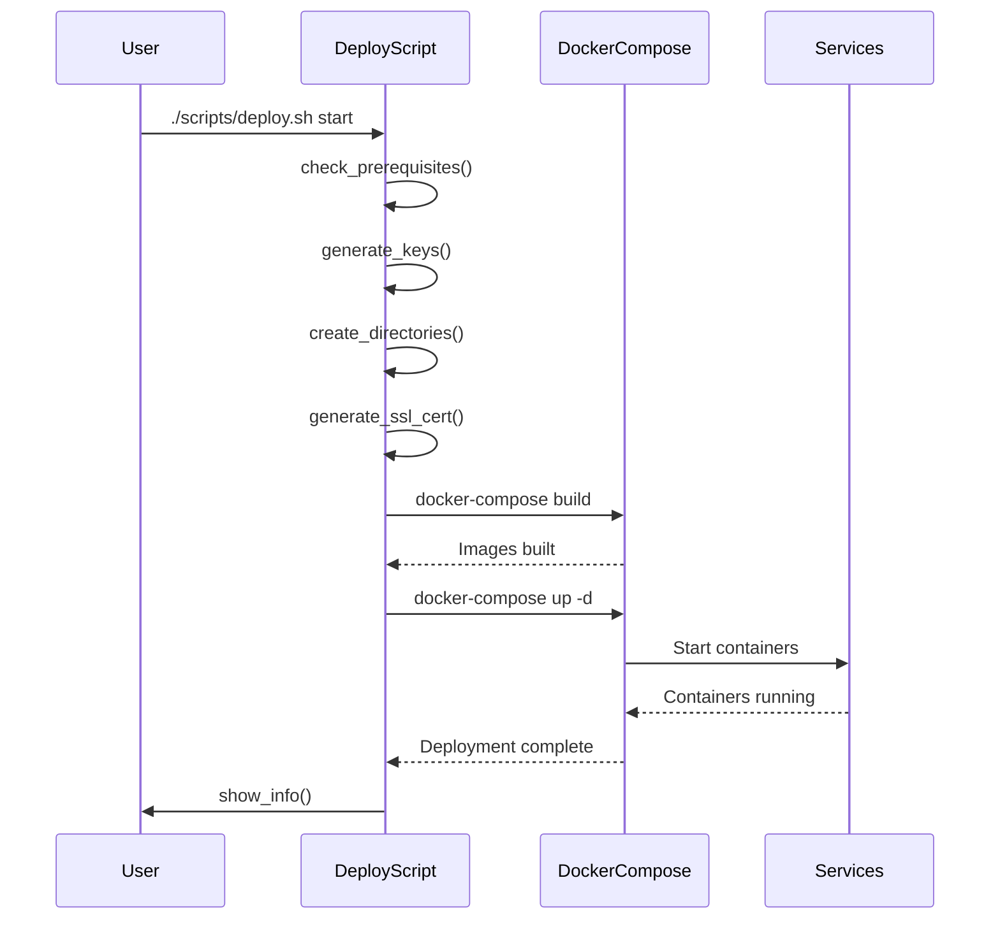
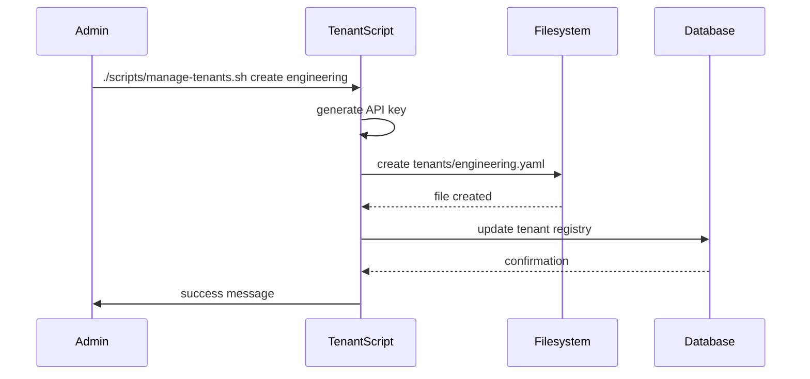

# Integration Patterns

<cite>
**Referenced Files in This Document**   
- [README.md](file://examples/litellm/README.md)
- [config.yaml](file://examples/litellm/config/config.yaml)
- [docker-compose.yml](file://examples/litellm/docker-compose.yml)
- [deploy.sh](file://examples/litellm/scripts/deploy.sh)
- [manage-tenants.sh](file://examples/litellm/scripts/manage-tenants.sh)
- [Dockerfile](file://examples/litellm/docker/Dockerfile)
- [requirements.txt](file://examples/litellm/docker/requirements.txt)
- [entrypoint.sh](file://examples/litellm/docker/entrypoint.sh)
- [EPIC.md](file://examples/litellm/EPIC.md)
</cite>

## Table of Contents
1. [Introduction](#introduction)
2. [Project Structure](#project-structure)
3. [Core Components](#core-components)
4. [Architecture Overview](#architecture-overview)
5. [Detailed Component Analysis](#detailed-component-analysis)
6. [Deployment Automation](#deployment-automation)
7. [Configuration Management](#configuration-management)
8. [Multi-Tenancy Implementation](#multi-tenancy-implementation)
9. [Performance Considerations](#performance-considerations)
10. [Troubleshooting Guide](#troubleshooting-guide)
11. [Conclusion](#conclusion)

## Introduction
The Integration Patterns sub-feature focuses on third-party service integration and deployment workflows, specifically through the LiteLLM example implementation. This document provides a comprehensive analysis of how Claude-Flow integrates with external AI services via LiteLLM, covering configuration management, containerization, and deployment automation. The system enables seamless routing of requests across multiple LLM providers including OpenAI, Azure, OpenRouter, Bedrock, Ollama, and Anthropic, while providing enterprise features such as multi-tenancy, cost tracking, monitoring, and security controls.

## Project Structure
The LiteLLM integration example is organized in a structured directory layout that separates configuration, deployment, and operational components. The main directories include configuration files, Docker setup, scripts for deployment and tenant management, and documentation.

```mermaid
graph TB
subgraph "Root"
Litellm[litellm/]
subgraph "Configuration"
Config[config/]
ConfigYaml[config.yaml]
Nginx[nginx.conf]
Prometheus[prometheus.yml]
end
subgraph "Deployment"
Docker[Docker/]
Dockerfile[Dockerfile]
Entrypoint[entrypoint.sh]
Healthcheck[healthcheck.py]
Requirements[requirements.txt]
end
subgraph "Scripts"
Scripts[scripts/]
Deploy[deploy.sh]
Manage[manage-tenants.sh]
end
subgraph "Documentation"
Readme[README.md]
Epic[EPIC.md]
end
Compose[docker-compose.yml]
ComposeBasic[docker-compose.basic.yml]
end
Litellm --> Config
Litellm --> Docker
Litellm --> Scripts
Litellm --> Readme
Litellm --> Epic
Litellm --> Compose
```

**Diagram sources**
- [README.md](file://examples/litellm/README.md)
- [docker-compose.yml](file://examples/litellm/docker-compose.yml)

**Section sources**
- [README.md](file://examples/litellm/README.md)

## Core Components
The LiteLLM integration consists of several core components that work together to provide a robust multi-provider LLM gateway. These include the LiteLLM proxy instances, load balancer, database, cache, monitoring stack, and various supporting services. The architecture is designed for high availability, scalability, and enterprise-grade features.

**Section sources**
- [EPIC.md](file://examples/litellm/EPIC.md)
- [README.md](file://examples/litellm/README.md)

## Architecture Overview
The LiteLLM Multi-Tenant Gateway architecture provides a production-ready solution for routing Claude Code requests across multiple LLM providers. The system is containerized using Docker and orchestrated through Docker Compose, with components designed for high availability and enterprise features.



**Diagram sources**
- [EPIC.md](file://examples/litellm/EPIC.md)

**Section sources**
- [EPIC.md](file://examples/litellm/EPIC.md)
- [README.md](file://examples/litellm/README.md)

## Detailed Component Analysis

### LiteLLM Proxy Analysis
The LiteLLM proxy instances serve as the core routing engine, handling requests from Claude Code and forwarding them to appropriate LLM providers based on configuration. Multiple instances are deployed for high availability and load balancing.



**Diagram sources**
- [config.yaml](file://examples/litellm/config/config.yaml)
- [docker-compose.yml](file://examples/litellm/docker-compose.yml)

**Section sources**
- [config.yaml](file://examples/litellm/config/config.yaml)
- [docker-compose.yml](file://examples/litellm/docker-compose.yml)

### Configuration Management
The configuration system is centered around the config.yaml file, which defines model routing, fallback chains, tenant configurations, and enterprise features. The system uses environment variables for sensitive data and supports model aliasing for simplified client configuration.



**Diagram sources**
- [config.yaml](file://examples/litellm/config/config.yaml)
- [entrypoint.sh](file://examples/litellm/docker/entrypoint.sh)

**Section sources**
- [config.yaml](file://examples/litellm/config/config.yaml)
- [entrypoint.sh](file://examples/litellm/docker/entrypoint.sh)

### Monitoring and Metrics
The monitoring stack provides comprehensive observability with Prometheus for metrics collection, Grafana for visualization, Loki for log aggregation, and PgAdmin for database management. This enables real-time monitoring of system performance, usage patterns, and cost tracking.



**Diagram sources**
- [docker-compose.yml](file://examples/litellm/docker-compose.yml)
- [config.yaml](file://examples/litellm/config/config.yaml)

**Section sources**
- [docker-compose.yml](file://examples/litellm/docker-compose.yml)
- [config.yaml](file://examples/litellm/config/config.yaml)

## Deployment Automation
The deployment process is automated through the deploy.sh script, which handles prerequisites checking, key generation, directory creation, SSL certificate generation, and service deployment. This ensures consistent and reliable deployment across different environments.



**Diagram sources**
- [deploy.sh](file://examples/litellm/scripts/deploy.sh)
- [docker-compose.yml](file://examples/litellm/docker-compose.yml)

**Section sources**
- [deploy.sh](file://examples/litellm/scripts/deploy.sh)

## Configuration Management
The configuration management system is designed to support complex enterprise requirements including multi-tenancy, cost tracking, and security controls. The config.yaml file serves as the central configuration point, with support for environment variables and tenant-specific configurations.

### Model Routing Configuration
The model_list section in config.yaml defines aliases for different LLM providers, allowing clients to use consistent model names regardless of the underlying provider. This abstraction layer enables cost optimization and provider flexibility.

```yaml
model_list:
  - model_name: "codex-mini"
    litellm_params:
      model: "openai/gpt-4o-mini"
      api_key: ${OPENAI_API_KEY}
      max_tokens: 4096
      temperature: 0.2
  - model_name: "o3-pro"
    litellm_params:
      model: "openai/o3-2025"
      api_key: ${OPENAI_API_KEY}
      max_tokens: 8192
      temperature: 0.7
```

**Section sources**
- [config.yaml](file://examples/litellm/config/config.yaml)

### Fallback Chains
The fallback_models configuration provides reliability through automatic failover to alternative models when primary providers are unavailable or exceed rate limits. This ensures continuous service availability.

```yaml
fallback_models:
  code_chain:
    - codex-mini
    - deepseek-coder
    - local-codellama
    - claude-3-haiku
  reasoning_chain:
    - o3-pro
    - azure-gpt4
    - bedrock-claude
    - claude-3-opus
```

**Section sources**
- [config.yaml](file://examples/litellm/config/config.yaml)

### Cost Tracking
The cost_tracking configuration enables financial controls with alert thresholds that trigger notifications, throttling, or blocking when usage approaches budget limits.

```yaml
cost_tracking:
  enabled: true
  currency: USD
  alert_thresholds:
    - threshold: 80
      action: notify
    - threshold: 95
      action: throttle
    - threshold: 100
      action: block
```

**Section sources**
- [config.yaml](file://examples/litellm/config/config.yaml)

## Multi-Tenancy Implementation
The multi-tenancy system allows different teams or departments to have isolated configurations, usage tracking, and quotas while sharing the same infrastructure. Tenant management is handled through the manage-tenants.sh script and tenant-specific configuration files.



**Diagram sources**
- [manage-tenants.sh](file://examples/litellm/scripts/manage-tenants.sh)

**Section sources**
- [manage-tenants.sh](file://examples/litellm/scripts/manage-tenants.sh)
- [config.yaml](file://examples/litellm/config/config.yaml)

## Performance Considerations
The LiteLLM integration is designed with performance optimization in mind, incorporating connection pooling, caching, and resource allocation strategies to ensure efficient handling of external service calls.

### Connection Pooling
The system uses Redis as a caching layer to store frequent responses, reducing the number of external API calls and improving response times. The configuration specifies a 2GB memory limit with LRU (Least Recently Used) eviction policy.

```yaml
redis:
  image: redis:7-alpine
  command: redis-server --appendonly yes --maxmemory 2gb --maxmemory-policy allkeys-lru
```

**Section sources**
- [docker-compose.yml](file://examples/litellm/docker-compose.yml)

### Retry Mechanisms
The router_settings in config.yaml define a robust retry policy with exponential backoff to handle transient failures in external service calls.

```yaml
router_settings:
  retry_policy:
    max_retries: 3
    retry_delay: 1
    exponential_backoff: true
```

**Section sources**
- [config.yaml](file://examples/litellm/config/config.yaml)

### Resource Allocation
The deployment configuration allocates appropriate resources for GPU-accelerated local models through Docker's device reservation system.

```yaml
deploy:
  resources:
    reservations:
      devices:
        - driver: nvidia
          count: all
          capabilities: [gpu]
```

**Section sources**
- [docker-compose.yml](file://examples/litellm/docker-compose.yml)

## Troubleshooting Guide
This section addresses common issues encountered when deploying and operating the LiteLLM integration, along with their solutions.

### Connection Refused
When encountering connection refused errors, verify that all services are running and check the LiteLLM proxy logs:

```bash
# Check service status
docker-compose ps

# Check LiteLLM logs
docker-compose logs litellm-1
```

**Section sources**
- [README.md](file://examples/litellm/README.md)

### Authentication Failed
Verify the master key in the .env file and test the connection:

```bash
# Verify master key
grep LITELLM_MASTER_KEY .env

# Test connection
curl http://localhost:4000/health
```

**Section sources**
- [README.md](file://examples/litellm/README.md)

### Model Not Found
Check the available models through the LiteLLM API:

```bash
# List available models
curl -H "Authorization: Bearer $LITELLM_MASTER_KEY" \
     http://localhost:4000/models
```

**Section sources**
- [README.md](file://examples/litellm/README.md)

### Configuration Drift
To prevent configuration drift, use the deployment script which ensures consistent environment setup:

```bash
# Always use the deployment script
./scripts/deploy.sh start
```

**Section sources**
- [deploy.sh](file://examples/litellm/scripts/deploy.sh)

### Deployment Failures
Common deployment failures can be addressed by ensuring prerequisites are met and generating secure keys:

```bash
# The deployment script handles key generation automatically
# if default keys are still in place
```

**Section sources**
- [deploy.sh](file://examples/litellm/scripts/deploy.sh)

## Conclusion
The LiteLLM integration pattern provides a comprehensive solution for third-party service integration and deployment workflows. By leveraging containerization, automated deployment, and sophisticated configuration management, the system enables Claude-Flow to seamlessly integrate with multiple LLM providers while maintaining enterprise-grade features such as multi-tenancy, cost tracking, and monitoring. The architecture is designed for high availability, scalability, and reliability, with robust error handling and fallback mechanisms to ensure continuous service operation. This integration pattern serves as a model for complex deployment scenarios involving external AI services.