# Machine Learning Foundation Agents

<cite>
**Referenced Files in This Document**   
- [foundation_agent_enhanced.py](file://examples/ml_foundation/foundation_agent_enhanced.py)
- [foundation_pipeline.py](file://examples/ml_foundation/foundation_pipeline.py)
- [foundation_agent_features.py](file://src/automation/agents/foundation_agent_features.py)
</cite>

## Table of Contents
1. [Introduction](#introduction)
2. [Project Structure](#project-structure)
3. [Core Components](#core-components)
4. [Architecture Overview](#architecture-overview)
5. [Detailed Component Analysis](#detailed-component-analysis)
6. [Pipeline Orchestration](#pipeline-orchestration)
7. [Model Training and Evaluation Workflows](#model-training-and-evaluation-workflows)
8. [Domain Model](#domain-model)
9. [Integration with Core Agent System](#integration-with-core-agent-system)
10. [Common Issues and Troubleshooting](#common-issues-and-troubleshooting)
11. [Performance Considerations](#performance-considerations)
12. [Conclusion](#conclusion)

## Introduction

The Machine Learning Foundation Agents represent a critical component of the MLE-STAR methodology, serving as the initial phase in the model development lifecycle. These agents are designed to establish a solid foundation for subsequent refinement and optimization phases by implementing comprehensive data preprocessing, baseline model creation, and performance benchmarking. The foundation agent system provides a structured approach to machine learning model development, ensuring that subsequent phases have a reliable baseline for comparison and improvement.

This documentation focuses on the Enhanced Foundation Agent implementation, which extends the basic foundation pipeline with advanced capabilities including automated dataset handling, hyperparameter optimization, model interpretability, and coordination with other agents in the system. The agent is designed to handle both classification and regression tasks, with automatic task type detection and appropriate preprocessing strategies.

The foundation agent operates as part of a larger agent ecosystem, coordinating with other specialized agents through the Claude Flow system. This coordination enables a seamless handoff from the foundation phase to subsequent refinement and optimization phases, creating a cohesive machine learning development workflow.

**Section sources**
- [foundation_agent_enhanced.py](file://examples/ml_foundation/foundation_agent_enhanced.py#L1-L50)
- [foundation_pipeline.py](file://examples/ml_foundation/foundation_pipeline.py#L1-L50)

## Project Structure

The foundation agent implementation is organized within the examples/ml_foundation directory, following a modular structure that separates concerns and promotes reusability. The core components include the enhanced foundation agent, a foundation pipeline, and feature engineering utilities.

The project structure reflects a layered architecture with distinct components for data handling, feature engineering, model building, and performance tracking. This modular design allows for easy extension and customization of individual components without affecting the overall system.

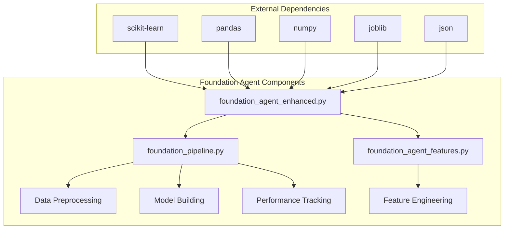

**Diagram sources**
- [foundation_agent_enhanced.py](file://examples/ml_foundation/foundation_agent_enhanced.py#L1-L100)
- [foundation_pipeline.py](file://examples/ml_foundation/foundation_pipeline.py#L1-L100)
- [foundation_agent_features.py](file://src/automation/agents/foundation_agent_features.py#L1-L100)

**Section sources**
- [foundation_agent_enhanced.py](file://examples/ml_foundation/foundation_agent_enhanced.py#L1-L100)
- [foundation_pipeline.py](file://examples/ml_foundation/foundation_pipeline.py#L1-L100)

## Core Components

The foundation agent system comprises several core components that work together to create a comprehensive machine learning pipeline. The primary component is the EnhancedFoundationAgent class, which orchestrates the entire foundation phase process. This class integrates multiple specialized components including a DataHandler, FeatureEngineer, ModelBuilder, and PerformanceTracker.

The FeatureEngineer class provides advanced feature engineering capabilities, including polynomial feature creation, statistical aggregations, ratio features, clustering-based features, and various transformations. This component enables the creation of sophisticated feature sets that can improve model performance.

The ModelBuilder component manages the creation and configuration of baseline models for both classification and regression tasks. It supports multiple algorithms including logistic regression, random forests, gradient boosting, and support vector machines, providing a diverse set of baseline models for comparison.

The PerformanceTracker component handles the evaluation of models using appropriate metrics for the task type. For classification tasks, it calculates accuracy, precision, recall, F1-score, and ROC-AUC. For regression tasks, it computes MSE, RMSE, and R2 score, providing a comprehensive assessment of model performance.

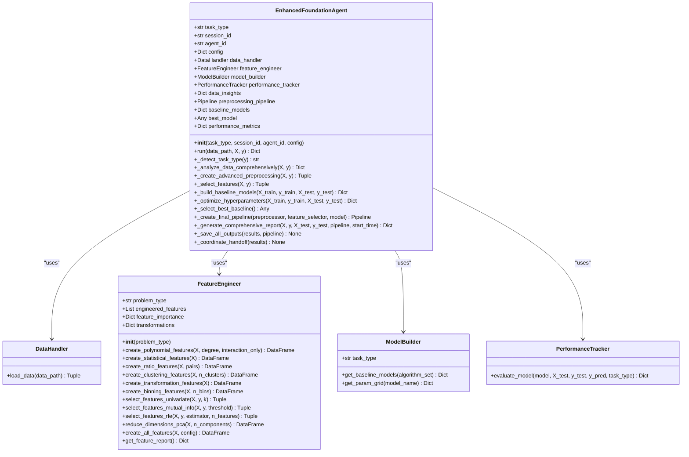

**Diagram sources**
- [foundation_agent_enhanced.py](file://examples/ml_foundation/foundation_agent_enhanced.py#L100-L200)
- [foundation_agent_features.py](file://src/automation/agents/foundation_agent_features.py#L50-L100)

**Section sources**
- [foundation_agent_enhanced.py](file://examples/ml_foundation/foundation_agent_enhanced.py#L50-L200)
- [foundation_agent_features.py](file://src/automation/agents/foundation_agent_features.py#L1-L200)

## Architecture Overview

The Enhanced Foundation Agent follows a modular, pipeline-based architecture that processes data through a series of well-defined stages. The architecture is designed to be both comprehensive and flexible, allowing for customization of individual components while maintaining a consistent overall workflow.

The agent begins with data loading and analysis, where it performs comprehensive data inspection to understand the dataset characteristics. This is followed by preprocessing, where missing values are handled, categorical variables are encoded, and numerical features are scaled. The feature engineering phase creates additional features through various transformations and aggregations.

After preprocessing, the agent performs feature selection to identify the most informative features, reducing dimensionality and potentially improving model performance. The model building phase trains multiple baseline models using different algorithms, evaluating each one using cross-validation and appropriate metrics.

For models that show promise, the agent can perform hyperparameter optimization using either grid search or randomized search. The best-performing model is then selected and incorporated into a final pipeline that includes all preprocessing steps and the trained model.

The architecture also includes coordination capabilities, allowing the agent to communicate with other agents in the system through the Claude Flow memory system. This enables a seamless handoff to subsequent phases in the MLE-STAR methodology.

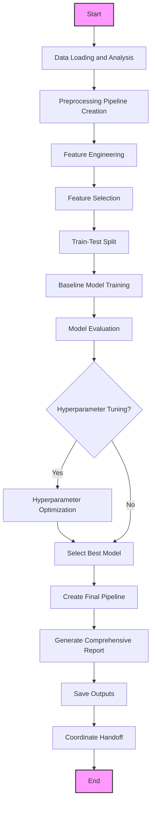

**Diagram sources**
- [foundation_agent_enhanced.py](file://examples/ml_foundation/foundation_agent_enhanced.py#L200-L300)
- [foundation_pipeline.py](file://examples/ml_foundation/foundation_pipeline.py#L200-L300)

**Section sources**
- [foundation_agent_enhanced.py](file://examples/ml_foundation/foundation_agent_enhanced.py#L200-L300)
- [foundation_pipeline.py](file://examples/ml_foundation/foundation_pipeline.py#L200-L300)

## Detailed Component Analysis

### Enhanced Foundation Agent Analysis

The EnhancedFoundationAgent class serves as the central orchestrator of the foundation phase, coordinating all components and managing the overall workflow. The agent is initialized with a task type (classification, regression, or auto-detection), a session ID for coordination, an agent ID, and a configuration dictionary.

The run method is the primary entry point, executing the complete foundation pipeline. It begins by loading and analyzing the data, either from a provided path or by creating a demonstration dataset if no data is provided. The agent automatically detects the task type if configured to do so, examining the target variable's characteristics to determine whether the problem is classification or regression.

The data analysis phase performs comprehensive inspection of the dataset, identifying missing values, outliers, feature types, and correlations. This analysis informs subsequent preprocessing decisions and generates recommendations for data quality improvements.

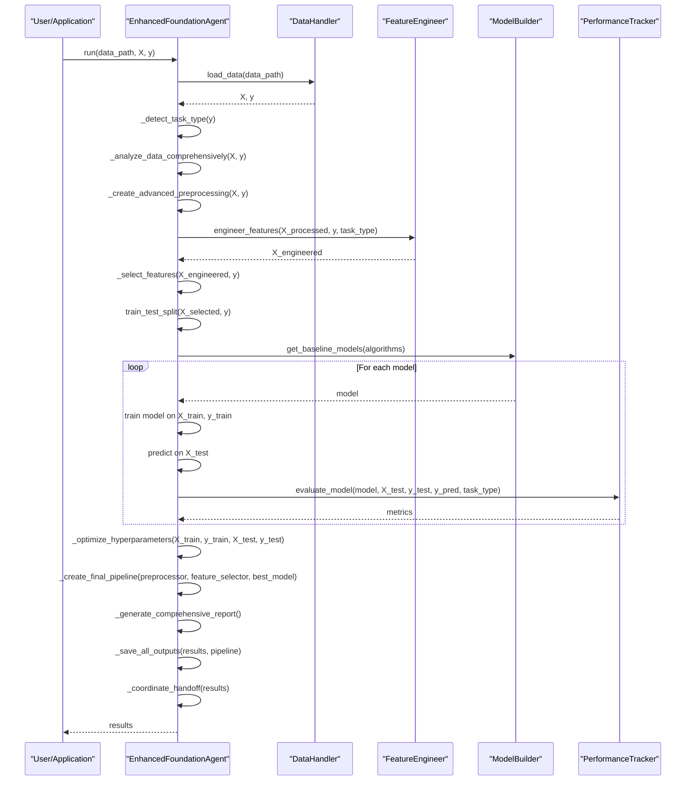

**Diagram sources**
- [foundation_agent_enhanced.py](file://examples/ml_foundation/foundation_agent_enhanced.py#L300-L400)

**Section sources**
- [foundation_agent_enhanced.py](file://examples/ml_foundation/foundation_agent_enhanced.py#L300-L400)

### Feature Engineering Component Analysis

The FeatureEngineer class provides sophisticated feature engineering capabilities that can significantly enhance model performance. The component offers multiple methods for creating new features from existing data, including polynomial features, statistical aggregations, ratio features, clustering-based features, and various mathematical transformations.

The create_polynomial_features method generates polynomial and interaction features from numeric columns, allowing models to capture non-linear relationships. This is particularly useful for linear models that cannot inherently capture complex interactions between features.

The create_statistical_features method computes row-wise statistics such as mean, standard deviation, maximum, minimum, range, skewness, and kurtosis across numeric features. These aggregate features can provide valuable information about the overall pattern of values for each sample.

The create_ratio_features method calculates ratios and differences between pairs of numeric features, which can reveal meaningful relationships that are not apparent from the individual features alone. This is especially useful in domains where relative values are more informative than absolute values.

The create_clustering_features method applies K-means clustering to the data and creates features based on cluster assignments and distances to cluster centers. These features can capture underlying structure in the data that may be relevant to the prediction task.

The create_transformation_features method applies mathematical transformations such as logarithm, square root, square, and reciprocal to numeric features. These transformations can help normalize distributions, stabilize variance, and make relationships more linear.

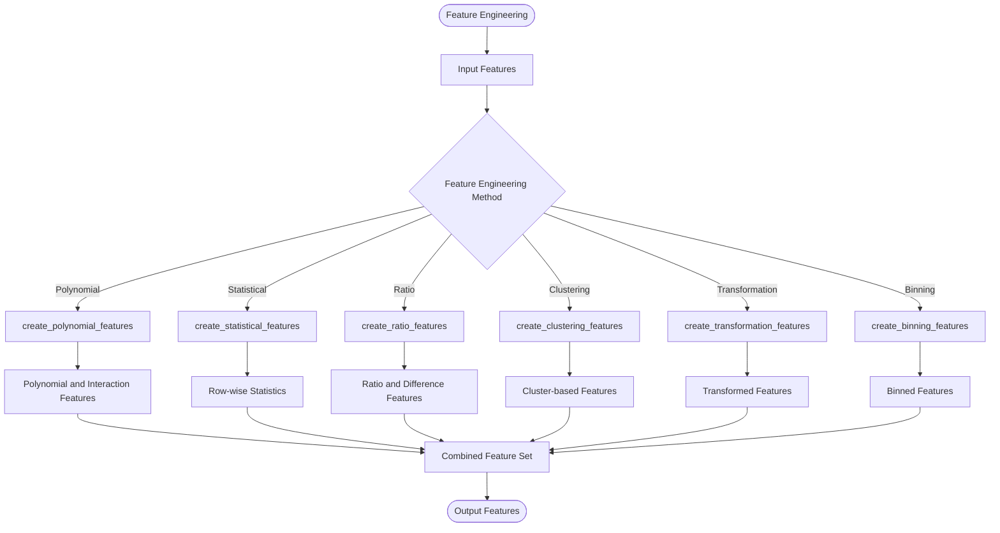

**Diagram sources**
- [foundation_agent_features.py](file://src/automation/agents/foundation_agent_features.py#L200-L300)

**Section sources**
- [foundation_agent_features.py](file://src/automation/agents/foundation_agent_features.py#L200-L300)

## Pipeline Orchestration

The foundation agent implements a comprehensive pipeline orchestration system that coordinates the various stages of the foundation phase. The pipeline begins with data loading and analysis, where the agent examines the dataset to understand its characteristics and identify potential issues.

After data analysis, the agent creates a preprocessing pipeline using scikit-learn's ColumnTransformer and Pipeline classes. This pipeline handles missing value imputation, categorical encoding, and feature scaling in a consistent manner that can be applied to both training and test data.

The feature engineering phase applies various transformations to create new features that may improve model performance. This includes polynomial features, statistical aggregations, ratio features, and clustering-based features. The agent can apply all available feature engineering methods or selectively apply specific methods based on configuration.

Following feature engineering, the agent performs feature selection to identify the most informative features. This reduces dimensionality, potentially improving model performance and reducing overfitting. The agent supports multiple feature selection methods including univariate selection, recursive feature elimination, and model-based selection.

The model building phase trains multiple baseline models using different algorithms. For classification tasks, the agent trains logistic regression, random forest, gradient boosting, and support vector machine models. For regression tasks, it trains linear regression, random forest, gradient boosting, and support vector regression models.

After training the baseline models, the agent evaluates their performance using appropriate metrics and cross-validation. The best-performing model is then selected for hyperparameter optimization, which can further improve its performance.

The final pipeline combines all preprocessing steps with the optimized model, creating a complete end-to-end pipeline that can be used for predictions on new data. This pipeline is saved to disk along with comprehensive results and insights.

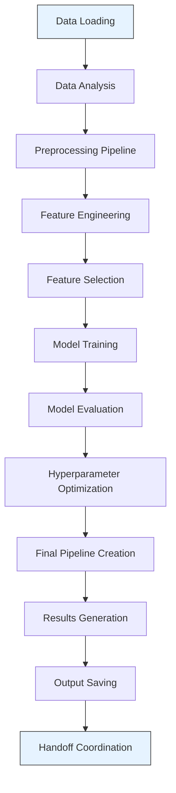

**Diagram sources**
- [foundation_agent_enhanced.py](file://examples/ml_foundation/foundation_agent_enhanced.py#L400-L500)
- [foundation_pipeline.py](file://examples/ml_foundation/foundation_pipeline.py#L400-L500)

**Section sources**
- [foundation_agent_enhanced.py](file://examples/ml_foundation/foundation_agent_enhanced.py#L400-L500)
- [foundation_pipeline.py](file://examples/ml_foundation/foundation_pipeline.py#L400-L500)

## Model Training and Evaluation Workflows

The foundation agent implements a systematic approach to model training and evaluation that ensures comprehensive assessment of different algorithms and configurations. The workflow begins with the creation of baseline models using multiple algorithms appropriate for the task type.

For classification tasks, the agent trains four baseline models: logistic regression, random forest, gradient boosting, and support vector machine. Each model is configured with reasonable default parameters that are appropriate for the dataset size and complexity. The agent uses scikit-learn's implementation of these algorithms, ensuring reliability and consistency.

For regression tasks, the agent trains linear regression, random forest, gradient boosting, and support vector regression models. These models represent a diverse set of approaches, from linear models to ensemble methods, providing a comprehensive baseline for comparison.

After training each baseline model, the agent evaluates its performance using appropriate metrics. For classification models, it calculates accuracy, precision, recall, F1-score, and ROC-AUC (for binary classification). For regression models, it computes mean squared error, root mean squared error, and R2 score.

The agent also performs cross-validation to assess the stability of model performance across different data splits. This provides a more robust estimate of model performance than a single train-test split.

For models that show promising performance, the agent can perform hyperparameter optimization using either grid search or randomized search. Grid search exhaustively searches through a specified parameter grid, while randomized search samples a fixed number of parameter settings from specified distributions. The choice between these methods depends on the size of the parameter space and computational constraints.

The optimization process uses cross-validation to evaluate different parameter combinations, ensuring that the selected parameters generalize well to unseen data. The best-performing parameter combination is then used to train the final model.

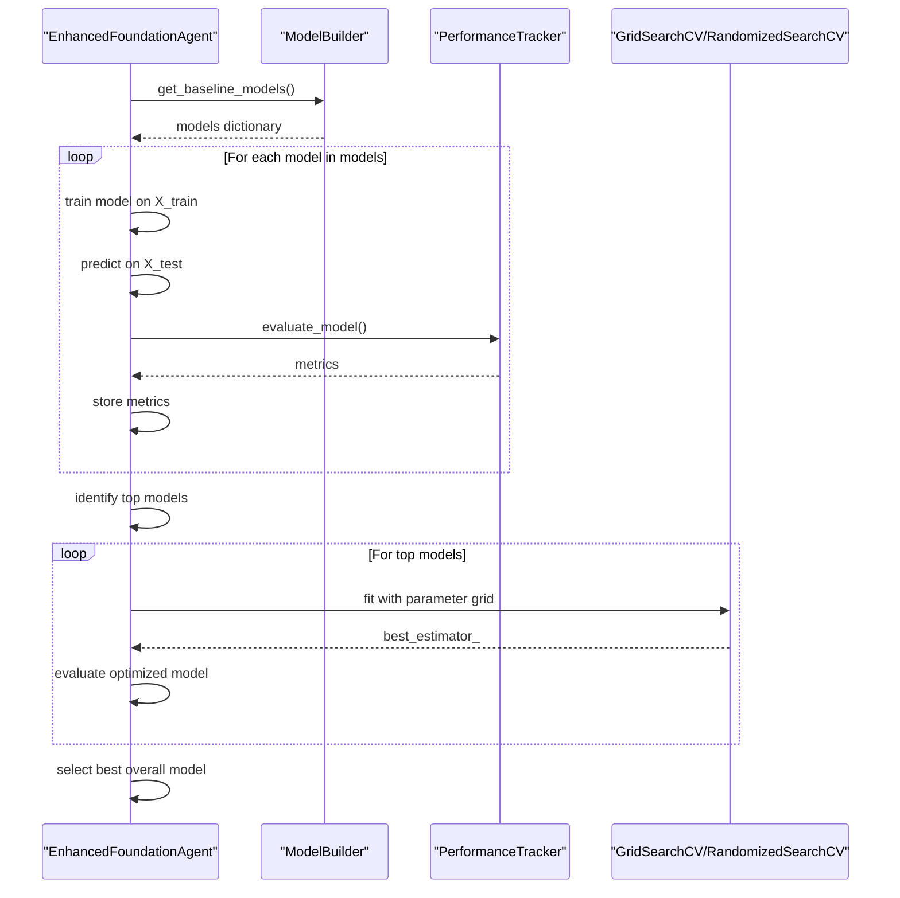

**Diagram sources**
- [foundation_agent_enhanced.py](file://examples/ml_foundation/foundation_agent_enhanced.py#L500-L600)
- [foundation_pipeline.py](file://examples/ml_foundation/foundation_pipeline.py#L500-L600)

**Section sources**
- [foundation_agent_enhanced.py](file://examples/ml_foundation/foundation_agent_enhanced.py#L500-L600)
- [foundation_pipeline.py](file://examples/ml_foundation/foundation_pipeline.py#L500-L600)

## Domain Model

The foundation agent system implements a domain model that represents the key concepts and relationships in the machine learning foundation phase. The central entity is the EnhancedFoundationAgent, which orchestrates the entire process and maintains state throughout execution.

The agent's configuration is represented by a hierarchical dictionary structure that defines parameters for data handling, preprocessing, feature engineering, modeling, and output. This configuration allows for flexible customization of the agent's behavior without modifying code.

The data model includes representations of datasets, features, models, and performance metrics. Datasets are represented as pandas DataFrames, with metadata about feature types, missing values, and other characteristics. Features are tracked throughout the pipeline, with information about their origin and transformations applied.

Models are represented as scikit-learn estimator objects, with metadata about their type, parameters, and performance. The agent maintains a collection of baseline models and the final optimized model, allowing for comparison and analysis.

Performance metrics are stored in a structured format that includes both point estimates and cross-validation results. This comprehensive assessment enables informed decision-making about model selection and optimization.

The domain model also includes representations of pipelines, which encapsulate the complete workflow from raw data to predictions. These pipelines combine preprocessing steps with trained models, ensuring consistency between training and inference.

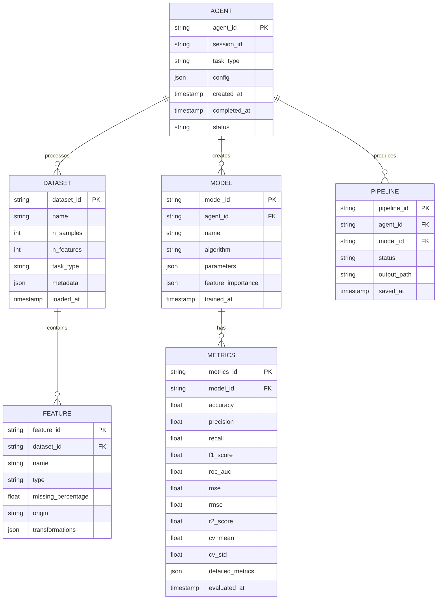

**Diagram sources**
- [foundation_agent_enhanced.py](file://examples/ml_foundation/foundation_agent_enhanced.py#L600-L700)
- [foundation_pipeline.py](file://examples/ml_foundation/foundation_pipeline.py#L600-L700)

**Section sources**
- [foundation_agent_enhanced.py](file://examples/ml_foundation/foundation_agent_enhanced.py#L600-L700)
- [foundation_pipeline.py](file://examples/ml_foundation/foundation_pipeline.py#L600-L700)

## Integration with Core Agent System

The foundation agent integrates with the core agent system through the Claude Flow coordination framework. This integration enables communication and handoff between different specialized agents in the MLE-STAR methodology.

The agent uses subprocess calls to interact with the Claude Flow CLI, storing data in the shared memory system and triggering hooks for coordination. This allows the agent to notify other components of its status, store intermediate results, and coordinate the handoff to subsequent agents.

During initialization, the agent registers itself in the memory system with its capabilities and status. This allows other agents to discover and interact with it as needed. The agent also stores its configuration and initial status, providing transparency into its operation.

Throughout execution, the agent stores intermediate results in the memory system, including data insights, model performance metrics, and feature engineering reports. This enables other agents to access this information without requiring direct communication.

When the foundation phase is complete, the agent coordinates the handoff to the next agent in the workflow, typically a refinement agent. It stores handoff data including the session ID, best baseline score, pipeline path, and recommendations for further improvement.

The agent also implements error handling that notifies the coordination system of any issues encountered during execution. This enables monitoring and potentially automatic recovery from failures.

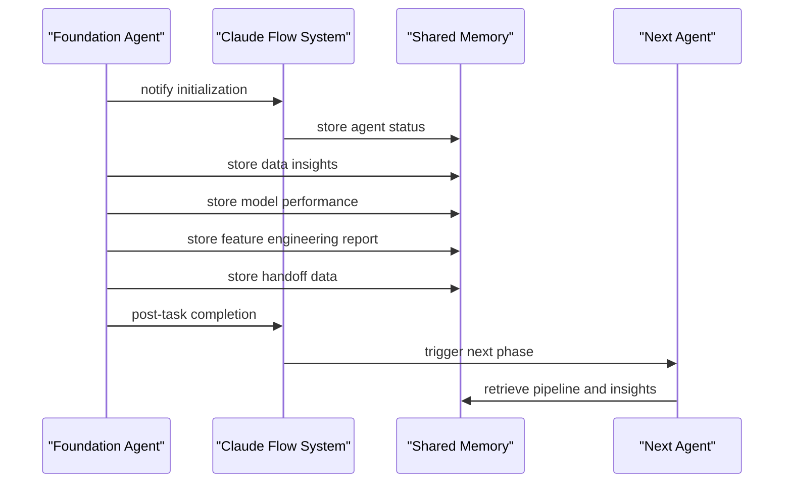

**Diagram sources**
- [foundation_agent_enhanced.py](file://examples/ml_foundation/foundation_agent_enhanced.py#L700-L800)

**Section sources**
- [foundation_agent_enhanced.py](file://examples/ml_foundation/foundation_agent_enhanced.py#L700-L800)

## Common Issues and Troubleshooting

The foundation agent may encounter several common issues during execution, which are addressed through robust error handling and diagnostic capabilities.

One common issue is data loading failures, which can occur when the specified data path is invalid or the file format is not supported. The agent handles this by providing clear error messages and falling back to a demonstration dataset when appropriate.

Another common issue is memory exhaustion during feature engineering, particularly when creating polynomial features with high degrees or when working with large datasets. The agent addresses this by providing configuration options to limit feature generation and by using memory-efficient data types where possible.

Model convergence problems can occur with certain algorithms, particularly logistic regression with high-dimensional data or SVM with inappropriate kernel parameters. The agent handles this by setting appropriate maximum iteration limits and providing fallback options.

Feature selection failures can occur when there are insufficient features or when the selection method is inappropriate for the data. The agent includes validation checks and provides alternative selection methods when needed.

The agent also addresses issues with hyperparameter optimization, such as excessive computation time or failure to converge. It provides configuration options to control the optimization process, including the number of iterations and the search method.

For all issues, the agent implements comprehensive logging and error reporting, storing detailed information in the memory system for debugging and analysis.

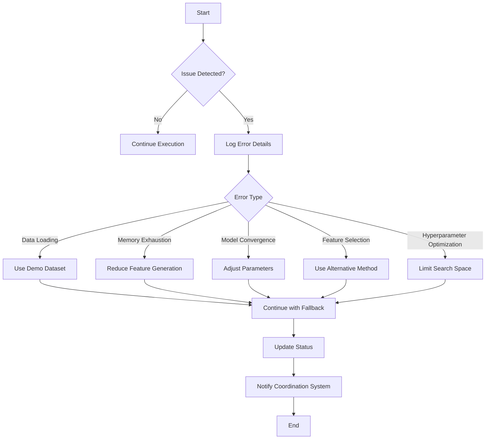

**Diagram sources**
- [foundation_agent_enhanced.py](file://examples/ml_foundation/foundation_agent_enhanced.py#L800-L900)

**Section sources**
- [foundation_agent_enhanced.py](file://examples/ml_foundation/foundation_agent_enhanced.py#L800-L900)

## Performance Considerations

The foundation agent implements several performance optimizations to handle computationally intensive machine learning tasks efficiently.

For large datasets, the agent uses batch processing strategies to manage memory usage. This includes processing data in chunks when possible and using memory-efficient data types. The agent also provides configuration options to control the extent of feature engineering, which can significantly impact memory and computation requirements.

The agent leverages parallelization for computationally intensive operations such as model training and hyperparameter optimization. It uses scikit-learn's built-in parallelization capabilities, which can utilize multiple CPU cores to speed up computation.

For feature engineering, the agent provides options to limit the complexity of transformations, such as restricting polynomial degree or the number of clusters in clustering-based features. This helps balance the potential performance gains from feature engineering against the computational cost.

The agent also implements caching of intermediate results, particularly for expensive operations like feature engineering and model training. This avoids redundant computation when the agent is run multiple times on the same data.

Memory management is a key consideration, particularly when working with high-dimensional feature spaces. The agent uses sparse representations when appropriate and provides options to reduce dimensionality through feature selection or PCA.

The agent's performance is also influenced by the choice of algorithms and their parameters. For example, random forests can be computationally expensive with large datasets, while logistic regression is generally faster but may require more feature engineering to achieve good performance.

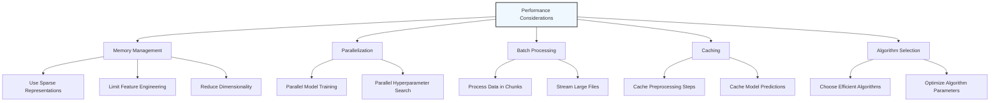

**Diagram sources**
- [foundation_agent_enhanced.py](file://examples/ml_foundation/foundation_agent_enhanced.py#L900-L1000)
- [foundation_pipeline.py](file://examples/ml_foundation/foundation_pipeline.py#L900-L1000)

**Section sources**
- [foundation_agent_enhanced.py](file://examples/ml_foundation/foundation_agent_enhanced.py#L900-L1000)
- [foundation_pipeline.py](file://examples/ml_foundation/foundation_pipeline.py#L900-L1000)

## Conclusion

The Machine Learning Foundation Agents provide a comprehensive and robust foundation for the MLE-STAR methodology, establishing baseline models and performance benchmarks that subsequent phases can build upon. The enhanced implementation extends the basic foundation pipeline with advanced capabilities including automated dataset handling, sophisticated feature engineering, hyperparameter optimization, and coordination with other agents.

The agent's modular architecture separates concerns and promotes reusability, making it easy to extend and customize for specific use cases. The integration with the Claude Flow coordination system enables seamless handoff to subsequent phases, creating a cohesive machine learning development workflow.

The foundation agent addresses common challenges in machine learning model development, including data quality issues, feature engineering, model selection, and performance evaluation. Its comprehensive approach ensures that subsequent phases have a solid foundation to build upon, increasing the likelihood of successful model development.

By providing a standardized and automated approach to the foundation phase, the agent reduces the time and effort required to establish baseline models, allowing data scientists to focus on higher-value activities such as model refinement and business impact analysis.

The agent's design principles of modularity, flexibility, and coordination make it a valuable component of any machine learning development pipeline, particularly in complex projects that require collaboration between multiple specialized agents.

[No sources needed since this section summarizes without analyzing specific files]