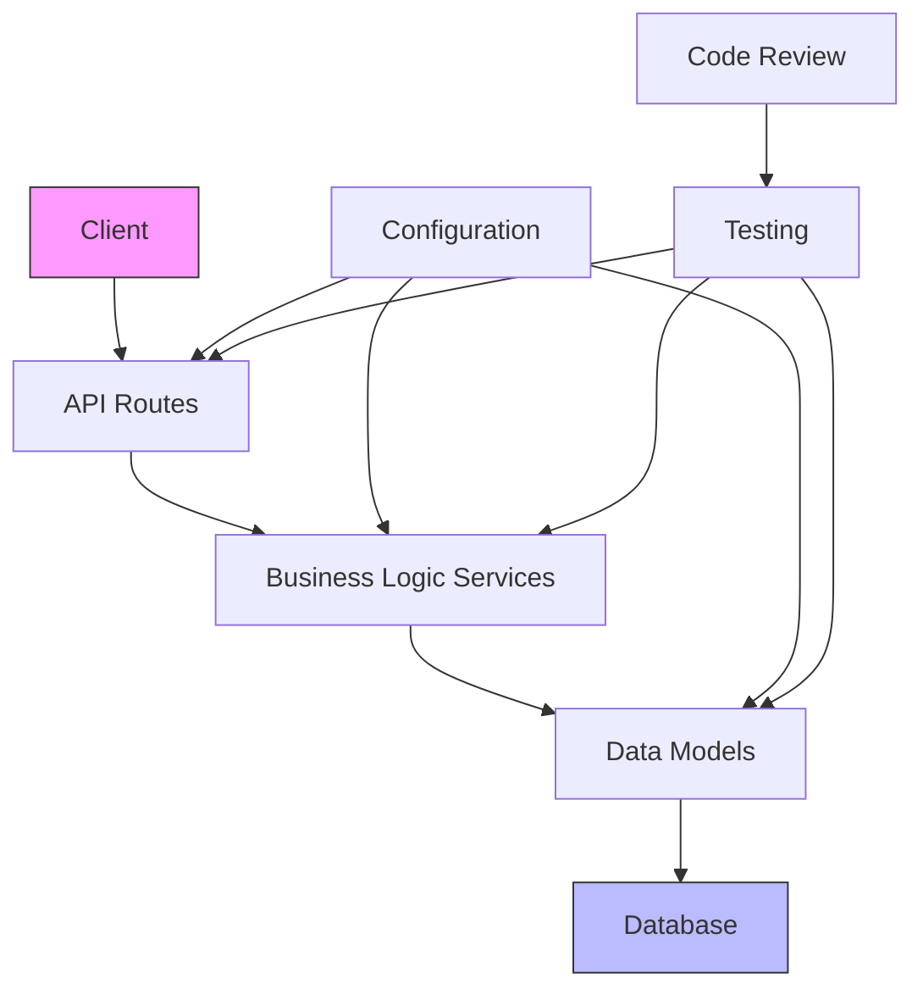
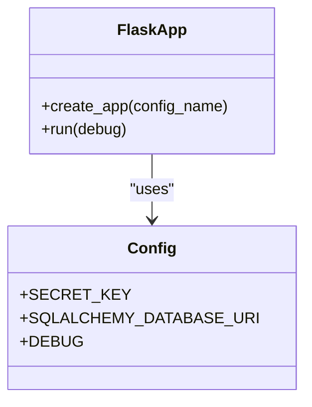
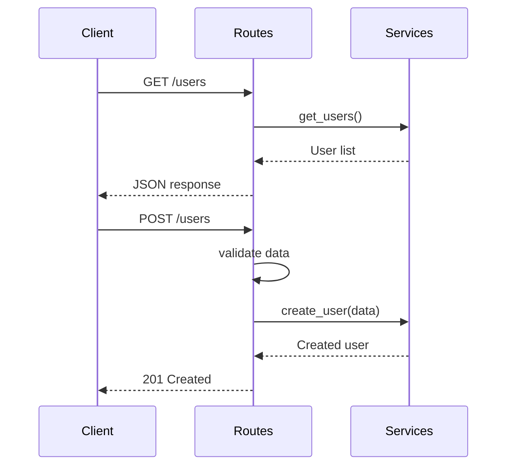
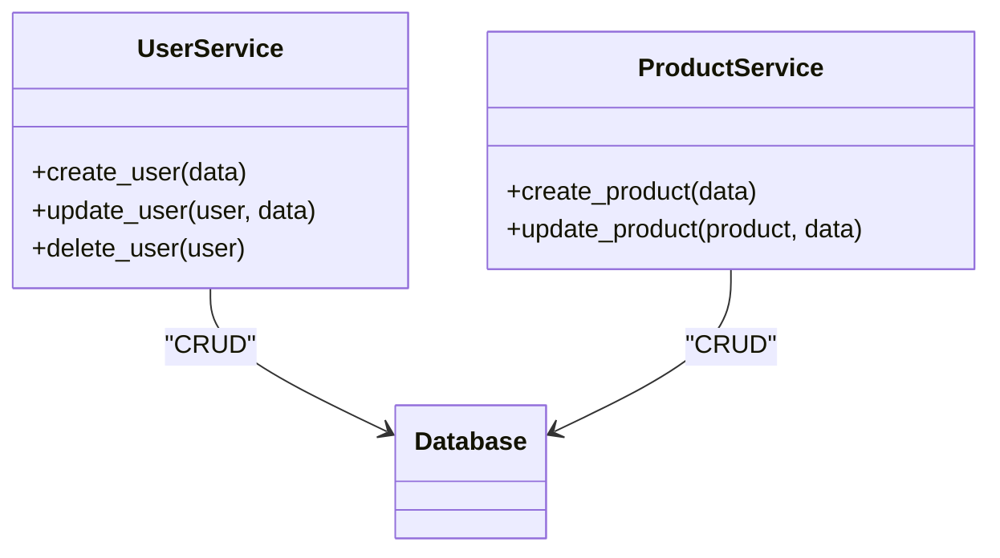
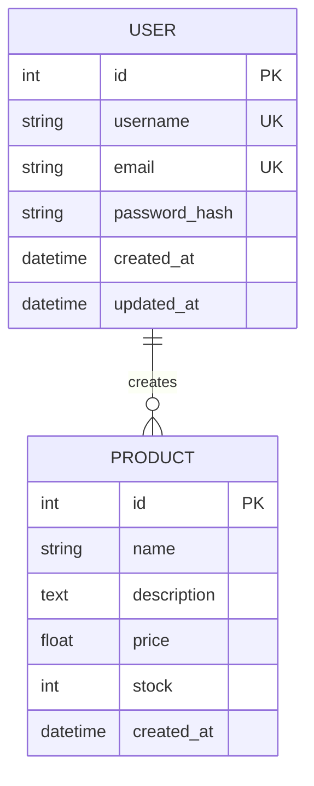
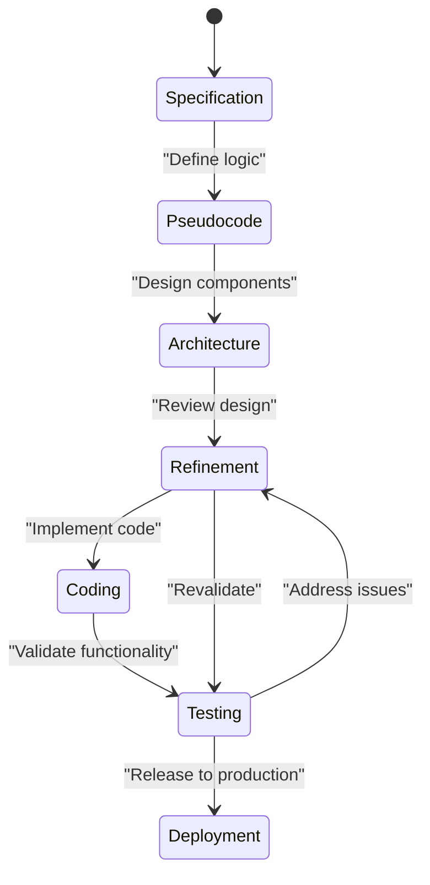
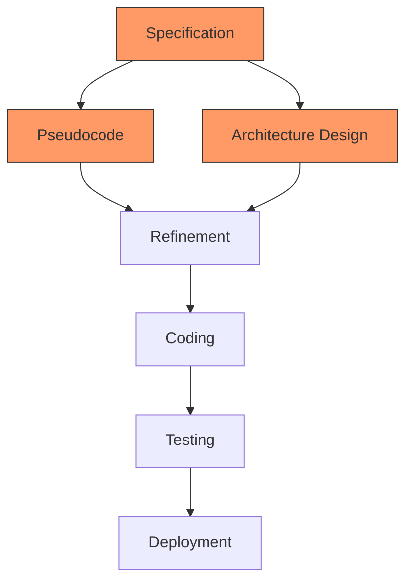

# SPARC Methodology Applications

<cite>
**Referenced Files in This Document**   
- [app.py](file://examples/flask-api-sparc/src/app.py)
- [routes.py](file://examples/flask-api-sparc/src/routes.py)
- [services.py](file://examples/flask-api-sparc/src/services.py)
- [models.py](file://examples/flask-api-sparc/src/models.py)
- [config.py](file://examples/flask-api-sparc/src/config.py)
- [test-plan.md](file://examples/flask-api-sparc/tests/test-plan.md)
- [review-report.md](file://examples/flask-api-sparc/review-report.md)
- [main.ts](file://examples/flask-api-sparc/src/main.ts)
</cite>

## Table of Contents
1. [Introduction](#introduction)
2. [Project Structure](#project-structure)
3. [Core Components](#core-components)
4. [Architecture Overview](#architecture-overview)
5. [Detailed Component Analysis](#detailed-component-analysis)
6. [SPARC Phase Transitions and Quality Gates](#sparc-phase-transitions-and-quality-gates)
7. [Performance Considerations and Optimization](#performance-considerations-and-optimization)
8. [Troubleshooting Guide](#troubleshooting-guide)
9. [Conclusion](#conclusion)

## Introduction
The SPARC (Specification, Pseudocode, Architecture, Refinement, Coding) methodology is a structured development workflow designed to enhance software quality, maintainability, and team collaboration. This document analyzes the implementation of SPARC principles in the `flask-api-sparc` example, a REST API built with Flask and TypeScript. The analysis covers the domain model, phase transitions, artifact generation, and quality gates that ensure robust development. By examining concrete code examples, we explore how SPARC guides the creation of scalable APIs, integrates with cognitive patterns, and orchestrates workflows. The document also addresses common challenges such as specification ambiguity and architectural drift, providing optimization strategies for efficient SPARC workflows.

## Project Structure
The `flask-api-sparc` example follows a modular structure that aligns with SPARC methodology principles. The project is organized into distinct directories for source code, tests, and configuration, promoting separation of concerns and ease of maintenance. Key components include Flask for the backend, TypeScript for frontend logic, and Docker for containerization. The structure supports parallel development phases and clear phase transitions, essential for SPARC workflows.

```mermaid
graph TD
subgraph "Source Code"
A[src] --> B[app.py]
A --> C[routes.py]
A --> D[services.py]
A --> E[models.py]
A --> F[config.py]
A --> G[main.ts]
end
subgraph "Tests"
H[tests] --> I[test-plan.md]
H --> J[test_test_models.py]
H --> K[test_test_services.py]
end
subgraph "Configuration"
L[Dockerfile]
M[docker-compose.yml]
N[requirements.txt]
O[package.json]
end
subgraph "Documentation"
P[review-report.md]
end
A --> H : "Dependencies"
A --> L : "Containerization"
H --> P : "Quality Assessment"
```

**Diagram sources**
- [app.py](file://examples/flask-api-sparc/src/app.py#L1-L28)
- [routes.py](file://examples/flask-api-sparc/src/routes.py#L1-L68)
- [services.py](file://examples/flask-api-sparc/src/services.py#L1-L59)
- [models.py](file://examples/flask-api-sparc/src/models.py#L1-L47)
- [config.py](file://examples/flask-api-sparc/src/config.py#L1-L28)
- [test-plan.md](file://examples/flask-api-sparc/tests/test-plan.md#L1-L12)
- [review-report.md](file://examples/flask-api-sparc/review-report.md#L1-L41)

**Section sources**
- [app.py](file://examples/flask-api-sparc/src/app.py#L1-L28)
- [routes.py](file://examples/flask-api-sparc/src/routes.py#L1-L68)
- [services.py](file://examples/flask-api-sparc/src/services.py#L1-L59)
- [models.py](file://examples/flask-api-sparc/src/models.py#L1-L47)
- [config.py](file://examples/flask-api-sparc/src/config.py#L1-L28)
- [test-plan.md](file://examples/flask-api-sparc/tests/test-plan.md#L1-L12)
- [review-report.md](file://examples/flask-api-sparc/review-report.md#L1-L41)

## Core Components
The core components of the `flask-api-sparc` application include the Flask application, API routes, business logic services, data models, and configuration. These components are designed to support the SPARC methodology by clearly separating concerns and enabling phase-specific development. The Flask application serves as the entry point, while the routes handle HTTP requests, services encapsulate business logic, models define the data schema, and configuration manages environment settings.

**Section sources**
- [app.py](file://examples/flask-api-sparc/src/app.py#L1-L28)
- [routes.py](file://examples/flask-api-sparc/src/routes.py#L1-L68)
- [services.py](file://examples/flask-api-sparc/src/services.py#L1-L59)
- [models.py](file://examples/flask-api-sparc/src/models.py#L1-L47)
- [config.py](file://examples/flask-api-sparc/src/config.py#L1-L28)

## Architecture Overview
The architecture of the `flask-api-sparc` application follows a layered design that aligns with SPARC principles. The presentation layer consists of API routes, the business logic layer includes services, and the data access layer comprises models. This separation enables independent development and testing of each layer, facilitating parallelization of SPARC phases. The architecture also supports quality gates through comprehensive testing and code review.



**Diagram sources**
- [app.py](file://examples/flask-api-sparc/src/app.py#L1-L28)
- [routes.py](file://examples/flask-api-sparc/src/routes.py#L1-L68)
- [services.py](file://examples/flask-api-sparc/src/services.py#L1-L59)
- [models.py](file://examples/flask-api-sparc/src/models.py#L1-L47)
- [config.py](file://examples/flask-api-sparc/src/config.py#L1-L28)
- [test-plan.md](file://examples/flask-api-sparc/tests/test-plan.md#L1-L12)

## Detailed Component Analysis

### Flask Application Analysis
The Flask application is implemented in `app.py` and serves as the entry point for the REST API. It initializes the Flask app, configures extensions like CORS, and registers blueprints for API routes. The application also includes a health check endpoint to monitor service status.



**Diagram sources**
- [app.py](file://examples/flask-api-sparc/src/app.py#L1-L28)
- [config.py](file://examples/flask-api-sparc/src/config.py#L1-L28)

**Section sources**
- [app.py](file://examples/flask-api-sparc/src/app.py#L1-L28)
- [config.py](file://examples/flask-api-sparc/src/config.py#L1-L28)

### API Routes Analysis
The API routes are defined in `routes.py` and handle HTTP requests for user and product management. Each route includes validation and error handling to ensure data integrity. The routes delegate business logic to services, promoting separation of concerns.



**Diagram sources**
- [routes.py](file://examples/flask-api-sparc/src/routes.py#L1-L68)
- [services.py](file://examples/flask-api-sparc/src/services.py#L1-L59)

**Section sources**
- [routes.py](file://examples/flask-api-sparc/src/routes.py#L1-L68)
- [services.py](file://examples/flask-api-sparc/src/services.py#L1-L59)

### Business Logic Services Analysis
The business logic services are implemented in `services.py` and encapsulate the core functionality of the application. Services handle operations like user and product creation, update, and deletion, ensuring data consistency through database transactions.



**Diagram sources**
- [services.py](file://examples/flask-api-sparc/src/services.py#L1-L59)
- [models.py](file://examples/flask-api-sparc/src/models.py#L1-L47)

**Section sources**
- [services.py](file://examples/flask-api-sparc/src/services.py#L1-L59)
- [models.py](file://examples/flask-api-sparc/src/models.py#L1-L47)

### Data Models Analysis
The data models are defined in `models.py` and represent the database schema for users and products. Models include methods for data serialization and password hashing, ensuring security and ease of use.



**Diagram sources**
- [models.py](file://examples/flask-api-sparc/src/models.py#L1-L47)

**Section sources**
- [models.py](file://examples/flask-api-sparc/src/models.py#L1-L47)

## SPARC Phase Transitions and Quality Gates
The `flask-api-sparc` example demonstrates SPARC phase transitions through its development workflow. The Specification phase is represented by the API design in `routes.py`, where endpoints are clearly defined. The Pseudocode phase is evident in the structured comments and function signatures in `services.py`. The Architecture phase is reflected in the layered design, with clear separation between routes, services, and models. The Refinement phase includes code reviews and testing, as documented in `review-report.md`. The Coding phase is the implementation of the Flask application in `app.py`.

Quality gates are enforced through comprehensive testing and code review. The test plan in `test-plan.md` outlines unit, integration, E2E, and performance tests, targeting 80% coverage. The code review report in `review-report.md` assesses code quality, security, performance, and maintainability, providing recommendations for improvement.



**Diagram sources**
- [routes.py](file://examples/flask-api-sparc/src/routes.py#L1-L68)
- [services.py](file://examples/flask-api-sparc/src/services.py#L1-L59)
- [app.py](file://examples/flask-api-sparc/src/app.py#L1-L28)
- [test-plan.md](file://examples/flask-api-sparc/tests/test-plan.md#L1-L12)
- [review-report.md](file://examples/flask-api-sparc/review-report.md#L1-L41)

**Section sources**
- [routes.py](file://examples/flask-api-sparc/src/routes.py#L1-L68)
- [services.py](file://examples/flask-api-sparc/src/services.py#L1-L59)
- [app.py](file://examples/flask-api-sparc/src/app.py#L1-L28)
- [test-plan.md](file://examples/flask-api-sparc/tests/test-plan.md#L1-L12)
- [review-report.md](file://examples/flask-api-sparc/review-report.md#L1-L41)

## Performance Considerations and Optimization
The `flask-api-sparc` application includes several performance considerations and optimization opportunities. The architecture supports horizontal scaling, and caching is implemented to improve response times. Recommendations from the code review report include adding rate limiting, request logging, and performance monitoring.

Optimization strategies for SPARC workflows include parallelization of independent phases, such as running specification and pseudocode development concurrently. Resource allocation should prioritize computationally intensive steps like performance testing. Validation of phase outputs ensures that each phase meets quality standards before proceeding to the next.



**Diagram sources**
- [review-report.md](file://examples/flask-api-sparc/review-report.md#L1-L41)

**Section sources**
- [review-report.md](file://examples/flask-api-sparc/review-report.md#L1-L41)

## Troubleshooting Guide
Common issues in SPARC workflows include phase transition bottlenecks, specification ambiguity, and architectural drift. To address these, ensure clear communication between team members, use detailed specifications, and conduct regular architecture reviews. For performance issues, implement monitoring and logging to identify bottlenecks. Security vulnerabilities can be mitigated through comprehensive input validation and encryption.

**Section sources**
- [review-report.md](file://examples/flask-api-sparc/review-report.md#L1-L41)

## Conclusion
The `flask-api-sparc` example effectively demonstrates the application of SPARC methodology in developing a REST API with Flask and TypeScript. The structured workflow, clear phase transitions, and quality gates ensure high-quality, maintainable code. By following the principles outlined in this document, teams can leverage SPARC to enhance their development processes and deliver robust software solutions.