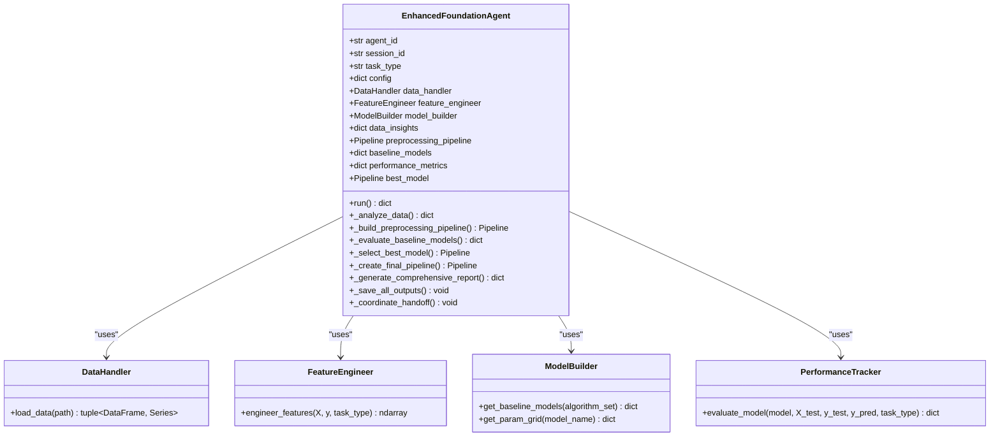
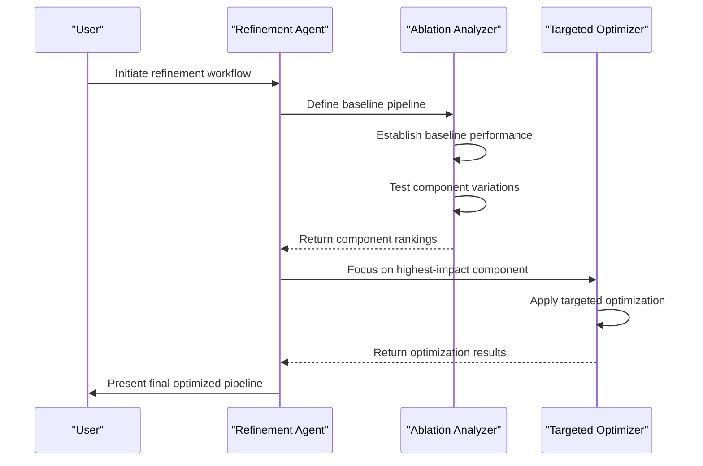
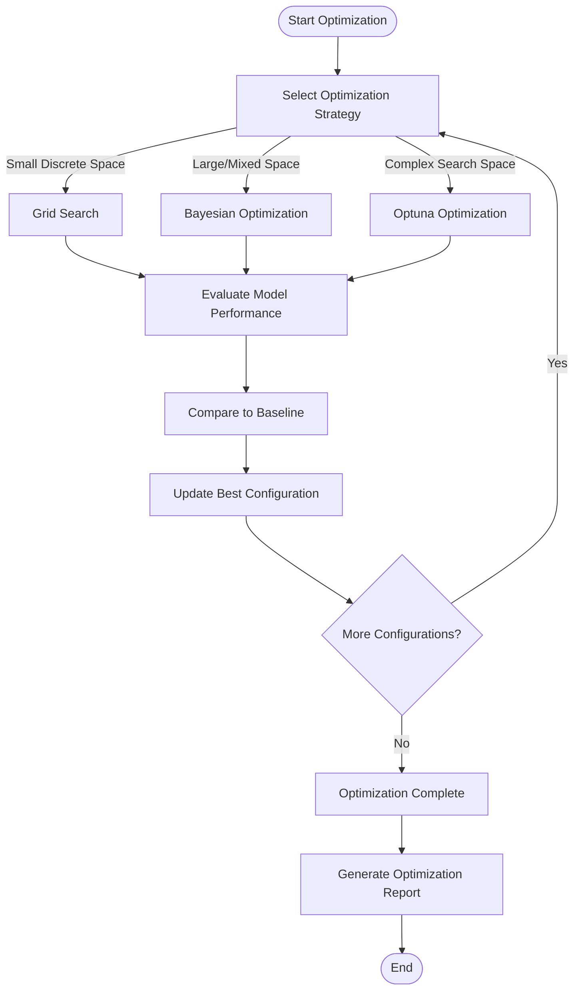
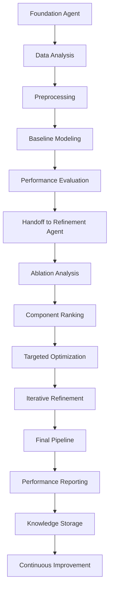

# Specialized Use Case Examples

<cite>
**Referenced Files in This Document**   
- [examples\ml_foundation\foundation_agent_enhanced.py](file://examples/ml_foundation/foundation_agent_enhanced.py)
- [examples\refinement_agent_workdir\refinement_demo.py](file://examples/refinement_agent_workdir/refinement_demo.py)
- [examples\refinement_agent_workdir\ablation_framework.py](file://examples/refinement_agent_workdir/ablation_framework.py)
- [examples\refinement_agent_workdir\targeted_optimizer.py](file://examples/refinement_agent_workdir/targeted_optimizer.py)
</cite>

## Table of Contents
1. [Machine Learning Foundation Agents](#machine-learning-foundation-agents)  
2. [Refinement Agents and Ablation Analysis](#refinement-agents-and-ablation-analysis)  
3. [SPARC Methodology Applications](#sparc-methodology-applications)  
4. [Pipeline Automation and Coordination](#pipeline-automation-and-coordination)  
5. [Performance Optimization and Resource Management](#performance-optimization-and-resource-management)  
6. [Troubleshooting Common Issues](#troubleshooting-common-issues)

## Machine Learning Foundation Agents

The **EnhancedFoundationAgent** is a specialized agent designed to automate the foundational stages of machine learning model development. It performs data analysis, preprocessing, baseline model evaluation, and pipeline construction with minimal user intervention.

The agent follows a structured workflow:
1. **Data Analysis**: Automatically detects data types, missing values, outliers, and target distribution.
2. **Preprocessing**: Applies appropriate transformations based on data characteristics.
3. **Model Selection**: Evaluates multiple baseline models using cross-validation.
4. **Pipeline Construction**: Creates a complete end-to-end ML pipeline.
5. **Handoff Coordination**: Passes results to downstream agents for refinement.



**Diagram sources**  
- [examples\ml_foundation\foundation_agent_enhanced.py](file://examples/ml_foundation/foundation_agent_enhanced.py#L1-L1000)

**Section sources**  
- [examples\ml_foundation\foundation_agent_enhanced.py](file://examples/ml_foundation/foundation_agent_enhanced.py#L1-L1000)

### Data Analysis and Preprocessing

The foundation agent begins by analyzing the dataset to understand its characteristics. It identifies numeric, categorical, and datetime features, detects missing values and outliers, and analyzes the target variable distribution.

```python
def _analyze_data(self, X: pd.DataFrame, y: pd.Series) -> Dict:
    """Comprehensive data analysis"""
    insights = {
        'data_shape': X.shape,
        'feature_types': X.dtypes.to_dict(),
        'missing_analysis': X.isnull().sum().to_dict(),
        'outlier_analysis': self._detect_outliers(X),
        'target_analysis': self._analyze_target(y)
    }
    return insights
```

Based on this analysis, it constructs an appropriate preprocessing pipeline using scikit-learn's `ColumnTransformer`:

```python
def _build_preprocessing_pipeline(self, X: pd.DataFrame) -> Pipeline:
    """Build preprocessing pipeline based on data analysis"""
    numeric_features = X.select_dtypes(include=[np.number]).columns
    categorical_features = X.select_dtypes(include=[object]).columns
    
    numeric_transformer = Pipeline(steps=[
        ('imputer', SimpleImputer(strategy='median')),
        ('scaler', StandardScaler())
    ])
    
    categorical_transformer = Pipeline(steps=[
        ('imputer', SimpleImputer(strategy='constant', fill_value='missing')),
        ('onehot', OneHotEncoder(handle_unknown='ignore'))
    ])
    
    preprocessor = ColumnTransformer(
        transformers=[
            ('num', numeric_transformer, numeric_features),
            ('cat', categorical_transformer, categorical_features)
        ]
    )
    
    return preprocessor
```

### Model Evaluation and Selection

The agent evaluates multiple baseline models appropriate for the detected task type (classification or regression). It uses cross-validation to ensure robust performance estimates.

```python
def _evaluate_baseline_models(self, X_train, X_test, y_train, y_test):
    """Evaluate multiple baseline models"""
    models = self.model_builder.get_baseline_models()
    
    for name, model in models.items():
        # Create pipeline with preprocessing
        pipeline = self._create_pipeline(model)
        
        # Cross-validation
        cv_scores = cross_val_score(pipeline, X_train, y_train, cv=5)
        
        # Final evaluation
        pipeline.fit(X_train, y_train)
        y_pred = pipeline.predict(X_test)
        
        # Comprehensive evaluation
        metrics = self.performance_tracker.evaluate_model(
            pipeline, X_test, y_test, y_pred, self.task_type
        )
        
        self.performance_metrics[name] = metrics
        self.baseline_models[name] = pipeline
```

The best-performing model is selected based on the appropriate metric (F1-score for classification, R² for regression).

## Refinement Agents and Ablation Analysis

Refinement agents specialize in optimizing existing machine learning pipelines by identifying high-impact components and applying targeted optimization techniques. The **MLE-STAR Refinement Agent** implements a systematic approach to model improvement.

### Ablation Analysis Framework

The ablation analysis framework systematically evaluates the impact of different pipeline components by testing various configurations and measuring their effect on performance.



**Diagram sources**  
- [examples\refinement_agent_workdir\ablation_framework.py](file://examples/refinement_agent_workdir/ablation_framework.py#L1-L333)  
- [examples\refinement_agent_workdir\targeted_optimizer.py](file://examples/refinement_agent_workdir/targeted_optimizer.py#L1-L551)

**Section sources**  
- [examples\refinement_agent_workdir\refinement_demo.py](file://examples/refinement_agent_workdir/refinement_demo.py#L1-L345)  
- [examples\refinement_agent_workdir\ablation_framework.py](file://examples/refinement_agent_workdir/ablation_framework.py#L1-L333)

The `AblationAnalyzer` class implements the core ablation logic:

```python
class AblationAnalyzer:
    def run_full_ablation(self, components_to_test: Dict[str, List], X, y) -> Dict:
        """Run ablation analysis on all specified components"""
        # Establish baseline performance
        self.baseline_performance, _ = self.evaluate_pipeline(
            self.baseline_pipeline, X, y
        )
        
        component_impacts = {}
        for component_name, configs in components_to_test.items():
            results = self.ablate_component(component_name, configs, X, y)
            
            # Calculate average and maximum impact
            avg_impact = np.mean([r.impact_score for r in results])
            max_impact = max([r.impact_score for r in results])
            component_impacts[component_name] = {
                'average_impact': avg_impact,
                'max_impact': max_impact
            }
        
        # Rank components by impact
        ranked_components = sorted(
            component_impacts.items(),
            key=lambda x: abs(x[1]['max_impact']),
            reverse=True
        )
        
        return {
            'baseline_performance': self.baseline_performance,
            'component_rankings': ranked_components,
            'highest_impact_component': ranked_components[0][0]
        }
```

### Targeted Optimization Strategies

Once high-impact components are identified, the refinement agent applies targeted optimization using multiple strategies:



**Diagram sources**  
- [examples\refinement_agent_workdir\targeted_optimizer.py](file://examples/refinement_agent_workdir/targeted_optimizer.py#L1-L551)

The `TargetedOptimizer` class supports three optimization methods:

1. **Grid Search**: For small, discrete parameter spaces
2. **Bayesian Optimization**: For continuous and mixed parameter spaces
3. **Optuna**: For complex search spaces with pruning capabilities

```python
class TargetedOptimizer:
    def optimize_hyperparameters_grid(self, estimator, param_grid, X, y, component_name):
        """Grid search optimization"""
        grid_search = GridSearchCV(
            estimator=estimator,
            param_grid=param_grid,
            cv=5,
            scoring='accuracy',
            n_jobs=-1
        )
        grid_search.fit(X, y)
        return OptimizationResult(
            component_name=component_name,
            optimization_method='grid_search',
            best_params=grid_search.best_params_,
            best_score=grid_search.best_score_
        )
    
    def optimize_hyperparameters_bayesian(self, estimator, search_spaces, X, y, component_name):
        """Bayesian optimization"""
        bayes_search = BayesSearchCV(
            estimator=estimator,
            search_spaces=search_spaces,
            n_iter=50,
            cv=5,
            scoring='accuracy',
            n_jobs=-1
        )
        bayes_search.fit(X, y)
        return OptimizationResult(
            component_name=component_name,
            optimization_method='bayesian_optimization',
            best_params=bayes_search.best_params_,
            best_score=bayes_search.best_score_
        )
    
    def optimize_with_optuna(self, objective_func, component_name, n_trials):
        """Optuna optimization with pruning"""
        study = optuna.create_study(
            direction='maximize',
            sampler=optuna.samplers.TPESampler(),
            pruner=optuna.pruners.MedianPruner()
        )
        study.optimize(objective_func, n_trials=n_trials)
        return OptimizationResult(
            component_name=component_name,
            optimization_method='optuna',
            best_params=study.best_trial.params,
            best_score=study.best_trial.value
        )
```

## SPARC Methodology Applications

The SPARC (Systematic, Precise, Adaptive, Robust, Continuous) methodology is implemented through a coordinated system of specialized agents that work together to achieve optimal machine learning outcomes.

### SPARC Workflow Implementation

The SPARC methodology follows a systematic workflow that ensures precise, adaptive, and continuous improvement of machine learning models:



**Diagram sources**  
- [examples\ml_foundation\foundation_agent_enhanced.py](file://examples/ml_foundation/foundation_agent_enhanced.py#L1-L1000)  
- [examples\refinement_agent_workdir\refinement_demo.py](file://examples/refinement_agent_workdir/refinement_demo.py#L1-L345)

The workflow begins with the Foundation Agent establishing a baseline, then hands off to the Refinement Agent for optimization. Results are stored in the system's memory for future reference and continuous improvement.

### Adaptive Optimization with SPARC

The AdaptiveOptimizer class implements the adaptive aspect of SPARC by automatically selecting the most appropriate optimization strategy based on the characteristics of the search space:

```python
class AdaptiveOptimizer:
    def optimize_adaptive(self, component_name, search_space, estimator, X, y):
        """Automatically choose optimization method"""
        n_params = len(search_space)
        n_discrete = sum(1 for v in search_space.values() if isinstance(v, list))
        n_continuous = n_params - n_discrete
        
        # Calculate total search space size
        total_combinations = 1
        for param, values in search_space.items():
            if isinstance(values, list):
                total_combinations *= len(values)
            else:
                total_combinations *= 100  # Approximate for continuous
        
        # Choose method based on search space characteristics
        if total_combinations < 100 and n_continuous == 0:
            return self.optimizer.optimize_hyperparameters_grid(
                estimator, search_space, X, y, component_name
            )
        elif n_continuous > 0 or total_combinations > 1000:
            return self.optimizer.optimize_hyperparameters_bayesian(
                estimator, skopt_space, X, y, component_name, n_iter=50
            )
        else:
            return self.optimizer.optimize_with_random_search(
                estimator, search_space, X, y, component_name, n_iter=50
            )
```

This adaptive approach ensures that computational resources are used efficiently, applying the most appropriate optimization method for each specific scenario.

## Pipeline Automation and Coordination

The system implements sophisticated coordination mechanisms that enable seamless handoff between specialized agents and ensure end-to-end pipeline automation.

### Agent Coordination System

Agents coordinate through a shared memory system and event hooks, enabling them to pass data and trigger downstream processes:

```python
def _coordinate_handoff(self, results: Dict):
    """Coordinate handoff to next agent"""
    try:
        # Store results for next agent
        handoff_data = {
            'from': self.agent_id,
            'to': 'refinement_agent',
            'session': self.session_id,
            'timestamp': datetime.now().isoformat(),
            'best_baseline_score': max(
                m.get('cv_score', 0) for m in self.performance_metrics.values()
            ),
            'pipeline_path': str(Path(self.config['output']['output_dir']) / 'final_pipeline.pkl'),
            'recommendations': results['recommendations']
        }
        
        cmd = f"npx claude-flow@alpha memory store 'agent/{self.agent_id}/handoff' '{json.dumps(handoff_data)}'"
        subprocess.run(cmd, shell=True, capture_output=True)
        
        # Notify completion
        cmd = f"npx claude-flow@alpha hooks post-task --task-id '{self.agent_id}' --analyze-performance true"
        subprocess.run(cmd, shell=True, capture_output=True)
        
    except Exception as e:
        logger.warning(f"Handoff coordination warning: {e}")
```

The coordination system uses the `claude-flow` CLI to store data in shared memory and trigger hooks that notify downstream agents of completed tasks.

### Iterative Refinement Process

The iterative refinement process continuously improves model performance by cycling through optimization iterations:

```python
def iterative_refinement(self, components: Dict[str, Dict], X, y, max_iterations: int = 5):
    """Iteratively refine multiple components"""
    refinement_history = []
    current_best_score = self.baseline_score
    
    for iteration in range(max_iterations):
        iteration_results = {}
        
        for component_name, component_config in components.items():
            method = component_config.get('method', 'grid')
            
            if method == 'grid':
                result = self.optimize_hyperparameters_grid(
                    estimator=component_config['estimator'],
                    param_grid=component_config['param_grid'],
                    X=X, y=y,
                    component_name=f"{component_name}_iter{iteration}"
                )
            elif method == 'bayesian':
                result = self.optimize_hyperparameters_bayesian(
                    estimator=component_config['estimator'],
                    search_spaces=component_config['search_spaces'],
                    X=X, y=y,
                    component_name=f"{component_name}_iter{iteration}",
                    n_iter=component_config.get('n_iter', 50)
                )
            
            iteration_results[component_name] = result
            
            # Update estimator with best params for next iteration
            if result.best_score > current_best_score:
                component_config['estimator'].set_params(**result.best_params)
                current_best_score = result.best_score
        
        refinement_history.append({
            'iteration': iteration + 1,
            'results': iteration_results,
            'best_score': current_best_score,
            'improvement': self._calculate_improvement(current_best_score)
        })
        
        # Early stopping if no improvement
        if iteration > 0:
            prev_score = refinement_history[-2]['best_score']
            if current_best_score - prev_score < 0.001:
                break
    
    return {
        'total_iterations': len(refinement_history),
        'final_best_score': current_best_score,
        'total_improvement': self._calculate_improvement(current_best_score),
        'refinement_history': refinement_history
    }
```

This iterative approach allows for progressive improvement, with each iteration building on the successes of the previous one.

## Performance Optimization and Resource Management

The system implements several strategies to optimize performance and manage computational resources effectively.

### Resource Management Strategies

For computationally intensive tasks, the system employs several resource management techniques:

1. **Parallel Processing**: Utilizes multiple CPU cores for model training and evaluation
2. **Memory Efficiency**: Implements efficient data structures and garbage collection
3. **Early Stopping**: Terminates optimization when no further improvement is observed
4. **Adaptive Sampling**: Adjusts sample sizes based on dataset characteristics

```python
# Example of parallel processing configuration
grid_search = GridSearchCV(
    estimator=estimator,
    param_grid=param_grid,
    cv=5,
    scoring='accuracy',
    n_jobs=-1,  # Use all available cores
    verbose=1
)
```

The `n_jobs=-1` parameter instructs scikit-learn to use all available CPU cores, maximizing computational efficiency.

### Optimization Tips for Computationally Intensive Tasks

When working with large datasets or complex models, consider the following optimization tips:

1. **Start with a smaller subset** of data for initial testing and parameter tuning
2. **Use appropriate data types** (e.g., float32 instead of float64 when precision allows)
3. **Implement caching** for expensive computations
4. **Monitor memory usage** and implement batch processing for large datasets
5. **Use approximate methods** when exact solutions are not required

```python
# Example of memory-efficient data processing
def process_large_dataset_in_batches(df, batch_size=10000):
    """Process large dataset in batches to manage memory usage"""
    results = []
    for i in range(0, len(df), batch_size):
        batch = df.iloc[i:i+batch_size]
        # Process batch
        batch_result = process_batch(batch)
        results.append(batch_result)
    return pd.concat(results)
```

## Troubleshooting Common Issues

This section addresses common issues encountered when working with specialized agents and provides solutions and workarounds.

### Domain Knowledge Gaps

**Issue**: The agent may lack specific domain knowledge required for optimal feature engineering or model selection.

**Solution**: Provide domain-specific configuration and guidance through the agent's configuration system:

```python
# Example configuration for domain-specific knowledge
config = {
    'domain_knowledge': {
        'medical': {
            'important_features': ['age', 'blood_pressure', 'cholesterol'],
            'feature_interactions': [('age', 'blood_pressure')],
            'preferred_models': ['random_forest', 'gradient_boosting']
        }
    }
}
```

### Model Convergence Problems

**Issue**: Optimization processes may fail to converge or take excessive time.

**Solution**: Implement early stopping and adaptive optimization strategies:

```python
# Configure early stopping
study = optuna.create_study(
    direction='maximize',
    pruner=optuna.pruners.MedianPruner(n_startup_trials=5, n_warmup_steps=10)
)

# Set reasonable limits
study.optimize(objective, n_trials=100, timeout=3600)  # 1 hour timeout
```

### Pipeline Bottlenecks

**Issue**: Certain pipeline components may create performance bottlenecks.

**Solution**: Use ablation analysis to identify high-impact components and focus optimization efforts:

```python
# Use ablation analysis to identify bottlenecks
ablation_results = ablation_analyzer.run_full_ablation(
    components_to_test=components_to_test,
    X=X_train,
    y=y_train
)

# Focus optimization on highest impact component
highest_impact = ablation_results['highest_impact_component']
logger.info(f"Optimizing {highest_impact} for maximum impact")
```

### Resource Limitations

**Issue**: Computational resources may be insufficient for large-scale optimization.

**Solution**: Implement resource-aware optimization strategies:

```python
def optimize_with_resource_constraints(estimator, param_grid, X, y, max_memory_gb=4):
    """Optimize with memory constraints"""
    # Estimate memory usage
    sample_size = min(1000, len(X))
    estimated_memory_per_trial = estimate_memory_usage(estimator, X[:sample_size])
    
    # Calculate maximum number of parallel jobs
    max_jobs = max(1, int(max_memory_gb / estimated_memory_per_trial))
    
    # Run optimization with limited parallelism
    grid_search = GridSearchCV(
        estimator=estimator,
        param_grid=param_grid,
        cv=5,
        n_jobs=max_jobs,
        pre_dispatch=f'{max_jobs*2}jobs'
    )
    grid_search.fit(X, y)
    return grid_search
```

By addressing these common issues proactively, users can ensure smooth operation of specialized agents and achieve optimal results from their machine learning workflows.