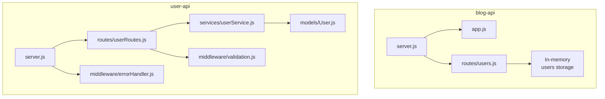
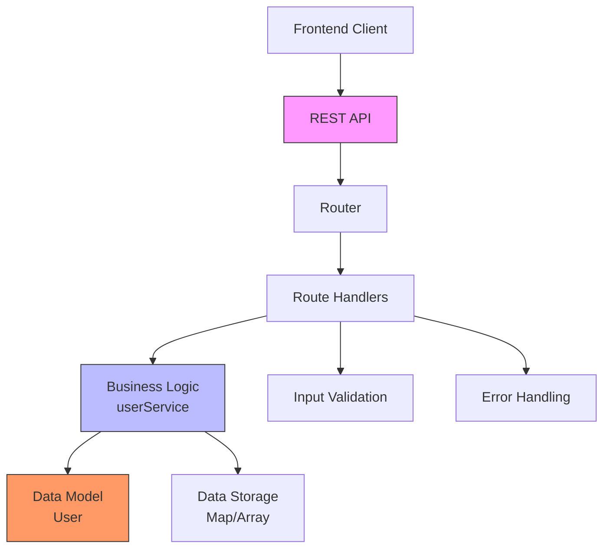
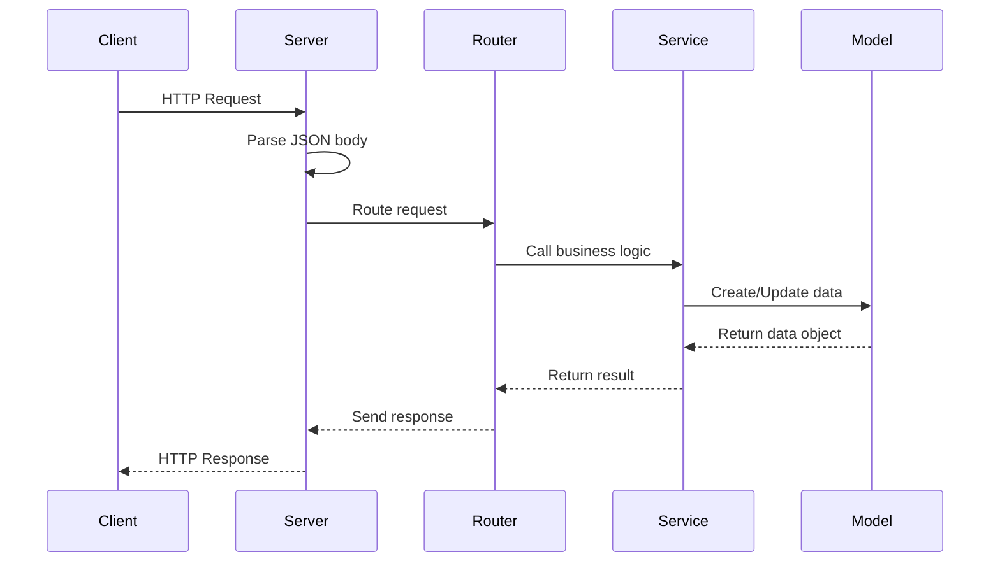
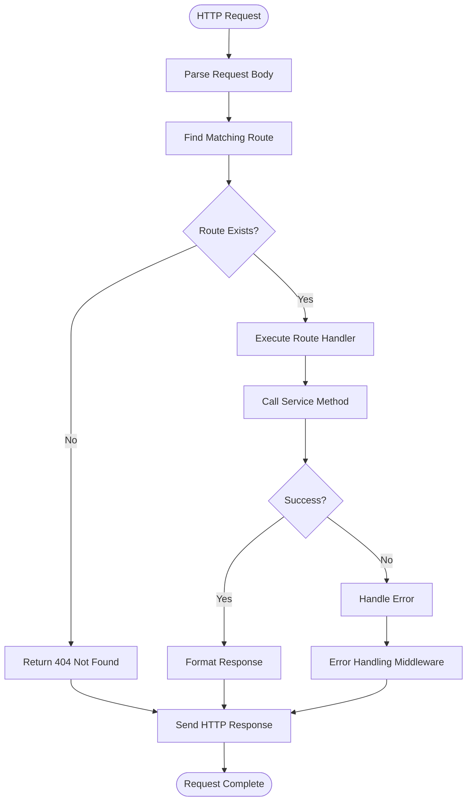
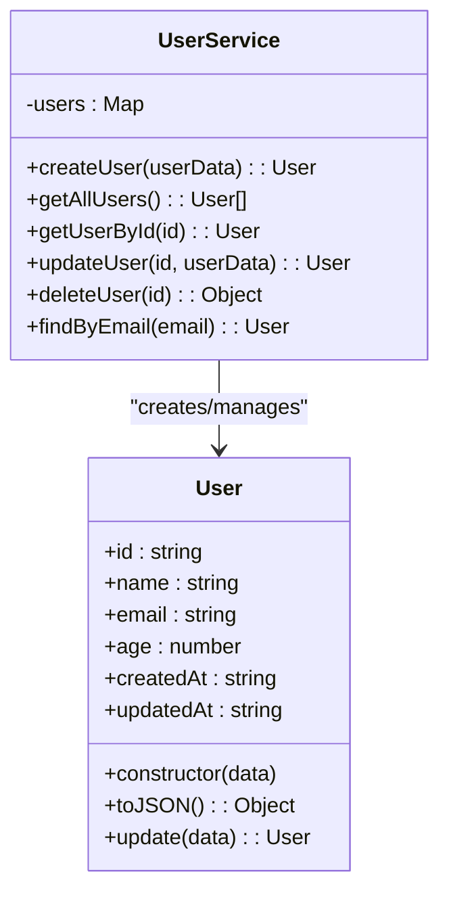
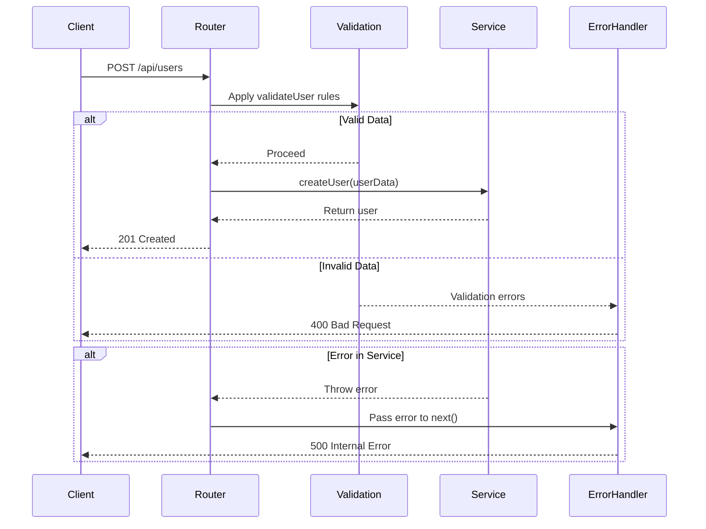

# Full-Stack Application Development

<cite>
**Referenced Files in This Document**   
- [server.js](file://examples/blog-api/server.js)
- [users.js](file://examples/blog-api/routes/users.js)
- [package.json](file://examples/blog-api/package.json)
- [server.js](file://examples/user-api/server.js)
- [User.js](file://examples/user-api/models/User.js)
- [userService.js](file://examples/user-api/services/userService.js)
- [userRoutes.js](file://examples/user-api/routes/userRoutes.js)
- [validation.js](file://examples/user-api/middleware/validation.js)
- [errorHandler.js](file://examples/user-api/middleware/errorHandler.js)
- [package.json](file://examples/user-api/package.json)
</cite>

## Table of Contents
1. [Introduction](#introduction)
2. [Project Structure](#project-structure)
3. [Core Components](#core-components)
4. [Architecture Overview](#architecture-overview)
5. [Detailed Component Analysis](#detailed-component-analysis)
6. [Dependency Analysis](#dependency-analysis)
7. [Performance Considerations](#performance-considerations)
8. [Troubleshooting Guide](#troubleshooting-guide)
9. [Conclusion](#conclusion)

## Introduction
This document provides a comprehensive analysis of full-stack application development using Claude-Flow, focusing on end-to-end application creation patterns. The analysis covers concrete examples from the `blog-api` and `user-api` applications, which demonstrate how swarm-generated applications implement client-server architecture, data flow patterns, and state management. The document explains the relationship between frontend requirements and backend implementation, showing how agent coordination produces cohesive full-stack solutions with proper routing, data models, and business logic implementation across the stack.

## Project Structure
The full-stack applications in the Claude-Flow repository follow a structured directory organization that separates concerns and promotes maintainability. The `blog-api` and `user-api` examples demonstrate a clear separation between routes, models, services, and middleware components. This structure enables swarm agents to coordinate effectively during application generation, with different agents responsible for specific layers of the application stack.



**Diagram sources**
- [server.js](file://examples/blog-api/server.js#L1-L32)
- [users.js](file://examples/blog-api/routes/users.js#L1-L54)
- [server.js](file://examples/user-api/server.js#L1-L76)
- [userRoutes.js](file://examples/user-api/routes/userRoutes.js#L1-L56)
- [userService.js](file://examples/user-api/services/userService.js#L1-L62)
- [User.js](file://examples/user-api/models/User.js#L1-L33)

**Section sources**
- [server.js](file://examples/blog-api/server.js#L1-L32)
- [users.js](file://examples/blog-api/routes/users.js#L1-L54)
- [server.js](file://examples/user-api/server.js#L1-L76)

## Core Components
The core components of the full-stack applications generated by Claude-Flow include the server entry point, routing system, business logic services, data models, and middleware for validation and error handling. These components work together to create a cohesive application architecture that follows REST principles and provides a clean separation of concerns. The `user-api` example demonstrates a more sophisticated implementation with proper service layer abstraction and input validation, while the `blog-api` provides a simpler implementation that focuses on core functionality.

**Section sources**
- [server.js](file://examples/blog-api/server.js#L1-L32)
- [users.js](file://examples/blog-api/routes/users.js#L1-L54)
- [server.js](file://examples/user-api/server.js#L1-L76)
- [userRoutes.js](file://examples/user-api/routes/userRoutes.js#L1-L56)

## Architecture Overview
The full-stack applications generated by Claude-Flow follow a traditional server-side MVC-inspired architecture with clear separation between presentation (routes), business logic (services), and data (models). The architecture is designed to be lightweight and focused on API delivery, making it suitable for integration with various frontend frameworks. The applications use Express.js as the web framework, providing a robust set of features for building web applications and APIs.



**Diagram sources**
- [server.js](file://examples/user-api/server.js#L1-L76)
- [userRoutes.js](file://examples/user-api/routes/userRoutes.js#L1-L56)
- [userService.js](file://examples/user-api/services/userService.js#L1-L62)
- [User.js](file://examples/user-api/models/User.js#L1-L33)
- [validation.js](file://examples/user-api/middleware/validation.js#L1-L46)
- [errorHandler.js](file://examples/user-api/middleware/errorHandler.js#L1-L15)

## Detailed Component Analysis

### Server Implementation
The server implementation in both `blog-api` and `user-api` follows a similar pattern, using Express.js to create a web server that listens for HTTP requests. The server sets up middleware for JSON parsing and URL encoding, defines API routes, and implements error handling. The `blog-api` includes CORS middleware to enable cross-origin requests, which is essential for full-stack applications where the frontend and backend are served from different domains.



**Diagram sources**
- [server.js](file://examples/blog-api/server.js#L1-L32)
- [server.js](file://examples/user-api/server.js#L1-L76)

**Section sources**
- [server.js](file://examples/blog-api/server.js#L1-L32)
- [server.js](file://examples/user-api/server.js#L1-L76)

### Routing System
The routing system in the full-stack applications is implemented using Express.js routers, which provide a clean way to define API endpoints and their handlers. The `user-api` demonstrates a more sophisticated routing pattern with proper error handling using try-catch blocks and middleware composition. Each route is associated with a specific HTTP method and URL path, and the handlers delegate business logic to service layer methods.



**Diagram sources**
- [users.js](file://examples/blog-api/routes/users.js#L1-L54)
- [userRoutes.js](file://examples/user-api/routes/userRoutes.js#L1-L56)

**Section sources**
- [users.js](file://examples/blog-api/routes/users.js#L1-L54)
- [userRoutes.js](file://examples/user-api/routes/userRoutes.js#L1-L56)

### Business Logic and Service Layer
The service layer in the `user-api` application demonstrates proper separation of business logic from routing concerns. The `UserService` class encapsulates all user-related operations, including creation, retrieval, update, and deletion. It implements business rules such as preventing duplicate email addresses and maintaining data consistency. The service uses a Map for in-memory storage, which provides O(1) lookup performance for user operations.



**Diagram sources**
- [userService.js](file://examples/user-api/services/userService.js#L1-L62)
- [User.js](file://examples/user-api/models/User.js#L1-L33)

**Section sources**
- [userService.js](file://examples/user-api/services/userService.js#L1-L62)
- [User.js](file://examples/user-api/models/User.js#L1-L33)

### Data Validation and Error Handling
The full-stack applications implement comprehensive input validation and error handling to ensure data integrity and provide meaningful error messages to clients. The `user-api` uses express-validator middleware to validate request data against defined rules, checking for required fields, data types, and value constraints. Errors are handled consistently through middleware that catches exceptions from route handlers and returns appropriate HTTP status codes and error messages.



**Diagram sources**
- [validation.js](file://examples/user-api/middleware/validation.js#L1-L46)
- [userRoutes.js](file://examples/user-api/routes/userRoutes.js#L1-L56)
- [errorHandler.js](file://examples/user-api/middleware/errorHandler.js#L1-L15)

**Section sources**
- [validation.js](file://examples/user-api/middleware/validation.js#L1-L46)
- [userRoutes.js](file://examples/user-api/routes/userRoutes.js#L1-L56)
- [errorHandler.js](file://examples/user-api/middleware/errorHandler.js#L1-L15)

## Dependency Analysis
The full-stack applications have minimal dependencies, focusing on essential packages for web development. The `blog-api` has no explicit dependencies listed in its package.json, relying on Node.js built-in modules and assuming Express.js is available in the environment. The `user-api` explicitly depends on Express.js for the web framework, with devDependencies for testing (Jest, Supertest) and development (nodemon). This minimal dependency approach reduces the attack surface and simplifies deployment.

```mermaid
graph LR
A[blog-api] --> B[Node.js]
A --> C[Express.js*]
D[user-api] --> E[Node.js]
D --> F[Express.js]
D --> G[Jest]
D --> H[Supertest]
D --> I[nodemon]
style C stroke-dasharray:5,5
classDef optional stroke-dasharray:5,5;
class C optional;
note right of C
*Assumed to be available
in the environment
end note
```

**Diagram sources**
- [package.json](file://examples/blog-api/package.json#L1-L18)
- [package.json](file://examples/user-api/package.json#L1-L31)

**Section sources**
- [package.json](file://examples/blog-api/package.json#L1-L18)
- [package.json](file://examples/user-api/package.json#L1-L31)

## Performance Considerations
The full-stack applications demonstrate several performance considerations that are important for real-world deployment. The in-memory data storage used in both examples provides fast access but is not persistent across server restarts. For production applications, this would need to be replaced with a database system. The use of Map objects for user storage in the `user-api` provides O(1) lookup performance, which is optimal for user retrieval operations. The applications also implement proper HTTP status codes and response formatting to minimize client-server round trips.

Key performance considerations include:
- **Data Storage**: In-memory storage is fast but not persistent; consider database integration for production
- **Error Handling**: Centralized error handling middleware reduces code duplication and ensures consistent error responses
- **Input Validation**: Early validation prevents invalid data from propagating through the system
- **Response Formatting**: Consistent JSON responses make it easier for clients to parse and use API data
- **Middleware Efficiency**: Minimal middleware stack reduces request processing overhead

**Section sources**
- [userService.js](file://examples/user-api/services/userService.js#L1-L62)
- [server.js](file://examples/user-api/server.js#L1-L76)
- [userRoutes.js](file://examples/user-api/routes/userRoutes.js#L1-L56)

## Troubleshooting Guide
When developing full-stack applications with Claude-Flow, several common issues may arise. This guide provides solutions for the most frequent problems encountered during development and deployment.

### CORS Configuration Issues
If the frontend cannot connect to the backend due to CORS errors, ensure that the CORS middleware is properly configured in the server.js file:

```javascript
const cors = require('cors');
app.use(cors());
```

For more restrictive CORS policies, configure specific origins:

```javascript
app.use(cors({
  origin: ['http://localhost:3000', 'https://your-frontend.com']
}));
```

### Data Serialization Mismatches
Ensure that request bodies are properly parsed by including the JSON middleware:

```javascript
app.use(express.json());
app.use(express.urlencoded({ extended: true }));
```

Verify that the frontend is sending data in the expected format (usually JSON) and that the backend is correctly parsing it.

### Authentication Token Handling
For applications requiring authentication, ensure that tokens are properly included in requests:

```javascript
// Frontend example
fetch('/api/protected', {
  headers: {
    'Authorization': `Bearer ${token}`
  }
});

// Backend middleware
app.use((req, res, next) => {
  const token = req.headers['authorization']?.split(' ')[1];
  if (!token) return res.status(401).json({ error: 'No token provided' });
  // Verify token and attach user to request
  next();
});
```

### Common Error Scenarios
- **404 Not Found**: Check route definitions and ensure they match the requested URL
- **400 Bad Request**: Validate input data against the expected schema
- **500 Internal Server Error**: Check server logs for unhandled exceptions
- **CORS Errors**: Verify CORS middleware is configured correctly
- **Database Connection Issues**: Ensure database credentials and connection strings are correct

**Section sources**
- [server.js](file://examples/blog-api/server.js#L1-L32)
- [server.js](file://examples/user-api/server.js#L1-L76)
- [validation.js](file://examples/user-api/middleware/validation.js#L1-L46)

## Conclusion
The full-stack applications generated by Claude-Flow demonstrate effective patterns for end-to-end application development. The examples show how swarm agents can coordinate to produce cohesive solutions with proper separation of concerns, clean API design, and robust error handling. The architecture follows established best practices for Node.js web applications, using Express.js as the foundation and organizing code into logical components. While the examples use in-memory storage for simplicity, they provide a solid foundation that can be extended with database integration, authentication, and other features required for production applications. The consistent patterns across the examples make it easier to understand and maintain swarm-generated code, and the minimal dependency approach ensures applications are lightweight and focused on core functionality.