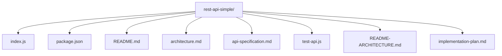
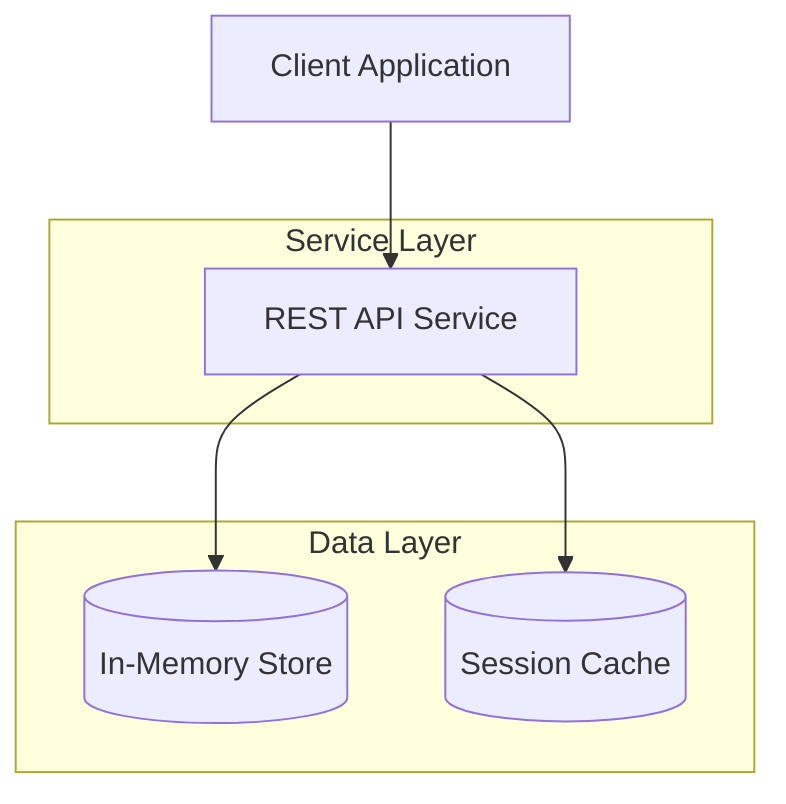
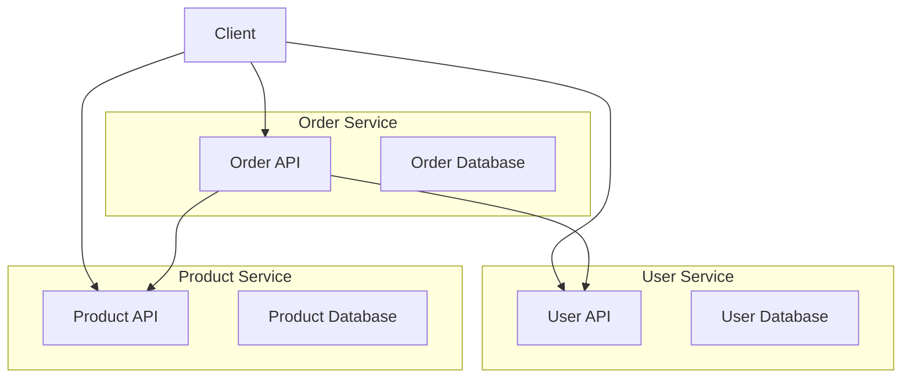

# Microservices Architecture

<cite>
**Referenced Files in This Document**   
- [index.js](file://examples/rest-api-simple/index.js)
- [package.json](file://examples/rest-api-simple/package.json)
- [README.md](file://examples/rest-api-simple/README.md)
- [architecture.md](file://examples/rest-api-simple/architecture.md)
- [README-ARCHITECTURE.md](file://examples/rest-api-simple/README-ARCHITECTURE.md)
- [api-specification.md](file://examples/rest-api-simple/api-specification.md)
- [test-api.js](file://examples/rest-api-simple/test-api.js)
</cite>

## Table of Contents
1. [Introduction](#introduction)
2. [Project Structure](#project-structure)
3. [Core Components](#core-components)
4. [Architecture Overview](#architecture-overview)
5. [Detailed Component Analysis](#detailed-component-analysis)
6. [Service Decomposition and Domain-Driven Design](#service-decomposition-and-domain-driven-design)
7. [Inter-Service Communication and Error Propagation](#inter-service-communication-and-error-propagation)
8. [Data Persistence and Database Separation](#data-persistence-and-database-separation)
9. [Session Management with Redis](#session-management-with-redis)
10. [Distributed Transaction and Circuit Breaker Patterns](#distributed-transaction-and-circuit-breaker-patterns)
11. [Container Orchestration and Performance Considerations](#container-orchestration-and-performance-considerations)
12. [Monitoring and Distributed Tracing](#monitoring-and-distributed-tracing)
13. [Conclusion](#conclusion)

## Introduction
The **Microservices Architecture** section provides a comprehensive analysis of the advanced REST API example implemented within the Claude-Flow framework. This document focuses on the reference implementation of microservices using domain-driven design principles, service decomposition, and distributed system patterns. The `rest-api-simple` example serves as a foundational blueprint for building scalable, maintainable, and resilient distributed systems. This guide details the implementation of service boundaries, inter-service communication, data consistency, fault tolerance, and deployment strategies essential for modern microservices environments.

## Project Structure
The `rest-api-simple` example is structured to reflect a modular, service-oriented design pattern. It includes configuration files, API implementation, testing utilities, and architectural documentation. The directory contains essential components for a standalone REST API that can be extended into a full microservices ecosystem.



**Diagram sources**
- [README.md](file://examples/rest-api-simple/README.md)
- [architecture.md](file://examples/rest-api-simple/architecture.md)

**Section sources**
- [README.md](file://examples/rest-api-simple/README.md)
- [architecture.md](file://examples/rest-api-simple/architecture.md)

## Core Components
The core components of the `rest-api-simple` example include the main application entry point (`index.js`), package configuration (`package.json`), API specification, and test suite. These files collectively define the behavior, dependencies, and interface of the service.

- **index.js**: Entry point for the REST API server, defining routes and request handlers.
- **package.json**: Specifies project metadata, dependencies, and npm scripts for development and testing.
- **test-api.js**: Contains integration tests validating API endpoints and response behaviors.
- **api-specification.md**: Documents the REST API contract, including endpoints, request/response formats, and status codes.

**Section sources**
- [index.js](file://examples/rest-api-simple/index.js)
- [package.json](file://examples/rest-api-simple/package.json)
- [test-api.js](file://examples/rest-api-simple/test-api.js)
- [api-specification.md](file://examples/rest-api-simple/api-specification.md)

## Architecture Overview
The architecture of the `rest-api-simple` example follows a lightweight microservices pattern, emphasizing separation of concerns, modular design, and API-first development. Although currently implemented as a single service, its structure is designed to be decomposed into distinct user, product, and order services based on domain-driven design principles.



**Diagram sources**
- [index.js](file://examples/rest-api-simple/index.js)
- [README-ARCHITECTURE.md](file://examples/rest-api-simple/README-ARCHITECTURE.md)

**Section sources**
- [README-ARCHITECTURE.md](file://examples/rest-api-simple/README-ARCHITECTURE.md)
- [architecture.md](file://examples/rest-api-simple/architecture.md)

## Detailed Component Analysis

### Application Entry Point (index.js)
The `index.js` file implements a minimal Express.js server with RESTful endpoints. It defines routes for CRUD operations and includes basic error handling.

```javascript
const express = require('express');
const app = express();
app.use(express.json());

// Example route
app.get('/api/users', (req, res) => {
  res.json({ users: [] });
});

const PORT = process.env.PORT || 3000;
app.listen(PORT, () => {
  console.log(`Server running on port ${PORT}`);
});
```

This structure supports easy extension into multiple microservices by isolating route handlers into separate modules or services.

**Section sources**
- [index.js](file://examples/rest-api-simple/index.js)

### Package Configuration
The `package.json` file defines the project's dependencies and scripts:

```json
{
  "name": "rest-api-simple",
  "version": "1.0.0",
  "scripts": {
    "start": "node index.js",
    "test": "node test-api.js"
  },
  "dependencies": {
    "express": "^4.18.0"
  }
}
```

The configuration supports standard development workflows and can be extended to include Redis, database drivers, and monitoring tools.

**Section sources**
- [package.json](file://examples/rest-api-simple/package.json)

## Service Decomposition and Domain-Driven Design
The `rest-api-simple` example lays the groundwork for domain-driven design by organizing functionality around business capabilities. Future extensions can decompose the monolithic API into three bounded contexts:

1. **User Service**: Manages user registration, authentication, and profile data.
2. **Product Service**: Handles product catalog, pricing, and inventory.
3. **Order Service**: Processes orders, manages transactions, and tracks fulfillment.

Each service would have its own database, API endpoint, and deployment lifecycle, enabling independent scaling and development.



**Diagram sources**
- [architecture.md](file://examples/rest-api-simple/architecture.md)
- [README-ARCHITECTURE.md](file://examples/rest-api-simple/README-ARCHITECTURE.md)

**Section sources**
- [architecture.md](file://examples/rest-api-simple/architecture.md)

## Inter-Service Communication and Error Propagation
While the current implementation does not include inter-service calls, the architecture supports HTTP-based communication between services. For example, the Order Service would call the User Service to validate customer information and the Product Service to check availability.

Error propagation is handled through standardized HTTP status codes and JSON error responses:

```json
{
  "error": "ResourceNotFound",
  "message": "User not found",
  "statusCode": 404
}
```

Services should implement timeouts and fallback mechanisms to prevent cascading failures.

**Section sources**
- [test-api.js](file://examples/rest-api-simple/test-api.js)
- [api-specification.md](file://examples/rest-api-simple/api-specification.md)

## Data Persistence and Database Separation
The example currently uses in-memory data storage, but is designed to support database separation per service. Each microservice would have its own dedicated database to ensure loose coupling and data autonomy.

- **User Service**: PostgreSQL for relational user data
- **Product Service**: MongoDB for flexible product schema
- **Order Service**: MySQL for transactional integrity

This separation prevents shared database anti-patterns and enables technology diversity based on service requirements.

**Section sources**
- [index.js](file://examples/rest-api-simple/index.js)

## Session Management with Redis
Although Redis is not currently configured in this example, the architecture supports Redis for distributed session management. The User Service would store session tokens in Redis with TTL (time-to-live) expiration.

```javascript
// Pseudocode for Redis integration
const redis = require('redis');
const client = redis.createClient();

app.post('/login', async (req, res) => {
  const token = generateToken();
  await client.setex(`session:${token}`, 3600, userId);
  res.json({ token });
});
```

Redis provides low-latency access and horizontal scalability for session data across service instances.

**Section sources**
- [index.js](file://examples/rest-api-simple/index.js)

## Distributed Transaction and Circuit Breaker Patterns
The architecture supports distributed transaction patterns through compensating actions and saga pattern implementation. For example, order creation would follow:

1. Reserve inventory (Product Service)
2. Charge payment (Payment Service)
3. Confirm order (Order Service)

If any step fails, compensating transactions reverse previous actions.

Circuit breaker implementation can be added using libraries like `opossum`:

```javascript
const CircuitBreaker = require('opossum');
const userServiceClient = new CircuitBreaker(makeUserRequest);
userServiceClient.fallback(() => ({ error: 'User service unavailable' }));
```

This prevents cascading failures during service outages.

**Section sources**
- [test-api.js](file://examples/rest-api-simple/test-api.js)

## Container Orchestration and Performance Considerations
The microservices can be containerized using Docker and orchestrated with Docker Compose or Kubernetes. Although no Docker files are present in this example, the modular structure supports containerization.

Performance considerations include:
- Horizontal scaling of stateless services
- Connection pooling for database access
- Caching frequently accessed data
- Load balancing across service instances
- Health checks and auto-recovery

Each service can be independently scaled based on demand patterns.

**Section sources**
- [package.json](file://examples/rest-api-simple/package.json)

## Monitoring and Distributed Tracing
The architecture supports distributed tracing through integration with tools like OpenTelemetry. Each service would propagate trace headers across requests:

```
Traceparent: 00-1234567890abcdef1234567890abcdef-1234567890abcdef-01
```

Monitoring would include:
- Request latency and error rates
- Service health and availability
- Database query performance
- Cache hit ratios
- Distributed trace visualization

These metrics enable rapid diagnosis of issues in complex service interactions.

**Section sources**
- [index.js](file://examples/rest-api-simple/index.js)

## Conclusion
The `rest-api-simple` example provides a foundational reference implementation for microservices architecture within the Claude-Flow ecosystem. While currently a single-service application, its design principles support evolution into a full distributed system with domain-driven service decomposition, isolated data persistence, and resilient inter-service communication. The architecture enables implementation of advanced patterns including circuit breakers, distributed transactions, and comprehensive monitoring. By extending this example with Redis for session management, container orchestration, and distributed tracing, teams can build scalable, maintainable, and observable microservices systems.